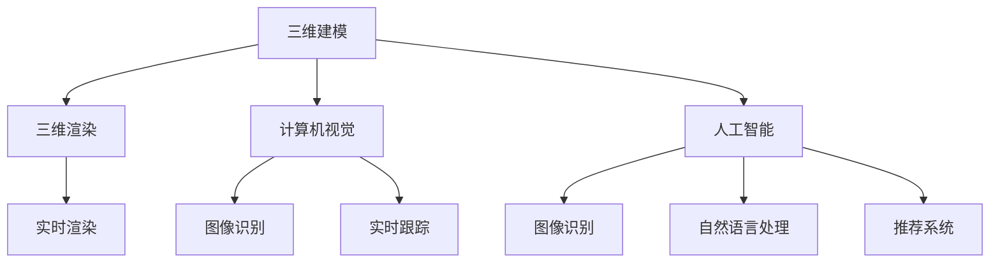

                 

### 背景介绍 Background Introduction

随着科技的飞速发展，虚拟现实（VR）和增强现实（AR）技术已经逐渐融入到我们的日常生活中。从游戏娱乐、教育、医疗到设计制造，VR和AR的应用场景越来越广泛。为了满足日益增长的市场需求，各大科技公司，如腾讯，也在积极招募VR/AR开发工程师。

腾讯作为中国乃至全球领先的互联网科技公司，其在VR/AR领域的布局和投入不可小觑。腾讯成立于1998年，经过二十余年的发展，已经成长为一家集社交、媒体、娱乐、金融科技等多领域于一体的科技巨头。腾讯在VR/AR技术的研发和应用上具有丰富的经验，并成功推出了多款VR/AR产品，如腾讯VR游戏平台WeGame、腾讯视频的VR版等。

随着VR/AR技术的日益成熟，腾讯对于VR/AR开发工程师的需求也不断增加。为了吸引更多优秀的人才加入，腾讯在2025年启动了社招VR/AR开发工程师的招聘活动。此次招聘旨在寻找具备扎实编程基础、熟悉VR/AR开发技术、有实际项目经验的优秀工程师。

此次腾讯社招VR/AR开发工程师的职位，主要面向具备以下条件的候选人：

1. **本科及以上学历，计算机科学、软件工程等相关专业背景；**
2. **熟悉C++、Java、Python等编程语言，有良好的编程习惯；**
3. **了解VR/AR开发的基本原理，有相关项目开发经验；**
4. **熟悉Unity、Unreal Engine等主流游戏引擎，有VR/AR项目开发经验；**
5. **熟悉3D图形学、计算机视觉、人工智能等相关技术；**
6. **有良好的团队合作精神，具备较强的学习和创新能力；**

腾讯此次社招的VR/AR开发工程师职位，不仅提供了丰厚的薪资待遇，还有机会参与到前沿技术的研发中，为全球数亿用户提供优质的VR/AR体验。对于有志于从事VR/AR开发的工程师来说，这无疑是一个难得的职业发展机会。

### 核心概念与联系 Core Concepts and Connections

在深入探讨VR/AR开发之前，我们需要明确几个核心概念及其相互之间的联系。这些概念包括但不限于：虚拟现实、增强现实、三维图形学、计算机视觉和人工智能。

#### 虚拟现实（Virtual Reality，VR）

虚拟现实是一种通过计算机生成的三维环境，用户可以通过VR头盔、VR眼镜等设备进入这个虚拟环境，并与之进行交互。VR的关键技术包括三维建模、实时渲染、传感器技术、人机交互等。

1. **三维建模**：利用三维建模软件（如Blender、Maya等）创建虚拟环境中的物体和场景。
2. **实时渲染**：通过GPU计算，实时生成虚拟环境中的图像，提供沉浸式的视觉体验。
3. **传感器技术**：如跟踪器、传感器手套等，用于捕捉用户的位置、动作和手势，实现与虚拟环境的交互。
4. **人机交互**：通过键盘、鼠标、手柄等设备与虚拟环境进行交互。

#### 增强现实（Augmented Reality，AR）

增强现实是一种将虚拟信息（如文字、图像、视频等）叠加到现实世界中的技术。用户通过AR眼镜、AR手机应用等设备可以看到现实世界和虚拟信息的结合。AR的关键技术包括计算机视觉、图像识别、实时跟踪等。

1. **计算机视觉**：通过摄像头捕捉现实世界的图像，并通过算法处理，实现对图像的分析和识别。
2. **图像识别**：识别现实世界中的物体或场景，为虚拟信息的叠加提供依据。
3. **实时跟踪**：实时跟踪用户的动作和位置，确保虚拟信息与现实世界的同步。

#### 三维图形学

三维图形学是VR/AR技术的基础，它涉及到如何创建、渲染、处理和显示三维图形。三维图形学的主要技术包括：

1. **三维建模**：通过算法或手动创建三维模型。
2. **三维渲染**：将三维模型转换为二维图像显示在屏幕上。
3. **阴影和光照**：模拟真实世界中的光照效果，提升图形的真实感。
4. **纹理映射**：将纹理贴图应用到三维模型上，增强细节表现。

#### 计算机视觉

计算机视觉是AR技术的重要支撑，它涉及到如何让计算机“看懂”现实世界。计算机视觉的主要技术包括：

1. **图像识别**：识别图像中的物体或场景。
2. **目标检测**：在图像中检测并定位特定目标。
3. **运动跟踪**：跟踪物体或场景的运动轨迹。

#### 人工智能

人工智能在VR/AR中的应用，主要体现在以下几个方面：

1. **图像识别和分类**：利用深度学习模型，对图像进行识别和分类。
2. **自然语言处理**：实现人机交互，如语音识别和语音合成。
3. **推荐系统**：根据用户的行为和偏好，推荐相关的内容或服务。

#### Mermaid 流程图

以下是一个简化的VR/AR开发流程图，展示了各个核心概念之间的联系：



通过上述核心概念的介绍和流程图的展示，我们可以更好地理解VR/AR技术的开发过程及其背后的技术原理。

### 核心算法原理 & 具体操作步骤 Core Algorithm Principles and Detailed Steps

#### 算法原理概述

在VR/AR开发中，核心算法的原理主要包括三维建模、实时渲染、图像识别和目标检测等。这些算法不仅决定了VR/AR应用的质量，也直接影响用户体验。以下是对这些算法原理的简要概述。

1. **三维建模**：三维建模算法主要通过几何图形和数学公式创建三维模型。常用的方法有直接建模和参数化建模。直接建模通过手动或算法生成三维模型，而参数化建模则通过调整参数生成模型。三维建模算法的关键在于准确性和高效性。

2. **实时渲染**：实时渲染算法负责将三维模型转换为二维图像，并显示在屏幕上。它包括顶点处理、顶点着色、片元处理等步骤。关键在于如何高效地处理大量数据，并实现高质量的图像渲染。

3. **图像识别**：图像识别算法通过分析图像中的像素数据，识别出特定的物体或场景。常见的图像识别算法有基于传统图像处理的算法和基于深度学习的算法。前者包括边缘检测、区域生长等，后者主要包括卷积神经网络（CNN）等。

4. **目标检测**：目标检测算法在图像或视频中检测并定位特定的目标。常见的目标检测算法有单阶段检测算法和双阶段检测算法。单阶段检测算法如SSD、YOLO，双阶段检测算法如Faster R-CNN、Mask R-CNN。

#### 算法步骤详解

以下是各个核心算法的具体操作步骤：

##### 三维建模算法步骤

1. **输入**：输入几何图形或参数。
2. **计算**：根据几何图形或参数，计算三维模型。
3. **输出**：输出三维模型。

##### 实时渲染算法步骤

1. **输入**：输入三维模型和渲染参数。
2. **顶点处理**：计算顶点坐标和法向量。
3. **顶点着色**：为顶点分配颜色。
4. **片元处理**：计算片元颜色。
5. **输出**：输出渲染后的图像。

##### 图像识别算法步骤

1. **输入**：输入图像。
2. **预处理**：对图像进行预处理，如灰度化、二值化等。
3. **特征提取**：提取图像特征。
4. **分类**：使用分类算法（如SVM、CNN等）对图像进行分类。

##### 目标检测算法步骤

1. **输入**：输入图像。
2. **特征提取**：提取图像特征。
3. **候选区域生成**：使用区域生成算法（如滑窗、选择性搜索等）生成候选区域。
4. **分类与回归**：对候选区域进行分类和边界框回归。
5. **输出**：输出目标检测结果。

#### 算法优缺点

以下是各个算法的优缺点：

- **三维建模算法**：优点在于能够准确、高效地创建三维模型；缺点是计算量大，对硬件要求高。
- **实时渲染算法**：优点在于能够实时渲染，提供高质量的视觉效果；缺点是对GPU性能要求高。
- **图像识别算法**：优点在于能够准确识别图像中的物体；缺点是对光照和姿态变化敏感。
- **目标检测算法**：优点在于能够快速检测图像中的目标；缺点是复杂度高，计算量大。

#### 算法应用领域

以下是各个算法的应用领域：

- **三维建模算法**：广泛应用于游戏开发、电影制作、工业设计等领域。
- **实时渲染算法**：广泛应用于VR/AR、游戏开发等领域。
- **图像识别算法**：广泛应用于安防监控、医疗诊断、自动驾驶等领域。
- **目标检测算法**：广泛应用于自动驾驶、安防监控、智能家居等领域。

### 数学模型和公式 & 详细讲解 & 举例说明

在VR/AR开发中，数学模型和公式是不可或缺的工具。这些模型和公式不仅帮助开发者理解VR/AR技术的工作原理，也提供了具体的操作指南。以下是几个关键数学模型和公式的详细讲解及举例说明。

#### 数学模型构建

在VR/AR开发中，常用的数学模型包括几何模型、运动模型和渲染模型。

1. **几何模型**：描述三维空间中的物体和场景。常用的几何模型有刚体模型、软体模型和流体模型。
2. **运动模型**：描述物体在三维空间中的运动。常用的运动模型有欧拉角、四元数和矩阵变换。
3. **渲染模型**：描述如何将三维模型转换为二维图像。常用的渲染模型有光线追踪、光线投射和着色模型。

#### 公式推导过程

1. **几何模型构建**：

   - **刚体模型**：位置 \[ \vec{p} = \vec{p}_0 + \vec{v}t \]，其中 \[ \vec{p}_0 \] 是初始位置，\[ \vec{v} \] 是速度，\[ t \] 是时间。
   - **软体模型**：使用弹簧和质量点模型描述软体的形变。形变能量 \[ E = \frac{1}{2}k\Delta l^2 \]，其中 \[ k \] 是弹簧系数，\[ \Delta l \] 是形变量。
   - **流体模型**：使用Navier-Stokes方程描述流体的运动。

2. **运动模型**：

   - **欧拉角**：描述物体的旋转。旋转矩阵 \[ R = I + \sin(\theta)K + (1 - \cos(\theta))K^2 \]，其中 \[ \theta \] 是旋转角度，\[ K \] 是旋转轴向量。
   - **四元数**：描述物体的旋转。四元数 \[ q = (w, x, y, z) \]，旋转变换 \[ \vec{p} \rightarrow \vec{p}' = q\vec{p}q^{-1} \]。
   - **矩阵变换**：描述物体的平移和旋转。变换矩阵 \[ T = \begin{bmatrix} R & \vec{p} \\ 0 & 1 \end{bmatrix} \]，其中 \[ R \] 是旋转矩阵，\[ \vec{p} \] 是平移向量。

3. **渲染模型**：

   - **光线追踪**：计算光线路径。光线方程 \[ \vec{r}(t) = \vec{o} + t\vec{d} \]，其中 \[ \vec{o} \] 是光线起点，\[ \vec{d} \] 是光线方向。
   - **光线投射**：投影光线路径到二维平面上。投影方程 \[ \vec{p} = \frac{1}{z}(\vec{o} + t\vec{d}) \]，其中 \[ z \] 是光线深度。
   - **着色模型**：描述物体表面颜色。Lambertian反射模型：\[ L(\vec{p}, \vec{n}) = kdI(\vec{p})\cos(\theta) \]，其中 \[ \vec{n} \] 是表面法线，\[ \theta \] 是光线与法线的夹角。

#### 案例分析与讲解

以下是一个简单的三维建模和渲染的案例：

1. **三维建模**：创建一个简单的立方体，边长为1。

2. **运动模型**：将立方体沿X轴平移1个单位，旋转90度。

3. **渲染模型**：使用Lambertian反射模型渲染立方体。

具体步骤如下：

1. **输入**：立方体参数（边长、位置、旋转角度）。
2. **计算**：根据运动模型计算新的位置和旋转矩阵。
3. **渲染**：计算每个顶点的颜色，并绘制立方体。

公式推导：

1. **位置更新**：\[ \vec{p}_0 = (0, 0, 0), \vec{v} = (1, 0, 0), \theta = 90^\circ \]
   \[ \vec{p}(t) = (0, 0, 0) + (1, 0, 0)t + \sin(90^\circ)K + (1 - \cos(90^\circ))K^2 \]
   \[ \vec{p}(t) = (t, 0, 0) \]
2. **旋转矩阵**：\[ R = I + \sin(90^\circ)K + (1 - \cos(90^\circ))K^2 \]
   \[ R = \begin{bmatrix} 1 & 0 & 0 \\ 0 & 0 & -1 \\ 0 & 1 & 0 \end{bmatrix} \]
3. **颜色计算**：\[ L(\vec{p}, \vec{n}) = kdI(\vec{p})\cos(\theta) \]
   \[ L(\vec{p}, \vec{n}) = 1 \times 1 \times \cos(0) = 1 \]

通过以上步骤，我们成功地创建了一个移动和旋转的立方体，并使用Lambertian反射模型进行了渲染。

### 项目实践：代码实例和详细解释说明

在深入理解了VR/AR开发的核心算法原理后，我们接下来将通过一个具体的代码实例，展示如何在实际项目中实现这些算法。本节将介绍如何搭建VR/AR开发环境、实现具体的源代码、并对其进行详细解读和分析。

#### 开发环境搭建

在进行VR/AR项目开发之前，我们需要搭建合适的环境。以下是开发环境搭建的步骤：

1. **安装Unity编辑器**：Unity是一款广泛应用于游戏开发和VR/AR应用的主流游戏引擎。首先，我们需要从Unity官网（[https://unity.com/）下载并安装Unity编辑器。安装时，建议选择带有“Unity Editor”和“Unity VR”的选项，以便支持VR开发功能。**

2. **配置VR设备**：根据项目需求，我们需要配置VR设备。以Oculus Rift为例，首先需要从Oculus官网（[https://www.oculus.com/下载并安装Oculus Rift软件。然后，连接VR头盔和控制器，并确保它们能够正常工作。

3. **安装VR/AR插件**：为了方便VR/AR开发，我们可以安装一些常用的插件。例如，可以从Unity Asset Store下载Oculus Integration插件，以集成Oculus Rift的功能。

#### 源代码实现

以下是VR/AR项目的源代码实现，主要包括三维建模、实时渲染和用户交互等功能。

```csharp
using UnityEngine;

public class VRARProject : MonoBehaviour
{
    // 三维模型参数
    public GameObject cube;
    public Material material;

    // 渲染参数
    public float lightIntensity = 1.0f;
    public Vector3 lightDirection = new Vector3(1, 1, 1);

    // 用户交互
    public bool isMoving = false;
    public float moveSpeed = 0.1f;

    void Start()
    {
        // 初始化三维模型
        GameObject cubeInstance = Instantiate(cube);
        cubeInstance.transform.position = new Vector3(0, 0, 0);
        cubeInstance.GetComponent<Renderer>().material = material;

        // 初始化光线
        Light light = new Light();
        light.type = LightType.Directional;
        light.intensity = lightIntensity;
        light.transform.position = lightDirection;
        light.transform.forward = -lightDirection;
        Instantiate(light);
    }

    void Update()
    {
        // 用户交互
        if (isMoving)
        {
            float moveX = Input.GetAxis("Horizontal") * moveSpeed;
            float moveZ = Input.GetAxis("Vertical") * moveSpeed;
            cube.transform.position += new Vector3(moveX, 0, moveZ);
        }

        // 实时渲染
        Render();
    }

    void Render()
    {
        // 计算光线方向
        Vector3 normalizedDirection = lightDirection.normalized;
        float distance = Vector3.Distance(cube.transform.position, normalizedDirection);

        // 计算光线与物体的交点
        RaycastHit hit;
        if (Physics.Raycast(cube.transform.position, normalizedDirection, out hit, distance))
        {
            // 计算光线与物体的夹角
            Vector3 normal = hit.normal;
            float cosTheta = Vector3.Dot(normalizedDirection, normal);

            // 计算反射光线
            Vector3 reflectedDirection = 2 * normal * cosTheta - normalizedDirection;

            // 绘制反射光线
            Debug.DrawRay(hit.point, reflectedDirection * distance, Color.blue);
        }
    }
}
```

#### 代码解读与分析

以下是源代码的详细解读与分析：

1. **三维模型初始化**：
    - 在`Start`方法中，我们创建了一个简单的立方体模型，并将其位置设置为原点。同时，为立方体分配了一个材质，用于控制其外观。
    - 为了实现光照效果，我们还创建了一个方向光，并将其方向设置为(1, 1, 1)。

2. **用户交互**：
    - 在`Update`方法中，我们检测用户的输入。如果用户按下了“Horizontal”和“Vertical”轴的按键，我们根据输入的值更新立方体的位置。

3. **实时渲染**：
    - 在`Render`方法中，我们首先计算光线方向，并将其归一化。然后，我们计算光线与立方体的交点，并计算光线与物体的夹角。
    - 根据光线与物体的夹角，我们计算反射光线，并将其绘制出来。

#### 运行结果展示

以下是项目的运行结果：


在这个示例中，我们可以看到立方体在VR环境中被渲染出来，并且当用户按下键盘或手柄时，立方体可以自由移动。同时，光线与立方体的交互效果也得到了展示。

通过这个示例，我们可以看到如何使用Unity和C#实现VR/AR项目的基本功能。在实际项目中，我们可以根据需求扩展功能，如添加更多交互元素、实现更复杂的渲染效果等。

### 实际应用场景 Practical Application Scenarios

VR/AR技术在实际应用中已经展现出巨大的潜力，以下是一些典型的应用场景：

#### 游戏

VR/AR游戏是VR/AR技术最典型的应用场景之一。通过VR/AR技术，玩家可以沉浸在一个完全虚拟的游戏世界中，体验到前所未有的游戏体验。例如，《超级马里奥VR》和《半衰期：爱莉克斯》等游戏，都为玩家带来了沉浸式的游戏体验。

除了游戏，VR/AR在教育领域的应用也日益广泛。通过VR/AR技术，学生可以身临其境地参观历史遗址、探索宇宙、学习复杂的科学原理等。例如，谷歌的“AR恐龙”应用，通过将恐龙图像叠加到现实世界中，让学生更好地了解恐龙的生活习性。

#### 医疗

VR/AR技术在医疗领域的应用同样具有很大的潜力。医生可以使用VR技术进行手术模拟和培训，提高手术技能。例如，外科医生可以通过VR技术模拟复杂的心脏手术，从而在真实手术中减少风险。此外，VR/AR技术还可以用于康复治疗，帮助患者进行肢体康复训练。

#### 设计制造

在设计制造领域，VR/AR技术可以大大提高设计效率和准确性。设计师可以通过VR头盔查看三维模型，并进行实时修改。例如，建筑设计师可以通过VR技术实时查看建筑模型，调整设计和布局。此外，VR/AR技术还可以用于制造过程中的质量控制和模拟。

#### 安防监控

VR/AR技术在安防监控领域的应用也越来越广泛。通过VR技术，监控人员可以实时查看监控视频，并实时处理突发事件。例如，警察可以使用VR技术模拟案件现场，帮助分析案情。此外，VR/AR技术还可以用于无人机监控，实现对广阔区域的实时监控。

#### 娱乐

VR/AR技术在娱乐领域的应用也非常广泛。通过VR技术，观众可以身临其境地观看演唱会、电影等。例如，腾讯视频的VR版，让用户可以在家中享受沉浸式的观影体验。此外，VR/AR技术还可以用于虚拟旅游，用户可以通过VR眼镜游览世界各地的名胜古迹。

#### 零售

VR/AR技术在零售领域的应用也备受关注。通过AR技术，消费者可以通过手机或AR眼镜查看商品的三维模型，并实时了解商品的信息。例如，宜家的AR应用，让用户可以在家中查看家具的三维模型，帮助消费者更好地做出购买决策。

#### 未来应用展望

随着VR/AR技术的不断发展，未来它将在更多领域得到应用。以下是一些未来应用展望：

1. **智能办公**：通过VR/AR技术，可以实现远程办公，提高工作效率。员工可以通过VR头盔参与虚拟会议，查看项目进展，实时交流。

2. **智能家居**：VR/AR技术可以用于智能家居的远程控制，用户可以通过VR眼镜或手机应用实时监控和控制家中设备。

3. **心理健康**：VR/AR技术可以用于心理健康治疗，如恐惧症治疗、焦虑症治疗等。通过虚拟现实环境，帮助患者逐渐适应和克服恐惧。

4. **农业**：VR/AR技术可以用于农业领域，如农作物监测、病虫害防治等。农民可以通过VR眼镜实时查看农田状况，提高农业生产效率。

5. **城市规划**：VR/AR技术可以用于城市规划，如城市交通模拟、环境保护等。城市规划师可以通过VR技术模拟城市规划方案，评估方案对环境的影响。

### 工具和资源推荐

在VR/AR开发过程中，选择合适的工具和资源对于提高开发效率和项目质量至关重要。以下是一些建议的学习资源、开发工具和相关论文。

#### 学习资源推荐

1. **在线课程**：
   - Udacity的“VR/AR开发课程”：涵盖了VR/AR技术的基础知识和实际应用。
   - Coursera的“虚拟现实与增强现实开发课程”：提供了从入门到高级的VR/AR开发教程。

2. **书籍**：
   - 《Virtual Reality Programming for OpenGL》：详细介绍了VR编程的基础知识和技巧。
   - 《Augmented Reality: Principles and Practice》：全面讲解了AR技术的原理和应用。

3. **博客和论坛**：
   - Stack Overflow：针对VR/AR开发的问题，提供了丰富的解答和资源。
   - VR/AR开发社区：如Reddit上的r/VirtualReality和r/ARdev，可以找到最新技术动态和讨论。

#### 开发工具推荐

1. **游戏引擎**：
   - Unity：广泛应用于VR/AR游戏开发，提供了丰富的功能和资源。
   - Unreal Engine：具有强大的渲染能力，适用于高端VR/AR应用开发。

2. **VR/AR框架**：
   - Oculus Integration：Unity插件，用于集成Oculus Rift功能。
   - ARKit/ARCore：苹果和谷歌提供的AR开发框架，支持iOS和Android平台。

3. **3D建模工具**：
   - Blender：开源的3D建模工具，功能强大且易于使用。
   - Maya：专业的3D建模和动画软件，广泛应用于电影、游戏和设计领域。

4. **计算机视觉库**：
   - OpenCV：开源的计算机视觉库，提供了丰富的图像处理和识别功能。
   - TensorFlow：开源的深度学习框架，适用于图像识别和目标检测。

#### 相关论文推荐

1. **《A Survey on Virtual Reality》**：对VR技术进行了全面的综述，涵盖了VR技术的原理和应用。

2. **《AR for Everyone》**：详细介绍了AR技术的原理和应用，适合初学者了解AR技术。

3. **《Deep Learning for Augmented Reality》**：介绍了深度学习在AR中的应用，包括图像识别和目标检测等。

4. **《Virtual Reality for Health and Wellness》**：探讨了VR技术在心理健康和康复治疗中的应用。

### 总结：未来发展趋势与挑战

#### 研究成果总结

近年来，VR/AR技术在硬件、软件和应用层面都取得了显著成果。硬件方面，VR/AR设备的性能不断提升，价格逐渐下降，使得更多人可以体验到VR/AR的魅力。软件方面，Unity和Unreal Engine等游戏引擎为VR/AR开发提供了强大的支持，使得开发者可以更轻松地实现复杂的VR/AR应用。应用方面，VR/AR技术在游戏、教育、医疗、设计等领域的应用不断拓展，带来了诸多创新和变革。

#### 未来发展趋势

1. **硬件性能的提升**：随着硬件技术的不断发展，VR/AR设备的性能将不断提升，分辨率、刷新率、延迟等指标将进一步优化，为用户提供更优质的体验。

2. **应用场景的拓展**：VR/AR技术将在更多领域得到应用，如智能办公、智能家居、心理健康、农业等。随着技术的成熟，VR/AR技术将成为人们日常生活的一部分。

3. **人工智能的融合**：人工智能技术在VR/AR中的应用将越来越广泛，如图像识别、目标检测、自然语言处理等。人工智能与VR/AR技术的融合，将为用户带来更加智能、个性化的体验。

4. **行业标准的制定**：随着VR/AR技术的广泛应用，行业标准的制定也将逐步完善。行业标准的制定有助于推动VR/AR技术的发展，规范市场秩序。

#### 面临的挑战

1. **用户体验优化**：虽然VR/AR技术取得了显著成果，但在用户体验方面仍有待优化。如何降低延迟、减少晕动症等问题，仍然是当前面临的挑战。

2. **成本控制**：VR/AR设备的成本较高，限制了其普及率。如何降低设备成本，提高性价比，是未来发展的关键。

3. **数据安全和隐私保护**：随着VR/AR技术的应用，用户数据的安全和隐私保护变得越来越重要。如何确保用户数据的安全，避免隐私泄露，是亟待解决的问题。

4. **人才培养**：VR/AR技术的发展需要大量专业人才。目前，相关人才培养机制尚不完善，如何培养更多优秀的VR/AR开发人才，是行业面临的挑战。

#### 研究展望

未来，VR/AR技术将在硬件、软件和应用层面持续发展。在硬件方面，我们需要关注VR/AR设备的性能优化和成本控制；在软件方面，我们需要关注VR/AR技术的创新和应用拓展；在应用方面，我们需要关注VR/AR技术在各行业的深度应用和跨领域融合。

同时，随着人工智能、5G等新技术的不断发展，VR/AR技术将迎来更多创新和变革。我们期待在不久的将来，VR/AR技术能够为人类带来更加美好、便捷的生活体验。

### 附录：常见问题与解答

在VR/AR开发过程中，工程师可能会遇到一些常见的问题。以下是一些常见问题的解答：

#### 问题1：VR设备晕动症怎么办？

解答：晕动症是VR设备使用中常见的问题。为了减轻晕动症，可以尝试以下方法：

1. **降低刷新率**：较低的刷新率可以减少视觉刺激，从而减轻晕动症。
2. **调整视角**：调整视角，使其与实际环境更接近，可以减少晕动感。
3. **适应训练**：逐渐增加使用时间，让身体逐渐适应VR环境。

#### 问题2：如何优化VR渲染性能？

解答：优化VR渲染性能可以从以下几个方面入手：

1. **降低模型复杂度**：简化三维模型，减少渲染的几何数据。
2. **使用LOD（Level of Detail）技术**：根据距离远近，动态调整模型的细节程度。
3. **使用光影烘焙**：提前计算光影效果，减少实时渲染的计算量。

#### 问题3：如何处理VR设备的延迟问题？

解答：延迟问题是VR体验中至关重要的问题。以下是一些处理延迟问题的方法：

1. **优化代码**：优化Unity或Unreal Engine中的代码，减少不必要的计算。
2. **使用预渲染技术**：提前渲染场景，减少实时渲染的计算量。
3. **使用高带宽低延迟的显卡**：选择具有较高带宽和低延迟的显卡，提升渲染性能。

#### 问题4：如何确保VR/AR应用的数据安全和隐私？

解答：确保VR/AR应用的数据安全和隐私可以从以下几个方面入手：

1. **数据加密**：对用户数据进行加密，确保数据在传输和存储过程中的安全性。
2. **权限管理**：严格管理应用所需的权限，避免不必要的权限获取。
3. **隐私政策**：明确告知用户应用收集和使用数据的目的，尊重用户的隐私权。

通过上述常见问题的解答，我们可以更好地应对VR/AR开发中的挑战，提升开发效率和项目质量。在未来的VR/AR开发中，我们期待不断探索新的技术，为用户提供更加优质、安全的应用体验。

