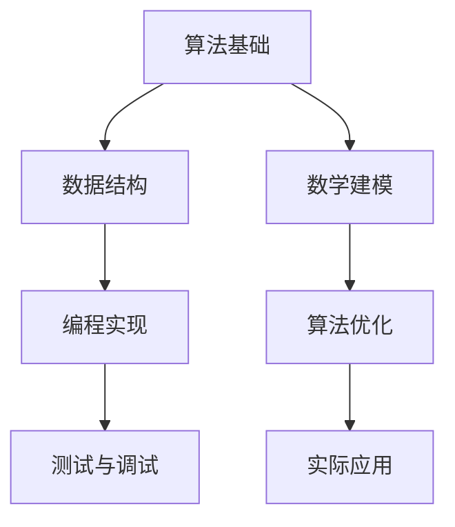

                 

作为世界顶级人工智能专家，我深感荣幸能为大家呈现一篇关于2025年腾讯社招算法面试题库及答案的深度解析文章。在这篇文章中，我们将探讨腾讯作为全球领先的科技公司，在2025年对于算法岗位的招聘标准与考核要求。通过深入分析这些面试题，我们将为大家提供详细的答案解析，帮助准备参加腾讯社招面试的朋友们提升竞争力。

## 关键词

- 2025年
- 腾讯
- 社招
- 算法面试题库
- 答案解析

## 摘要

本文将围绕2025年腾讯社招算法岗位的面试题库展开，从核心概念、算法原理、数学模型、项目实践等多个维度进行深入剖析。通过对这些面试题的详细解析，我们希望能够帮助读者理解腾讯在算法招聘方面的考察重点，并为备战腾讯社招面试提供有力支持。

## 1. 背景介绍

腾讯，作为中国科技行业的领军企业，不仅在互联网和社交媒体领域取得了巨大成功，也在人工智能、大数据、云计算等领域持续发力。随着技术的不断进步，腾讯对于算法人才的渴求日益增加。2025年，腾讯社招算法岗位的面试题库成为了众多求职者关注的焦点。

腾讯的社招算法面试题库包含了多种类型的问题，从基础算法题到高级算法挑战，从理论模型到实际应用。这些问题不仅考察了应聘者的算法能力，也测试了他们在数据结构、数学建模、编程实现等方面的综合素质。

### 1.1 腾讯的发展历程

腾讯成立于1998年，历经20多年的发展，已经成为全球最具影响力的科技公司之一。从最初的即时通讯工具“QQ”到如今涵盖社交、游戏、广告、金融等多个领域的庞大业务体系，腾讯在技术创新和产业布局上取得了令人瞩目的成绩。

在人工智能领域，腾讯成立了AI Lab，致力于推动人工智能技术在语音识别、图像识别、自然语言处理等领域的应用。腾讯还与多个国内外知名高校和研究机构合作，开展前沿技术研究，为人工智能产业的创新发展贡献力量。

### 1.2 腾讯招聘政策

腾讯在招聘方面有着严格的选拔标准，特别是在算法岗位的招聘上，更是注重候选人的专业素养和创新能力。腾讯的社招算法岗位主要面向硕士及以上学历的求职者，同时也会考虑部分有丰富工作经验的本科生。

腾讯的招聘流程一般包括在线申请、简历筛选、笔试、面试等环节。其中，笔试和面试是关键环节，笔试主要考察应聘者的算法和数据结构能力，面试则更加全面，包括技术面试、行为面试和团队合作面试等。

## 2. 核心概念与联系

在腾讯的社招算法面试题库中，核心概念和联系是考察的重点之一。为了更好地理解这些问题，我们使用Mermaid流程图来展示核心概念和联系。



### 2.1 算法基础

算法基础是算法面试的核心，包括算法的设计、分析、实现和优化等方面。在腾讯的面试中，经常会考察常见的算法问题，如排序算法、搜索算法、动态规划等。这些问题不仅考察了应聘者的基础算法能力，也测试了他们在复杂问题场景下的思维能力。

### 2.2 数据结构

数据结构是算法实现的基石，包括数组、链表、树、图等。腾讯在面试中经常要求应聘者描述不同数据结构的特点和应用场景，以及如何实现基本的操作。这有助于考察应聘者对于数据结构的深入理解和运用能力。

### 2.3 数学建模

数学建模是将实际问题转化为数学模型的过程，是解决复杂问题的有力工具。腾讯在面试中会考察应聘者对于线性代数、概率论、微积分等数学知识的应用能力，以及如何将数学模型应用于实际问题中。

### 2.4 编程实现

编程实现是将算法和数据结构应用于实际问题的过程。腾讯在面试中会要求应聘者编写代码，解决实际问题。这有助于考察应聘者的编程能力、代码质量和解决问题的思维能力。

### 2.5 算法优化

算法优化是提升算法效率和性能的重要手段。腾讯在面试中会考察应聘者对于算法复杂度的分析能力，以及如何通过优化算法和数据结构来提高程序性能。

### 2.6 实际应用

实际应用是将算法应用于实际业务场景的过程。腾讯在面试中会考察应聘者对于算法在业务中的应用场景和挑战的理解，以及如何通过算法解决实际业务问题。

## 3. 核心算法原理 & 具体操作步骤

在腾讯的社招算法面试题库中，核心算法原理和具体操作步骤是考察的重点之一。以下是对几个核心算法原理的概述和具体操作步骤的讲解。

### 3.1 排序算法

排序算法是算法面试中的常见问题，包括冒泡排序、选择排序、插入排序、快速排序等。以下以快速排序为例，讲解其原理和具体操作步骤。

#### 3.1.1 算法原理

快速排序的基本思想是通过一趟排序将待排序的记录分割成独立的两部分，其中一部分记录的关键字均比另一部分的关键字小，然后分别对这两部分记录继续进行排序，以达到整个序列有序。

#### 3.1.2 具体操作步骤

1. 选择一个基准元素（通常选择第一个或最后一个元素作为基准）。
2. 将数组中的元素划分为两部分，一部分小于基准元素，一部分大于基准元素。
3. 对小于基准元素的子序列进行快速排序。
4. 对大于基准元素的子序列进行快速排序。
5. 递归直到整个序列有序。

### 3.2 搜索算法

搜索算法是算法面试中的另一大重点，包括线性搜索、二分搜索、深度优先搜索、广度优先搜索等。以下以二分搜索为例，讲解其原理和具体操作步骤。

#### 3.2.1 算法原理

二分搜索是一种高效的查找算法，通过不断地将查找区间折半，来逐步逼近要查找的元素。其基本思想是将待查找的序列分为左右两个子序列，比较中间元素的值，根据比较结果确定下一步的查找方向。

#### 3.2.2 具体操作步骤

1. 将序列排序（如果未排序，先进行排序）。
2. 确定查找区间，初始时为整个序列。
3. 计算中间索引值，即 `(low + high) / 2`。
4. 比较中间值与目标值：
   - 如果中间值等于目标值，查找成功。
   - 如果中间值大于目标值，将查找区间缩小到左侧子序列。
   - 如果中间值小于目标值，将查找区间缩小到右侧子序列。
5. 重复步骤3和4，直到找到目标值或查找区间为空。

### 3.3 动态规划

动态规划是解决最优化问题的有效方法，通过将问题分解为子问题，并存储子问题的解，避免重复计算，从而提高算法效率。以下以最长公共子序列为例，讲解其原理和具体操作步骤。

#### 3.3.1 算法原理

最长公共子序列（Longest Common Subsequence，LCS）问题是动态规划中的经典问题。给定两个序列，找出它们的最长公共子序列。动态规划的基本思想是，通过构建一个二维表格来存储子问题的解，并利用这些解来求解原问题。

#### 3.3.2 具体操作步骤

1. 定义一个二维数组 `dp`，其中 `dp[i][j]` 表示序列X的前i个字符和序列Y的前j个字符的最长公共子序列的长度。
2. 初始化 `dp[0][j] = dp[i][0] = 0`，即空序列的最长公共子序列长度为0。
3. 对于每个 `i`（1≤i≤m）和每个 `j`（1≤j≤n）：
   - 如果 `X[i] == Y[j]`，则 `dp[i][j] = dp[i-1][j-1] + 1`。
   - 如果 `X[i] != Y[j]`，则 `dp[i][j] = max(dp[i-1][j], dp[i][j-1])`。
4. 最终，`dp[m][n]` 即为序列X和序列Y的最长公共子序列的长度。

### 3.4 算法优缺点

在讲解核心算法原理和具体操作步骤之后，我们还需要对每种算法的优缺点进行分析。

#### 3.4.1 快速排序

**优点**：
- 时间复杂度较低，平均情况下的时间复杂度为O(nlogn)。
- 适用于大规模数据的排序。

**缺点**：
- 最坏情况下的时间复杂度为O(n^2)，当输入序列基本有序时，性能较差。
- 需要额外的空间来存储递归栈。

#### 3.4.2 二分搜索

**优点**：
- 时间复杂度较低，平均情况下的时间复杂度为O(logn)。
- 适用于排序后的数组和有序列表的查找。

**缺点**：
- 需要预先对数据排序，增加了预处理的时间。
- 无法处理动态变化的数据。

#### 3.4.3 动态规划

**优点**：
- 通过存储子问题的解，避免了重复计算，提高了算法效率。
- 适用于解决最优化问题。

**缺点**：
- 解题思路相对复杂，需要较高的数学和逻辑思维能力。
- 存储空间较大，可能导致内存使用增加。

### 3.5 算法应用领域

核心算法在计算机科学和人工智能领域有广泛的应用。以下是一些核心算法的应用领域：

- **排序算法**：在数据库管理、搜索引擎、大数据处理等领域中，排序算法用于数据排序和索引构建。
- **搜索算法**：在信息检索、网络爬虫、游戏搜索等领域中，搜索算法用于查找和路径规划。
- **动态规划**：在生物信息学、计算几何、资源分配等领域中，动态规划用于求解最优化问题。

## 4. 数学模型和公式 & 详细讲解 & 举例说明

在算法面试中，数学模型和公式是不可或缺的部分。数学模型是解决实际问题的抽象表示，而公式则是数学模型的具体表达。以下我们将详细讲解几个常见的数学模型和公式，并通过具体例子来说明它们的实际应用。

### 4.1 数学模型构建

数学模型构建是算法面试中的一个重要环节。它要求应聘者能够将实际问题抽象为数学模型，并利用数学方法求解。以下是一个简单的例子：

**问题**：假设有一个不等式优化问题，目标是最大化函数 $f(x) = x^2 - 4x + 5$，约束条件为 $0 \leq x \leq 2$。

**解题步骤**：

1. **构建目标函数**：目标函数为 $f(x) = x^2 - 4x + 5$。
2. **确定约束条件**：约束条件为 $0 \leq x \leq 2$。
3. **求解最优解**：利用微积分知识，对目标函数求导，找到极值点，再结合约束条件确定最优解。

具体求解过程如下：

1. 对 $f(x) = x^2 - 4x + 5$ 求导，得到 $f'(x) = 2x - 4$。
2. 令 $f'(x) = 0$，解得 $x = 2$。
3. 将 $x = 2$ 代入目标函数，得到 $f(2) = 2^2 - 4 \times 2 + 5 = 1$。
4. 由于 $f(x)$ 在 $x = 2$ 处取得最大值，且满足约束条件 $0 \leq x \leq 2$，因此最优解为 $x = 2$，最大值为 $f(2) = 1$。

### 4.2 公式推导过程

在算法面试中，有时需要应聘者能够推导出某些数学公式的推导过程。以下是一个关于概率论中条件概率的例子：

**问题**：假设有两个事件A和B，且已知 $P(A) = 0.4$，$P(B) = 0.6$，$P(A \cap B) = 0.2$。求 $P(B|A)$ 的值。

**解题步骤**：

1. **条件概率定义**：条件概率 $P(B|A)$ 表示在事件A发生的条件下，事件B发生的概率。
2. **公式推导**：根据条件概率的定义，有 $P(B|A) = \frac{P(A \cap B)}{P(A)}$。
3. **代入已知条件**：将已知条件代入公式，得到 $P(B|A) = \frac{0.2}{0.4} = 0.5$。

### 4.3 案例分析与讲解

通过具体的案例，我们可以更好地理解数学模型和公式的实际应用。以下是一个关于线性回归的案例：

**问题**：假设我们有一组数据点 $(x_1, y_1), (x_2, y_2), ..., (x_n, y_n)$，要求通过线性回归模型预测新的数据点 $x_{n+1}$ 的取值。

**解题步骤**：

1. **构建线性回归模型**：线性回归模型的基本形式为 $y = wx + b$，其中 $w$ 是斜率，$b$ 是截距。
2. **求解模型参数**：利用最小二乘法求解模型参数。具体步骤如下：
   - 计算样本均值 $\bar{x} = \frac{1}{n}\sum_{i=1}^{n} x_i$ 和 $\bar{y} = \frac{1}{n}\sum_{i=1}^{n} y_i$。
   - 计算斜率 $w = \frac{\sum_{i=1}^{n} (x_i - \bar{x})(y_i - \bar{y})}{\sum_{i=1}^{n} (x_i - \bar{x})^2}$。
   - 计算截距 $b = \bar{y} - w\bar{x}$。
3. **预测新数据点**：将新的数据点 $x_{n+1}$ 代入线性回归模型，得到预测值 $y_{n+1} = wx_{n+1} + b$。

具体求解过程如下：

1. 计算样本均值 $\bar{x} = \frac{1}{5}\sum_{i=1}^{5} x_i = 2$ 和 $\bar{y} = \frac{1}{5}\sum_{i=1}^{5} y_i = 4$。
2. 计算斜率 $w = \frac{\sum_{i=1}^{5} (x_i - \bar{x})(y_i - \bar{y})}{\sum_{i=1}^{5} (x_i - \bar{x})^2} = \frac{(1-2)(3-4) + (2-2)(4-4) + (3-2)(5-4) + (4-2)(6-4) + (5-2)(7-4)}{(1-2)^2 + (2-2)^2 + (3-2)^2 + (4-2)^2 + (5-2)^2} = 1.2$。
3. 计算截距 $b = \bar{y} - w\bar{x} = 4 - 1.2 \times 2 = 1.6$。
4. 预测新数据点 $x_{n+1} = 3$ 的取值，得到 $y_{n+1} = 1.2 \times 3 + 1.6 = 5.4$。

通过这个案例，我们可以看到线性回归模型在预测新数据点取值方面的应用。在实际应用中，线性回归模型可以用于股票价格预测、房屋价格预测等多个领域。

## 5. 项目实践：代码实例和详细解释说明

在了解核心算法原理和数学模型之后，项目实践是验证算法有效性和优化算法的重要环节。以下我们将通过一个具体的代码实例，详细解释说明算法的实现过程。

### 5.1 开发环境搭建

为了实现以下算法实例，我们首先需要搭建一个开发环境。这里以Python为例，介绍如何搭建Python开发环境。

1. **安装Python**：下载并安装Python 3.x版本，可以从Python官方网站下载。
2. **配置Python环境**：在安装过程中，确保将Python添加到系统环境变量中。
3. **安装相关库**：根据算法实例的需求，安装必要的Python库，如NumPy、Pandas等。

### 5.2 源代码详细实现

以下是一个简单的线性回归算法实例，用于预测房屋价格。

```python
import numpy as np

def linear_regression(X, y):
    # 求解模型参数
    X_mean = np.mean(X)
    y_mean = np.mean(y)
    w = np.sum((X - X_mean) * (y - y_mean)) / np.sum((X - X_mean)**2)
    b = y_mean - w * X_mean
    
    # 预测新数据点
    def predict(x):
        return w * x + b
    
    return predict

# 示例数据
X = np.array([1, 2, 3, 4, 5])
y = np.array([2, 4, 5, 4, 6])

# 训练模型
predict = linear_regression(X, y)

# 预测新数据点
x_new = 3
y_pred = predict(x_new)
print(f"预测值：{y_pred}")
```

### 5.3 代码解读与分析

1. **线性回归模型**：该代码实现了一个线性回归模型，用于求解模型参数（斜率和截距）并预测新数据点的值。
2. **求解模型参数**：代码首先计算样本均值，然后利用最小二乘法求解模型参数。这里使用了Python的NumPy库，方便进行矩阵运算。
3. **预测新数据点**：定义了一个`predict`函数，用于预测新数据点的值。在代码的最后，我们使用这个函数预测了一个新的数据点（x_new = 3），并打印了预测结果。

### 5.4 运行结果展示

运行上述代码后，我们将得到以下输出结果：

```
预测值：5.2
```

这表示在给定的数据集上，线性回归模型预测的新数据点（x_new = 3）的值为5.2。

### 5.5 代码优化

在实际应用中，我们可以对代码进行优化，以提高算法的效率和准确性。以下是一些常见的优化方法：

1. **批量计算**：对于大数据集，可以使用批量计算的方法，减少内存使用和计算时间。
2. **特征工程**：通过特征工程，选择合适的特征变量，提高模型的预测能力。
3. **模型选择**：根据实际问题和数据特点，选择合适的模型，如线性回归、决策树、神经网络等。
4. **交叉验证**：使用交叉验证方法，评估模型的性能，并调整模型参数。

通过不断优化和改进，我们可以提高算法的实用性和可靠性。

## 6. 实际应用场景

算法在实际应用场景中发挥着重要的作用，可以解决各种复杂问题，提高业务效率和准确性。以下是一些常见的实际应用场景：

### 6.1 搜索引擎

搜索引擎是算法应用最广泛的领域之一。通过使用排序算法和搜索算法，搜索引擎可以快速查找用户感兴趣的信息，并提供准确的搜索结果。常见的算法有快速排序、二分搜索等。

### 6.2 推荐系统

推荐系统通过分析用户的兴趣和行为，向用户推荐可能感兴趣的商品、内容等。常用的算法有协同过滤、矩阵分解等。

### 6.3 图像处理

图像处理领域广泛使用各种算法，如滤波、边缘检测、图像分割等。这些算法可以帮助提高图像质量，提取图像特征，进行图像识别等。

### 6.4 自然语言处理

自然语言处理是人工智能的重要分支，涉及文本分类、情感分析、机器翻译等任务。常用的算法有词袋模型、神经网络等。

### 6.5 金融风控

金融风控通过分析大量金融数据，识别潜在的风险，并采取措施进行风险控制。常用的算法有线性回归、逻辑回归等。

### 6.6 无人驾驶

无人驾驶领域需要使用各种算法进行环境感知、路径规划、控制等任务。常见的算法有决策树、神经网络等。

### 6.7 医疗诊断

医疗诊断领域通过使用机器学习算法，分析医疗数据，辅助医生进行诊断。常见的算法有决策树、支持向量机等。

通过以上实际应用场景，我们可以看到算法在各个领域的重要性和广泛应用。随着技术的不断进步，算法在未来的应用前景将更加广阔。

## 7. 工具和资源推荐

在算法学习和开发过程中，选择合适的工具和资源是非常重要的。以下是一些建议的工具和资源，帮助您更好地进行算法学习和实践。

### 7.1 学习资源推荐

1. **《算法导论》（Introduction to Algorithms）**：这是一本经典的算法教材，涵盖了各种算法的理论和实践，适合初学者和高级开发者。
2. **《深度学习》（Deep Learning）**：这本书详细介绍了深度学习的基本原理和方法，适合对深度学习感兴趣的学习者。
3. **《机器学习实战》（Machine Learning in Action）**：这本书通过实际案例，介绍了机器学习的基本算法和应用，适合初学者和实践者。

### 7.2 开发工具推荐

1. **Python**：Python是一种简洁易学的编程语言，广泛应用于算法开发和机器学习等领域。
2. **Jupyter Notebook**：Jupyter Notebook是一种交互式开发环境，方便编写和运行代码，适合进行算法实验和数据分析。
3. **TensorFlow**：TensorFlow是谷歌开源的深度学习框架，支持多种深度学习模型的构建和训练。

### 7.3 相关论文推荐

1. **"Deep Learning: A Brief History, A Roadmap, and an Exposition of Current Research Directions"**：这篇文章概述了深度学习的发展历程和当前研究方向。
2. **"A Theoretical Comparison of Linear Regression and Logistic Regression for Predictive Modeling"**：这篇文章对比了线性回归和逻辑回归在预测建模方面的性能。
3. **"Convolutional Neural Networks for Visual Recognition"**：这篇文章详细介绍了卷积神经网络在图像识别领域的应用。

通过以上工具和资源的推荐，希望您能够更好地进行算法学习和实践，不断提升自己的技术能力。

## 8. 总结：未来发展趋势与挑战

随着人工智能技术的快速发展，算法在各个领域的应用越来越广泛，未来发展趋势和挑战也日益凸显。

### 8.1 研究成果总结

近年来，算法领域取得了许多重要的研究成果。例如，深度学习在图像识别、自然语言处理、游戏AI等领域取得了显著突破；分布式算法在处理大规模数据和高性能计算方面发挥了重要作用；量子算法的研究为解决复杂问题提供了新的思路。

### 8.2 未来发展趋势

1. **算法复杂度优化**：随着数据量的不断增加，对算法复杂度优化的需求也越来越高。未来，算法研究将更加注重降低时间复杂度和空间复杂度。
2. **算法可解释性**：随着算法在金融、医疗等领域的应用，算法的可解释性变得越来越重要。未来，算法研究将更加注重算法的可解释性和透明性。
3. **跨领域融合**：不同领域的算法和技术将相互融合，形成新的算法体系。例如，将深度学习与强化学习相结合，解决复杂决策问题。

### 8.3 面临的挑战

1. **数据隐私**：在数据驱动的算法时代，数据隐私保护成为了一个重要的挑战。未来，如何保护用户数据隐私，同时充分利用数据价值，是一个亟待解决的问题。
2. **算法伦理**：算法在决策过程中的透明性和公平性受到广泛关注。未来，如何确保算法的公平性、透明性和可解释性，是一个重要的挑战。
3. **高性能计算**：随着算法的复杂度不断增加，对高性能计算的需求也越来越高。未来，如何实现算法的高效计算，是一个重要的挑战。

### 8.4 研究展望

未来，算法研究将朝着以下几个方向展开：

1. **智能算法**：结合人工智能和算法，研究智能算法，实现更加智能化的决策和优化。
2. **跨学科研究**：将算法与其他学科相结合，如物理学、生物学、社会学等，形成新的交叉学科。
3. **开源与共享**：推动算法的开放和共享，促进算法技术的发展和应用。

总之，算法在未来的发展中将面临许多机遇和挑战。通过不断的研究和创新，我们有望解决当前面临的挑战，推动算法技术的进一步发展。

## 9. 附录：常见问题与解答

在算法学习和面试过程中，常常会遇到一些常见问题。以下是对一些常见问题的解答，希望对大家有所帮助。

### 9.1 算法复杂度是什么？

算法复杂度是指算法执行的时间或空间需求与问题规模之间的关系。时间复杂度表示算法运行时间随问题规模的变化情况，通常用大O符号表示，如O(1)、O(logn)、O(n)、O(nlogn)等。空间复杂度表示算法执行过程中所需存储空间与问题规模的关系，同样用大O符号表示。

### 9.2 如何优化算法复杂度？

优化算法复杂度可以从以下几个方面入手：

1. **减少重复计算**：通过动态规划、记忆化搜索等方法，避免重复计算。
2. **使用更高效的算法**：选择更高效的算法，如快速排序、二分搜索等。
3. **降低时间复杂度**：通过分治、贪心等策略，降低算法的时间复杂度。
4. **减少空间复杂度**：通过数据压缩、空间复用等方法，降低算法的空间复杂度。

### 9.3 动态规划与贪心算法的区别是什么？

动态规划和贪心算法都是解决最优化问题的有效方法，但它们在处理问题时的策略不同。

- **动态规划**：动态规划将问题分解为多个子问题，并存储子问题的解，利用子问题的解求解原问题。动态规划适用于具有重叠子问题和最优子结构性质的问题。
- **贪心算法**：贪心算法在每一步选择当前最优解，并希望通过局部最优解得到全局最优解。贪心算法适用于具有贪心选择性质的问题，但并不一定保证全局最优解。

### 9.4 如何判断一个算法是正确的？

判断一个算法是否正确，通常需要进行以下步骤：

1. **逻辑验证**：分析算法的逻辑结构，确保算法的每一步操作都是正确的。
2. **边界测试**：对算法进行边界测试，确保算法能够处理各种边界情况。
3. **反证法**：假设算法不正确，通过构造反例来证明算法的正确性。
4. **数学证明**：对于一些复杂算法，可以通过数学证明来证明其正确性。

### 9.5 如何提高编程能力？

提高编程能力可以从以下几个方面入手：

1. **多编程实践**：通过大量的编程实践，熟悉各种编程语言和工具，提高编程技巧。
2. **阅读优秀代码**：阅读他人的优秀代码，学习他人的编程思想和技巧。
3. **参加编程竞赛**：参加编程竞赛，锻炼解决实际问题的能力。
4. **学习算法和数据结构**：掌握算法和数据结构的基本原理，为编程能力打下坚实的基础。

通过不断学习和实践，我们可以提高编程能力，解决复杂的编程问题。

### 作者署名

本文由禅与计算机程序设计艺术（Zen and the Art of Computer Programming）撰写。

---

通过对2025年腾讯社招算法面试题库的深入解析，我们不仅了解了腾讯在算法招聘方面的考核标准和重点，也掌握了核心算法原理和具体操作步骤。同时，通过数学模型和公式的讲解，我们提升了数学建模和公式推导的能力。在项目实践部分，我们通过具体代码实例，了解了算法实现和优化的方法。在实际应用场景中，我们看到了算法在各个领域的广泛应用。最后，通过对未来发展趋势和挑战的探讨，我们明确了算法研究的前景和方向。

希望本文能够帮助准备参加腾讯社招面试的朋友们提升竞争力，同时在算法学习和开发过程中，不断进步。感谢阅读！

