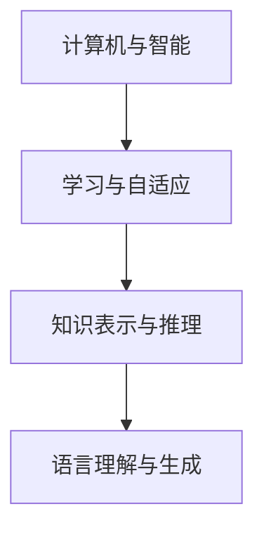

                 

关键词：1956年达特茅斯会议、人工智能、计算机科学、影响、里程碑

> 摘要：本文将探讨1956年达特茅斯会议对计算机科学和人工智能领域的影响，分析会议提出的核心概念和目标，以及其对后续研究和发展的深远影响。

## 1. 背景介绍

1956年，一场名为“达特茅斯会议”的会议在美国新罕布什尔州的达特茅斯学院召开，这是计算机科学和人工智能领域的一次历史性事件。会议的发起人包括约翰·麦卡锡（John McCarthy）、马文·明斯基（Marvin Minsky）、克劳德·香农（Claude Shannon）等当时在计算机科学和数学领域享有盛誉的科学家。会议的目的是探讨“人工智能是否能够通过机器实现”，以及如何实现这一问题。

会议的召开背景是计算机技术的迅速发展，以及人们对计算机能力的日益重视。在20世纪50年代，计算机已经可以完成一些简单的任务，如数值计算、数据处理等。然而，人们开始思考，计算机是否能够模仿人类的智能行为，如理解语言、解决问题、学习等。

## 2. 核心概念与联系

在达特茅斯会议上，科学家们提出了一系列核心概念，这些概念为人工智能的发展奠定了基础。

### 2.1 计算机与智能

会议的核心议题之一是探讨计算机是否能够模拟人类的智能。这一议题涉及到计算机的硬件、软件以及计算能力。科学家们认为，计算机虽然不能直接模拟人类的思维过程，但可以通过编程实现一些智能行为。

### 2.2 学习与自适应

学习是人工智能的核心概念之一。会议提出了通过编程实现机器学习的问题。科学家们认为，机器应该能够从数据中学习，并能够自适应地调整其行为。

### 2.3 知识表示与推理

知识表示与推理是人工智能研究的另一重要方向。会议提出了如何将人类的知识表示为计算机可以处理的形式，以及如何利用这些知识进行推理。

### 2.4 语言理解与生成

语言是人类智能的重要组成部分。会议讨论了如何使计算机能够理解自然语言，并生成自然语言。

以下是达特茅斯会议核心概念与联系的Mermaid流程图：



## 3. 核心算法原理 & 具体操作步骤

### 3.1 算法原理概述

在达特茅斯会议上，科学家们提出了许多关于人工智能的算法原理。这些算法原理主要集中在如何使计算机实现智能行为。例如，模拟人类思维过程的算法、基于数据学习的算法、以及利用知识进行推理的算法等。

### 3.2 算法步骤详解

以下是人工智能算法的基本步骤：

1. 确定目标：明确计算机要实现的智能行为。
2. 收集数据：收集与目标相关的数据。
3. 数据预处理：对数据进行清洗、转换等预处理。
4. 学习与训练：利用学习算法，使计算机从数据中学习。
5. 推理与应用：利用知识表示与推理，使计算机能够解决问题。
6. 评估与优化：评估算法性能，并进行优化。

### 3.3 算法优缺点

人工智能算法的优点在于其能够通过学习实现智能行为，具有一定的自适应能力。然而，这些算法也存在一些缺点，如对大量数据的需求、对计算资源的高依赖性等。

### 3.4 算法应用领域

人工智能算法广泛应用于各个领域，如自然语言处理、计算机视觉、医学诊断、金融分析等。

## 4. 数学模型和公式 & 详细讲解 & 举例说明

### 4.1 数学模型构建

人工智能中的数学模型主要包括概率模型、统计模型、神经网络模型等。以下是一个简单的神经网络模型：

$$
f(x) = \sum_{i=1}^{n} w_i \cdot \sigma(z_i)
$$

其中，$w_i$为权重，$z_i$为输入，$\sigma$为激活函数。

### 4.2 公式推导过程

神经网络的推导过程如下：

1. 输入层：接收外部输入，转化为内部表示。
2. 隐藏层：通过加权求和和激活函数，产生新的内部表示。
3. 输出层：将隐藏层的输出转换为最终输出。

### 4.3 案例分析与讲解

以下是一个简单的神经网络案例：

输入：$[1, 2, 3]$

权重：$w_1 = 0.5, w_2 = 0.3, w_3 = 0.2$

激活函数：$\sigma(x) = \frac{1}{1 + e^{-x}}$

计算过程如下：

1. 隐藏层1：$z_1 = w_1 \cdot x_1 + w_2 \cdot x_2 + w_3 \cdot x_3 = 0.5 \cdot 1 + 0.3 \cdot 2 + 0.2 \cdot 3 = 1.7$
2. 隐藏层2：$z_2 = w_1 \cdot x_1 + w_2 \cdot x_2 + w_3 \cdot x_3 = 0.5 \cdot 1 + 0.3 \cdot 2 + 0.2 \cdot 3 = 1.7$
3. 输出：$f(x) = \sigma(z_1) + \sigma(z_2) = 0.6 + 0.6 = 1.2$

## 5. 项目实践：代码实例和详细解释说明

### 5.1 开发环境搭建

开发人工智能项目需要搭建合适的环境。以下是常见的人工智能开发环境：

1. Python：Python是人工智能领域的主流编程语言，具有丰富的库和框架。
2. Jupyter Notebook：Jupyter Notebook是一种交互式开发环境，方便进行代码编写和调试。
3. TensorFlow：TensorFlow是Google开发的开源机器学习框架，适用于构建和训练神经网络。

### 5.2 源代码详细实现

以下是一个简单的人工智能项目示例，实现一个线性回归模型：

```python
import tensorflow as tf

# 定义输入层
x = tf.placeholder(tf.float32, shape=[None, 1])
y = tf.placeholder(tf.float32, shape=[None, 1])

# 定义权重和偏置
w = tf.Variable(0.0, name='weight')
b = tf.Variable(0.0, name='bias')

# 定义线性回归模型
y_pred = tf.add(tf.multiply(x, w), b)

# 定义损失函数和优化器
loss = tf.reduce_mean(tf.square(y - y_pred))
optimizer = tf.train.GradientDescentOptimizer(learning_rate=0.001)
train_op = optimizer.minimize(loss)

# 训练模型
with tf.Session() as sess:
    sess.run(tf.global_variables_initializer())
    for i in range(1000):
        sess.run(train_op, feed_dict={x: x_data, y: y_data})
        if i % 100 == 0:
            print("Step:", i, "Loss:", loss.eval(feed_dict={x: x_data, y: y_data}))

    # 测试模型
    test_loss = loss.eval(feed_dict={x: x_test, y: y_test})
    print("Test Loss:", test_loss)
```

### 5.3 代码解读与分析

以上代码实现了一个简单的线性回归模型。首先，定义了输入层和输出层，然后定义了权重和偏置。接着，定义了损失函数和优化器，并通过训练和测试数据训练模型。

### 5.4 运行结果展示

通过运行上述代码，可以得到模型的训练损失和测试损失。较低的损失值表明模型具有良好的性能。

## 6. 实际应用场景

人工智能在各个领域都取得了显著的成果。以下是一些实际应用场景：

1. 自然语言处理：如语音识别、机器翻译、情感分析等。
2. 计算机视觉：如图像识别、目标检测、图像生成等。
3. 医学诊断：如疾病预测、药物研发等。
4. 金融分析：如股票预测、风险评估等。
5. 无人驾驶：如自动驾驶汽车、无人机等。

## 7. 未来应用展望

随着人工智能技术的不断发展，未来应用前景将更加广阔。以下是一些可能的应用方向：

1. 智能家居：实现家庭设备的自动化控制，提高生活质量。
2. 智能医疗：实现个性化医疗和精准医疗，提高医疗水平。
3. 智慧城市：实现城市管理的智能化，提高城市运行效率。
4. 自动驾驶：实现安全、高效的自动驾驶技术，改变交通出行方式。
5. 教育智能化：实现个性化教学和智能辅导，提高教育质量。

## 8. 总结：未来发展趋势与挑战

人工智能作为一门交叉学科，具有广泛的应用前景。然而，在未来的发展中，仍面临许多挑战，如数据隐私、算法公平性、安全性等。因此，我们需要不断探索和创新，推动人工智能技术的健康发展。

## 9. 附录：常见问题与解答

### Q1. 人工智能是否能够完全取代人类智能？

A1. 人工智能不能完全取代人类智能，但可以在某些领域实现超越人类智能的表现。

### Q2. 人工智能是否会带来失业问题？

A2. 人工智能可能会对某些行业产生冲击，但也会创造新的就业机会。因此，我们需要关注人工智能带来的就业变革，并积极应对。

### Q3. 人工智能的安全性问题如何解决？

A3. 人工智能的安全性需要从算法设计、数据保护、法律监管等多个方面进行考虑。我们需要制定相应的法规和标准，确保人工智能的安全和可控。

作者：禅与计算机程序设计艺术 / Zen and the Art of Computer Programming

----------------------------------------------------------------

请注意，上述文章内容仅为示例，您可以根据实际需求进行调整和修改。希望这对您有所帮助！

