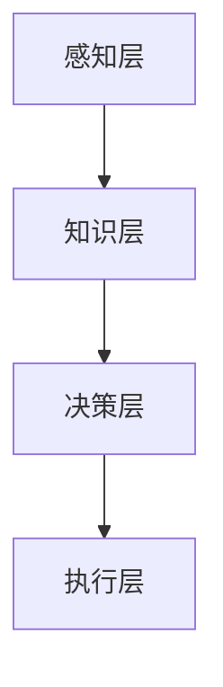

                 

关键词：达特茅斯会议、人工智能、计算机科学、编程、算法、技术发展

> 摘要：1956年，达特茅斯会议的召开标志着人工智能（AI）这一领域的诞生。本文旨在回顾这次历史性的会议，探讨其在计算机科学和技术发展中的深远影响，并展望人工智能领域的未来。

## 1. 背景介绍

### 达特茅斯会议的起源

达特茅斯会议，又称达特茅斯研讨会，是人工智能领域的一个里程碑事件。1956年，由约翰·麦卡锡（John McCarthy）、马文·明斯基（Marvin Minsky）、纳森尼尔·罗切斯特（Nathanial Rochester）和克劳德·香农（Claude Shannon）四位学者发起，于美国新罕布什尔州达特茅斯学院举行。会议的初衷是探讨如何利用计算机模拟人类智能，以及计算机能否具备思维、学习和决策能力。

### 会议的目标

会议的主要目标是：

1. 探讨人工智能的理论基础和实践应用。
2. 确定人工智能研究的方向和方法。
3. 促进学术界的合作与交流。

### 会议的背景

1956年，计算机科学正处于快速发展的阶段。计算机处理速度不断加快，存储容量显著提升，编程语言和算法也在不断进步。这些技术进步为人工智能的研究提供了坚实的基础。同时，计算机科学的先驱们，如香农和明斯基，已经在信息论和神经网络等领域取得了重要的研究成果，为人工智能的发展提供了理论支持。

## 2. 核心概念与联系

### 人工智能的定义

人工智能是一门研究、开发和应用使计算机模拟人类智能的理论、方法和技术科学。人工智能的目的是让计算机具备感知、学习、推理、规划和决策等能力，以实现智能化应用。

### 人工智能的核心概念

- **知识表示**：如何将人类知识和信息转化为计算机可以处理的形式。
- **推理**：如何利用已有知识进行逻辑推理和决策。
- **学习**：如何让计算机通过学习获得新的知识和技能。
- **感知**：如何让计算机感知和理解外界信息。
- **行动**：如何让计算机根据环境和目标执行行动。

### 人工智能的架构

人工智能的架构主要包括以下几个层次：

1. **感知层**：负责收集和处理外界信息，如视觉、听觉和触觉等。
2. **知识层**：负责存储和处理知识，包括事实、规则和模型等。
3. **决策层**：负责根据感知层的信息和知识层的内容做出决策。
4. **执行层**：负责根据决策层的指令执行行动。

### Mermaid 流程图

## 3. 核心算法原理 & 具体操作步骤

### 3.1 算法原理概述

达特茅斯会议提出了一系列人工智能算法，其中最具代表性的包括：

1. **神经网络算法**：通过模拟人脑神经网络结构，实现数据的分类、识别和预测等功能。
2. **决策树算法**：通过构建树形结构，将数据集划分为不同的子集，以实现分类或回归任务。
3. **支持向量机算法**：通过寻找最佳分类超平面，实现数据的分类。

### 3.2 算法步骤详解

1. **神经网络算法**：
   - **输入层**：接收外部输入数据。
   - **隐藏层**：对输入数据进行处理，并通过激活函数产生输出。
   - **输出层**：根据隐藏层的输出进行分类或回归。
   - **反向传播**：根据输出层的误差，调整网络权重，以降低误差。

2. **决策树算法**：
   - **分裂节点**：根据某一特征，将数据集划分为两个子集。
   - **递归划分**：对子集进行递归划分，直至满足停止条件。
   - **构建树形结构**：将划分结果组织成树形结构。

3. **支持向量机算法**：
   - **选择特征**：选择能够区分不同类别的特征。
   - **计算距离**：计算每个样本到超平面的距离。
   - **分类决策**：根据距离分类，以超平面最近的点作为分类依据。

### 3.3 算法优缺点

1. **神经网络算法**：
   - **优点**：具有较强的自适应性和泛化能力，能够处理复杂非线性问题。
   - **缺点**：训练时间较长，对数据量要求较高。

2. **决策树算法**：
   - **优点**：直观易懂，易于实现。
   - **缺点**：容易过拟合，对噪声敏感。

3. **支持向量机算法**：
   - **优点**：具有较高的分类精度，适用于高维数据。
   - **缺点**：对线性可分问题效果较好，对非线性问题性能较差。

### 3.4 算法应用领域

1. **神经网络算法**：广泛应用于图像识别、语音识别、自然语言处理等领域。
2. **决策树算法**：常用于数据挖掘、商业智能分析等领域。
3. **支持向量机算法**：广泛应用于文本分类、生物信息学、金融风控等领域。

## 4. 数学模型和公式 & 详细讲解 & 举例说明

### 4.1 数学模型构建

在人工智能研究中，常见的数学模型包括神经网络模型、决策树模型和支持向量机模型。以下分别介绍这些模型的数学构建。

1. **神经网络模型**：

   神经网络模型主要由输入层、隐藏层和输出层组成。每个神经元可以表示为：

   $$ z = \sum_{i=1}^{n} w_{i}x_{i} + b $$

   其中，$w_{i}$ 表示权重，$x_{i}$ 表示输入值，$b$ 表示偏置。

   激活函数常用的有 Sigmoid 函数、ReLU 函数和 tanh 函数。

2. **决策树模型**：

   决策树模型可以表示为：

   $$ G(\theta) = \sum_{i=1}^{n} \theta_{i}x_{i} $$

   其中，$\theta_{i}$ 表示决策树中的阈值，$x_{i}$ 表示特征值。

3. **支持向量机模型**：

   支持向量机模型可以表示为：

   $$ w \cdot x + b = 0 $$

   其中，$w$ 表示权重向量，$x$ 表示特征向量，$b$ 表示偏置。

### 4.2 公式推导过程

1. **神经网络模型**：

   假设有一个神经网络，输入为 $x$，输出为 $y$，网络中的权重为 $w$，偏置为 $b$，激活函数为 $f$。则神经网络的输出可以表示为：

   $$ y = f(w \cdot x + b) $$

   其中，$w \cdot x$ 表示权重与输入的乘积，$b$ 表示偏置。

   假设激活函数为 Sigmoid 函数，则：

   $$ f(z) = \frac{1}{1 + e^{-z}} $$

   将输入 $x$ 和权重 $w$ 带入，得到：

   $$ y = \frac{1}{1 + e^{-(w \cdot x + b)}} $$

2. **决策树模型**：

   假设决策树中有 $n$ 个节点，每个节点的特征为 $x_{i}$，阈值

