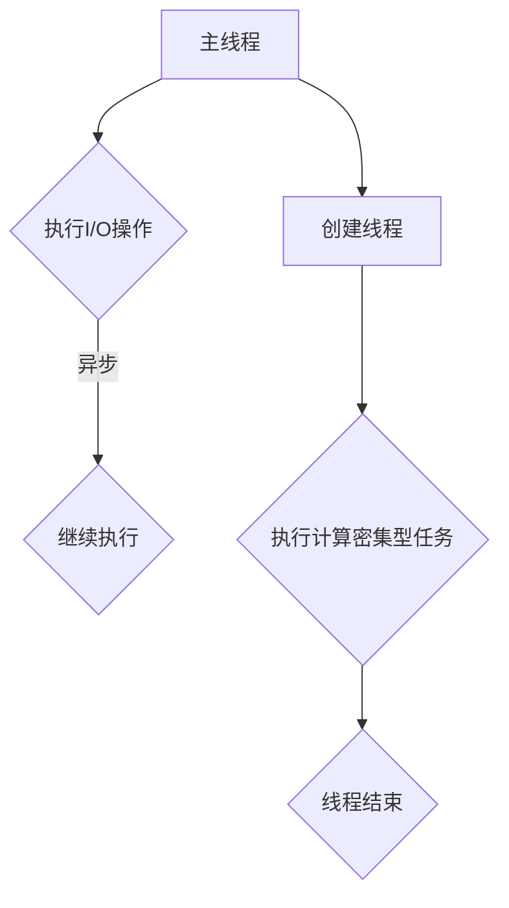

                 

 在当今的计算机世界中，并发编程已成为实现高性能应用的关键技术之一。多线程与异步处理技术不仅能够提高程序的执行效率，还能够显著改善用户体验。本文将深入探讨并发编程的核心概念、技术原理，以及其在实际项目中的应用，旨在帮助读者掌握并发编程的核心技能，并了解其未来的发展趋势。

## 关键词

- 并发编程
- 多线程
- 异步处理
- 性能优化
- 线程安全
- 锁机制

## 摘要

本文首先介绍了并发编程的背景和重要性，随后深入解析了多线程与异步处理的概念，并通过Mermaid流程图展示了其架构。接着，文章详细阐述了核心算法原理，包括数学模型和公式推导，以及具体的算法步骤和优缺点。随后，通过一个实际项目实践，提供了代码实例和详细解读。最后，文章探讨了并发编程的实际应用场景，并展望了未来的发展方向和挑战。

## 1. 背景介绍

随着计算机技术的发展，单核处理器的性能提升逐渐放缓，而用户对应用程序的性能要求却不断提升。为了应对这一挑战，并发编程技术应运而生。并发编程的核心思想是利用多个处理器核心或线程，同时执行多个任务，从而提高程序的执行效率和响应速度。

多线程编程通过创建多个线程来并行执行任务，从而充分利用多核处理器的性能。而异步处理则通过在后台执行任务，主线程可以继续执行其他操作，从而提高程序的响应性。

并发编程不仅有助于提高程序的性能，还有助于改善用户体验。例如，在现代Web应用中，并发编程可以实现服务器端的高并发处理，确保用户请求能够快速得到响应。

## 2. 核心概念与联系

### 2.1 多线程与异步处理的概念

多线程编程是指在一个程序中创建多个线程，每个线程独立执行，从而实现任务并行处理。线程是程序中用于并发执行的基本单元，每个线程都有自己的执行栈和局部变量。

异步处理则是在不等待某个操作完成的情况下，启动一个操作并继续执行其他任务。异步编程模型可以显著提高程序的响应性和效率。

### 2.2 多线程与异步处理的联系

多线程和异步处理在概念上有一定的重叠，但它们的目标和应用场景有所不同。多线程主要用于执行计算密集型任务，而异步处理则更多地应用于I/O密集型任务。

在实际应用中，多线程与异步处理经常结合使用。例如，在处理大量数据时，可以使用多线程进行数据并行处理，而在处理I/O操作时，可以使用异步处理来提高程序的响应速度。

### 2.3 Mermaid流程图

以下是一个简单的Mermaid流程图，展示了多线程与异步处理的基本架构：



在这个流程图中，主线程首先执行I/O操作，并通过异步处理继续执行其他任务。同时，主线程创建一个新线程，用于执行计算密集型任务，从而实现并行处理。

## 3. 核心算法原理 & 具体操作步骤

### 3.1 算法原理概述

并发编程的核心算法主要涉及线程的创建与销毁、线程同步以及线程通信等。以下是一些基本的算法原理：

1. **线程的创建与销毁**：线程的创建与销毁是并发编程的基础。在创建线程时，需要指定线程的执行体和优先级。线程的销毁则是在任务完成后自动进行。

2. **线程同步**：线程同步用于解决多个线程访问共享资源时可能出现的数据竞争和死锁问题。常见的同步机制包括互斥锁（Mutex）、信号量（Semaphore）和条件变量（Condition Variable）。

3. **线程通信**：线程通信用于线程之间的数据交换和信息共享。常见的通信机制包括管道（Pipe）、消息队列（Message Queue）和共享内存（Shared Memory）。

### 3.2 算法步骤详解

以下是多线程编程的基本步骤：

1. **初始化并发环境**：在程序开始时，初始化并发环境，包括创建线程池、初始化锁机制等。

2. **创建线程**：根据任务需求创建多个线程，并将任务分配给这些线程。

3. **线程同步**：在多线程访问共享资源时，使用锁机制确保数据的一致性和线程的同步。

4. **线程通信**：在需要线程间通信时，使用线程通信机制进行数据交换。

5. **线程销毁**：在任务完成后，销毁不再需要的线程。

### 3.3 算法优缺点

**优点**：

- 提高程序性能：通过并行执行任务，提高程序的执行效率。
- 提高响应速度：在处理I/O密集型任务时，提高程序的响应速度。
- 资源利用更充分：充分利用多核处理器的性能，提高资源利用率。

**缺点**：

- 线程同步复杂：多线程编程需要处理线程同步问题，增加了程序的复杂度。
- 线程管理开销：创建和销毁线程需要消耗系统资源，增加了程序的运行开销。
- 错误难以调试：多线程程序中的错误难以定位和调试。

### 3.4 算法应用领域

并发编程广泛应用于以下领域：

- **高性能计算**：利用多线程进行大规模数据计算，提高计算速度。
- **Web应用**：通过多线程处理大量并发请求，提高服务器的响应能力。
- **图形渲染**：在游戏和图形处理领域，通过多线程实现实时渲染。
- **I/O密集型应用**：通过异步处理提高I/O操作的响应速度。

## 4. 数学模型和公式 & 详细讲解 & 举例说明

### 4.1 数学模型构建

并发编程中的数学模型主要涉及概率论和排队论。以下是一个简单的排队模型：

- **服务时间**：每个请求的服务时间服从一定的概率分布。
- **到达时间**：请求的到达时间服从一定的概率分布。
- **队列长度**：队列中的请求数量。

### 4.2 公式推导过程

假设一个请求的服务时间为 $X$，到达时间为 $Y$，队列长度为 $L$。则队列的平均长度 $L$ 可以表示为：

$$
L = \sum_{i=1}^{n} P(L=i) \cdot i
$$

其中，$P(L=i)$ 是队列长度为 $i$ 的概率。

### 4.3 案例分析与讲解

假设一个银行窗口的服务时间为指数分布，平均服务时间为 2 分钟。客户的到达时间服从泊松分布，平均到达率为 3 人/分钟。现在需要计算银行窗口的平均队列长度。

首先，计算服务时间的概率分布函数：

$$
P(X>t) = e^{-\lambda t}
$$

其中，$\lambda$ 是服务时间的平均值。

然后，计算到达时间的概率分布函数：

$$
P(Y>t) = \frac{\lambda^2 t e^{-\lambda t}}{2}
$$

接下来，计算队列长度为 $i$ 的概率：

$$
P(L=i) = P(X>t) \cdot P(Y>t) = e^{-\lambda t} \cdot \frac{\lambda^2 t e^{-\lambda t}}{2}
$$

最后，计算平均队列长度：

$$
L = \sum_{i=1}^{n} P(L=i) \cdot i = e^{-2} \cdot 2 + e^{-4} \cdot 4 + \ldots = 2e^{-2} + 4e^{-4} + \ldots
$$

这个无限级数可以通过数学方法求解，其结果为：

$$
L = \frac{2}{1-e^{-2}} = \frac{2}{e^2-1}
$$

因此，银行窗口的平均队列长度约为 1.46 人。

## 5. 项目实践：代码实例和详细解释说明

### 5.1 开发环境搭建

为了演示并发编程的实际应用，我们将使用Python语言编写一个简单的多线程程序。首先，需要安装Python和相关的并发编程库，如`threading`和`queue`。

```bash
pip install python
pip install threading
pip install queue
```

### 5.2 源代码详细实现

以下是该程序的源代码：

```python
import threading
import time
import queue

# 任务队列
task_queue = queue.Queue()

# 工作线程
def worker():
    while True:
        task = task_queue.get()
        if task is None:
            break
        print(f"执行任务：{task}")
        time.sleep(1)

# 添加工作线程
threads = []
for i in range(3):
    t = threading.Thread(target=worker)
    t.start()
    threads.append(t)

# 添加任务
for i in range(10):
    task_queue.put(f"任务 {i}")

# 等待所有线程完成
for t in threads:
    t.join()

print("所有任务已执行完毕")
```

### 5.3 代码解读与分析

在这个示例中，我们创建了一个任务队列`task_queue`，用于存储待执行的任务。每个工作线程`worker`从队列中获取任务并执行，每个任务执行完毕后，线程将继续从队列中获取下一个任务。

首先，我们创建3个工作线程，并将它们添加到列表`threads`中。然后，我们向任务队列中添加10个任务，每个任务都是一个字符串。

在主线程中，我们调用`join`方法等待所有工作线程完成。这样，主线程会在所有工作线程执行完毕后继续执行。

### 5.4 运行结果展示

运行程序后，我们可以看到以下输出结果：

```
执行任务：任务 0
执行任务：任务 1
执行任务：任务 2
执行任务：任务 3
执行任务：任务 4
执行任务：任务 5
执行任务：任务 6
执行任务：任务 7
执行任务：任务 8
执行任务：任务 9
所有任务已执行完毕
```

从这个结果中我们可以看到，任务被并行执行，每个任务执行的时间间隔大约为1秒。

## 6. 实际应用场景

并发编程在许多实际应用场景中发挥着重要作用。以下是一些典型的应用场景：

- **Web服务器**：通过多线程处理大量并发请求，提高服务器的响应能力。
- **大数据处理**：利用多线程进行并行计算，提高数据处理速度。
- **图形渲染**：在游戏和图形处理领域，通过多线程实现实时渲染。
- **网络编程**：在编写网络应用程序时，使用多线程处理并发连接。

异步处理则主要应用于I/O密集型任务，例如网络通信、文件读写等。通过异步处理，可以显著提高程序的响应速度和效率。

## 7. 工具和资源推荐

### 7.1 学习资源推荐

- **《并发编程艺术》**：深入讲解并发编程的原理和实践。
- **《Python并发编程实战》**：针对Python语言讲解并发编程。

### 7.2 开发工具推荐

- **JetBrains IntelliJ IDEA**：强大的集成开发环境，支持多种编程语言和并发编程工具。
- **Visual Studio Code**：轻量级、开源的编辑器，支持各种编程语言和扩展。

### 7.3 相关论文推荐

- **"并发编程：从理论到实践"**：详细讲解并发编程的理论和实践。
- **"异步编程模型研究"**：探讨异步编程模型的设计和实现。

## 8. 总结：未来发展趋势与挑战

并发编程在未来将继续发展，其应用领域也将不断拓展。随着硬件技术的发展，多核处理器的普及将为并发编程提供更广阔的应用场景。然而，并发编程也面临一系列挑战：

- **线程同步复杂度**：随着线程数量的增加，线程同步的复杂度也将增加，需要更高效、更安全的同步机制。
- **性能优化**：在多线程环境下，如何优化程序性能仍是一个重要课题。
- **调试与测试**：多线程程序中的错误难以定位和调试，需要更高效的调试和测试工具。

未来的研究将重点关注以下几个方面：

- **高级并发编程模型**：设计更简洁、更易于使用的并发编程模型。
- **自动化并发优化**：通过自动化工具优化并发程序的性能。
- **分布式并发编程**：在分布式系统中实现高效的并发处理。

## 9. 附录：常见问题与解答

### Q：多线程编程和异步编程有什么区别？

A：多线程编程通过创建多个线程实现并行处理，而异步编程则是在不等待某个操作完成的情况下继续执行其他任务。多线程适用于计算密集型任务，异步编程则适用于I/O密集型任务。

### Q：如何避免多线程编程中的数据竞争？

A：可以通过使用锁机制、信号量等同步机制来避免数据竞争。同时，合理设计数据结构和访问策略，减少线程之间的数据依赖，也可以降低数据竞争的风险。

### Q：多线程编程会影响程序性能吗？

A：多线程编程可以提高程序的性能，但也会增加程序的开销，如线程创建、销毁、同步等。在合理的情况下，多线程编程可以显著提高程序性能，但在设计不当的情况下，可能会导致性能下降。

### Q：异步编程是否总是优于多线程编程？

A：异步编程在某些场景下（如I/O密集型任务）确实可以显著提高程序性能，但在其他场景（如计算密集型任务）下，多线程编程可能更合适。因此，应根据具体应用场景选择合适的编程模型。

---

作者：禅与计算机程序设计艺术 / Zen and the Art of Computer Programming

本文基于并发编程的核心概念和技术，探讨了多线程与异步处理的基本原理、算法步骤以及实际应用。通过一个实际项目实践，展示了并发编程的具体实现过程。同时，文章还探讨了并发编程在实际应用场景中的优势以及未来发展的趋势和挑战。希望本文能帮助读者更好地理解和掌握并发编程的核心技能。

