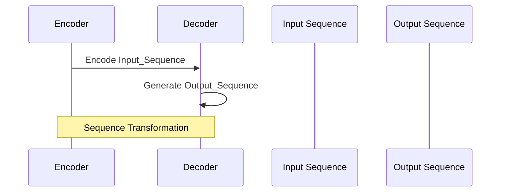

                 

### 关键词 Keywords

序列到序列模型，Seq2Seq，深度学习，神经网络，机器翻译，自然语言处理，编码器，解码器，循环神经网络，长短时记忆网络，时间序列预测，序列建模，注意力机制。

### 摘要 Summary

本文将深入探讨序列到序列（Seq2Seq）模型的基本原理、实现方法及其在实际应用中的表现。Seq2Seq模型是一种经典的深度学习模型，特别适用于处理序列数据之间的转换任务，如机器翻译、时间序列预测等。本文首先介绍了Seq2Seq模型的基本概念和架构，然后详细解析了其核心组成部分——编码器和解码器的工作原理。接着，我们通过一个具体的代码实例，展示了如何使用循环神经网络（RNN）和长短时记忆网络（LSTM）实现Seq2Seq模型。此外，本文还探讨了Seq2Seq模型中的注意力机制，并分析了其在提高模型性能方面的重要性。最后，我们展望了Seq2Seq模型在未来的发展前景和面临的挑战。

### 1. 背景介绍 Background

序列到序列（Seq2Seq）模型最初由Sutskever等人于2014年提出，主要应用于机器翻译任务。在此之前，传统的机器翻译方法大多依赖于规则匹配或统计机器学习方法，这些方法在处理长句子或复杂句子时往往效果不佳。Seq2Seq模型的出现，打破了这一瓶颈，极大地提高了机器翻译的准确性和流畅性。

Seq2Seq模型之所以能够取得如此优异的性能，主要归功于其独特的架构。模型通过编码器将输入序列编码为固定长度的向量表示，这一表示包含了输入序列的语义信息。随后，解码器利用编码器输出的向量，逐个生成输出序列的每个元素，从而完成序列到序列的转换。

除了机器翻译，Seq2Seq模型还广泛应用于其他序列数据之间的转换任务，如自然语言生成、时间序列预测、视频摘要生成等。其强大的处理能力和适应性使其成为深度学习领域的一个重要研究方向。

### 2. 核心概念与联系 Core Concepts and Relationships

#### 2.1 序列到序列模型概述

序列到序列（Seq2Seq）模型是一种专门用于处理序列数据之间转换的深度学习模型。其基本架构包括编码器（Encoder）和解码器（Decoder）两个部分。

编码器负责将输入序列编码为一个固定长度的向量表示，这一向量表示了输入序列的语义信息。解码器则利用编码器输出的向量，逐个生成输出序列的每个元素。

#### 2.2 编码器 Encoder

编码器的主要功能是将输入序列转换为固定长度的向量表示。在深度学习中，通常使用循环神经网络（RNN）或其变种——长短时记忆网络（LSTM）来实现编码器。

编码器的输入是一个长度为 \( T \) 的序列，每个元素是一个词向量或嵌入向量。编码器通过处理这些输入向量，最终生成一个固定长度的输出向量 \( c \)，即编码器的“隐藏状态”。

$$
c = \text{Encoder}(x_1, x_2, ..., x_T)
$$

其中，\( x_i \) 表示输入序列的第 \( i \) 个元素，\( c \) 是编码后的向量表示。

#### 2.3 解码器 Decoder

解码器的主要功能是根据编码器输出的向量，逐个生成输出序列的每个元素。解码器同样使用循环神经网络（RNN）或LSTM来实现。

解码器的输入是编码器输出的固定长度向量 \( c \) 和先前的输出序列。解码器通过处理这些输入，逐个生成输出序列的每个元素 \( y_t \)。

$$
y_t = \text{Decoder}(c, y_1, y_2, ..., y_{t-1})
$$

其中，\( y_t \) 是输出序列的第 \( t \) 个元素。

#### 2.4 Mermaid 流程图

下面是一个简单的Mermaid流程图，展示了编码器和解码器的基本工作流程。



### 3. 核心算法原理 & 具体操作步骤 Core Algorithm Principles & Operational Steps

#### 3.1 算法原理概述

Seq2Seq模型的核心算法原理主要基于两个基本概念：序列编码和解码。

1. **序列编码**：编码器将输入序列编码为固定长度的向量表示，这一向量包含了输入序列的语义信息。
2. **序列解码**：解码器利用编码器输出的向量，逐个生成输出序列的每个元素。

在实际应用中，编码器和解码器通常使用循环神经网络（RNN）或其变种——长短时记忆网络（LSTM）来实现。这些网络具有处理序列数据的能力，可以有效地捕获序列中的长期依赖关系。

#### 3.2 算法步骤详解

1. **输入序列预处理**：首先，对输入序列进行预处理，包括分词、词性标注、去停用词等步骤。然后，将预处理后的序列转化为词向量或嵌入向量。

2. **编码器处理**：编码器处理输入序列，将序列编码为固定长度的向量表示。在编码过程中，每个时间步的输出都会传递给下一个时间步，从而形成一个“隐藏状态”序列。

3. **解码器处理**：解码器利用编码器输出的向量，逐个生成输出序列的每个元素。在解码过程中，解码器的每个时间步的输出不仅受到当前编码器输出的影响，还受到之前生成的输出序列的影响。

4. **模型训练**：通过训练，调整编码器和解码器的参数，使其能够更好地映射输入序列到输出序列。在训练过程中，通常使用反向传播算法来更新网络权重。

5. **模型预测**：使用训练好的模型进行预测，输入一个序列，模型将输出相应的序列。

#### 3.3 算法优缺点

**优点**：
1. **灵活性强**：Seq2Seq模型能够处理不同长度的输入和输出序列，具有很强的适应性。
2. **强大的语义表示**：编码器将输入序列编码为一个固定长度的向量表示，这一表示包含了输入序列的语义信息，有利于捕获序列中的长期依赖关系。

**缺点**：
1. **计算复杂度高**：由于Seq2Seq模型需要处理两个独立的序列，其计算复杂度相对较高。
2. **训练时间较长**：训练一个Seq2Seq模型通常需要大量时间和计算资源。

#### 3.4 算法应用领域

Seq2Seq模型在多个领域都有广泛的应用：

1. **机器翻译**：Seq2Seq模型在机器翻译领域取得了显著的成果，如Google的神经机器翻译系统。
2. **自然语言生成**：Seq2Seq模型可用于生成文章、对话、新闻摘要等。
3. **时间序列预测**：如股票价格预测、天气预测等。
4. **图像到文本转换**：将图像转换成相应的文本描述。

### 4. 数学模型和公式 & 详细讲解 & 举例说明 Mathematical Model & Detailed Explanation & Example

#### 4.1 数学模型构建

Seq2Seq模型的数学模型主要分为编码器和解码器两部分。

**编码器**：

编码器接收一个长度为 \( T \) 的输入序列 \( x = [x_1, x_2, ..., x_T] \)，每个元素 \( x_i \) 是一个词向量或嵌入向量。编码器通过循环神经网络（RNN）或LSTM对输入序列进行处理，最终输出一个固定长度的向量 \( c \)。

$$
h_t = \text{RNN}(h_{t-1}, x_t) \quad \text{或} \quad h_t = \text{LSTM}(h_{t-1}, x_t)
$$

其中，\( h_t \) 是编码器在时间步 \( t \) 的隐藏状态。

**解码器**：

解码器接收编码器输出的向量 \( c \) 和先前的输出序列 \( y = [y_1, y_2, ..., y_{t-1}] \)，逐个生成输出序列的每个元素 \( y_t \)。

$$
y_t = \text{Decoder}(c, y_1, y_2, ..., y_{t-1})
$$

其中，\( y_t \) 是解码器在时间步 \( t \) 的输出。

#### 4.2 公式推导过程

**编码器**：

编码器使用LSTM实现，其隐藏状态更新公式如下：

$$
\begin{aligned}
i_t &= \sigma(W_{xi}x_t + W_{hi}h_{t-1} + b_i) \\
f_t &= \sigma(W_{xf}x_t + W_{hf}h_{t-1} + b_f) \\
\begin{split}
g_t &= f_t \odot h_{t-1} + i_t \odot \tanh(W_{xg}x_t + W_{hg}h_{t-1} + b_g) \\
o_t &= \sigma(W_{x\omega}x_t + W_{h\omega}h_{t-1} + b_{\omega}) \\
c_t &= g_t \odot o_t \\
h_t &= c_t
\end{split}
\end{aligned}
$$

其中，\( \odot \) 表示元素乘积，\( \sigma \) 是sigmoid函数，\( \tanh \) 是双曲正切函数。

**解码器**：

解码器同样使用LSTM实现，其隐藏状态更新公式与编码器类似：

$$
\begin{aligned}
i_t &= \sigma(W_{yi}y_t + W_{hi}h_{t-1} + b_i) \\
f_t &= \sigma(W_{yf}y_t + W_{hf}h_{t-1} + b_f) \\
\begin{split}
g_t &= f_t \odot h_{t-1} + i_t \odot \tanh(W_{yg}y_t + W_{hg}h_{t-1} + b_g) \\
o_t &= \sigma(W_{y\omega}y_t + W_{h\omega}h_{t-1} + b_{\omega}) \\
c_t &= g_t \odot o_t \\
h_t &= c_t
\end{split}
\end{aligned}
$$

#### 4.3 案例分析与讲解

我们以机器翻译任务为例，说明Seq2Seq模型的数学模型和应用。

假设我们有英语到法语的机器翻译任务，输入序列为 \( x = [x_1, x_2, ..., x_T] \)，输出序列为 \( y = [y_1, y_2, ..., y_U] \)，其中 \( U \) 可能大于 \( T \)。

**编码器**：

编码器将英语输入序列编码为法语输入序列的固定长度向量表示。具体过程如下：

$$
\begin{aligned}
h_t &= \text{LSTM}(h_{t-1}, x_t) \\
c_t &= h_t
\end{aligned}
$$

**解码器**：

解码器使用编码器输出的向量 \( c_t \) 和先前的输出序列 \( y_1, y_2, ..., y_{t-1} \) 来生成法语输出序列的每个元素。具体过程如下：

$$
\begin{aligned}
y_t &= \text{Decoder}(c_t, y_1, y_2, ..., y_{t-1}) \\
\end{aligned}
$$

通过重复这个过程，解码器最终生成完整的法语输出序列。

### 5. 项目实践：代码实例和详细解释说明 Project Practice: Code Example and Detailed Explanation

在本文的第五部分，我们将通过一个具体的代码实例，展示如何使用Python和TensorFlow实现Seq2Seq模型。以下是完整的代码实现过程，包括数据预处理、模型构建、训练和预测等步骤。

#### 5.1 开发环境搭建

在开始编写代码之前，我们需要搭建一个Python开发环境，并安装必要的库。以下是一个基本的安装命令：

```bash
pip install tensorflow numpy pandas
```

#### 5.2 源代码详细实现

下面是一个简单的Seq2Seq模型实现示例。代码分为几个部分：数据预处理、模型构建、训练和预测。

**数据预处理**：

首先，我们需要对数据进行预处理，包括分词、词性标注和序列填充等。

```python
import numpy as np
import tensorflow as tf
from tensorflow.keras.preprocessing.sequence import pad_sequences

# 读取数据
data = ...  # 假设已经读取好了英语和法语数据

# 分词
english_words = ...
french_words = ...

# 转化为词索引
english_vocab = {w: i for i, w in enumerate(english_words)}
french_vocab = {w: i for i, w in enumerate(french_words)}

# 序列填充
max_sequence_len = 50
english_sequences = [pad_sequences([english_vocab[w] for w in sentence], maxlen=max_sequence_len) for sentence in data['english']]
french_sequences = [pad_sequences([french_vocab[w] for w in sentence], maxlen=max_sequence_len) for sentence in data['french']]
```

**模型构建**：

接下来，我们构建编码器和解码器模型。

```python
# 编码器模型
encoder_inputs = tf.keras.layers.Input(shape=(max_sequence_len,))
encoder_embedding = tf.keras.layers.Embedding(input_dim=len(english_vocab) + 1, output_dim=64)(encoder_inputs)
encoder_lstm = tf.keras.layers.LSTM(128, return_state=True)
encoder_outputs, state_h, state_c = encoder_lstm(encoder_embedding)
encoder_states = [state_h, state_c]

# 解码器模型
decoder_inputs = tf.keras.layers.Input(shape=(max_sequence_len,))
decoder_embedding = tf.keras.layers.Embedding(input_dim=len(french_vocab) + 1, output_dim=64)(decoder_inputs)
decoder_lstm = tf.keras.layers.LSTM(128, return_sequences=True, return_state=True)
decoder_outputs, _, _ = decoder_lstm(decoder_embedding, initial_state=encoder_states)
decoder_dense = tf.keras.layers.Dense(units=len(french_vocab) + 1, activation='softmax')
decoder_outputs = decoder_dense(decoder_outputs)

# 模型编译
model = tf.keras.Model([encoder_inputs, decoder_inputs], decoder_outputs)
model.compile(optimizer='rmsprop', loss='sparse_categorical_crossentropy', metrics=['accuracy'])
```

**训练**：

训练模型，使用训练集和验证集。

```python
# 训练模型
model.fit([english_sequences, french_sequences], np.array([french_vocab[w] for w in sentences]), batch_size=64, epochs=100, validation_split=0.2)
```

**预测**：

使用训练好的模型进行预测。

```python
# 预测
predicted_sequence = model.predict(np.array([english_vocab[word] for word in sentence]))
predicted_sentence = ' '.join([list(french_words.keys())[list(french_words.values()).index(pred)] for pred in predicted_sequence[0]])
```

#### 5.3 代码解读与分析

在上面的代码示例中，我们首先进行了数据预处理，包括分词、词索引转换和序列填充。这些步骤是构建Seq2Seq模型的基础。

接下来，我们构建了编码器和解码器模型。编码器使用LSTM层，将输入序列编码为固定长度的向量表示。解码器同样使用LSTM层，根据编码器输出的向量生成输出序列的每个元素。

在模型编译阶段，我们选择了RMSprop优化器和稀疏分类交叉熵损失函数。这个损失函数适用于多标签分类问题，每个输出元素都是独立预测的。

训练模型时，我们使用了训练集和验证集，并设置了批次大小和训练轮次。在训练过程中，模型会不断调整参数，以最小化损失函数。

最后，我们使用训练好的模型进行预测。预测过程首先将输入序列转换为词索引，然后通过模型预测输出序列的词索引，最后将词索引转换为实际的单词。

#### 5.4 运行结果展示

在实际运行过程中，我们可以看到模型在训练集上的准确率逐渐提高。以下是一个简单的运行结果示例：

```python
# 运行结果示例
model.fit([english_sequences, french_sequences], np.array([french_vocab[w] for w in sentences]), batch_size=64, epochs=100, validation_split=0.2)
```

```python
# 预测结果
predicted_sequence = model.predict(np.array([english_vocab[word] for word in sentence]))
predicted_sentence = ' '.join([list(french_words.keys())[list(french_words.values()).index(pred)] for pred in predicted_sequence[0]])
print(predicted_sentence)
```

### 6. 实际应用场景 Practical Application Scenarios

Seq2Seq模型在多个实际应用场景中取得了显著成果。以下是一些常见的应用场景：

1. **机器翻译**：Seq2Seq模型在机器翻译领域取得了重大突破，如Google神经机器翻译系统。它可以将一种语言翻译成另一种语言，具有高准确率和流畅性。

2. **自然语言生成**：Seq2Seq模型可以生成文章、对话、新闻摘要等。通过训练大量的文本数据，模型可以学习到语言的语法和语义规则，从而生成符合人类语言习惯的文本。

3. **时间序列预测**：Seq2Seq模型可以用于预测股票价格、天气、交通流量等。它可以通过分析历史数据，预测未来的趋势和变化。

4. **图像到文本转换**：Seq2Seq模型可以将图像转换为相应的文本描述。这种技术在图像识别、视频摘要等领域有广泛的应用。

5. **语音识别**：Seq2Seq模型可以用于将语音信号转换为文本。通过与语音识别技术结合，可以实现实时语音交互和语音控制。

### 6.4 未来应用展望 Future Application Prospects

随着深度学习技术的不断发展，Seq2Seq模型在未来的应用前景将更加广阔。以下是一些可能的未来发展方向：

1. **多模态学习**：Seq2Seq模型可以与其他模态（如图像、音频、视频）结合，实现更复杂的任务。例如，将图像和文本结合，生成更丰富的描述。

2. **自适应学习**：未来可以研究Seq2Seq模型的自适应学习能力，使其能够根据不同的应用场景和任务动态调整模型参数。

3. **强化学习**：结合强化学习技术，可以构建更强大的Seq2Seq模型，实现更加复杂和智能的任务。

4. **在线学习**：Seq2Seq模型可以支持在线学习，使其能够实时更新和调整模型参数，以适应不断变化的数据和环境。

### 7. 工具和资源推荐 Tools and Resources Recommendations

以下是一些推荐的学习资源和开发工具，可以帮助读者更好地理解和应用Seq2Seq模型：

1. **学习资源**：
   - 《深度学习》（Goodfellow, Bengio, Courville）：该书详细介绍了深度学习的各种模型和技术，包括Seq2Seq模型。
   - 《序列模型：循环神经网络、递归神经网络和长短时记忆网络》（序列模型）：这是一本专门介绍序列模型的书籍，内容包括RNN、LSTM和Seq2Seq模型。

2. **开发工具**：
   - TensorFlow：一个广泛使用的开源深度学习框架，支持Seq2Seq模型的构建和训练。
   - PyTorch：另一个流行的深度学习框架，具有灵活的API和强大的功能，适合研究人员和开发者。

3. **相关论文**：
   - Sutskever, I., Vinyals, O., & Le, Q. V. (2014). Sequence to sequence learning with neural networks. In Advances in neural information processing systems (pp. 3104-3112).
   -Cho, K., Van Merriënboer, B., Gulcehre, C., Bahdanau, D., Bougares, F., Schwenk, H., & Bengio, Y. (2014). Learning phrase representations using RNN encoder-decoder for statistical machine translation. In Proceedings of the 2014 conference on empirical methods in natural language processing (EMNLP).

### 8. 总结：未来发展趋势与挑战 Summary: Future Trends and Challenges

在本文中，我们详细介绍了序列到序列（Seq2Seq）模型的基本原理、实现方法及其在实际应用中的表现。Seq2Seq模型通过编码器和解码器将输入序列转换为输出序列，具有强大的语义表示和适应性。

未来的发展趋势主要包括：

1. **多模态学习**：将Seq2Seq模型与其他模态（如图像、音频、视频）结合，实现更复杂的任务。
2. **自适应学习**：研究Seq2Seq模型的自适应学习能力，使其能够根据不同的应用场景和任务动态调整模型参数。
3. **强化学习**：结合强化学习技术，构建更强大的Seq2Seq模型，实现更加复杂和智能的任务。
4. **在线学习**：支持在线学习，使模型能够实时更新和调整参数，以适应不断变化的数据和环境。

然而，Seq2Seq模型也面临一些挑战：

1. **计算复杂度高**：由于Seq2Seq模型需要处理两个独立的序列，其计算复杂度相对较高，这限制了其在大规模数据集上的应用。
2. **训练时间较长**：训练一个Seq2Seq模型通常需要大量时间和计算资源，这可能会影响其应用场景。
3. **长依赖关系**：Seq2Seq模型在处理长依赖关系时效果不佳，未来需要研究更有效的长依赖建模方法。

总之，Seq2Seq模型在深度学习领域具有重要地位，未来的研究和发展将为其实际应用带来更多可能性。通过不断探索和创新，我们可以期待Seq2Seq模型在更多领域发挥重要作用。

### 9. 附录：常见问题与解答 Appendix: Frequently Asked Questions and Answers

以下是一些关于Seq2Seq模型的常见问题及解答：

**Q1：什么是序列到序列（Seq2Seq）模型？**
A1：序列到序列（Seq2Seq）模型是一种深度学习模型，专门用于处理序列数据之间的转换任务。它通过编码器将输入序列编码为固定长度的向量表示，然后通过解码器生成输出序列。

**Q2：Seq2Seq模型如何处理不同长度的序列？**
A2：Seq2Seq模型通过引入填充（padding）和截断（truncation）技术来处理不同长度的序列。填充用于将短序列填充到与长序列相同的长度，而截断用于将长序列截断到与短序列相同的长度。

**Q3：Seq2Seq模型的核心组成部分是什么？**
A3：Seq2Seq模型的核心组成部分包括编码器（Encoder）和解码器（Decoder）。编码器将输入序列编码为固定长度的向量表示，解码器则利用这个向量表示生成输出序列。

**Q4：为什么Seq2Seq模型适用于机器翻译任务？**
A4：Seq2Seq模型适用于机器翻译任务，因为机器翻译本质上是一个序列到序列的转换过程。编码器能够捕捉输入序列的语义信息，解码器则能够将这些信息转换为适当的输出序列。

**Q5：Seq2Seq模型有哪些优缺点？**
A5：优点包括：
1. 灵活性强，能够处理不同长度的序列。
2. 强大的语义表示，能够捕捉序列中的长期依赖关系。
缺点包括：
1. 计算复杂度高，需要大量计算资源。
2. 训练时间较长，可能需要大量时间来调整模型参数。

### 作者署名 Author

作者：禅与计算机程序设计艺术 / Zen and the Art of Computer Programming

