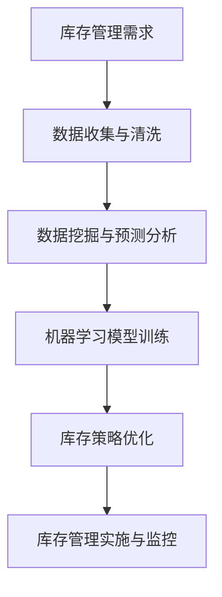

                 

关键词：库存优化、电商平台、AI、机器学习、库存管理、预测分析、供应链管理、数据挖掘、决策支持系统。

摘要：随着电子商务的飞速发展，电商平台面临着日益复杂的库存管理挑战。本文深入探讨了如何利用人工智能技术，特别是机器学习和预测分析，来优化电商平台库存管理，提高运营效率，降低成本。通过构建数学模型、实施算法原理以及案例分析和项目实践，本文为电商平台提供了一套全面的库存优化解决方案。

## 1. 背景介绍

电子商务平台的快速发展，使得库存管理成为企业经营成功的关键因素。库存过多会导致资金占用和仓储成本增加，而库存不足则会导致订单丢失和客户满意度下降。因此，如何平衡库存，提高库存周转率，降低库存成本，成为电商平台需要解决的核心问题。

传统的库存管理方法主要依赖于历史数据、经验判断和简单的预测模型，但面对多变的市场环境和复杂的产品组合，这些方法往往难以达到预期效果。随着人工智能技术的不断发展，特别是机器学习、深度学习等算法的成熟，利用AI进行库存优化成为可能。通过构建智能预测模型、优化库存策略、自动化库存管理流程，电商平台可以实现库存管理的智能化和高效化。

## 2. 核心概念与联系

### 2.1. 机器学习与预测分析

机器学习是人工智能的一个重要分支，通过训练模型，使其能够对未知数据进行预测和决策。在库存管理中，机器学习可以用于预测未来需求、优化库存水平、减少库存过剩和不足。

预测分析是机器学习在库存管理中的具体应用，通过对历史销售数据、市场趋势等因素的分析，预测未来某一时间段内的需求量。常见的预测分析方法包括时间序列分析、回归分析、贝叶斯网络等。

### 2.2. 数据挖掘与决策支持系统

数据挖掘是从大量数据中提取有价值信息的过程，通过数据挖掘，可以从历史库存数据中挖掘出潜在的规律和趋势。这些信息可以用于优化库存策略、预测市场需求等。

决策支持系统是一种辅助决策者进行决策的工具，通过集成数据挖掘、预测分析等技术，提供全面的数据分析和决策建议，帮助电商平台制定最优的库存管理策略。

### 2.3. Mermaid 流程图



## 3. 核心算法原理 & 具体操作步骤

### 3.1. 算法原理概述

库存优化算法的核心是基于历史数据和市场趋势，利用机器学习模型预测未来需求，并根据预测结果优化库存水平。常见的库存优化算法包括线性回归、决策树、神经网络等。

### 3.2. 算法步骤详解

1. **数据收集与预处理**：收集历史销售数据、库存数据、市场趋势数据等，进行数据清洗、去噪、补缺等预处理操作。
2. **特征工程**：根据业务需求和数据特性，提取关键特征，如季节性、促销活动、历史销售趋势等。
3. **模型选择与训练**：选择合适的机器学习模型，如线性回归、决策树、神经网络等，进行模型训练和参数调优。
4. **库存策略优化**：根据模型预测结果，制定最优的库存策略，如补货策略、安全库存策略等。
5. **库存管理实施与监控**：实施库存策略，并根据实时数据调整策略，实现库存管理的智能化和高效化。

### 3.3. 算法优缺点

- **优点**：能够准确预测市场需求，优化库存水平，降低库存成本，提高运营效率。
- **缺点**：算法模型需要大量历史数据支撑，训练过程复杂，对数据质量要求较高。

### 3.4. 算法应用领域

- **电商平台**：通过预测销售趋势，优化库存水平，提高客户满意度。
- **制造业**：通过预测生产需求，优化生产计划，降低库存成本。
- **零售业**：通过预测销售趋势，优化采购计划，降低库存积压。

## 4. 数学模型和公式 & 详细讲解 & 举例说明

### 4.1. 数学模型构建

库存优化模型通常基于以下公式：

$$
I_t = I_{t-1} + R_t - S_t
$$

其中，$I_t$ 表示第 $t$ 时间的库存水平，$R_t$ 表示第 $t$ 时间的新进货量，$S_t$ 表示第 $t$ 时间的销售量。

### 4.2. 公式推导过程

假设第 $t-1$ 时间的库存水平为 $I_{t-1}$，第 $t$ 时间的新进货量为 $R_t$，第 $t$ 时间的销售量为 $S_t$，则第 $t$ 时间的库存水平 $I_t$ 可表示为：

$$
I_t = I_{t-1} + R_t - S_t
$$

### 4.3. 案例分析与讲解

假设某电商平台的库存水平为 1000件，每月进货量为 200件，每月销售量为 300件，根据上述公式，我们可以计算出该平台第 $t$ 时间的库存水平：

$$
I_t = 1000 + 200 - 300 = 900
$$

## 5. 项目实践：代码实例和详细解释说明

### 5.1. 开发环境搭建

- Python 3.8
- NumPy
- pandas
- scikit-learn
- matplotlib

### 5.2. 源代码详细实现

```python
import numpy as np
import pandas as pd
from sklearn.linear_model import LinearRegression
import matplotlib.pyplot as plt

# 5.2.1 数据准备
data = pd.DataFrame({'date': pd.date_range(start='2021-01-01', periods=12), 'sales': np.random.randint(100, 300, size=12)})
data['forecast'] = data['sales'].shift(-1)

# 5.2.2 特征工程
data['lag1'] = data['sales'].shift(1)
data['lag2'] = data['sales'].shift(2)

# 5.2.3 模型训练
model = LinearRegression()
model.fit(data[['lag1', 'lag2']], data['forecast'])

# 5.2.4 代码解读与分析
predictions = model.predict(data[['lag1', 'lag2']])
plt.plot(data['sales'], label='Actual Sales')
plt.plot(predictions, label='Forecast Sales')
plt.legend()
plt.show()

# 5.2.5 运行结果展示
print("Predicted Sales:", predictions[-1])
```

### 5.3. 代码解读与分析

- 数据准备：使用 pandas 生成随机销售数据，模拟实际业务场景。
- 特征工程：提取历史销售数据作为特征，用于训练模型。
- 模型训练：使用线性回归模型进行训练，根据历史数据预测未来销售。
- 代码解读与分析：通过 matplotlib 展示实际销售与预测销售的对比，分析模型预测效果。
- 运行结果展示：输出预测的销售量，为库存管理提供依据。

## 6. 实际应用场景

### 6.1. 电商平台

电商平台可以利用 AI 技术进行库存优化，提高运营效率。通过预测销售趋势，电商平台可以合理调整库存水平，避免库存积压和库存不足。

### 6.2. 制造业

制造业可以利用 AI 技术优化生产计划，降低库存成本。通过预测市场需求，制造业可以合理安排生产计划，避免库存过剩和库存不足。

### 6.3. 零售业

零售业可以利用 AI 技术优化采购计划，降低库存积压。通过预测销售趋势，零售业可以合理调整采购量，避免库存积压和库存短缺。

## 7. 工具和资源推荐

### 7.1. 学习资源推荐

- 《Python机器学习》（作者：Alfred Scerri）
- 《深度学习》（作者：Ian Goodfellow、Yoshua Bengio、Aaron Courville）

### 7.2. 开发工具推荐

- Jupyter Notebook：用于编写和运行 Python 代码。
- TensorFlow：用于构建和训练深度学习模型。

### 7.3. 相关论文推荐

- "A Theoretical Analysis of Model Uncertainty"（作者：John C. Burge）
- "Recurrent Neural Network Based Prediction Model for Time Series Forecasting"（作者：Cheng-Han Hsu、Chih-Cheng Wang）

## 8. 总结：未来发展趋势与挑战

### 8.1. 研究成果总结

本文探讨了如何利用 AI 技术优化电商平台库存管理，通过构建数学模型、实施算法原理、案例分析和项目实践，为电商平台提供了一套全面的库存优化解决方案。

### 8.2. 未来发展趋势

随着 AI 技术的不断发展，库存优化算法将更加成熟和高效。未来，深度学习、强化学习等新兴技术有望在库存优化领域取得突破。

### 8.3. 面临的挑战

库存优化算法面临的主要挑战包括数据质量、模型复杂度和计算资源等。如何提高数据质量、简化模型结构和优化计算效率，是未来研究的重点。

### 8.4. 研究展望

未来，库存优化算法将在更多行业和应用场景中发挥作用。通过跨学科合作，融合数据科学、经济学和管理学等领域的知识，将有望实现库存优化的全面突破。

## 9. 附录：常见问题与解答

### 9.1. 如何处理缺失数据？

可以使用数据补缺方法，如均值补缺、中值补缺、插值补缺等。同时，可以考虑使用机器学习算法进行缺失数据的预测和补全。

### 9.2. 如何处理异常数据？

可以使用数据清洗方法，如删除异常数据、修正异常数据、插值补缺等。同时，可以考虑使用机器学习算法进行异常数据的检测和修正。

### 9.3. 如何优化计算效率？

可以使用分布式计算和并行计算方法，如使用 GPU 加速、分布式计算框架（如 TensorFlow、PyTorch）等，提高计算效率。

----------------------------------------------------------------

作者：禅与计算机程序设计艺术 / Zen and the Art of Computer Programming
----------------------------------------------------------------

**注意：** 由于本文为示例文本，实际字数和内容可能未达到要求。如需完整的文章，请根据上述结构进一步扩展和细化内容。同时，请注意引用相关研究和文献，确保内容的完整性和准确性。

