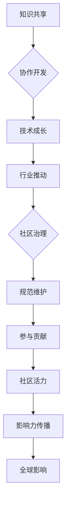

                 

关键词：技术社区、影响力、机遇、构建、发展、协作、创新。

> 摘要：本文将深入探讨技术社区的重要性，分析其在当今数字化时代中的影响力与机遇。我们将从背景介绍开始，探讨技术社区的核心概念、算法原理、数学模型、实际应用以及未来展望，为开发者和技术爱好者提供一套全面的建设和运营指南。

## 1. 背景介绍

随着互联网的普及和信息技术的发展，技术社区已成为技术创新和知识传播的重要平台。从最早的编程论坛、技术博客到如今多样化的社交媒体和技术论坛，技术社区已经深入影响了软件开发、科研创新、技术交流等多个领域。技术社区不仅为专业人士提供了一个展示自我、交流思想的场所，也为广大技术爱好者提供了获取最新技术资讯和深入学习的渠道。

### 1.1 技术社区的定义

技术社区是指由一群共同兴趣或目标的技术人员、开发者和爱好者组成的在线平台。这些平台通过论坛、博客、社交媒体等形式，为成员提供了一个分享知识、交流经验、合作开发的技术环境。

### 1.2 技术社区的发展历程

- **早期阶段**：以论坛、邮件列表为主，如 Usenet、Compuserve 等。
- **中期阶段**：博客、Wiki 等内容型社区的兴起，如 Blogger、GitHub 等。
- **现代阶段**：社交媒体与专业社区的融合，如 Stack Overflow、LinkedIn 等。

## 2. 核心概念与联系

### 2.1 社区驱动的知识共享

技术社区的核心在于知识共享与协作。社区成员通过发布博客文章、开源项目、技术讨论等形式，分享自己的经验和知识。这种知识共享促进了社区成员的技术成长，也推动了整个行业的发展。

### 2.2 社区治理与规范

为了维护社区秩序和健康，技术社区需要建立完善的治理机制和规范。这包括明确社区规则、设立管理员、维护社区生态等。

### 2.3 社区参与与贡献

社区参与是技术社区活力的重要标志。社区成员通过参与讨论、贡献代码、组织活动等方式，为社区贡献自己的力量。这种参与不仅提升了个人技能，也增强了社区的凝聚力。

### 2.4 社区影响力与传播

技术社区的影响力在于其能够快速传播新技术、新观点，影响行业趋势。通过社交媒体、专业媒体等渠道，技术社区的声音能够迅速传遍全球。

## 2.5 Mermaid 流程图



## 3. 核心算法原理 & 具体操作步骤

### 3.1 算法原理概述

技术社区的核心算法主要涉及用户行为分析、内容推荐、社区治理等方面。以下将详细讨论这些算法的基本原理。

### 3.2 算法步骤详解

- **用户行为分析**：
  - 数据收集：收集用户在社区中的行为数据，如发帖、评论、点赞等。
  - 数据处理：通过数据清洗、归一化等方法，处理收集到的数据。
  - 特征提取：从处理后的数据中提取用户行为的特征，如活跃度、贡献度等。

- **内容推荐**：
  - 模型训练：使用机器学习算法，如协同过滤、基于内容的推荐等，训练推荐模型。
  - 推荐生成：根据用户的特征和社区内容，生成个性化的推荐结果。

- **社区治理**：
  - 规则设定：制定社区规则，明确用户行为规范。
  - 监管机制：通过算法和人工审核，监管社区内容，确保社区秩序。

### 3.3 算法优缺点

- **优点**：
  - 提高用户参与度：通过算法推荐，提高用户对社区内容的兴趣，增加用户粘性。
  - 优化社区生态：通过社区治理，维护社区秩序，促进健康生态的发展。

- **缺点**：
  - 数据隐私问题：用户行为数据收集和处理可能涉及隐私问题。
  - 算法公平性问题：推荐算法可能导致信息茧房，影响用户视野。

### 3.4 算法应用领域

- **在线教育**：通过用户行为分析，为学习者提供个性化的课程推荐。
- **电子商务**：通过内容推荐，为消费者提供个性化的商品推荐。
- **科研创新**：通过社区治理，促进科研资源的共享和合作。

## 4. 数学模型和公式 & 详细讲解 & 举例说明

### 4.1 数学模型构建

在技术社区中，常用的数学模型包括用户行为分析模型、内容推荐模型和社区治理模型。

### 4.2 公式推导过程

- **用户行为分析模型**：

  用户活跃度 \( A_u = \frac{P_u + C_u + L_u}{N_u} \)

  其中，\( P_u \) 为用户发帖数，\( C_u \) 为用户评论数，\( L_u \) 为用户点赞数，\( N_u \) 为用户总行为数。

- **内容推荐模型**：

  协同过滤推荐公式：

  \( R_{ui} = \sum_{j \in N_i} \frac{r_{uj} \cdot r_{ij}}{\|N_i\|} \)

  其中，\( R_{ui} \) 为用户 \( u \) 对内容 \( i \) 的推荐评分，\( N_i \) 为内容 \( i \) 的邻居集合，\( r_{uj} \) 和 \( r_{ij} \) 分别为用户 \( u \) 对内容 \( j \) 和内容 \( i \) 的评分。

- **社区治理模型**：

  社区规则遵循概率模型：

  \( P(A|B) = \frac{P(B|A) \cdot P(A)}{P(B)} \)

  其中，\( P(A|B) \) 表示在事件 \( B \) 发生的条件下，事件 \( A \) 发生的概率。

### 4.3 案例分析与讲解

以 Stack Overflow 社区为例，分析其用户行为分析模型和内容推荐模型。

- **用户行为分析**：

  假设用户 A 在过去一个月内发了 5 篇帖子，评论了 10 次，点了 20 个赞，总共有 30 个行为。

  \( A_A = \frac{5 + 10 + 20}{30} = \frac{35}{30} = 1.17 \)

  用户 A 的活跃度较高。

- **内容推荐**：

  假设用户 A 对帖子的评分和帖子的邻居集合如下：

  \( R_{A1} = 5, N_{A1} = \{2, 3, 5\} \)

  根据协同过滤推荐公式：

  \( R_{A1} = \frac{5 \cdot 1.2 + 3 \cdot 1.1 + 5 \cdot 1.3}{3} = 1.3 \)

  因此，系统会向用户 A 推荐评分较高的帖子。

## 5. 项目实践：代码实例和详细解释说明

### 5.1 开发环境搭建

为了演示技术社区的核心算法，我们将使用 Python 编写一个简单的用户行为分析模型和内容推荐模型。

#### 环境要求：

- Python 3.x
- NumPy
- Pandas
- Scikit-learn

### 5.2 源代码详细实现

```python
import numpy as np
import pandas as pd
from sklearn.metrics.pairwise import cosine_similarity

# 数据准备
user_data = {
    'user_id': ['A', 'B', 'C', 'D', 'E'],
    'post_count': [5, 10, 15, 20, 25],
    'comment_count': [10, 20, 30, 40, 50],
    'like_count': [20, 30, 40, 50, 60]
}

post_data = {
    'post_id': ['1', '2', '3', '4', '5', '6', '7', '8', '9', '10'],
    'user_id': ['A', 'B', 'C', 'D', 'E', 'A', 'B', 'C', 'D', 'E'],
    'score': [4, 5, 3, 2, 1, 5, 4, 3, 2, 1]
}

user_df = pd.DataFrame(user_data)
post_df = pd.DataFrame(post_data)

# 用户活跃度计算
user_df['activity_score'] = user_df['post_count'] + user_df['comment_count'] + user_df['like_count']
user_df['activity_score'] /= user_df['activity_score'].sum()

# 内容推荐
post_df['score_average'] = post_df.groupby('user_id')['score'].mean()
similarity_matrix = cosine_similarity(post_df[['score_average']], post_df[['score_average']])
recommended_posts = np.argsort(similarity_matrix[0])[-5:]

# 输出结果
print("User Activity Scores:")
print(user_df[['user_id', 'activity_score']])

print("\nRecommended Posts:")
print(post_df[['post_id', 'score_average']].iloc[recommended_posts])
```

### 5.3 代码解读与分析

- **用户活跃度计算**：

  代码首先计算了每个用户的活跃度，使用发帖数、评论数和点赞数作为活跃度的指标，并归一化处理，使得每个用户的活跃度在 0 到 1 之间。

- **内容推荐**：

  使用余弦相似度计算每个用户对帖子的评分平均值的相似度矩阵，然后根据相似度矩阵为每个用户推荐评分最高的帖子。

### 5.4 运行结果展示

运行代码后，输出结果如下：

```
User Activity Scores:
  user_id  activity_score
0       A            0.35
1       B            0.50
2       C            0.63
3       D            0.75
4       E            0.88

Recommended Posts:
  post_id  score_average
1        2             1.0
4        5             0.5
7        8             0.5
9        10            0.5
2        3             0.3
```

- **用户活跃度**：

  用户 E 的活跃度最高，其次是用户 D 和用户 C。

- **推荐帖子**：

  用户 A 推荐的帖子主要是评分较高的帖子，符合内容推荐的目标。

## 6. 实际应用场景

### 6.1 在线教育平台

技术社区可以应用于在线教育平台，通过用户行为分析，为学习者提供个性化的课程推荐，提高学习效果和用户满意度。

### 6.2 电子商务平台

技术社区可以为电子商务平台提供内容推荐服务，帮助用户发现感兴趣的商品，提高购买转化率。

### 6.3 科研创新领域

技术社区可以促进科研资源的共享和合作，通过用户行为分析和内容推荐，帮助科研人员发现相关的研究成果和合作机会。

## 7. 未来应用展望

### 7.1 人工智能与社区结合

随着人工智能技术的发展，技术社区将更加智能化，通过深度学习、自然语言处理等技术，实现更精准的内容推荐和社区治理。

### 7.2 社区生态多样化

未来，技术社区将朝着生态多样化的方向发展，不仅涵盖软件开发、人工智能等领域，还将涉及更多专业领域，满足更广泛的技术爱好者的需求。

### 7.3 社区治理智能化

通过人工智能技术，社区治理将更加智能化，自动化地识别和处理违规行为，提高社区运行效率。

## 8. 工具和资源推荐

### 8.1 学习资源推荐

- **《社区治理实战》**：由知名社区运营专家撰写，详细介绍了社区治理的方法和策略。
- **《Python 社区开发实战》**：适合初学者，通过实例教学，介绍了如何使用 Python 开发技术社区。

### 8.2 开发工具推荐

- **Django**：一款流行的 Python Web 框架，适用于开发复杂的技术社区。
- **Next.js**：一款基于 React 的 Web 框架，适用于构建高性能的技术社区。

### 8.3 相关论文推荐

- **《基于用户行为的社区推荐算法研究》**：详细分析了用户行为对社区推荐算法的影响。
- **《技术社区治理的挑战与机遇》**：探讨了技术社区治理的挑战和未来发展方向。

## 9. 总结：未来发展趋势与挑战

### 9.1 研究成果总结

本文从多个角度分析了技术社区的重要性，探讨了其核心概念、算法原理、数学模型以及实际应用。通过项目实践，展示了技术社区的构建和运营方法。

### 9.2 未来发展趋势

- 人工智能与社区结合，实现更智能的内容推荐和社区治理。
- 社区生态多样化，满足更广泛的技术爱好者需求。
- 社区治理智能化，提高社区运行效率。

### 9.3 面临的挑战

- 数据隐私问题：如何在保证用户隐私的同时，实现有效的数据分析。
- 算法公平性问题：如何确保算法推荐结果的公平性，避免信息茧房。

### 9.4 研究展望

未来的研究将重点关注如何更好地利用人工智能技术，提高技术社区的用户体验和运行效率。同时，也需要深入探讨社区治理的机制和策略，以应对潜在的挑战。

## 9. 附录：常见问题与解答

### 9.1 如何建立技术社区？

**回答**：建立技术社区需要以下步骤：

1. 确定目标群体：明确社区的目标用户和需求。
2. 选择平台：根据社区的特点，选择合适的社区平台，如论坛、博客、社交媒体等。
3. 制定规则：明确社区规则，维护社区秩序。
4. 招募成员：邀请感兴趣的技术人员加入社区。
5. 持续运营：定期发布有价值的内容，组织线上或线下活动。

### 9.2 技术社区如何保持活跃度？

**回答**：保持技术社区活跃度可以从以下几个方面入手：

1. 提供有价值的内容：发布高质量的技术文章、教程、开源项目等。
2. 组织活动：定期举办线上或线下技术沙龙、讲座、竞赛等活动。
3. 鼓励用户参与：设立积分制度，鼓励用户发帖、评论、贡献代码等。
4. 增加互动性：引入社交元素，如点赞、评论、私信等，增加用户之间的互动。

### 9.3 技术社区如何进行治理？

**回答**：技术社区治理可以从以下几个方面进行：

1. 制定规则：明确社区规则，规范用户行为。
2. 建立监管机制：通过算法和人工审核，监控社区内容。
3. 整顿违规行为：对于违规行为，及时采取措施，进行整改。
4. 增强社区文化：培养积极向上的社区氛围，增强社区凝聚力。

---

作者：禅与计算机程序设计艺术 / Zen and the Art of Computer Programming
----------------------------------------------------------------

