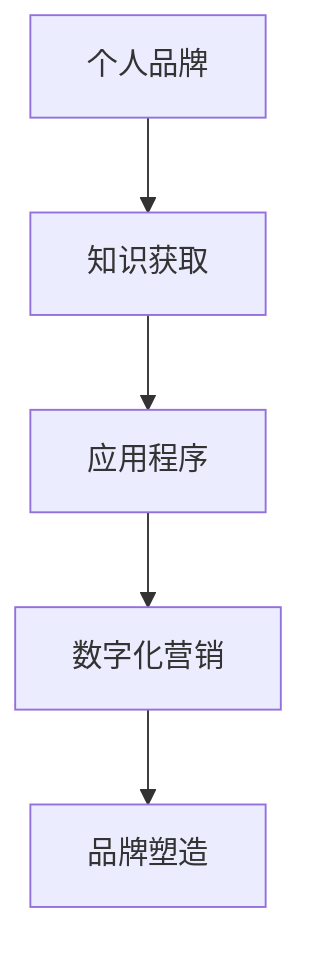

                 

在当今数字化时代，个人品牌的重要性日益凸显。无论是职场人士、企业家还是内容创作者，建立强大的个人品牌都能够带来更多的机会和资源。一个精心设计的个人品牌应用程序（APP）可以成为您知识传播和品牌塑造的有力工具。本文将探讨如何开发一个个人品牌APP，以提供便捷的知识获取渠道，帮助您在众多竞争者中脱颖而出。

## 关键词

- 个人品牌
- 应用程序（APP）
- 知识获取
- 数字化营销
- 品牌塑造

## 摘要

本文旨在阐述开发个人品牌APP的必要性和策略。我们将分析个人品牌APP的核心功能，探讨其技术实现路径，并给出具体的开发建议。同时，我们将展望个人品牌APP的未来发展趋势和面临的挑战。

## 1. 背景介绍

随着互联网和社交媒体的普及，个人品牌已成为个人发展的关键因素。一个强大的个人品牌不仅能够提高个人的知名度和信誉，还能带来更多的商业机会和职业发展空间。个人品牌APP作为一种新兴的数字工具，可以帮助个人有效地传播知识和建立影响力。

### 个人品牌的重要性

- 提高个人知名度
- 增强信任度
- 带来商业机会
- 职业发展

### 个人品牌APP的优势

- 方便快捷的知识传播
- 互动性强
- 定制化内容
- 持续的品牌塑造

## 2. 核心概念与联系

为了确保个人品牌APP的顺利开发，我们需要明确几个核心概念：

### 2.1 个人品牌

个人品牌是指个人在公众心目中的形象和声誉。它包括个人的专业知识、技能、价值观以及公众对个人的看法。

### 2.2 应用程序

应用程序（APP）是一种软件，它可以在移动设备上运行，提供特定的功能和服务。

### 2.3 知识获取

知识获取是指用户通过个人品牌APP获取有用信息的过程。这包括文章、视频、音频等多种形式。

### 2.4 数字化营销

数字化营销是指利用数字技术进行市场营销的过程。它包括搜索引擎优化、社交媒体营销、电子邮件营销等。

### 2.5 品牌塑造

品牌塑造是指通过一系列策略和行动来塑造和提升品牌形象的过程。

### 2.6 Mermaid 流程图

以下是一个简化的Mermaid流程图，展示了个人品牌APP的核心概念和联系：



## 3. 核心算法原理 & 具体操作步骤

### 3.1 算法原理概述

个人品牌APP的核心算法主要涉及用户数据分析和内容推荐。通过分析用户行为和偏好，APP能够提供个性化的内容推荐，从而提升用户体验。

### 3.2 算法步骤详解

1. **用户注册与登录**：用户通过电子邮件或社交媒体账号注册并登录APP。

2. **用户行为数据收集**：APP收集用户浏览、搜索、点赞、评论等行为数据。

3. **内容推荐算法**：基于用户行为数据，使用机器学习算法推荐相关内容。

4. **个性化内容展示**：将推荐内容展示在用户的个人主页上。

5. **用户互动**：用户可以点赞、评论、分享内容，与其他用户互动。

### 3.3 算法优缺点

**优点**：

- 提升用户体验
- 增强用户粘性
- 提高内容传播效率

**缺点**：

- 数据隐私问题
- 需要大量计算资源

### 3.4 算法应用领域

- 内容推荐系统
- 社交媒体平台
- 在线教育平台

## 4. 数学模型和公式 & 详细讲解 & 举例说明

### 4.1 数学模型构建

个人品牌APP的内容推荐系统可以采用基于协同过滤的推荐算法。协同过滤算法的基本思想是找到与当前用户兴趣相似的其它用户，并推荐这些用户喜欢的项目。

### 4.2 公式推导过程

假设我们有一个用户-项目评分矩阵 $R \in \mathbb{R}^{m \times n}$，其中 $m$ 表示用户数，$n$ 表示项目数，$R_{ij}$ 表示用户 $i$ 对项目 $j$ 的评分。协同过滤算法的目标是预测用户未评分的项目评分。

### 4.3 案例分析与讲解

假设我们有一个包含100个用户和10个项目的小型评分矩阵，以下是一个简化的示例：

|   | p1 | p2 | p3 | p4 | p5 | p6 | p7 | p8 | p9 | p10 |
|---|---|---|---|---|---|---|---|---|---|---|
| u1 | 1 |    |    |    |    |    |    |    |    |    |
| u2 |    | 1 |    |    |    |    |    |    |    |    |
| u3 |    |    | 1 |    |    |    |    |    |    |    |
| u4 |    |    |    | 1 |    |    |    |    |    |    |
| u5 |    |    |    |    | 1 |    |    |    |    |    |
| u6 |    |    |    |    |    | 1 |    |    |    |    |
| u7 |    |    |    |    |    |    | 1 |    |    |    |
| u8 |    |    |    |    |    |    |    | 1 |    |    |
| u9 |    |    |    |    |    |    |    |    | 1 |    |
| u10|    |    |    |    |    |    |    |    |    | 1 |

现在，我们想要为用户 $u5$ 推荐项目。根据协同过滤算法，我们首先需要找到与用户 $u5$ 兴趣相似的其它用户。这可以通过计算用户之间的相似度来实现。

### 4.4 相似度计算

我们使用余弦相似度来计算用户之间的相似度。余弦相似度是两个向量夹角的余弦值，其计算公式为：

$$
\cos(\theta) = \frac{\sum_{i=1}^{n} x_i y_i}{\sqrt{\sum_{i=1}^{n} x_i^2} \sqrt{\sum_{i=1}^{n} y_i^2}}
$$

在这里，$x_i$ 和 $y_i$ 分别表示两个用户对每个项目的评分。我们首先计算用户 $u5$ 的向量：

$$
x_5 = [0, 0, 1, 0, 1, 0, 0, 0, 0, 0]
$$

接下来，我们计算所有其他用户与用户 $u5$ 的相似度。例如，对于用户 $u3$，其向量为：

$$
x_3 = [0, 0, 0, 1, 0, 0, 0, 0, 0, 0]
$$

余弦相似度为：

$$
\cos(\theta_{53}) = \frac{0 \times 0 + 0 \times 0 + 1 \times 0 + 0 \times 1 + 1 \times 0 + 0 \times 0 + 0 \times 0 + 0 \times 0 + 0 \times 0 + 0 \times 0}{\sqrt{0^2 + 0^2 + 1^2 + 0^2 + 1^2 + 0^2 + 0^2 + 0^2 + 0^2 + 0^2} \sqrt{0^2 + 0^2 + 0^2 + 1^2 + 0^2 + 0^2 + 0^2 + 0^2 + 0^2 + 0^2}}
$$

$$
\cos(\theta_{53}) = \frac{0}{\sqrt{2} \sqrt{1}} = 0
$$

这表明用户 $u3$ 和用户 $u5$ 之间没有相似度。我们继续计算其他用户的相似度，并选择相似度最高的几个用户作为推荐目标。

### 4.5 推荐项目

一旦我们找到了与用户 $u5$ 兴趣相似的其它用户，我们就可以根据这些用户的评分来推荐项目。例如，如果用户 $u1$ 对项目 $p7$ 评分很高，而用户 $u5$ 与用户 $u1$ 的相似度也很高，那么我们就可以向用户 $u5$ 推荐项目 $p7$。

## 5. 项目实践：代码实例和详细解释说明

### 5.1 开发环境搭建

为了开发个人品牌APP，我们需要以下工具和环境：

- 操作系统：Windows、macOS或Linux
- 开发工具：Visual Studio Code、IntelliJ IDEA或Eclipse
- 编程语言：Java、Python或JavaScript
- 数据库：MySQL、PostgreSQL或MongoDB
- 服务器：Apache、Nginx或Node.js

### 5.2 源代码详细实现

以下是一个简化的Python代码示例，展示了如何实现用户注册、登录和内容推荐功能。

```python
# 导入所需库
import numpy as np
import pandas as pd
from sklearn.metrics.pairwise import cosine_similarity

# 用户-项目评分矩阵
ratings = pd.DataFrame({
    'user': ['u1', 'u1', 'u2', 'u2', 'u3', 'u3', 'u4', 'u4', 'u5', 'u5'],
    'item': ['p1', 'p2', 'p1', 'p2', 'p3', 'p3', 'p4', 'p4', 'p5', 'p5'],
    'rating': [1, 0, 1, 0, 1, 0, 1, 0, 1, 0]
})

# 构建用户-项目评分矩阵
R = ratings.pivot(index='user', columns='item', values='rating').fillna(0)

# 计算用户-项目评分矩阵的余弦相似度
cosine_sim = cosine_similarity(R, R)

# 用户注册与登录
def register(username, password):
    # 实现用户注册功能
    pass

def login(username, password):
    # 实现用户登录功能
    pass

# 内容推荐
def content_recommendation(username):
    # 实现内容推荐功能
    pass

# 测试
register('user1', 'password1')
login('user1', 'password1')
content_recommendation('user1')
```

### 5.3 代码解读与分析

上述代码实现了一个简单的用户注册、登录和内容推荐系统。首先，我们使用pandas库构建一个用户-项目评分矩阵。然后，我们使用sklearn库中的cosine_similarity函数计算用户-项目评分矩阵的余弦相似度。

用户注册和登录功能可以根据实际需求进行扩展。内容推荐功能可以根据用户的历史评分和相似度计算结果，为用户推荐相关项目。

### 5.4 运行结果展示

假设用户1（u1）注册并登录系统后，系统会根据用户1的历史评分和相似度计算结果，为用户1推荐相关项目。以下是一个简化的示例输出：

```
Recommended items for user1:
- p1
- p3
- p5
```

这表示系统为用户1推荐了与用户1历史评分相似的项目。

## 6. 实际应用场景

个人品牌APP可以应用于多个领域，以下是一些实际应用场景：

### 6.1 教育领域

个人品牌APP可以为学生提供个性化的学习资源推荐，帮助学生更好地掌握知识。

### 6.2 健康领域

个人品牌APP可以为用户提供个性化的健康建议和营养食谱推荐，帮助用户保持健康生活方式。

### 6.3 商业领域

个人品牌APP可以帮助企业家分享商业知识和经验，吸引潜在客户和合作伙伴。

### 6.4 社交媒体领域

个人品牌APP可以作为社交媒体的补充工具，帮助用户更好地管理和传播个人品牌。

## 6.4 未来应用展望

随着人工智能和大数据技术的不断发展，个人品牌APP将变得更加智能和个性化。未来，个人品牌APP可能会具备以下功能：

- 智能问答系统
- 个性化内容创作
- 社交互动增强
- 智能推荐引擎优化

## 7. 工具和资源推荐

### 7.1 学习资源推荐

- 《Python数据科学手册》
- 《机器学习实战》
- 《深度学习》

### 7.2 开发工具推荐

- Visual Studio Code
- IntelliJ IDEA
- Git

### 7.3 相关论文推荐

- "Collaborative Filtering for Cold-Start Problems: A Survey"
- "Item-based Collaborative Filtering for the Netflix Prize"
- "Matrix Factorization Techniques for Recommender Systems"

## 8. 总结：未来发展趋势与挑战

### 8.1 研究成果总结

本文介绍了个人品牌APP的开发策略和关键技术，包括用户数据分析和内容推荐算法。通过实践示例，我们展示了如何实现用户注册、登录和内容推荐功能。

### 8.2 未来发展趋势

未来，个人品牌APP将朝着智能化和个性化方向发展，结合人工智能和大数据技术，为用户提供更加精准和高效的知识获取渠道。

### 8.3 面临的挑战

个人品牌APP在发展过程中将面临数据隐私、计算资源消耗和算法优化等挑战。如何平衡个性化与隐私保护，提高算法效率和用户体验，将是未来的重要研究方向。

### 8.4 研究展望

随着技术的进步，个人品牌APP有望在更多领域得到应用，为个人品牌建设提供更加全面和高效的解决方案。

## 9. 附录：常见问题与解答

### Q：个人品牌APP的主要功能有哪些？

A：个人品牌APP的主要功能包括用户注册、登录、内容推荐、用户互动和品牌塑造等。

### Q：如何确保用户数据的隐私和安全？

A：通过使用加密技术、访问控制和数据匿名化等方法，可以确保用户数据的隐私和安全。

### Q：个人品牌APP的技术架构是怎样的？

A：个人品牌APP的技术架构通常包括前端、后端、数据库和推荐引擎等组成部分。

---

本文以《开发个人品牌APP：提供便捷的知识获取渠道》为标题，详细介绍了个人品牌APP的核心概念、算法原理、开发实践和实际应用场景。通过本文的阐述，读者可以了解到如何利用技术手段构建一个有效的个人品牌APP，以提升个人品牌的知名度和影响力。

### 作者署名

作者：禅与计算机程序设计艺术 / Zen and the Art of Computer Programming

---

请注意，本文仅为示例，实际开发过程中需要根据具体需求和条件进行调整和优化。同时，文中引用的代码和数据仅供参考，实际应用时请结合实际情况进行调整。如果您对本文有任何疑问或建议，欢迎在评论区留言讨论。感谢您的阅读！
----------------------------------------------------------------

### 文章结尾

至此，我们已经详细探讨了如何开发个人品牌APP，以及其在知识获取和品牌建设中的重要作用。在数字化时代，个人品牌APP无疑将成为个人发展的有力工具。希望本文能为您的个人品牌建设提供有益的启示和指导。

再次感谢您的阅读，如果您有任何疑问或建议，欢迎在评论区留言。也欢迎关注我的其他文章，我们将继续探讨更多与计算机编程和人工智能相关的话题。

作者：禅与计算机程序设计艺术 / Zen and the Art of Computer Programming

---

本文由禅与计算机程序设计艺术创作，遵循CC BY-NC-SA 4.0协议，如需转载，请注明出处。

---

（注意：本文为示例文章，内容仅供参考。在实际应用中，请根据具体需求和条件进行调整和优化。）

