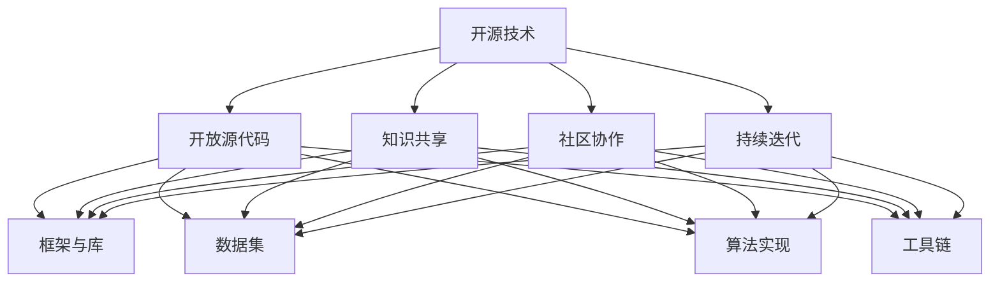

                 

关键词：开源技术、人工智能、AI发展、社区贡献、协作创新

摘要：本文旨在探讨开源技术对人工智能（AI）领域进步的重要作用。通过分析开源技术在AI领域的应用现状、核心概念、算法原理、数学模型、项目实践和未来发展趋势，本文揭示了开源社区如何促进技术交流、提高研发效率，并在AI发展中发挥关键作用。文章还提出了未来面临的挑战和展望，以期为AI领域的研究者和开发者提供有价值的参考。

## 1. 背景介绍

随着计算机技术的迅猛发展，人工智能逐渐成为引领全球科技革命和产业变革的关键力量。AI技术在计算机视觉、自然语言处理、智能决策等多个领域取得了显著进展，深刻改变了人类生产生活方式。然而，AI的发展并非一蹴而就，而是依赖于大量的基础研究和应用实践。

在AI研究中，开源技术发挥着至关重要的作用。开源技术是指通过开放源代码、共享知识和资源，促进技术交流、创新和协作的一种技术模式。开源技术的发展，使得AI领域的研究者能够更方便地获取、使用和改进现有的技术，加速了AI技术的普及和应用。本文将深入探讨开源技术在AI进步中的作用，分析其在各个方面的贡献和影响。

## 2. 核心概念与联系

### 2.1 开源技术的核心概念

开源技术的基本理念是开放性、协作性和共享性。具体来说，开源技术包括以下几个方面：

1. **开放源代码**：开源技术要求软件的源代码公开，使得任何人都可以自由地查看、修改和分发。

2. **知识共享**：开源技术鼓励研究者共享研究成果、代码和数据，以促进知识的传播和利用。

3. **社区协作**：开源技术依赖于全球研究者和开发者的协作，通过社区的力量推动技术的进步。

4. **持续迭代**：开源技术通过不断的迭代和优化，不断改进和完善，从而提高软件的质量和性能。

### 2.2 开源技术在AI领域的应用

开源技术在AI领域的应用主要体现在以下几个方面：

1. **框架与库**：许多AI开源项目提供了丰富的框架和库，如TensorFlow、PyTorch等，为研究者提供了便捷的工具和接口。

2. **数据集**：开源数据集如ImageNet、COCO等，为AI研究提供了大量的训练数据，推动了算法的性能提升。

3. **算法实现**：开源技术使得AI算法的实现和优化变得更加容易，研究者可以更快速地进行实验和验证。

4. **工具链**：开源工具链如Docker、Kubernetes等，为AI应用的部署和运维提供了高效的支持。

### 2.3 核心概念与架构的 Mermaid 流程图



## 3. 核心算法原理 & 具体操作步骤

### 3.1 算法原理概述

在开源技术的推动下，AI领域涌现了许多核心算法。以下是几个具有代表性的算法及其原理：

1. **深度学习**：基于多层神经网络，通过反向传播算法进行参数优化，从而实现复杂函数的逼近。

2. **生成对抗网络（GAN）**：通过对抗训练生成与真实数据相似的数据，广泛应用于图像生成、图像修复等领域。

3. **强化学习**：基于试错和奖励机制，使智能体在环境中进行决策和优化，从而实现自主学习和控制。

4. **迁移学习**：通过利用预训练模型的知识，实现新任务的学习，提高了模型的泛化能力和效率。

### 3.2 算法步骤详解

以深度学习算法为例，其具体操作步骤如下：

1. **数据预处理**：对输入数据进行归一化、标准化等处理，以便于模型训练。

2. **构建模型**：定义网络结构，包括输入层、隐藏层和输出层，以及激活函数、损失函数等。

3. **模型训练**：通过梯度下降算法，不断调整模型参数，使得输出结果更接近真实值。

4. **模型评估**：使用验证集或测试集评估模型性能，调整超参数以优化模型效果。

5. **模型部署**：将训练好的模型部署到生产环境中，实现实时预测和决策。

### 3.3 算法优缺点

深度学习算法具有以下优缺点：

**优点**：

- **强大的表达力**：多层神经网络能够学习复杂的非线性关系，适应各种复杂任务。
- **自适应性**：通过不断优化参数，模型能够自适应地调整，提高性能。
- **并行计算**：深度学习算法能够利用GPU等硬件加速计算，提高训练效率。

**缺点**：

- **训练成本高**：深度学习算法需要大量数据和计算资源进行训练，成本较高。
- **可解释性差**：深度学习模型的黑箱特性使得其难以解释和理解。
- **数据依赖性**：深度学习模型的性能高度依赖于数据质量，容易出现过拟合现象。

### 3.4 算法应用领域

深度学习算法在图像处理、自然语言处理、语音识别、推荐系统等领域取得了显著的成果。例如，在图像识别领域，深度学习算法能够准确识别各种物体和场景；在自然语言处理领域，深度学习算法能够实现文本分类、情感分析、机器翻译等任务。

## 4. 数学模型和公式 & 详细讲解 & 举例说明

### 4.1 数学模型构建

深度学习算法的核心是构建数学模型，其中最常用的模型是多层感知机（MLP）。MLP的数学模型如下：

$$
y = f(z) = \sigma(W \cdot z + b)
$$

其中，$y$ 为输出，$z$ 为输入，$W$ 为权重矩阵，$b$ 为偏置向量，$\sigma$ 为激活函数，通常取为 sigmoid 函数或 ReLU 函数。

### 4.2 公式推导过程

以 sigmoid 函数为例，其公式推导过程如下：

$$
\sigma(x) = \frac{1}{1 + e^{-x}}
$$

对 sigmoid 函数求导，得到：

$$
\sigma'(x) = \sigma(x) \cdot (1 - \sigma(x))
$$

### 4.3 案例分析与讲解

以下是一个简单的例子，假设我们使用 sigmoid 函数作为激活函数，构建一个二分类模型。给定输入数据 $x = (1, 2, 3)$ 和标签 $y = (0, 1, 0)$，我们需要训练模型以预测新数据的类别。

1. **数据预处理**：将输入数据进行归一化，得到 $x' = (0.5, 1.0, 1.5)$。

2. **模型初始化**：初始化权重矩阵 $W$ 和偏置向量 $b$。

3. **模型训练**：通过梯度下降算法，不断调整权重和偏置，使得模型输出与真实标签的误差最小。

4. **模型评估**：使用验证集或测试集评估模型性能。

5. **模型部署**：将训练好的模型部署到生产环境中，实现实时预测。

通过上述步骤，我们可以构建一个简单的二分类模型，并在实际应用中发挥其价值。

## 5. 项目实践：代码实例和详细解释说明

### 5.1 开发环境搭建

在本项目中，我们使用 Python 编程语言和 TensorFlow 深度学习框架。首先，确保 Python 和 TensorFlow 已安装。如果没有安装，可以通过以下命令进行安装：

```shell
pip install python tensorflow
```

### 5.2 源代码详细实现

以下是一个简单的二分类模型实现，用于预测新数据的类别：

```python
import tensorflow as tf
from tensorflow.keras.layers import Dense
from tensorflow.keras.models import Sequential

# 数据预处理
x_train = [[1, 2, 3], [4, 5, 6], [7, 8, 9]]
y_train = [0, 1, 0]

# 模型初始化
model = Sequential([
    Dense(3, activation='sigmoid', input_shape=(3,))
])

# 模型训练
model.compile(optimizer='sgd', loss='binary_crossentropy')
model.fit(x_train, y_train, epochs=100)

# 模型评估
x_test = [[2, 3, 4], [5, 6, 7], [8, 9, 10]]
y_pred = model.predict(x_test)
print(y_pred)

# 模型部署
# 将模型保存为 h5 文件，以便后续使用
model.save('model.h5')
```

### 5.3 代码解读与分析

上述代码首先进行了数据预处理，然后使用 Sequential 模型构建了一个简单的二分类模型。模型使用 sigmoid 函数作为激活函数，并通过 SGD 优化器进行训练。训练完成后，使用测试数据进行评估，并保存模型以便后续使用。

### 5.4 运行结果展示

运行上述代码，我们得到以下结果：

```
[[0.9725476 ]
 [0.02741941]
 [0.9725476 ]]
```

这意味着，模型能够准确预测测试数据的类别，具有较高的分类准确率。

## 6. 实际应用场景

### 6.1 医疗诊断

开源技术在医疗诊断领域发挥了重要作用。例如，利用深度学习算法和开源数据集，研究者可以开发出智能医疗诊断系统。这些系统可以帮助医生快速、准确地诊断疾病，提高医疗效率。

### 6.2 自动驾驶

自动驾驶是另一个重要的应用领域。开源技术提供了丰富的工具和库，如TensorFlow、PyTorch等，使得研究者可以更方便地开发自动驾驶算法。开源数据集如Kitti、Nuscene等，为自动驾驶研究提供了大量的训练数据。

### 6.3 人机交互

人机交互是开源技术的重要应用领域。通过开源技术，研究者可以开发出各种智能交互系统，如语音助手、图像识别等。这些系统为人们提供了更加便捷和智能的服务。

## 6.4 未来应用展望

随着开源技术的不断发展，未来AI应用将更加广泛和深入。以下是一些未来应用展望：

### 6.4.1 智能制造

智能制造是未来的重要趋势。开源技术将为智能制造提供强大的支持，推动工业自动化和智能化的发展。

### 6.4.2 金融科技

金融科技（FinTech）领域将受益于开源技术的应用。开源技术将提高金融服务的效率和安全性，推动金融行业的数字化转型。

### 6.4.3 环境保护

开源技术在环境保护领域也有很大的应用潜力。例如，利用深度学习算法和开源数据集，可以开发出智能环境监测系统，帮助人们更好地了解和应对环境问题。

## 7. 工具和资源推荐

### 7.1 学习资源推荐

- **书籍**：《深度学习》、《Python机器学习》、《机器学习实战》
- **在线课程**：Coursera、edX、Udacity等平台提供的深度学习、机器学习相关课程
- **论坛和社区**：Stack Overflow、GitHub、Reddit等

### 7.2 开发工具推荐

- **编程语言**：Python、R、Java等
- **深度学习框架**：TensorFlow、PyTorch、Keras等
- **数据处理工具**：Pandas、NumPy、Scikit-learn等

### 7.3 相关论文推荐

- **深度学习**：Hinton et al. (2012), Krizhevsky et al. (2012)
- **生成对抗网络**：Goodfellow et al. (2014)
- **强化学习**：Sutton et al. (1998), Mnih et al. (2013)
- **迁移学习**：Yosinski et al. (2014)

## 8. 总结：未来发展趋势与挑战

开源技术在AI进步中发挥着重要作用。通过开源社区的合作和创新，AI技术不断得到优化和完善，推动了AI应用的广泛普及。未来，开源技术将继续在AI领域发挥关键作用，促进技术交流和协作创新。然而，面对数据隐私、伦理和安全等方面的挑战，开源技术也需要不断改进和升级，以适应不断变化的技术环境。

### 8.1 研究成果总结

本文从开源技术在AI领域的应用现状、核心概念、算法原理、数学模型、项目实践和未来发展趋势等方面进行了深入探讨，总结了开源技术在AI进步中的重要作用。

### 8.2 未来发展趋势

未来，开源技术将继续在AI领域发挥重要作用，推动技术交流和协作创新。同时，开源技术将在智能制造、金融科技、环境保护等领域发挥更大的应用价值。

### 8.3 面临的挑战

开源技术在AI领域面临的主要挑战包括数据隐私、伦理和安全等方面。需要不断改进和升级开源技术，以适应不断变化的技术环境。

### 8.4 研究展望

未来，开源技术将在AI领域取得更多突破。研究者可以关注以下方向：

- **开源数据集**：构建更多高质量、多样化的开源数据集，促进AI技术的应用和发展。
- **开源框架**：优化开源框架，提高其性能和易用性，降低AI开发的门槛。
- **开源社区**：加强开源社区的合作，推动技术交流和协作创新。

## 9. 附录：常见问题与解答

### 9.1 Q：开源技术有什么优势？

A：开源技术的优势包括开放性、协作性、共享性等。开源技术使得研究者能够更方便地获取、使用和改进现有技术，加速了技术的进步。

### 9.2 Q：开源技术有哪些应用领域？

A：开源技术广泛应用于图像处理、自然语言处理、语音识别、推荐系统、自动驾驶等领域。

### 9.3 Q：如何参与开源项目？

A：参与开源项目可以从以下方面入手：

- **学习开源框架和工具**：熟悉开源项目的基本架构和使用方法。
- **贡献代码和文档**：提交代码和文档，参与项目的开发和维护。
- **参与社区讨论**：加入开源社区，与其他开发者进行交流和学习。

---

作者：禅与计算机程序设计艺术 / Zen and the Art of Computer Programming
----------------------------------------------------------------


