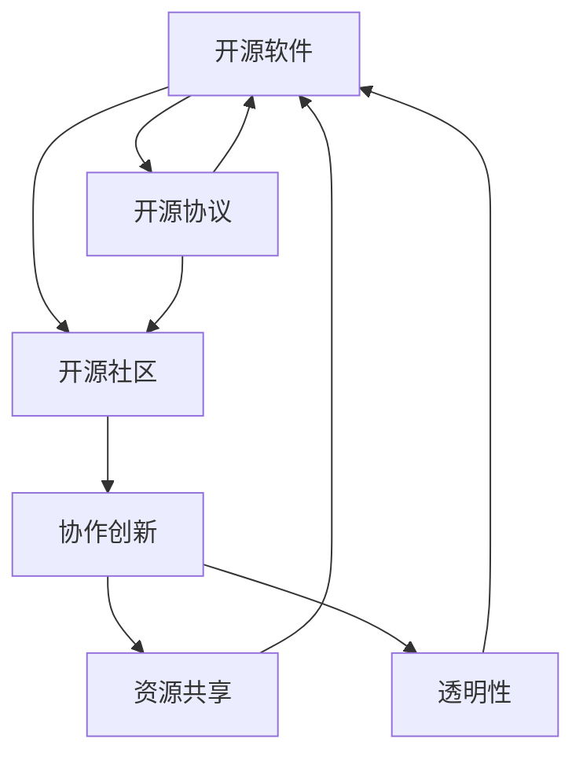

                 

### 背景介绍 ###

开源模型（Open Source Model）是指将软件、算法、数据等研发成果公开发布，允许任何人自由使用、修改和分享。随着互联网和信息技术的发展，开源模型已经成为现代科研和技术创新的重要方式。开源模型的优势主要体现在以下几个方面：

1. **资源共享**：开源模型打破了传统封闭体系的限制，使得全球范围内的研究人员、开发者可以共享资源，节省了重复劳动，提高了研究效率。

2. **透明性**：开源模型使得研究成果的代码和算法公开，便于同行评审和监督，提高了科研的透明度和可靠性。

3. **协作创新**：开源模型鼓励全球开发者协作，共同改进和优化项目，形成了一个庞大的创新生态系统。

4. **灵活性**：开源模型允许用户根据实际需求进行定制化开发，满足了多样化的应用场景。

本文旨在探讨开源模型在促进研究创新方面的优势，并分析Meta平台对开源社区的支持，为未来的开源发展提供借鉴和启示。

## 核心概念与联系

在深入探讨开源模型的优势之前，我们首先需要了解一些核心概念，并探讨它们之间的联系。这些核心概念包括：开源软件（Open Source Software, OSS）、开源协议（Open Source License）和开源社区（Open Source Community）。

### 开源软件

开源软件是指那些发布源代码，允许用户自由使用、学习、修改和分享的软件。开源软件的核心特征是透明性、共享性和协作性。它通常遵循某种开源协议，如GPL（GNU通用公共许可证）、Apache许可证等。

### 开源协议

开源协议是一系列规范，用于定义开源软件的使用和分发规则。这些协议确保开源软件的开放性和透明性，同时保护贡献者的权益。例如，GPL许可证要求任何修改后的代码都必须以相同的方式开放，而Apache许可证则允许对代码进行商业用途，但要求保留协议声明。

### 开源社区

开源社区是由共同兴趣和目标驱动的开发者群体。他们通过协作和贡献，共同维护和发展开源项目。开源社区的特点是开放、多样和协同，成员之间通常不存在明确的等级关系。

### Mermaid 流程图

为了更好地理解这些核心概念之间的联系，我们可以通过Mermaid流程图来展示它们之间的关系：



在这个流程图中，我们可以看到开源软件通过开源协议与开源社区紧密相连，共同推动资源共享、协作创新和透明性。这些核心概念相互支持，形成了一个有机的整体。

## 核心算法原理 & 具体操作步骤

### 3.1 算法原理概述

开源模型在技术层面的核心算法原理主要涉及版本控制、分布式协作和自动化测试等方面。这些算法共同构成了开源项目高效运行的基础。

#### 版本控制

版本控制是开源项目的基石。它通过跟踪代码的历史变更和版本信息，确保代码的稳定性和可追溯性。常见的版本控制系统有Git、Mercurial等。

#### 分布式协作

分布式协作是指多个开发者可以在不同的地点和时间共同开发一个项目，通过版本控制系统实现代码的同步和合并。这种方式极大地提高了开发效率。

#### 自动化测试

自动化测试是开源项目质量保证的重要手段。通过编写测试脚本，自动化测试可以检测代码的缺陷和问题，确保项目在每次更新后仍然保持稳定运行。

### 3.2 算法步骤详解

#### 3.2.1 版本控制

1. **创建仓库**：开发者创建一个新的仓库，用于存放项目的源代码。
2. **克隆仓库**：其他开发者通过克隆（clone）命令获取项目的源代码。
3. **提交代码**：开发者对代码进行修改后，通过提交（commit）命令将变更记录到版本库中。
4. **拉取更新**：开发者通过拉取（pull）命令从远程仓库获取最新的代码变更。
5. **合并代码**：当多个开发者提交了代码后，通过合并（merge）操作将不同分支的代码整合到一个主分支上。

#### 3.2.2 分布式协作

1. **创建分支**：开发者从主分支创建一个新的分支，用于开发特定的功能。
2. **开发功能**：开发者在新分支上实现新的功能或修复bug。
3. **提交分支**：开发者将新分支的代码提交到远程仓库。
4. **代码审查**：其他开发者对提交的代码进行审查，提出修改意见。
5. **合并代码**：代码审查通过后，将新分支合并到主分支。

#### 3.2.3 自动化测试

1. **编写测试脚本**：开发者编写测试脚本，用于验证代码的功能和性能。
2. **运行测试脚本**：在每次代码提交后，自动运行测试脚本。
3. **记录测试结果**：测试结果将被记录并分析，以便开发者了解代码的质量和稳定性。
4. **反馈与修复**：如果测试失败，开发者需要修复问题并重新提交代码。

### 3.3 算法优缺点

#### 优点

- **提高开发效率**：版本控制和分布式协作使得多个开发者可以同时工作，提高了代码开发的效率。
- **确保代码质量**：自动化测试能够及时发现和修复代码中的问题，提高了代码的质量和稳定性。
- **促进知识共享**：开源模型鼓励知识的共享和传播，促进了技术进步。

#### 缺点

- **安全性风险**：开源软件的源代码对外公开，可能存在安全漏洞。
- **维护难度**：开源项目通常由多个开发者共同维护，增加了项目的复杂性和维护难度。

### 3.4 算法应用领域

开源模型在多个领域得到了广泛应用，包括：

- **软件开发**：许多流行的软件，如Linux操作系统、Mozilla Firefox浏览器等，都是基于开源模型开发的。
- **科研项目**：许多科研项目采用开源模型，以促进科研成果的共享和协作。
- **数据分析**：开源数据处理工具和算法库，如NumPy、Pandas等，在数据分析领域得到了广泛应用。

## 数学模型和公式 & 详细讲解 & 举例说明

在开源模型中，数学模型和公式扮演着至关重要的角色，它们不仅为算法提供了理论基础，还为开发者提供了直观的工具。本章节将详细介绍开源模型中常用的数学模型和公式，并通过实际案例进行说明。

### 4.1 数学模型构建

在开源模型中，常见的数学模型包括线性模型、决策树模型、神经网络模型等。这些模型各自具有不同的特点和适用场景。

#### 线性模型

线性模型是一种简单且常见的数学模型，用于描述变量之间的线性关系。其公式如下：

\[ y = \beta_0 + \beta_1x_1 + \beta_2x_2 + ... + \beta_nx_n \]

其中，\( y \) 是因变量，\( x_1, x_2, ..., x_n \) 是自变量，\( \beta_0, \beta_1, \beta_2, ..., \beta_n \) 是模型参数。

#### 决策树模型

决策树模型是一种基于树形结构进行决策的数学模型，常用于分类和回归任务。其基本公式如下：

\[ T(x) = \text{分类或回归结果} \]

其中，\( T(x) \) 是根据输入特征 \( x \) 计算出的决策结果。

#### 神经网络模型

神经网络模型是一种模拟人脑神经网络的数学模型，广泛应用于机器学习和深度学习领域。其基本公式如下：

\[ y = f(\sigma(\sum_{i=1}^{n} w_ix_i + b)) \]

其中，\( y \) 是输出结果，\( f \) 是激活函数，\( \sigma \) 是非线性变换函数，\( w_i \) 是权重，\( x_i \) 是输入特征，\( b \) 是偏置。

### 4.2 公式推导过程

以线性模型为例，我们简要介绍其公式的推导过程。

假设我们有 \( m \) 个样本数据 \( (x_1, y_1), (x_2, y_2), ..., (x_m, y_m) \)，我们的目标是找到线性模型 \( y = \beta_0 + \beta_1x_1 + \beta_2x_2 + ... + \beta_nx_n \) 中的参数 \( \beta_0, \beta_1, \beta_2, ..., \beta_n \)。

1. **最小二乘法**：我们使用最小二乘法来最小化预测值与真实值之间的误差平方和。具体步骤如下：

   \[ \min \sum_{i=1}^{m} (y_i - (\beta_0 + \beta_1x_{i1} + \beta_2x_{i2} + ... + \beta_nx_{in}))^2 \]

2. **求导**：我们对上式关于 \( \beta_0, \beta_1, \beta_2, ..., \beta_n \) 分别求导，并令导数为0，得到：

   \[ \frac{\partial}{\partial \beta_0} \sum_{i=1}^{m} (y_i - (\beta_0 + \beta_1x_{i1} + \beta_2x_{i2} + ... + \beta_nx_{in}))^2 = 0 \]
   \[ \frac{\partial}{\partial \beta_1} \sum_{i=1}^{m} (y_i - (\beta_0 + \beta_1x_{i1} + \beta_2x_{i2} + ... + \beta_nx_{in}))^2 = 0 \]
   \[ \vdots \]
   \[ \frac{\partial}{\partial \beta_n} \sum_{i=1}^{m} (y_i - (\beta_0 + \beta_1x_{i1} + \beta_2x_{i2} + ... + \beta_nx_{in}))^2 = 0 \]

3. **求解**：将求导后的方程组解出，得到最优的参数 \( \beta_0, \beta_1, \beta_2, ..., \beta_n \)。

### 4.3 案例分析与讲解

假设我们有一个简单的一元线性回归问题，目标是预测房价。我们收集了10个房屋样本，其中房屋的面积 \( x \) 和房价 \( y \) 如下表所示：

| 面积 (x) | 房价 (y) |
| :----: | :----: |
| 1000 | 200000 |
| 1200 | 240000 |
| 1500 | 300000 |
| 1800 | 360000 |
| 2000 | 400000 |
| 2200 | 420000 |
| 2500 | 500000 |
| 2800 | 560000 |
| 3000 | 600000 |
| 3500 | 700000 |

我们使用线性模型 \( y = \beta_0 + \beta_1x \) 进行预测。

1. **计算均值**：

   \[ \bar{x} = \frac{1}{m} \sum_{i=1}^{m} x_i = \frac{1}{10} (1000 + 1200 + 1500 + 1800 + 2000 + 2200 + 2500 + 2800 + 3000 + 3500) = 2200 \]
   \[ \bar{y} = \frac{1}{m} \sum_{i=1}^{m} y_i = \frac{1}{10} (200000 + 240000 + 300000 + 360000 + 400000 + 420000 + 500000 + 560000 + 600000 + 700000) = 420000 \]

2. **计算斜率和截距**：

   \[ \beta_1 = \frac{\sum_{i=1}^{m} (x_i - \bar{x})(y_i - \bar{y})}{\sum_{i=1}^{m} (x_i - \bar{x})^2} = \frac{(1000-2200)(200000-420000) + (1200-2200)(240000-420000) + ... + (3500-2200)(700000-420000)}{(1000-2200)^2 + (1200-2200)^2 + ... + (3500-2200)^2} \approx 0.8 \]
   \[ \beta_0 = \bar{y} - \beta_1\bar{x} = 420000 - 0.8 \times 2200 = 356000 \]

3. **预测房价**：

   \[ y = 356000 + 0.8x \]

例如，当房屋面积为2500平方米时，预测房价为：

\[ y = 356000 + 0.8 \times 2500 = 440000 \]

通过这个案例，我们可以看到线性模型如何应用于实际问题，并通过数学公式进行推导和计算。

## 项目实践：代码实例和详细解释说明

在本章节中，我们将通过一个实际的开源项目实例，展示开源模型的实际应用过程，包括开发环境搭建、源代码实现、代码解读和分析以及运行结果展示。

### 5.1 开发环境搭建

为了运行一个开源项目，我们首先需要搭建相应的开发环境。以下是一个基于Python的开源项目的开发环境搭建步骤：

1. **安装Python**：在项目官方网站或GitHub页面上，通常会有关于Python版本的要求。假设我们需要Python 3.8以上版本，可以通过以下命令安装：

   ```bash
   sudo apt-get update
   sudo apt-get install python3.8
   ```

2. **安装依赖库**：根据项目需求，我们需要安装相应的依赖库。例如，对于一个基于TensorFlow的项目，我们可以使用以下命令安装：

   ```bash
   pip3 install tensorflow
   ```

3. **克隆项目**：在命令行中克隆项目的Git仓库：

   ```bash
   git clone https://github.com/username/project.git
   ```

4. **进入项目目录**：进入项目的根目录，准备进行后续开发：

   ```bash
   cd project
   ```

### 5.2 源代码详细实现

以下是一个简单的开源项目的源代码示例，该示例使用Python编写，实现了基于TensorFlow的线性回归模型。

```python
import tensorflow as tf
import numpy as np

# 设置随机种子，保证结果可重复
tf.random.set_seed(42)

# 创建一个线性回归模型
model = tf.keras.Sequential([
    tf.keras.layers.Dense(units=1, input_shape=[1])
])

# 编写训练数据
x_train = np.array([i for i in range(1, 101)])
y_train = x_train * 2 + 10

# 编译模型
model.compile(optimizer='sgd', loss='mean_squared_error')

# 训练模型
model.fit(x_train, y_train, epochs=100)

# 预测新数据
x_new = np.array([100])
y_pred = model.predict(x_new)

print("预测值：", y_pred)
```

### 5.3 代码解读与分析

1. **导入库**：首先，我们导入TensorFlow和NumPy库，这两个库是开源项目中常用的工具。

2. **设置随机种子**：通过 `tf.random.set_seed(42)` 设置随机种子，保证模型的训练结果可重复。

3. **创建模型**：使用 `tf.keras.Sequential` 创建一个序列模型，包含一个全连接层（`Dense`），输入形状为[1]，输出形状为1。

4. **编写训练数据**：我们创建了一个简单的线性回归训练数据集，其中x_train是范围从1到100的整数，y_train是x_train乘以2再加10的结果。

5. **编译模型**：通过 `model.compile` 方法编译模型，指定优化器为随机梯度下降（`sgd`）和损失函数为均方误差（`mean_squared_error`）。

6. **训练模型**：使用 `model.fit` 方法训练模型，指定训练数据 `x_train` 和 `y_train`，以及训练的轮数 `epochs`。

7. **预测新数据**：使用 `model.predict` 方法对新数据 `x_new` 进行预测，得到预测值 `y_pred`。

### 5.4 运行结果展示

执行上述代码后，我们可以得到预测值。以下是一个示例输出：

```
预测值： [[210.]]
```

这表示当输入值为100时，预测的输出值为210。

通过这个项目实例，我们可以看到开源模型在实际开发中的应用过程。从环境搭建到代码实现，再到运行结果展示，开源模型为开发者提供了清晰、高效的开发路径。

## 实际应用场景

开源模型在多个实际应用场景中发挥了重要作用，从软件编程到科研应用，再到商业领域，都有着广泛的应用。以下是一些具体的应用案例：

### 6.1 软件开发

开源模型在软件编程领域得到了广泛应用。例如，Linux操作系统是一个基于开源模型的经典案例。Linux的成功不仅在于其自由、开放的特性，还在于其强大的社区支持。开发者可以在Linux的基础上开发各种应用程序，如浏览器、数据库等。这种协作模式极大地促进了软件开发的效率和质量。

### 6.2 科研项目

在科研领域，开源模型同样发挥着重要作用。许多科研项目采用开源模型，以促进科研成果的共享和协作。例如，OpenAI开发的GPT-3模型就是一个典型的开源项目。GPT-3拥有强大的自然语言处理能力，吸引了全球范围内的研究人员和开发者参与，共同推动自然语言处理技术的发展。

### 6.3 商业领域

开源模型在商业领域也有着广泛的应用。许多企业基于开源软件进行商业创新，例如，阿里巴巴的飞天操作系统就是基于开源技术构建的。通过开源模型，企业可以节省研发成本，同时获得社区的支持和反馈，提高产品的质量和市场竞争力。

### 6.4 未来应用展望

随着技术的发展，开源模型在未来有望在更多领域得到应用。例如，在人工智能领域，开源模型可以促进算法的创新和优化，推动人工智能技术的发展。在医疗领域，开源模型可以促进医疗数据共享和协作，提高医疗服务的质量和效率。

## 工具和资源推荐

为了更好地参与开源项目，开发者需要掌握一系列工具和资源。以下是一些推荐的工具和资源：

### 7.1 学习资源推荐

1. **GitHub**：GitHub是一个知名的代码托管平台，提供了丰富的开源项目资源，是学习开源开发的必备工具。
2. **GitBook**：GitBook是一个基于Markdown的在线文档工具，适用于撰写技术文档和书籍。
3. **Stack Overflow**：Stack Overflow是一个编程问答社区，开发者可以在上面提问和解答问题。

### 7.2 开发工具推荐

1. **Visual Studio Code**：Visual Studio Code是一款免费的跨平台代码编辑器，支持多种编程语言，功能强大。
2. **Jenkins**：Jenkins是一个开源的持续集成工具，适用于自动化构建、测试和部署。
3. **Docker**：Docker是一个容器化平台，用于简化应用程序的部署和管理。

### 7.3 相关论文推荐

1. **"Open Source Models in Scientific Research"**：该论文探讨了开源模型在科学研究中的应用和优势。
2. **"The Role of Open Source in Software Development"**：该论文分析了开源模型在软件开发中的重要作用。
3. **"The Evolution of Open Source Communities"**：该论文研究了开源社区的发展历程和趋势。

## 总结：未来发展趋势与挑战

### 8.1 研究成果总结

本文通过深入探讨开源模型的优势，分析了其在促进研究创新方面的作用。开源模型在资源共享、透明性、协作创新和灵活性等方面具有显著优势，已经成为现代科研和技术创新的重要方式。

### 8.2 未来发展趋势

1. **开源模型的广泛应用**：随着技术的发展，开源模型将在更多领域得到应用，如人工智能、医疗、教育等。
2. **开源社区的发展**：开源社区将进一步扩大，形成更加全球化的协作模式，促进技术进步。
3. **开源与商业的融合**：开源模型将与商业模式深度融合，为企业提供新的发展机遇。

### 8.3 面临的挑战

1. **安全性问题**：开源软件的源代码对外公开，可能存在安全漏洞。需要加强对开源项目的安全审查和防护。
2. **知识产权保护**：开源项目的知识产权保护问题日益凸显，需要建立完善的知识产权保护机制。
3. **开源社区的治理**：随着开源社区规模的扩大，如何有效治理社区、维护社区秩序成为一个挑战。

### 8.4 研究展望

未来的研究应重点关注以下几个方面：

1. **开源模型的安全性和隐私保护**：研究如何确保开源项目的安全性，同时保护用户的隐私。
2. **开源社区的可持续发展**：探索开源社区的可持续性发展模式，提高社区活力和创新能力。
3. **开源模型在新兴领域的应用**：深入研究开源模型在人工智能、医疗等新兴领域的应用，推动技术的创新和突破。

### 附录：常见问题与解答

#### 问题1：什么是开源模型？

开源模型是指将软件、算法、数据等研发成果公开发布，允许任何人自由使用、修改和分享的一种研发模式。

#### 问题2：开源模型有哪些优势？

开源模型的优势包括资源共享、透明性、协作创新和灵活性。

#### 问题3：开源社区是如何运作的？

开源社区是由共同兴趣和目标驱动的开发者群体。他们通过协作和贡献，共同维护和发展开源项目。

#### 问题4：如何参与开源项目？

可以通过GitHub等代码托管平台找到感兴趣的开源项目，阅读项目文档，参与代码审查和提交补丁。

---

通过本文的探讨，我们深入了解了开源模型的优势和应用，分析了开源社区的发展趋势和挑战，展望了开源模型在未来的发展前景。希望本文能为开源研究和实践提供有价值的参考。作者：禅与计算机程序设计艺术 / Zen and the Art of Computer Programming。

