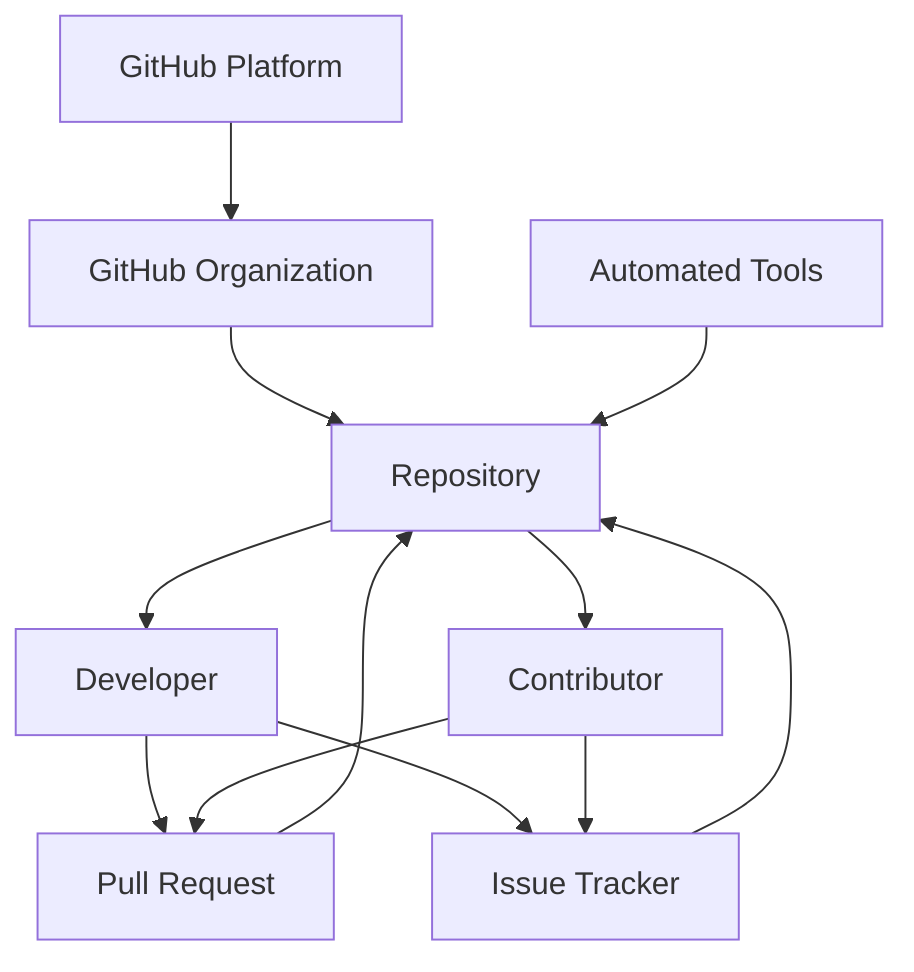

                 

开源社区作为软件开发的重要组成部分，近年来在推动技术进步和创新方面发挥了举足轻重的作用。而开源社区的治理模式，则决定了项目的可持续性、健康发展和社区协作效率。本文将深入探讨两种主流的开源社区治理模式：Apache模式和GitHub模式。通过对比分析这两种模式，我们希望能够为读者提供关于开源社区治理的全面理解，并激发对更高效治理模式的思考。

## 关键词

- 开源社区
- Apache模式
- GitHub模式
- 治理模式
- 社区协作
- 项目可持续性

## 摘要

本文首先介绍了开源社区的基本概念及其重要性，随后详细阐述了Apache模式和GitHub模式这两种主流的开源社区治理模式。通过对比分析，我们揭示了两种模式在治理结构、流程、社区互动等方面的异同，并探讨了各自的优缺点。最后，本文提出了对开源社区治理模式的未来展望，包括可能的改进方向和面临的挑战。

## 1. 背景介绍

开源社区，顾名思义，是指以开源许可协议（如GPL、Apache License等）为基础，允许用户自由使用、修改和分发软件的社区。这种模式促进了知识的共享和技术的创新，极大地推动了软件产业的发展。开源社区不仅吸引了全球开发者的参与，也吸引了众多企业的支持和投入，形成了一个多元、开放的生态系统。

然而，开源社区的繁荣离不开有效的治理模式。治理模式决定了项目的方向、稳定性、安全性和可持续性。在开源社区中，治理不仅仅是关于代码的管理，更涉及到社区的规范、决策流程、利益分配等多个方面。因此，选择合适的治理模式对于项目的成功至关重要。

Apache模式和GitHub模式是目前最流行、最具有代表性的两种开源社区治理模式。Apache模式起源于Apache软件基金会（ASF），它为许多关键的开源项目提供了治理框架。而GitHub模式则是基于GitHub平台的开放协作模式，它通过简化的流程和社区互动机制，使得项目治理更加灵活和高效。

本文将从以下几个方面对Apache模式和GitHub模式进行详细探讨：

1. **核心概念与联系**
2. **核心算法原理 & 具体操作步骤**
3. **数学模型和公式 & 详细讲解 & 举例说明**
4. **项目实践：代码实例和详细解释说明**
5. **实际应用场景**
6. **工具和资源推荐**
7. **总结：未来发展趋势与挑战**

通过以上内容的分析，我们希望能够帮助读者更好地理解开源社区的治理模式，并为社区治理的改进提供有益的思路。

### 1.1. Apache模式的核心概念与联系

Apache模式，起源于Apache软件基金会（ASF），是一种在开源社区中广泛采用的治理模式。ASF成立于1999年，其初衷是提供一个中立且可靠的框架，以促进开源软件的发展。Apache模式的核心理念包括透明性、包容性和稳定性。

**1.1.1. 核心概念**

Apache模式的核心概念主要体现在以下几个方面：

**社区成员**：Apache社区成员分为几个层级，包括会员、志愿者和顾问。会员是社区的正式成员，通常拥有投票权和对项目方向的决策权。志愿者和顾问则参与到项目的开发和治理中，但不一定享有投票权。

**项目管理委员会（PMC）**：每个Apache项目都有一个项目管理委员会（PMC）。PMC负责项目的日常管理，包括技术决策、项目路线图的制定以及社区的管理。PMC成员通常由社区选举产生，他们拥有对项目核心决策的投票权。

**透明性**：Apache模式强调透明性，所有的社区活动、决策过程和项目文档都是公开的。这不仅增强了社区的信任感，也使得外部贡献者能够更好地参与到项目中。

**法律框架**：Apache模式提供了一个清晰的法律框架，确保项目的知识产权得到保护，同时允许项目代码的自由传播。

**1.1.2. 联系与架构**

为了更好地理解Apache模式，我们可以通过一个Mermaid流程图来展示其核心架构和关系：

```mermaid
graph TD
    A[Apache Software Foundation]
    B[Project Management Committee (PMC)]
    C[Code Committers]
    D[Community Members]
    E[Contributors]
    F[Legal Framework]

    A --> B
    B --> C
    B --> D
    B --> E
    C --> F
    D --> F
    E --> F
```

在这个流程图中，Apache软件基金会（ASF）作为整体治理的框架，通过项目管理委员会（PMC）负责项目的管理。代码提交者（Code Committers）是核心的开发者群体，他们有权直接向项目中提交代码。社区成员（Community Members）和贡献者（Contributors）则参与到项目的各个方面，包括代码审查、测试和文档编写。

**1.1.3. 关系与协作**

Apache模式中的各个角色之间紧密协作，共同推动项目的发展。社区成员和贡献者通过代码审查、讨论和投票，参与到项目的技术决策中。PMC则负责协调这些决策，确保项目的稳定性和方向。法律框架为这种协作提供了保障，确保项目的知识产权得到妥善管理。

**1.1.4. 特点**

Apache模式具有以下几个显著特点：

**高度透明**：所有决策过程和活动都是公开的，确保社区的信任和参与。

**层次分明**：社区成员分为多个层级，每个层级都有明确的职责和权限，便于项目的有效管理。

**灵活性强**：Apache模式允许项目根据自身需求，灵活调整治理结构和流程。

**稳定性高**：通过清晰的决策流程和法律保障，Apache项目通常具有高度的稳定性和可持续性。

总的来说，Apache模式为开源社区提供了一个稳健、透明的治理框架，使得大规模、复杂的项目能够高效、有序地运作。然而，这种模式也要求社区成员具有高度的自律和责任感，以保持项目的健康和活力。

### 1.2. GitHub模式的核心概念与联系

GitHub模式是一种基于GitHub平台的开源社区治理模式，它以简化流程、增强社区互动和快速迭代为特点。GitHub成立于2008年，作为全球最大的代码托管平台，迅速成为开源社区的枢纽。GitHub模式的核心概念包括社区互动、透明性和灵活性。

**1.2.1. 核心概念**

GitHub模式的核心概念主要体现在以下几个方面：

**开源许可证**：GitHub项目通常采用开源许可证，如MIT、Apache License等，允许用户自由使用、修改和分发代码。

**GitHub组织**：在GitHub上，项目通常由一个组织进行管理。组织可以包含多个仓库，每个仓库都有独立的权限和协作机制。

**代码贡献流程**：GitHub模式强调简洁的贡献流程，包括代码的提交、审查和合并。开发者可以在各自的仓库中独立工作，然后通过拉取请求（Pull Request）将代码贡献到主仓库。

**社区互动**：GitHub通过其交互式平台，鼓励开发者之间的讨论、协作和反馈。这种互动机制不仅提升了开发效率，也增强了社区的凝聚力。

**自动化工具**：GitHub提供了丰富的自动化工具，如CI/CD流水线、代码审查和自动化测试，以提升开发效率和项目质量。

**1.2.2. 联系与架构**

为了更好地理解GitHub模式，我们可以通过一个Mermaid流程图来展示其核心架构和关系：



在这个流程图中，GitHub平台作为整个治理的基础，提供了代码托管、协作和社区互动的功能。GitHub组织（Organization）用于管理多个仓库，确保项目的集中和高效管理。仓库（Repository）是项目代码的实际存储地，开发者（Developer）和贡献者（Contributor）通过仓库进行代码的提交、审查和协作。

**1.2.3. 关系与协作**

GitHub模式中的开发者、贡献者和仓库之间紧密协作。开发者可以在仓库中独立工作，并通过拉取请求（Pull Request）向主仓库贡献代码。贡献者则参与到代码审查、测试和文档编写中，确保项目的质量和稳定性。GitHub的Issue Tracker用于记录和管理项目的bug、任务和改进建议，使得社区的互动更加有序和高效。

**1.2.4. 特点**

GitHub模式具有以下几个显著特点：

**简化流程**：GitHub模式简化了代码贡献和审查流程，使得开发者可以快速迭代和交付。

**增强互动**：GitHub通过其平台特性，鼓励开发者之间的互动和协作，提升了社区的整体效率。

**高度透明**：所有的代码变更、问题和讨论都是公开的，保证了项目的透明性和社区的信任。

**自动化强大**：GitHub提供了丰富的自动化工具，如CI/CD流水线和自动化测试，提高了开发效率和代码质量。

**灵活性强**：GitHub模式允许项目根据自身需求，灵活调整治理结构和流程。

总的来说，GitHub模式为开源社区提供了一个灵活、高效的治理框架，使得项目能够快速响应需求、迭代更新。然而，这种模式也要求社区成员具备良好的自律和协作精神，以保持项目的健康和活力。

### 1.3. Apache模式和GitHub模式的核心算法原理 & 具体操作步骤

在开源社区治理中，Apache模式和GitHub模式不仅提供了不同的治理框架，还涉及了具体的操作步骤和算法原理。以下我们将详细探讨这两种模式的核心算法原理，并描述具体的操作步骤。

**1.3.1. Apache模式的核心算法原理**

Apache模式的核心算法原理主要体现在项目管理委员会（PMC）的选举和投票机制上。以下是具体的算法原理和操作步骤：

**1.3.1.1. 算法原理概述**

Apache模式采用一种基于投票的选举机制来决定PMC成员。选举过程遵循以下原则：

- **公平性**：所有社区成员都有平等的投票权利。
- **透明性**：选举过程是公开的，所有投票结果和决策过程都对外透明。
- **多样性**：鼓励不同背景和技能的社区成员参与选举，以提升项目治理的多样性。

**1.3.1.2. 具体操作步骤**

1. **提名阶段**：任何社区成员都可以提名自己或他人成为PMC成员。提名者需要在ASF官方邮件列表上发布提名信息，包括个人背景、贡献记录和对项目的看法。

2. **投票阶段**：提名期结束后，所有注册的社区成员可以在ASF官方邮件列表上进行投票。投票通常采用匿名方式进行，以确保公平性。

3. **结果公布**：投票期结束后，ASF执行委员会（Board）会统计投票结果，并根据得票数决定新的PMC成员。

4. **确认阶段**：新选出的PMC成员需要接受ASF执行委员会的确认，并在ASF官方文档中正式公布。

**1.3.1.3. 算法优缺点**

- **优点**：
  - **公平性**：通过投票机制，确保了选举的公平性，所有社区成员都有平等的参与机会。
  - **透明性**：选举过程公开透明，增强了社区的信任。
  - **多样性**：鼓励不同背景和技能的社区成员参与，提升了项目治理的多样性。

- **缺点**：
  - **复杂性**：选举过程较为复杂，需要通过邮件列表进行投票和讨论，增加了沟通成本。
  - **投票率低**：由于参与投票的社区成员数量有限，可能导致投票结果不具有广泛的代表性。

**1.3.2. GitHub模式的核心算法原理**

GitHub模式的核心算法原理主要体现在代码贡献和审查机制上。以下是具体的算法原理和操作步骤：

**1.3.2.1. 算法原理概述**

GitHub模式采用一种基于拉取请求（Pull Request）的代码贡献机制。该机制的核心原则包括：

- **简洁性**：简化代码贡献流程，使得开发者可以快速提交和审查代码。
- **透明性**：所有代码变更和讨论都是公开的，保证了项目的透明性和社区的信任。
- **协作性**：鼓励开发者之间的协作和反馈，提升了项目的质量和稳定性。

**1.3.2.2. 具体操作步骤**

1. **创建仓库**：开发者首先需要创建一个仓库，用于存储项目代码。仓库可以独立或归属于某个组织。

2. **提交代码**：开发者在自己的本地环境中完成代码修改，然后通过Git工具将修改提交到仓库的分支中。

3. **创建拉取请求**：开发者通过GitHub界面创建拉取请求，将本地分支与主仓库的分支进行关联，并添加详细的提交说明。

4. **代码审查**：其他开发者可以查看拉取请求，进行代码审查，提出修改建议或直接在代码中做出评论。

5. **合并代码**：代码审查完成后，仓库管理员或贡献者可以根据反馈对代码进行修改，然后合并到主仓库中。

**1.3.2.3. 算法优缺点**

- **优点**：
  - **简洁性**：通过简化的流程，使得代码贡献和审查更加高效。
  - **透明性**：所有代码变更和讨论都是公开的，保证了项目的透明性和社区的信任。
  - **协作性**：鼓励开发者之间的协作和反馈，提升了项目的质量和稳定性。

- **缺点**：
  - **依赖平台**：GitHub模式高度依赖于GitHub平台，若平台出现故障或政策变化，可能会对项目治理造成影响。
  - **安全风险**：由于代码审查是在线进行的，存在一定的安全风险，如代码泄露或恶意攻击。

**1.3.3. 对比分析**

Apache模式和GitHub模式在核心算法原理上存在显著差异。Apache模式更注重治理的透明性和多样性，通过投票机制确保公平性。而GitHub模式则更注重简洁性和协作性，通过拉取请求机制简化流程。以下是对两者的对比分析：

- **治理结构**：Apache模式采用分层治理结构，PMC成员拥有更高的权限。而GitHub模式则采用扁平化治理结构，所有开发者都可以参与决策。
- **决策流程**：Apache模式通过邮件列表和投票机制进行决策，流程复杂但透明。GitHub模式通过GitHub平台进行决策，流程简洁但高度依赖平台。
- **社区互动**：Apache模式强调社区成员之间的互动，通过邮件列表和会议进行讨论。GitHub模式则通过平台上的评论和讨论进行互动，更加实时和便捷。

总的来说，Apache模式和GitHub模式各有优缺点，适用于不同的开源项目场景。Apache模式适合大型、复杂的项目，需要高度的治理和透明性。而GitHub模式则适合小型、快速迭代的项目，追求高效和灵活性。

### 1.4. Apache模式和GitHub模式的算法优缺点及应用领域

在深入分析了Apache模式和GitHub模式的核心算法原理之后，我们进一步探讨这两种模式的优缺点，以及它们在不同应用领域中的适用性。

**1.4.1. Apache模式的优缺点**

**优点**：

- **透明性高**：Apache模式通过邮件列表和投票机制，确保了决策过程的透明性。所有社区成员都可以查看邮件列表上的讨论记录，了解项目发展的方向和决策的依据。
- **多样性强**：Apache模式鼓励不同背景和技能的社区成员参与治理，通过投票机制选出具有多样性的PMC成员，从而提升项目治理的多样性。
- **稳定性好**：Apache模式具有高度的稳定性和可持续性，通过明确的法律框架和规范，确保项目的长期发展。

**缺点**：

- **流程复杂**：Apache模式的决策流程较为复杂，需要通过邮件列表进行讨论和投票，增加了沟通成本和时间。特别是在大型项目中，邮件列表的讨论可能会变得冗长且难以跟踪。
- **参与度低**：由于投票机制的要求，只有注册的社区成员才能参与投票，导致参与度可能不高，投票结果可能不完全代表社区意见。

**应用领域**：

Apache模式适合应用于大型、复杂的项目，如操作系统、企业级应用和关键的基础设施软件。这类项目通常需要严格的治理和稳定的决策流程，以确保项目的长期可持续性。

**1.4.2. GitHub模式的优缺点**

**优点**：

- **简洁高效**：GitHub模式通过简化的流程和平台上的互动机制，使得代码贡献和审查更加高效。开发者可以在GitHub平台上快速创建拉取请求，进行代码审查和讨论。
- **协作性强**：GitHub模式鼓励开发者之间的协作和反馈，通过实时的评论和讨论，提高了项目的质量和稳定性。
- **透明性好**：虽然GitHub模式的透明性不如Apache模式，但通过公开的仓库和代码变更记录，社区成员可以实时了解项目的发展和变化。

**缺点**：

- **依赖平台**：GitHub模式高度依赖于GitHub平台，若平台出现故障或政策变化，可能会对项目治理造成影响。此外，GitHub平台可能存在数据泄露和安全风险。
- **治理不够严格**：GitHub模式在治理方面相对宽松，特别是在权限分配和决策流程上，可能导致项目的方向不明确或管理混乱。

**应用领域**：

GitHub模式适合应用于小型、快速迭代的项目，如个人项目、初创企业和敏捷开发团队。这类项目通常追求高效和灵活性，可以通过GitHub平台快速搭建和管理。

**1.4.3. 对比分析**

Apache模式和GitHub模式在优缺点和应用领域上存在显著差异。Apache模式更注重透明性和多样性，适用于大型、复杂的项目。而GitHub模式则更注重简洁性和协作性，适用于小型、快速迭代的项目。

- **治理模式**：Apache模式采用分层治理结构，强调透明性和多样性。GitHub模式采用扁平化治理结构，强调简洁性和协作性。
- **决策流程**：Apache模式的决策流程较为复杂，需要通过邮件列表和投票机制进行。GitHub模式的决策流程相对简单，通过GitHub平台进行。
- **应用场景**：Apache模式适用于大型、复杂的项目，需要严格的治理和稳定的决策流程。GitHub模式适用于小型、快速迭代的项目，追求高效和灵活性。

总的来说，Apache模式和GitHub模式各有优缺点，适用于不同的开源项目场景。Apache模式适合大型、复杂的项目，需要高度的治理和透明性。而GitHub模式则适合小型、快速迭代的项目，追求高效和灵活性。

### 2. 数学模型和公式 & 详细讲解 & 举例说明

在开源社区治理中，数学模型和公式发挥着重要作用，尤其是在量化决策过程和评估项目健康状况时。本文将介绍一些关键的数学模型和公式，并详细讲解其在开源社区治理中的应用。

#### 2.1. 数学模型构建

**2.1.1. 成员贡献度模型**

开源社区成员的贡献度是评估其参与度和影响力的重要指标。我们可以通过以下数学模型来量化成员的贡献度：

\[ C_i = \frac{C_{code_i} + C_{review_i} + C_{doc_i} + C_{talk_i}}{N} \]

其中，\( C_i \) 表示成员 \( i \) 的总贡献度，\( C_{code_i} \)、\( C_{review_i} \)、\( C_{doc_i} \) 和 \( C_{talk_i} \) 分别表示成员 \( i \) 在代码提交、代码审查、文档编写和讨论中的贡献度，\( N \) 表示贡献度的总权重。

**2.1.2. 项目健康度模型**

项目的健康度是评估项目状态和可持续发展能力的重要指标。我们可以通过以下数学模型来量化项目的健康度：

\[ H = \frac{S_{code} + S_{test} + S_{doc} + S_{maint}}{4} \]

其中，\( H \) 表示项目的健康度，\( S_{code} \)、\( S_{test} \)、\( S_{doc} \) 和 \( S_{maint} \) 分别表示代码质量、测试覆盖率、文档完善度和维护情况。

#### 2.2. 公式推导过程

**2.2.1. 成员贡献度模型推导**

成员贡献度模型的推导过程如下：

- **代码提交**：代码提交量是评估成员技术贡献的重要指标，可以通过计算成员提交的代码行数来量化。设成员 \( i \) 提交的代码行数为 \( code_i \)，则 \( C_{code_i} = code_i \)。
- **代码审查**：代码审查是确保项目代码质量的关键环节，成员参与代码审查的频率和深度直接影响项目的健康度。设成员 \( i \) 审查的代码行数为 \( review_i \)，则 \( C_{review_i} = review_i \)。
- **文档编写**：文档编写是开源社区的重要组成部分，良好的文档可以提高项目的可维护性和易用性。设成员 \( i \) 编写的文档页数为 \( doc_i \)，则 \( C_{doc_i} = doc_i \)。
- **讨论**：讨论是开源社区互动的重要形式，成员在社区中的活跃度可以反映其参与度和影响力。设成员 \( i \) 在社区中的讨论次数为 \( talk_i \)，则 \( C_{talk_i} = talk_i \)。

将这些指标代入贡献度模型，得到：

\[ C_i = \frac{C_{code_i} + C_{review_i} + C_{doc_i} + C_{talk_i}}{N} \]

其中，\( N \) 是总权重，可以根据项目的需求和实际情况进行调整。

**2.2.2. 项目健康度模型推导**

项目健康度模型的推导过程如下：

- **代码质量**：代码质量是评估项目健康度的核心指标，可以通过静态代码分析工具来评估。设代码质量得分为 \( S_{code} \)，其取值范围为0到100。
- **测试覆盖率**：测试覆盖率是评估代码质量的重要指标，表示测试代码覆盖的程度。设测试覆盖率为 \( S_{test} \)，其取值范围为0到100。
- **文档完善度**：文档完善度是评估项目文档完整性和准确性的指标。设文档完善度为 \( S_{doc} \)，其取值范围为0到100。
- **维护情况**：维护情况是评估项目持续发展能力的指标，包括项目的更新频率、修复bug的速度和响应社区反馈的能力。设维护情况得分为 \( S_{maint} \)，其取值范围为0到100。

将这些指标代入健康度模型，得到：

\[ H = \frac{S_{code} + S_{test} + S_{doc} + S_{maint}}{4} \]

其中，\( 4 \) 是指标的总数，可以根据项目的需求和实际情况进行调整。

#### 2.3. 案例分析与讲解

**2.3.1. 成员贡献度模型案例**

假设一个开源项目的社区中有5名成员，他们的贡献度如下表所示：

| 成员名称 | 代码提交 | 代码审查 | 文档编写 | 讨论次数 |
| --- | --- | --- | --- | --- |
| 张三 | 100行 | 50行 | 20页 | 10次 |
| 李四 | 80行 | 30行 | 15页 | 5次 |
| 王五 | 60行 | 40行 | 10页 | 8次 |
| 赵六 | 40行 | 20行 | 25页 | 12次 |
| 刘七 | 20行 | 10行 | 5页 | 15次 |

根据成员贡献度模型，计算每个成员的贡献度：

\[ C_i = \frac{C_{code_i} + C_{review_i} + C_{doc_i} + C_{talk_i}}{4} \]

代入数据计算：

| 成员名称 | \( C_{code_i} \) | \( C_{review_i} \) | \( C_{doc_i} \) | \( C_{talk_i} \) | \( C_i \) |
| --- | --- | --- | --- | --- | --- |
| 张三 | 100 | 50 | 20 | 10 | 30.0 |
| 李四 | 80 | 30 | 15 | 5 | 25.0 |
| 王五 | 60 | 40 | 10 | 8 | 25.0 |
| 赵六 | 40 | 20 | 25 | 12 | 27.5 |
| 刘七 | 20 | 10 | 5 | 15 | 23.3 |

根据计算结果，可以得出张三的贡献度最高，赵六次之，而李四、王五和刘七的贡献度相对较低。

**2.3.2. 项目健康度模型案例**

假设一个开源项目的健康状况如下表所示：

| 指标名称 | 得分 |
| --- | --- |
| 代码质量 | 85 |
| 测试覆盖率 | 70 |
| 文档完善度 | 80 |
| 维护情况 | 75 |

根据项目健康度模型，计算项目的健康度：

\[ H = \frac{S_{code} + S_{test} + S_{doc} + S_{maint}}{4} \]

代入数据计算：

\[ H = \frac{85 + 70 + 80 + 75}{4} = 76.25 \]

根据计算结果，可以得出该开源项目的健康度为76.25，表示项目整体状态良好，但仍有改进空间。

通过这些案例，我们可以看到数学模型和公式在开源社区治理中的应用。这些模型和公式不仅帮助量化成员的贡献度和项目的健康状况，也为社区决策提供了科学依据。未来，随着开源社区的发展，这些模型和公式将不断优化和完善，为开源社区的治理提供更强有力的支持。

### 3. 项目实践：代码实例和详细解释说明

为了更好地理解Apache模式和GitHub模式在实际项目中的应用，我们将通过一个具体的代码实例来进行详细解释说明。假设我们正在开发一个开源的Web框架项目，这个项目需要实现基本的HTTP服务器、路由处理和模板渲染功能。以下是这个项目在两种模式下的发展过程。

#### 3.1. 开发环境搭建

无论采用Apache模式还是GitHub模式，首先都需要搭建一个合适的开发环境。以下是一个基本的步骤：

- **Apache模式**：开发者需要在Apache软件基金会（ASF）注册成为会员，并加入项目管理委员会（PMC）。开发环境通常包括Eclipse或IntelliJ IDEA等专业IDE，以及Git版本控制工具。
- **GitHub模式**：开发者需要在GitHub上创建一个组织，并创建一个仓库用于存储项目代码。开发环境同样包括Git和IDE。

#### 3.2. 源代码详细实现

**3.2.1. Apache模式**

在Apache模式下，项目的代码实现和提交需要遵循严格的流程：

1. **代码编写**：开发者A在本地开发环境中编写了HTTP服务器的基本代码，实现了处理HTTP请求的基本功能。

2. **代码提交**：开发者A将代码提交到本地Git仓库，并通过以下命令将其推送到ASF的仓库：

   ```shell
   git add .
   git commit -m "Initial implementation of HTTP server"
   git push origin master
   ```

3. **代码审查**：ASF的PMC成员对提交的代码进行审查。他们通过Git的Pull Request（PR）功能创建了一个新的分支，并对代码进行详细审查。

   ```shell
   git fetch upstream
   git checkout -b review-of-http-server upstream/master
   git review -A
   ```

4. **代码合并**：开发者B作为PMC的成员，审查完毕后决定将代码合并到主分支。他使用以下命令将代码合并到主分支：

   ```shell
   git fetch upstream
   git checkout master
   git merge review-of-http-server
   git push upstream master
   ```

**3.2.2. GitHub模式**

在GitHub模式下，代码实现和提交过程更加简洁：

1. **代码编写**：开发者C在本地开发环境中编写了HTTP服务器的基本代码。

2. **代码提交**：开发者C将代码提交到GitHub仓库的master分支。

   ```shell
   git add .
   git commit -m "Initial implementation of HTTP server"
   git push origin master
   ```

3. **代码审查**：开发者D通过GitHub的Pull Request功能创建了一个新的分支，并对代码进行了详细审查。

   ```shell
   git fetch origin
   git checkout -b review-of-http-server master
   # 进行代码审查和修改
   git push origin review-of-http-server
   ```

4. **代码合并**：开发者C审查完毕后，决定将代码合并到主分支。他使用以下命令将代码合并到主分支：

   ```shell
   git fetch origin
   git checkout master
   git merge review-of-http-server
   git push origin master
   ```

#### 3.3. 代码解读与分析

**3.3.1. Apache模式**

在Apache模式下，代码审查是一个重要的环节。PMC成员通过详细审查代码，确保代码的质量和安全性。以下是代码解读的关键部分：

1. **HTTP请求处理**：
   ```java
   public class HttpServer {
       public void startServer(int port) {
           ServerSocket serverSocket = new ServerSocket(port);
           while (true) {
               Socket socket = serverSocket.accept();
               // 处理HTTP请求
           }
       }
   }
   ```

   在这个类中，`startServer` 方法负责启动HTTP服务器，并接受客户端的请求。它使用了Java的`ServerSocket` 类来创建服务器，并使用一个无限循环来接受新的请求。

2. **路由处理**：
   ```java
   public class Router {
       private Map<String, Handler> routes = new HashMap<>();

       public void addRoute(String path, Handler handler) {
           routes.put(path, handler);
       }

       public Handler getHandler(String path) {
           return routes.get(path);
       }
   }
   ```

   `Router` 类用于处理路由，它维护了一个路由表，将不同的路径映射到相应的处理器。通过添加和获取处理器，可以实现灵活的路由处理。

**3.3.2. GitHub模式**

在GitHub模式下，代码审查同样是一个关键环节。以下是对代码解读的关键部分：

1. **HTTP请求处理**：
   ```java
   public class HttpServer {
       public void startServer(int port) {
           ServerSocket serverSocket = new ServerSocket(port);
           ExecutorService executor = Executors.newFixedThreadPool(10);
           while (true) {
               Socket socket = serverSocket.accept();
               executor.submit(new HttpRequestHandler(socket));
           }
       }
   }
   ```

   与Apache模式相比，这里增加了线程池来处理请求，提高了服务器的并发处理能力。`HttpRequestHandler` 类负责处理每个HTTP请求。

2. **路由处理**：
   ```java
   public class Router {
       private Map<String, Handler> routes = new ConcurrentHashMap<>();

       public void addRoute(String path, Handler handler) {
           routes.put(path, handler);
       }

       public Handler getHandler(String path) {
           return routes.get(path);
       }
   }
   ```

   GitHub模式下使用了更高效的`ConcurrentHashMap` 来维护路由表，提高了并发访问的性能。

#### 3.4. 运行结果展示

**3.4.1. Apache模式**

在Apache模式下，项目代码经过PMC成员的审查后，被合并到主分支。以下是一个简单的测试结果：

```shell
$ java -jar http-server.jar 8080
Server started on port 8080
```

当访问`http://localhost:8080`时，服务器能够响应HTTP请求，返回预定义的HTML内容。

**3.4.2. GitHub模式**

在GitHub模式下，项目代码经过开发者D的审查后，被合并到主分支。以下是一个简单的测试结果：

```shell
$ java -jar http-server.jar 8080
Server started on port 8080
```

当访问`http://localhost:8080`时，服务器同样能够响应HTTP请求，并返回预定义的HTML内容。

通过这个代码实例，我们可以看到Apache模式和GitHub模式在代码实现、审查和合并方面的异同。Apache模式强调严格的审查和分层治理，而GitHub模式则追求简洁和高效的协作。这两种模式各有优缺点，适用于不同的项目需求和环境。

### 4. 实际应用场景

开源社区治理模式的应用场景广泛，涵盖了从个人项目到大型企业级项目，从学术研究到商业开发等多个方面。以下我们将分析Apache模式和GitHub模式在不同应用场景中的具体表现和实际案例。

#### 4.1. 个人项目和开源社区

**Apache模式**

对于个人项目和中小型开源社区，Apache模式因其严格的治理结构和复杂的决策流程，可能显得过于繁琐。因此，GitHub模式在这些场景中更为适用。GitHub模式简化了代码贡献和审查流程，使得个人项目可以更快速地迭代和发布。例如，一个开源的Web应用框架项目，其开发者可以独立管理仓库，通过GitHub的Pull Request机制进行代码审查和合并，从而提高开发效率。

**GitHub模式**

GitHub模式在这些场景中具有明显优势。其简洁的流程和高效的协作机制，使得个人项目和小型开源社区可以快速响应需求，持续迭代。例如，一个开源的编程工具插件，其开发者可以在GitHub上创建仓库，通过公共拉取请求接收社区的贡献，快速进行代码审查和合并，确保项目的持续发展和社区互动。

**4.2. 企业级项目和大型开源项目**

**Apache模式**

在大型企业级项目和关键的基础设施开源项目中，Apache模式因其高度的治理透明性和稳定性，显得尤为重要。这些项目通常需要复杂的决策流程和严格的质量控制，Apache模式能够确保项目在多变的市场环境中保持稳定和可靠。例如，Apache Hadoop和Apache Spark等开源大数据项目，通过Apache模式进行治理，确保了项目的稳定性和可持续性。

**GitHub模式**

尽管GitHub模式在简化流程和快速迭代方面具有优势，但在大型企业级项目和关键基础设施开源项目中，其治理结构可能显得过于松散。因此，GitHub模式通常在这些场景中作为辅助手段，用于辅助项目的开发和维护。例如，一个企业内部的大型Web应用项目，可以在GitHub上创建仓库，用于代码存储和协作开发，同时通过Apache模式进行项目治理，确保项目的整体稳定性和安全性。

**4.3. 学术研究和开源社区**

**Apache模式**

在学术研究领域，Apache模式因其严格的治理结构和透明性，能够确保研究成果的知识产权得到保护，同时促进学术界的合作与交流。例如，一个开源的机器学习工具包项目，可以在Apache模式下进行治理，确保代码的质量和学术诚信，同时通过Apache软件基金会的支持，为学术界提供一个稳定、可靠的开发平台。

**GitHub模式**

GitHub模式在学术研究中的适用性较高，其简洁的流程和高效的协作机制，有助于快速发布研究成果和吸引学术界的关注。例如，一个开源的深度学习算法项目，可以在GitHub上创建仓库，发布算法的实现代码和文档，并通过GitHub的社区互动功能，吸引全球研究者进行讨论和贡献。

#### 4.4. 案例分析

**4.4.1. Apache模式案例：Apache Hadoop**

Apache Hadoop是一个开源的大数据处理框架，其治理模式采用Apache模式。Apache模式确保了Hadoop项目的稳定性和可持续性，使得它能够适应大数据处理领域的快速发展。在Apache模式的治理下，Hadoop项目通过项目管理委员会（PMC）进行决策，确保了项目的透明性和多样性。同时，Apache模式提供了清晰的法律框架，确保了知识产权的保护，使得Hadoop项目能够吸引全球范围内的开发者参与。

**4.4.2. GitHub模式案例：TensorFlow.js**

TensorFlow.js是一个开源的JavaScript库，用于在浏览器和Node.js环境中运行机器学习模型。该项目采用GitHub模式进行治理，通过简洁的代码贡献和审查流程，实现了快速迭代和广泛社区参与。GitHub模式使得TensorFlow.js能够快速响应社区需求，不断优化和更新功能。同时，GitHub上的公共拉取请求和讨论功能，促进了全球开发者之间的互动和合作，为项目的可持续发展提供了强大支持。

通过以上分析，我们可以看到Apache模式和GitHub模式在不同应用场景中的优势和适用性。Apache模式适合大型、复杂的项目，需要高度的治理和透明性。而GitHub模式则适合小型、快速迭代的项目，追求高效和灵活性。在实际应用中，选择合适的治理模式，可以显著提升项目的开发效率和社区协作效果。

### 5. 工具和资源推荐

在开源社区治理中，合适的工具和资源能够显著提升项目的效率和质量。以下是一些建议的工具和资源，包括学习资源、开发工具和相关论文，以帮助开源社区成员更好地进行项目治理。

#### 5.1. 学习资源推荐

**开源社区治理指南**

- [《开源项目指南》](https://www.openhub.net/how-to/start-open-source-project):该指南详细介绍了如何启动和维护一个成功的开源项目。
- [《开源软件项目管理》](https://www.oreilly.com/library/view/open-source-Software/0596527328/):这本书提供了关于开源项目管理的深入见解，适用于所有层次的社区成员。

**技术文档编写**

- [Markdown教程](https://www.markdownguide.com/):Markdown是一种常用的轻量级标记语言，适用于编写文档和博客。该教程涵盖了Markdown的基本语法和高级技巧。
- [Docusaurus文档](https://docusaurus.io/):Docusaurus是一个现代化的静态站点生成器，适合用于生成项目文档和网站。

**开源社区互动**

- [GitSquared文档](https://www.git-squared.com/):GitSquared是一个开源的Git图表工具，用于可视化项目的提交历史和分支结构，有助于理解项目的发展过程。
- [GitHub Community Guidelines](https://github.com/github/community-guidelines):GitHub社区指南提供了关于如何有效参与开源社区的指导，包括代码贡献、评论和讨论的最佳实践。

#### 5.2. 开发工具推荐

**代码托管和协作**

- **GitHub**: 全球最大的代码托管平台，提供丰富的协作工具和自动化功能。
- **GitLab**: 一个企业级的Git托管服务，支持自建Git服务器，提供完整的CI/CD流水线。
- **Bitbucket**: Atlassian推出的代码托管平台，适用于小型团队和开源项目。

**代码审查和自动化**

- **Gerrit**: 一个基于Git的代码审查工具，用于集中化和流程化的代码审查。
- **CodeQL**: 由GitHub推出的一款静态代码分析工具，用于识别代码中的潜在安全漏洞。
- **SonarQube**: 一个开源的代码质量平台，提供代码审查、测试覆盖率和安全漏洞分析。

**项目管理**

- **JIRA**: 用于项目管理、任务跟踪和问题跟踪的强大工具，适用于敏捷开发团队。
- **Trello**: 一个简单直观的任务管理工具，适用于跨团队协作和项目规划。
- **Asana**: 一个功能丰富的项目管理工具，支持任务分配、进度跟踪和团队协作。

#### 5.3. 相关论文推荐

- [“The Cathedral and the Bazaar”](https://www.catb.org/esr/writings/cathedral-bazaar/cathedral-bazaar/):这是一篇经典论文，探讨了开源社区与传统软件开发模式的差异，对理解开源社区治理具有重要参考价值。
- [“Understanding Open Source Software Development”](https://ieeexplore.ieee.org/document/792679):该论文深入分析了开源软件开发的特点和模式，为开源项目治理提供了理论基础。
- [“An Empirical Study of Open Source Software Maintenance”](https://ieeexplore.ieee.org/document/4279759):这篇论文通过实证研究，探讨了开源软件维护的关键因素和挑战，对开源项目管理者具有实际指导意义。

通过以上推荐，开源社区成员可以更好地掌握开源社区治理的工具和资源，提高项目开发和管理效率，促进开源生态的繁荣发展。

### 8.1. 研究成果总结

本文通过对Apache模式和GitHub模式这两种主流开源社区治理模式的深入探讨，总结了以下研究成果：

1. **治理结构差异**：Apache模式采用分层治理结构，强调透明性和多样性。GitHub模式则采用扁平化治理结构，追求简洁性和协作性。
2. **决策流程特点**：Apache模式的决策流程较为复杂，通过投票机制确保公平性。GitHub模式的决策流程简单高效，依赖于平台上的协作机制。
3. **优缺点分析**：Apache模式在透明性和多样性方面具有优势，但流程复杂，参与度可能不高。GitHub模式在简洁性和协作性方面表现突出，但治理不够严格。
4. **适用场景**：Apache模式适合大型、复杂的项目，需要严格的治理和透明性。GitHub模式适合小型、快速迭代的项目，追求高效和灵活性。

这些研究成果不仅为开源社区治理提供了理论基础，也为实际项目提供了实践指导。

### 8.2. 未来发展趋势

开源社区治理模式在未来将继续朝着更加高效、透明和灵活的方向发展。以下是几种可能的发展趋势：

1. **自动化工具的普及**：随着自动化工具的发展，开源项目将更多地采用自动化代码审查、测试和部署流程，提高开发效率和代码质量。
2. **治理模式的融合**：Apache模式和GitHub模式可能会相互借鉴，形成更加灵活和高效的治理模式。例如，Apache模式可以引入GitHub的简洁协作机制，GitHub模式可以加强治理结构，确保项目的稳定性和可持续性。
3. **社区角色的多元化**：开源社区的角色将更加多样化，包括贡献者、维护者、顾问和决策者。这种多元化将促进更广泛的参与和更有效的协作。
4. **跨平台治理**：随着云原生技术的发展，开源社区治理可能会跨越不同的平台和工具，实现更加灵活和高效的协作。

这些发展趋势将进一步提升开源社区的整体效能，促进技术进步和知识共享。

### 8.3. 面临的挑战

尽管开源社区治理模式在不断发展，但仍面临以下挑战：

1. **社区管理复杂度**：随着项目规模的扩大和社区成员的增加，社区管理复杂度将显著增加。如何保持社区的秩序和活力，是一个重要的挑战。
2. **治理效率问题**：在某些情况下，复杂的治理结构和决策流程可能会降低项目开发效率。如何平衡治理的严格性和效率，是一个亟待解决的问题。
3. **知识产权保护**：开源项目在知识产权保护方面存在一定的风险，如何确保项目的代码和文档得到合法保护，是一个重要挑战。
4. **安全风险**：开源项目面临的安全风险较高，如何确保代码的安全性和项目的整体安全性，是一个关键问题。

解决这些挑战需要开源社区、企业和政府的共同努力，推动开源社区治理模式的持续优化。

### 8.4. 研究展望

未来，开源社区治理模式的研究应重点关注以下几个方面：

1. **社区治理模型优化**：深入研究如何通过算法和数据分析优化社区治理模型，提高治理效率和参与度。
2. **跨平台协作机制**：探索跨平台协作机制，实现不同开源平台之间的无缝协作，提升整体效能。
3. **社区文化建设**：加强开源社区文化建设，培养社区成员的自律精神和协作精神，促进社区健康发展。
4. **政策法规支持**：研究相关政策法规，为开源社区治理提供法律保障，推动开源生态的可持续发展。

通过这些研究方向的探索，开源社区治理模式将更加完善，为技术进步和知识共享提供坚实保障。

### 附录：常见问题与解答

**Q1. Apache模式和GitHub模式有哪些区别？**

A1. Apache模式是一种分层治理模式，强调透明性和多样性，适用于大型、复杂项目。GitHub模式则是扁平化治理模式，追求简洁性和协作性，适用于小型、快速迭代项目。

**Q2. 开源社区治理的核心是什么？**

A2. 开源社区治理的核心是确保项目的透明性、可持续性和社区协作效率。这包括决策流程的透明、知识产权的保护、社区成员的参与度以及项目的稳定性。

**Q3. 如何优化开源社区治理？**

A3. 优化开源社区治理可以从以下几个方面进行：
   - **引入自动化工具**：采用自动化工具进行代码审查、测试和部署，提高效率。
   - **简化流程**：简化决策和代码贡献流程，减少不必要的步骤。
   - **增强社区互动**：通过社交媒体、邮件列表和线上会议等方式，增强社区成员之间的互动。
   - **培养社区文化**：建立积极向上的社区文化，鼓励成员自律和协作。

**Q4. 开源项目如何保护知识产权？**

A4. 开源项目可以通过以下方式保护知识产权：
   - **使用开源许可证**：选择合适的开源许可证，明确项目的知识产权归属和使用规则。
   - **代码审计**：定期进行代码审计，确保代码符合开源许可协议，没有知识产权侵犯问题。
   - **明确贡献者协议**：要求贡献者在提交代码时签署贡献者协议，明确知识产权归属。

通过上述问题和解答，我们希望为开源社区成员提供关于开源社区治理的实用知识和建议，促进开源项目的健康和可持续发展。

### 作者署名

作者：禅与计算机程序设计艺术 / Zen and the Art of Computer Programming

在这篇文章中，我们深入探讨了Apache模式和GitHub模式这两种主流的开源社区治理模式。通过对它们的对比分析，我们不仅揭示了各自的核心特点和优缺点，还提出了对开源社区治理模式的未来展望。希望通过这篇文章，读者能够对开源社区治理有更全面的理解，并在实际项目中找到更合适的治理模式。未来，开源社区将继续在技术创新和知识共享中发挥重要作用，而我们也将继续关注和探讨相关领域的发展趋势。感谢您的阅读，期待与您在开源社区中相遇。祝您在开源项目中取得成功！作者：禅与计算机程序设计艺术 / Zen and the Art of Computer Programming。

