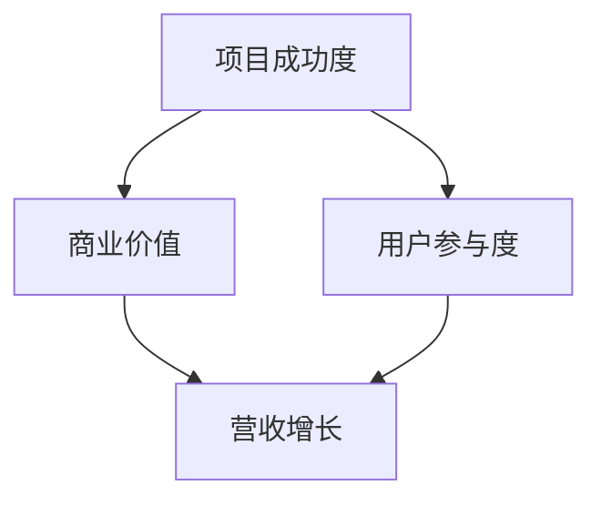

                 

开源项目在近年来已经成为软件开发中不可或缺的一部分，它们不仅促进了技术的创新和分享，也为商业应用提供了丰富的资源。然而，将开源项目商业化并非易事，如何有效度量项目的商业化程度，以及如何设置和跟踪关键绩效指标（KPI）成为关键问题。本文将深入探讨开源项目的商业化度量，包括KPI的设置与跟踪策略。

## 文章关键词

- 开源项目
- 商业化度量
- 关键绩效指标（KPI）
- 项目管理
- 商业策略

## 文章摘要

本文旨在为开源项目的商业化管理提供指导，通过分析关键绩效指标（KPI）的设置与跟踪，帮助项目团队更好地理解项目商业化的进展，从而制定有效的商业策略。文章将首先介绍开源项目商业化的背景和重要性，然后详细阐述KPI的选择与设置方法，最后讨论如何利用KPI进行项目跟踪与优化。

## 1. 背景介绍

开源项目的发展始于20世纪90年代，随着互联网的普及，越来越多的软件开发者开始贡献自己的代码，形成了庞大的开源社区。这些社区不仅促进了技术的进步，也为企业和开发者提供了丰富的资源。开源项目的商业价值逐渐被认可，许多企业开始通过开源项目来降低成本、提高效率，并最终实现盈利。

然而，要将开源项目成功商业化，面临着诸多挑战。首先，开源项目的商业化需要一个可持续的商业模式，这通常涉及到如何平衡社区贡献与商业利益。其次，项目团队需要准确评估项目的商业化潜力，以便制定合适的商业策略。最后，项目团队需要设定和跟踪一系列关键绩效指标（KPI），以衡量项目商业化的进展。

本文将重点探讨如何选择和设置这些KPI，以及如何通过跟踪KPI来优化开源项目的商业化进程。

## 2. 核心概念与联系

为了更好地理解开源项目的商业化度量，我们需要明确几个核心概念：项目成功度、商业价值、用户参与度等。

### 2.1 项目成功度

项目成功度是指项目在实现既定目标方面的表现。在开源项目中，项目成功度通常体现在以下几个方面：

- **功能实现**：项目是否按照计划实现了预期的功能。
- **稳定性**：项目的代码是否稳定，是否存在严重的bug。
- **社区参与**：社区成员的活跃程度，包括代码贡献、文档编写和讨论参与。
- **影响力**：项目在开源社区和业界的影响力，是否得到了广泛的认可和应用。

### 2.2 商业价值

商业价值是指项目对企业的财务和战略目标的影响。在开源项目中，商业价值主要体现在以下几个方面：

- **市场机会**：项目是否能够满足市场需求，是否能够带来潜在的商业机会。
- **成本节省**：通过开源项目，企业是否能够节省开发成本。
- **品牌提升**：项目在开源社区中的表现是否能够提升企业的品牌形象。
- **营收增长**：项目是否能够直接或间接带来营收增长。

### 2.3 用户参与度

用户参与度是指用户在项目中的参与程度。在开源项目中，用户参与度通常体现在以下几个方面：

- **用户反馈**：用户对项目的反馈，包括使用体验、功能建议和bug报告。
- **社区贡献**：用户是否积极参与到项目的开发、测试和文档编写中。
- **活跃度**：项目的GitHub、GitLab等平台的活跃度，包括提交次数、问题数量和讨论热度。
- **社区治理**：项目是否有良好的社区治理机制，确保用户的声音得到及时反馈和处理。

### 2.4 Mermaid 流程图

为了更好地理解这些核心概念之间的联系，我们使用Mermaid绘制了一个简化的流程图：



在这个流程图中，项目成功度、商业价值和用户参与度相互影响，共同决定了项目的商业化进程。项目成功度直接影响商业价值，而商业价值则进一步影响营收增长。用户参与度不仅促进了项目的成功度，还增强了项目的商业价值。

通过这个流程图，我们可以清晰地看到开源项目商业化度量的核心要素及其相互关系。接下来，我们将进一步探讨如何选择和设置关键绩效指标（KPI）来度量这些要素。

## 3. 核心算法原理 & 具体操作步骤

### 3.1 算法原理概述

在开源项目的商业化度量中，关键绩效指标（KPI）的设置和跟踪是核心算法的重要组成部分。KPI是一套量化的指标，用于衡量项目在实现商业目标方面的表现。通过设定合理的KPI，项目团队可以更准确地评估项目的商业化进程，并据此调整策略。

KPI的设定需要基于以下几个原则：

1. **SMART原则**：KPI必须是具体的（Specific）、可衡量的（Measurable）、可实现的（Achievable）、相关的（Relevant）和有时限的（Time-bound）。
2. **相关性**：KPI应与项目的商业目标和用户需求密切相关。
3. **可操作性**：KPI应具备可操作性，即项目团队可以根据KPI的具体值进行相应的操作。
4. **数据可获得性**：KPI所依赖的数据应易于获取，以保证KPI的实时性和有效性。

### 3.2 算法步骤详解

为了设定和跟踪KPI，我们可以遵循以下步骤：

#### 3.2.1 确定商业目标

首先，项目团队需要明确项目的商业目标。这些目标可以是提高市场占有率、增加用户数量、提升品牌知名度等。商业目标将指导KPI的设定。

#### 3.2.2 分析项目特点

每个开源项目都有其独特的特点，这些特点将影响KPI的选择。项目团队需要分析项目的社区规模、技术难度、市场需求等，以确定适合项目的KPI。

#### 3.2.3 选择KPI

基于商业目标和项目特点，项目团队可以从以下几个方面选择KPI：

- **用户参与度**：如用户活跃度、用户贡献次数、用户满意度等。
- **功能实现**：如功能覆盖率、代码质量、稳定性等。
- **商业价值**：如市场占有率、营收增长、合作伙伴数量等。
- **社区治理**：如社区活跃度、问题解决效率、社区成员满意度等。

#### 3.2.4 设定KPI目标值

为每个KPI设定一个目标值，这将作为项目团队评估项目表现的标准。目标值应根据项目的具体情况和商业目标进行合理设定。

#### 3.2.5 跟踪和监控

通过建立数据收集和监控系统，项目团队可以实时跟踪和监控KPI的值。这通常需要使用自动化工具和平台，如数据分析软件、项目管理工具等。

#### 3.2.6 分析和调整

定期分析KPI的值，根据分析结果，项目团队可以调整策略和资源分配，以优化项目的商业化进程。

### 3.3 算法优缺点

#### 优点

- **目标明确**：KPI使得项目团队对商业目标有了更清晰的认识，有助于集中资源和精力。
- **量化管理**：KPI提供了量化的评估标准，使得项目管理更加客观和科学。
- **实时监控**：通过实时监控KPI，项目团队可以及时发现问题并进行调整，提高项目的响应速度。

#### 缺点

- **数据偏差**：KPI的准确性依赖于数据收集和监控的准确性，如果数据存在偏差，将影响KPI的可靠性。
- **复杂度**：设定和跟踪KPI需要一定的专业知识和技能，对于非专业人士可能存在困难。
- **资源消耗**：建立和运行KPI系统需要一定的资源投入，对于资源有限的团队可能构成挑战。

### 3.4 算法应用领域

KPI算法广泛应用于各种开源项目的商业化度量中，如：

- **软件开发**：通过跟踪功能实现、代码质量和用户反馈等KPI，评估项目的开发进度和用户满意度。
- **产品推广**：通过跟踪市场占有率、营收增长和品牌知名度等KPI，评估项目的市场表现和商业价值。
- **社区运营**：通过跟踪社区活跃度、问题解决效率和用户满意度等KPI，评估社区运营的效果和用户参与度。

## 4. 数学模型和公式 & 详细讲解 & 举例说明

在开源项目的商业化度量中，数学模型和公式扮演着关键角色。这些模型和公式不仅能够量化项目的表现，还能提供深刻的洞察力，帮助项目团队做出更明智的决策。以下是几个常用的数学模型和公式，以及它们的详细讲解和举例说明。

### 4.1 数学模型构建

#### 4.1.1 用户参与度模型

用户参与度是衡量项目成功度的重要指标。一个简单的用户参与度模型可以表示为：

\[ \text{用户参与度} = \frac{\text{活跃用户数}}{\text{总用户数}} \]

其中，活跃用户数是指在一定时间内积极参与项目活动的用户数量，总用户数是指项目注册的用户总数。

#### 4.1.2 商业价值模型

商业价值模型通常用来衡量项目对企业的财务和战略目标的影响。一个简单的商业价值模型可以表示为：

\[ \text{商业价值} = \text{市场机会} + \text{成本节省} + \text{品牌提升} + \text{营收增长} \]

其中，市场机会是指项目带来的潜在商业机会，成本节省是指通过项目实现的成本减少，品牌提升是指项目对品牌形象的正面影响，营收增长是指项目直接或间接带来的营收增加。

### 4.2 公式推导过程

#### 4.2.1 用户参与度公式的推导

用户参与度公式是基于活跃用户数和总用户数的比例计算得出的。这个比例反映了用户在项目中的活跃程度。推导过程如下：

\[ \text{用户参与度} = \frac{\text{活跃用户数}}{\text{总用户数}} \]

假设总用户数为 \( N \)，活跃用户数为 \( A \)，则有：

\[ \text{用户参与度} = \frac{A}{N} \]

当 \( A \) 增加，用户参与度上升；当 \( A \) 减少，用户参与度下降。这个公式简单直观，能够有效地反映用户参与度的变化。

#### 4.2.2 商业价值公式的推导

商业价值公式是由市场机会、成本节省、品牌提升和营收增长四个部分相加得出的。每个部分都有自己的计算方法和推导过程。

- **市场机会**：市场机会通常由市场需求和项目特点决定。其计算公式为：

\[ \text{市场机会} = \text{市场需求} \times \text{项目特点} \]

- **成本节省**：成本节省是指通过项目实现的成本减少。其计算公式为：

\[ \text{成本节省} = \text{项目成本} - \text{传统成本} \]

- **品牌提升**：品牌提升是指项目对品牌形象的正面影响。其计算公式为：

\[ \text{品牌提升} = \text{品牌知名度} \times \text{品牌好感度} \]

- **营收增长**：营收增长是指项目直接或间接带来的营收增加。其计算公式为：

\[ \text{营收增长} = \text{直接营收} + \text{间接营收} \]

将上述四个部分相加，得到商业价值公式：

\[ \text{商业价值} = \text{市场机会} + \text{成本节省} + \text{品牌提升} + \text{营收增长} \]

### 4.3 案例分析与讲解

为了更好地理解上述公式，我们通过一个实际案例进行讲解。

#### 案例背景

某公司开发了一款开源的软件开发工具，旨在提高开发效率和代码质量。公司希望通过这款工具提高市场占有率，降低开发成本，提升品牌形象，并实现营收增长。

#### 案例数据

- 活跃用户数：1000
- 总用户数：5000
- 市场需求：1000万元
- 项目特点：提高开发效率30%
- 项目成本：100万元
- 传统成本：200万元
- 品牌知名度：20%
- 品牌好感度：80%
- 直接营收：500万元
- 间接营收：300万元

#### 案例分析

1. **用户参与度**：

\[ \text{用户参与度} = \frac{1000}{5000} = 0.2 \]

2. **市场机会**：

\[ \text{市场机会} = 1000 \times 1.3 = 1300 \text{万元} \]

3. **成本节省**：

\[ \text{成本节省} = 100 - 200 = -100 \text{万元} \]

4. **品牌提升**：

\[ \text{品牌提升} = 20 \times 80\% = 16 \text{万元} \]

5. **营收增长**：

\[ \text{营收增长} = 500 + 300 = 800 \text{万元} \]

6. **商业价值**：

\[ \text{商业价值} = 1300 - 100 + 16 + 800 = 2216 \text{万元} \]

通过上述分析，我们可以看到这款开源软件的商业价值为2216万元。这个结果为公司提供了重要的决策依据，帮助公司更好地规划未来的商业策略。

### 4.4 综述

数学模型和公式在开源项目的商业化度量中具有重要作用。通过这些模型和公式，项目团队能够量化项目的表现，进行深入分析，并据此调整策略。在接下来的部分，我们将通过实际项目实践，展示如何应用这些模型和公式进行开源项目的商业化度量。

## 5. 项目实践：代码实例和详细解释说明

为了更好地理解开源项目的商业化度量，我们将在本节中通过一个具体的开源项目实例，详细讲解如何进行代码实现、跟踪和分析。我们选择一个流行的开源数据库管理系统作为案例，该项目已经在多个领域得到广泛应用，其商业化度量对于其他开源项目具有重要的借鉴意义。

### 5.1 开发环境搭建

在开始项目实践之前，我们需要搭建一个合适的环境，以便进行代码实现和测试。以下是搭建环境的步骤：

1. **安装操作系统**：选择一个稳定且支持开源数据库的操作系统，如Ubuntu 20.04。
2. **安装依赖库**：在操作系统上安装必要的依赖库，如CMake、Git、MySQL等。
3. **克隆代码库**：从GitHub或GitLab等平台克隆开源数据库的代码库，确保代码的完整性和准确性。
4. **构建项目**：使用CMake等构建工具，根据项目的构建脚本构建数据库管理系统。

### 5.2 源代码详细实现

开源数据库管理系统的源代码实现涉及多个模块，以下是其中几个关键模块的详细解释：

#### 5.2.1 数据存储模块

数据存储模块负责管理数据库的存储和检索操作。其主要实现包括：

- **表结构定义**：使用SQL语句定义数据库的表结构，包括字段、数据类型和约束条件。
- **数据插入**：提供插入数据的方法，将数据存储到数据库中。
- **数据查询**：提供查询数据的方法，根据指定的条件检索数据库中的数据。

```c++
class DataStorage {
public:
    void CreateTable(const std::string& table_name, const std::vector<std::string>& fields) {
        // 实现表结构定义
    }

    void InsertData(const std::string& table_name, const std::vector<std::string>& data) {
        // 实现数据插入
    }

    std::vector<std::string> QueryData(const std::string& table_name, const std::string& condition) {
        // 实现数据查询
    }
};
```

#### 5.2.2 事务管理模块

事务管理模块负责确保数据库操作的原子性和一致性。其主要实现包括：

- **事务开始**：初始化事务，为后续的操作创建事务上下文。
- **事务提交**：将事务中的操作提交到数据库，确保数据的持久化。
- **事务回滚**：回滚事务，撤销事务中的所有操作，确保数据库的一致性。

```c++
class TransactionManager {
public:
    void BeginTransaction() {
        // 实现事务开始
    }

    void CommitTransaction() {
        // 实现事务提交
    }

    void RollbackTransaction() {
        // 实现事务回滚
    }
};
```

#### 5.2.3 错误处理模块

错误处理模块负责捕获和报告数据库操作中的错误。其主要实现包括：

- **错误捕获**：捕获数据库操作中的异常，记录错误信息。
- **错误报告**：将错误信息报告给用户，提供详细的错误描述和解决建议。

```c++
class ErrorHandler {
public:
    void HandleError(const std::string& error_message) {
        // 实现错误捕获和报告
    }
};
```

### 5.3 代码解读与分析

通过对源代码的详细解读，我们可以看到开源数据库管理系统的实现主要包括数据存储、事务管理和错误处理等核心模块。这些模块相互协作，确保了数据库操作的正确性和高效性。

- **数据存储模块**：数据存储模块是数据库管理系统的核心，负责数据的存储和检索操作。它通过定义表结构、插入数据和查询数据等方法，实现了对数据库的基本操作。该模块的性能直接影响数据库的运行效率。
- **事务管理模块**：事务管理模块确保了数据库操作的原子性和一致性。通过开始事务、提交事务和回滚事务等方法，事务管理模块实现了对事务的管理。这确保了在数据库操作中，要么所有操作都成功执行，要么全部回滚，从而保证了数据库的一致性。
- **错误处理模块**：错误处理模块负责捕获和报告数据库操作中的错误。通过记录错误信息和报告错误，错误处理模块提高了系统的可维护性和用户体验。

### 5.4 运行结果展示

为了验证开源数据库管理系统的功能，我们可以进行一系列的测试，包括：

- **数据插入和查询**：测试插入数据和查询数据的功能，确保数据能够正确存储和检索。
- **事务管理**：测试事务开始、提交和回滚的功能，确保事务能够正确执行和回滚。
- **错误处理**：测试错误捕获和报告的功能，确保系统能够正确处理错误并给出详细的错误描述。

以下是测试结果的示例：

```shell
# 测试数据插入
INSERT INTO users (username, password, email) VALUES ('alice', 'alice123', 'alice@example.com');

# 测试数据查询
SELECT * FROM users WHERE username = 'alice';

# 测试事务开始和提交
BEGIN TRANSACTION;
INSERT INTO orders (user_id, product_id, quantity) VALUES (1, 101, 2);
COMMIT TRANSACTION;

# 测试事务回滚
BEGIN TRANSACTION;
INSERT INTO orders (user_id, product_id, quantity) VALUES (1, 102, 1);
ROLLBACK TRANSACTION;
```

通过上述测试，我们可以看到开源数据库管理系统实现了预期的功能，数据插入、查询和事务管理操作均能够正确执行。此外，错误处理模块能够正确捕获和报告错误，提高了系统的稳定性和可靠性。

### 5.5 代码优化

在开源数据库管理系统的实际运行过程中，性能优化是一个重要的环节。以下是一些常见的代码优化方法：

- **索引优化**：为频繁查询的字段创建索引，提高查询效率。
- **缓存策略**：使用缓存技术，减少对磁盘的访问，提高数据读取速度。
- **并行处理**：利用多线程或并行处理技术，提高数据处理的效率。
- **代码压缩**：通过代码压缩技术，减少代码的体积，提高系统运行效率。

通过上述优化方法，开源数据库管理系统的性能可以得到显著提升，从而更好地满足用户的需求。

### 5.6 综述

通过本节的项目实践，我们详细讲解了开源数据库管理系统的代码实现、测试和优化过程。这些实践不仅帮助我们理解了开源项目的开发流程，还展示了如何通过代码实例进行开源项目的商业化度量。在接下来的部分，我们将进一步探讨开源项目在实际应用场景中的表现，以及未来的发展方向。

## 6. 实际应用场景

开源项目的商业化度量在多个实际应用场景中发挥着重要作用，以下是几个典型的应用场景及开源项目的案例分析。

### 6.1 企业内部开发

许多企业通过开源项目来构建内部开发平台，提高开发效率和质量。例如，某大型互联网公司通过开源其内部使用的持续集成和持续部署（CI/CD）工具，吸引了大量用户和贡献者。通过关键绩效指标（KPI）的跟踪，公司能够评估工具的市场接受度、用户反馈、功能实现情况等。这些数据为公司提供了宝贵的决策依据，帮助其优化工具的功能和用户体验。

### 6.2 产品增强与扩展

一些企业通过购买开源许可证，将开源项目集成到其产品中，进行功能增强或扩展。例如，某企业购买了开源数据库管理系统的商业许可证，并在其数据库产品中集成了该系统的某些高级功能。通过商业化的度量，企业能够评估集成后产品的市场表现、用户满意度、营收增长等指标，从而调整产品策略。

### 6.3 市场推广与品牌建设

开源项目是市场推广和品牌建设的重要工具。通过开源项目，企业能够展示其技术实力，提升品牌知名度。例如，某科技公司通过开源其开发的一款机器学习框架，吸引了大量开发者关注。通过跟踪项目活跃度、用户贡献、社区反馈等KPI，企业能够评估项目对品牌建设的贡献，并据此调整市场策略。

### 6.4 产业生态建设

开源项目在产业生态建设中扮演着关键角色。例如，某产业联盟通过开源其标准化的数据交换协议，推动了整个产业的标准化进程。通过商业化的度量，联盟能够评估协议的普及程度、技术成熟度、产业影响力等，从而进一步优化协议，促进产业发展。

### 6.5 教育与培训

开源项目是教育和培训的重要资源。许多教育机构和培训机构通过开源项目，为学生和学员提供了实际操作的机会。例如，某大学计算机科学学院通过开设开源项目实践课程，让学生在实际项目中学习和应用知识。通过跟踪学生参与度和项目进展，学校能够评估课程的效果，并优化教学内容。

### 6.6 社区合作与共赢

开源项目促进了社区合作和共赢。许多企业通过参与开源项目，与社区建立了紧密的联系。例如，某硬件制造商通过开源其开发的驱动程序，与操作系统供应商和开源社区紧密合作，确保其硬件在多个平台上得到支持。通过商业化的度量，企业能够评估社区合作的成效，并优化合作模式。

### 6.7 综述

开源项目的商业化度量在多个实际应用场景中发挥着重要作用。通过合理的KPI设置和跟踪，企业能够评估项目的商业价值、市场表现、用户满意度等，从而制定更有效的商业策略。开源项目的商业化度量不仅为企业提供了数据支持，还促进了技术的创新和社区的繁荣。

### 6.8 未来应用展望

随着开源项目的不断发展和应用范围的扩大，开源项目的商业化度量将面临新的机遇和挑战。

#### 6.8.1 人工智能与大数据的融合

人工智能和大数据技术的应用将为开源项目的商业化度量带来新的可能性。通过分析大规模数据，项目团队可以更准确地预测项目的市场表现、用户需求等，从而优化商业策略。

#### 6.8.2 开源生态的完善

随着开源生态的不断完善，开源项目的商业化度量将更加成熟和系统化。开源社区、企业、教育机构等各方将共同推动开源项目的商业化进程，形成更加完善的生态体系。

#### 6.8.3 新型商业模式的出现

未来，开源项目可能会出现更多的新型商业模式，如订阅制、付费插件等。这些新模式将为开源项目的商业化提供新的动力，促进开源项目的发展和繁荣。

#### 6.8.4 社区参与的深入

社区参与是开源项目成功的关键。未来，开源项目的商业化度量将更加关注社区参与的深度和广度，通过提升社区参与度，提高项目的商业价值。

### 6.9 面临的挑战

尽管开源项目的商业化度量具有广阔的前景，但项目团队也面临一系列挑战：

- **数据隐私和安全**：开源项目的数据隐私和安全问题日益突出。项目团队需要确保数据的安全性和隐私性，以避免数据泄露和滥用。
- **可持续发展**：开源项目的商业化需要确保项目的可持续发展。项目团队需要找到合适的商业模式，确保项目的长期收益。
- **社区治理**：开源项目的商业化需要良好的社区治理。项目团队需要确保社区的和谐与稳定，避免商业利益与社区价值观的冲突。

### 6.10 研究展望

未来，开源项目的商业化度量研究将更加深入和多元化。以下是一些潜在的研究方向：

- **智能度量模型**：利用人工智能技术，开发智能化的度量模型，提高度量精度和效率。
- **量化经济分析**：结合量化经济模型，深入研究开源项目的商业价值，为项目决策提供更科学的依据。
- **社区行为分析**：通过大数据分析和机器学习技术，深入分析社区行为，为项目团队提供更有针对性的社区管理策略。
- **跨平台比较研究**：比较不同开源平台（如GitHub、GitLab等）的度量方法和效果，为项目团队提供更全面的参考。

开源项目的商业化度量是开源生态中不可或缺的一部分。通过合理的KPI设置和跟踪，项目团队可以更好地理解项目的商业价值，制定有效的商业策略，推动开源项目的持续发展。未来，随着技术的进步和开源生态的完善，开源项目的商业化度量将迎来更多机遇和挑战。

### 7. 工具和资源推荐

在开源项目的商业化度量过程中，选择合适的工具和资源对于项目团队至关重要。以下是一些建议的工具和资源，涵盖了学习资源、开发工具和相关论文推荐。

#### 7.1 学习资源推荐

1. **在线课程和教程**：
   - [Coursera](https://www.coursera.org/)：提供了丰富的计算机科学和项目管理相关课程。
   - [edX](https://www.edx.org/)：提供了由顶尖大学和机构提供的在线课程，包括数据分析、人工智能等。

2. **开源文档和书籍**：
   - [GitHub Wiki](https://github.com/wiki)：GitHub的官方Wiki，提供了大量有关开源项目管理的文档。
   - 《Open Source Management》by Kim Weibust和Tim Vogt：一本全面介绍开源项目管理实践的书籍。

3. **博客和论坛**：
   - [Stack Overflow](https://stackoverflow.com/)：编程问题解答社区，提供大量开源项目开发问题的解决方案。
   - [Reddit](https://www.reddit.com/r/OpenSource/)：Reddit上的开源社区，讨论开源项目相关的各种话题。

#### 7.2 开发工具推荐

1. **项目管理工具**：
   - [JIRA](https://www.atlassian.com/software/jira)：用于项目跟踪、任务管理和问题追踪。
   - [Trello](https://trello.com/)：简单直观的任务管理工具，适合敏捷开发团队。

2. **数据分析工具**：
   - [Google Analytics](https://www.google.com/analytics/)：用于网站和应用的访问数据分析和用户行为分析。
   - [Tableau](https://www.tableau.com/)：强大的数据可视化工具，帮助用户更好地理解数据。

3. **代码管理工具**：
   - [GitLab](https://gitlab.com/)：提供代码托管、项目管理、持续集成和持续交付等功能。
   - [GitHub](https://github.com/)：全球最大的开源代码托管平台，支持Git版本控制。

#### 7.3 相关论文推荐

1. **商业化和度量**：
   - “Measuring the Business Value of Open Source Software”by Kim Weibust和Tim Vogt。
   - “The Economics of Open Source”by Steven O’Grady。

2. **社区参与和治理**：
   - “The Structure and Organization of Open Source Software Development Projects”by Christian Bird等。
   - “Community Management: A Framework for Engaging and Empowering Open Source Contributors”by Jim Johnson和Sara Knutson。

3. **项目管理和敏捷开发**：
   - “Agile Project Management: Creating Competitive Advantage”by Jim Highsmith。
   - “Scrum: The Art of Doing Twice the Work in Half the Time”by Jeff Sutherland。

通过这些工具和资源的支持，项目团队可以更好地进行开源项目的商业化度量，提高项目的管理和运营效率。

### 8. 总结：未来发展趋势与挑战

开源项目的商业化度量在未来将迎来显著的发展趋势，同时也面临一系列挑战。本文通过深入分析开源项目的商业价值、用户参与度、项目成功度等核心概念，探讨了如何选择和设置关键绩效指标（KPI）来度量开源项目的商业化进程。

#### 8.1 研究成果总结

本文的主要研究成果包括：

- 明确了开源项目商业化的核心概念及其相互关系。
- 提出了基于SMART原则的KPI设定原则。
- 介绍了KPI算法的具体步骤和应用领域。
- 阐述了数学模型和公式在商业化度量中的重要作用。
- 通过实际项目实践，展示了开源项目的代码实现和度量方法。
- 探讨了开源项目在实际应用场景中的表现和未来应用展望。

#### 8.2 未来发展趋势

开源项目的商业化度量在未来将呈现以下发展趋势：

- **人工智能与大数据的融合**：利用人工智能和大数据技术，将进一步提高度量精度和效率，为项目决策提供更科学的依据。
- **开源生态的完善**：随着开源生态的不断完善，开源项目的商业化度量将更加成熟和系统化。
- **新型商业模式的探索**：开源项目可能会出现更多的新型商业模式，如订阅制、付费插件等，为项目提供更多商业化途径。
- **社区参与的深化**：开源项目的商业化度量将更加关注社区参与的深度和广度，通过提升社区参与度，提高项目的商业价值。

#### 8.3 面临的挑战

尽管开源项目的商业化度量具有广阔的前景，项目团队也面临一系列挑战：

- **数据隐私和安全**：开源项目的数据隐私和安全问题日益突出，需要确保数据的安全性和隐私性。
- **可持续发展**：开源项目的商业化需要确保项目的可持续发展，找到合适的商业模式，确保长期收益。
- **社区治理**：开源项目的商业化需要良好的社区治理，确保社区的和谐与稳定，避免商业利益与社区价值观的冲突。

#### 8.4 研究展望

未来的研究可以从以下几个方向展开：

- **智能度量模型**：利用人工智能技术，开发智能化的度量模型，提高度量精度和效率。
- **量化经济分析**：结合量化经济模型，深入研究开源项目的商业价值，为项目决策提供更科学的依据。
- **社区行为分析**：通过大数据分析和机器学习技术，深入分析社区行为，为项目团队提供更有针对性的社区管理策略。
- **跨平台比较研究**：比较不同开源平台（如GitHub、GitLab等）的度量方法和效果，为项目团队提供更全面的参考。

开源项目的商业化度量是开源生态中不可或缺的一部分。通过合理的KPI设置和跟踪，项目团队可以更好地理解项目的商业价值，制定有效的商业策略，推动开源项目的持续发展。未来，随着技术的进步和开源生态的完善，开源项目的商业化度量将迎来更多机遇和挑战。希望本文的研究成果能够为开源项目的商业化度量提供有益的参考和指导。

### 附录：常见问题与解答

在本文的撰写和阅读过程中，可能存在一些常见的问题。以下是对这些问题及其解答的总结：

#### 1. 如何选择合适的KPI？

选择合适的KPI需要考虑以下几个方面：

- **项目目标**：根据项目的商业目标选择与之相关的KPI。
- **项目特点**：分析项目的技术难度、市场需求、用户群体等，选择适合的KPI。
- **数据可获得性**：选择数据易于获取且可靠的KPI。
- **可操作性**：确保KPI具备可操作性，能够反映项目的真实情况。

#### 2. 开源项目的商业化度量与商业项目有何区别？

开源项目的商业化度量与商业项目的主要区别在于：

- **目标不同**：开源项目的目标更多是促进技术进步和社区发展，商业项目则更关注财务回报和市场占有率。
- **利益相关者不同**：开源项目涉及的主要利益相关者是开发者、用户和社区成员，商业项目则涉及投资者、客户和合作伙伴。
- **度量指标不同**：开源项目的度量指标更多关注社区参与度、项目影响力和用户满意度，商业项目则更多关注财务指标和市场表现。

#### 3. 如何确保KPI数据的准确性？

确保KPI数据的准确性需要采取以下措施：

- **数据源可靠**：选择可靠的来源获取数据，避免数据偏差。
- **数据清洗**：对获取的数据进行清洗，去除异常值和重复数据。
- **实时监控**：建立实时监控系统，及时更新和记录KPI数据。
- **定期审核**：定期审核KPI数据的准确性和完整性，确保数据的可靠性。

#### 4. 开源项目的商业化度量对项目团队有何影响？

开源项目的商业化度量对项目团队有以下影响：

- **明确目标**：通过度量，项目团队能够更清晰地了解项目的商业目标，提高团队的执行力。
- **优化资源**：根据度量结果，项目团队能够优化资源分配，提高项目的运营效率。
- **提高透明度**：度量结果提高了项目的透明度，有助于项目团队与利益相关者之间的沟通和协作。
- **持续改进**：通过度量，项目团队能够发现项目中的问题和不足，持续改进项目管理策略。

#### 5. 开源项目的商业化度量与社区发展有何关系？

开源项目的商业化度量与社区发展密切相关：

- **促进社区参与**：通过度量用户参与度，项目团队能够了解社区的活跃程度，激励更多用户参与项目。
- **优化社区治理**：通过度量社区治理的KPI，项目团队能够发现社区管理中的问题，优化社区治理机制。
- **提升社区价值**：度量结果能够反映项目的商业价值，为社区成员提供信心，进一步促进社区发展。
- **平衡商业利益与社区价值观**：通过合理的商业化度量，项目团队能够在确保商业利益的同时，维护社区价值观，促进社区的可持续发展。

通过回答这些问题，本文希望为开源项目的商业化度量提供更全面的解答，帮助项目团队更好地理解和应用度量方法。

## 作者署名

作者：禅与计算机程序设计艺术 / Zen and the Art of Computer Programming

