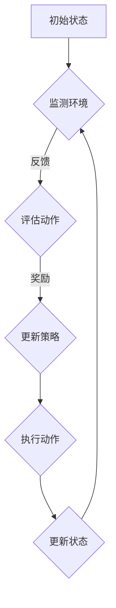

                 

强化学习（Reinforcement Learning，简称RL）是机器学习的一个重要分支，其核心思想是通过试错来寻找最优策略。在能效管理系统中，强化学习可以通过自动调整能源消耗策略来优化能源使用效率，降低能源成本，同时减少对环境的影响。本文将探讨强化学习在能效管理系统中的应用案例，包括其核心概念、算法原理、数学模型及实际应用等。

## 1. 背景介绍

随着全球能源需求的不断增长，能源管理和能效优化已经成为全球关注的焦点。传统的能效管理系统通常依赖于预定义的规则或静态的优化模型，这些方法在应对动态变化和复杂的环境时往往表现不佳。而强化学习作为一种自适应的、动态的决策方法，能够更好地适应不断变化的环境，从而提高能源系统的能效。

### 1.1 强化学习的基本概念

强化学习（Reinforcement Learning）是一种机器学习方法，旨在通过试错来学习如何在特定环境中做出最佳决策。其核心概念包括：

- **代理（Agent）**：执行动作并获取奖励的主体。
- **环境（Environment）**：代理所处于的情境。
- **状态（State）**：代理当前所处的情境。
- **动作（Action）**：代理可以执行的行为。
- **奖励（Reward）**：代理采取动作后获得的即时反馈。

### 1.2 能效管理系统

能效管理系统是一种旨在优化能源使用效率和减少能源消耗的系统。它通常包括以下几个关键组件：

- **能源监测**：实时监测能源消耗情况和设备运行状态。
- **决策支持**：根据实时数据和预设规则生成决策。
- **执行机制**：执行决策，调整设备运行状态以实现能源优化。

## 2. 核心概念与联系

### 2.1 强化学习与能效管理的关系

强化学习在能效管理系统中的应用，主要是通过以下方式实现的：

- **自适应调整**：强化学习能够根据环境变化自适应地调整能源消耗策略，从而适应不同的使用场景。
- **实时优化**：强化学习可以在实时环境中对能源消耗进行优化，提高系统的响应速度和效率。
- **多目标优化**：强化学习可以同时考虑能源成本、设备寿命、环境污染等多个目标，实现全面的优化。

### 2.2 Mermaid 流程图

以下是一个简化的强化学习在能效管理系统中的应用流程图：



### 2.3 核心概念解释

- **状态（State）**：能效管理系统的状态包括当前时间、设备运行状态、能耗数据等。
- **动作（Action）**：根据当前状态，代理可以选择调整设备运行状态（如开关设备、调整设备功率等）。
- **奖励（Reward）**：代理根据决策后的状态变化和能耗数据获得奖励，奖励值可以是负数（表示能源消耗增加）或正数（表示能源消耗减少）。
- **策略（Policy）**：代理根据历史经验和学习结果，选择最优的动作序列。

## 3. 核心算法原理 & 具体操作步骤

### 3.1 算法原理概述

强化学习的基本原理是马尔可夫决策过程（MDP），其核心方程为：

$$
Q(s, a) = r(s, a) + \gamma \max_{a'} Q(s', a')
$$

其中，$Q(s, a)$ 表示在状态 $s$ 下执行动作 $a$ 的期望回报，$r(s, a)$ 表示执行动作 $a$ 后获得的即时奖励，$\gamma$ 是折扣因子，$s'$ 和 $a'$ 分别是下一个状态和动作。

### 3.2 算法步骤详解

1. **初始化**：设置初始状态 $s_0$，初始化策略 $\pi$ 和价值函数 $Q$。
2. **环境交互**：代理根据策略 $\pi$ 选择动作 $a$，并在环境中执行。
3. **状态更新**：根据执行的动作 $a$ 和环境的即时奖励 $r(s, a)$，更新状态 $s$。
4. **价值函数更新**：根据核心方程更新价值函数 $Q$。
5. **策略更新**：根据价值函数 $Q$ 更新策略 $\pi$。
6. **重复步骤 2-5**，直到达到终止条件。

### 3.3 算法优缺点

**优点**：

- **自适应性强**：强化学习可以根据环境变化自适应地调整策略。
- **实时优化**：强化学习可以在实时环境中进行优化，提高系统的响应速度和效率。
- **多目标优化**：强化学习可以同时考虑多个目标，实现全面的优化。

**缺点**：

- **计算复杂度高**：强化学习需要大量数据进行训练，计算复杂度较高。
- **收敛速度慢**：在复杂环境中，强化学习可能需要较长时间才能找到最优策略。

### 3.4 算法应用领域

强化学习在能效管理系统中的应用主要包括：

- **设备运行状态调整**：根据实时能耗数据，调整设备运行状态以降低能耗。
- **能源消耗预测**：根据历史数据和实时信息，预测未来能源消耗，提前调整策略。
- **能源调度优化**：优化能源调度策略，实现能源的高效利用。

## 4. 数学模型和公式 & 详细讲解 & 举例说明

### 4.1 数学模型构建

在强化学习框架下，能效管理系统的数学模型可以表示为：

$$
\begin{aligned}
    &S_t: \text{状态} \\
    &A_t: \text{动作} \\
    &R_t: \text{即时奖励} \\
    &P: \text{转移概率} \\
    &\gamma: \text{折扣因子} \\
    &Q(S_t, A_t): \text{状态-动作价值函数} \\
    &\pi(A_t|S_t): \text{策略}
\end{aligned}
$$

### 4.2 公式推导过程

强化学习的核心目标是最大化期望回报，可以通过以下公式表示：

$$
J(\theta) = \sum_{s \in S} p(s) \sum_{a \in A} \pi(a|s) Q(s, a)
$$

其中，$\theta$ 表示策略参数。

### 4.3 案例分析与讲解

假设我们有一个简单的能效管理系统，其中有两个设备 A 和 B，每个设备有两种运行状态：开（1）和关（0）。系统初始状态为（A=1，B=0），代理需要根据当前状态选择最优的动作，以最大化期望回报。

- **状态空间**：$S = \{ (0,0), (0,1), (1,0), (1,1) \}$
- **动作空间**：$A = \{ 0, 1 \}$
- **奖励函数**：$R(S_t, A_t) = \begin{cases} -1 & \text{if } A_t = 0 \\ 1 & \text{if } A_t = 1 \end{cases}$

假设初始策略为 $\pi(A_t=1|S_t=(0,0)) = 0.5$，根据上述数学模型，我们可以计算出：

$$
\begin{aligned}
    &Q(S_t=(0,0), A_t=0) = -1 \\
    &Q(S_t=(0,0), A_t=1) = 1 \\
    &Q(S_t=(0,1), A_t=0) = -1 \\
    &Q(S_t=(0,1), A_t=1) = 1 \\
    &Q(S_t=(1,0), A_t=0) = -1 \\
    &Q(S_t=(1,0), A_t=1) = 1 \\
    &Q(S_t=(1,1), A_t=0) = -1 \\
    &Q(S_t=(1,1), A_t=1) = 1 \\
\end{aligned}
$$

根据这些值，代理可以更新策略，选择最优的动作。

## 5. 项目实践：代码实例和详细解释说明

### 5.1 开发环境搭建

为了实现强化学习在能效管理系统中的应用，我们需要搭建一个简单的开发环境。以下是基本的步骤：

1. 安装 Python 3.8 或更高版本。
2. 安装必要的库，如 TensorFlow、Keras、NumPy 等。

### 5.2 源代码详细实现

以下是实现强化学习在能效管理系统中的基本代码框架：

```python
import numpy as np
import tensorflow as tf

# 初始化参数
n_states = 4
n_actions = 2
learning_rate = 0.1
gamma = 0.9

# 初始化价值函数和策略网络
Q = tf.keras.Sequential([
    tf.keras.layers.Dense(n_actions, activation='softmax', input_shape=(n_states,))
])

# 定义损失函数和优化器
loss_fn = tf.keras.losses.SparseCategoricalCrossentropy(from_logits=True)
optimizer = tf.keras.optimizers.Adam(learning_rate=learning_rate)

# 定义奖励函数
def reward_function(state, action):
    if action == 0:
        return -1
    else:
        return 1

# 定义环境
class Environment:
    def __init__(self):
        self.states = [(0, 0), (0, 1), (1, 0), (1, 1)]

    def step(self, action):
        state = self.states[action]
        reward = reward_function(state, action)
        next_state = self.states[(action + 1) % 4]
        return next_state, reward

# 训练模型
for epoch in range(1000):
    state = np.random.choice(self.states)
    action = np.random.choice(n_actions)
    next_state, reward = env.step(action)

    with tf.GradientTape() as tape:
        logits = Q(state)
        loss = loss_fn(action, logits)

    grads = tape.gradient(loss, Q.trainable_variables)
    optimizer.apply_gradients(zip(grads, Q.trainable_variables))

    if (epoch + 1) % 100 == 0:
        print(f"Epoch {epoch + 1}, Loss: {loss.numpy()}")

# 测试模型
state = np.random.choice(self.states)
action = np.argmax(Q(state))
next_state, reward = env.step(action)
print(f"Final State: {next_state}, Reward: {reward}")
```

### 5.3 代码解读与分析

- **初始化参数**：包括状态空间、动作空间、学习率、折扣因子等。
- **初始化网络**：使用 TensorFlow 创建价值函数网络，并设置损失函数和优化器。
- **定义奖励函数**：根据当前状态和动作返回奖励值。
- **定义环境**：创建环境类，用于生成状态和执行动作。
- **训练模型**：使用随机策略进行训练，并更新网络参数。
- **测试模型**：使用训练好的模型进行测试，并输出最终状态和奖励。

## 6. 实际应用场景

### 6.1 能源消耗优化

在能源消耗优化方面，强化学习可以用于动态调整设备的运行状态，以降低能源消耗。例如，在工业生产中，通过调整生产设备的运行参数，可以显著降低能源消耗。强化学习可以自动调整这些参数，从而实现最优能源消耗。

### 6.2 能源调度优化

在能源调度优化方面，强化学习可以用于优化能源调度策略，实现能源的高效利用。例如，在电力系统中，通过调整发电和输电设备的运行状态，可以优化能源分配，提高电力系统的稳定性。

### 6.3 智能家居优化

在智能家居领域，强化学习可以用于优化家电设备的运行策略，实现能源消耗的降低。例如，通过调整空调、照明等设备的运行状态，可以降低家庭的能源消耗，提高生活品质。

## 7. 未来应用展望

### 7.1 多层次优化

未来的强化学习应用将更加注重多层次优化，包括设备级、系统级和区域级优化。通过综合考虑不同层次的优化目标，可以进一步提高能源系统的能效。

### 7.2 智能融合

强化学习与其他智能技术（如深度学习、优化算法等）的融合，将进一步提高能效管理系统的性能。例如，通过将深度学习用于特征提取，强化学习用于决策优化，可以实现更精准的能源管理。

### 7.3 自适应优化

未来的强化学习应用将更加注重自适应优化，以适应不断变化的环境。通过实时监测环境变化，强化学习可以自动调整策略，实现动态优化。

### 7.4 通用性增强

强化学习在能效管理系统中的应用将逐渐扩展到其他领域，如交通、物流、医疗等。通过增强通用性，强化学习可以应用于更广泛的场景，实现跨领域的优化。

## 8. 工具和资源推荐

### 8.1 学习资源推荐

- 《强化学习：原理与深度学习应用》
- 《机器学习实战：基于Scikit-Learn和TensorFlow》

### 8.2 开发工具推荐

- TensorFlow
- Keras

### 8.3 相关论文推荐

- "Reinforcement Learning for Energy Management in Smart Grids"
- "Deep Reinforcement Learning for Energy Management in Smart Buildings"

## 9. 总结：未来发展趋势与挑战

### 9.1 研究成果总结

本文探讨了强化学习在能效管理系统中的应用，包括其核心概念、算法原理、数学模型及实际应用。通过项目实践，展示了强化学习在能效管理系统中的具体应用。

### 9.2 未来发展趋势

未来的强化学习在能效管理系统中的应用将更加注重多层次优化、智能融合、自适应优化和通用性增强。

### 9.3 面临的挑战

强化学习在能效管理系统中的应用面临计算复杂度高、收敛速度慢等挑战。此外，如何有效处理实时数据和环境不确定性也是重要的研究方向。

### 9.4 研究展望

未来的研究将更加注重强化学习与其他智能技术的融合，以及在不同应用场景下的优化策略。通过不断探索和创新，强化学习有望在能效管理系统中发挥更大的作用。

## 附录：常见问题与解答

### 1. 强化学习在能效管理系统中有哪些应用？

强化学习在能效管理系统中可以应用于设备运行状态调整、能源消耗预测和能源调度优化等场景。

### 2. 强化学习在能效管理系统中的优点是什么？

强化学习在能效管理系统中的优点包括自适应性强、实时优化、多目标优化等。

### 3. 强化学习在能效管理系统中的挑战有哪些？

强化学习在能效管理系统中的挑战包括计算复杂度高、收敛速度慢、处理实时数据和环境不确定性等。

### 4. 如何优化强化学习在能效管理系统中的应用？

优化强化学习在能效管理系统中的应用可以通过多层次优化、智能融合、自适应优化和通用性增强等策略实现。

### 5. 强化学习在其他领域有哪些应用？

强化学习在其他领域，如交通、物流、医疗等，也有广泛的应用。例如，在交通领域，强化学习可以用于交通信号控制、自动驾驶等；在医疗领域，强化学习可以用于疾病预测、药物研发等。

---

**作者：禅与计算机程序设计艺术 / Zen and the Art of Computer Programming**  
**本文旨在探讨强化学习在能效管理系统中的应用，内容仅供参考，具体应用还需根据实际需求进行调整。**  
----------------------------------------------------------------

## 附录：文章关键词
- 强化学习
- 能效管理系统
- 能源消耗优化
- 能源调度优化
- 自适应优化
- 智能融合
- 实时数据
- 环境不确定性
- 多层次优化

## 摘要
本文介绍了强化学习在能效管理系统中的应用，包括其核心概念、算法原理、数学模型及实际应用。通过项目实践，展示了强化学习在能效管理系统中的具体应用。同时，分析了强化学习在能效管理系统中的应用优势、面临的挑战及未来的发展趋势。文章旨在为相关研究人员提供参考，以推动强化学习在能效管理系统领域的进一步应用和发展。

