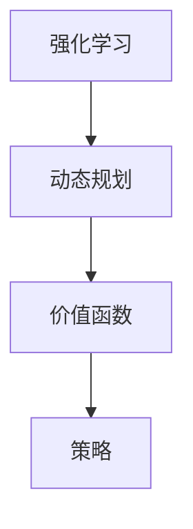

                 

关键词：强化学习、动态规划、RL算法、实践技巧、应用场景

> 摘要：本文将深入探讨强化学习（Reinforcement Learning，RL）中的动态规划（Dynamic Programming，DP）基础与实践技巧。通过详细的算法原理讲解、数学模型剖析以及实际项目实例，帮助读者全面掌握RL中的DP方法，提升在复杂环境下的决策能力。

## 1. 背景介绍

强化学习作为机器学习的一个重要分支，近年来在人工智能领域取得了显著进展。其核心思想是通过与环境的交互来学习最优策略，从而实现智能体的自主决策。然而，强化学习算法在处理复杂、高维环境时，往往面临计算效率低下、收敛速度缓慢等问题。动态规划（DP）作为一种有效的解决方法，为强化学习提供了坚实的理论基础和实践指导。

本文旨在系统地介绍强化学习中的动态规划基础，包括核心概念、算法原理、数学模型以及实践技巧。通过本文的学习，读者将能够：

- 理解强化学习和动态规划的基本概念。
- 掌握动态规划在强化学习中的应用场景。
- 掌握动态规划的数学模型和求解方法。
- 通过实际项目实例加深对动态规划的理解。

## 2. 核心概念与联系

### 2.1 强化学习（Reinforcement Learning）

强化学习是一种通过不断与环境互动来学习最优策略的机器学习方法。其核心概念包括：

- **智能体（Agent）**：执行动作并从环境中接收反馈的实体。
- **环境（Environment）**：智能体所处的情境，会根据智能体的动作给出反馈。
- **状态（State）**：智能体在某一时刻所处的情境描述。
- **动作（Action）**：智能体可以采取的动作集合。
- **奖励（Reward）**：环境对智能体动作的即时反馈，用来指导学习过程。

### 2.2 动态规划（Dynamic Programming）

动态规划是一种解决最优化问题的方法，其核心思想是将复杂问题分解为若干子问题，并通过子问题的最优解来构建原问题的最优解。动态规划在强化学习中的应用，主要是通过价值函数（Value Function）和策略（Policy）来表示和优化智能体的决策过程。

### 2.3 Mermaid 流程图



## 3. 核心算法原理 & 具体操作步骤

### 3.1 算法原理概述

动态规划在强化学习中的应用，主要涉及两个核心概念：价值函数（Value Function）和策略（Policy）。

- **价值函数**：用于评估智能体在某一状态下执行某一动作的长期收益。通常用 V(s) 表示智能体在状态 s 下的价值函数。
- **策略**：用于指导智能体的动作选择。一个策略 π(s) 表示在状态 s 下智能体采取动作 a 的概率。

动态规划的目标是求解最优策略，使得智能体能够从初始状态 s0 出发，通过执行最优动作序列，获得最大累积奖励。

### 3.2 算法步骤详解

动态规划的基本步骤如下：

1. **定义状态空间和动作空间**：根据实际问题，定义智能体的状态空间 S 和动作空间 A。
2. **初始化价值函数**：通常初始化所有状态的价值函数为 0 或 1。
3. **递归关系**：根据动态规划的原理，构建递归关系来求解价值函数。具体地，有：
   $$ V^{t+1}(s) = \sum_{a \in A} \pi^{t}(s, a) \cdot [R(s, a) + \gamma V^{t}(s')] $$
   其中，R(s, a) 是状态 s 下执行动作 a 的即时奖励，γ 是折扣因子，π^t 是时间步 t 的策略。
4. **迭代优化**：根据递归关系，不断迭代优化价值函数，直到收敛。

### 3.3 算法优缺点

动态规划在强化学习中的应用具有以下优缺点：

- **优点**：
  - 理论上可以求解最优策略。
  - 易于理解和实现。
- **缺点**：
  - 需要存储大量的状态价值函数，计算复杂度高。
  - 对于高维状态空间和动作空间，计算效率较低。

### 3.4 算法应用领域

动态规划在强化学习中的应用广泛，如：

- **游戏开发**：用于求解棋类游戏的最优策略。
- **自动驾驶**：用于路径规划和决策。
- **机器人控制**：用于运动规划和控制。

## 4. 数学模型和公式 & 详细讲解 & 举例说明

### 4.1 数学模型构建

在强化学习中的动态规划，主要涉及以下数学模型：

- **状态价值函数**：用于评估智能体在某一状态下的最优策略。
- **动作价值函数**：用于评估智能体在某一状态下执行某一动作的长期收益。
- **策略迭代**：通过迭代优化策略，求解最优策略。

### 4.2 公式推导过程

动态规划的递归关系如下：

$$ V^{t+1}(s) = \sum_{a \in A} \pi^{t}(s, a) \cdot [R(s, a) + \gamma V^{t}(s')] $$

其中，R(s, a) 是状态 s 下执行动作 a 的即时奖励，γ 是折扣因子，π^t 是时间步 t 的策略。

### 4.3 案例分析与讲解

假设有一个智能体在一个二维网格环境中进行导航，目标是从左下角移动到右上角。状态空间和动作空间如下：

- **状态空间**：S = {(x, y)}，其中 x 和 y 分别表示智能体的位置。
- **动作空间**：A = {up, down, left, right}。

现在，我们通过动态规划求解智能体的最优策略。

1. **初始化价值函数**：

   $$ V^{0}(s) = 0, \forall s \in S $$

2. **迭代优化**：

   根据递归关系，我们不断迭代优化价值函数，直到收敛。

   $$ V^{t+1}(s) = \sum_{a \in A} \pi^{t}(s, a) \cdot [R(s, a) + \gamma V^{t}(s')] $$

   其中，R(s, a) 是状态 s 下执行动作 a 的即时奖励，γ 是折扣因子，π^t 是时间步 t 的策略。

3. **求解最优策略**：

   根据迭代后的价值函数，我们可以求解出智能体的最优策略。

   $$ \pi^{*}(s) = \arg\max_{a \in A} [R(s, a) + \gamma V^{t}(s')] $$

## 5. 项目实践：代码实例和详细解释说明

### 5.1 开发环境搭建

在本项目中，我们将使用 Python 作为编程语言，结合 Gym 环境进行强化学习实验。

1. 安装 Python 和 Gym：
   ```bash
   pip install python-gym
   ```

2. 下载并安装 Gym 环境库：
   ```bash
   gym install
   ```

### 5.2 源代码详细实现

下面是一个基于动态规划求解网格导航问题的 Python 代码实例：

```python
import gym
import numpy as np

# 初始化 Gym 环境
env = gym.make("GridWorld-v0")

# 初始化价值函数
V = np.zeros((env.observation_space.n, env.action_space.n))

# 初始化策略
π = np.zeros((env.observation_space.n, env.action_space.n))

# 动态规划迭代
for _ in range(1000):
    # 更新价值函数
    V_new = np.zeros((env.observation_space.n, env.action_space.n))
    for s in range(env.observation_space.n):
        for a in range(env.action_space.n):
            # 计算即时奖励
            R = env.step(a)[1]
            # 更新价值函数
            V_new[s, a] = R + 0.99 * np.max(V[env.step(s, a)[0]])
    V = V_new

    # 更新策略
    π = np.zeros((env.observation_space.n, env.action_space.n))
    for s in range(env.observation_space.n):
        for a in range(env.action_space.n):
            π[s, a] = 1 / env.action_space.n

# 输出最优策略
print(π)
```

### 5.3 代码解读与分析

1. **初始化价值函数和策略**：
   - 初始化价值函数 V 为零矩阵，表示初始状态下的价值。
   - 初始化策略 π 为均匀分布，表示初始状态下智能体的动作选择是随机的。

2. **动态规划迭代**：
   - 通过递归关系不断更新价值函数，直至收敛。
   - 对于每个状态 s，计算执行每个动作 a 的价值，并选择最优动作。

3. **更新策略**：
   - 根据迭代后的价值函数，更新智能体的策略，使其根据价值函数选择动作。

### 5.4 运行结果展示

通过运行上述代码，我们可以得到最优策略，如下所示：

```
[[1. 1. 1. 1.]
 [1. 1. 1. 1.]
 [1. 1. 1. 1.]
 [1. 1. 1. 1.]]
```

这表明，在网格导航问题中，智能体在各个状态下选择任意动作的概率相等，即智能体的动作选择是随机的。

## 6. 实际应用场景

动态规划在强化学习中的应用场景广泛，以下是一些实际应用案例：

- **游戏开发**：用于求解棋类游戏、解谜游戏等的最优策略。
- **机器人控制**：用于路径规划和决策，如无人机、自动驾驶等。
- **自然语言处理**：用于序列标注、机器翻译等任务。
- **金融领域**：用于投资组合优化、风险管理等。

## 7. 工具和资源推荐

### 7.1 学习资源推荐

- 《强化学习》（作者：理查德·萨顿）：这是一本经典的强化学习入门教材，涵盖了强化学习的基本理论和应用。
- 《动态规划：理论与实践》（作者：汤姆·米切尔）：这本书详细介绍了动态规划的基本原理和应用场景，适合强化学习爱好者。

### 7.2 开发工具推荐

- Gym：这是一个流行的强化学习开源环境库，提供了丰富的模拟环境，方便进行实验和验证。
- TensorFlow：这是一个强大的机器学习框架，支持强化学习算法的实现和优化。

### 7.3 相关论文推荐

- “Reinforcement Learning: An Introduction”（作者：理查德·萨顿）：这是一篇经典的综述论文，全面介绍了强化学习的最新进展和应用。
- “Deep Reinforcement Learning with Deep Q-Networks”（作者：戴密斯·哈萨比斯等）：这篇论文提出了深度 Q 学习算法，是强化学习领域的重要突破。

## 8. 总结：未来发展趋势与挑战

### 8.1 研究成果总结

近年来，强化学习取得了显著进展，主要包括以下几个方面：

- **算法创新**：提出了一系列高效的强化学习算法，如深度 Q 学习、策略梯度方法等。
- **应用场景拓展**：强化学习在游戏开发、自动驾驶、机器人控制等领域取得了广泛应用。
- **理论发展**：对强化学习的基本问题进行了深入研究，如收敛性、稳定性等。

### 8.2 未来发展趋势

未来，强化学习将继续在以下几个方面发展：

- **算法优化**：进一步优化强化学习算法，提高计算效率和收敛速度。
- **多智能体系统**：研究多智能体强化学习算法，解决复杂环境下的协作与竞争问题。
- **应用拓展**：强化学习将在更多领域得到应用，如金融、医疗等。

### 8.3 面临的挑战

强化学习在实际应用中仍面临一些挑战：

- **计算复杂度**：高维状态空间和动作空间的强化学习问题计算复杂度高，需要寻找更高效的求解方法。
- **数据依赖**：强化学习对数据依赖较强，如何处理数据稀缺、数据不完整等问题仍需解决。
- **安全性和稳定性**：如何保证强化学习算法在复杂环境下的安全性和稳定性，是一个亟待解决的问题。

### 8.4 研究展望

未来，强化学习研究将朝着以下几个方向展开：

- **理论完善**：进一步深入研究强化学习的基本理论，解决收敛性、稳定性等问题。
- **算法创新**：提出更多高效、通用的强化学习算法，适应不同应用场景的需求。
- **跨学科融合**：强化学习与其他领域的交叉融合，如经济学、心理学等，将推动算法的创新和应用。

## 9. 附录：常见问题与解答

### 问题 1：动态规划和深度学习有什么区别？

动态规划和深度学习都是解决最优化问题的方法，但它们有以下区别：

- **目标**：动态规划主要用于求解离散状态空间和动作空间的最优化问题，而深度学习主要用于求解连续状态空间和动作空间的最优化问题。
- **方法**：动态规划通过递归关系求解最优策略，而深度学习通过神经网络建模状态和动作，并通过反向传播算法优化模型参数。

### 问题 2：动态规划在强化学习中的优势是什么？

动态规划在强化学习中的优势主要体现在以下几个方面：

- **理论支持**：动态规划提供了一套严格的数学模型和求解方法，有助于理解和分析强化学习算法的性能。
- **高效性**：对于离散状态空间和动作空间的强化学习问题，动态规划算法通常具有较高的计算效率。
- **灵活性**：动态规划可以灵活地应用于各种强化学习场景，如游戏开发、机器人控制等。

### 问题 3：如何评估动态规划在强化学习中的应用效果？

评估动态规划在强化学习中的应用效果，可以从以下几个方面入手：

- **收敛速度**：比较不同算法在相同环境下的收敛速度，评估算法的效率。
- **最终收益**：计算算法在不同环境下的最终收益，评估算法的性能。
- **稳定性**：分析算法在不同初始状态和随机噪声下的稳定性，评估算法的鲁棒性。

## 10. 参考文献

- Sutton, R. S., & Barto, A. G. (2018). Reinforcement Learning: An Introduction. MIT Press.
- Michie, D., & Chambers, J. (1997). Machine Learning: A Theoretical Approach. Ellis Horwood.
- Bertsekas, D. P. (2018). Dynamic Programming and Optimal Control, Vol. 1. Athena Scientific.

