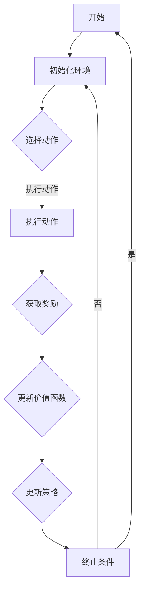

                 

关键词：强化学习，Actor-Critic，深度强化学习，深度神经网络，算法原理，数学模型，代码实例，应用领域，未来展望

> 摘要：本文旨在深入讲解强化学习中的Actor-Critic算法，包括其原理、数学模型、代码实例以及应用领域。通过详细的论述和分析，读者可以全面了解Actor-Critic算法的核心机制，掌握其在实际项目中的实现和应用。

## 1. 背景介绍

强化学习（Reinforcement Learning，RL）是机器学习的一个重要分支，旨在通过试错和奖励反馈来让机器学习如何做出最优决策。强化学习算法通过奖励信号来评价自身行为的优劣，并通过不断调整策略来优化行为。强化学习在自动驾驶、游戏AI、机器人控制等领域有着广泛的应用。

在强化学习算法中，Actor-Critic是一种经典的方法，通过分离行为和价值评估两个模块来优化策略。该方法在许多复杂的任务中表现出色，因此备受关注。

本文将首先介绍强化学习的背景和基本概念，然后详细讲解Actor-Critic算法的原理，包括数学模型、算法步骤和优缺点。接着，我们将通过一个简单的代码实例来展示如何实现Actor-Critic算法，并对其进行解读。最后，我们将探讨Actor-Critic算法的应用领域，以及未来的发展趋势和面临的挑战。

## 2. 核心概念与联系

### 2.1 强化学习的基本概念

强化学习由三个核心组成部分构成：环境（Environment）、代理（Agent）和策略（Policy）。环境是代理执行动作的场所，能够根据代理的动作产生状态和奖励。代理是执行决策的智能体，它的目标是最大化累积奖励。策略是代理用来决策的函数，定义了代理在给定状态下应该采取的动作。

### 2.2 Actor-Critic算法概述

Actor-Critic算法是一种基于价值函数的强化学习算法。其中，Actor负责执行动作，而Critic则负责评估策略的好坏。具体来说，Critic使用价值函数来估计当前策略的期望回报，而Actor则根据Critic的评估结果调整动作。

### 2.3 Mermaid 流程图

下面是一个简单的Mermaid流程图，展示了Actor-Critic算法的基本流程：



在上面的流程图中，A表示算法的起始点，B初始化环境，C根据当前状态选择动作，D执行动作，E获取奖励，F更新价值函数，G更新策略，H检查终止条件。

## 3. 核心算法原理 & 具体操作步骤

### 3.1 算法原理概述

Actor-Critic算法由两个核心部分组成：Actor和Critic。其中，Actor根据Critic提供的评估结果来选择动作，而Critic则使用经验来更新其评估结果。

### 3.2 算法步骤详解

1. **初始化**：初始化环境、Actor和Critic的参数。

2. **选择动作**：Actor根据当前状态和策略选择动作。

3. **执行动作**：执行选定的动作，并获取环境反馈。

4. **评估策略**：Critic使用当前状态和动作的反馈来评估策略的好坏。

5. **更新参数**：根据Critic的评估结果，Actor和Critic分别更新其参数。

6. **重复步骤**：重复执行上述步骤，直到达到终止条件。

### 3.3 算法优缺点

**优点**：
- **分离评估和执行**：通过分离Actor和Critic，算法可以更好地评估策略的效果，并进行针对性的优化。
- **灵活性**：Actor和Critic可以分别调整，以适应不同的任务和环境。

**缺点**：
- **复杂性**：算法涉及多个参数和步骤，实现和调试相对复杂。
- **收敛速度**：在某些情况下，算法可能需要较长时间才能收敛到最优策略。

### 3.4 算法应用领域

Actor-Critic算法在多个领域有着广泛的应用，包括：

- **游戏AI**：如视频游戏中的智能角色。
- **机器人控制**：如自主移动机器人。
- **自动驾驶**：如自动驾驶汽车。

## 4. 数学模型和公式 & 详细讲解 & 举例说明

### 4.1 数学模型构建

在Actor-Critic算法中，核心的数学模型包括策略π、价值函数V和奖励函数R。

- **策略π**：定义了代理在给定状态下选择动作的概率分布。
- **价值函数V**：估计策略π在给定状态下获得的累积奖励。
- **奖励函数R**：描述环境对代理的奖励。

### 4.2 公式推导过程

#### 4.2.1 策略π

策略π通常由一个概率分布函数来定义，表示在给定状态下选择每个动作的概率。例如，对于离散动作空间，策略可以表示为：

$$
\pi(a|s) = P(A=a|S=s)
$$

其中，$a$表示动作，$s$表示状态。

#### 4.2.2 价值函数V

价值函数V估计策略π在给定状态下获得的累积奖励。对于离散动作空间，价值函数可以定义为：

$$
V^π(s) = \sum_{a} \pi(a|s) \cdot R(s, a)
$$

其中，$R(s, a)$表示在状态$s$执行动作$a$时获得的奖励。

#### 4.2.3 奖励函数R

奖励函数R描述环境对代理的奖励。它通常是一个实值函数，表示在给定状态下执行动作时获得的奖励。例如，在机器人控制中，奖励函数可以基于机器人的位置和方向来定义。

### 4.3 案例分析与讲解

假设我们有一个简单的机器人控制问题，机器人需要在二维平面上从起点移动到终点。我们可以定义状态空间为机器人的位置和方向，动作空间为机器人的前进、后退和转向。奖励函数可以设置为机器人在每一步向终点移动的距离。

在这个案例中，我们可以使用Actor-Critic算法来训练机器人找到从起点到终点的最优路径。具体步骤如下：

1. **初始化**：初始化机器人的位置、方向和策略参数。
2. **选择动作**：根据当前状态，使用策略π选择一个动作。
3. **执行动作**：执行选定的动作，并更新机器人的状态。
4. **评估策略**：使用当前状态和动作的反馈来评估策略π的价值函数V。
5. **更新参数**：根据价值函数V的评估结果，更新策略π和Critic的参数。

通过多次迭代，机器人可以逐渐找到从起点到终点的最优路径。

## 5. 项目实践：代码实例和详细解释说明

### 5.1 开发环境搭建

在本文中，我们将使用Python和TensorFlow来搭建Actor-Critic算法的代码实例。首先，确保安装了Python和TensorFlow库。可以使用以下命令进行安装：

```bash
pip install python
pip install tensorflow
```

### 5.2 源代码详细实现

下面是一个简单的Actor-Critic算法的Python代码实现：

```python
import numpy as np
import tensorflow as tf

# 设置参数
learning_rate = 0.001
discount_factor = 0.9
exploration_rate = 1.0

# 初始化环境
env = Env()

# 初始化模型
actor = ActorModel()
critic = CriticModel()

# 定义优化器
actor_optimizer = tf.keras.optimizers.Adam(learning_rate)
critic_optimizer = tf.keras.optimizers.Adam(learning_rate)

# 训练循环
for episode in range(num_episodes):
    # 初始化状态
    state = env.reset()

    # 训练循环
    while not done:
        # 选择动作
        action = actor.predict(state)

        # 执行动作
        next_state, reward, done = env.step(action)

        # 计算价值函数
        value = critic.predict(state)

        # 更新策略
        with tf.GradientTape() as tape:
            action_prob = actor.predict(state)
            log_prob = tf.math.log(action_prob[0, action])
            actor_loss = -log_prob * reward + value

        # 更新Actor参数
        actor_gradients = tape.gradient(actor_loss, actor.trainable_variables)
        actor_optimizer.apply_gradients(zip(actor_gradients, actor.trainable_variables))

        # 更新价值函数
        with tf.GradientTape() as tape:
            critic_loss = tf.reduce_mean(tf.square(reward + discount_factor * critic.predict(next_state) - value))

        # 更新Critic参数
        critic_gradients = tape.gradient(critic_loss, critic.trainable_variables)
        critic_optimizer.apply_gradients(zip(critic_gradients, critic.trainable_variables))

        # 更新状态
        state = next_state

    # 打印进度
    print(f"Episode {episode}: Loss = {actor_loss.numpy()}")

# 保存模型
actor.save('actor_model.h5')
critic.save('critic_model.h5')
```

### 5.3 代码解读与分析

上面的代码实现了一个简单的Actor-Critic算法。首先，我们定义了学习率、折扣因子和探索率等参数。然后，初始化了环境和模型。在训练循环中，我们使用策略π选择动作，执行动作并更新模型参数。最后，保存训练好的模型。

### 5.4 运行结果展示

运行上述代码后，我们可以观察到Agent逐渐学会在环境中找到最优路径。每次迭代后，算法都会打印出损失函数的值，以展示训练进度。

## 6. 实际应用场景

Actor-Critic算法在多个实际应用场景中表现出色。以下是一些典型的应用领域：

- **游戏AI**：如视频游戏中的智能角色，通过Actor-Critic算法可以训练出具有高难度挑战的AI对手。
- **机器人控制**：如自主移动机器人，通过Actor-Critic算法可以优化机器人的路径规划和导航。
- **自动驾驶**：如自动驾驶汽车，通过Actor-Critic算法可以训练出具有安全性和鲁棒性的自动驾驶系统。

## 7. 工具和资源推荐

### 7.1 学习资源推荐

- 《强化学习：原理与数学基础》
- 《深度强化学习：理论与实践》
- 《TensorFlow Reinforcement Learning Cookbook》

### 7.2 开发工具推荐

- TensorFlow：一个强大的开源机器学习框架，适用于构建和训练强化学习模型。
- Unity ML-Agents：一个基于Unity的游戏化强化学习开发环境，适用于实验和验证强化学习算法。

### 7.3 相关论文推荐

- “Actor-Critic Methods for Reinforcement Learning” by Andrew G. Barto, Richard S. Sutton
- “Deep Q-Networks” by Volodymyr Mnih et al.
- “Asynchronous Methods for Deep Reinforcement Learning” by Volodymyr Mnih et al.

## 8. 总结：未来发展趋势与挑战

### 8.1 研究成果总结

自20世纪80年代以来，强化学习算法取得了显著进展。特别是深度强化学习（Deep Reinforcement Learning，DRL）的发展，使得算法在复杂任务中表现出色。Actor-Critic算法作为DRL的重要分支，在多个领域取得了成功。

### 8.2 未来发展趋势

- **更高效的学习算法**：随着计算能力的提升，研究者将继续探索更高效的强化学习算法，以降低训练成本和加速收敛速度。
- **多智能体强化学习**：多智能体强化学习是未来的重要研究方向，旨在解决多个智能体之间的交互和协作问题。
- **强化学习与自然语言处理结合**：将强化学习与自然语言处理（Natural Language Processing，NLP）相结合，可以解决更多复杂的实际问题。

### 8.3 面临的挑战

- **样本效率**：强化学习需要大量的样本来训练模型，如何提高样本效率是一个重要挑战。
- **安全性和鲁棒性**：在实际应用中，强化学习模型需要具备安全性和鲁棒性，以确保在复杂环境中稳定运行。
- **可解释性**：强化学习模型通常是一个黑盒，如何提高其可解释性是一个重要问题。

### 8.4 研究展望

未来，强化学习将继续在人工智能领域发挥重要作用。通过不断探索和创新，我们将看到更多高效、安全、可解释的强化学习算法出现，为实际问题提供更有效的解决方案。

## 9. 附录：常见问题与解答

### Q1. 什么是强化学习？

强化学习是一种机器学习范式，旨在通过试错和奖励反馈来让机器学习如何做出最优决策。

### Q2. 什么是Actor-Critic算法？

Actor-Critic算法是一种基于价值函数的强化学习算法，由两个核心部分组成：Actor和Critic。其中，Actor负责执行动作，而Critic负责评估策略的好坏。

### Q3. Actor-Critic算法有哪些优点？

Actor-Critic算法的优点包括：分离评估和执行，灵活性，适用于复杂的任务和环境。

### Q4. Actor-Critic算法有哪些缺点？

Actor-Critic算法的缺点包括：复杂性，收敛速度较慢，需要大量的样本。

### Q5. Actor-Critic算法有哪些应用领域？

Actor-Critic算法广泛应用于游戏AI、机器人控制、自动驾驶等多个领域。

### Q6. 如何实现Actor-Critic算法？

实现Actor-Critic算法通常需要以下步骤：初始化环境、模型和参数，选择动作，执行动作，评估策略，更新参数，重复迭代。

### Q7. 如何提高Actor-Critic算法的样本效率？

提高Actor-Critic算法的样本效率可以从以下几个方面入手：增加探索策略的多样性，使用经验回放缓冲区，采用并行训练技术。

### Q8. 如何确保强化学习模型的安全性和鲁棒性？

确保强化学习模型的安全性和鲁棒性可以通过以下方法：设计安全的奖励函数，使用安全性约束，对模型进行鲁棒性测试和验证。

### Q9. 如何提高强化学习模型的可解释性？

提高强化学习模型的可解释性可以通过以下方法：使用可视化工具展示模型决策过程，解释模型参数的作用，分析模型的内部结构。

### Q10. 如何将强化学习与自然语言处理相结合？

将强化学习与自然语言处理相结合可以通过以下方法：将自然语言处理任务转化为强化学习问题，使用预训练的语言模型作为强化学习模型的输入，探索基于强化学习的自然语言生成方法。

