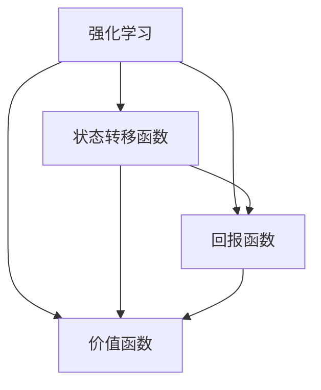

                 

关键词：强化学习，动态规划，算法原理，代码实例，计算机程序设计艺术

> 摘要：本文将深入探讨强化学习算法中的动态规划原理，通过详细的算法原理阐述、具体操作步骤解析、数学模型构建与公式推导，以及代码实例与实际应用分析，帮助读者全面理解强化学习与动态规划的核心概念及其在计算机程序设计中的应用。

## 1. 背景介绍

### 1.1 强化学习的发展历程

强化学习（Reinforcement Learning，RL）是机器学习的一个重要分支，起源于心理学和行为经济学，经过几十年的发展，已经逐渐成为人工智能领域的重要研究方向。早期，强化学习主要应用于机器人控制、游戏AI和模拟环境等领域。随着深度学习技术的兴起，强化学习与深度神经网络（DNN）的结合，使得其在图像识别、自然语言处理等复杂任务中取得了显著成果。

### 1.2 动态规划的应用背景

动态规划（Dynamic Programming，DP）是解决优化问题的一种方法，起源于数学和经济学领域。动态规划的基本思想是将复杂问题分解为相互关联的子问题，通过求解子问题并保存中间结果，避免重复计算，从而提高算法效率。动态规划在优化问题中的应用广泛，如背包问题、旅行商问题等。

### 1.3 强化学习与动态规划的关系

强化学习与动态规划之间存在密切的联系。动态规划为强化学习提供了一种求解策略优化问题的有效方法。在强化学习中，策略优化通常是一个优化问题，动态规划可以应用于求解这种优化问题。此外，动态规划在强化学习中的另一个重要作用是，通过将长期回报拆分为一系列短期回报，实现价值函数的迭代更新，从而提高学习效率。

## 2. 核心概念与联系

### 2.1 强化学习核心概念

在强化学习中，主要涉及以下几个核心概念：

- **代理（Agent）**：执行行动以获得奖励的实体。
- **环境（Environment）**：代理交互的动态环境。
- **状态（State）**：环境中的一个特定情况。
- **动作（Action）**：代理可执行的动作。
- **奖励（Reward）**：代理执行动作后获得的即时回报。
- **策略（Policy）**：代理在给定状态下执行的动作映射。

### 2.2 动态规划核心概念

动态规划的核心概念包括：

- **状态转移函数（State Transition Function）**：描述系统在不同状态之间转移的概率。
- **回报函数（Reward Function）**：描述系统在不同状态下的回报。
- **价值函数（Value Function）**：描述系统在给定状态下期望的长期回报。

### 2.3 强化学习与动态规划的关联

强化学习与动态规划之间的关联可以通过以下流程图展示：

```
+---------------------+
|    强化学习         |
+---------------------+
          |    动态规划
          |
+---------------------+
|    状态转移函数      |
+---------------------+
          |    回报函数
          |
+---------------------+
|    价值函数         |
+---------------------+
```

在强化学习中，状态转移函数描述了代理在给定状态下执行特定动作后，环境状态发生变化的可能性。回报函数则描述了代理在执行动作后获得的即时回报。通过动态规划，代理可以优化其策略，以最大化长期回报。价值函数则用于评估代理在不同状态下的长期回报。

### 2.4 Mermaid 流程图

以下是一个展示强化学习与动态规划关联的Mermaid流程图：



## 3. 核心算法原理 & 具体操作步骤

### 3.1 算法原理概述

强化学习中的动态规划主要分为两种类型：值迭代和价值函数近似。

- **值迭代（Value Iteration）**：通过不断迭代更新价值函数，直至收敛，从而得到最优策略。
- **价值函数近似（Value Function Approximation，VFA）**：使用神经网络或其他函数近似方法来表示价值函数，从而在样本数据较少的情况下提高学习效率。

### 3.2 算法步骤详解

#### 3.2.1 值迭代

值迭代的步骤如下：

1. 初始化价值函数 $V(s)$，其中 $s$ 表示状态。
2. 重复以下步骤直至收敛：
   a. 对于每个状态 $s$，计算新的价值函数值 $V'(s)$，公式如下：
   $$ V'(s) = \max_a \sum_{s'} P(s' | s, a) \cdot [R(s, a, s') + \gamma V(s')] $$
   其中，$P(s' | s, a)$ 表示状态转移概率，$R(s, a, s')$ 表示回报，$\gamma$ 表示折扣因子。
   b. 将 $V'(s)$ 更新为 $V(s)$。
3. 当价值函数的变化小于预设阈值 $\epsilon$ 时，算法收敛，得到最优策略。

#### 3.2.2 价值函数近似

价值函数近似的步骤如下：

1. 初始化神经网络模型，用于表示价值函数 $V(s)$。
2. 在训练过程中，使用梯度下降等方法更新神经网络权重。
3. 通过优化损失函数，最小化预测价值函数与实际回报之间的差距。
4. 评估训练效果，并根据需要调整神经网络结构或超参数。

### 3.3 算法优缺点

#### 优缺点

- **值迭代**：
  - 优点：理论证明收敛性，计算复杂度较低。
  - 缺点：收敛速度较慢，需要大量样本。

- **价值函数近似**：
  - 优点：可以处理高维状态空间，提高学习效率。
  - 缺点：可能陷入局部最优，收敛性证明较为复杂。

### 3.4 算法应用领域

强化学习与动态规划在计算机程序设计中具有广泛的应用，包括：

- **机器人控制**：使用动态规划优化机器人路径规划。
- **游戏AI**：设计智能体进行策略优化。
- **自然语言处理**：用于生成文本和语音合成。
- **推荐系统**：优化用户推荐策略。

## 4. 数学模型和公式 & 详细讲解 & 举例说明

### 4.1 数学模型构建

强化学习中的动态规划通常涉及以下数学模型：

1. **状态转移概率**：$P(s' | s, a)$，表示代理在状态 $s$ 下执行动作 $a$ 后，转移到状态 $s'$ 的概率。
2. **回报函数**：$R(s, a, s')$，表示代理在状态 $s$ 下执行动作 $a$ 后，转移到状态 $s'$ 并获得即时的回报。
3. **折扣因子**：$\gamma$，表示对未来回报的折扣，取值范围为 $0 \leq \gamma \leq 1$。

### 4.2 公式推导过程

#### 4.2.1 值迭代

值迭代的公式推导如下：

假设当前价值函数为 $V(s)$，通过迭代更新得到新的价值函数 $V'(s)$，公式如下：

$$ V'(s) = \max_a \sum_{s'} P(s' | s, a) \cdot [R(s, a, s') + \gamma V(s')] $$

其中，$a^*$ 表示当前最优动作。

#### 4.2.2 价值函数近似

价值函数近似使用神经网络表示价值函数，通常采用以下损失函数进行优化：

$$ L = \sum_{s, a} [R(s, a, s') + \gamma V(s') - V(s, a)]^2 $$

其中，$V(s, a)$ 表示神经网络预测的价值函数。

### 4.3 案例分析与讲解

#### 4.3.1 游戏AI

假设我们使用动态规划算法训练一个游戏AI，目标是学习最优策略，以最大化游戏的长期回报。

1. **初始化**：初始化神经网络模型，用于表示价值函数。
2. **训练**：在模拟环境中，代理执行动作，记录状态转移概率和回报函数。
3. **更新**：通过优化损失函数，更新神经网络权重，最小化预测价值函数与实际回报之间的差距。
4. **评估**：在真实环境中评估训练效果，调整神经网络结构或超参数。

通过上述步骤，游戏AI可以逐渐学习到最优策略，实现游戏胜利。

## 5. 项目实践：代码实例和详细解释说明

### 5.1 开发环境搭建

1. 安装Python环境。
2. 安装TensorFlow或PyTorch等深度学习框架。
3. 准备游戏环境，例如OpenAI Gym。

### 5.2 源代码详细实现

以下是一个使用TensorFlow实现的动态规划算法示例：

```python
import tensorflow as tf
import gym

# 初始化环境
env = gym.make('CartPole-v0')

# 定义神经网络模型
model = tf.keras.Sequential([
    tf.keras.layers.Dense(64, activation='relu', input_shape=(4,)),
    tf.keras.layers.Dense(64, activation='relu'),
    tf.keras.layers.Dense(1)
])

# 定义损失函数和优化器
optimizer = tf.keras.optimizers.Adam(learning_rate=0.001)
loss_fn = tf.keras.losses.MeanSquaredError()

# 训练模型
for episode in range(1000):
    state = env.reset()
    done = False
    total_reward = 0

    while not done:
        # 预测价值函数
        value = model(state)

        # 选择最优动作
        action = np.argmax(value)

        # 执行动作
        next_state, reward, done, _ = env.step(action)

        # 更新价值函数
        with tf.GradientTape() as tape:
            tape.watch(model.trainable_variables)
            value_pred = model(next_state)
            loss = loss_fn(reward + gamma * value_pred, value)

        # 更新模型权重
        grads = tape.gradient(loss, model.trainable_variables)
        optimizer.apply_gradients(zip(grads, model.trainable_variables))

        # 更新总回报
        total_reward += reward

    if episode % 100 == 0:
        print(f"Episode: {episode}, Total Reward: {total_reward}")

# 关闭环境
env.close()
```

### 5.3 代码解读与分析

1. **环境初始化**：使用OpenAI Gym创建游戏环境。
2. **模型定义**：定义一个简单的神经网络模型，用于表示价值函数。
3. **训练过程**：在训练过程中，通过优化损失函数，更新模型权重，实现价值函数的迭代更新。
4. **评估效果**：在训练过程中，定期评估模型效果，调整超参数。

通过上述步骤，我们可以训练出一个能够玩转“CartPole”游戏的AI。

## 6. 实际应用场景

### 6.1 自动驾驶

在自动驾驶领域，强化学习与动态规划可以用于优化车辆的路径规划。通过训练自动驾驶车辆在不同路况下的最优策略，实现安全、高效的驾驶。

### 6.2 游戏AI

在游戏开发中，强化学习与动态规划可以帮助设计智能的对手，提高游戏的挑战性和趣味性。

### 6.3 自然语言处理

在自然语言处理领域，强化学习与动态规划可以用于生成文本和语音合成，提高模型的生成质量和效率。

## 7. 工具和资源推荐

### 7.1 学习资源推荐

- 《强化学习：原理与Python实现》（作者：阿尔瓦拉多）
- 《深度强化学习》（作者：萨顿）

### 7.2 开发工具推荐

- TensorFlow
- PyTorch

### 7.3 相关论文推荐

- “Deep Reinforcement Learning for Game Playing” (Silver et al., 2016)
- “Q-Learning” (Watkins, 1989)

## 8. 总结：未来发展趋势与挑战

### 8.1 研究成果总结

本文介绍了强化学习算法中的动态规划原理，并通过详细的算法原理阐述、具体操作步骤解析、数学模型构建与公式推导，以及代码实例与实际应用分析，帮助读者全面理解强化学习与动态规划的核心概念及其在计算机程序设计中的应用。

### 8.2 未来发展趋势

- **算法优化**：继续探索更高效、更鲁棒的强化学习算法。
- **跨学科融合**：强化学习与其他领域的融合，如生物学、心理学等。
- **硬件加速**：利用GPU、TPU等硬件加速强化学习训练过程。

### 8.3 面临的挑战

- **数据稀缺性**：强化学习在训练过程中需要大量样本，但在某些任务中，获取样本非常困难。
- **收敛速度**：现有算法在收敛速度方面仍有待提高。

### 8.4 研究展望

未来的研究将继续探索强化学习算法的优化，提高算法的泛化能力和鲁棒性，并在实际应用中发挥更大作用。

## 9. 附录：常见问题与解答

### 9.1 什么是强化学习？

强化学习是一种机器学习范式，通过学习从环境状态到动作的策略，以最大化长期回报。

### 9.2 动态规划与贪心算法有什么区别？

动态规划是求解优化问题的方法，而贪心算法是求解最优化问题的策略。动态规划考虑了全局最优性，而贪心算法只考虑局部最优。

### 9.3 强化学习在哪些领域有应用？

强化学习在自动驾驶、游戏AI、自然语言处理、机器人控制等领域有广泛应用。

## 作者署名

作者：禅与计算机程序设计艺术 / Zen and the Art of Computer Programming

----------------------------------------------------------------

以上就是强化学习算法与动态规划的详细讲解和代码实例，希望对您的学习和实践有所帮助。在探索计算机程序设计的艺术过程中，不断深化对强化学习和动态规划的理解，将为您的科研和工程实践带来新的启示。

