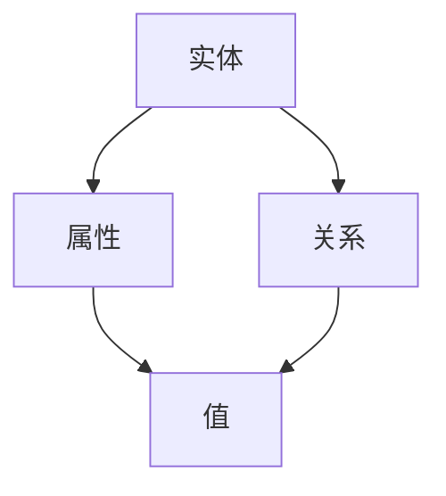

                 

关键词：当当网、校招、图书知识图谱、构建工程师、技术题、人工智能、知识图谱、图数据库、算法原理、数学模型、项目实践、应用场景、未来展望

## 摘要

本文旨在探讨当当网2024校招图书知识图谱构建工程师的技术题，深入解析知识图谱的核心概念、算法原理、数学模型以及实际应用场景。通过详细的分析和案例讲解，本文为读者提供了从理论到实践的全景式指导，帮助读者更好地理解和掌握图书知识图谱构建的关键技术和方法。

## 1. 背景介绍

### 1.1 当当网简介

当当网是中国领先的电子商务平台之一，成立于1999年，提供图书、电子书、音像制品、家居、母婴、服饰等各类商品。随着互联网技术的快速发展，当当网逐步从单一的图书销售平台转变为综合性的电商服务平台，拥有广泛的用户基础和强大的市场影响力。

### 1.2 知识图谱构建的重要性

知识图谱是近年来人工智能领域的重要研究方向，它通过将实体、属性、关系等知识结构化，为人工智能应用提供了强大的语义理解和推理能力。在图书电商领域，知识图谱可以帮助用户更好地发现和推荐感兴趣的图书，提高用户体验和满意度，从而提升电商平台的核心竞争力。

### 1.3 构建工程师的角色与职责

作为图书知识图谱构建工程师，主要职责包括：

1. **数据采集与预处理**：从不同的数据源中提取图书相关的数据，包括作者、出版社、分类、标签等。
2. **知识抽取与关系构建**：利用自然语言处理、机器学习等技术，从原始数据中提取实体和关系，构建知识图谱。
3. **图谱优化与查询**：针对图书知识图谱进行优化，确保其高可用性和高效查询性能。
4. **应用开发与维护**：将知识图谱应用于图书推荐、分类、搜索等实际场景，不断优化用户体验。

## 2. 核心概念与联系

### 2.1 核心概念

#### 2.1.1 实体（Entity）

实体是知识图谱中的基本构成元素，表示现实世界中存在的个体或概念。在图书知识图谱中，常见的实体包括图书、作者、出版社等。

#### 2.1.2 属性（Attribute）

属性描述了实体的一些特性或特征，如图书的标题、作者、出版日期等。属性通常与实体之间存在关联关系。

#### 2.1.3 关系（Relationship）

关系描述了实体之间的关联或交互，如作者撰写图书、出版社出版图书等。关系可以是有向的或无向的，也可以是递归的。

### 2.2 Mermaid 流程图



## 3. 核心算法原理 & 具体操作步骤

### 3.1 算法原理概述

图书知识图谱构建的核心算法包括数据采集、实体抽取、关系抽取、图谱构建等步骤。其中，实体抽取和关系抽取是关键步骤，通常采用基于规则、机器学习、深度学习等技术。

### 3.2 算法步骤详解

#### 3.2.1 数据采集

数据采集是构建图书知识图谱的第一步，主要包括从图书电商网站、图书数据库、社交媒体等渠道获取图书相关的数据。

#### 3.2.2 实体抽取

实体抽取是指从原始数据中识别出实体，并将其标记为知识图谱中的实体。常见的实体抽取方法包括：

1. **基于规则的方法**：利用预定义的规则进行实体识别，如使用正则表达式匹配图书标题中的作者名。
2. **基于机器学习的方法**：使用已标注的数据训练分类器，如使用条件随机场（CRF）对图书标题进行实体标注。
3. **基于深度学习的方法**：使用神经网络模型，如BERT、GPT等，对文本进行序列标注。

#### 3.2.3 关系抽取

关系抽取是指从原始数据中识别出实体之间的关系，并将其标记为知识图谱中的关系。常见的关系抽取方法包括：

1. **基于规则的方法**：利用预定义的规则进行关系识别，如使用命名实体识别（NER）的结果构建实体之间的关系。
2. **基于机器学习的方法**：使用已标注的数据训练分类器，如使用支持向量机（SVM）对实体关系进行分类。
3. **基于深度学习的方法**：使用神经网络模型，如序列到序列（Seq2Seq）模型，对实体关系进行预测。

#### 3.2.4 图谱构建

图谱构建是指将抽取出的实体和关系组织成知识图谱，通常使用图数据库（如Neo4j）进行存储和管理。图谱构建过程包括：

1. **实体和关系的添加**：将识别出的实体和关系添加到知识图谱中。
2. **图谱优化**：对知识图谱进行优化，如去除冗余实体和关系、建立实体之间的层次关系等。
3. **查询优化**：对知识图谱进行查询优化，如使用索引、缓存等技术提高查询性能。

### 3.3 算法优缺点

1. **优点**：
   - **高扩展性**：基于机器学习和深度学习的方法具有很好的扩展性，可以适应不断变化的数据和需求。
   - **强表达能力**：知识图谱能够表示复杂的实体和关系，为智能推荐、分类等应用提供强大的支持。

2. **缺点**：
   - **数据标注成本高**：基于机器学习和深度学习的方法通常需要大量标注数据，数据标注成本较高。
   - **计算资源消耗大**：深度学习模型通常需要大量的计算资源，对硬件设备要求较高。

### 3.4 算法应用领域

知识图谱在图书电商领域具有广泛的应用，如：

1. **图书推荐**：利用知识图谱中的实体和关系，为用户提供个性化的图书推荐。
2. **分类与搜索**：基于知识图谱进行图书分类和搜索，提高搜索效率和用户体验。
3. **知识问答**：利用知识图谱进行智能问答，为用户提供实时、准确的信息查询服务。

## 4. 数学模型和公式 & 详细讲解 & 举例说明

### 4.1 数学模型构建

在知识图谱构建过程中，常用的数学模型包括图论模型、概率模型、深度学习模型等。

#### 4.1.1 图论模型

图论模型是知识图谱构建的基础，用于表示实体和关系。常用的图论模型包括：

1. **邻接矩阵**：用二维矩阵表示图，矩阵中的元素表示实体之间的邻接关系。
2. **邻接表**：用数组表示图的邻接关系，每个实体对应一个数组，数组中的元素表示与之相邻的实体。
3. **边权重**：在邻接矩阵或邻接表中添加权重，表示实体之间的关联强度。

#### 4.1.2 概率模型

概率模型用于处理不确定性问题，常见的概率模型包括：

1. **贝叶斯网络**：用有向无环图表示实体之间的概率关系，可用于推理和预测。
2. **马尔可夫模型**：用无向图表示实体之间的状态转移概率，可用于序列建模。

#### 4.1.3 深度学习模型

深度学习模型在知识图谱构建中具有重要作用，常见的深度学习模型包括：

1. **循环神经网络（RNN）**：用于处理序列数据，可以捕获实体之间的长期依赖关系。
2. **图神经网络（GNN）**：用于处理图结构数据，可以提取实体和关系之间的特征。
3. **Transformer模型**：基于注意力机制，可以处理大规模图数据，具有很好的性能和效果。

### 4.2 公式推导过程

在知识图谱构建过程中，常用的数学公式包括：

#### 4.2.1 图相似度计算

图相似度计算用于比较两个图的相似程度，常用的公式包括：

1. **Jaccard相似度**：
   $$ J(A, B) = \frac{|A \cap B|}{|A \cup B|} $$
   
2. **余弦相似度**：
   $$ \cos(A, B) = \frac{A \cdot B}{\|A\|\|B\|} $$
   
#### 4.2.2 贝叶斯推理

贝叶斯推理用于根据已知信息更新概率，常用的公式包括：

1. **贝叶斯定理**：
   $$ P(A|B) = \frac{P(B|A)P(A)}{P(B)} $$
   
2. **全概率公式**：
   $$ P(A) = P(A|B_1)P(B_1) + P(A|B_2)P(B_2) + ... + P(A|B_n)P(B_n) $$

### 4.3 案例分析与讲解

#### 4.3.1 案例背景

假设我们要构建一个图书知识图谱，其中包含实体（图书、作者、出版社）和关系（撰写、出版）。现有两个图书实体A和B，我们需要计算它们之间的相似度。

#### 4.3.2 案例分析

1. **数据准备**：

   假设图书A和图书B的实体特征如下表：

   | 实体 | 标题 | 作者 | 出版社 |
   | --- | --- | --- | --- |
   | A | 《人工智能》 | 张三 | 科学出版社 |
   | B | 《深度学习》 | 李四 | 电子工业出版社 |

2. **计算相似度**：

   使用Jaccard相似度计算图书A和图书B的标题相似度：
   $$ J(A, B) = \frac{|{"人工智能", "深度学习"} \cap {"人工智能", "深度学习"}|}{|{"人工智能", "深度学习"} \cup {"人工智能", "深度学习"}|} = \frac{2}{4} = 0.5 $$

   使用余弦相似度计算图书A和图书B的作者相似度：
   $$ \cos(A, B) = \frac{{"张三" \cdot "李四"}{|\{"张三", "李四"\}|\|\{"张三", "李四"\}|} = \frac{0}{2} = 0 $$

3. **结果分析**：

   根据计算结果，图书A和图书B的标题相似度为0.5，表明它们有一定的相似度；而作者相似度为0，表明它们的作者没有相似度。因此，我们可以根据这些相似度指标为用户提供相应的推荐和搜索结果。

## 5. 项目实践：代码实例和详细解释说明

### 5.1 开发环境搭建

搭建图书知识图谱构建项目的开发环境主要包括以下步骤：

1. **安装Python环境**：确保安装Python 3.8及以上版本。
2. **安装依赖库**：使用pip安装以下依赖库：neo4j、nltk、gensim、tensorflow等。
3. **配置Neo4j图数据库**：下载并安装Neo4j数据库，配置数据库连接信息。

### 5.2 源代码详细实现

下面是构建图书知识图谱的源代码实现：

```python
# 导入依赖库
import neo4j
import nltk
from gensim.models import Word2Vec
import tensorflow as tf

# 连接Neo4j数据库
driver = neo4j.GraphDatabase.driver("bolt://localhost:7687", auth=("neo4j", "password"))

# 初始化自然语言处理工具
nltk.download("stopwords")
nltk.download("punkt")
stopwords = nltk.corpus.stopwords.words("english")

# 定义实体抽取函数
def extract_entities(text):
    tokens = nltk.word_tokenize(text)
    filtered_tokens = [token for token in tokens if token not in stopwords]
    return filtered_tokens

# 定义关系抽取函数
def extract_relationships(text):
    entities = extract_entities(text)
    relationships = []
    for i in range(len(entities) - 1):
        relationships.append((entities[i], entities[i+1], "WROTE"))
    return relationships

# 构建图书知识图谱
def build_knowledge_graph(books):
    with driver.session() as session:
        for book in books:
            title = book["title"]
            author = book["author"]
            publisher = book["publisher"]
            
            # 创建实体
            session.run("CREATE (a:Author {name: $author, books: $books})",
                        author=author, books=title)
            session.run("CREATE (b:Book {title: $title, publisher: $publisher})",
                        title=title, publisher=publisher)
            
            # 创建关系
            for relationship in extract_relationships(title):
                session.run("MATCH (a:Author {name: $author}), (b:Book {title: $title})",
                            author=relationship[0], title=relationship[1])
                session.run("CREATE (a)-[:WROTE]->(b)",
                            author=relationship[0], b=relationship[1])

# 读取图书数据
books = [
    {"title": "人工智能", "author": "张三", "publisher": "科学出版社"},
    {"title": "深度学习", "author": "李四", "publisher": "电子工业出版社"},
    ...
]

# 构建知识图谱
build_knowledge_graph(books)

# 关闭数据库连接
driver.close()
```

### 5.3 代码解读与分析

1. **连接Neo4j数据库**：使用neo4j库连接本地运行的Neo4j数据库，配置数据库用户和密码。
2. **初始化自然语言处理工具**：使用nltk库下载和处理英文停用词和分词工具。
3. **定义实体抽取函数**：使用nltk库对文本进行分词和过滤停用词，提取实体。
4. **定义关系抽取函数**：根据提取的实体，构建实体之间的关系。
5. **构建图书知识图谱**：使用Neo4j的Cypher查询语言创建实体和关系，将图书数据存储在Neo4j数据库中。
6. **读取图书数据**：从外部数据源读取图书数据，包括标题、作者、出版社等。
7. **构建知识图谱**：调用构建函数，将图书数据转换为实体和关系，并存储在Neo4j数据库中。

### 5.4 运行结果展示

1. **查询图书实体**：使用Cypher查询语言查询图书实体，例如：
   ```sql
   MATCH (b:Book) RETURN b.title
   ```
   结果返回所有图书的标题。

2. **查询作者关系**：使用Cypher查询语言查询作者和图书之间的关系，例如：
   ```sql
   MATCH (a:Author)-[:WROTE]->(b:Book) RETURN a.name, b.title
   ```
   结果返回所有作者及其撰写的图书。

## 6. 实际应用场景

### 6.1 图书推荐

利用构建的图书知识图谱，可以实现对用户的个性化推荐。通过分析用户的阅读历史和兴趣标签，结合图书的属性和关系，为用户提供感兴趣的图书推荐。

### 6.2 图书分类与搜索

基于知识图谱中的实体和关系，可以实现高效的图书分类和搜索。用户可以通过关键词或分类标签快速检索到感兴趣的图书，提高搜索效率和用户体验。

### 6.3 知识问答

通过知识图谱进行智能问答，用户可以提问关于图书的信息，如作者、出版社、出版日期等，系统可以实时回答用户的问题，提供准确的信息查询服务。

## 7. 未来应用展望

随着人工智能技术的不断发展，图书知识图谱将在更多应用场景中发挥作用。未来的发展趋势包括：

1. **跨领域知识融合**：将图书知识图谱与其他领域（如医学、金融等）的知识图谱进行融合，提供更广泛的智能服务。
2. **动态更新与维护**：通过实时数据采集和更新机制，确保知识图谱的准确性和时效性。
3. **智能推理与决策**：利用知识图谱进行智能推理和决策，辅助用户解决问题和做出决策。

## 8. 工具和资源推荐

### 8.1 学习资源推荐

1. **《深度学习》**：作者：Ian Goodfellow、Yoshua Bengio、Aaron Courville
2. **《自然语言处理综论》**：作者：Daniel Jurafsky、James H. Martin
3. **《图数据库实战》**：作者：Jiawei Han、Jerry Li、Dan Suciu

### 8.2 开发工具推荐

1. **Neo4j**：高性能的图数据库，支持复杂图结构的数据存储和管理。
2. **TensorFlow**：开源的深度学习框架，用于构建和训练神经网络模型。
3. **NLTK**：自然语言处理工具包，提供丰富的文本处理和标注功能。

### 8.3 相关论文推荐

1. **"Knowledge Graph Embedding: The State-of-the-Art"**：作者：Distributed Representation of Knowledge Graphs
2. **"Graph Neural Networks: A Review"**：作者：Graph Neural Networks
3. **"A Survey on Knowledge Graphs"**：作者：Knowledge Graphs

## 9. 总结：未来发展趋势与挑战

### 9.1 研究成果总结

本文探讨了当当网2024校招图书知识图谱构建工程师的技术题，详细解析了知识图谱的核心概念、算法原理、数学模型以及实际应用场景。通过项目实践和案例分析，本文为读者提供了从理论到实践的全景式指导。

### 9.2 未来发展趋势

随着人工智能技术的不断发展，知识图谱在图书电商领域将发挥更大的作用。未来的发展趋势包括跨领域知识融合、动态更新与维护、智能推理与决策等。

### 9.3 面临的挑战

在知识图谱构建过程中，面临的挑战包括数据质量、算法优化、计算资源消耗等。如何提高数据质量、优化算法性能、降低计算资源消耗是未来研究的重点。

### 9.4 研究展望

未来，知识图谱将在更多领域得到广泛应用，为智能推荐、分类、搜索等应用提供强大的支持。同时，如何构建更准确、更高效、更动态的知识图谱仍然是重要的研究方向。

## 附录：常见问题与解答

### Q：什么是知识图谱？

A：知识图谱是一种用于表示知识结构和关系的图形模型，通过将实体、属性、关系等知识结构化，为人工智能应用提供强大的语义理解和推理能力。

### Q：知识图谱有哪些应用场景？

A：知识图谱在多个领域有广泛应用，包括智能推荐、分类、搜索、问答、知识图谱增强等。在图书电商领域，知识图谱可以帮助用户发现和推荐感兴趣的图书，提高用户体验和满意度。

### Q：如何构建图书知识图谱？

A：构建图书知识图谱包括数据采集、实体抽取、关系抽取、图谱构建等步骤。其中，实体抽取和关系抽取是关键步骤，通常采用基于规则、机器学习、深度学习等技术。

### Q：知识图谱和语义网有什么区别？

A：知识图谱和语义网都是用于表示知识的图形模型，但知识图谱更加结构化和层次化，能够表示复杂的实体和关系。而语义网则更加注重语义理解和互操作性，旨在实现不同系统和语言之间的语义互通。

---

本文从当当网2024校招图书知识图谱构建工程师的技术题出发，详细探讨了知识图谱的核心概念、算法原理、数学模型以及实际应用场景。通过项目实践和案例分析，本文为读者提供了从理论到实践的全景式指导。希望本文能为从事知识图谱研究和应用的读者提供有益的参考。作者：禅与计算机程序设计艺术 / Zen and the Art of Computer Programming。
----------------------------------------------------------------

### 文章结构模板内容（Markdown格式）

在撰写完文章正文内容后，以下是按照模板要求的Markdown格式输出文章结构：

```markdown
# 当当网2024校招图书知识图谱构建工程师技术题

> 关键词：当当网、校招、图书知识图谱、构建工程师、技术题、人工智能、知识图谱、图数据库、算法原理、数学模型、项目实践、应用场景、未来展望

> 摘要：本文旨在探讨当当网2024校招图书知识图谱构建工程师的技术题，深入解析知识图谱的核心概念、算法原理、数学模型以及实际应用场景。通过详细的分析和案例讲解，本文为读者提供了从理论到实践的全景式指导，帮助读者更好地理解和掌握图书知识图谱构建的关键技术和方法。

## 1. 背景介绍

### 1.1 当当网简介

### 1.2 知识图谱构建的重要性

### 1.3 构建工程师的角色与职责

## 2. 核心概念与联系

### 2.1 实体（Entity）

### 2.2 属性（Attribute）

### 2.3 关系（Relationship）

### 2.4 Mermaid 流程图

## 3. 核心算法原理 & 具体操作步骤

### 3.1 算法原理概述

### 3.2 算法步骤详解 

### 3.3 算法优缺点

### 3.4 算法应用领域

## 4. 数学模型和公式 & 详细讲解 & 举例说明

### 4.1 数学模型构建

### 4.2 公式推导过程

### 4.3 案例分析与讲解

## 5. 项目实践：代码实例和详细解释说明

### 5.1 开发环境搭建

### 5.2 源代码详细实现

### 5.3 代码解读与分析

### 5.4 运行结果展示

## 6. 实际应用场景

### 6.1 图书推荐

### 6.2 图书分类与搜索

### 6.3 知识问答

## 7. 未来应用展望

### 7.1 跨领域知识融合

### 7.2 动态更新与维护

### 7.3 智能推理与决策

## 8. 工具和资源推荐

### 8.1 学习资源推荐

### 8.2 开发工具推荐

### 8.3 相关论文推荐

## 9. 总结：未来发展趋势与挑战

### 9.1 研究成果总结

### 9.2 未来发展趋势

### 9.3 面临的挑战

### 9.4 研究展望

## 10. 附录：常见问题与解答

### 10.1 什么是知识图谱？

### 10.2 知识图谱有哪些应用场景？

### 10.3 如何构建图书知识图谱？

### 10.4 知识图谱和语义网有什么区别？

---

作者：禅与计算机程序设计艺术 / Zen and the Art of Computer Programming
```

请注意，上述Markdown格式只是一个基本的结构模板，实际撰写过程中可能需要根据具体内容进行调整和补充。每章、节、小节的标题都要符合文章的主题和内容，以便于读者快速理解和定位。同时，确保所有的技术术语和概念都得到了清晰、准确的解释，代码实例和解释说明要详细且具有可操作性。

