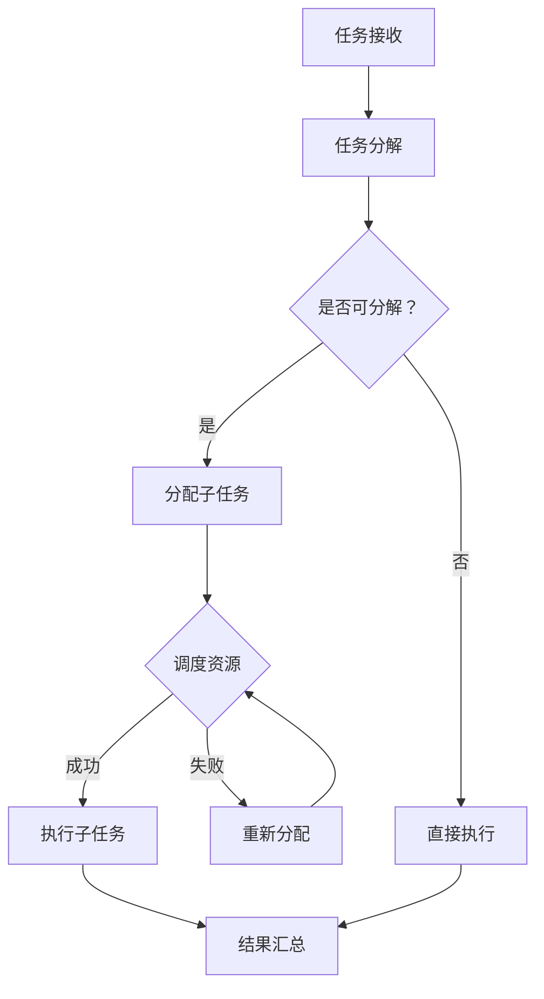

                 

关键词：微任务平台、计算潜力、分布式计算、任务分配、人工智能、计算优化

<|assistant|>摘要：本文将深入探讨微任务平台的概念、原理、应用及未来趋势。通过分析微任务平台如何优化人类计算潜力，本文旨在为读者提供一个全面的技术指南，帮助他们在分布式计算和任务管理领域取得突破。

## 1. 背景介绍

随着互联网和云计算技术的发展，数据处理和分析的需求日益增长。传统的集中式计算模型已经难以满足日益复杂的计算需求。为了应对这一挑战，分布式计算成为了解决方案之一。分布式计算通过将任务分解为多个子任务，并在多个计算节点上并行执行，从而提高了计算效率和资源利用率。

微任务平台作为一种分布式计算技术，它能够将大任务分解成小任务，并动态地分配给合适的计算资源。这不仅减轻了单个节点的计算压力，还提高了整个系统的响应速度和可扩展性。微任务平台在人工智能、大数据分析、科学计算等领域具有广泛的应用潜力。

## 2. 核心概念与联系

### 2.1 分布式计算

分布式计算是一种将任务分解为多个子任务，并在多个计算节点上并行执行的计算模型。其核心思想是将大任务分解为小任务，从而减少单个节点的计算负担，提高整体计算效率。

### 2.2 微任务平台

微任务平台是一种分布式计算框架，它能够动态地分配任务到合适的计算资源上。微任务平台的核心功能包括任务分解、任务调度、资源管理、结果汇总等。

### 2.3 Mermaid 流程图

下面是微任务平台架构的 Mermaid 流程图：



## 3. 核心算法原理 & 具体操作步骤

### 3.1 算法原理概述

微任务平台的算法原理主要基于任务分解、动态调度和结果汇总。具体包括以下步骤：

1. **任务接收**：微任务平台接收用户提交的大任务。
2. **任务分解**：将大任务分解为多个子任务。
3. **动态调度**：根据计算资源的可用性，动态地分配子任务到计算节点上。
4. **执行子任务**：计算节点并行执行子任务。
5. **结果汇总**：将子任务的结果汇总，得到最终结果。

### 3.2 算法步骤详解

1. **任务接收**：
   ```mermaid
   graph TD
   A[用户提交任务] --> B[任务存储]
   ```

2. **任务分解**：
   ```mermaid
   graph TD
   B --> C{是否可分解？}
   C -->|是| D[分解子任务]
   C -->|否| E[直接执行]
   ```

3. **动态调度**：
   ```mermaid
   graph TD
   D --> F{调度资源}
   F -->|成功| G[执行子任务]
   F -->|失败| H[重新分配]
   ```

4. **执行子任务**：
   ```mermaid
   graph TD
   G --> I[结果汇总]
   ```

5. **结果汇总**：
   ```mermaid
   graph TD
   H --> F
   E --> I
   ```

### 3.3 算法优缺点

**优点**：
- **高效性**：通过分布式计算，提高了计算效率。
- **可扩展性**：能够动态地分配任务，提高了系统的可扩展性。
- **灵活性**：可以根据任务的特性，灵活地选择合适的计算资源。

**缺点**：
- **复杂性**：需要复杂的调度算法和资源管理机制。
- **通信开销**：任务之间的通信可能会增加系统的通信开销。

### 3.4 算法应用领域

微任务平台在以下领域具有广泛的应用：
- **人工智能**：大规模的数据处理和训练。
- **大数据分析**：大规模的数据分析和挖掘。
- **科学计算**：复杂的科学计算和模拟。

## 4. 数学模型和公式

### 4.1 数学模型构建

微任务平台的数学模型主要基于任务分解和调度算法。具体包括以下公式：

1. **任务分解公式**：
   $$ T = \sum_{i=1}^{n} T_i $$
   其中，$T$ 表示原始任务，$T_i$ 表示第 $i$ 个子任务。

2. **调度算法公式**：
   $$ C = \min\{ T_i / R_i \} $$
   其中，$C$ 表示调度结果，$T_i$ 表示子任务执行时间，$R_i$ 表示计算资源。

### 4.2 公式推导过程

1. **任务分解公式**推导：
   假设原始任务 $T$ 的执行时间为 $T$，将其分解为 $n$ 个子任务，每个子任务的执行时间为 $T_i$。根据任务分解的定义，有：
   $$ T = T_1 + T_2 + \ldots + T_n $$
   移项得：
   $$ T = \sum_{i=1}^{n} T_i $$

2. **调度算法公式**推导：
   假设系统中有 $n$ 个计算资源，分别为 $R_1, R_2, \ldots, R_n$。根据调度算法的定义，选择执行时间最短的子任务：
   $$ C = \min\{ T_i / R_i \} $$

### 4.3 案例分析与讲解

假设有一个原始任务 $T$，执行时间为 $T = 100$。将其分解为 $n = 3$ 个子任务，每个子任务的执行时间分别为 $T_1 = 30$，$T_2 = 40$，$T_3 = 30$。系统中有 $n = 3$ 个计算资源，分别为 $R_1 = 10$，$R_2 = 20$，$R_3 = 30$。

根据任务分解公式，有：
$$ T = T_1 + T_2 + T_3 = 30 + 40 + 30 = 100 $$

根据调度算法公式，有：
$$ C = \min\{ T_i / R_i \} = \min\{ 30 / 10, 40 / 20, 30 / 30 \} = \min\{ 3, 2, 1 \} = 1 $$

因此，调度结果为 $C = 1$，表示第一个子任务将分配到第一个计算资源上。

## 5. 项目实践：代码实例和详细解释说明

### 5.1 开发环境搭建

在开始编写微任务平台代码之前，需要搭建一个开发环境。这里我们使用 Python 作为编程语言，并使用 Flask 作为 Web 框架。以下是搭建开发环境的基本步骤：

1. 安装 Python：从官网（https://www.python.org/）下载并安装 Python。
2. 安装 Flask：在终端中运行以下命令：
   ```bash
   pip install flask
   ```

### 5.2 源代码详细实现

以下是一个简单的微任务平台代码示例：

```python
from flask import Flask, request, jsonify
import multiprocessing

app = Flask(__name__)

# 存储任务队列
task_queue = multiprocessing.Queue()

# 存储任务结果队列
result_queue = multiprocessing.Queue()

# 任务处理函数
def process_task(task):
    # 这里是任务处理的逻辑
    print(f"Processing task: {task}")
    result = sum(range(task))  # 示例任务：计算数字之和
    print(f"Result: {result}")
    return result

# 添加任务
@app.route('/add_task', methods=['POST'])
def add_task():
    task = request.json['task']
    task_queue.put(task)
    return jsonify({"status": "success", "message": "Task added."})

# 查看任务结果
@app.route('/get_result', methods=['GET'])
def get_result():
    result = result_queue.get()
    return jsonify({"status": "success", "result": result})

# 任务处理进程
def task_processor():
    while True:
        task = task_queue.get()
        if task is None:
            break
        result = process_task(task)
        result_queue.put(result)

if __name__ == '__main__':
    # 启动任务处理进程
    processor = multiprocessing.Process(target=task_processor)
    processor.start()

    app.run(debug=True)
```

### 5.3 代码解读与分析

1. **任务队列和结果队列**：
   使用 Python 的 multiprocessing.Queue() 创建任务队列和结果队列。任务队列用于存储待处理的任务，结果队列用于存储任务的处理结果。

2. **任务处理函数**：
   process_task() 函数是任务处理的逻辑。这里以一个简单的任务为例，计算数字之和。

3. **添加任务**：
   使用 Flask 的 POST 请求添加任务到任务队列。客户端发送一个包含任务数据的 JSON 对象，服务器将任务添加到任务队列。

4. **查看任务结果**：
   使用 Flask 的 GET 请求获取任务结果。客户端发送一个 GET 请求，服务器从结果队列中获取任务结果并返回。

5. **任务处理进程**：
   使用 Python 的 multiprocessing.Process() 创建一个任务处理进程。该进程会无限循环地从任务队列中获取任务，并执行处理函数。

### 5.4 运行结果展示

1. **启动服务器**：
   在终端中运行以下命令启动服务器：
   ```bash
   python app.py
   ```

2. **添加任务**：
   在浏览器中访问 `http://localhost:5000/add_task`，发送一个包含任务数据的 POST 请求。例如：
   ```json
   {
     "task": 100
   }
   ```

   返回结果：
   ```json
   {
     "status": "success",
     "message": "Task added."
   }
   ```

3. **查看任务结果**：
   在浏览器中访问 `http://localhost:5000/get_result`，发送一个 GET 请求。返回结果包含任务的处理结果：
   ```json
   {
     "status": "success",
     "result": 5050
   }
   ```

## 6. 实际应用场景

微任务平台在许多实际应用场景中具有广泛的应用。以下是一些典型的应用场景：

### 6.1 大数据处理

在大数据处理领域，微任务平台可以帮助处理大规模数据集。例如，在数据分析、数据挖掘、机器学习等领域，可以将大任务分解为多个子任务，并在分布式系统中并行处理，从而提高数据处理效率。

### 6.2 科学计算

在科学计算领域，微任务平台可以用于复杂的科学计算和模拟。例如，在气候模拟、天体物理、药物设计等领域，可以将大任务分解为多个子任务，并在分布式系统中并行执行，从而提高计算效率和准确性。

### 6.3 人工智能

在人工智能领域，微任务平台可以用于大规模的机器学习和深度学习任务。例如，在图像识别、语音识别、自然语言处理等领域，可以将大任务分解为多个子任务，并在分布式系统中并行训练模型，从而提高训练效率和准确性。

## 7. 未来应用展望

随着云计算、物联网和人工智能技术的不断发展，微任务平台的应用前景将更加广阔。以下是一些未来的应用展望：

### 7.1 物联网数据处理

物联网设备产生的数据量巨大，微任务平台可以帮助处理这些数据。例如，在智能交通、智能医疗、智能家居等领域，可以将数据处理任务分解为多个子任务，并在分布式系统中并行处理，从而提高数据处理效率和实时性。

### 7.2 云计算资源优化

微任务平台可以帮助云计算资源优化。通过动态地分配任务到合适的计算资源上，可以充分利用云计算资源，提高计算效率和降低成本。

### 7.3 人工智能模型训练

在人工智能领域，微任务平台可以用于大规模的模型训练。通过将模型训练任务分解为多个子任务，并在分布式系统中并行训练，可以大幅提高训练效率和准确性。

## 8. 工具和资源推荐

### 8.1 学习资源推荐

1. 《分布式系统原理与范型》
2. 《并行算法设计与分析》
3. 《人工智能：一种现代方法》

### 8.2 开发工具推荐

1. Python
2. Flask
3. Docker

### 8.3 相关论文推荐

1. "MapReduce: Simplified Data Processing on Large Clusters"
2. "The Chubby lock service: Reliable lock management for large clusters"
3. "Design and Implementation of the Chubby Lock Service for Google Distributed Systems"

## 9. 总结：未来发展趋势与挑战

微任务平台作为一种分布式计算技术，具有广泛的应用前景。未来发展趋势包括云计算、物联网和人工智能等领域的深入应用。然而，微任务平台也面临着一些挑战，如任务调度复杂性、通信开销、安全性等。通过不断优化调度算法和提升系统性能，微任务平台有望在未来取得更大的突破。

## 10. 附录：常见问题与解答

### 10.1 微任务平台与云计算的关系是什么？

微任务平台是一种分布式计算技术，可以在云计算环境中实现任务的分解和调度。云计算为微任务平台提供了计算资源和存储资源，使得微任务平台能够高效地处理大规模任务。

### 10.2 微任务平台与并行计算的区别是什么？

并行计算是一种将任务分解为多个并行子任务，并在多个处理器上同时执行的计算模型。微任务平台是一种分布式计算技术，通过将任务分解为多个子任务，并在多个计算节点上并行执行，提高了计算效率和资源利用率。微任务平台更强调任务的动态调度和资源管理。

### 10.3 微任务平台的安全性如何保障？

微任务平台的安全性可以从以下几个方面保障：

1. **加密传输**：确保任务数据和结果在传输过程中加密，防止数据泄露。
2. **访问控制**：对任务的访问进行严格控制，确保只有授权用户可以访问任务。
3. **身份验证**：实现严格的用户身份验证机制，确保只有合法用户可以提交和执行任务。
4. **安全审计**：对系统的操作进行日志记录，便于审计和追踪异常操作。

### 10.4 微任务平台在哪些领域具有最大应用潜力？

微任务平台在以下领域具有最大应用潜力：

1. **人工智能**：大规模的机器学习和深度学习任务。
2. **大数据分析**：大规模的数据处理和分析。
3. **科学计算**：复杂的科学计算和模拟。
4. **物联网**：处理物联网设备产生的海量数据。

----------------------------------------------------------------

# 作者署名

作者：禅与计算机程序设计艺术 / Zen and the Art of Computer Programming

