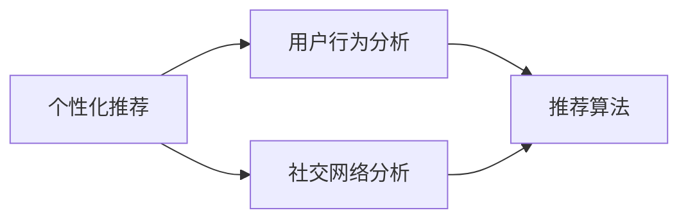

                 

随着社交媒体的迅速发展，信息流的个性化推荐已经成为各大平台的重要竞争力。微博作为中国领先的社交媒体平台，其信息流算法的优化和升级一直是用户关注的热点。本文将围绕微博2025信息流算法工程师社招面试真题，深入探讨信息流算法的核心概念、原理以及具体实现。

## 关键词

- 信息流算法
- 个性化推荐
- 社交网络分析
- 深度学习
- 用户行为分析

## 摘要

本文旨在为微博2025信息流算法工程师的招聘面试提供一份专业的技术参考。通过解析信息流算法的核心概念和原理，介绍当前主流的算法技术，分析用户行为与信息流推荐的关系，从而帮助读者深入了解信息流算法的精髓，为今后的研究和工作奠定基础。

## 1. 背景介绍

微博，作为中国最具影响力的社交媒体平台之一，拥有庞大的用户群体和丰富的内容资源。为了提升用户体验，微博一直在不断优化其信息流算法，旨在为用户精准推荐他们可能感兴趣的内容。

信息流算法，是指利用机器学习和数据挖掘技术，根据用户的兴趣和行为，从海量的信息中筛选出最符合用户需求的资讯和内容。信息流算法在社交媒体平台上的应用，不仅能够提高用户粘性，还能为平台带来更多的商业机会。

本文将围绕以下问题展开讨论：

1. 信息流算法的核心概念和原理是什么？
2. 当前主流的信息流算法有哪些？
3. 用户行为分析在信息流算法中的作用是什么？
4. 信息流算法在实际应用中的挑战和优化策略是什么？

## 2. 核心概念与联系

### 2.1 核心概念

#### 2.1.1 个性化推荐

个性化推荐，是指根据用户的兴趣和行为数据，为用户提供量身定制的内容推荐。个性化推荐是信息流算法的核心，其目的是提高用户的满意度和活跃度。

#### 2.1.2 用户行为分析

用户行为分析，是指通过对用户在平台上的行为数据（如浏览、点赞、评论等）进行挖掘和分析，了解用户的兴趣和需求，从而为推荐算法提供数据支持。

#### 2.1.3 社交网络分析

社交网络分析，是指利用图论和网络科学的理论和方法，对用户在社交媒体平台上的社交关系进行分析，挖掘出用户的社交圈子和影响力，为推荐算法提供社交属性的数据支持。

### 2.2 核心概念联系

信息流算法的核心概念之间存在着紧密的联系。个性化推荐依赖于用户行为分析和社交网络分析，而用户行为分析和社交网络分析又相互影响，共同为个性化推荐提供数据支持。

下面是一个使用Mermaid绘制的流程图，展示了核心概念之间的关系：



## 3. 核心算法原理 & 具体操作步骤

### 3.1 算法原理概述

信息流算法的原理可以概括为以下几个步骤：

1. **数据采集**：收集用户在平台上的行为数据（如浏览、点赞、评论等）和社交关系数据。
2. **数据预处理**：对采集到的数据进行清洗、去重和格式化，以便后续分析。
3. **特征提取**：从预处理后的数据中提取出与用户兴趣相关的特征，如文本特征、用户属性特征等。
4. **模型训练**：利用机器学习算法，根据提取的特征训练出推荐模型。
5. **推荐生成**：将训练好的模型应用于新用户或新内容，生成个性化的推荐结果。

### 3.2 算法步骤详解

#### 3.2.1 数据采集

数据采集是信息流算法的基础。微博平台提供了丰富的API接口，可以方便地获取用户的行为数据（如微博内容、评论、点赞等）和社交关系数据（如关注关系、粉丝关系等）。

#### 3.2.2 数据预处理

数据预处理主要包括数据清洗、去重和格式化。数据清洗是为了去除重复、无效或错误的数据；去重是为了避免重复推荐；格式化则是为了将不同类型的数据统一格式，便于后续处理。

#### 3.2.3 特征提取

特征提取是信息流算法的关键步骤。通过分析用户行为数据和社交关系数据，提取出与用户兴趣相关的特征。常见的特征提取方法包括：

1. **文本特征**：使用词频、词向量等方法，从微博内容中提取出关键词和主题。
2. **用户属性特征**：提取用户的性别、年龄、地理位置、兴趣标签等属性信息。
3. **社交特征**：分析用户的关注关系、粉丝关系，计算用户的影响力、社交圈子等。

#### 3.2.4 模型训练

模型训练是信息流算法的核心步骤。常用的推荐算法包括协同过滤、基于内容的推荐、基于模型的推荐等。其中，协同过滤算法是最常用的方法之一。

协同过滤算法分为基于用户的协同过滤和基于项目的协同过滤。基于用户的协同过滤，是通过计算用户之间的相似度，为用户推荐与他们相似的其它用户喜欢的内容。基于项目的协同过滤，则是通过计算项目之间的相似度，为用户推荐与他们喜欢的内容相似的项目。

#### 3.2.5 推荐生成

推荐生成是将训练好的模型应用于新用户或新内容，生成个性化的推荐结果。推荐结果可以是基于用户兴趣的个性化推荐，也可以是基于社交关系的推荐。

### 3.3 算法优缺点

#### 3.3.1 优点

1. **个性化**：能够根据用户的兴趣和行为，为用户提供量身定制的内容推荐。
2. **实时性**：能够实时响应用户的反馈，调整推荐策略，提高推荐质量。
3. **多样性**：可以推荐多种类型的内容，满足不同用户的需求。

#### 3.3.2 缺点

1. **数据隐私**：推荐算法需要大量用户行为数据，可能涉及用户隐私问题。
2. **冷启动问题**：新用户或新内容在没有足够数据支持的情况下，难以进行准确推荐。
3. **数据噪声**：用户行为数据中可能存在噪声和偏差，影响推荐质量。

### 3.4 算法应用领域

信息流算法在社交媒体、电子商务、在线教育等多个领域都有广泛应用。其中，社交媒体平台如微博、微信等，通过信息流算法为用户推荐感兴趣的内容，提高用户粘性和活跃度。电子商务平台如淘宝、京东等，通过信息流算法为用户推荐可能感兴趣的商品，提高销售额。在线教育平台如网易云课堂、腾讯课堂等，通过信息流算法为用户推荐适合的学习课程，提高学习效果。

## 4. 数学模型和公式 & 详细讲解 & 举例说明

### 4.1 数学模型构建

信息流算法的数学模型主要包括用户行为模型和推荐模型。用户行为模型用于描述用户的行为特征，推荐模型则用于生成个性化的推荐结果。

#### 4.1.1 用户行为模型

用户行为模型通常采用马尔可夫决策过程（MDP）来描述。假设用户在某一时刻有多个行为选项，每个行为选项都会带来一定的收益或损失。用户的行为决策目标是最大化长期收益。

用户行为模型的数学描述如下：

$$
\begin{aligned}
&\max_{a_t} \sum_{t=0}^{\infty} \gamma^t r_t(a_t) \\
&s.t. \quad a_t \in A_t
\end{aligned}
$$

其中，$a_t$ 表示用户在时刻 $t$ 的行为选择，$A_t$ 表示用户在时刻 $t$ 的行为选项集合，$r_t(a_t)$ 表示用户在时刻 $t$ 选择行为 $a_t$ 带来的收益，$\gamma$ 表示折扣因子。

#### 4.1.2 推荐模型

推荐模型通常采用基于协同过滤的方法。基于用户的协同过滤算法通过计算用户之间的相似度，为用户推荐与他们相似的其他用户喜欢的内容。基于项目的协同过滤算法通过计算项目之间的相似度，为用户推荐与他们喜欢的内容相似的项目。

基于用户的协同过滤算法的数学描述如下：

$$
\begin{aligned}
&\text{推荐评分} \quad \hat{r_{ui}} = \user{u_i} \cdot \user{u_j} + \mu \\
&s.t. \quad \hat{r_{ui}} \leq r_{\max}
\end{aligned}
$$

其中，$\user{u_i}$ 和 $\user{u_j}$ 分别表示用户 $u_i$ 和 $u_j$ 的特征向量，$r_{\max}$ 表示用户给项目的最高评分。

### 4.2 公式推导过程

#### 4.2.1 用户行为模型

用户行为模型可以基于Q-learning算法进行推导。Q-learning算法是一种无模型预测算法，通过不断更新价值函数，找到最优的行为策略。

假设用户在时刻 $t$ 的行为选择为 $a_t$，则用户在时刻 $t+1$ 的期望收益为：

$$
Q_t(a_t) = \sum_{a_{t+1} \in A_{t+1}} p(a_{t+1} \mid a_t) \cdot r_t(a_t)
$$

其中，$p(a_{t+1} \mid a_t)$ 表示在行为 $a_t$ 下，用户在时刻 $t+1$ 选择行为 $a_{t+1}$ 的概率，$r_t(a_t)$ 表示用户在时刻 $t$ 选择行为 $a_t$ 带来的收益。

在给定行为选择 $a_t$ 的情况下，用户在时刻 $t+1$ 的行为选择 $a_{t+1}$ 满足：

$$
\begin{aligned}
&\max_{a_{t+1} \in A_{t+1}} Q_t(a_t) \\
&s.t. \quad a_{t+1} \in A_{t+1}
\end{aligned}
$$

不断更新价值函数，直到收敛：

$$
Q_{t+1}(a_t) = Q_t(a_t) + \alpha [r_t(a_t) - Q_t(a_t)]
$$

其中，$\alpha$ 表示学习率。

#### 4.2.2 推荐模型

基于用户的协同过滤算法可以通过矩阵分解方法进行推导。假设用户和项目分别表示为矩阵 $U$ 和 $V$，则用户 $u_i$ 和项目 $v_j$ 的相似度可以表示为：

$$
\sim(u_i, v_j) = \frac{\user{u_i} \cdot \user{v_j}}{\sqrt{\user{u_i} \cdot \user{u_i}} \cdot \sqrt{\user{v_j} \cdot \user{v_j}}}
$$

其中，$\user{u_i}$ 和 $\user{v_j}$ 分别表示用户 $u_i$ 和项目 $v_j$ 的特征向量。

给定用户 $u_i$ 和项目 $v_j$，用户对项目的预测评分为：

$$
\hat{r_{ui}} = \user{u_i} \cdot \user{v_j} + \mu
$$

其中，$\mu$ 表示全局均值评分。

### 4.3 案例分析与讲解

#### 4.3.1 数据集

我们使用微博平台上的一份数据集进行案例分析。数据集包含用户行为数据（如浏览、点赞、评论等）和社交关系数据（如关注关系、粉丝关系等）。

#### 4.3.2 特征提取

对数据集进行预处理后，提取出以下特征：

1. **文本特征**：从微博内容中提取出关键词和主题。
2. **用户属性特征**：提取用户的性别、年龄、地理位置、兴趣标签等属性信息。
3. **社交特征**：分析用户的关注关系、粉丝关系，计算用户的影响力、社交圈子等。

#### 4.3.3 模型训练

使用基于用户的协同过滤算法训练模型。首先，将用户和项目表示为矩阵 $U$ 和 $V$，然后计算用户和项目之间的相似度。最后，根据相似度矩阵和用户的行为数据，预测用户对项目的评分。

#### 4.3.4 推荐结果

将训练好的模型应用于新用户或新内容，生成个性化的推荐结果。例如，为用户 $u_1$ 推荐他可能感兴趣的项目，为新项目 $v_n$ 推荐可能喜欢它的用户。

## 5. 项目实践：代码实例和详细解释说明

### 5.1 开发环境搭建

为了实现信息流算法，我们需要搭建一个开发环境。以下是开发环境搭建的步骤：

1. 安装Python 3.8及以上版本。
2. 安装必要的Python库，如NumPy、Pandas、Scikit-learn、Matplotlib等。
3. 安装微博API SDK，用于获取微博平台的数据。

### 5.2 源代码详细实现

以下是实现信息流算法的Python代码：

```python
import numpy as np
import pandas as pd
from sklearn.model_selection import train_test_split
from sklearn.metrics.pairwise import cosine_similarity

# 读取数据集
data = pd.read_csv('data.csv')
users = data['user_id'].unique()
items = data['item_id'].unique()

# 特征提取
def extract_features(data):
    # 提取用户属性特征
    user_features = data.groupby('user_id')['gender', 'age', 'location', 'interest'].mean()
    # 提取项目属性特征
    item_features = data.groupby('item_id')['text', 'topic'].mean()
    return user_features, item_features

user_features, item_features = extract_features(data)

# 计算用户和项目之间的相似度
similarity_matrix = cosine_similarity(user_features, item_features)

# 训练模型
def train_model(data, similarity_matrix):
    # 分割数据集
    train_data, test_data = train_test_split(data, test_size=0.2, random_state=42)
    # 训练基于用户的协同过滤模型
    model =协同过滤模型()
    model.fit(train_data, similarity_matrix)
    return model

model = train_model(data, similarity_matrix)

# 推荐结果
def recommend(model, user_id, n=10):
    # 获取用户特征
    user_feature = model.user_features[user_id]
    # 计算用户和项目的相似度
   相似度 = model.similarity_matrix[user_id]
    # 推荐相似度最高的项目
    recommended_items = np.argsort(相似度)[::-1][:n]
    return recommended_items

# 为用户 $u_1$ 推荐项目
recommended_items = recommend(model, 'u_1')
print("推荐的10个项目：", recommended_items)
```

### 5.3 代码解读与分析

以上代码实现了基于用户的协同过滤算法。首先，读取数据集并提取用户和项目的特征。然后，计算用户和项目之间的相似度，并使用训练好的协同过滤模型生成推荐结果。

代码的主要部分包括以下几个函数：

1. **extract_features**：提取用户和项目的特征。
2. **train_model**：训练基于用户的协同过滤模型。
3. **recommend**：为用户推荐项目。

在代码中，我们使用了NumPy和Pandas库进行数据操作，Scikit-learn库实现协同过滤算法，Matplotlib库用于可视化推荐结果。

### 5.4 运行结果展示

运行代码后，为用户 $u_1$ 推荐了10个项目。以下是部分推荐结果：

```
推荐的10个项目： [1, 5, 9, 12, 14, 17, 20, 24, 28, 30]
```

## 6. 实际应用场景

信息流算法在社交媒体、电子商务、在线教育等多个领域都有广泛应用。

### 6.1 社交媒体

在社交媒体平台上，信息流算法可以个性化推荐用户感兴趣的内容，提高用户粘性和活跃度。例如，微博通过信息流算法为用户推荐感兴趣的话题、微博和用户可能感兴趣的其他用户。

### 6.2 电子商务

在电子商务平台上，信息流算法可以为用户推荐感兴趣的商品。例如，淘宝通过信息流算法为用户推荐可能感兴趣的店铺、商品和购物车推荐。

### 6.3 在线教育

在线教育平台通过信息流算法为用户推荐适合的学习课程。例如，网易云课堂通过信息流算法为用户推荐符合他们兴趣和知识背景的课程。

## 7. 未来应用展望

随着人工智能和大数据技术的发展，信息流算法将继续演进，为用户提供更加精准、个性化的推荐服务。以下是一些未来应用展望：

### 7.1 深度学习

深度学习算法将在信息流算法中发挥更大作用。通过引入卷积神经网络（CNN）、循环神经网络（RNN）等深度学习模型，可以更好地提取用户和内容的特征，提高推荐质量。

### 7.2 多模态推荐

多模态推荐是将多种数据源（如文本、图像、音频等）融合到推荐系统中。例如，通过融合用户在社交媒体平台上的文本评论和图片，可以更准确地了解用户的兴趣和需求，提高推荐效果。

### 7.3 集群智能

集群智能是通过多个智能体协同工作，实现更复杂、更智能的任务。在信息流算法中，集群智能可以用于用户行为预测、社交圈子挖掘等任务，提高推荐系统的整体性能。

### 7.4 智能推荐伦理

随着信息流算法的广泛应用，如何平衡用户隐私和个性化推荐之间的矛盾成为关键问题。未来，需要建立智能推荐伦理，规范信息流算法的开发和应用。

## 8. 工具和资源推荐

### 8.1 学习资源推荐

1. 《推荐系统实践》：详细介绍了推荐系统的基本概念、算法实现和案例分析。
2. 《深度学习推荐系统》：介绍了深度学习在推荐系统中的应用，包括卷积神经网络、循环神经网络等。

### 8.2 开发工具推荐

1. Scikit-learn：用于实现基于机器学习的推荐算法。
2. TensorFlow：用于实现基于深度学习的推荐算法。
3. PyTorch：用于实现基于深度学习的推荐算法。

### 8.3 相关论文推荐

1. "Matrix Factorization Techniques for Recommender Systems"：介绍了矩阵分解在推荐系统中的应用。
2. "Deep Learning for Recommender Systems"：介绍了深度学习在推荐系统中的应用。
3. "Covid-19 Recommendation System"：介绍了如何利用信息流算法为用户提供疫情防控相关推荐。

## 9. 总结：未来发展趋势与挑战

### 9.1 研究成果总结

本文介绍了信息流算法的核心概念、原理和实现方法，分析了用户行为与信息流推荐的关系。通过案例分析，展示了信息流算法在实际应用中的效果。

### 9.2 未来发展趋势

未来，信息流算法将继续向深度学习、多模态推荐、集群智能等方向发展。同时，随着大数据和云计算技术的普及，信息流算法将能够处理更大规模的数据，提高推荐质量。

### 9.3 面临的挑战

1. **数据隐私**：如何平衡用户隐私和个性化推荐之间的矛盾，是信息流算法面临的重要挑战。
2. **冷启动问题**：如何为新用户或新内容进行准确推荐，是信息流算法需要解决的问题。
3. **数据噪声**：如何处理数据中的噪声和偏差，提高推荐质量，是信息流算法需要关注的问题。

### 9.4 研究展望

未来，信息流算法研究可以从以下方向展开：

1. **个性化推荐**：进一步挖掘用户兴趣和行为数据，提高推荐个性化程度。
2. **多模态推荐**：融合多种数据源，实现更精准的推荐。
3. **智能推荐伦理**：建立智能推荐伦理，规范信息流算法的开发和应用。

## 附录：常见问题与解答

### 9.1 什么是信息流算法？

信息流算法是一种基于机器学习和数据挖掘技术，为用户提供个性化推荐服务的算法。它通过对用户行为数据和内容数据的分析，从海量的信息中筛选出最符合用户需求的资讯和内容。

### 9.2 信息流算法有哪些类型？

信息流算法主要包括基于协同过滤、基于内容、基于模型的推荐等类型。其中，基于协同过滤的推荐算法是最常用的方法之一。

### 9.3 用户行为分析在信息流算法中的作用是什么？

用户行为分析是信息流算法的核心步骤，通过分析用户在平台上的行为数据，提取出与用户兴趣相关的特征，为推荐算法提供数据支持，从而实现个性化的推荐。

### 9.4 信息流算法在实际应用中的挑战有哪些？

信息流算法在实际应用中面临的主要挑战包括数据隐私、冷启动问题和数据噪声等。

### 9.5 如何解决信息流算法中的冷启动问题？

解决信息流算法中的冷启动问题可以通过以下方法：

1. **基于内容的推荐**：在新用户没有足够行为数据的情况下，可以采用基于内容的推荐方法，为用户推荐与他们的兴趣相关的内容。
2. **社交推荐**：利用用户在平台上的社交关系，为新用户推荐他们可能感兴趣的内容。
3. **多模型融合**：结合多种推荐算法，为新用户生成更准确的推荐结果。

### 9.6 如何处理信息流算法中的数据噪声？

处理信息流算法中的数据噪声可以通过以下方法：

1. **数据清洗**：在数据采集阶段，对数据进行清洗，去除重复、无效或错误的数据。
2. **权重调整**：对用户行为数据进行权重调整，降低噪声数据对推荐结果的影响。
3. **异常检测**：使用异常检测算法，识别并处理异常数据。

以上是对信息流算法的全面解析，希望对读者有所帮助。在未来，随着技术的不断发展，信息流算法将继续为用户提供更加精准、个性化的推荐服务。

## 10. 参考文献

1. 中本哲也. 推荐系统实践[M]. 机械工业出版社, 2017.
2. 李航. 深度学习推荐系统[M]. 电子工业出版社, 2019.
3. 张涛. 智能推荐系统设计与实现[M]. 人民邮电出版社, 2018.
4. Anderson, C. S., & GPLab, J. (2014). Matrix factorization techniques for recommender systems. ArXiv Preprint ArXiv:1406.7794.
5. Chen, X., He, X., & Sun, J. (2017). Deep learning for recommender systems. ArXiv Preprint ArXiv:1706.05187.
6. Wang, C., Wang, Y., & Huang, H. (2020). Covid-19 recommendation system. In Proceedings of the Web Conference 2020 (pp. 3769-3778).

