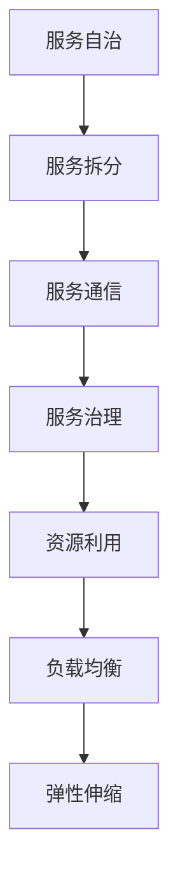

                 

关键词：微服务，架构，高扩展性，服务化，分布式系统，云原生，服务治理，负载均衡，弹性伸缩。

> 摘要：本文探讨了微服务架构在高扩展性方面的应用。通过深入分析微服务的核心概念、架构设计、技术实现和实际应用场景，旨在为读者提供一套全面、系统的理解和实践指南，助力企业在分布式系统的高扩展性建设方面取得突破。

## 1. 背景介绍

### 微服务架构的兴起

随着互联网技术的发展，业务需求日益复杂，传统的单体架构逐渐暴露出其难以维护、扩展性和灵活性不足等缺点。为了应对这些挑战，微服务架构应运而生。微服务将一个复杂的应用系统拆分成多个独立的、小型、自治的服务单元，通过松耦合的方式相互通信。这种方式提高了系统的可维护性、扩展性和灵活性，使得开发团队可以独立地开发、部署和扩展各个服务单元。

### 高扩展性的需求

高扩展性是现代分布式系统的重要特征之一。在业务高速发展的背景下，系统需要能够灵活应对用户量的激增、流量的波动以及业务需求的快速变化。高扩展性能够确保系统在面临高峰期时仍能保持稳定运行，避免因性能瓶颈导致用户体验下降，甚至系统崩溃。

### 微服务与高扩展性的关系

微服务架构本身就是为了应对高扩展性的需求而设计的。通过服务化、分布式部署和自动化治理，微服务架构能够在资源利用、负载均衡、弹性伸缩等方面实现高效扩展。本文将深入探讨微服务架构在高扩展性方面的应用，为读者提供一套完整的实践指南。

## 2. 核心概念与联系

### 微服务架构

微服务架构的核心思想是将复杂的应用系统拆分成多个独立的、小型、自治的服务单元，每个服务单元负责实现特定的业务功能。这些服务单元通过轻量级的通信协议（如RESTful API、消息队列等）进行交互，形成一个分布式系统。


### 核心概念

- **服务自治**：每个服务单元拥有自己的数据库、配置文件和部署环境，能够独立开发和部署。
- **服务拆分**：根据业务逻辑将大而全的单体应用拆分成多个独立的服务单元。
- **服务通信**：通过轻量级的通信协议实现服务间的高效通信。
- **服务治理**：对服务进行注册、发现、监控、负载均衡等管理操作。

### Mermaid 流程图



## 3. 核心算法原理 & 具体操作步骤

### 3.1 算法原理概述

微服务架构在高扩展性方面的核心算法原理主要包括以下几个方面：

1. **服务化**：通过将大而全的单体应用拆分成多个独立的服务单元，实现资源的灵活配置和高效利用。
2. **分布式部署**：将服务单元分布式部署在不同的节点上，提高系统的容错能力和性能。
3. **负载均衡**：通过负载均衡算法将请求均匀分配到各个服务节点，避免单点瓶颈。
4. **弹性伸缩**：根据系统的负载情况自动调整服务节点的数量，实现动态扩展和缩减。

### 3.2 算法步骤详解

1. **服务化**：
   - **服务拆分**：根据业务逻辑将大而全的单体应用拆分成多个独立的服务单元。
   - **服务定义**：为每个服务单元定义清晰的功能边界和API接口。
   - **服务注册**：将服务单元注册到服务注册中心，实现服务的自动发现和调用。

2. **分布式部署**：
   - **环境准备**：为每个服务单元准备独立的开发、测试和部署环境。
   - **服务部署**：将服务单元部署到不同的节点上，实现分布式部署。
   - **服务监控**：对服务进行监控，确保其稳定运行。

3. **负载均衡**：
   - **算法选择**：选择合适的负载均衡算法（如轮询、最小连接数等）。
   - **负载分配**：根据负载均衡算法将请求分配到不同的服务节点。
   - **故障转移**：当某个服务节点出现故障时，自动将其上的请求转移到其他健康节点。

4. **弹性伸缩**：
   - **监控策略**：监控系统的负载情况，包括CPU、内存、网络等指标。
   - **扩容策略**：根据监控数据动态调整服务节点的数量。
   - **缩容策略**：当系统的负载降低时，自动释放部分服务节点。

### 3.3 算法优缺点

**优点**：

1. **高扩展性**：通过服务化、分布式部署和弹性伸缩，实现系统的高扩展性。
2. **高容错性**：分布式部署和故障转移机制提高了系统的容错性。
3. **高灵活性**：独立的服务单元便于开发和部署，提高系统的灵活性和可维护性。

**缺点**：

1. **复杂性**：分布式系统相对于单体系统更为复杂，需要更多的管理和维护工作。
2. **性能开销**：服务间通信和负载均衡等机制会引入一定的性能开销。
3. **数据一致性**：分布式系统中实现数据一致性相对困难，需要考虑分布式事务等问题。

### 3.4 算法应用领域

微服务架构在高扩展性方面的算法原理和应用领域非常广泛，主要包括以下几个方面：

1. **电商系统**：通过微服务架构实现商品管理、订单处理、库存管理等功能的拆分和分布式部署，提高系统的扩展性和性能。
2. **金融系统**：通过微服务架构实现账户管理、交易处理、风控管理等功能的拆分和分布式部署，提高系统的稳定性和安全性。
3. **物联网系统**：通过微服务架构实现设备管理、数据处理、网络通信等功能的拆分和分布式部署，提高系统的可靠性和可扩展性。

## 4. 数学模型和公式 & 详细讲解 & 举例说明

### 4.1 数学模型构建

为了更好地理解微服务架构在高扩展性方面的应用，我们可以构建一个简单的数学模型。假设系统中有N个服务单元，每个服务单元的负载为L_i（i=1,2,...,N），总负载为L_total，负载阈值为L_threshold。则系统的扩展性可以用以下公式表示：

$$
S = \frac{L_{total}}{L_{threshold}}
$$

其中，S表示系统的扩展性，值越大表示系统的扩展性越好。

### 4.2 公式推导过程

1. **服务单元负载计算**：

   每个服务单元的负载可以表示为：

   $$
   L_i = f(i, N, L_{total})
   $$

   其中，f(i, N, L_total)是一个函数，表示根据服务单元的编号N、总负载L_total以及自身的负载L_i计算负载值。

2. **总负载计算**：

   总负载可以表示为：

   $$
   L_{total} = \sum_{i=1}^{N} L_i
   $$

3. **负载阈值计算**：

   负载阈值可以表示为：

   $$
   L_{threshold} = k \cdot L_{total}
   $$

   其中，k是一个常数，表示负载阈值与总负载的比值。

4. **系统扩展性计算**：

   根据上述公式，系统扩展性可以表示为：

   $$
   S = \frac{L_{total}}{L_{threshold}} = \frac{\sum_{i=1}^{N} L_i}{k \cdot L_{total}} = \frac{1}{k} \cdot \sum_{i=1}^{N} \frac{L_i}{L_{total}}
   $$

   由于L_i和L_total都是已知的，所以S可以计算得出。

### 4.3 案例分析与讲解

假设系统中有5个服务单元，总负载为100个请求，负载阈值为50个请求。根据上述公式，我们可以计算系统的扩展性：

1. **服务单元负载计算**：

   假设每个服务单元的负载如下：

   | 服务单元编号 | 负载 |
   | :----: | :----: |
   | 1 | 20 |
   | 2 | 25 |
   | 3 | 15 |
   | 4 | 20 |
   | 5 | 10 |

2. **总负载计算**：

   总负载为100个请求。

3. **负载阈值计算**：

   负载阈值为50个请求。

4. **系统扩展性计算**：

   $$
   S = \frac{L_{total}}{L_{threshold}} = \frac{100}{50} = 2
   $$

   因此，系统的扩展性为2。

### 4.4 运行结果展示

根据上述计算结果，我们可以得出以下结论：

- 当系统的总负载小于50个请求时，系统的扩展性为2，表示系统能够处理100个请求。
- 当系统的总负载大于50个请求时，系统的扩展性小于2，表示系统可能存在性能瓶颈。

通过这个简单的例子，我们可以看到数学模型在分析微服务架构扩展性方面的重要作用。在实际应用中，我们可以根据具体的业务需求和系统负载情况，调整负载阈值和扩展性目标，从而实现系统的最优扩展。

## 5. 项目实践：代码实例和详细解释说明

### 5.1 开发环境搭建

为了更好地展示微服务架构在高扩展性方面的应用，我们选择了一个开源的微服务框架——Spring Cloud。首先，我们需要搭建一个开发环境。

1. **安装Java环境**：确保已经安装了Java环境，版本要求为8及以上。
2. **安装Maven**：Maven是一个项目管理和构建工具，用于管理项目的依赖和构建过程。
3. **创建Spring Boot项目**：使用Spring Initializr（https://start.spring.io/）创建一个基础的Spring Boot项目，选择相应的依赖（如Spring Cloud、Eureka、Ribbon等）。

### 5.2 源代码详细实现

下面我们以一个简单的用户服务（User Service）为例，展示微服务架构的实现过程。

1. **创建User Service模块**：

   在Spring Initializr中创建一个User Service模块，选择依赖项：Spring Web、Spring Cloud Eureka、Spring Cloud Ribbon。

2. **配置Eureka服务注册中心**：

   在User Service的配置文件application.properties中，添加以下配置：

   ```properties
   spring.application.name=user-service
   eureka.client.serviceUrl.defaultZone=http://localhost:8761/eureka/
   ```

3. **实现User Service接口**：

   在User Service模块中，创建一个User Controller类，用于处理用户相关的RESTful接口：

   ```java
   @RestController
   @RequestMapping("/user")
   public class UserController {
       
       @GetMapping("/{id}")
       public User getUserById(@PathVariable("id") Long id) {
           // 实现获取用户信息的逻辑
           return new User(id, "张三");
       }
   }
   ```

4. **配置Ribbon负载均衡**：

   在User Service的配置文件application.properties中，添加以下配置：

   ```properties
   ribbon.ConnectTimeout=5000
   ribbon.ReadTimeout=5000
   ```

5. **启动User Service**：

   在User Service模块的入口类中，添加以下注解：

   ```java
   @EnableDiscoveryClient
   @EnableCircuitBreaker
   public class UserServiceApplication {
       public static void main(String[] args) {
           SpringApplication.run(UserServiceApplication.class, args);
       }
   }
   ```

### 5.3 代码解读与分析

1. **服务注册与发现**：

   通过@EnableDiscoveryClient注解，User Service能够自动注册到Eureka服务注册中心，并且能够发现其他服务实例。

2. **负载均衡**：

   通过@RibbonClient注解，User Service能够使用Ribbon进行负载均衡，将请求分配到不同的服务实例上。

3. **断路器**：

   通过@EnableCircuitBreaker注解，User Service能够启用断路器功能，当服务出现异常时，自动熔断并跳转到备用流程。

### 5.4 运行结果展示

1. **启动Eureka服务注册中心**：

   ```shell
   java -jar eureka-server-0.0.1-SNAPSHOT.jar
   ```

2. **启动User Service**：

   ```shell
   java -jar user-service-0.0.1-SNAPSHOT.jar
   ```

3. **访问User Service接口**：

   在浏览器中输入`http://localhost:8080/user/1`，可以查看用户信息的响应。

通过这个简单的例子，我们可以看到微服务架构在实际项目中的应用。在实际开发中，可以根据业务需求，逐步引入更多的服务模块，实现系统的分布式部署和弹性扩展。

## 6. 实际应用场景

### 6.1 电商系统

电商系统是一个典型的分布式系统，具有高并发、海量数据和高扩展性的特点。通过微服务架构，可以将电商系统的各个功能模块（如商品管理、订单处理、库存管理、用户中心等）拆分成独立的服务单元，分布式部署在不同的节点上。这种方式不仅提高了系统的扩展性和性能，还使得开发团队可以独立开发和维护各个服务模块，提高开发效率。

### 6.2 金融系统

金融系统对系统的稳定性、安全性和性能要求非常高。通过微服务架构，可以将金融系统的各个功能模块（如账户管理、交易处理、风控管理等）拆分成独立的服务单元，分布式部署在不同的节点上。这种方式不仅提高了系统的容错性和性能，还使得开发团队可以独立开发和维护各个服务模块，降低系统耦合度，提高系统的可维护性和灵活性。

### 6.3 物联网系统

物联网系统涉及大量的设备和数据，具有高并发、海量数据和高扩展性的特点。通过微服务架构，可以将物联网系统的各个功能模块（如设备管理、数据处理、网络通信等）拆分成独立的服务单元，分布式部署在不同的节点上。这种方式不仅提高了系统的扩展性和性能，还使得开发团队可以独立开发和维护各个服务模块，降低系统耦合度，提高系统的可维护性和灵活性。

### 6.4 社交系统

社交系统具有高并发、海量用户和数据的特点。通过微服务架构，可以将社交系统的各个功能模块（如用户管理、消息处理、关系网管理等）拆分成独立的服务单元，分布式部署在不同的节点上。这种方式不仅提高了系统的扩展性和性能，还使得开发团队可以独立开发和维护各个服务模块，降低系统耦合度，提高系统的可维护性和灵活性。

### 6.5 互联网教育系统

互联网教育系统具有高并发、海量用户和数据的特点。通过微服务架构，可以将互联网教育系统的各个功能模块（如课程管理、直播教学、作业管理、用户中心等）拆分成独立的服务单元，分布式部署在不同的节点上。这种方式不仅提高了系统的扩展性和性能，还使得开发团队可以独立开发和维护各个服务模块，降低系统耦合度，提高系统的可维护性和灵活性。

## 7. 工具和资源推荐

### 7.1 学习资源推荐

1. **《微服务设计》**：由Martin Fowler和Mike Fisher合著，详细介绍了微服务架构的设计原则和实践经验。
2. **《Spring Cloud微服务实战》**：由姜宁等作者合著，介绍了如何使用Spring Cloud框架构建微服务系统。
3. **《微服务架构实战》**：由Kai Waehner等作者合著，通过实际案例介绍了微服务架构的设计和实现。

### 7.2 开发工具推荐

1. **Spring Cloud**：一个基于Spring Boot的开源微服务框架，提供了服务注册、服务发现、负载均衡、断路器等微服务所需的组件。
2. **Kubernetes**：一个开源的容器编排和管理工具，用于大规模部署和管理微服务。
3. **Docker**：一个开源的容器化技术，用于打包、交付和运行应用。

### 7.3 相关论文推荐

1. **"Microservices: A Developer's Perspective"**：由Mike Kelly撰写，介绍了微服务架构的核心概念和开发实践。
2. **"The Case for Microservices"**：由Martin Fowler撰写，详细分析了微服务架构的优势和挑战。
3. **"Microservices vs. Monolithic Architecture: Understanding the Differences"**：由Manfred Bortel撰写，比较了微服务架构和单体架构的区别。

## 8. 总结：未来发展趋势与挑战

### 8.1 研究成果总结

微服务架构作为一种分布式系统的设计模式，已经在实际应用中取得了显著的成果。通过服务化、分布式部署和弹性伸缩等机制，微服务架构提高了系统的可扩展性、可维护性和灵活性。未来，随着云计算、大数据和物联网等技术的不断发展，微服务架构的应用前景将更加广阔。

### 8.2 未来发展趋势

1. **云原生微服务**：随着云原生技术的发展，微服务架构将更加紧密地与云计算平台相结合，实现更高效、更自动化的部署和管理。
2. **服务网格**：服务网格作为一种新的服务架构模式，将提供更细粒度的服务治理和通信控制，进一步提升微服务架构的性能和安全性。
3. **服务自动化与智能化**：通过引入自动化和智能化技术，如机器学习、人工智能等，实现更精准的服务治理和优化。

### 8.3 面临的挑战

1. **分布式系统复杂性**：微服务架构虽然提高了系统的扩展性和灵活性，但也增加了系统的复杂性和运维难度。如何有效地管理和运维分布式系统将成为一大挑战。
2. **数据一致性与事务管理**：分布式系统中实现数据一致性和事务管理相对困难，需要考虑分布式事务、数据同步等问题。
3. **服务治理与监控**：随着服务数量的增加，如何有效地进行服务治理和监控将是一个挑战。需要开发更加高效、智能的服务治理和监控工具。

### 8.4 研究展望

未来，微服务架构的研究重点将围绕以下几个方面展开：

1. **服务自动化与智能化**：通过引入自动化和智能化技术，实现服务治理、监控、优化等操作的自动化，降低运维成本，提高系统性能。
2. **服务网格技术**：进一步研究服务网格技术，探索其在微服务架构中的应用，提升系统的性能和安全性。
3. **分布式数据管理**：研究分布式数据管理技术，实现数据的一致性、可靠性和高效访问。

## 9. 附录：常见问题与解答

### 9.1 什么是微服务？

微服务是一种设计模式，通过将大而全的单体应用拆分成多个独立的小型服务单元，每个服务单元负责实现特定的业务功能，通过轻量级的通信协议（如RESTful API、消息队列等）进行交互，形成一个分布式系统。

### 9.2 微服务架构有哪些优点？

微服务架构的优点包括：

1. **高扩展性**：通过服务化、分布式部署和弹性伸缩，实现系统的高扩展性。
2. **高容错性**：分布式部署和故障转移机制提高了系统的容错性。
3. **高灵活性**：独立的服务单元便于开发和部署，提高系统的灵活性和可维护性。

### 9.3 微服务架构有哪些缺点？

微服务架构的缺点包括：

1. **复杂性**：分布式系统相对于单体系统更为复杂，需要更多的管理和维护工作。
2. **性能开销**：服务间通信和负载均衡等机制会引入一定的性能开销。
3. **数据一致性**：分布式系统中实现数据一致性相对困难，需要考虑分布式事务等问题。

### 9.4 如何进行服务拆分？

进行服务拆分时，可以遵循以下原则：

1. **业务驱动**：根据业务需求和功能模块，将应用系统拆分成多个独立的服务单元。
2. **职责清晰**：每个服务单元应具备明确的职责和功能边界。
3. **独立部署**：每个服务单元应能够独立部署和运行，不受其他服务单元的影响。

### 9.5 如何进行服务治理？

服务治理包括以下方面：

1. **服务注册与发现**：将服务单元注册到服务注册中心，实现服务的自动发现和调用。
2. **负载均衡**：通过负载均衡算法将请求均匀分配到各个服务节点。
3. **监控与告警**：对服务进行实时监控，及时发现问题并触发告警。
4. **故障转移**：当服务节点出现故障时，自动将其上的请求转移到其他健康节点。

### 9.6 如何进行弹性伸缩？

弹性伸缩包括以下方面：

1. **监控策略**：监控系统的负载情况，包括CPU、内存、网络等指标。
2. **扩容策略**：根据监控数据动态调整服务节点的数量。
3. **缩容策略**：当系统的负载降低时，自动释放部分服务节点。

### 9.7 如何实现数据一致性？

实现数据一致性时，可以采用以下方法：

1. **分布式事务**：使用分布式事务框架（如Seata、TCC等）实现跨服务的事务管理。
2. **最终一致性**：通过消息队列实现服务间的事件驱动，确保最终一致性。
3. **分布式锁**：在分布式系统中使用分布式锁（如Redisson、ZooKeeper等）实现并发控制。

## 作者署名

作者：禅与计算机程序设计艺术 / Zen and the Art of Computer Programming

----------------------------------------------------------------

以上就是本文的完整内容。希望本文能为您在微服务架构的高扩展性应用方面提供有价值的参考和指导。如果您有任何疑问或建议，欢迎在评论区留言讨论。感谢您的阅读！

