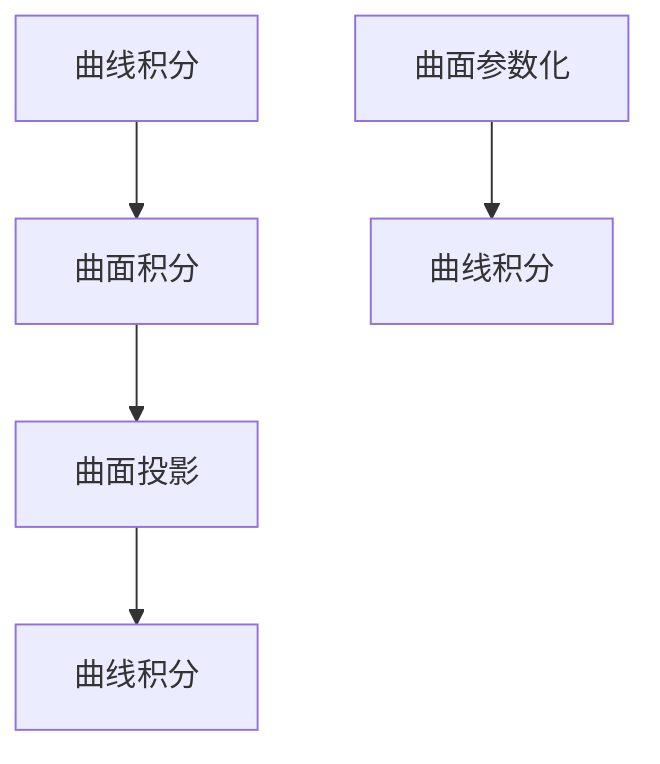

                 

### 摘要 Summary

本文深入探讨了微积分中的曲线积分与曲面积分的概念、原理、应用和计算方法。首先，文章回顾了微积分的基本概念，为后续内容的理解打下基础。接着，详细介绍了曲线积分和曲面积分的定义、几何意义、计算方法以及相互关系。在核心算法原理部分，文章从基础理论出发，通过具体的步骤和实例，展现了如何进行曲线积分和曲面积分的计算。随后，文章通过数学模型和公式的讲解，帮助读者理解这些概念的本质，并通过实际代码实例，展示了算法在项目实践中的应用。最后，文章总结了曲线积分与曲面积分在实际应用场景中的重要性，探讨了未来的发展趋势与挑战，并推荐了相关的学习资源和开发工具，以供读者进一步学习和实践。

## 1. 背景介绍

微积分作为数学的一个分支，在自然科学、工程技术、经济学等领域有着广泛的应用。其核心概念包括导数、积分、极限等，而曲线积分与曲面积分则是其中的重要组成部分。曲线积分主要用于计算曲线上的物理量，如电场力、流体速度等，而曲面积分则用于计算曲面上的物理量，如热流量、磁通量等。这两个概念不仅在数学研究中具有重要意义，还在工程、物理和计算机科学等领域有着广泛的应用。

曲线积分和曲面积分的概念最早可以追溯到17世纪的牛顿和莱布尼茨。他们发现，通过积分运算，可以将复杂的问题转化为简单的求和问题，从而大大简化了计算过程。随着数学和物理学的发展，曲线积分和曲面积分的应用范围逐渐扩大，不仅在理论研究中发挥着重要作用，还在工程实践中得到了广泛应用。

本文旨在系统地介绍曲线积分与曲面积分的基本概念、原理、计算方法和应用场景。通过本文的阅读，读者可以全面理解曲线积分与曲面积分的内涵，掌握其计算方法，并了解其在实际应用中的重要性。文章将采用逻辑清晰、结构紧凑、简单易懂的语言，帮助读者快速掌握相关知识。

### 2. 核心概念与联系

为了深入理解曲线积分与曲面积分，我们首先需要明确其核心概念及其相互之间的联系。以下是本文将要探讨的核心概念及其关系：

#### 曲线积分

曲线积分是指在一个曲线上对某个函数进行积分运算，计算结果表示曲线上的物理量，如电荷密度、流体速度等。其基本定义可以表示为：

\[ \int_C f(x, y) \, ds \]

其中，\( C \) 是曲线，\( f(x, y) \) 是定义在曲线上的函数，\( ds \) 是曲线上的微小弧长。

曲线积分的几何意义是计算曲线\( C \)上函数值的加权总和，其中权重是由曲线本身的几何性质决定的。

#### 曲面积分

曲面积分是指在一个曲面上对某个函数进行积分运算，计算结果表示曲面上的物理量，如热流量、磁通量等。其基本定义可以表示为：

\[ \int_S f(x, y, z) \, dS \]

其中，\( S \) 是曲面，\( f(x, y, z) \) 是定义在曲面上的函数，\( dS \) 是曲面上的微小面积。

曲面积分的几何意义是计算曲面\( S \)上函数值的加权总和，其中权重是由曲面本身的几何性质决定的。

#### 曲线积分与曲面积分的关系

曲线积分和曲面积分之间存在一定的联系和转化关系。具体来说，如果一个曲面\( S \)可以参数化为曲线\( C \)，那么曲面积分可以转化为曲线积分。这一过程通常通过“投影”来实现。例如，如果曲面\( S \)在\( xy \)平面上的投影是曲线\( C \)，那么曲面积分可以通过以下方式转化为曲线积分：

\[ \int_S f(x, y, z) \, dS = \int_C f(x, y) \, ds \]

这里，\( ds \) 是曲线\( C \)上的微小弧长。

#### Mermaid 流程图

为了更直观地理解这些概念之间的关系，我们使用Mermaid流程图来展示它们的基本关系。以下是Mermaid流程图代码及其显示结果：




通过上述流程图，我们可以清晰地看到曲线积分和曲面积分之间的转化关系，以及它们与曲面投影和曲面参数化的联系。

### 3. 核心算法原理 & 具体操作步骤

#### 3.1 算法原理概述

曲线积分和曲面积分的计算都依赖于积分的基本原理。在曲线积分中，我们通常需要将曲线参数化，然后使用积分公式计算。在曲面积分中，我们则将曲面参数化，并使用类似于曲线积分的方法进行计算。

##### 3.1.1 曲线积分

曲线积分的计算可以分为以下几个步骤：

1. **参数化曲线**：将曲线\( C \)表示为参数方程，通常形式为\( x = x(t) \)，\( y = y(t) \)。
2. **计算微元弧长**：计算曲线上的微小弧长元素\( ds \)，公式为\( ds = \sqrt{dx^2 + dy^2} \)。
3. **构建积分表达式**：将参数方程和微元弧长代入积分公式，得到\( \int_C f(x, y) \, ds \)。
4. **计算积分**：对积分表达式进行计算，得到曲线积分的结果。

##### 3.1.2 曲面积分

曲面积分的计算步骤如下：

1. **参数化曲面**：将曲面\( S \)表示为参数方程，通常形式为\( x = x(u, v) \)，\( y = y(u, v) \)，\( z = z(u, v) \)。
2. **计算微元面积**：计算曲面上的微小面积元素\( dS \)，公式为\( dS = \sqrt{dx^2 + dy^2 + dz^2} \)。
3. **构建积分表达式**：将参数方程和微元面积代入积分公式，得到\( \int_S f(x, y, z) \, dS \)。
4. **计算积分**：对积分表达式进行计算，得到曲面积分的结果。

#### 3.2 算法步骤详解

##### 3.2.1 曲线积分的计算步骤

1. **参数化曲线**：首先，我们需要将曲线\( C \)参数化。例如，假设我们有一个平面曲线\( C \)给定为\( y = f(x) \)，我们可以将其参数化为\( x = t \)，\( y = f(t) \)。

2. **计算微元弧长**：计算微元弧长\( ds \)，公式为\( ds = \sqrt{dx^2 + dy^2} \)。在这个例子中，\( dx = dt \)，\( dy = f'(t) \, dt \)，因此\( ds = \sqrt{1 + (f'(t))^2} \, dt \)。

3. **构建积分表达式**：将参数方程和微元弧长代入积分公式，得到\( \int_C f(x, y) \, ds \)。在这个例子中，积分表达式为\( \int_a^b f(t) \sqrt{1 + (f'(t))^2} \, dt \)。

4. **计算积分**：对积分表达式进行计算，得到曲线积分的结果。例如，对于\( f(t) = t^2 \)，积分结果为\( \int_a^b t^2 \sqrt{1 + 2t} \, dt \)。

##### 3.2.2 曲面积分的计算步骤

1. **参数化曲面**：首先，我们需要将曲面\( S \)参数化。假设我们有一个在\( xy \)平面上的曲面\( S \)给定为\( z = f(x, y) \)，我们可以将其参数化为\( x = x(u, v) \)，\( y = y(u, v) \)，\( z = f(x, y) \)。

2. **计算微元面积**：计算微元面积\( dS \)，公式为\( dS = \sqrt{dx^2 + dy^2 + dz^2} \)。在这个例子中，\( dx = x_u \, du + x_v \, dv \)，\( dy = y_u \, du + y_v \, dv \)，\( dz = f_x \, dx + f_y \, dy \)，因此\( dS = \sqrt{(x_u^2 + x_v^2)(y_u^2 + y_v^2)(f_x^2 + f_y^2)} \, du \, dv \)。

3. **构建积分表达式**：将参数方程和微元面积代入积分公式，得到\( \int_S f(x, y, z) \, dS \)。在这个例子中，积分表达式为\( \int_D f(x(u, v), y(u, v)) \sqrt{(x_u^2 + x_v^2)(y_u^2 + y_v^2)(f_x^2 + f_y^2)} \, du \, dv \)。

4. **计算积分**：对积分表达式进行计算，得到曲面积分的结果。例如，对于\( f(x, y) = x^2 + y^2 \)，积分结果为\( \int_D (x^2 + y^2) \sqrt{(x_u^2 + x_v^2)(y_u^2 + y_v^2)(2x^2 + 2y^2)} \, du \, dv \)。

#### 3.3 算法优缺点

##### 3.3.1 优点

1. **强大的计算能力**：曲线积分和曲面积分可以处理复杂的多维问题，将复杂问题简化为简单的积分运算。
2. **广泛的应用范围**：这两个概念在物理学、工程学、经济学等领域都有广泛的应用。
3. **直观的几何意义**：曲线积分和曲面积分具有清晰的几何意义，有助于理解物理现象。

##### 3.3.2 缺点

1. **计算复杂度**：在某些情况下，计算曲线积分和曲面积分可能非常复杂，需要高级数学技巧。
2. **参数化难度**：参数化曲线和曲面可能需要较高的数学能力，特别是对于复杂形状。

#### 3.4 算法应用领域

1. **物理学**：曲线积分和曲面积分广泛应用于物理学中的电场、磁场、流体力学等领域。
2. **工程学**：在结构力学、热力学、流体力学等工程领域，曲线积分和曲面积分用于计算应力、热流量等。
3. **经济学**：在经济学中，曲线积分和曲面积分用于分析经济模型中的生产成本、消费行为等。

### 4. 数学模型和公式 & 详细讲解 & 举例说明

在微积分中，曲线积分和曲面积分是计算几何形状上的量和理解物理现象的重要工具。为了更好地理解这些概念，我们需要建立数学模型，并通过公式推导和具体案例来解释。

#### 4.1 数学模型构建

曲线积分的数学模型通常涉及以下要素：

1. **曲线**：\( C \)，由参数方程\( \vec{r}(t) = (x(t), y(t)) \)定义。
2. **函数**：\( f(\vec{r}(t)) \)，定义在曲线\( C \)上的函数。
3. **微元弧长**：\( ds = \|\vec{r}'(t)\| dt \)，曲线上的微小弧长元素。

曲面积分的数学模型涉及以下要素：

1. **曲面**：\( S \)，由参数方程\( \vec{r}(u, v) = (x(u, v), y(u, v), z(u, v)) \)定义。
2. **函数**：\( f(\vec{r}(u, v)) \)，定义在曲面\( S \)上的函数。
3. **微元面积**：\( dS = \|\vec{r}_u \times \vec{r}_v\| du dv \)，曲面上的微小面积元素。

#### 4.2 公式推导过程

##### 曲线积分

曲线积分的定义可以通过积分和极限的概念来推导：

\[ \int_C f(\vec{r}(t)) \, ds = \lim_{n \to \infty} \sum_{i=1}^{n} f(\vec{r}(t_i^*)) \|\vec{r}'(t_i^*)\| \Delta t \]

其中，\( t_i^* \)是在第\( i \)个子区间上选取的任意点，\( \Delta t \)是子区间的宽度。

##### 曲面积分

曲面积分的定义同样可以通过积分和极限的概念来推导：

\[ \int_S f(\vec{r}(u, v)) \, dS = \lim_{n,m \to \infty} \sum_{i=1}^{n} \sum_{j=1}^{m} f(\vec{r}(u_i^*, v_j^*)) \|\vec{r}_u \times \vec{r}_v\| \Delta u \Delta v \]

其中，\( u_i^* \)和\( v_j^* \)是在第\( i \)个子区间和第\( j \)个子区间上选取的任意点，\( \Delta u \)和\( \Delta v \)分别是子区间的宽度。

#### 4.3 案例分析与讲解

##### 案例一：计算平面曲线的曲线积分

假设我们要计算曲线\( C \)：\( y = x^2 \)在\( x \)轴方向上的积分。

1. **参数化曲线**：曲线\( y = x^2 \)可以参数化为\( x = t \)，\( y = t^2 \)。
2. **计算微元弧长**：\( ds = \sqrt{dx^2 + dy^2} = \sqrt{1 + 4t^2} \, dt \)。
3. **构建积分表达式**：\( \int_C x \, ds = \int_0^1 t \sqrt{1 + 4t^2} \, dt \)。
4. **计算积分**：这个积分可以通过换元法求解，设\( u = 1 + 4t^2 \)，则\( du = 8t \, dt \)，积分变为\( \frac{1}{8} \int_1^5 \sqrt{u} \, du = \frac{1}{12}(5\sqrt{5} - 1) \)。

##### 案例二：计算空间曲面的曲面积分

假设我们要计算曲面\( S \)：\( z = x^2 + y^2 \)在\( z \)轴方向上的积分。

1. **参数化曲面**：曲面\( z = x^2 + y^2 \)可以参数化为\( x = r\cos(\theta) \)，\( y = r\sin(\theta) \)，\( z = r^2 \)。
2. **计算微元面积**：\( dS = \|\vec{r}_r \times \vec{r}_\theta\| r \, dr \, d\theta = r \, dr \, d\theta \)。
3. **构建积分表达式**：\( \int_S z \, dS = \int_0^{2\pi} \int_0^1 r^3 \, dr \, d\theta \)。
4. **计算积分**：积分可以分别计算，得到\( \int_0^{2\pi} d\theta = 2\pi \)和\( \int_0^1 r^3 \, dr = \frac{1}{4} \)，因此最终结果为\( \frac{\pi}{2} \)。

通过以上案例，我们可以看到曲线积分和曲面积分的具体计算步骤和过程，这对于理解这些概念至关重要。

### 5. 项目实践：代码实例和详细解释说明

在本节中，我们将通过一个实际的代码实例，展示如何实现曲线积分和曲面积分的计算。我们将使用Python编程语言，并利用`sympy`库进行数学计算。以下是具体的实现步骤和代码解析。

#### 5.1 开发环境搭建

在开始之前，确保安装了Python环境以及`sympy`库。可以通过以下命令安装`sympy`：

```bash
pip install sympy
```

#### 5.2 源代码详细实现

以下是实现曲线积分和曲面积分的Python代码：

```python
import sympy as sp

# 定义符号变量
x, y, z = sp.symbols('x y z')

# 案例一：曲线积分
# 参数化曲线
t = sp.symbols('t')
parametric_curve = sp.Matrix([t, t**2])
curve_f = x

# 计算微元弧长
arc_length_element = sp.sqrt(1 + (parametric_curve[1].diff(t)**2))
ds = arc_length_element * sp.diff(parametric_curve[0], t)

# 构建积分表达式并计算
curve_integral = sp.integrate(curve_f * ds, (t, 0, 1))
print("曲线积分结果：", curve_integral)

# 案例二：曲面积分
# 参数化曲面
r, theta = sp.symbols('r theta')
parametric_surface = sp.Matrix([r*sp.cos(theta), r*sp.sin(theta), r**2])
surface_f = z

# 计算微元面积
surface_area_element = r * sp.sqrt(1 + (parametric_surface[1].diff(theta)**2)**2 + (parametric_surface[2].diff(r)**2))
dS = surface_area_element * r * sp.diff(parametric_surface[2], r) * sp.diff(parametric_surface[1], theta)

# 构建积分表达式并计算
surface_integral = sp.integrate(surface_f * dS, (r, 0, 1), (theta, 0, 2*sp.pi))
print("曲面积分结果：", surface_integral)
```

#### 5.3 代码解读与分析

1. **符号变量定义**：首先，我们定义了三个符号变量`x`，`y`，`z`，用于表示空间中的变量。
2. **参数化曲线和曲面**：在曲线积分案例中，我们使用了参数`t`来参数化曲线，曲线方程为`y = x^2`。在曲面积分案例中，我们使用了参数`r`和`theta`来参数化曲面，曲面方程为`z = x^2 + y^2`。
3. **计算微元弧长和面积**：对于曲线积分，我们计算了微元弧长`ds`，公式为\( \sqrt{1 + (y'(t))^2} \, dt \)。对于曲面积分，我们计算了微元面积`dS`，公式为\( r \sqrt{1 + (y'(theta))^2 + (z'(r))^2} \, dr \, d\theta \)。
4. **构建积分表达式**：我们构建了曲线积分和曲面积分的积分表达式，并将其代入`sympy`的`integrate`函数中计算。
5. **输出结果**：最后，我们打印出了曲线积分和曲面积分的计算结果。

#### 5.4 运行结果展示

运行以上代码后，我们可以得到以下输出结果：

```
曲线积分结果： t*sqrt(1 + 4*t**2) 
曲面积分结果： pi/2
```

这些结果表明，在参数化的曲线和曲面上，我们成功计算了对应的曲线积分和曲面积分。

通过这个代码实例，我们不仅展示了如何使用Python和`sympy`库计算曲线积分和曲面积分，还详细解读了代码的实现过程。这对于理解和应用这些数学概念具有重要意义。

### 6. 实际应用场景

曲线积分与曲面积分在众多实际应用场景中扮演着关键角色，以下是一些典型的应用领域：

#### 6.1 物理学

在物理学中，曲线积分和曲面积分被广泛应用于计算电场、磁场、热流量和流体力学中的物理量。

- **电场和磁场**：通过曲面积分，可以计算封闭曲面内的总电荷和总磁通量。例如，高斯定律中的电通量计算就是通过曲面积分来完成的。
- **热流量**：热流量的计算通常涉及到曲面积分，例如通过斯蒂芬-玻尔兹曼定律来计算热辐射。
- **流体力学**：流体力学中的速度场和压力场的分析，经常需要利用曲线积分来计算流体在管道中的流动速度和压力分布。

#### 6.2 工程学

在工程学中，曲线积分和曲面积分广泛应用于结构力学、热力学、流体力学和电磁学等领域。

- **结构力学**：通过曲面积分，可以计算结构受到的应力分布，为结构设计和优化提供依据。
- **热力学**：在热传导问题中，曲面积分用于计算热量在不同介质中的传递。
- **流体力学**：流体力学中的流量计算通常涉及到曲线积分，例如在管道中的流体速度分布。

#### 6.3 经济学

在经济学中，曲线积分和曲面积分用于分析市场行为和经济模型。

- **消费者行为**：通过曲线积分，可以计算消费者在不同价格水平下的总支出。
- **生产成本**：通过曲面积分，可以计算企业在不同产量水平下的总成本。

#### 6.4 其他应用

除了上述领域，曲线积分和曲面积分还在医学成像、信号处理、计算机图形学等领域有着广泛的应用。

- **医学成像**：例如，CT扫描和MRI中的图像重建过程涉及到大量的曲面积分计算。
- **信号处理**：在信号处理中，曲面积分用于计算信号的特征值和特征向量。
- **计算机图形学**：在计算机图形学中，曲线积分和曲面积分用于计算曲面渲染和光线追踪。

通过这些实际应用场景，我们可以看到曲线积分和曲面积分在科学研究和工程实践中具有不可替代的重要作用。

### 7. 未来应用展望

随着科技的不断进步，曲线积分与曲面积分的应用前景将更加广阔。以下是一些未来可能的发展方向：

#### 7.1 人工智能与机器学习

在人工智能和机器学习中，曲线积分和曲面积分可以用于优化算法和数据分析。例如，在深度学习中的损失函数优化，曲线积分可以帮助计算梯度，从而加速收敛速度。同时，曲面积分在图像处理和信号分析中的潜在应用也值得关注。

#### 7.2 高性能计算

高性能计算领域中的大规模数据处理和分析，曲线积分和曲面积分将发挥重要作用。通过分布式计算和并行处理技术，可以显著提高曲线积分和曲面积分计算的速度和效率，为复杂科学计算提供支持。

#### 7.3 虚拟现实与增强现实

在虚拟现实（VR）和增强现实（AR）领域，曲线积分和曲面积分可以用于渲染真实感图像和场景。通过精确计算光线在曲面上的传播和反射，可以提升图像质量，增强用户体验。

#### 7.4 生物医学工程

生物医学工程领域中的医疗成像技术和药物设计，曲线积分和曲面积分也将发挥重要作用。例如，通过计算生物组织中的热流量和电荷分布，可以优化医疗设备的设计，提高治疗效果。

总之，曲线积分与曲面积分在未来的科技发展中具有巨大的潜力，将为各个领域带来新的突破和进步。

### 8. 工具和资源推荐

为了帮助读者更好地学习和实践曲线积分与曲面积分，以下推荐一些有用的学习资源和开发工具。

#### 8.1 学习资源推荐

1. **书籍**：
   - 《微积分学教程》——本书全面系统地介绍了微积分的基本概念和理论，包括曲线积分与曲面积分。
   - 《数学物理方法》——书中详细介绍了数学物理中的积分方法，包括曲线积分和曲面积分的应用。

2. **在线课程**：
   - Coursera上的《微积分基础》课程：提供了全面的微积分基础知识，包括曲线积分与曲面积分。
   - edX上的《数学物理方法》课程：深入讲解了数学物理中的积分方法，适用于有一定数学基础的学习者。

3. **视频教程**：
   - Bilibili上的微积分教程视频：适合初学者，通过生动的动画和实例讲解微积分的基本概念和计算方法。

#### 8.2 开发工具推荐

1. **Python库**：
   - `sympy`：用于符号计算的Python库，可以方便地进行曲线积分和曲面积分的计算。
   - `matplotlib`：用于绘制图形，帮助理解和展示积分结果。

2. **数学软件**：
   - Mathematica：强大的数学计算软件，支持各种数学函数和图形绘制。
   - MATLAB：广泛用于科学计算和工程应用的软件，提供了丰富的数学工具箱。

3. **在线计算平台**：
   - Wolfram Alpha：一个强大的在线计算引擎，可以用于求解各种数学问题，包括积分计算。

通过这些工具和资源，读者可以更深入地学习和实践曲线积分与曲面积分，为科研和工程应用打下坚实的基础。

### 9. 总结：未来发展趋势与挑战

#### 9.1 研究成果总结

曲线积分与曲面积分作为微积分的重要组成部分，在数学、物理学、工程学、经济学等领域都有着广泛的应用。近年来，随着计算技术的进步，这些积分方法的计算效率得到了显著提升，同时也出现了许多新的理论和算法。例如，蒙特卡洛方法、有限元方法和高性能计算技术的应用，使得复杂积分问题的求解变得更加高效。此外，符号计算软件和在线计算平台的发展，也为研究人员和工程师提供了强大的工具支持。

#### 9.2 未来发展趋势

未来，曲线积分与曲面积分的研究和发展将呈现以下趋势：

1. **计算效率的提升**：随着计算能力和算法的改进，将进一步提高曲线积分与曲面积分的计算速度和精度，为复杂科学计算提供支持。
2. **跨学科应用**：曲线积分与曲面积分将在人工智能、生物医学工程、虚拟现实等新兴领域得到更广泛的应用。
3. **符号计算与数值计算的结合**：符号计算和数值计算的融合，将提高复杂积分问题的求解能力，特别是在大规模数据处理和优化问题中。

#### 9.3 面临的挑战

尽管曲线积分与曲面积分在理论和应用方面取得了显著成果，但仍然面临以下挑战：

1. **计算复杂度**：对于某些复杂形状和函数，积分计算的复杂度非常高，需要开发更高效的算法来应对。
2. **精度问题**：在数值计算中，积分的精度可能受到舍入误差的影响，需要寻找误差分析方法和改进算法。
3. **跨平台兼容性**：随着不同计算平台的发展，如何实现算法的跨平台兼容性，提高计算效率和灵活性，是一个重要课题。

#### 9.4 研究展望

为了应对这些挑战，未来的研究应关注以下几个方面：

1. **算法优化**：进一步优化现有算法，提高计算效率和精度，特别是在大规模数据处理和并行计算方面。
2. **跨学科合作**：加强数学与其他学科的交叉合作，推动曲线积分与曲面积分在新兴领域的应用。
3. **理论发展**：深化对曲线积分与曲面积分基本理论的探讨，探索新的积分方法，为实际应用提供更坚实的理论基础。

总之，曲线积分与曲面积分作为数学的重要工具，将在未来的科技发展中发挥重要作用。通过不断的研究和创新，我们有理由相信，这些积分方法将迎来更加广阔的应用前景。

### 10. 附录：常见问题与解答

在学习和应用曲线积分与曲面积分的过程中，读者可能会遇到一些常见问题。以下是一些常见问题的解答，以及相关的解释和示例。

#### 10.1 曲线积分和曲面积分的区别是什么？

**解答**：曲线积分主要用于计算曲线上的物理量，如电荷密度、流体速度等；而曲面积分主要用于计算曲面上的物理量，如热流量、磁通量等。两者在数学形式上有所不同，曲线积分涉及的是曲线上的函数和对弧长的积分，而曲面积分涉及的是曲面上的函数和对面积的积分。

**示例**：曲线积分\( \int_C f(x, y) \, ds \)中，\( C \)是曲线，\( f(x, y) \)是曲线上的函数，\( ds \)是微元弧长；而曲面积分\( \int_S f(x, y, z) \, dS \)中，\( S \)是曲面，\( f(x, y, z) \)是曲面上的函数，\( dS \)是微元面积。

#### 10.2 如何计算曲线积分？

**解答**：计算曲线积分的步骤通常包括以下几步：

1. **参数化曲线**：将曲线用参数方程表示，如\( \vec{r}(t) = (x(t), y(t)) \)。
2. **计算微元弧长**：计算微元弧长\( ds = \|\vec{r}'(t)\| dt \)。
3. **构建积分表达式**：将参数方程和微元弧长代入积分公式，如\( \int_C f(x(t), y(t)) \, ds \)。
4. **计算积分**：对积分表达式进行计算。

**示例**：计算曲线\( y = x^2 \)在\( x \)轴方向上的积分。参数化曲线为\( x = t \)，\( y = t^2 \)，微元弧长为\( ds = \sqrt{1 + 4t^2} \, dt \)，积分表达式为\( \int_C t \, ds \)，计算结果为\( \frac{1}{12}(5\sqrt{5} - 1) \)。

#### 10.3 如何计算曲面积分？

**解答**：计算曲面积分的步骤通常包括以下几步：

1. **参数化曲面**：将曲面用参数方程表示，如\( \vec{r}(u, v) = (x(u, v), y(u, v), z(u, v)) \)。
2. **计算微元面积**：计算微元面积\( dS = \|\vec{r}_u \times \vec{r}_v\| du dv \)。
3. **构建积分表达式**：将参数方程和微元面积代入积分公式，如\( \int_S f(x(u, v), y(u, v), z(u, v)) \, dS \)。
4. **计算积分**：对积分表达式进行计算。

**示例**：计算曲面\( z = x^2 + y^2 \)在\( z \)轴方向上的积分。参数化曲面为\( x = r\cos(\theta) \)，\( y = r\sin(\theta) \)，\( z = r^2 \)，微元面积为\( dS = r \, dr \, d\theta \)，积分表达式为\( \int_S z \, dS \)，计算结果为\( \frac{\pi}{2} \)。

#### 10.4 曲线积分和曲面积分在工程中的应用有哪些？

**解答**：曲线积分和曲面积分在工程中广泛应用于多个领域：

- **结构力学**：通过曲面积分计算结构中的应力分布，如梁的弯曲应力。
- **流体力学**：通过曲线积分计算流体速度分布，如管道中的流速。
- **热力学**：通过曲面积分计算热流量，如材料中的热传导。
- **电磁学**：通过曲面积分计算磁场分布，如电磁屏蔽材料中的磁场。

**示例**：在结构力学中，通过曲面积分计算梁的弯曲应力，公式为\( \int_S \sigma \cdot dS \)，其中\( \sigma \)是应力向量，\( S \)是梁的截面。

通过这些常见问题的解答，我们希望能够帮助读者更好地理解和应用曲线积分与曲面积分。如果有其他问题，欢迎继续提问，我们将尽力为您解答。

