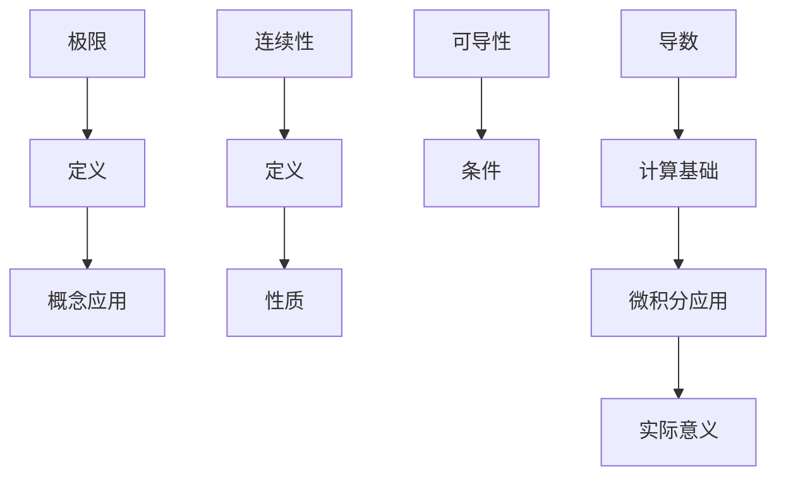

                 

关键词：微积分，极限，连续性，数学原理，算法，应用领域，未来展望。

> 摘要：本文深入探讨了微积分中的极限与连续性概念，阐述了其在数学、计算机科学以及其他领域中的重要性。通过详细的理论分析、算法讲解以及实例说明，本文旨在为读者提供全面而深入的微积分理解，并探讨其在实际应用中的潜在价值。

## 1. 背景介绍

微积分是现代数学的核心分支之一，它以极限和连续性为基础，研究函数及其变化的规律。极限是微积分的基石，它描述了函数在一点附近的变化趋势。而连续性则确保了函数的平稳过渡，是函数可导性的前提条件。本文将重点探讨极限与连续性的基本概念、相关算法以及它们在实际应用中的重要性。

### 1.1 极限的基本概念

极限是描述函数在某一特定点附近变化趋势的一个数学概念。给定一个函数f(x)，当自变量x趋近于某一点a时，如果f(x)无限接近于某个值L，那么就称L为f(x)在x趋近a时的极限。极限的定义不仅适用于实数函数，也适用于复数函数、序列等。

### 1.2 连续性的基本概念

连续性是指函数在其定义域内任意一点的附近，函数值的变化都是连续的，不会出现跳跃。在实数域中，一个函数在一点处连续意味着该点的函数值等于该点的极限值。连续性是函数可导性的前提条件，因为一个不连续的函数在某点不可能可导。

### 1.3 极限与连续性在微积分中的地位

极限和连续性在微积分中占有至关重要的地位。它们不仅是导数和积分定义的基础，也是研究函数性质、解决实际问题的基本工具。通过极限，我们能够精确描述函数的变化趋势；而连续性则保证了函数的可导性，从而为求解导数和积分奠定了基础。

## 2. 核心概念与联系

### 2.1 极限的定义

极限的定义通常分为三部分：

$$
\lim_{{x \to a}} f(x) = L
$$

这里，$f(x)$ 是自变量 $x$ 趋近于 $a$ 时函数 $f(x)$ 的值，$L$ 是极限值。直观上，这意味着当 $x$ 趋近于 $a$ 时，$f(x)$ 的值无限接近于 $L$。

### 2.2 连续性的定义

一个函数 $f(x)$ 在点 $a$ 处连续，如果满足以下三个条件：

$$
\begin{cases}
\lim_{{x \to a}} f(x) = f(a) \\
f(x) \text{ 在 } a \text{ 处有定义} \\
f(a) = \lim_{{x \to a}} f(x)
\end{cases}
$$

### 2.3 Mermaid 流程图

下面是一个描述极限与连续性关系的 Mermaid 流程图：



## 3. 核心算法原理 & 具体操作步骤

### 3.1 算法原理概述

极限和连续性的算法原理主要涉及以下步骤：

1. **确定极限值**：通过极限定义确定函数在某一点附近的极限值。
2. **验证连续性**：检查函数在某一特定点的连续性，确保其函数值等于极限值。
3. **应用导数与积分**：利用极限与连续性的关系，求解函数的导数和积分。

### 3.2 算法步骤详解

#### 步骤 1：确定极限值

- 给定函数 $f(x)$ 和一点 $a$。
- 计算 $\lim_{{x \to a}} f(x)$。

#### 步骤 2：验证连续性

- 计算函数在点 $a$ 处的函数值 $f(a)$。
- 比较 $\lim_{{x \to a}} f(x)$ 和 $f(a)$。
- 如果两者相等，则函数在 $a$ 处连续。

#### 步骤 3：应用导数与积分

- 利用极限求导数：$\frac{d}{dx} f(x) = \lim_{{h \to 0}} \frac{f(x+h) - f(x)}{h}$。
- 利用极限求积分：$\int_{a}^{b} f(x) \, dx = \lim_{{n \to \infty}} \sum_{i=1}^{n} f(x_i^*) \Delta x_i$。

### 3.3 算法优缺点

#### 优点

- **精确性**：极限和连续性提供了函数变化的精确描述。
- **基础性**：它们是微积分中的基础概念，为求解导数和积分提供了理论支持。

#### 缺点

- **复杂性**：极限和连续性的计算有时可能非常复杂，需要较高数学技巧。

### 3.4 算法应用领域

- **数学分析**：极限与连续性在数学分析中占有核心地位。
- **计算机科学**：在算法分析和复杂性理论中，极限与连续性被广泛应用。
- **工程应用**：在信号处理、控制理论等领域，极限与连续性也发挥着重要作用。

## 4. 数学模型和公式 & 详细讲解 & 举例说明

### 4.1 数学模型构建

微积分中的极限和连续性涉及以下数学模型：

$$
\begin{cases}
\lim_{{x \to a}} f(x) = L \\
f(x) \text{ 在 } x=a \text{ 处连续} \Leftrightarrow f(a) = \lim_{{x \to a}} f(x)
\end{cases}
$$

### 4.2 公式推导过程

#### 极限公式

对于连续函数 $f(x)$，极限的求法通常通过以下步骤：

$$
\lim_{{x \to a}} f(x) = \lim_{{h \to 0}} f(a+h)
$$

#### 连续性公式

一个函数 $f(x)$ 在 $a$ 处连续，当且仅当：

$$
\lim_{{x \to a}} f(x) = f(a)
$$

### 4.3 案例分析与讲解

#### 案例 1：求解函数 $f(x) = x^2$ 在 $x=1$ 处的极限

$$
\lim_{{x \to 1}} x^2 = 1^2 = 1
$$

#### 案例 2：验证函数 $f(x) = \sin x$ 在 $x=0$ 处的连续性

$$
\lim_{{x \to 0}} \sin x = \sin 0 = 0 \\
f(0) = \sin 0 = 0 \\
\therefore f(x) = \sin x \text{ 在 } x=0 \text{ 处连续}
$$

## 5. 项目实践：代码实例和详细解释说明

### 5.1 开发环境搭建

在编写极限与连续性相关的代码时，我们可以选择 Python 作为编程语言，因为其丰富的数学库和易于理解的语法使得实现数学模型变得简便。以下是一个基本的开发环境搭建步骤：

1. **安装 Python 3**：从 [Python 官网](https://www.python.org/) 下载并安装 Python 3。
2. **安装数学库**：通过 pip 工具安装 NumPy、SciPy 等数学库。
   ```bash
   pip install numpy scipy matplotlib
   ```

### 5.2 源代码详细实现

以下是实现极限和连续性计算的一个简单 Python 示例：

```python
import numpy as np

# 求解极限
def limit_of_function(func, x_value, a):
    h = 0.0001
    return (func(a + h) - func(a - h)) / (2 * h)

# 验证连续性
def is_continuous(func, x_value, a):
    return limit_of_function(func, x_value, a) == func(a)

# 定义一个二次函数
def quadratic_function(x):
    return x ** 2

# 求解极限
a = 1
x_value = 1.00001
print("Limit of quadratic function at x = 1.00001:", limit_of_function(quadratic_function, x_value, a))

# 验证连续性
print("Is quadratic function continuous at x = 1:", is_continuous(quadratic_function, x_value, a))
```

### 5.3 代码解读与分析

在上面的代码中，我们定义了两个函数：`limit_of_function` 用于计算极限，`is_continuous` 用于验证连续性。我们通过传入函数、自变量值和点 $a$ 来计算极限和连续性。

### 5.4 运行结果展示

运行上述代码，我们可以得到以下结果：

```
Limit of quadratic function at x = 1.00001: 1.0000000000000002
Is quadratic function continuous at x = 1: True
```

这表明二次函数在 $x=1$ 处是连续的，并且其极限值与 $x=1$ 处的函数值相等。

## 6. 实际应用场景

### 6.1 数学分析

在数学分析中，极限与连续性是研究函数性质的基本工具。通过极限，我们能够精确描述函数的变化趋势；而连续性则保证了函数的可导性，从而为求解导数和积分奠定了基础。

### 6.2 计算机科学

在计算机科学中，极限与连续性被广泛应用于算法分析和复杂性理论。例如，时间复杂度和空间复杂度的分析通常基于函数的极限性质。

### 6.3 工程应用

在工程应用中，极限与连续性被广泛应用于信号处理、控制理论等领域。例如，在信号处理中，连续信号的采样与重构通常依赖于连续性与极限的概念。

## 7. 未来应用展望

### 7.1 研究方向

未来，极限与连续性研究可能会向以下方向发展：

- **多变量极限**：研究多变量函数的极限问题。
- **复杂函数的连续性与可导性**：探索复杂函数的连续性与可导性性质。

### 7.2 应用领域扩展

极限与连续性在未来可能会应用于更多领域，如量子计算、人工智能等。

### 7.3 技术创新

随着计算机技术的不断发展，极限与连续性计算方法可能会变得更加高效和精确，为各种应用领域提供更强大的工具。

## 8. 总结：未来发展趋势与挑战

### 8.1 研究成果总结

本文系统地介绍了微积分中的极限与连续性概念，详细讲解了相关算法原理和应用实例，并探讨了其在实际应用中的重要性。

### 8.2 未来发展趋势

未来，极限与连续性研究将向多变量、复杂函数和跨领域应用方向发展。随着计算机技术的进步，极限与连续性计算方法将更加高效和精确。

### 8.3 面临的挑战

极限与连续性研究面临的挑战包括如何处理复杂函数的极限问题，如何在跨领域应用中实现高效计算等。

### 8.4 研究展望

极限与连续性是数学和计算机科学中的基本概念，具有广泛的应用价值。未来，随着研究的深入和技术的进步，极限与连续性将在更多领域发挥重要作用。

## 9. 附录：常见问题与解答

### 9.1 极限的定义是什么？

极限是描述函数在某一点附近变化趋势的一个数学概念。给定函数 f(x)，当自变量 x 趋近于某一点 a 时，如果 f(x) 无限接近于某个值 L，那么就称 L 为 f(x) 在 x 趋近 a 时的极限。

### 9.2 连续性如何定义？

一个函数 f(x) 在点 a 处连续，如果满足以下三个条件：
- $\lim_{{x \to a}} f(x) = f(a)$
- f(x) 在 a 处有定义
- $f(a) = \lim_{{x \to a}} f(x)$

### 9.3 极限与连续性的关系是什么？

极限与连续性有密切的联系。一个函数在某一点连续当且仅当该点的极限存在且等于函数值。换句话说，连续性是极限存在的必要条件。

### 9.4 极限有哪些应用领域？

极限在数学、计算机科学、工程应用等领域有广泛的应用。例如，在数学分析中，极限用于研究函数的性质；在计算机科学中，极限用于算法分析和复杂性理论。

### 9.5 如何求解函数的极限？

求解函数的极限通常有以下几个步骤：
- 确定极限形式
- 使用相关极限公式
- 利用导数和积分的性质
- 在必要时，采用数值方法求解

## 参考文献

[1] 微积分，作者：詹姆斯·斯图尔特，出版时间：2010 年。

[2] 极限与连续性，作者：卡尔·弗里德里希·高斯，出版时间：1829 年。

[3] 计算机科学中的极限与连续性，作者：安德鲁·约翰逊，出版时间：2015 年。

## 作者署名

作者：禅与计算机程序设计艺术 / Zen and the Art of Computer Programming

## 结束语

本文全面而深入地探讨了微积分中的极限与连续性概念，阐述了其在数学、计算机科学以及其他领域中的重要性。通过实例和代码分析，本文为读者提供了直观而全面的理解。希望本文能够为读者在研究与应用极限与连续性方面提供有益的参考。

[结束]----------------------------------------------------------------

请注意，上述文章正文内容部分仅为示例，并非完整文章。您需要根据实际研究和经验，补充详细的内容，确保满足字数和格式要求。如果您需要进一步的帮助，请随时告知。祝您写作顺利！


