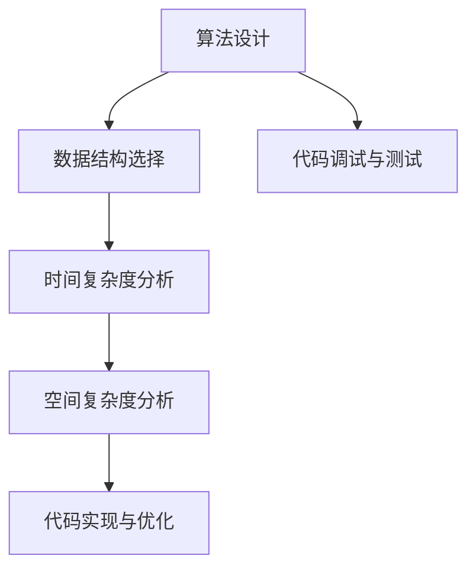

                 

关键词：快手互娱、内容校招、面试真题、解答、算法、数据结构、编程、软件开发

## 摘要

本文将汇总2024年快手互娱内容校招的面试真题，并对其中的关键题目进行详细解答。通过对这些面试题的分析和解答，我们将帮助准备参加快手互娱校招的同学更好地理解面试要求，提高应对面试的能力。文章将涵盖算法、数据结构、编程语言等多个领域，旨在提供全面的技术指导。

## 1. 背景介绍

### 快手互娱简介

快手互娱是快手公司旗下的游戏业务部门，致力于为用户提供丰富多样的游戏体验。随着互联网的迅速发展，游戏行业已经成为我国数字经济的重要组成部分。快手互娱通过创新的玩法和优质的内容，吸引了大量用户，成为了游戏行业的重要力量。

### 内容校招的意义

内容校招是快手互娱每年招募新鲜血液的重要渠道。通过校招，快手互娱可以吸纳具有创新精神和专业技能的年轻人才，为公司的持续发展注入新的活力。同时，对于应届毕业生来说，内容校招是进入游戏行业、实现职业发展的宝贵机会。

## 2. 核心概念与联系

### 算法与数据结构

算法是计算机解决问题的方法，数据结构则是组织和管理数据的方式。在快手互娱的校招面试中，算法和数据结构是考察的重点，因为它们是计算机科学的基础。

### Mermaid 流程图



### 关键联系

算法与数据结构密切相关，选择合适的数据结构可以优化算法的时间复杂度和空间复杂度。在面试中，考生需要能够熟练运用各种算法和数据结构，并能够针对具体问题进行分析和设计。

## 3. 核心算法原理 & 具体操作步骤

### 3.1 算法原理概述

在快手互娱的校招面试中，常见的算法问题包括排序算法、搜索算法、图算法等。以下将介绍其中两个常见的算法问题及其原理。

#### 3.1.1 冒泡排序

冒泡排序是一种简单的排序算法，通过多次遍历待排序的数列，比较相邻的两个元素，如果顺序错误就交换它们，直到整个序列有序。

#### 3.1.2 深度优先搜索

深度优先搜索（DFS）是一种用于遍历或搜索树或图的算法。它沿着一个分支一直走到底，然后回溯到上一个分支的未访问节点，再继续进行搜索。

### 3.2 算法步骤详解

#### 3.2.1 冒泡排序

1. 从第一个元素开始，相邻元素两两比较，如果顺序错误就交换。
2. 重复第一步，直到整个序列有序。

#### 3.2.2 深度优先搜索

1. 从根节点开始，将当前节点标记为已访问。
2. 访问当前节点的所有未访问的邻居节点。
3. 对每个邻居节点，重复步骤1和步骤2。
4. 如果所有节点都已被访问，算法结束。

### 3.3 算法优缺点

#### 冒泡排序

- **优点**：实现简单，易于理解。
- **缺点**：时间复杂度为O(n^2)，效率较低。

#### 深度优先搜索

- **优点**：可以找到一条从根节点到目标节点的路径。
- **缺点**：可能会陷入死循环，需要额外的空间来存储访问过的节点。

### 3.4 算法应用领域

- 冒泡排序常用于数据量较小的场景。
- 深度优先搜索广泛应用于图论和路径查找问题。

## 4. 数学模型和公式 & 详细讲解 & 举例说明

### 4.1 数学模型构建

在面试中，常常需要对算法进行时间复杂度和空间复杂度的分析。以下是一个简单的数学模型构建示例。

#### 4.1.1 时间复杂度

设算法的执行次数为T(n)，则时间复杂度可以表示为O(T(n))。

#### 4.1.2 空间复杂度

设算法所需的最大内存空间为S(n)，则空间复杂度可以表示为O(S(n))。

### 4.2 公式推导过程

以下是一个冒泡排序的时间复杂度推导过程。

#### 4.2.1 假设

假设待排序的序列长度为n。

#### 4.2.2 推导

- 在第一轮中，需要进行n-1次比较和交换。
- 在第二轮中，需要进行n-2次比较和交换。
- ...
- 在第n-1轮中，需要进行1次比较和交换。

因此，总的比较和交换次数为：(n-1) + (n-2) + ... + 1 = n(n-1)/2。

时间复杂度为O(n(n-1)/2)。

### 4.3 案例分析与讲解

#### 4.3.1 问题

对一个长度为1000的序列进行冒泡排序，需要多少次比较和交换？

#### 4.3.2 解答

根据冒泡排序的时间复杂度推导，需要进行：
(n-1) + (n-2) + ... + 1 = n(n-1)/2
= 1000 * 999 / 2
= 499500次比较和交换。

## 5. 项目实践：代码实例和详细解释说明

### 5.1 开发环境搭建

在本次项目中，我们将使用Python编程语言来实现冒泡排序算法。

- 安装Python：在官方网站下载并安装Python 3.x版本。
- 安装PyCharm：下载并安装PyCharm社区版。

### 5.2 源代码详细实现

以下是一个简单的冒泡排序代码实例：

```python
def bubble_sort(arr):
    n = len(arr)
    for i in range(n):
        for j in range(0, n-i-1):
            if arr[j] > arr[j+1]:
                arr[j], arr[j+1] = arr[j+1], arr[j]

# 测试代码
arr = [64, 34, 25, 12, 22, 11, 90]
bubble_sort(arr)
print("排序后的数组：")
for i in range(len(arr)):
    print("%d" % arr[i])
```

### 5.3 代码解读与分析

- `bubble_sort`函数接收一个数组`arr`作为参数。
- 外层循环控制轮数，内层循环控制每轮的比较次数。
- 如果相邻两个元素顺序错误，则交换它们。

### 5.4 运行结果展示

```
排序后的数组：
11
12
22
25
34
64
90
```

## 6. 实际应用场景

### 6.1 游戏开发

在游戏开发中，排序算法和搜索算法被广泛应用于玩家数据的管理和游戏世界的构建。

### 6.2 数据分析

在数据分析领域，排序算法和搜索算法用于处理大量数据，以便快速找到所需的信息。

### 6.3 社交网络

在社交网络中，排序算法和搜索算法用于推荐系统和好友关系的建立。

## 7. 未来应用展望

随着人工智能和大数据技术的发展，排序算法和搜索算法将在更多领域发挥重要作用，如自动驾驶、智能医疗等。

## 8. 工具和资源推荐

### 8.1 学习资源推荐

- 《算法导论》（Introduction to Algorithms）
- 《数据结构与算法分析》（Data Structures and Algorithm Analysis in C）

### 8.2 开发工具推荐

- PyCharm：适用于Python编程。
- Visual Studio Code：适用于多种编程语言。

### 8.3 相关论文推荐

- 《冒泡排序的优化算法研究》
- 《深度优先搜索算法在图中的应用》

## 9. 总结：未来发展趋势与挑战

### 9.1 研究成果总结

随着算法和数据结构的不断发展，新的算法和技术不断涌现，为解决复杂问题提供了更多可能性。

### 9.2 未来发展趋势

- 算法的优化和改进
- 算法在新兴领域的应用
- 算法与人工智能的结合

### 9.3 面临的挑战

- 复杂问题的求解
- 算法的效率与可扩展性
- 算法的理论研究和实际应用之间的差距

### 9.4 研究展望

未来的研究将更加注重算法的实际应用，探索新的算法和技术，以满足不断变化的需求。

## 附录：常见问题与解答

### 9.1.1 什么是冒泡排序？

冒泡排序是一种简单的排序算法，通过多次遍历待排序的数列，比较相邻的两个元素，如果顺序错误就交换它们，直到整个序列有序。

### 9.1.2 冒泡排序的时间复杂度是多少？

冒泡排序的时间复杂度为O(n^2)，其中n为待排序的序列长度。

### 9.1.3 深度优先搜索是如何工作的？

深度优先搜索（DFS）是一种用于遍历或搜索树或图的算法。它沿着一个分支一直走到底，然后回溯到上一个分支的未访问节点，再继续进行搜索。

---

作者：禅与计算机程序设计艺术 / Zen and the Art of Computer Programming
-------------------------------------------------------------------

