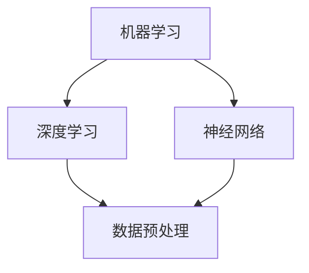

                 

 关键词：深度学习、人工智能、技术思考、原理剖析、应用实践、未来展望

> 摘要：本文将深入探讨人工智能领域的核心概念与原理，从逻辑清晰的技术角度分析核心算法，并通过数学模型和项目实例详细讲解。同时，本文还将探讨实际应用场景，为读者提供未来发展的趋势与挑战。

## 1. 背景介绍

### 1.1 人工智能的历史与发展

人工智能（AI）的概念起源于20世纪50年代。自那时以来，人工智能经历了数次的“AI寒冬”和“AI热潮”。每一次的发展都推动了技术的进步和应用的深化。

### 1.2 人工智能的分类与应用

人工智能可以分为两类：弱人工智能和强人工智能。弱人工智能专注于特定任务，如语音识别、图像识别等。强人工智能则具有人类智能的所有能力，能够进行推理、学习和决策。

### 1.3 人工智能的现状与挑战

目前，人工智能已经在许多领域取得了显著的成就，如医疗、金融、交通等。然而，人工智能的发展也面临着诸多挑战，包括数据隐私、算法公平性、伦理问题等。

## 2. 核心概念与联系

### 2.1 概念概述

人工智能的核心概念包括机器学习、深度学习、神经网络等。这些概念相互联系，共同构成了人工智能的技术基础。

### 2.2 Mermaid 流程图



### 2.3 核心概念解释

- **机器学习**：机器学习是通过算法让计算机从数据中学习规律，从而进行预测和决策。
- **深度学习**：深度学习是机器学习的一种，通过多层神经网络模型，实现对数据的复杂非线性建模。
- **神经网络**：神经网络是一种模仿人脑的数学模型，通过多层节点（神经元）进行数据传递和处理。

## 3. 核心算法原理 & 具体操作步骤

### 3.1 算法原理概述

核心算法包括监督学习、无监督学习和强化学习。每种学习方式都有其独特的原理和应用场景。

### 3.2 算法步骤详解

- **监督学习**：监督学习通过已标记的数据训练模型，然后使用模型进行预测。步骤包括数据预处理、模型选择、训练和测试。
- **无监督学习**：无监督学习通过未标记的数据发现数据中的模式，如聚类和降维。步骤包括数据预处理、模型选择和模式发现。
- **强化学习**：强化学习通过与环境交互，学习最优策略。步骤包括环境设定、状态-动作值函数学习、策略优化。

### 3.3 算法优缺点

- **监督学习**：优点是模型预测准确，缺点是需要大量标记数据。
- **无监督学习**：优点是发现未知模式，缺点是模型预测能力较弱。
- **强化学习**：优点是能够学习复杂的策略，缺点是需要大量的交互数据和时间。

### 3.4 算法应用领域

算法广泛应用于自然语言处理、计算机视觉、推荐系统等领域。

## 4. 数学模型和公式 & 详细讲解 & 举例说明

### 4.1 数学模型构建

数学模型包括损失函数、优化算法等。

### 4.2 公式推导过程

- **损失函数**：损失函数用于衡量模型预测值与真实值之间的差异。常见的损失函数有均方误差（MSE）、交叉熵损失（Cross Entropy Loss）等。

$$
MSE = \frac{1}{n}\sum_{i=1}^{n}(y_i - \hat{y}_i)^2
$$

$$
Cross Entropy Loss = -\sum_{i=1}^{n}y_i\log(\hat{y}_i)
$$

- **优化算法**：优化算法用于调整模型参数，以最小化损失函数。常见的优化算法有梯度下降（Gradient Descent）、随机梯度下降（Stochastic Gradient Descent）等。

$$
w_{t+1} = w_t - \alpha \frac{\partial J(w_t)}{\partial w_t}
$$

$$
w_{t+1} = w_t - \alpha \frac{1}{m}\sum_{i=1}^{m}\frac{\partial J(w_t)}{\partial w_t^i}
$$

### 4.3 案例分析与讲解

以深度学习在图像识别中的应用为例，说明数学模型的构建和推导过程。

## 5. 项目实践：代码实例和详细解释说明

### 5.1 开发环境搭建

搭建一个深度学习环境，需要安装Python、TensorFlow等工具。

### 5.2 源代码详细实现

```python
import tensorflow as tf

# 搭建模型
model = tf.keras.Sequential([
    tf.keras.layers.Dense(128, activation='relu', input_shape=(784,)),
    tf.keras.layers.Dense(10, activation='softmax')
])

# 编译模型
model.compile(optimizer='adam',
              loss='categorical_crossentropy',
              metrics=['accuracy'])

# 训练模型
model.fit(x_train, y_train, epochs=5)
```

### 5.3 代码解读与分析

代码展示了如何使用TensorFlow搭建一个简单的深度学习模型，并进行训练。

### 5.4 运行结果展示

训练完成后，可以使用测试集评估模型的性能。

```python
test_loss, test_acc = model.evaluate(x_test, y_test, verbose=2)
print('\nTest accuracy:', test_acc)
```

## 6. 实际应用场景

### 6.1 医疗诊断

人工智能在医疗诊断中的应用，如癌症筛查、疾病预测等。

### 6.2 金融服务

人工智能在金融服务中的应用，如欺诈检测、风险评估等。

### 6.3 智能交通

人工智能在智能交通中的应用，如交通流量预测、自动驾驶等。

## 7. 工具和资源推荐

### 7.1 学习资源推荐

- 《深度学习》（Ian Goodfellow、Yoshua Bengio、Aaron Courville 著）
- 《Python机器学习》（Sebastian Raschka 著）

### 7.2 开发工具推荐

- TensorFlow
- Keras

### 7.3 相关论文推荐

- "A Theoretical Framework for Back-Propagation" (Rumelhart, Hinton, Williams)
- "Deep Learning" (Goodfellow, Bengio, Courville)

## 8. 总结：未来发展趋势与挑战

### 8.1 研究成果总结

人工智能取得了许多重要的研究成果，如深度学习在图像识别、自然语言处理等领域的突破。

### 8.2 未来发展趋势

人工智能将继续在医疗、金融、交通等领域深入应用，并探索更多的新兴领域。

### 8.3 面临的挑战

人工智能的发展也面临着诸多挑战，包括数据隐私、算法公平性、伦理问题等。

### 8.4 研究展望

未来，人工智能将更加智能化、自主化，实现更多领域的应用和创新。

## 9. 附录：常见问题与解答

### 9.1 人工智能是什么？

人工智能是一种模拟人类智能的技术，通过算法和数据让计算机具备学习、推理、决策的能力。

### 9.2 人工智能有哪些应用？

人工智能广泛应用于医疗、金融、交通、娱乐等领域，如癌症筛查、自动驾驶、智能客服等。

### 9.3 人工智能的发展前景如何？

人工智能具有巨大的发展潜力，未来将在更多领域实现突破和应用。

----------------------------------------------------------------

作者：禅与计算机程序设计艺术 / Zen and the Art of Computer Programming


