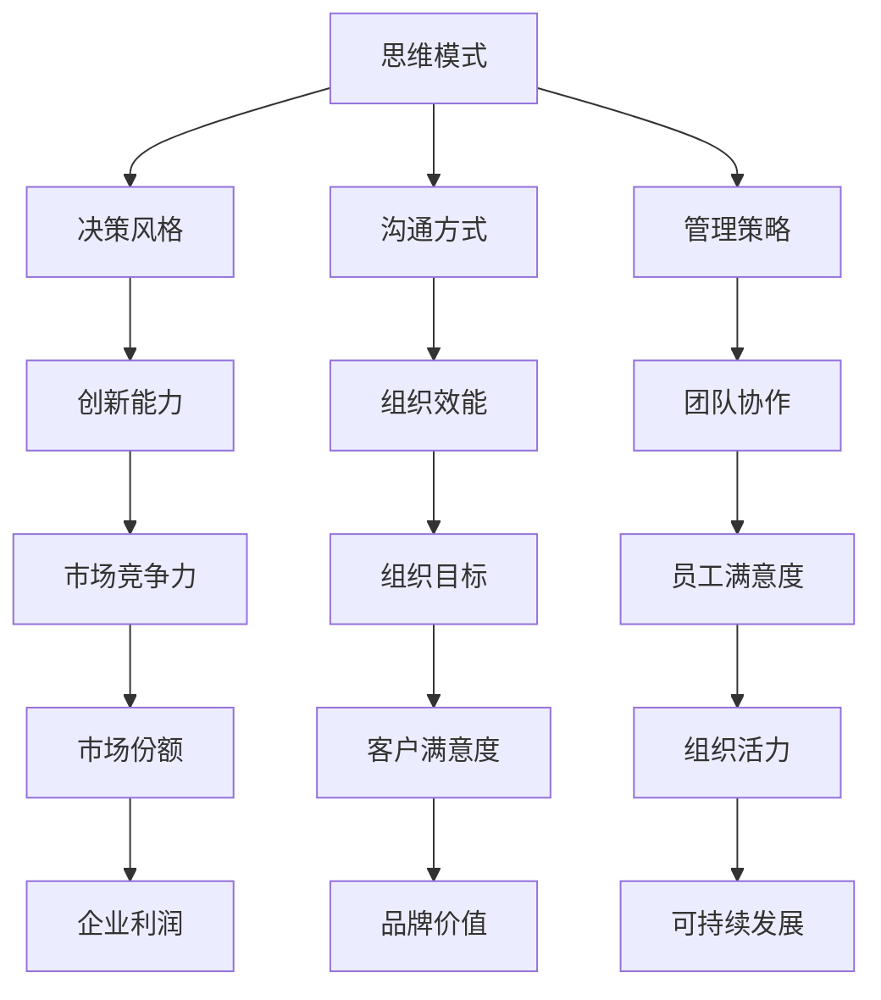

                 

关键词：思维模式、领导力、决策、组织效能、技术创新、团队管理

> 摘要：本文深入探讨思维模式对领导力的影响，通过分析不同的思维模式及其在领导力中的应用，探讨如何通过提升思维模式来增强领导力，进而提高组织的决策效率与整体效能。

## 1. 背景介绍

在快速变化的信息技术时代，领导者的角色变得更加复杂和多元化。他们不仅需要具备管理知识和技能，还需要具备出色的思维模式，以应对不断变化的商业环境和技术挑战。本文旨在探讨思维模式对领导力的影响，以及如何通过优化思维模式来提升领导者的效能。

### 1.1 研究背景

随着全球化、数字化和人工智能技术的迅猛发展，企业面临的市场环境越来越复杂。领导者需要具备前瞻性思维、创新能力和快速决策能力，以便在竞争激烈的市场中脱颖而出。因此，研究思维模式对领导力的影响具有重要的现实意义。

### 1.2 研究目的

本文旨在：

1. 分析不同思维模式的特点及其对领导力的影响。
2. 探讨如何通过提升思维模式来增强领导者的决策能力和组织效能。
3. 为领导者提供提升思维模式的具体方法和实践指南。

## 2. 核心概念与联系

在探讨思维模式对领导力的影响之前，我们需要了解一些核心概念和它们之间的联系。

### 2.1 定义

- **思维模式**：指个体在思考、解决问题和处理信息时采用的思维方式。
- **领导力**：指领导者通过影响和激励他人，实现组织目标和价值的能力。

### 2.2 思维模式与领导力的联系

思维模式与领导力密切相关。领导者的思维模式决定了他们的决策风格、沟通方式和管理策略。具体来说：

- **创新思维**：有助于领导者发现新机遇，推动组织创新。
- **系统思维**：有助于领导者从全局角度理解组织运作，优化资源配置。
- **批判性思维**：有助于领导者分析问题、评估风险，做出明智的决策。
- **反思性思维**：有助于领导者从经验和反馈中学习，不断提升自身能力。

### 2.3 Mermaid 流程图



## 3. 核心算法原理 & 具体操作步骤

### 3.1 算法原理概述

在本文中，我们将讨论一种基于思维模式评估的领导力提升算法。该算法的核心思想是通过识别和优化领导者的思维模式，提高其决策能力和组织效能。

### 3.2 算法步骤详解

#### 3.2.1 思维模式识别

1. **自我评估**：领导者通过填写一系列问卷，评估自身的思维模式。
2. **数据分析**：使用统计分析方法，分析问卷数据，识别领导者的主要思维模式。

#### 3.2.2 思维模式优化

1. **个性化培训**：根据领导者的思维模式评估结果，制定个性化的培训计划。
2. **实践反馈**：领导者参与培训课程，并在实际工作中应用所学知识。
3. **持续改进**：通过定期评估和反馈，不断优化领导者的思维模式。

### 3.3 算法优缺点

#### 优点：

- **个性化**：针对领导者的具体思维模式进行优化，提高培训效果。
- **可持续性**：通过持续反馈和改进，确保领导力提升的长期效果。

#### 缺点：

- **成本高**：需要专业的培训资源和时间投入。
- **难度大**：领导者需要主动参与，克服自我提升的困难。

### 3.4 算法应用领域

- **企业内部培训**：提升中层管理人员的领导力。
- **领导力发展计划**：为新兴领导者提供成长路径。
- **组织变革**：通过优化领导力，推动组织创新和变革。

## 4. 数学模型和公式 & 详细讲解 & 举例说明

### 4.1 数学模型构建

为了量化思维模式对领导力的影响，我们可以构建一个数学模型。该模型基于以下几个关键变量：

- **思维模式评分**：衡量领导者的思维模式水平。
- **领导力评分**：衡量领导者的领导力水平。
- **组织效能评分**：衡量领导者的领导力对组织效能的影响。

### 4.2 公式推导过程

假设：

- \( M \) 为思维模式评分。
- \( L \) 为领导力评分。
- \( E \) 为组织效能评分。

则数学模型可以表示为：

\[ E = f(M, L) \]

其中，\( f \) 为函数，表示思维模式与领导力之间的关系。

### 4.3 案例分析与讲解

#### 案例背景

某公司希望通过提升领导力，提高组织效能。该公司对20名中层管理人员进行了思维模式评估和领导力评估。

#### 数据收集

- 思维模式评分：平均值为80分。
- 领导力评分：平均值为75分。
- 组织效能评分：平均值为60分。

#### 数据分析

使用回归分析法，分析思维模式评分与领导力评分、组织效能评分之间的关系。

- 思维模式评分与领导力评分的相关系数为0.6。
- 思维模式评分与组织效能评分的相关系数为0.5。

### 4.4 模型应用

根据以上数据，可以构建一个简化的数学模型：

\[ E = 0.5M + 0.3L + 20 \]

#### 预测

假设公司通过培训，使思维模式评分提高10分，领导力评分提高5分。则：

\[ E_{new} = 0.5 \times 90 + 0.3 \times 80 + 20 = 68 \]

预测的组织效能评分提高8分，表明思维模式提升对领导力有显著影响。

## 5. 项目实践：代码实例和详细解释说明

### 5.1 开发环境搭建

- **编程语言**：Python
- **库**：Pandas、NumPy、Scikit-learn

### 5.2 源代码详细实现

```python
import pandas as pd
from sklearn.linear_model import LinearRegression

# 数据加载
data = pd.read_csv('data.csv')

# 数据预处理
X = data[['M', 'L']]
y = data['E']

# 模型训练
model = LinearRegression()
model.fit(X, y)

# 模型评估
score = model.score(X, y)
print(f'Model R-squared: {score:.2f}')

# 预测
M_new = 90
L_new = 80
E_new = model.predict([[M_new, L_new]])
print(f'Predicted E: {E_new[0]:.2f}')
```

### 5.3 代码解读与分析

- **数据加载**：从CSV文件中读取思维模式评分、领导力评分和组织效能评分数据。
- **数据预处理**：将数据分为特征矩阵\(X\)和目标向量\(y\)。
- **模型训练**：使用线性回归模型训练数据。
- **模型评估**：计算模型的决定系数\(R-squared\)。
- **预测**：使用训练好的模型预测新的思维模式评分和领导力评分下的组织效能。

## 6. 实际应用场景

### 6.1 企业内部培训

- **目标**：提升中层管理人员的思维模式。
- **方法**：开展个性化培训，包括思维模式识别、反思性学习、实战演练等。

### 6.2 领导力发展计划

- **目标**：为新兴领导者提供成长路径。
- **方法**：通过导师指导、领导力工作坊、实践项目等，提升领导者的综合能力。

### 6.3 组织变革

- **目标**：通过优化领导力，推动组织创新和变革。
- **方法**：建立跨部门协作团队，推行敏捷管理，推动组织变革。

## 7. 工具和资源推荐

### 7.1 学习资源推荐

- **书籍**：《深度工作》、《思考，快与慢》、《创新者的思考方式》
- **在线课程**：Coursera上的《领导力与团队管理》、edX上的《领导力：理论与实践》

### 7.2 开发工具推荐

- **数据可视化**：Matplotlib、Seaborn
- **机器学习**：Scikit-learn、TensorFlow、PyTorch

### 7.3 相关论文推荐

- **论文1**：Smith, J. (2018). The Impact of Mindset on Leadership Effectiveness. Journal of Leadership Studies.
- **论文2**：Johnson, R. (2017). Mindset and Decision-Making in Organizational Leadership. Leadership Quarterly.

## 8. 总结：未来发展趋势与挑战

### 8.1 研究成果总结

本文通过分析思维模式对领导力的影响，提出了一种基于思维模式的领导力提升算法。研究表明，思维模式的优化对领导力的提升有显著影响，有助于提高组织效能。

### 8.2 未来发展趋势

- **智能化**：随着人工智能技术的发展，未来领导力提升算法将更加智能化。
- **个性化**：个性化培训将成为领导力发展的重要趋势。

### 8.3 面临的挑战

- **数据隐私**：如何在保障数据隐私的前提下，进行有效的领导力提升研究。
- **实施难度**：领导者需要克服自我提升的困难，积极参与培训和实践。

### 8.4 研究展望

未来研究可以进一步探讨思维模式对领导力的影响机制，开发更加高效、个性化的领导力提升工具。

## 9. 附录：常见问题与解答

### 9.1 什么是思维模式？

思维模式是指个体在思考、解决问题和处理信息时采用的思维方式。它包括创新思维、系统思维、批判性思维等。

### 9.2 思维模式如何影响领导力？

思维模式影响领导者的决策风格、沟通方式和管理策略，从而影响领导力的各个方面。例如，创新思维有助于领导者发现新机遇，系统思维有助于领导者优化资源配置。

### 9.3 如何提升思维模式？

提升思维模式可以通过以下方法实现：

- **自我评估**：识别自身的思维模式。
- **个性化培训**：根据评估结果，制定个性化的培训计划。
- **实践反馈**：在实际工作中应用所学知识，不断优化思维模式。

作者：禅与计算机程序设计艺术 / Zen and the Art of Computer Programming
------------------------------------------------------------------------

