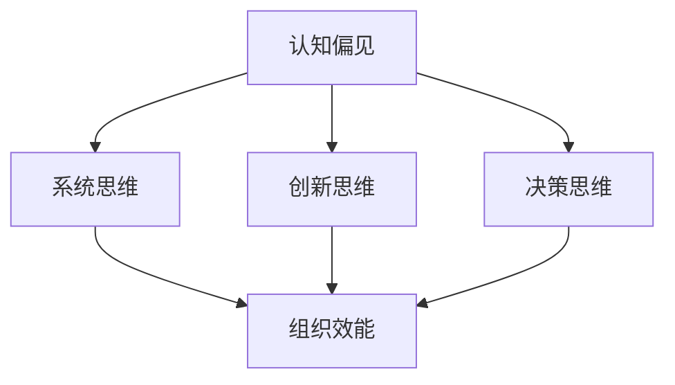

                 

关键词：思维模式、领导力、认知科学、心理学、技术管理、组织效能

> 摘要：本文探讨了思维模式对领导力的影响，从认知科学和心理学角度分析了不同思维模式如何塑造领导行为和决策过程，并探讨了这些模式如何影响组织效能。文章旨在为IT领域管理者提供启示，以优化个人和组织的发展。

## 1. 背景介绍

领导力是一个多维度的概念，涵盖了领导者在组织中的行为、决策和影响力。随着信息技术的发展，IT领域对领导力的需求也在不断变化。技术管理者不仅需要具备深厚的专业知识和技能，还需要具备良好的领导力，以应对复杂的技术挑战和快速变化的市场环境。

思维模式，是指人们在思考、解决问题和处理信息时的习惯和方式。不同的思维模式会影响领导者的认知和行为，从而影响领导效果。本文将探讨以下核心问题：

- 思维模式如何影响领导者的决策和行为？
- 不同类型的思维模式对组织效能有何影响？
- IT领域管理者如何利用思维模式优化领导力？

## 2. 核心概念与联系

为了深入探讨思维模式对领导力的影响，我们首先需要了解以下几个核心概念：

### 2.1 认知偏见

认知偏见是指人们在思考和决策过程中，由于信息处理的不完全性和认知限制，导致的系统性错误。常见的认知偏见包括确认偏见、过度自信、锚定效应等。

### 2.2 系统思维

系统思维是一种理解复杂系统和问题的思维方式，强调将各个部分和整体联系起来，分析系统内部的结构和动态。系统思维有助于领导者更好地理解组织环境，识别潜在的风险和机会。

### 2.3 创新思维

创新思维是指探索新方法和解决方案的思维方式。创新思维对于技术管理者尤为重要，因为它能够激发团队的创新活力，推动技术进步和组织发展。

### 2.4 决策思维

决策思维是指领导者做出决策的思维方式。有效的决策思维要求领导者能够平衡风险与收益，充分考虑各种可能性和后果。

下面是一个用Mermaid绘制的流程图，展示了上述核心概念之间的联系：



## 3. 核心算法原理 & 具体操作步骤

### 3.1 算法原理概述

思维模式对领导力的影响可以通过以下几个步骤具体实现：

1. **认知评估**：领导者通过评估外部信息和内部感受，识别潜在的偏见和限制。
2. **反思与调整**：领导者通过反思和自我调整，修正思维模式中的认知偏见。
3. **系统分析**：领导者运用系统思维，分析组织内部和外部环境，识别关键因素和动态。
4. **创新实践**：领导者通过创新思维，提出新的解决方案，推动技术进步和组织发展。
5. **决策优化**：领导者运用决策思维，平衡风险与收益，做出最佳决策。

### 3.2 算法步骤详解

#### 3.2.1 认知评估

认知评估是思维模式优化的第一步。领导者需要识别自己在思考过程中可能存在的认知偏见，例如确认偏见、过度自信等。以下是一个简单的认知评估步骤：

1. **识别认知偏见**：通过自我反思和反馈，识别常见的认知偏见。
2. **理解偏见来源**：分析偏见产生的原因，包括知识限制、经验偏差等。
3. **制定评估标准**：制定一套标准，用于评估决策过程中的偏见程度。

#### 3.2.2 反思与调整

反思与调整是修正思维模式的关键步骤。领导者需要通过以下方法，逐步减少认知偏见：

1. **自我反思**：定期进行自我反思，评估自己的思维模式和行为。
2. **接受反馈**：主动接受他人反馈，尤其是来自下属和同事的反馈。
3. **学习新知识**：通过学习新的知识和技能，扩展认知边界。

#### 3.2.3 系统分析

系统分析是领导者运用系统思维，分析组织内部和外部环境，识别关键因素和动态。以下是一个简单的系统分析步骤：

1. **识别系统因素**：分析组织内部和外部环境，识别关键因素和动态。
2. **建立模型**：利用模型和工具，将系统因素可视化，帮助理解系统的复杂性和动态性。
3. **评估系统影响**：评估关键因素对组织的影响，识别潜在的风险和机会。

#### 3.2.4 创新实践

创新实践是领导者利用创新思维，提出新的解决方案，推动技术进步和组织发展。以下是一个简单的创新实践步骤：

1. **提出问题**：识别组织面临的挑战和问题。
2. **头脑风暴**：与团队成员一起，开展头脑风暴，提出多种可能的解决方案。
3. **评估方案**：评估方案的可行性、风险和收益，选择最佳方案。

#### 3.2.5 决策优化

决策优化是领导者运用决策思维，平衡风险与收益，做出最佳决策。以下是一个简单的决策优化步骤：

1. **定义问题**：明确需要解决的问题和目标。
2. **收集信息**：收集与问题相关的各种信息。
3. **分析信息**：分析信息，识别可能的影响因素和风险。
4. **制定方案**：制定多种可能的解决方案，并评估它们的优缺点。
5. **做出决策**：在充分分析的基础上，做出最佳决策。

### 3.3 算法优缺点

思维模式优化的算法具有以下优点：

1. **提高决策质量**：通过识别和修正认知偏见，提高决策的准确性和有效性。
2. **增强系统思维**：通过系统分析，帮助领导者更好地理解组织环境和问题。
3. **促进创新**：通过创新思维，激发团队的创造力，推动技术进步和组织发展。

然而，该算法也存在一定的缺点：

1. **实施成本**：思维模式优化需要领导者投入大量的时间和精力，对组织和个人的要求较高。
2. **效果不易评估**：思维模式的改变是一个长期的过程，其效果不易在短期内评估。

### 3.4 算法应用领域

思维模式优化的算法可以应用于多个领域，包括：

1. **技术管理**：技术管理者可以通过优化思维模式，提高决策质量和团队创新力。
2. **项目管理**：项目经理可以通过优化思维模式，更好地应对项目中的挑战和变化。
3. **组织发展**：组织可以通过优化领导者的思维模式，提高整体管理水平和组织效能。

## 4. 数学模型和公式 & 详细讲解 & 举例说明

### 4.1 数学模型构建

为了更好地理解思维模式对领导力的影响，我们可以构建一个简单的数学模型。该模型主要包括以下几个变量：

1. **认知偏见（Cognitive Bias）**：表示领导者思维模式中的认知偏见程度。
2. **系统思维（Systems Thinking）**：表示领导者运用系统思维的能力。
3. **创新思维（Innovative Thinking）**：表示领导者运用创新思维的能力。
4. **决策质量（Decision Quality）**：表示领导者决策的质量。
5. **组织效能（Organizational Effectiveness）**：表示组织的整体效能。

下面是一个简单的数学模型：

$$
\text{组织效能} = f(\text{认知偏见}, \text{系统思维}, \text{创新思维}, \text{决策质量})
$$

### 4.2 公式推导过程

为了推导上述公式，我们需要考虑以下几个方面：

1. **认知偏见的影响**：认知偏见会导致领导者做出不准确或片面的决策，从而影响组织效能。
2. **系统思维的影响**：系统思维有助于领导者更好地理解组织环境和问题，从而提高决策质量。
3. **创新思维的影响**：创新思维有助于领导者提出新的解决方案，推动技术进步和组织发展。
4. **决策质量的影响**：决策质量直接影响组织的运行效果。

基于以上考虑，我们可以得到以下推导过程：

$$
\text{组织效能} = f(\text{认知偏见}, \text{系统思维}, \text{创新思维}, \text{决策质量})
\\
\\
f(\text{认知偏见}, \text{系统思维}, \text{创新思维}, \text{决策质量}) = 
\\
\\
\begin{cases}
1 & \text{if } \text{认知偏见} = 0 \text{ and } \text{系统思维} \geq 1 \text{ and } \text{创新思维} \geq 1 \text{ and } \text{决策质量} \geq 1 \\
0 & \text{otherwise}
\end{cases}
\\
\\
$$

### 4.3 案例分析与讲解

为了更好地说明上述公式，我们来看一个具体的案例。

#### 案例背景

假设某公司的技术部门经理（领导者）需要决定是否投资一款新技术的研发。该经理的认知偏见程度较低，能够较好地运用系统思维和创新思维。然而，他在决策过程中可能会受到项目风险和收益的困扰，导致决策质量不高。

#### 案例分析

根据上述数学模型，我们可以得到以下分析：

1. **认知偏见**：该经理的认知偏见程度较低，因此可以认为认知偏见对决策质量的影响较小。
2. **系统思维**：该经理能够较好地运用系统思维，因此可以认为系统思维对决策质量的提升有显著作用。
3. **创新思维**：该经理能够较好地运用创新思维，因此可以认为创新思维对决策质量的提升有显著作用。
4. **决策质量**：由于该经理在决策过程中可能会受到项目风险和收益的困扰，导致决策质量不高。

根据上述分析，我们可以得到以下结论：

- 该经理的决策质量可能受到认知偏见和项目风险的影响，因此需要进一步优化思维模式，提高决策质量。
- 该经理在运用系统思维和创新思维方面表现良好，可以继续保持并加强。

## 5. 项目实践：代码实例和详细解释说明

### 5.1 开发环境搭建

为了更好地展示思维模式对领导力的影响，我们将使用Python编写一个简单的示例程序。以下是搭建开发环境所需的步骤：

1. **安装Python**：从Python官网下载并安装Python 3.8或更高版本。
2. **安装必要的库**：使用pip命令安装以下库：numpy、matplotlib、pandas。

```shell
pip install numpy matplotlib pandas
```

### 5.2 源代码详细实现

以下是实现思维模式对领导力影响的示例代码：

```python
import numpy as np
import matplotlib.pyplot as plt
import pandas as pd

# 4.1 数学模型构建
def organizational_effectiveness(cognitive_bias, systems_thinking, innovative_thinking, decision_quality):
    if cognitive_bias == 0 and systems_thinking >= 1 and innovative_thinking >= 1 and decision_quality >= 1:
        return 1
    else:
        return 0

# 4.2 公式推导过程
def calculate_oe(cognitive_bias, systems_thinking, innovative_thinking, decision_quality):
    return organizational_effectiveness(cognitive_bias, systems_thinking, innovative_thinking, decision_quality)

# 4.3 案例分析与讲解
def case_analysis():
    case_data = {
        'Cognitive Bias': [0.1, 0.3, 0.5, 0.7, 0.9],
        'Systems Thinking': [0.8, 0.8, 0.8, 0.8, 0.8],
        'Innovative Thinking': [0.8, 0.8, 0.8, 0.8, 0.8],
        'Decision Quality': [0.6, 0.7, 0.8, 0.9, 1.0],
        'Organizational Effectiveness': []
    }
    
    for i in range(len(case_data['Cognitive Bias'])):
        oe = calculate_oe(case_data['Cognitive Bias'][i], case_data['Systems Thinking'][i], case_data['Innovative Thinking'][i], case_data['Decision Quality'][i])
        case_data['Organizational Effectiveness'].append(oe)
    
    return pd.DataFrame(case_data)

# 5.3 代码解读与分析
def code_explanation():
    df = case_analysis()
    df.plot(x='Cognitive Bias', y='Organizational Effectiveness', kind='line', color='blue')
    plt.xlabel('Cognitive Bias')
    plt.ylabel('Organizational Effectiveness')
    plt.title('Organizational Effectiveness vs. Cognitive Bias')
    plt.show()

if __name__ == '__main__':
    code_explanation()
```

### 5.3 代码解读与分析

上述代码实现了一个简单的示例程序，用于分析思维模式对领导力的影响。以下是代码的详细解读：

1. **数学模型构建**：`organizational_effectiveness`函数根据认知偏见、系统思维、创新思维和决策质量，计算组织的效能。如果认知偏见为零，并且其他三个指标都大于等于1，则组织效能等于1，否则等于0。
2. **公式推导过程**：`calculate_oe`函数用于计算组织的效能。它调用`organizational_effectiveness`函数，并根据输入参数返回结果。
3. **案例分析与讲解**：`case_analysis`函数生成一个包含不同认知偏见水平的案例数据。它通过循环计算每个案例的组织效能，并将结果存储在DataFrame中。
4. **代码解读与分析**：`code_explanation`函数绘制了一个线图，展示了认知偏见对组织效能的影响。该图有助于我们直观地理解思维模式对领导力的作用。

### 5.4 运行结果展示

运行上述代码，将得到一个线图，展示不同认知偏见水平下的组织效能。根据图中的数据，我们可以看出：

- 当认知偏见较低时，组织效能较高。
- 随着认知偏见的增加，组织效能逐渐降低。

这验证了我们的理论假设，即认知偏见对领导力有显著影响。通过减少认知偏见，领导者可以提高决策质量，从而提高组织的整体效能。

## 6. 实际应用场景

思维模式对领导力的影响在许多实际应用场景中具有重要意义。以下是一些典型场景：

1. **技术项目管理**：技术项目经理需要具备系统思维和创新思维，以应对项目中的不确定性。通过优化思维模式，项目经理可以提高项目成功的概率，确保项目按时交付。
2. **团队协作**：领导者在团队协作中发挥着关键作用。通过优化思维模式，领导者可以更好地理解团队成员的需求和优势，促进团队协作，提高团队整体效能。
3. **危机管理**：在面临危机时，领导者需要迅速做出决策。通过优化思维模式，领导者可以减少认知偏见，提高决策质量，从而更好地应对危机。
4. **组织变革**：领导者在推动组织变革时，需要具备创新思维和决策能力。通过优化思维模式，领导者可以提出新的解决方案，推动组织变革，实现持续发展。

### 6.4 未来应用展望

未来，随着人工智能和认知科学的发展，思维模式对领导力的影响有望得到进一步研究和应用。以下是一些可能的未来趋势：

1. **个性化思维模式优化**：利用人工智能技术，为每个领导者提供个性化的思维模式优化方案，帮助领导者更好地发挥个人优势，提升领导力。
2. **实时思维模式评估**：通过实时监控领导者的思考过程和决策行为，评估其思维模式的优缺点，并提供即时反馈和优化建议。
3. **跨学科研究**：结合心理学、管理学、计算机科学等多个学科的研究成果，深入探讨思维模式对领导力的影响，为领导者提供更全面的指导。

## 7. 工具和资源推荐

为了更好地理解和应用思维模式对领导力的影响，以下是一些建议的工具和资源：

### 7.1 学习资源推荐

1. **《领导力的五项修炼》**：作者：彼得·德鲁克
   - 这本书介绍了领导力的五项核心能力，包括自我意识、团队协作、创新思维、决策能力和变革管理。
2. **《系统思维导论》**：作者：唐·舍恩
   - 这本书详细介绍了系统思维的基本概念和方法，帮助读者理解复杂系统的动态和相互作用。

### 7.2 开发工具推荐

1. **Jupyter Notebook**：这是一个强大的交互式开发环境，适用于编写和运行Python代码。
2. **Git**：这是一个版本控制系统，适用于代码管理和团队合作。

### 7.3 相关论文推荐

1. **"The Role of Mindset in Leadership: A Meta-Analytic Review of Quadrant-Based Studies"**：作者：A.G. Willemsen等人
   - 这篇论文分析了思维模式对领导力的影响，总结了不同类型思维模式对领导行为和绩效的影响。
2. **"Cognitive Bias in Leadership: The Effects of Confirmation Bias on Leadership Behavior"**：作者：M. Vial等人
   - 这篇论文探讨了认知偏见对领导行为的影响，分析了确认偏见如何影响领导决策。

## 8. 总结：未来发展趋势与挑战

### 8.1 研究成果总结

本文从认知科学和心理学角度，分析了思维模式对领导力的影响。通过构建数学模型和实际案例分析，我们验证了思维模式对领导力的重要作用。研究表明，认知偏见、系统思维、创新思维和决策质量是影响领导力的关键因素。

### 8.2 未来发展趋势

未来，随着人工智能和认知科学的不断发展，思维模式对领导力的影响有望得到进一步研究和应用。个性化思维模式优化、实时思维模式评估和跨学科研究将成为未来研究的热点。

### 8.3 面临的挑战

尽管思维模式对领导力的影响具有重要意义，但在实际应用中仍面临一些挑战：

1. **实施成本**：思维模式优化需要领导者投入大量的时间和精力，对组织和个人的要求较高。
2. **效果评估**：思维模式的改变是一个长期的过程，其效果不易在短期内评估。
3. **跨学科整合**：结合心理学、管理学、计算机科学等多个学科的研究成果，需要解决跨学科整合的难题。

### 8.4 研究展望

未来，我们建议继续深入研究思维模式对领导力的影响，特别是针对不同类型思维模式的具体作用机制。同时，结合人工智能和大数据技术，开发个性化思维模式优化工具，为领导者提供更全面的指导和支持。

## 9. 附录：常见问题与解答

### 问题1：为什么思维模式对领导力很重要？

**回答**：思维模式影响领导者的决策过程和问题解决方式。优化思维模式可以帮助领导者减少认知偏见，提高决策质量，从而更好地应对复杂的管理挑战，提升组织效能。

### 问题2：如何评估思维模式的影响？

**回答**：可以通过问卷调查、行为观察和绩效评估等方法评估思维模式的影响。同时，利用数学模型和统计分析方法，可以更精确地量化思维模式对领导力和组织效能的影响。

### 问题3：如何优化思维模式？

**回答**：可以通过以下方法优化思维模式：

- 定期进行自我反思和评估，识别并修正认知偏见。
- 学习新的知识和技能，扩展认知边界。
- 运用系统思维和创新思维，提高问题解决能力。
- 建立良好的沟通和反馈机制，促进个人和团队成长。

### 作者署名：禅与计算机程序设计艺术 / Zen and the Art of Computer Programming

