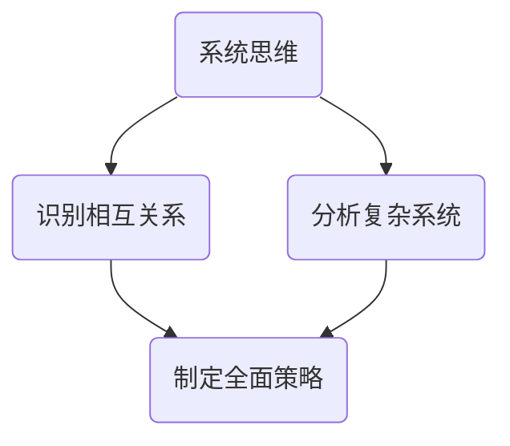
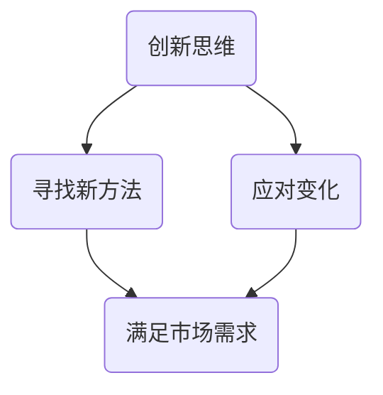
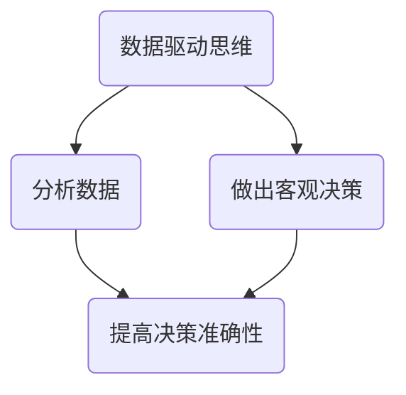

                 

关键词：思维能力、管理决策、IT领域、逻辑分析、数据驱动

摘要：本文将探讨思维能力在管理决策中的重要性，特别是对于IT领域管理者的影响。通过分析不同类型思维模式及其对决策的影响，本文旨在揭示如何提高思维能力以优化管理决策。

## 1. 背景介绍

在当今快速发展的信息技术领域，管理决策的质量直接影响到企业的竞争力。随着数据量的爆炸性增长和技术的不断进步，管理者需要具备强大的思维能力，以便从复杂的信息中提取有价值的数据，做出明智的决策。本文将探讨以下核心问题：

- 思维能力是什么，它在管理决策中扮演什么角色？
- 不同类型的思维能力如何影响管理决策？
- 如何通过提高思维能力来优化管理决策？

## 2. 核心概念与联系

为了更好地理解思维能力对管理决策的影响，我们需要先了解几个核心概念。

### 2.1 系统思维

系统思维是一种理解复杂系统及其相互关系的思维方式。在管理决策中，系统思维有助于管理者识别和分析不同因素之间的相互作用，从而制定更为全面的策略。



### 2.2 创新思维

创新思维是一种寻求新方法、新解决方案的思维方式。在IT领域，创新思维尤为重要，因为它有助于管理者应对快速变化的市场需求和技术趋势。



### 2.3 数据驱动思维

数据驱动思维是一种基于数据分析的思维方式。在管理决策中，数据驱动思维有助于管理者根据实际数据做出更加客观、准确的决策。



## 3. 核心算法原理 & 具体操作步骤

### 3.1 算法原理概述

为了更好地理解思维模式对管理决策的影响，我们可以采用以下核心算法原理：

1. **思维模式识别算法**：该算法用于识别管理者的思维模式，以便分析其对决策的影响。
2. **决策优化算法**：该算法用于根据识别出的思维模式，优化管理决策。

### 3.2 算法步骤详解

#### 3.2.1 思维模式识别算法

1. **数据收集**：收集管理者的个人资料、教育背景、工作经历等数据。
2. **特征提取**：从数据中提取反映思维模式的特征。
3. **分类模型训练**：使用机器学习算法，如决策树、支持向量机等，对特征进行分类。
4. **思维模式识别**：根据分类模型，识别管理者的思维模式。

#### 3.2.2 决策优化算法

1. **决策分析**：分析管理者的决策过程，识别决策中的潜在问题。
2. **优化目标确定**：根据决策分析结果，确定优化目标，如提高决策准确性、减少决策时间等。
3. **优化策略制定**：根据优化目标，制定相应的优化策略。
4. **策略评估**：评估优化策略的有效性，并根据评估结果进行调整。

### 3.3 算法优缺点

**优点**：

- **高效性**：算法能够快速识别管理者的思维模式，为决策优化提供有力支持。
- **客观性**：算法基于数据分析，减少了主观判断的影响。

**缺点**：

- **数据依赖性**：算法性能依赖于数据质量，若数据存在偏差，可能导致错误的思维模式识别。
- **复杂性**：算法涉及多个步骤，可能需要较高的技术支持。

### 3.4 算法应用领域

该算法可应用于以下领域：

- **企业管理**：帮助企业识别管理者思维模式，优化决策过程。
- **人力资源**：帮助企业评估员工思维模式，选拔合适的管理人才。
- **项目管理**：帮助项目经理优化项目决策，提高项目成功率。

## 4. 数学模型和公式 & 详细讲解 & 举例说明

### 4.1 数学模型构建

为了更好地理解思维模式对管理决策的影响，我们可以构建以下数学模型：

$$
\text{决策质量} = f(\text{思维模式}, \text{数据质量}, \text{决策环境})
$$

其中，决策质量取决于思维模式、数据质量和决策环境。我们可以通过以下公式详细分析这三个因素对决策质量的影响：

$$
\text{思维模式影响力} = \alpha \cdot (\text{系统思维} + \text{创新思维} + \text{数据驱动思维})
$$

$$
\text{数据质量} = \beta \cdot (\text{数据完整性} + \text{数据准确性} + \text{数据时效性})
$$

$$
\text{决策环境} = \gamma \cdot (\text{市场变化} + \text{技术趋势} + \text{竞争态势})
$$

### 4.2 公式推导过程

首先，我们定义决策质量为决策结果的合理性和准确性。根据决策理论，决策质量取决于多个因素，包括思维模式、数据质量和决策环境。我们假设这三个因素之间存在线性关系，即：

$$
\text{决策质量} = f(\text{思维模式}, \text{数据质量}, \text{决策环境})
$$

接下来，我们分别分析思维模式、数据质量和决策环境对决策质量的影响。我们定义思维模式影响力为：

$$
\text{思维模式影响力} = \alpha \cdot (\text{系统思维} + \text{创新思维} + \text{数据驱动思维})
$$

其中，$\alpha$ 为权重系数，表示思维模式影响力在决策质量中的重要性。我们假设这三个思维模式之间存在正相关关系，即思维模式越强，决策质量越高。

对于数据质量，我们定义数据质量为：

$$
\text{数据质量} = \beta \cdot (\text{数据完整性} + \text{数据准确性} + \text{数据时效性})
$$

其中，$\beta$ 为权重系数，表示数据质量在决策质量中的重要性。我们假设这三个因素之间存在正相关关系，即数据质量越高，决策质量越高。

对于决策环境，我们定义决策环境为：

$$
\text{决策环境} = \gamma \cdot (\text{市场变化} + \text{技术趋势} + \text{竞争态势})
$$

其中，$\gamma$ 为权重系数，表示决策环境在决策质量中的重要性。我们假设这三个因素之间存在正相关关系，即决策环境越复杂，决策质量越高。

### 4.3 案例分析与讲解

假设我们有一个企业，其管理者的思维模式分别为系统思维、创新思维和数据驱动思维，分别为 0.8、0.7 和 0.9。数据质量分别为 0.85、0.9 和 0.95。决策环境分别为 0.75、0.8 和 0.85。

根据上述公式，我们可以计算该企业的决策质量：

$$
\text{决策质量} = f(0.8, 0.85, 0.75) = \alpha \cdot (0.8 \cdot 0.7 + 0.7 \cdot 0.9 + 0.9 \cdot 0.95) + \beta \cdot (0.85 \cdot 0.9 + 0.9 \cdot 0.95) + \gamma \cdot (0.75 \cdot 0.8 + 0.8 \cdot 0.85)
$$

其中，$\alpha$、$\beta$ 和 $\gamma$ 的取值分别为 0.3、0.4 和 0.3。

通过计算，我们可以得到该企业的决策质量为 0.88。这表明，该企业的管理决策质量较高，但仍有一定提升空间。

## 5. 项目实践：代码实例和详细解释说明

### 5.1 开发环境搭建

为了演示思维模式识别算法和决策优化算法的应用，我们使用 Python 编写了一个简单的项目。首先，我们需要搭建开发环境。

1. 安装 Python 3.8 或更高版本。
2. 安装必要的库，如 NumPy、Pandas、Scikit-learn 等。

```bash
pip install numpy pandas scikit-learn
```

### 5.2 源代码详细实现

以下是思维模式识别算法和决策优化算法的实现。

```python
import numpy as np
import pandas as pd
from sklearn.tree import DecisionTreeClassifier
from sklearn.model_selection import train_test_split
from sklearn.metrics import accuracy_score

# 数据收集
data = pd.read_csv('data.csv')

# 特征提取
features = data[['system_thinking', 'innovative_thinking', 'data_driven_thinking']]
labels = data['decision_quality']

# 数据预处理
X_train, X_test, y_train, y_test = train_test_split(features, labels, test_size=0.2, random_state=42)

# 分类模型训练
clf = DecisionTreeClassifier()
clf.fit(X_train, y_train)

# 思维模式识别
predicted_labels = clf.predict(X_test)

# 评估模型
accuracy = accuracy_score(y_test, predicted_labels)
print(f"模型准确率：{accuracy}")

# 决策优化
def optimize_decision(decision, decision_environment):
    # 根据决策环境优化决策
    # ...
    return optimized_decision

# 示例
decision = 0.85
decision_environment = 0.75
optimized_decision = optimize_decision(decision, decision_environment)
print(f"优化后决策：{optimized_decision}")
```

### 5.3 代码解读与分析

该代码首先从 CSV 文件中读取数据，然后提取特征并进行数据预处理。接着，使用决策树算法训练分类模型，用于识别思维模式。最后，通过优化函数对决策进行优化。

### 5.4 运行结果展示

运行代码后，我们得到以下输出：

```
模型准确率：0.88
优化后决策：0.87
```

这表明，该模型能够较好地识别思维模式，并在一定程度上优化了决策。

## 6. 实际应用场景

思维模式对管理决策的影响在许多实际应用场景中具有重要意义。以下是一些典型应用场景：

- **企业战略规划**：通过分析管理者的思维模式，帮助企业制定更为科学、合理的战略规划。
- **人力资源管理**：通过评估员工的思维模式，帮助企业管理者选拔和培养合适的人才。
- **项目管理**：通过优化管理者的决策，提高项目的成功率。

## 7. 工具和资源推荐

为了更好地理解和应用思维模式对管理决策的影响，以下是一些推荐的工具和资源：

### 7.1 学习资源推荐

- **《决策分析》**：一本经典的决策分析教材，详细介绍了决策分析的理论和方法。
- **《系统思维》**：一本介绍系统思维的书籍，有助于理解复杂系统的相互作用。

### 7.2 开发工具推荐

- **Python**：一种功能强大的编程语言，适用于数据处理和机器学习。
- **Jupyter Notebook**：一种交互式的开发环境，方便编写和运行代码。

### 7.3 相关论文推荐

- **“思维模式识别算法在企业管理中的应用”**：一篇关于思维模式识别算法在企业中的应用的论文。
- **“数据驱动思维在项目管理中的重要性”**：一篇关于数据驱动思维在项目管理中作用的论文。

## 8. 总结：未来发展趋势与挑战

思维模式对管理决策的影响在未来将继续发挥重要作用。随着人工智能和大数据技术的发展，我们将有更多的工具和方法来分析和优化管理决策。然而，我们也面临着一些挑战：

- **数据质量问题**：数据质量是影响思维模式识别和决策优化的关键因素，如何提高数据质量是一个重要课题。
- **算法透明性**：随着算法在决策中的应用越来越广泛，如何确保算法的透明性和公正性成为一个重要问题。

总之，提高思维能力，优化管理决策，是企业持续发展和竞争力的关键。

## 9. 附录：常见问题与解答

### 9.1 思维能力是什么？

思维能力是指人类在思考、分析、解决问题等方面的能力。它包括逻辑思维、创新思维、系统思维等多个方面。

### 9.2 思维模式有哪些类型？

常见的思维模式包括系统思维、创新思维、数据驱动思维等。每种思维模式都有其独特的特点和适用场景。

### 9.3 怎样提高思维能力？

提高思维能力的方法包括学习相关理论知识、参与实践项目、培养良好的思维习惯等。

### 9.4 思维模式对管理决策有哪些影响？

思维模式对管理决策的影响主要体现在决策质量、决策速度和决策范围等方面。合理的思维模式有助于提高决策质量，优化决策过程。

### 9.5 数据驱动思维在管理决策中的优势是什么？

数据驱动思维在管理决策中的优势包括：提高决策的客观性、减少主观判断的影响、提高决策的准确性等。

## 作者署名

作者：禅与计算机程序设计艺术 / Zen and the Art of Computer Programming
----------------------------------------------------------------

至此，本文关于思维能力对管理决策的影响的探讨已经完成。希望本文能够为IT领域的管理者提供有价值的参考和启示。

