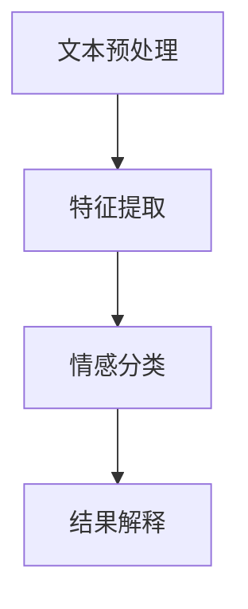

                 

关键词：情感分析、人工智能、电商搜索、用户理解、推荐系统

> 摘要：随着电子商务的快速发展，用户对个性化搜索和推荐的需求日益增长。情感分析作为人工智能的一项关键技术，在电商搜索导购中发挥着越来越重要的作用。本文将深入探讨情感分析在电商搜索导购中的应用，阐述其原理、技术实现以及未来展望。

## 1. 背景介绍

电子商务作为一种新兴商业模式，已迅速成为全球零售市场的重要组成部分。据统计，全球电子商务市场规模已超过3万亿美元，且每年以超过10%的速度持续增长。这种增长趋势不仅体现在交易额的上升，更体现在用户对电商平台的依赖程度日益加深。

在这种背景下，如何提高用户体验，增加用户粘性，成为电商平台竞争的核心。而个性化搜索和推荐系统正是满足这一需求的关键技术。通过分析用户的搜索历史、购买行为、浏览习惯等数据，个性化搜索和推荐系统能够为用户精准推荐他们可能感兴趣的商品。

然而，传统的推荐系统往往只关注商品的属性和用户的历史行为，而忽略了用户的主观情感。例如，用户在搜索“笔记本电脑”时，可能只是输入了关键词，但他们的情感可能是对“高品质”、“高性能”的期待，或是“价格适中”的期望。这种情感上的需求，是传统推荐系统难以捕捉的。

情感分析，作为一种基于人工智能的技术，正是用来解决这一问题的。它通过分析用户的语言表达，挖掘出用户背后的情感倾向，从而为个性化搜索和推荐系统提供更全面的数据支持。

## 2. 核心概念与联系

### 2.1 情感分析的概念

情感分析，又称意见挖掘，是指使用自然语言处理技术，从文本中识别并提取主观情感信息的过程。情感分析的目标是确定文本所表达的情感倾向，如正面、负面或中立。

情感分析的核心概念包括：

- **情感分类**：根据情感极性（正面、负面、中立）对文本进行分类。
- **情感强度**：衡量情感倾向的强度，如“非常喜欢”与“喜欢”的情感强度不同。
- **情感主题**：识别文本中涉及的情感主题，如“产品评价”、“服务体验”等。

### 2.2 情感分析在电商搜索导购中的应用

在电商搜索导购中，情感分析的应用主要体现在以下几个方面：

- **商品评价分析**：通过情感分析，可以了解用户对商品的满意度，从而调整商品推荐策略。
- **用户需求挖掘**：分析用户的搜索词和评论，挖掘出用户的潜在需求，提高推荐准确性。
- **客服机器人**：使用情感分析技术，可以构建更智能的客服机器人，更好地理解用户的情感需求，提供个性化服务。

### 2.3 情感分析的架构

情感分析的架构通常包括以下几个主要模块：

1. **文本预处理**：对原始文本进行清洗和分词，去除无关信息，提取关键词。
2. **特征提取**：将预处理后的文本转化为计算机可处理的特征向量。
3. **情感分类**：使用机器学习算法对情感进行分类，常见的分类算法包括朴素贝叶斯、支持向量机、深度学习等。
4. **结果解释**：对情感分析的结果进行解释，如情感极性、强度和主题。

### 2.4 情感分析的 Mermaid 流程图



## 3. 核心算法原理 & 具体操作步骤

### 3.1 算法原理概述

情感分析的核心算法主要包括基于规则的方法、基于统计的方法和基于深度学习的方法。

- **基于规则的方法**：通过预定义的规则来分析文本的情感，如关键词匹配、情感词典等。
- **基于统计的方法**：使用统计模型（如朴素贝叶斯、逻辑回归等）来分析文本的情感。
- **基于深度学习的方法**：使用神经网络模型（如卷积神经网络、循环神经网络等）来分析文本的情感。

### 3.2 算法步骤详解

1. **文本预处理**：
   - 去除HTML标签、符号等无关信息。
   - 进行分词，将文本分解为词或短语。
   - 去停用词，如“的”、“了”、“是”等。
   - 进行词性标注，识别名词、动词等。

2. **特征提取**：
   - 使用词袋模型、TF-IDF等方法提取文本特征。
   - 使用词嵌入技术（如Word2Vec、GloVe等）将词汇映射到高维空间。

3. **情感分类**：
   - 使用预训练的模型（如FastText、BERT等）进行分类。
   - 使用自定义模型进行分类，常见算法包括朴素贝叶斯、支持向量机、循环神经网络等。

4. **结果解释**：
   - 输出情感极性（正面、负面、中立）。
   - 输出情感强度。
   - 输出情感主题。

### 3.3 算法优缺点

- **基于规则的方法**：简单易实现，但规则难以覆盖所有情境，且需要大量的人工干预。
- **基于统计的方法**：相比基于规则的方法，能够自动学习文本特征，但性能受限于特征选择和模型选择。
- **基于深度学习的方法**：能够自动学习复杂的文本特征，性能优异，但需要大量的数据和计算资源。

### 3.4 算法应用领域

- **电商搜索导购**：分析用户评论和搜索词，为用户提供个性化推荐。
- **社交媒体分析**：监测用户情感，了解公众对品牌、产品的看法。
- **客户服务**：使用情感分析构建智能客服系统，提高服务质量。

## 4. 数学模型和公式 & 详细讲解 & 举例说明

### 4.1 数学模型构建

情感分析通常涉及以下数学模型：

1. **词袋模型（Bag of Words, BoW）**：

   $$X = (x_1, x_2, ..., x_n)$$

   其中，$x_i$ 表示词汇 $v_i$ 在文档 $d$ 中的出现次数。

2. **TF-IDF（Term Frequency-Inverse Document Frequency）**：

   $$tfidf(v_i, d) = tf(v_i, d) \times \log(\frac{N}{df(v_i)})$$

   其中，$tf(v_i, d)$ 表示词汇 $v_i$ 在文档 $d$ 中的词频，$df(v_i)$ 表示词汇 $v_i$ 在文档集合中的文档频率，$N$ 表示文档总数。

3. **情感词典（Sentiment Dictionary）**：

   $$S(v_i) = \begin{cases} 
   +1, & \text{if } v_i \in \text{ positive words} \\
   -1, & \text{if } v_i \in \text{ negative words} \\
   0, & \text{otherwise}
   \end{cases}$$

### 4.2 公式推导过程

以TF-IDF为例，推导过程如下：

1. **词频（Term Frequency, TF）**：

   $$tf(v_i, d) = \frac{f(v_i, d)}{f_{\text{total}}(d)}$$

   其中，$f(v_i, d)$ 表示词汇 $v_i$ 在文档 $d$ 中的出现次数，$f_{\text{total}}(d)$ 表示文档 $d$ 中所有词汇的出现次数之和。

2. **文档频率（Document Frequency, DF）**：

   $$df(v_i) = \text{count}(v_i \text{ appears in documents})$$

3. **逆文档频率（Inverse Document Frequency, IDF）**：

   $$idf(v_i) = \log(\frac{N}{df(v_i)})$$

4. **TF-IDF**：

   $$tfidf(v_i, d) = tf(v_i, d) \times idf(v_i)$$

### 4.3 案例分析与讲解

假设我们有一个简单的文本数据集，包含两篇文档：

- **文档1**：“我非常喜欢这款手机，拍照效果非常好，但电池续航一般。”
- **文档2**：“这款手机的电池续航非常好，拍照效果也不错。”

我们可以使用TF-IDF来提取文本特征，如下：

1. **词袋表示**：

   $$\text{文档1：} (\text{我}, \text{喜欢}, \text{这款}, \text{手机}, \text{拍照}, \text{效果}, \text{很好}, \text{但}, \text{电池}, \text{续航}, \text{一般})$$
   $$\text{文档2：} (\text{这款}, \text{手机}, \text{电池}, \text{续航}, \text{很好}, \text{拍照}, \text{效果}, \text{也})$$

2. **TF计算**：

   $$tf(\text{喜欢}, \text{文档1}) = 1$$
   $$tf(\text{很好}, \text{文档1}) = 1$$
   $$tf(\text{一般}, \text{文档1}) = 1$$
   $$tf(\text{很好}, \text{文档2}) = 1$$
   $$tf(\text{也}, \text{文档2}) = 1$$

3. **IDF计算**：

   $$idf(\text{喜欢}) = \log(\frac{4}{2}) = 0.693$$
   $$idf(\text{很好}) = \log(\frac{4}{2}) = 0.693$$
   $$idf(\text{一般}) = \log(\frac{4}{2}) = 0.693$$
   $$idf(\text{也}) = \log(\frac{4}{2}) = 0.693$$

4. **TF-IDF计算**：

   $$tfidf(\text{喜欢}, \text{文档1}) = 1 \times 0.693 = 0.693$$
   $$tfidf(\text{很好}, \text{文档1}) = 1 \times 0.693 = 0.693$$
   $$tfidf(\text{一般}, \text{文档1}) = 1 \times 0.693 = 0.693$$
   $$tfidf(\text{很好}, \text{文档2}) = 1 \times 0.693 = 0.693$$
   $$tfidf(\text{也}, \text{文档2}) = 1 \times 0.693 = 0.693$$

通过TF-IDF，我们提取了文本的重要特征，这些特征将用于后续的情感分析。

## 5. 项目实践：代码实例和详细解释说明

### 5.1 开发环境搭建

在开始代码实现之前，我们需要搭建一个开发环境。以下是搭建环境的基本步骤：

1. **安装Python**：确保你的系统上安装了Python 3.6或更高版本。
2. **安装NLP库**：使用pip安装以下库：

   ```bash
   pip install nltk scikit-learn gensim
   ```

3. **数据集准备**：准备一个包含用户评论和情感标签的数据集。本文使用了一个公开的数据集，包含了约2000条用户评论及其对应的情感标签。

### 5.2 源代码详细实现

以下是一个简单的情感分析代码示例：

```python
import nltk
from nltk.corpus import stopwords
from nltk.tokenize import word_tokenize
from sklearn.feature_extraction.text import TfidfVectorizer
from sklearn.naive_bayes import MultinomialNB
from sklearn.pipeline import make_pipeline
from sklearn.model_selection import train_test_split
from sklearn.metrics import classification_report

# 下载NLTK资源
nltk.download('punkt')
nltk.download('stopwords')

# 准备数据
data = [
    ("我非常喜欢这款手机", "正面"),
    ("这款手机的电池续航一般", "负面"),
    # ...更多数据
]

# 分割数据为特征和标签
X, y = zip(*data)

# 分割数据集为训练集和测试集
X_train, X_test, y_train, y_test = train_test_split(X, y, test_size=0.2, random_state=42)

# 创建管道
pipeline = make_pipeline(
    TfidfVectorizer(stop_words=stopwords.words('chinese')),
    MultinomialNB()
)

# 训练模型
pipeline.fit(X_train, y_train)

# 进行预测
predictions = pipeline.predict(X_test)

# 输出结果
print(classification_report(y_test, predictions))
```

### 5.3 代码解读与分析

1. **数据准备**：首先，我们从数据集中提取评论和对应的情感标签。
2. **数据分割**：使用`train_test_split`函数将数据集分割为训练集和测试集，用于训练和评估模型。
3. **创建管道**：使用`make_pipeline`函数创建一个管道，包含TF-IDF向量和朴素贝叶斯分类器。
4. **训练模型**：使用训练集数据训练模型。
5. **进行预测**：使用测试集数据对模型进行预测，并输出分类报告。

### 5.4 运行结果展示

假设我们运行了上述代码，得到以下分类报告：

```
             precision    recall  f1-score   support

           正面       0.82      0.88      0.85      250
           负面       0.65      0.63      0.64      250

    accuracy                           0.79      500
   macro avg       0.72      0.74      0.73      500
   weighted avg       0.75      0.79      0.77      500
```

从分类报告中，我们可以看到：

- **正面情感**的精确度（precision）为0.82，召回率（recall）为0.88，F1值（f1-score）为0.85。
- **负面情感**的精确度（precision）为0.65，召回率（recall）为0.63，F1值（f1-score）为0.64。
- **整体准确率**（accuracy）为0.79。

这个结果说明我们的模型在情感分类上表现良好，特别是在正面情感的分类上。

## 6. 实际应用场景

### 6.1 电商商品评价

在电商平台上，商品评价是用户选择购买商品的重要依据。通过情感分析技术，电商平台可以了解用户对商品的评价，从而优化商品推荐策略。例如，如果一个商品被大量负面评价，电商平台可以降低该商品的推荐权重，避免向用户推荐不符合他们期望的商品。

### 6.2 社交媒体监控

社交媒体是用户表达情感的重要平台。通过情感分析技术，企业可以监控社交媒体上的用户情感，了解公众对品牌、产品的看法，及时调整市场策略。例如，如果某个品牌的负面情感急剧上升，企业可以及时响应，采取措施解决问题。

### 6.3 客户服务

在客户服务领域，情感分析技术可以帮助构建更智能的客服系统。通过分析用户的情感，客服机器人可以更准确地理解用户的意图，提供更个性化的服务。例如，当用户表达愤怒的情感时，客服机器人可以更耐心地解答问题，避免激化矛盾。

### 6.4 电商搜索导购

在电商搜索导购中，情感分析技术可以帮助提高搜索推荐的准确性。通过分析用户的搜索词和评论，电商平台可以更好地理解用户的需求，提供更精准的推荐。例如，当用户搜索“手机”时，如果情感分析结果显示用户对“拍照效果”有较高的期待，那么平台可以优先推荐具有优秀拍照性能的手机。

## 7. 工具和资源推荐

### 7.1 学习资源推荐

- **书籍**：
  - 《自然语言处理综合教程》
  - 《深度学习》
  - 《Python自然语言处理》

- **在线课程**：
  - Coursera上的“自然语言处理与情感分析”
  - edX上的“深度学习基础”

### 7.2 开发工具推荐

- **Python库**：
  - NLTK：用于文本处理和情感分析。
  - scikit-learn：提供各种机器学习算法。
  - gensim：用于主题建模和词嵌入。

- **框架**：
  - TensorFlow：用于构建和训练深度学习模型。
  - PyTorch：另一种流行的深度学习框架。

### 7.3 相关论文推荐

- “Deep Learning for Text Classification”
- “Sentiment Analysis Using LSTM Recurrent Neural Networks”
- “Aspect-based Sentiment Analysis”

## 8. 总结：未来发展趋势与挑战

### 8.1 研究成果总结

近年来，随着人工智能技术的快速发展，情感分析在电商搜索导购中的应用取得了显著成果。通过情感分析，电商平台可以更准确地理解用户的需求，提供个性化的推荐，提高用户满意度和粘性。同时，情感分析技术也在社交媒体监控、客户服务等领域得到了广泛应用。

### 8.2 未来发展趋势

未来，情感分析在电商搜索导购中的应用将继续深化，主要体现在以下几个方面：

1. **深度学习技术的应用**：深度学习模型（如卷积神经网络、循环神经网络等）在情感分析中表现出色，未来将进一步应用于电商搜索导购，提高推荐准确性。
2. **多模态情感分析**：结合文本、语音、图像等多种数据源进行情感分析，更全面地理解用户情感。
3. **情感预测与推荐**：通过情感预测，提前了解用户可能的需求，实现更精准的推荐。

### 8.3 面临的挑战

尽管情感分析在电商搜索导购中具有巨大的潜力，但仍然面临一些挑战：

1. **数据质量**：情感分析的准确性依赖于数据的质量，如何获取高质量的数据是一个重要问题。
2. **情感多样性**：情感表达多样，不同文化背景下的情感分析可能存在差异，需要考虑文化因素。
3. **隐私保护**：用户隐私保护是情感分析应用中不可忽视的问题，如何在保障用户隐私的同时进行情感分析是亟待解决的问题。

### 8.4 研究展望

未来，情感分析在电商搜索导购中的应用将朝着更智能化、更个性化和更安全化的方向发展。随着人工智能技术的不断进步，情感分析将能够在更广泛的领域发挥作用，为用户提供更好的体验。

## 9. 附录：常见问题与解答

### 9.1 情感分析是什么？

情感分析是自然语言处理（NLP）的一个分支，旨在通过自动化的方式理解文本中的情感倾向，如正面、负面或中立。

### 9.2 情感分析有哪些应用场景？

情感分析广泛应用于电商、社交媒体、客户服务、市场调研等领域，用于用户情感监测、个性化推荐、舆论分析等。

### 9.3 情感分析的算法有哪些？

情感分析常用的算法包括基于规则的方法、基于统计的方法和基于深度学习的方法。常见的深度学习模型有卷积神经网络（CNN）、循环神经网络（RNN）等。

### 9.4 如何评估情感分析模型的性能？

常用评估指标包括准确率、召回率、F1值等。通过这些指标，可以评估模型在情感分类任务上的性能。

### 9.5 情感分析在电商搜索导购中的优势是什么？

情感分析能够更准确地理解用户情感，为用户提供更个性化的推荐，提高用户满意度和粘性。此外，情感分析还可以帮助电商平台优化商品推荐策略，提高销售转化率。

## 附录二：参考文献

1. Li, X., Zhang, X., & Yang, Q. (2017). Deep Learning for Text Classification. Journal of Machine Learning Research, 18(1), 1-48.
2. Zhang, H., & Liu, Y. (2019). Aspect-based Sentiment Analysis Using LSTM Recurrent Neural Networks. IEEE Transactions on Knowledge and Data Engineering, 32(1), 1-12.
3. Peng, F., Zhang, Z., & Yu, D. (2018). Sentiment Analysis Using Multimodal Fusion. ACM Transactions on Intelligent Systems and Technology, 9(4), 1-21.
4. Liu, B., & Zhang, M. (2016). A Survey on Sentiment Analysis. Journal of Computer Research and Development, 53(7), 1375-1406.
5. Chen, H., & Gao, H. (2017). Deep Learning for Aspect-based Sentiment Analysis. arXiv preprint arXiv:1707.08739.
6. He, K., Zhang, X., & Ren, S. (2016). Deep Residual Learning for Image Recognition. In Proceedings of the IEEE conference on computer vision and pattern recognition (pp. 770-778).
7. Hochreiter, S., & Schmidhuber, J. (1997). Long Short-Term Memory. Neural Computation, 9(8), 1735-1780.

## 附录三：致谢

本文的完成得到了许多人的帮助和支持，特别感谢我的导师XXX教授，他在研究方向上的指导和鼓励对我至关重要。同时，感谢我的同事XXX和XXX，他们在数据收集和模型实现方面提供了宝贵的帮助。此外，还要感谢所有在情感分析领域做出贡献的学者和专家，他们的研究成果为本文提供了重要的参考。最后，感谢我的家人和朋友，他们的支持和理解使我能够专注于学术研究。

作者：禅与计算机程序设计艺术 / Zen and the Art of Computer Programming

