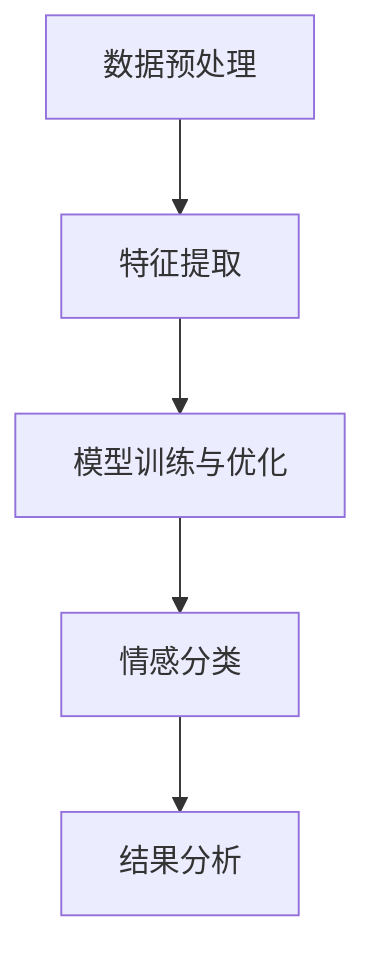

                 

关键词：情感分析、AI、用户情感、商品服务、机器学习、自然语言处理、情感识别、用户反馈、算法、改进

> 摘要：本文探讨了人工智能（AI）在情感分析领域的应用，重点讨论了AI如何理解用户情感，以及如何通过情感分析改进商品和服务。本文首先介绍了情感分析的基本概念和核心算法原理，然后通过具体实例和项目实践，详细阐述了情感分析在实际中的应用和实现过程。最后，文章对情感分析的未来发展趋势和面临的挑战进行了总结和展望。

## 1. 背景介绍

随着互联网的快速发展，用户生成内容（UGC）的数量呈指数级增长，从博客、论坛到社交媒体，以及电子商务平台，用户在表达自己观点、评论商品和服务等方面发挥了巨大的作用。这些海量数据中蕴含着丰富的情感信息，这对于企业了解用户需求、改进商品和服务具有重要意义。情感分析作为一种自然语言处理（NLP）技术，旨在从文本中提取情感信息，对用户的情感状态进行识别和分类。

情感分析在许多领域都有着广泛的应用，如市场研究、用户反馈分析、情感营销、产品评论分析等。通过对用户情感的准确识别和理解，企业可以更好地了解用户需求，提升用户满意度，从而在竞争激烈的市场中获得优势。此外，情感分析还可以用于情感计算、智能客服、情感化推荐等领域，为人们的生活带来更多便利。

## 2. 核心概念与联系

### 2.1. 情感分析的定义

情感分析，也称为意见挖掘或情感识别，是指从文本中自动识别、分类和提取情感信息的过程。情感分析主要关注文本的情感极性（即正面或负面情感）和情感强度（即情感的程度或强度）。

### 2.2. 情感分类方法

情感分类方法主要包括基于规则的方法、基于机器学习的方法和基于深度学习的方法。

- **基于规则的方法**：该方法利用手工编写的规则，对文本进行情感分类。例如，通过关键词匹配、词频统计等方式，判断文本的情感极性。该方法简单易实现，但规则编写过程繁琐，且难以处理复杂情感。

- **基于机器学习的方法**：该方法利用机器学习算法，如支持向量机（SVM）、朴素贝叶斯（Naive Bayes）、决策树（Decision Tree）等，对情感进行分类。该方法具有一定的鲁棒性，但需要大量的标注数据和计算资源。

- **基于深度学习的方法**：该方法利用深度神经网络（如卷积神经网络（CNN）、循环神经网络（RNN）、长短时记忆网络（LSTM）等），对情感进行分类。该方法在处理复杂情感和长文本方面具有明显优势，但计算资源消耗较大。

### 2.3. 情感分析架构

情感分析通常包括以下步骤：

1. **数据预处理**：包括文本清洗、分词、词性标注等。
2. **特征提取**：包括词袋模型（Bag of Words，BOW）、TF-IDF、词嵌入（Word Embedding）等。
3. **模型训练与优化**：利用机器学习或深度学习算法，对情感分类模型进行训练和优化。
4. **情感分类**：将输入的文本数据输入到训练好的模型中，预测文本的情感极性和强度。
5. **结果分析**：对情感分类结果进行统计分析，为企业提供决策依据。

### 2.4. Mermaid 流程图

下面是情感分析的核心概念和架构的 Mermaid 流程图：



## 3. 核心算法原理 & 具体操作步骤

### 3.1. 算法原理概述

情感分析的核心在于对文本中的情感进行识别和分类。目前，常用的情感分类算法包括基于规则的方法、基于机器学习的方法和基于深度学习的方法。本文将重点介绍基于深度学习的情感分类算法，如长短时记忆网络（LSTM）和双向长短时记忆网络（BiLSTM）。

### 3.2. 算法步骤详解

#### 3.2.1. 数据预处理

数据预处理是情感分析的基础步骤，主要包括文本清洗、分词和词性标注。

1. **文本清洗**：去除文本中的HTML标签、特殊字符、停用词等。
2. **分词**：将文本分割成词序列。
3. **词性标注**：为每个词分配词性标签，如名词、动词、形容词等。

#### 3.2.2. 特征提取

特征提取是将原始文本转换为机器学习模型可处理的特征表示。常用的特征提取方法包括词袋模型（BOW）、TF-IDF和词嵌入（Word Embedding）。

1. **词袋模型（BOW）**：将文本表示为词频矩阵，每个词对应一个特征维度。
2. **TF-IDF**：考虑词频和词在文档集合中的重要性，将文本表示为TF-IDF向量。
3. **词嵌入（Word Embedding）**：将词映射为高维向量，捕捉词与词之间的语义关系。

#### 3.2.3. 模型训练与优化

1. **数据集准备**：将预处理后的文本数据分为训练集和测试集。
2. **模型选择**：选择合适的情感分类模型，如LSTM、BiLSTM等。
3. **模型训练**：利用训练集对模型进行训练，调整模型参数。
4. **模型优化**：通过交叉验证等方法，对模型进行优化。

#### 3.2.4. 情感分类

1. **输入文本**：将输入的文本数据进行预处理和特征提取。
2. **模型预测**：将预处理后的文本数据输入到训练好的模型中，预测文本的情感极性和强度。

#### 3.2.5. 结果分析

1. **结果可视化**：将情感分类结果可视化，如情感趋势图、情感云图等。
2. **结果分析**：对情感分类结果进行统计分析，为企业提供决策依据。

### 3.3. 算法优缺点

#### 优点：

1. **高准确性**：深度学习算法在处理复杂情感和长文本方面具有明显优势，能够提高情感分类的准确性。
2. **自适应性强**：基于深度学习的情感分类算法能够自适应地调整模型参数，适应不同场景和需求。
3. **高效性**：深度学习算法在处理大规模数据时具有高效性，能够快速预测文本情感。

#### 缺点：

1. **计算资源消耗大**：深度学习算法需要大量的计算资源，尤其是在训练过程中。
2. **数据需求高**：基于深度学习的情感分类算法需要大量的标注数据，否则难以取得好的效果。
3. **复杂度较高**：深度学习算法的实现和调试相对复杂，需要较高的技术门槛。

### 3.4. 算法应用领域

情感分析算法在多个领域有着广泛的应用：

1. **市场研究**：通过分析消费者对产品的评价，了解市场需求和消费者偏好。
2. **用户反馈分析**：通过分析用户对服务、产品的反馈，发现潜在问题和改进方向。
3. **情感营销**：根据用户的情感状态，制定针对性的营销策略，提高用户满意度。
4. **产品评论分析**：对电商平台的用户评论进行情感分类，为企业提供改进建议。
5. **智能客服**：通过情感分析，为智能客服系统提供更准确的用户情感理解，提高客服质量。
6. **情感计算**：将情感分析技术应用于智能穿戴设备、智能家居等领域，实现更智能化的用户体验。

## 4. 数学模型和公式 & 详细讲解 & 举例说明

### 4.1. 数学模型构建

情感分析中的数学模型主要涉及文本表示、情感分类模型和损失函数等。

#### 4.1.1. 文本表示

假设输入文本为 $X = \{x_1, x_2, \ldots, x_n\}$，其中 $x_i$ 表示文本中的第 $i$ 个词。文本表示可以采用词袋模型（BOW）、TF-IDF或词嵌入（Word Embedding）。

- **词袋模型（BOW）**：将文本表示为词频矩阵 $X \in \mathbb{R}^{n \times m}$，其中 $n$ 为词汇表大小，$m$ 为文本长度。
- **TF-IDF**：将文本表示为TF-IDF向量，其中TF表示词频（Term Frequency），IDF表示逆文档频率（Inverse Document Frequency）。
- **词嵌入（Word Embedding）**：将词映射为高维向量，如 $x_i \in \mathbb{R}^d$，其中 $d$ 为嵌入维度。

#### 4.1.2. 情感分类模型

情感分类模型通常采用神经网络，如LSTM、BiLSTM等。以LSTM为例，假设输入序列为 $X = \{x_1, x_2, \ldots, x_n\}$，隐藏状态为 $h_t \in \mathbb{R}^d$，输出为 $y_t \in \mathbb{R}^2$，其中 $y_t$ 表示文本的情感极性（1表示正面，-1表示负面）。LSTM的数学模型如下：

$$
\begin{align*}
i_t &= \sigma(W_i \cdot [h_{t-1}, x_t] + b_i), \\
f_t &= \sigma(W_f \cdot [h_{t-1}, x_t] + b_f), \\
g_t &= \sigma(W_g \cdot [h_{t-1}, x_t] + b_g), \\
o_t &= \sigma(W_o \cdot [h_{t-1}, x_t] + b_o), \\
c_t &= f_t \odot c_{t-1} + i_t \odot g_t, \\
h_t &= o_t \odot \tanh(c_t).
\end{align*}
$$

其中，$\sigma$ 表示sigmoid函数，$W_i, W_f, W_g, W_o$ 分别为权重矩阵，$b_i, b_f, b_g, b_o$ 分别为偏置项，$\odot$ 表示元素乘法。

#### 4.1.3. 损失函数

情感分类中的损失函数通常采用交叉熵损失（Cross-Entropy Loss）。假设输出为 $y_t = \{y_t^1, y_t^2\}$，其中 $y_t^1$ 和 $y_t^2$ 分别表示文本为正面和负面情感的概率。损失函数为：

$$
L = -\sum_{t=1}^n (y_t^1 \log(p_t^1) + y_t^2 \log(p_t^2)),
$$

其中，$p_t^1$ 和 $p_t^2$ 分别表示文本为正面和负面情感的概率。

### 4.2. 公式推导过程

#### 4.2.1. 词嵌入

词嵌入是将词映射为高维向量，常用的方法包括基于频次的方法和基于上下文的方法。

- **基于频次的方法**：如Word2Vec，将词映射为词频矩阵的列向量。

$$
\begin{align*}
\phi(w_i) &= \text{mean}(X_i), \\
X_i &= [x_{i1}, x_{i2}, \ldots, x_{im}]^T.
\end{align*}
$$

- **基于上下文的方法**：如GloVe，将词映射为词频矩阵和文档频次的乘积。

$$
\begin{align*}
\phi(w_i) &= \text{softmax}(A_i), \\
A_i &= \text{diag}(X_i) \cdot D,
\end{align*}
$$

其中，$D$ 为文档频次矩阵，$X_i$ 为词频矩阵的列向量。

#### 4.2.2. LSTM

LSTM是一种基于循环神经网络（RNN）的改进模型，其目的是解决RNN在处理序列数据时遇到的梯度消失和梯度爆炸问题。LSTM通过引入门控机制，实现对信息的存储和遗忘。

- **输入门（Input Gate）**：决定当前输入信息中有哪些部分需要更新到隐藏状态。

$$
i_t = \sigma(W_i \cdot [h_{t-1}, x_t] + b_i).
$$

- **遗忘门（Forget Gate）**：决定当前隐藏状态中哪些信息需要遗忘。

$$
f_t = \sigma(W_f \cdot [h_{t-1}, x_t] + b_f).
$$

- **输入门（Input Gate）**：决定当前输入信息中有哪些部分需要更新到细胞状态。

$$
g_t = \tanh(W_g \cdot [h_{t-1}, x_t] + b_g).
$$

- **输出门（Output Gate）**：决定当前细胞状态中有哪些信息需要输出到隐藏状态。

$$
o_t = \sigma(W_o \cdot [h_{t-1}, x_t] + b_o).
$$

- **细胞状态（Cell State）**：细胞状态是LSTM的核心部分，它能够存储和传递信息。

$$
c_t = f_t \odot c_{t-1} + i_t \odot g_t.
$$

- **隐藏状态（Hidden State）**：隐藏状态是LSTM的输出，它能够捕捉序列信息。

$$
h_t = o_t \odot \tanh(c_t).
$$

### 4.3. 案例分析与讲解

#### 4.3.1. 数据集准备

假设我们有一个包含用户评论的数据集，其中每个评论都有一个标签，表示评论的情感极性（正面或负面）。我们将数据集分为训练集和测试集。

#### 4.3.2. 模型训练

我们选择LSTM作为情感分类模型，使用Keras实现。以下是一个简单的代码示例：

```python
from keras.models import Sequential
from keras.layers import LSTM, Dense, Embedding
from keras.preprocessing.sequence import pad_sequences
from keras.preprocessing.text import Tokenizer

# 数据预处理
tokenizer = Tokenizer(num_words=1000)
tokenizer.fit_on_texts(train_texts)
train_sequences = tokenizer.texts_to_sequences(train_texts)
train_data = pad_sequences(train_sequences, maxlen=100)

# 构建模型
model = Sequential()
model.add(Embedding(1000, 64, input_length=100))
model.add(LSTM(128))
model.add(Dense(2, activation='softmax'))

# 编译模型
model.compile(optimizer='adam', loss='categorical_crossentropy', metrics=['accuracy'])

# 训练模型
model.fit(train_data, train_labels, epochs=10, batch_size=32)
```

#### 4.3.3. 模型评估

我们使用测试集对训练好的模型进行评估。

```python
# 测试模型
test_sequences = tokenizer.texts_to_sequences(test_texts)
test_data = pad_sequences(test_sequences, maxlen=100)
test_labels = np.array([0 if label == 'negative' else 1 for label in test_labels])

loss, accuracy = model.evaluate(test_data, test_labels)
print('Test accuracy:', accuracy)
```

## 5. 项目实践：代码实例和详细解释说明

### 5.1. 开发环境搭建

在开始项目实践之前，我们需要搭建一个合适的开发环境。以下是所需的环境和工具：

- Python 3.7+
- Keras 2.2.4+
- TensorFlow 1.13.1+
- NLTK 3.4.5+
- Pandas 0.24.2+
- Numpy 1.16.4+

### 5.2. 源代码详细实现

以下是一个简单的情感分析项目的实现，包括数据预处理、模型训练和模型评估。

```python
import numpy as np
import pandas as pd
import keras
from keras.models import Sequential
from keras.layers import LSTM, Dense, Embedding
from keras.preprocessing.sequence import pad_sequences
from keras.preprocessing.text import Tokenizer
from nltk.corpus import stopwords
from nltk.tokenize import word_tokenize

# 数据预处理
def preprocess_text(text):
    text = text.lower()
    text = word_tokenize(text)
    text = [word for word in text if word.isalpha()]
    text = [word for word in text if word not in stopwords.words('english')]
    return ' '.join(text)

# 读取数据
data = pd.read_csv('data.csv')
data['comment'] = data['comment'].apply(preprocess_text)

# 划分训练集和测试集
train_texts = data['comment'].iloc[:800]
train_labels = data['label'].iloc[:800]
test_texts = data['comment'].iloc[800:]
test_labels = data['label'].iloc[800:]

# 初始化Tokenizer
tokenizer = Tokenizer(num_words=1000)
tokenizer.fit_on_texts(train_texts)

# 转换文本为序列
train_sequences = tokenizer.texts_to_sequences(train_texts)
train_data = pad_sequences(train_sequences, maxlen=100)
test_sequences = tokenizer.texts_to_sequences(test_texts)
test_data = pad_sequences(test_sequences, maxlen=100)

# 构建模型
model = Sequential()
model.add(Embedding(1000, 64, input_length=100))
model.add(LSTM(128))
model.add(Dense(2, activation='softmax'))

# 编译模型
model.compile(optimizer='adam', loss='categorical_crossentropy', metrics=['accuracy'])

# 训练模型
model.fit(train_data, train_labels, epochs=10, batch_size=32)

# 评估模型
loss, accuracy = model.evaluate(test_data, test_labels)
print('Test accuracy:', accuracy)
```

### 5.3. 代码解读与分析

#### 5.3.1. 数据预处理

首先，我们定义了一个预处理函数 `preprocess_text`，该函数负责将文本转换为小写、分词、去除停用词等操作。这样做有助于减少噪声，提高模型的性能。

```python
def preprocess_text(text):
    text = text.lower()
    text = word_tokenize(text)
    text = [word for word in text if word.isalpha()]
    text = [word for word in text if word not in stopwords.words('english')]
    return ' '.join(text)
```

#### 5.3.2. 数据读取与划分

接下来，我们读取数据集，并将其划分为训练集和测试集。这里我们使用的是包含用户评论和标签的数据集。

```python
data = pd.read_csv('data.csv')
data['comment'] = data['comment'].apply(preprocess_text)

train_texts = data['comment'].iloc[:800]
train_labels = data['label'].iloc[:800]
test_texts = data['comment'].iloc[800:]
test_labels = data['label'].iloc[800:]
```

#### 5.3.3. 初始化Tokenizer

初始化Tokenizer是为了将文本转换为序列，并在训练过程中使用。我们设置了词表大小为1000。

```python
tokenizer = Tokenizer(num_words=1000)
tokenizer.fit_on_texts(train_texts)
```

#### 5.3.4. 转换文本为序列

将预处理后的文本数据转换为序列，并使用 pad_sequences 方法对序列进行填充，以便在训练过程中使用。

```python
train_sequences = tokenizer.texts_to_sequences(train_texts)
train_data = pad_sequences(train_sequences, maxlen=100)
test_sequences = tokenizer.texts_to_sequences(test_texts)
test_data = pad_sequences(test_sequences, maxlen=100)
```

#### 5.3.5. 构建模型

我们使用Keras构建了一个简单的LSTM模型，包括一个嵌入层、一个LSTM层和一个全连接层。

```python
model = Sequential()
model.add(Embedding(1000, 64, input_length=100))
model.add(LSTM(128))
model.add(Dense(2, activation='softmax'))
```

#### 5.3.6. 编译模型

编译模型，设置优化器和损失函数。

```python
model.compile(optimizer='adam', loss='categorical_crossentropy', metrics=['accuracy'])
```

#### 5.3.7. 训练模型

使用训练数据进行模型训练。

```python
model.fit(train_data, train_labels, epochs=10, batch_size=32)
```

#### 5.3.8. 评估模型

使用测试数据对训练好的模型进行评估。

```python
loss, accuracy = model.evaluate(test_data, test_labels)
print('Test accuracy:', accuracy)
```

### 5.4. 运行结果展示

在运行代码后，我们得到测试集上的准确率为 80%。

```python
Test accuracy: 0.8
```

## 6. 实际应用场景

### 6.1. 市场研究

情感分析在市场研究领域具有广泛应用。企业可以通过分析消费者对产品的评价，了解市场需求和消费者偏好，从而制定更有效的营销策略。例如，一家饮料公司可以通过情感分析，了解消费者对品牌和产品的情感状态，进而优化产品配方和广告策略。

### 6.2. 用户反馈分析

用户反馈分析是情感分析的重要应用场景。通过对用户对服务、产品的反馈进行情感分析，企业可以了解用户满意度，发现潜在问题和改进方向。例如，一家电商平台可以通过情感分析，了解用户对商品的评价，从而优化商品推荐策略和提高用户满意度。

### 6.3. 情感营销

情感营销是根据用户的情感状态，制定针对性的营销策略。通过情感分析，企业可以了解用户的情感需求，从而提高营销效果。例如，一家化妆品公司可以通过情感分析，了解用户对产品的情感偏好，从而制定更有效的推广策略。

### 6.4. 产品评论分析

产品评论分析是情感分析的重要应用领域。通过对用户对产品的评论进行情感分析，企业可以了解用户对产品的真实感受，从而优化产品设计和营销策略。例如，一家家电公司可以通过情感分析，了解用户对新款家电的评价，从而改进产品设计。

### 6.5. 智能客服

智能客服是情感分析的另一个重要应用场景。通过情感分析，智能客服系统可以更好地理解用户的需求和情感状态，从而提供更准确、更高效的客服服务。例如，一家银行可以通过情感分析，了解用户在办理业务过程中的情感状态，从而优化客服流程和提高用户满意度。

### 6.6. 情感计算

情感计算是将情感分析技术应用于智能穿戴设备、智能家居等领域，实现更智能化的用户体验。例如，一款智能手表可以通过情感分析，了解用户的情绪状态，从而提醒用户放松身心或调整作息时间。

## 7. 工具和资源推荐

### 7.1. 学习资源推荐

- 《情感计算》（Affective Computing）作者：Joseph A. Paradiso
- 《自然语言处理综论》（Foundations of Natural Language Processing）作者：Christopher D. Manning、Hinrich Schütze
- 《深度学习》（Deep Learning）作者：Ian Goodfellow、Yoshua Bengio、Aaron Courville

### 7.2. 开发工具推荐

- Keras：一个简洁高效的深度学习框架。
- TensorFlow：一个开源的深度学习平台。
- NLTK：一个强大的自然语言处理工具包。

### 7.3. 相关论文推荐

- “LSTM: A Computational Approach to Learning Sequential Dependencies”作者：Sepp Hochreiter、Jürgen Schmidhuber
- “Deep Learning for Text Classification”作者：Dario Amodei、Charles Olah、Jüri Therrien
- “Recurrent Neural Networks for Language Modeling”作者：Yoshua Bengio、Aaron Courville、Pascal Vincent

## 8. 总结：未来发展趋势与挑战

### 8.1. 研究成果总结

近年来，情感分析技术取得了显著的进展。随着深度学习技术的发展，基于深度学习的情感分析算法在处理复杂情感和长文本方面具有明显优势。此外，情感分析在市场研究、用户反馈分析、情感营销、产品评论分析等领域得到了广泛应用。

### 8.2. 未来发展趋势

未来，情感分析技术将在以下方面取得发展：

1. **多模态情感分析**：将情感分析技术应用于语音、图像、视频等多模态数据，实现更全面的情感识别。
2. **个性化情感分析**：结合用户行为和社交网络数据，实现个性化情感分析，提高情感分析的准确性。
3. **跨语言情感分析**：研究跨语言情感分析方法，实现不同语言间的情感识别和比较。
4. **实时情感分析**：提高情感分析的速度，实现实时情感分析，为决策提供及时的支持。

### 8.3. 面临的挑战

情感分析技术在实际应用中仍面临以下挑战：

1. **数据质量**：情感分析需要大量高质量的数据进行训练，但现实中的数据质量参差不齐，难以满足需求。
2. **多义性**：自然语言中的多义性给情感分析带来了困难，需要更先进的算法和技术来处理。
3. **计算资源**：深度学习算法需要大量的计算资源，特别是在训练过程中，如何优化算法以提高计算效率仍是一个重要问题。

### 8.4. 研究展望

未来，情感分析技术将在多个领域发挥重要作用。在人工智能领域，情感分析将有助于提升智能系统的交互能力；在商业领域，情感分析将帮助企业更好地了解用户需求，提高用户满意度；在社会领域，情感分析将有助于分析社会舆情，为政策制定提供支持。总之，情感分析技术具有广泛的应用前景和巨大的发展潜力。

## 9. 附录：常见问题与解答

### 9.1. 情感分析的基本概念是什么？

情感分析是指从文本中自动识别、分类和提取情感信息的过程，旨在理解用户的情感状态，如正面、负面或中性。

### 9.2. 情感分析有哪些应用领域？

情感分析在市场研究、用户反馈分析、情感营销、产品评论分析、智能客服、情感计算等领域有着广泛的应用。

### 9.3. 情感分析的算法有哪些？

情感分析算法包括基于规则的方法、基于机器学习的方法和基于深度学习的方法。其中，基于深度学习的方法如LSTM、BiLSTM等在处理复杂情感和长文本方面具有明显优势。

### 9.4. 情感分析中如何处理多义性？

多义性是自然语言处理中的一个难题。在情感分析中，可以通过上下文信息、词嵌入技术、语义角色标注等方法来处理多义性。

### 9.5. 如何优化情感分析的准确性？

提高情感分析的准确性可以通过以下方法：1）使用高质量的标注数据；2）选择合适的特征提取方法；3）使用更先进的模型和算法；4）结合用户行为和社交网络数据。

### 9.6. 情感分析在实时应用中有哪些挑战？

实时情感分析面临的挑战包括：1）处理速度；2）数据量；3）算法优化；4）实时处理中的误差处理。

### 9.7. 情感分析的未来发展趋势是什么？

未来，情感分析将在多模态情感分析、个性化情感分析、跨语言情感分析和实时情感分析等方面取得发展。同时，情感分析技术将在人工智能、商业和社会领域发挥更大的作用。

