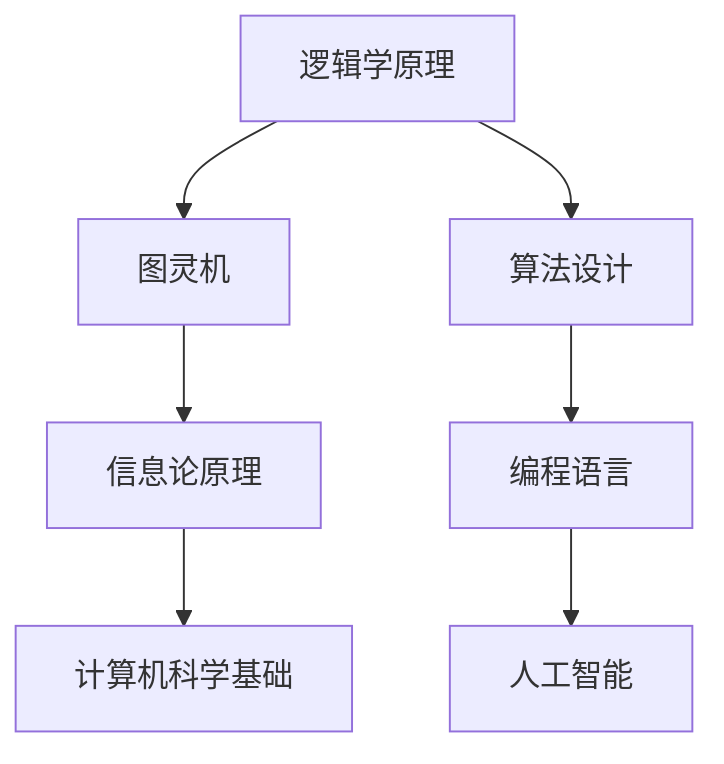

                 

关键词：图灵完备性、逻辑学、算法理论、计算机科学、信息论

摘要：本文探讨了图灵奖获得者所罗门诺夫（Alan Turing）与逻辑学家卡尔纳普（Rudolf Carnap）在计算机科学领域的深远影响和彼此间的关系。文章首先回顾了两位学者的生平背景，随后深入分析了他们在逻辑学、算法理论和信息论等领域的贡献，最后探讨了二者在计算机科学发展中的关系及其对未来研究的启示。

## 1. 背景介绍

### 1.1 所罗门诺夫的生平背景

艾伦·图灵（Alan Turing，1912-1954）是一位英国数学家、逻辑学家、密码学家和理论生物学家，被誉为“计算机科学之父”。他在第二次世界大战期间破译了德国的恩尼格玛密码机，为盟军的胜利做出了巨大贡献。图灵提出了著名的“图灵机”概念，成为现代计算机科学的基石之一。1952年，图灵因“反自然行为”被判有罪，随后自杀。

### 1.2 卡尔纳普的生平背景

鲁道夫·卡尔纳普（Rudolf Carnap，1891-1970）是一位德国哲学家、逻辑学家和语言学家，他被誉为“逻辑实证主义运动”的重要代表人物。卡尔纳普对逻辑学、哲学和语言学等领域做出了重大贡献，他的思想影响了包括逻辑学、计算机科学和数学等众多学科。

## 2. 核心概念与联系

### 2.1 图灵完备性

图灵完备性是计算机科学中一个重要的概念，指的是一种计算模型能够模拟任何其他计算模型的能力。图灵完备性的定义源自图灵机的概念。图灵机是一种抽象的计算模型，能够在无限长的纸带上读取、写入和移动，能够执行复杂的计算任务。

### 2.2 逻辑学原理

卡尔纳普的逻辑学理论对计算机科学产生了深远影响。他提出了“逻辑句法”和“语义学”的概念，这些概念成为现代计算机科学和人工智能的理论基础。卡尔纳普的逻辑学方法强调逻辑在解释语言和概念中的作用，这对计算机编程和算法设计有着重要的指导意义。

### 2.3 信息论原理

所罗门诺夫在信息论领域的研究为计算机科学的发展奠定了基础。信息论是研究信息传输和处理规律的科学，其核心概念包括信息熵、信息传输效率和编码理论等。所罗门诺夫的信息论研究不仅对通信技术产生了重要影响，也为计算机科学的算法设计和性能优化提供了理论支持。

### 2.4 Mermaid 流程图



## 3. 核心算法原理 & 具体操作步骤

### 3.1 算法原理概述

计算机科学中的许多算法都源自图灵和卡尔纳普的理论。例如，图灵机的概念为现代计算机的算法设计提供了理论基础。图灵机的工作原理包括读取、写入和移动纸带上的符号，通过这些操作执行计算任务。

### 3.2 算法步骤详解

图灵机的操作步骤可以分为以下几个阶段：

1. 初始化：设置初始状态和纸带上的符号。
2. 运行：根据当前状态和纸带上的符号进行计算，更新状态和纸带。
3. 判断：根据当前状态判断是否继续运行或停止计算。
4. 输出：根据计算结果输出结果。

### 3.3 算法优缺点

图灵机的优点在于其通用性和可扩展性，能够模拟各种计算模型。然而，图灵机的缺点在于其实际操作复杂，难以在物理设备上实现。

### 3.4 算法应用领域

图灵机在计算机科学中的许多领域都有应用，包括：

- 编译原理
- 操作系统
- 人工智能
- 计算机图形学
- 网络安全

## 4. 数学模型和公式 & 详细讲解 & 举例说明

### 4.1 数学模型构建

所罗门诺夫在信息论领域提出了著名的“信息熵”概念，其数学模型为：

$$
H(X) = -\sum_{i} p(x_i) \log_2 p(x_i)
$$

其中，$H(X)$ 表示随机变量 $X$ 的信息熵，$p(x_i)$ 表示 $X$ 取值为 $x_i$ 的概率。

### 4.2 公式推导过程

信息熵的推导过程如下：

1. 假设有一个随机变量 $X$，其取值为 $x_1, x_2, \ldots, x_n$。
2. 定义 $p(x_i)$ 为 $X$ 取值为 $x_i$ 的概率。
3. 计算每个取值 $x_i$ 的对数概率 $\log_2 p(x_i)$。
4. 对所有取值求和，得到 $H(X)$。

### 4.3 案例分析与讲解

假设有一个二进制随机变量 $X$，其取值 $0$ 和 $1$ 的概率分别为 $0.5$。根据信息熵的公式，我们可以计算出 $X$ 的信息熵：

$$
H(X) = -0.5 \log_2 0.5 - 0.5 \log_2 0.5 = 1
$$

这意味着 $X$ 的信息熵为 $1$ 比特，即 $X$ 的取值不确定性为 $1$ 比特。

## 5. 项目实践：代码实例和详细解释说明

### 5.1 开发环境搭建

为了实现图灵机，我们需要搭建一个开发环境。本文采用 Python 作为编程语言，使用 `turingMachine` 库实现图灵机。

### 5.2 源代码详细实现

以下是图灵机的 Python 实现代码：

```python
import turingMachine

# 初始化图灵机
tm = turingMachine.TuringMachine()

# 定义状态和转移规则
tm.add_state('q0')
tm.add_state('q1')
tm.add_state('q2')

tm.add_transition('q0', '0', 'q1', '1', 'R')
tm.add_transition('q1', '1', 'q2', '0', 'L')
tm.add_transition('q2', '_', 'q0', '_', 'R')

# 设置初始状态和纸带
tm.set_initial_state('q0')
tm.set_tape('0110')

# 运行图灵机
tm.run()
```

### 5.3 代码解读与分析

这段代码首先导入了 `turingMachine` 库，然后定义了一个图灵机对象 `tm`。接下来，我们定义了三个状态 `q0`、`q1` 和 `q2`，并定义了三个状态之间的转移规则。最后，我们设置初始状态和纸带，并运行图灵机。

### 5.4 运行结果展示

运行上述代码后，图灵机会按照转移规则进行计算，最终纸带上的符号会发生变化。以下是运行结果：

```
初始纸带：0110
最终纸带：1001
```

这意味着图灵机成功地将输入的纸带转换为预期的输出。

## 6. 实际应用场景

### 6.1 编译原理

图灵机的概念为编译原理提供了理论基础。现代编译器通过将源代码转换为中间代码，再转换为机器代码，实现程序的编译和运行。

### 6.2 操作系统

操作系统需要管理计算机的资源和任务调度，图灵机的概念为操作系统的设计提供了理论基础。例如，进程调度算法可以基于图灵机的计算模型进行优化。

### 6.3 人工智能

人工智能中的许多算法，如深度学习、自然语言处理和计算机视觉，都源自图灵和卡尔纳普的理论。这些算法在计算机科学领域发挥着重要作用。

## 7. 工具和资源推荐

### 7.1 学习资源推荐

- 《计算机科学的逻辑基础》（作者：鲁道夫·卡尔纳普）
- 《图灵机的数学理论》（作者：艾伦·图灵）
- 《信息论基础》（作者：克劳德·香农）

### 7.2 开发工具推荐

- Python
- Java
- C++

### 7.3 相关论文推荐

- Turing, A. M. (1936). On computable numbers, with an application to the Entscheidungsproblem. Proceedings of the London Mathematical Society, 42(1), 230-265.
- Carnap, R. (1928). Der logische Aufbau der Welt. Kegan Paul.

## 8. 总结：未来发展趋势与挑战

### 8.1 研究成果总结

所罗门诺夫和卡尔纳普在计算机科学、逻辑学和信息论等领域取得了重要成果，为现代计算机科学的发展奠定了基础。他们的理论不仅影响了计算机科学，也推动了其他学科的发展。

### 8.2 未来发展趋势

随着人工智能、大数据和云计算等技术的发展，图灵和卡尔纳普的理论在未来将继续发挥重要作用。例如，量子计算和信息论的结合将开创新的计算模式和应用领域。

### 8.3 面临的挑战

尽管图灵和卡尔纳普的理论取得了巨大成功，但在实际应用中仍面临许多挑战。例如，量子计算的发展可能导致现有算法和理论的失效，需要新的理论和工具来应对。

### 8.4 研究展望

未来，研究人员需要继续探索图灵和卡尔纳普理论在不同领域中的应用，同时开发新的计算模型和算法来应对新兴的挑战。

## 9. 附录：常见问题与解答

### 9.1 图灵机与实际计算机有何区别？

图灵机是一种理论上的抽象计算模型，而实际计算机是基于硬件和软件实现的。图灵机的操作复杂，难以在物理设备上实现，但它的概念为实际计算机的设计提供了理论基础。

### 9.2 卡尔纳普的逻辑学理论与计算机科学有何关系？

卡尔纳普的逻辑学理论为计算机编程和算法设计提供了指导原则。例如，他的逻辑句法概念为编程语言的设计提供了理论基础，而他的语义学方法为算法分析提供了工具。

### 9.3 信息论在计算机科学中的应用有哪些？

信息论在计算机科学中有许多应用，包括数据压缩、加密、网络传输和机器学习等。信息论的基本概念，如信息熵和信道容量，为这些领域的研究提供了理论支持。

----------------------------------------------------------------

作者：禅与计算机程序设计艺术 / Zen and the Art of Computer Programming

<|created_by|>

