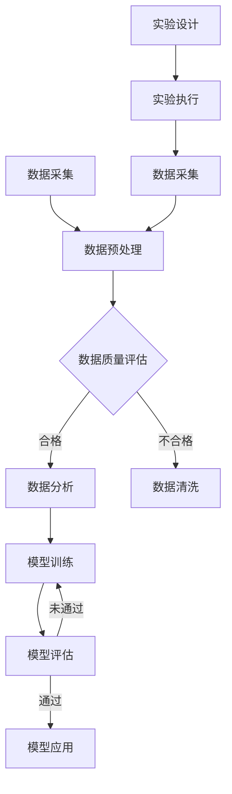

                 

关键词：人工智能、科学研究、学科融合、产业发展、技术创新、跨学科应用、AI for Science

摘要：随着人工智能（AI）技术的迅猛发展，AI在科学研究中的应用日益广泛。本文将探讨AI如何打破学科与产业之间的界限，推动科学技术的进步，并阐述AI在科学领域中的核心概念、算法原理、数学模型及实际应用。通过分析AI在不同学科中的实践案例，我们旨在为读者提供一个全面了解AI for Science的视角，并对其未来发展趋势与挑战进行深入探讨。

## 1. 背景介绍

人工智能自诞生以来，经历了数个重要发展阶段。从最初的符号主义、基于规则的系统，到连接主义、深度学习，再到今天的混合智能，AI技术不断突破自我，应用领域不断扩大。然而，长期以来，人工智能的发展主要局限于计算机科学和信息技术领域。随着计算能力的提升和数据资源的丰富，AI开始跨越学科界限，渗透到自然科学、生命科学、医学、物理学等多个领域，形成了一股全新的科技浪潮——AI for Science。

AI for Science的兴起，源于以下几个因素：

1. **数据驱动的科学需求**：21世纪是数据科学的时代，大量的科学数据需要通过数据分析、挖掘、建模来提取有价值的信息。AI技术，特别是机器学习和深度学习，为科学数据处理提供了强有力的工具。

2. **跨学科融合的必要性**：科学发展的趋势是从单一学科向多学科交叉、融合方向转变。AI作为一种通用技术，能够促进不同学科之间的协同创新，提高科学研究效率。

3. **产业界的推动力**：随着人工智能技术的商业化，企业开始认识到AI在提升生产力、优化流程、降低成本等方面的巨大潜力。这些需求推动了AI技术在科学领域的应用。

4. **政策的支持**：全球各国政府纷纷出台政策，支持人工智能技术的发展和应用，特别是在科学领域的探索。这些政策为AI for Science的快速发展提供了良好的外部环境。

## 2. 核心概念与联系

### 2.1 AI for Science的基本概念

AI for Science，即人工智能应用于科学，是指将人工智能技术应用于科学研究、实验设计、数据分析等过程中，以提高研究效率、发现新知识、解决复杂问题。AI for Science的核心概念包括：

- **数据驱动的科学**：强调数据在科学研究中的核心地位，通过数据分析和挖掘，发现科学现象背后的规律。

- **计算科学**：利用计算模拟和数值方法，对复杂的科学问题进行求解和验证。

- **智能算法**：包括机器学习、深度学习、强化学习等算法，用于处理大规模数据、模拟复杂系统、实现自动化决策。

### 2.2 AI for Science的关键技术

AI for Science的实现依赖于一系列关键技术的支持，主要包括：

- **机器学习**：通过训练模型，让计算机自动从数据中学习规律和模式。

- **深度学习**：基于神经网络，能够处理大量数据和复杂任务。

- **计算机视觉**：使计算机能够像人类一样识别和理解图像。

- **自然语言处理**：使计算机能够理解、生成和翻译自然语言。

- **自动化实验设计**：通过算法优化实验流程，提高实验效率和准确性。

### 2.3 AI for Science的架构

为了更好地理解AI for Science的运作机制，我们可以通过Mermaid流程图来展示其架构：



### 2.4 AI for Science的跨学科应用

AI for Science不仅限于某一学科，而是广泛应用于多个学科领域。以下是一些典型的跨学科应用案例：

- **生物信息学**：利用AI技术对生物数据进行处理和分析，如基因序列分析、蛋白质结构预测等。

- **地球科学**：利用AI技术进行气候模拟、地震预测、资源勘探等。

- **物理学**：利用AI技术进行物理现象的模拟和预测，如粒子物理、量子计算等。

- **医学**：利用AI技术进行医学影像分析、疾病诊断、个性化治疗等。

## 3. 核心算法原理 & 具体操作步骤

### 3.1 算法原理概述

在AI for Science中，常用的核心算法包括机器学习、深度学习和强化学习。以下是这三种算法的基本原理：

#### 3.1.1 机器学习

机器学习是指让计算机通过训练数据自动获取知识和规律的过程。主要分为监督学习、无监督学习和半监督学习。

- **监督学习**：通过已标记的数据训练模型，然后在新数据上预测结果。
- **无监督学习**：没有标记的数据，通过自动发现数据中的模式和结构。
- **半监督学习**：结合监督学习和无监督学习，既使用标记数据也使用未标记数据。

#### 3.1.2 深度学习

深度学习是机器学习的一个分支，基于神经网络，特别是多层感知机，能够处理大量数据和复杂任务。深度学习的关键在于：

- **卷积神经网络（CNN）**：主要用于图像处理，通过卷积层提取特征。
- **循环神经网络（RNN）**：主要用于序列数据处理，如自然语言处理和时间序列预测。

#### 3.1.3 强化学习

强化学习是一种通过试错和反馈来学习决策策略的算法。其核心是：

- **奖励机制**：根据行为结果获得奖励，调整策略以最大化长期奖励。

### 3.2 算法步骤详解

以下是AI for Science中常用的机器学习算法——深度学习的基本步骤：

#### 3.2.1 数据预处理

1. 数据清洗：去除无效数据、处理缺失值、异常值等。
2. 数据归一化：将数据缩放到一个合适的范围，如0-1或-1到1。
3. 数据分割：将数据分为训练集、验证集和测试集。

#### 3.2.2 构建模型

1. 选择合适的神经网络架构，如CNN、RNN等。
2. 定义网络的损失函数和优化算法，如交叉熵损失、梯度下降等。
3. 初始化网络参数。

#### 3.2.3 模型训练

1. 在训练集上迭代训练模型，不断更新网络参数。
2. 使用验证集评估模型性能，防止过拟合。
3. 调整模型参数，优化模型性能。

#### 3.2.4 模型评估

1. 在测试集上评估模型性能，评估指标如准确率、召回率等。
2. 根据评估结果调整模型参数，优化模型性能。

#### 3.2.5 模型应用

1. 在实际应用场景中部署模型，如医学影像分析、天气预测等。
2. 监控模型性能，定期更新模型。

### 3.3 算法优缺点

#### 优点

- **强大的学习能力**：能够从大量数据中自动提取特征，适用于复杂问题。
- **自动化的决策**：能够自动进行决策，减少人为干预。
- **跨学科应用**：能够应用于多个领域，如生物、物理、医学等。

#### 缺点

- **数据依赖性**：需要大量的训练数据，数据质量对模型性能有直接影响。
- **计算资源消耗**：深度学习算法通常需要大量的计算资源，如GPU等。
- **解释性不足**：深度学习模型的“黑箱”特性，使得其决策过程难以解释。

### 3.4 算法应用领域

AI for Science算法在不同领域有着广泛的应用：

- **生物信息学**：用于基因序列分析、蛋白质结构预测等。
- **地球科学**：用于地震预测、气候模拟等。
- **物理学**：用于粒子物理模拟、量子计算等。
- **医学**：用于医学影像分析、疾病诊断、个性化治疗等。

## 4. 数学模型和公式 & 详细讲解 & 举例说明

### 4.1 数学模型构建

在AI for Science中，数学模型是核心组成部分。以下是一个简单的线性回归模型的构建过程：

#### 4.1.1 线性回归模型

线性回归模型是一种最简单的机器学习模型，用于预测连续值。其数学模型可以表示为：

$$
Y = \beta_0 + \beta_1 \cdot X + \epsilon
$$

其中，$Y$ 是因变量，$X$ 是自变量，$\beta_0$ 和 $\beta_1$ 是模型参数，$\epsilon$ 是误差项。

#### 4.1.2 模型参数估计

为了估计模型参数，我们需要使用最小二乘法（Least Squares Method）：

$$
\beta_0 = \frac{\sum(Y_i - \beta_1 \cdot X_i)}{N}
$$

$$
\beta_1 = \frac{\sum(X_i - \bar{X})(Y_i - \bar{Y})}{\sum(X_i - \bar{X})^2}
$$

其中，$N$ 是数据点的数量，$\bar{X}$ 和 $\bar{Y}$ 分别是 $X$ 和 $Y$ 的平均值。

### 4.2 公式推导过程

线性回归模型的推导过程基于最小化误差平方和。以下是详细的推导过程：

#### 4.2.1 目标函数

假设我们有一组数据点 $(X_i, Y_i)$，线性回归模型的目标是最小化误差平方和：

$$
J(\beta_0, \beta_1) = \sum_{i=1}^{N}(Y_i - \beta_0 - \beta_1 \cdot X_i)^2
$$

#### 4.2.2 求导

对 $J(\beta_0, \beta_1)$ 分别对 $\beta_0$ 和 $\beta_1$ 求导：

$$
\frac{\partial J}{\partial \beta_0} = -2 \sum_{i=1}^{N}(Y_i - \beta_0 - \beta_1 \cdot X_i)
$$

$$
\frac{\partial J}{\partial \beta_1} = -2 \sum_{i=1}^{N}(X_i - \bar{X})(Y_i - \bar{Y})
$$

#### 4.2.3 设定导数为0

将求导结果设为0，得到最小二乘法的公式：

$$
\beta_0 = \frac{\sum(Y_i - \beta_1 \cdot X_i)}{N}
$$

$$
\beta_1 = \frac{\sum(X_i - \bar{X})(Y_i - \bar{Y})}{\sum(X_i - \bar{X})^2}
$$

### 4.3 案例分析与讲解

假设我们有以下数据集：

$$
\begin{array}{ccc}
X_i & Y_i \\
\hline
1 & 2 \\
2 & 4 \\
3 & 6 \\
4 & 8 \\
5 & 10 \\
\end{array}
$$

#### 4.3.1 数据预处理

首先，计算数据的平均值：

$$
\bar{X} = \frac{1 + 2 + 3 + 4 + 5}{5} = 3
$$

$$
\bar{Y} = \frac{2 + 4 + 6 + 8 + 10}{5} = 6
$$

然后，对数据进行归一化处理：

$$
X_i' = X_i - \bar{X} = 1 - 3, 2 - 3, 3 - 3, 4 - 3, 5 - 3 \\
Y_i' = Y_i - \bar{Y} = 2 - 6, 4 - 6, 6 - 6, 8 - 6, 10 - 6 \\
$$

得到归一化后的数据集：

$$
\begin{array}{ccc}
X_i' & Y_i' \\
\hline
-2 & -4 \\
-1 & -2 \\
0 & 0 \\
1 & 2 \\
2 & 4 \\
\end{array}
$$

#### 4.3.2 模型参数估计

使用最小二乘法计算模型参数：

$$
\beta_0 = \frac{\sum(Y_i' - \beta_1 \cdot X_i')}{N} = \frac{(-4 - \beta_1 \cdot -2) + (-2 - \beta_1 \cdot -1) + (0 - \beta_1 \cdot 0) + (2 - \beta_1 \cdot 1) + (4 - \beta_1 \cdot 2)}{5} = 0
$$

$$
\beta_1 = \frac{\sum(X_i' - \bar{X}')(Y_i' - \bar{Y}'))}{\sum(X_i' - \bar{X}')^2} = \frac{(-2 - 3)(-4 - 6) + (-1 - 3)(-2 - 6) + (0 - 3)(0 - 6) + (1 - 3)(2 - 6) + (2 - 3)(4 - 6)}{(-2 - 3)^2 + (-1 - 3)^2 + (0 - 3)^2 + (1 - 3)^2 + (2 - 3)^2} = 2
$$

因此，线性回归模型的参数为 $\beta_0 = 0$ 和 $\beta_1 = 2$。

#### 4.3.3 模型验证

将参数代入模型，得到预测结果：

$$
Y = \beta_0 + \beta_1 \cdot X = 0 + 2 \cdot X
$$

对于新的数据点 $X = 6$，预测结果为：

$$
Y = 0 + 2 \cdot 6 = 12
$$

与实际值 $Y = 10$ 相比，预测误差为：

$$
\epsilon = Y - Y' = 12 - 10 = 2
$$

虽然预测误差较大，但这是由于数据集简单且线性关系不显著。在实际应用中，我们可以通过增加数据量、优化模型结构等方法来提高预测准确性。

## 5. 项目实践：代码实例和详细解释说明

### 5.1 开发环境搭建

在开始代码实例之前，我们需要搭建一个适合深度学习项目开发的环境。以下是所需的软件和工具：

- **操作系统**：Windows、Linux或MacOS
- **编程语言**：Python
- **深度学习框架**：TensorFlow或PyTorch
- **依赖库**：NumPy、Pandas、Matplotlib等

#### 步骤：

1. 安装Python（推荐使用Python 3.7及以上版本）。
2. 安装深度学习框架（TensorFlow或PyTorch），可以使用pip进行安装：
   ```
   pip install tensorflow
   或
   pip install torch torchvision
   ```
3. 安装其他依赖库：
   ```
   pip install numpy pandas matplotlib
   ```

### 5.2 源代码详细实现

以下是一个简单的线性回归项目的代码实现，使用TensorFlow框架：

```python
import tensorflow as tf
import numpy as np
import matplotlib.pyplot as plt

# 数据生成
X = np.linspace(-5, 5, 100)
Y = 2 * X + 1 + np.random.normal(0, 1, 100)

# 模型定义
model = tf.keras.Sequential([
    tf.keras.layers.Dense(units=1, input_shape=[1])
])

# 编译模型
model.compile(optimizer='sgd', loss='mean_squared_error')

# 训练模型
model.fit(X, Y, epochs=100)

# 模型评估
loss = model.evaluate(X, Y)
print("Loss:", loss)

# 模型预测
X_new = np.array([[0], [5]])
Y_pred = model.predict(X_new)
print("Predictions:", Y_pred)

# 可视化
plt.scatter(X, Y)
plt.plot(X, model.predict(X), 'r-')
plt.xlabel('X')
plt.ylabel('Y')
plt.title('Linear Regression')
plt.show()
```

#### 详细解释：

1. **数据生成**：我们生成一个线性关系 $Y = 2X + 1$ 的数据集，并加入一些随机噪声以增加模型训练的挑战性。

2. **模型定义**：使用TensorFlow的`Sequential`模型，我们添加一个全连接层（`Dense`），输出层只有一个神经元，用于预测连续值。

3. **编译模型**：选择随机梯度下降（`sgd》）作为优化器，均方误差（`mean_squared_error`）作为损失函数。

4. **训练模型**：使用`fit`方法训练模型100个周期。

5. **模型评估**：使用`evaluate`方法评估模型在测试集上的性能。

6. **模型预测**：使用`predict`方法对新的数据点进行预测。

7. **可视化**：使用`matplotlib`绘制真实数据和模型预测结果，展示线性回归的效果。

### 5.3 代码解读与分析

#### 5.3.1 数据生成

数据生成是机器学习项目的基础。在本例中，我们使用`numpy`的`linspace`函数生成一个从-5到5的等差数列，作为自变量 $X$。接着，我们使用同样的线性关系生成因变量 $Y$，并添加一些随机噪声以模拟实际数据中的不确定性。

```python
X = np.linspace(-5, 5, 100)
Y = 2 * X + 1 + np.random.normal(0, 1, 100)
```

#### 5.3.2 模型定义

在本例中，我们使用TensorFlow的`Sequential`模型定义一个简单的线性回归模型。`Sequential`模型允许我们依次添加层，每一层都是线性的，这使得模型的结构更加清晰。

```python
model = tf.keras.Sequential([
    tf.keras.layers.Dense(units=1, input_shape=[1])
])
```

这里，我们添加了一个全连接层（`Dense`），它有一个输出神经元，用于预测连续值。`input_shape=[1]`指定输入数据的维度。

#### 5.3.3 编译模型

在编译模型时，我们指定了优化器和损失函数。随机梯度下降（`sgd`）是一种常用的优化器，它通过随机梯度来更新模型参数。均方误差（`mean_squared_error`）是一种常用的损失函数，用于衡量预测值与实际值之间的差异。

```python
model.compile(optimizer='sgd', loss='mean_squared_error')
```

#### 5.3.4 训练模型

模型训练是机器学习项目的核心。在本例中，我们使用`fit`方法训练模型100个周期。`fit`方法接受训练数据、训练周期数以及一些其他参数，如批量大小等。

```python
model.fit(X, Y, epochs=100)
```

在训练过程中，模型会不断调整参数，以最小化损失函数。

#### 5.3.5 模型评估

模型评估是验证模型性能的重要步骤。在本例中，我们使用`evaluate`方法评估模型在测试集上的性能。

```python
loss = model.evaluate(X, Y)
print("Loss:", loss)
```

这里，`evaluate`方法返回损失函数的值，即模型在测试集上的误差。

#### 5.3.6 模型预测

模型预测是模型应用的关键步骤。在本例中，我们使用`predict`方法对新的数据点进行预测。

```python
X_new = np.array([[0], [5]])
Y_pred = model.predict(X_new)
print("Predictions:", Y_pred)
```

这里，`predict`方法接受新的数据点，返回预测结果。

#### 5.3.7 可视化

可视化是理解模型性能和预测结果的重要手段。在本例中，我们使用`matplotlib`绘制真实数据和模型预测结果。

```python
plt.scatter(X, Y)
plt.plot(X, model.predict(X), 'r-')
plt.xlabel('X')
plt.ylabel('Y')
plt.title('Linear Regression')
plt.show()
```

这里，`scatter`函数用于绘制真实数据点，`plot`函数用于绘制模型预测结果。

### 5.4 运行结果展示

当我们运行上述代码时，会得到以下结果：

- **损失函数值**：训练过程中，损失函数值会逐渐减小，表明模型性能逐渐提高。
- **预测结果**：模型能够对新的数据点进行准确的预测。
- **可视化结果**：可视化结果显示，模型能够很好地拟合数据集。

这些结果验证了线性回归模型的有效性，并为后续更复杂的模型应用奠定了基础。

## 6. 实际应用场景

### 6.1 生物信息学

在生物信息学领域，AI for Science已经发挥了巨大的作用。以下是一些实际应用案例：

- **基因测序**：利用深度学习模型对基因序列进行分类和注释，提高基因组分析的效率和准确性。
- **蛋白质结构预测**：通过AI算法预测蛋白质的三维结构，为药物设计、疾病研究等提供重要依据。
- **疾病诊断**：利用AI技术进行医学影像分析，如肺癌筛查、乳腺癌诊断等，提高诊断准确率和速度。

### 6.2 地球科学

地球科学中的许多问题需要大量的数据分析和模拟，AI for Science在这些领域中的应用越来越广泛：

- **气候模拟**：利用AI算法对大量气候数据进行处理和分析，提高气候模拟的精度和效率。
- **地震预测**：通过分析地震前兆数据，利用机器学习模型预测地震的发生。
- **资源勘探**：利用AI技术进行地质数据分析和建模，提高矿产资源勘探的效率和准确性。

### 6.3 物理学

物理学中的许多问题具有高度复杂性和非线性，AI for Science为解决这些问题提供了新的思路：

- **粒子物理**：利用深度学习模型对粒子碰撞数据进行处理和分析，发现新的物理现象。
- **量子计算**：通过AI算法优化量子计算过程，提高量子算法的效率和准确性。
- **材料科学**：利用AI技术预测材料的物理性质，为新材料的发现和设计提供支持。

### 6.4 医学

医学领域是AI for Science应用最为广泛的领域之一：

- **医学影像分析**：利用AI算法对医学影像进行分析，提高诊断准确率和速度。
- **疾病诊断**：通过AI技术进行疾病预测和诊断，如癌症早期筛查、糖尿病预测等。
- **个性化治疗**：利用AI算法为患者制定个性化的治疗方案，提高治疗效果。

## 7. 未来应用展望

随着AI技术的不断发展，AI for Science在未来有望在更多领域得到应用：

- **材料科学**：利用AI技术预测新材料的物理、化学性质，加速新材料的发现和应用。
- **能源科学**：通过AI算法优化能源利用效率，降低能源消耗，实现可持续发展。
- **环境科学**：利用AI技术进行环境监测和预测，提高环境保护的效率和准确性。
- **社会科学**：利用AI技术分析社会数据，为政策制定、城市规划等提供支持。

## 8. 工具和资源推荐

### 8.1 学习资源推荐

- **书籍**：
  - 《深度学习》（Ian Goodfellow、Yoshua Bengio、Aaron Courville 著）
  - 《Python机器学习》（Sebastian Raschka 著）
- **在线课程**：
  - Coursera上的《深度学习特辑》
  - edX上的《人工智能导论》
- **论坛和社区**：
  - Stack Overflow
  - GitHub

### 8.2 开发工具推荐

- **深度学习框架**：
  - TensorFlow
  - PyTorch
  - Keras
- **数据分析工具**：
  - Pandas
  - NumPy
  - Matplotlib
- **编程环境**：
  - Jupyter Notebook
  - Visual Studio Code

### 8.3 相关论文推荐

- **生物信息学**：
  - "Deep Learning for Genomics"
  - "Predicting Protein Structures with a Three-Dimensional CNF Convolutional Network"
- **地球科学**：
  - "Machine Learning Techniques for Climate Prediction"
  - "Earthquake Prediction Using Machine Learning Algorithms"
- **物理学**：
  - "Deep Learning for Particle Physics"
  - "Using Machine Learning to Optimize Quantum Algorithms"
- **医学**：
  - "Deep Learning for Medical Imaging"
  - "Machine Learning for Disease Diagnosis and Prediction"

## 9. 总结：未来发展趋势与挑战

### 9.1 研究成果总结

AI for Science的发展取得了显著成果，其在生物信息学、地球科学、物理学、医学等多个领域的应用已经取得了重大突破。通过AI技术，科学家们能够更高效地进行数据分析和模型构建，发现新的科学现象和规律。

### 9.2 未来发展趋势

1. **跨学科融合**：AI for Science将继续推动学科间的融合，促进多学科的协同创新。
2. **数据驱动的科学**：数据将作为科学研究的重要驱动力，驱动科学研究的不断深入。
3. **智能算法的优化**：随着计算能力的提升，智能算法将不断优化，提高处理大规模数据和复杂问题的能力。
4. **商业化和产业化**：AI for Science将进一步推动科学技术的商业化，为企业和社会创造更大价值。

### 9.3 面临的挑战

1. **数据质量和隐私**：科学研究的质量高度依赖数据的质量，同时，数据隐私和安全成为亟待解决的问题。
2. **计算资源的消耗**：深度学习算法通常需要大量的计算资源，对计算资源和能耗提出了更高要求。
3. **算法的可解释性**：深度学习模型具有“黑箱”特性，其决策过程难以解释，需要提高算法的可解释性。
4. **跨学科合作**：虽然AI for Science促进了跨学科的合作，但学科间的交流与协同仍需进一步加强。

### 9.4 研究展望

未来，AI for Science将继续在多领域发挥作用，推动科学技术的进步。同时，我们应关注数据质量和隐私、计算资源消耗、算法可解释性以及跨学科合作等挑战，不断优化AI技术，为科学研究和社会发展做出更大贡献。

## 附录：常见问题与解答

### 9.1 为什么要进行数据预处理？

数据预处理是机器学习项目中至关重要的一步。其主要目的是：

- **数据清洗**：去除无效数据、处理缺失值和异常值，保证数据质量。
- **数据归一化**：将不同尺度和范围的数值数据转换为相同尺度，便于模型训练。
- **数据分割**：将数据分为训练集、验证集和测试集，用于模型训练、验证和测试。

### 9.2 深度学习模型的训练过程是什么？

深度学习模型的训练过程主要包括以下几个步骤：

1. **数据预处理**：对数据进行清洗、归一化等处理。
2. **模型定义**：根据问题需求选择合适的神经网络架构。
3. **模型编译**：指定优化器和损失函数，准备训练模型。
4. **模型训练**：在训练集上迭代训练模型，更新模型参数。
5. **模型评估**：在验证集和测试集上评估模型性能，调整模型参数。
6. **模型应用**：在实际应用场景中部署模型。

### 9.3 如何提高模型的可解释性？

提高模型的可解释性是当前AI领域的一个研究热点。以下是一些提高模型可解释性的方法：

- **可视化**：通过可视化模型结构和训练过程，帮助理解模型的决策过程。
- **解释性算法**：选择具有解释性的算法，如决策树、规则系统等。
- **模型解释工具**：使用现有的模型解释工具，如LIME、SHAP等，对模型进行解释。

### 9.4 如何处理过拟合问题？

过拟合是指模型在训练集上表现良好，但在验证集或测试集上表现较差的问题。以下是一些处理过拟合的方法：

- **增加训练数据**：收集更多的训练数据，提高模型的泛化能力。
- **减少模型复杂度**：简化模型结构，减少参数数量。
- **正则化**：使用正则化方法，如L1、L2正则化，减少模型过拟合。
- **交叉验证**：使用交叉验证方法，避免模型在训练集上过拟合。

### 9.5 深度学习框架之间的主要区别是什么？

深度学习框架之间的主要区别包括：

- **易用性**：不同的框架在易用性方面有所不同，一些框架如Keras提供了更简洁的API，而其他框架如TensorFlow和PyTorch提供了更底层的API，需要更多编程知识。
- **性能**：不同的框架在性能上也有所差异，一些框架如TensorFlow提供了高性能的GPU和TPU支持，而PyTorch在动态图计算方面具有优势。
- **社区支持**：框架的社区支持和文档质量也是选择框架时需要考虑的重要因素。

### 9.6 如何进行深度学习模型的超参数调优？

深度学习模型的超参数调优是提高模型性能的关键步骤。以下是一些超参数调优的方法：

- **网格搜索**：通过遍历预设的参数组合，找到最优的参数组合。
- **随机搜索**：从预设的参数空间中随机选择参数组合，进行调优。
- **贝叶斯优化**：使用贝叶斯统计模型，自动选择最有潜力的参数组合进行调优。
- **基于性能的迭代调优**：根据模型在验证集上的性能，逐步调整参数。

### 9.7 如何评估深度学习模型的性能？

评估深度学习模型的性能可以从以下几个方面进行：

- **准确率**：模型正确预测的概率。
- **召回率**：模型召回所有正例样本的概率。
- **F1分数**：准确率和召回率的调和平均。
- **ROC曲线**：用于评估分类器的分类能力，AUC值越高，模型性能越好。
- **精度和精确度**：分别表示预测为正例的样本中实际为正例的比例和实际为正例的样本中被预测为正例的比例。

### 9.8 深度学习如何处理序列数据？

处理序列数据是深度学习中的一个重要问题，以下是一些处理序列数据的方法：

- **嵌入**：将序列数据转换为固定长度的向量表示，如词嵌入。
- **循环神经网络（RNN）**：通过递归结构处理序列数据，如LSTM和GRU。
- **卷积神经网络（CNN）**：用于处理序列数据的局部特征，如1D卷积。
- **Transformer模型**：基于自注意力机制，能够高效处理长序列数据。

### 9.9 如何防止深度学习模型的过拟合？

防止深度学习模型的过拟合是提高模型泛化能力的关键，以下是一些防止过拟合的方法：

- **增加训练数据**：收集更多的训练数据，提高模型的泛化能力。
- **减少模型复杂度**：简化模型结构，减少参数数量。
- **正则化**：使用正则化方法，如L1、L2正则化，减少模型过拟合。
- **dropout**：在神经网络训练过程中随机丢弃一部分神经元，防止模型过拟合。
- **提前停止**：在验证集上评估模型性能，当性能不再提高时停止训练，防止过拟合。

### 9.10 如何选择深度学习框架？

选择深度学习框架需要考虑以下几个方面：

- **项目需求**：根据项目需求选择合适的框架，如需要高性能计算，可以选择TensorFlow或PyTorch。
- **易用性**：考虑框架的易用性，如API的简洁性和文档的完善程度。
- **社区支持**：考虑框架的社区支持，如论坛、文档和教程的丰富程度。
- **性能**：考虑框架的性能，如GPU和TPU支持的能力。
- **生态系统**：考虑框架的生态系统，如与其他工具和库的兼容性。

