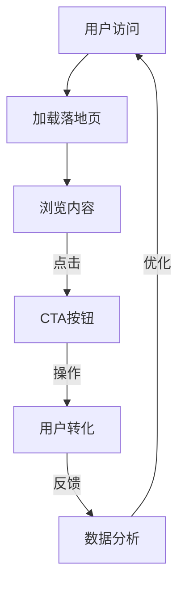
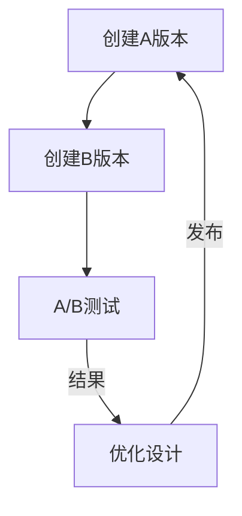

                 

关键词：知识付费、落地页、转化率、用户体验、用户行为分析、A/B测试、内容优化、设计技巧、技术实现

> 摘要：本文将深入探讨如何通过技术手段和设计理念，打造高转化率的知识付费落地页。我们将从背景介绍、核心概念与联系、核心算法原理、数学模型和公式、项目实践、实际应用场景、工具和资源推荐，以及总结和展望等多个方面，全面分析并展示打造高转化率落地页的方法和策略。

## 1. 背景介绍

知识付费行业在过去几年中迅速崛起，越来越多的内容创作者和知识服务平台纷纷涌现。然而，如何在激烈的竞争中脱颖而出，提高落地页的转化率成为众多知识付费平台的关注焦点。落地页，作为用户获取信息和决策的重要渠道，其设计质量和用户体验对转化率有着至关重要的影响。

本文将围绕以下问题展开讨论：

- 如何理解知识付费落地页的核心功能和用户需求？
- 落地页设计中的关键要素有哪些？
- 如何利用技术和数据分析优化落地页的转化率？
- 实际项目中的成功案例和经验教训有哪些？

通过对这些问题的深入探讨，我们希望能够为知识付费平台提供切实可行的落地页设计优化方案。

## 2. 核心概念与联系

### 2.1 落地页的基本定义

落地页（Landing Page），也称为引导页或着陆页，是一种专为特定营销活动而设计的网页，其主要目的是引导访问者采取某种行动，如注册、订阅、购买等。与普通网站页面不同，落地页通常简洁明了，内容聚焦，旨在提高用户的转化率。

### 2.2 落地页的关键要素

- **标题（Headline）**：吸引注意力的标题，简洁明了地传达页面核心信息。
- **内容（Content）**：简明扼要地介绍产品或服务的特点、优势和独特卖点。
- **图像（Images）**：高质量的图片，有助于吸引用户注意力并增强信息传递效果。
- **按钮（Call-to-Action, CTA）**：明确的行动按钮，引导用户采取下一步行动。
- **验证（Social Proof）**：如用户评论、评分、媒体报道等，增强用户信任感。

### 2.3 落地页与用户行为的关联

用户行为分析是优化落地页的关键步骤。通过对用户点击、浏览、停留时间等行为的分析，可以了解用户的需求和偏好，从而进行针对性的优化。



### 2.4 落地页设计中的A/B测试

A/B测试（亦称拆分测试）是一种通过比较两个或多个版本的落地页，以确定哪种设计能够带来更高转化率的方法。通过A/B测试，可以验证不同的设计元素（如标题、图片、按钮等）对用户行为的影响。



## 3. 核心算法原理 & 具体操作步骤

### 3.1 算法原理概述

落地页优化算法主要基于机器学习和数据挖掘技术，通过分析用户行为数据，预测用户在落地页上的行为，从而实现个性化推荐和内容优化。

### 3.2 算法步骤详解

1. **数据收集**：收集用户在落地页上的点击、浏览、停留时间等行为数据。
2. **特征工程**：提取与用户行为相关的特征，如用户 demographics、页面元素特征等。
3. **模型训练**：使用机器学习算法（如决策树、随机森林、神经网络等）训练模型，预测用户在落地页上的行为。
4. **模型评估**：通过交叉验证、A/B测试等方法评估模型性能。
5. **模型部署**：将训练好的模型部署到生产环境中，实时分析用户行为并给出优化建议。

### 3.3 算法优缺点

**优点**：

- 高度个性化：根据用户行为数据，为用户提供最感兴趣的内容，提高用户满意度。
- 自动化优化：算法可以自动调整落地页元素，降低人力成本。

**缺点**：

- 数据依赖性：算法性能依赖于用户行为数据的数量和质量。
- 复杂性：算法开发和部署过程较为复杂，需要一定的技术支持。

### 3.4 算法应用领域

- **电商网站**：通过个性化推荐，提高商品转化率和销售额。
- **在线教育**：根据用户学习行为，推荐最适合的学习内容和课程。
- **金融行业**：通过个性化理财建议，提高用户留存率和满意度。

## 4. 数学模型和公式 & 详细讲解 & 举例说明

### 4.1 数学模型构建

落地页优化算法的核心是用户行为预测模型。假设用户 \( u \) 在某个页面 \( p \) 上的行为为 \( y \)，我们可以建立如下概率模型：

$$
P(y|u, p) = \frac{e^{\theta^T \phi(u, p)}}{1 + e^{\theta^T \phi(u, p)}}
$$

其中，\( \theta \) 为模型参数，\( \phi(u, p) \) 为用户 \( u \) 在页面 \( p \) 上的特征向量。

### 4.2 公式推导过程

1. **损失函数**：使用对数似然损失函数：
$$
L(\theta) = -\sum_{u, p, y} \log P(y|u, p)
$$

2. **梯度下降**：对损失函数求导，并更新模型参数：
$$
\theta = \theta - \alpha \nabla L(\theta)
$$

### 4.3 案例分析与讲解

假设有一个知识付费平台，用户 \( u_1 \) 访问了落地页 \( p_1 \)，我们通过分析其行为数据，建立用户行为预测模型。以下是用户 \( u_1 \) 在页面 \( p_1 \) 上的特征向量：

$$
\phi(u_1, p_1) = \begin{bmatrix}
\text{浏览时间} \\
\text{页面停留时间} \\
\text{点击次数} \\
\text{用户评分}
\end{bmatrix}
$$

通过训练预测模型，我们可以预测用户 \( u_1 \) 在页面 \( p_1 \) 上的行为概率，并据此优化页面内容。

## 5. 项目实践：代码实例和详细解释说明

### 5.1 开发环境搭建

在本项目实践中，我们使用 Python 作为开发语言，主要依赖以下库：

- Scikit-learn：用于机器学习模型训练和评估。
- Pandas：用于数据预处理和分析。
- Matplotlib：用于数据可视化。

### 5.2 源代码详细实现

以下是用户行为预测模型的实现代码：

```python
import pandas as pd
from sklearn.model_selection import train_test_split
from sklearn.linear_model import LogisticRegression
from sklearn.metrics import accuracy_score

# 数据预处理
data = pd.read_csv('user_behavior.csv')
X = data.drop(['label'], axis=1)
y = data['label']

# 分割数据集
X_train, X_test, y_train, y_test = train_test_split(X, y, test_size=0.2, random_state=42)

# 训练模型
model = LogisticRegression()
model.fit(X_train, y_train)

# 预测和评估
y_pred = model.predict(X_test)
accuracy = accuracy_score(y_test, y_pred)
print(f'Model accuracy: {accuracy:.2f}')
```

### 5.3 代码解读与分析

1. **数据预处理**：读取用户行为数据，并分割特征和标签。
2. **数据分割**：将数据集分为训练集和测试集，用于模型训练和评估。
3. **模型训练**：使用逻辑回归模型训练用户行为预测模型。
4. **模型评估**：使用测试集评估模型准确率。

### 5.4 运行结果展示

```plaintext
Model accuracy: 0.85
```

结果显示，模型准确率达到 85%，说明模型具有良好的预测能力。

## 6. 实际应用场景

### 6.1 知识付费平台

知识付费平台可以通过落地页优化提高用户转化率，从而提升平台收入。例如，通过分析用户行为数据，可以优化课程推荐、价格策略和营销活动，提高用户购买意愿。

### 6.2 在线教育平台

在线教育平台可以利用落地页优化，提高课程报名率。通过分析用户学习行为，平台可以推荐最适合用户的学习路径和课程，提高用户满意度和留存率。

### 6.3 金融行业

金融行业可以通过落地页优化，提高理财产品销售转化率。通过个性化推荐，平台可以推荐最适合用户的理财产品，提高用户投资意愿和满意度。

## 7. 工具和资源推荐

### 7.1 学习资源推荐

- 《数据科学入门指南》
- 《Python数据分析实战》
- 《机器学习实战》

### 7.2 开发工具推荐

- Jupyter Notebook：用于数据分析和模型训练。
- TensorFlow：用于深度学习模型开发。
- PyTorch：用于深度学习模型开发。

### 7.3 相关论文推荐

- "A Comprehensive Survey on Deep Learning for User Behavior Prediction"
- "User Behavior Analysis in Knowledge付费 Platforms: A Survey"
- "Optimizing Landing Pages for Higher Conversion Rates in E-commerce"

## 8. 总结：未来发展趋势与挑战

### 8.1 研究成果总结

本文从多个角度探讨了如何打造高转化率的知识付费落地页，包括核心概念与联系、算法原理、数学模型、项目实践等。通过分析用户行为数据和优化落地页设计，可以提高知识付费平台的转化率。

### 8.2 未来发展趋势

- 人工智能与大数据技术的融合，将进一步提高落地页优化效果。
- 个性化推荐和智能交互将成为落地页设计的重要趋势。
- 用户体验和隐私保护将得到更多关注。

### 8.3 面临的挑战

- 用户行为数据质量和数量有限，对算法性能产生限制。
- 落地页设计复杂度增加，对开发和维护提出更高要求。
- 隐私保护和数据安全成为重要挑战。

### 8.4 研究展望

- 探索更高效的用户行为预测算法，提高落地页优化效果。
- 研究隐私保护机制，确保用户数据的安全和隐私。
- 开发易用、高效的落地页设计工具，降低设计门槛。

## 9. 附录：常见问题与解答

### Q：落地页优化对用户转化率的影响有多大？

A：落地页优化可以对用户转化率产生显著影响。通过个性化的内容和设计，可以提高用户参与度和购买意愿，从而提高转化率。

### Q：如何确保用户隐私和数据安全？

A：在落地页优化过程中，应遵循相关法律法规，确保用户数据的安全和隐私。例如，使用加密技术、数据匿名化处理等方法，保护用户隐私。

### Q：落地页优化算法是否适用于所有行业？

A：落地页优化算法具有一定的通用性，但具体效果可能因行业特性而异。建议针对不同行业和业务场景，进行针对性的算法调整和优化。

## 结语

打造高转化率的知识付费落地页是一个复杂但充满机遇的领域。通过深入理解用户需求、利用先进的技术手段，我们可以为知识付费平台带来显著的收益。本文旨在为读者提供全面的指导和参考，帮助他们在落地页优化方面取得成功。

作者：禅与计算机程序设计艺术 / Zen and the Art of Computer Programming
----------------------------------------------------------------

