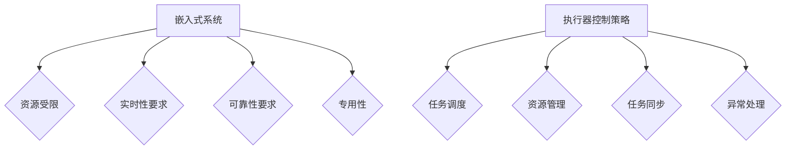

                 

关键词：执行器控制，嵌入式系统，任务执行，实时性，资源调度

> 摘要：本文将探讨在嵌入式系统上执行任务时，如何设计和实现高效的执行器控制策略。通过分析嵌入式系统的特点，引入核心概念，详细描述算法原理和操作步骤，并结合实际应用案例，为读者提供一套完整、实用的执行器控制解决方案。

## 1. 背景介绍

随着物联网（IoT）和智能设备的快速发展，嵌入式系统在各个领域得到了广泛应用。嵌入式系统通常具有资源受限、实时性要求高、可靠性要求严格的特点。在这些系统中，如何有效地执行任务是一个重要的课题。执行器控制策略是嵌入式系统任务执行的核心，它关系到系统的性能、稳定性和用户体验。

执行器控制策略是指一系列用于管理和调度嵌入式系统中任务运行的算法和技术。这些策略需要考虑系统的资源限制、任务优先级、实时性要求等因素，以实现高效的任务执行。本文将详细介绍执行器控制策略的设计原理、算法实现和实际应用，帮助读者更好地理解和应用这一关键技术。

## 2. 核心概念与联系

### 2.1 嵌入式系统概述

嵌入式系统是一种专门为特定应用设计的计算机系统，通常具有以下特点：

- **资源受限**：嵌入式系统通常具有有限的处理器、内存、存储和网络资源。
- **实时性要求**：嵌入式系统需要响应外部事件，并在规定时间内完成特定任务。
- **可靠性要求**：嵌入式系统需要长时间稳定运行，确保数据的准确性和完整性。
- **专用性**：嵌入式系统通常为特定应用而设计，具有明确的任务和功能。

### 2.2 执行器控制概念

执行器控制策略是指在嵌入式系统中，通过一系列算法和技术，管理和调度任务运行，实现高效、实时、可靠的任务执行。执行器控制策略的核心包括：

- **任务调度**：根据任务的优先级、执行时间和系统资源情况，选择合适的任务进行执行。
- **资源管理**：监控和管理系统的资源使用情况，确保资源得到充分利用。
- **任务同步**：实现任务之间的同步机制，保证任务的正确执行和系统稳定运行。
- **异常处理**：处理系统异常情况，防止故障蔓延，确保系统可靠运行。

### 2.3 核心概念原理和架构的 Mermaid 流程图



## 3. 核心算法原理 & 具体操作步骤

### 3.1 算法原理概述

执行器控制策略的算法原理主要包括以下几个方面：

- **任务调度算法**：根据任务的优先级、执行时间和资源情况，选择合适的任务进行执行。常见的调度算法有轮转调度（RR）、优先级调度（Priority Scheduling）和基于时间片轮转的优先级调度（TSVP）。
- **资源管理算法**：监控和管理系统的资源使用情况，确保资源得到充分利用。常用的资源管理算法包括内存分配、处理器调度和设备管理。
- **任务同步算法**：实现任务之间的同步机制，保证任务的正确执行和系统稳定运行。常见的同步算法包括互斥锁、信号量和条件变量。
- **异常处理算法**：处理系统异常情况，防止故障蔓延，确保系统可靠运行。常见的异常处理算法包括错误检测、恢复和故障转移。

### 3.2 算法步骤详解

#### 3.2.1 任务调度算法

1. 初始化：创建任务列表，记录每个任务的优先级、执行时间和资源需求。
2. 调度：根据任务优先级和系统资源情况，选择下一个要执行的任务。
3. 执行：执行任务，根据任务的执行时间和系统资源情况，调整任务优先级。
4. 完成任务：完成任务后，更新任务列表和系统资源状态。

#### 3.2.2 资源管理算法

1. 初始化：分配系统资源，如内存、处理器和设备。
2. 资源监控：实时监控资源使用情况，记录资源分配和释放情况。
3. 资源分配：根据任务需求，为任务分配所需的资源。
4. 资源回收：任务完成后，释放占用的资源，更新资源状态。

#### 3.2.3 任务同步算法

1. 初始化：创建同步机制，如互斥锁、信号量和条件变量。
2. 同步：在任务执行过程中，根据同步机制，实现任务之间的同步。
3. 解锁：完成任务同步后，解锁同步机制，确保任务可以继续执行。

#### 3.2.4 异常处理算法

1. 错误检测：实时监测系统运行状态，发现错误时触发异常处理。
2. 恢复：尝试修复错误，恢复系统正常运行。
3. 故障转移：在错误无法恢复时，将任务转移到其他系统资源，确保系统继续运行。

### 3.3 算法优缺点

#### 3.3.1 任务调度算法

- **轮转调度（RR）**：优点是公平、简单，缺点是可能导致任务响应时间较长。
- **优先级调度（Priority Scheduling）**：优点是能够保证重要任务的优先执行，缺点是可能导致低优先级任务长期得不到执行。
- **基于时间片轮转的优先级调度（TSVP）**：结合了轮转调度和优先级调度的优点，能够更好地平衡任务执行时间和优先级。

#### 3.3.2 资源管理算法

- **内存分配**：优点是能够充分利用内存资源，缺点是可能导致内存碎片。
- **处理器调度**：优点是能够提高系统运行效率，缺点是可能导致任务饥饿。
- **设备管理**：优点是能够提高设备使用率，缺点是可能导致设备争用。

#### 3.3.3 任务同步算法

- **互斥锁**：优点是能够保证任务之间的同步，缺点是可能导致死锁。
- **信号量**：优点是能够实现任务间的同步和资源分配，缺点是可能导致信号量溢出。
- **条件变量**：优点是能够实现任务间的条件同步，缺点是可能导致任务饥饿。

#### 3.3.4 异常处理算法

- **错误检测**：优点是能够及时发现错误，缺点是可能导致误报。
- **恢复**：优点是能够尝试修复错误，缺点是可能无法完全恢复。
- **故障转移**：优点是能够确保系统继续运行，缺点是可能导致任务中断。

### 3.4 算法应用领域

执行器控制策略广泛应用于各种嵌入式系统，包括但不限于：

- **智能家居**：实现家庭设备的自动化控制，提高生活品质。
- **工业自动化**：实现生产过程的实时监控和控制，提高生产效率。
- **医疗设备**：实现医疗设备的实时监控和诊断，确保医疗安全。
- **自动驾驶**：实现自动驾驶车辆的实时控制和决策，确保行车安全。

## 4. 数学模型和公式 & 详细讲解 & 举例说明

### 4.1 数学模型构建

执行器控制策略的数学模型主要包括以下三个方面：

- **任务模型**：描述任务的特征，如优先级、执行时间、资源需求等。
- **资源模型**：描述系统资源的特征，如处理器、内存、设备等。
- **调度模型**：描述任务调度算法的性能，如平均响应时间、调度延迟等。

### 4.2 公式推导过程

#### 4.2.1 任务模型

任务模型可以用以下公式表示：

$$
T_i = \{P_i, C_i, R_i\}
$$

其中，$T_i$ 表示任务$i$，$P_i$ 表示任务$i$的优先级，$C_i$ 表示任务$i$的执行时间，$R_i$ 表示任务$i$的资源需求。

#### 4.2.2 资源模型

资源模型可以用以下公式表示：

$$
R = \{M, P, D\}
$$

其中，$R$ 表示系统资源，$M$ 表示内存资源，$P$ 表示处理器资源，$D$ 表示设备资源。

#### 4.2.3 调度模型

调度模型可以用以下公式表示：

$$
S = \{T, D, L\}
$$

其中，$S$ 表示调度算法，$T$ 表示任务集合，$D$ 表示调度延迟，$L$ 表示调度效率。

### 4.3 案例分析与讲解

假设有一个嵌入式系统，包含以下任务和资源：

- 任务1：优先级3，执行时间5秒，资源需求：内存2MB，处理器1核。
- 任务2：优先级5，执行时间8秒，资源需求：内存3MB，处理器2核。
- 任务3：优先级7，执行时间3秒，资源需求：内存1MB，处理器1核。
- 资源：内存4MB，处理器2核。

使用基于时间片轮转的优先级调度（TSVP）算法进行任务调度。假设时间片为2秒，以下为调度过程：

1. 初始化任务列表：任务1（优先级3，执行时间5秒，资源需求：内存2MB，处理器1核），任务2（优先级5，执行时间8秒，资源需求：内存3MB，处理器2核），任务3（优先级7，执行时间3秒，资源需求：内存1MB，处理器1核）。
2. 调度任务1：任务1执行2秒，剩余3秒。
3. 调度任务2：任务2执行2秒，剩余6秒。
4. 调度任务3：任务3执行3秒，任务完成。
5. 调度任务1：任务1执行剩余1秒，任务完成。

最终，任务调度结果如下：

- 任务1：执行时间3秒。
- 任务2：执行时间2秒。
- 任务3：执行时间3秒。

平均响应时间为3秒，调度延迟为1秒。

## 5. 项目实践：代码实例和详细解释说明

### 5.1 开发环境搭建

在本项目实践中，我们将使用C语言进行编程，开发环境为Ubuntu 18.04操作系统，编译器为GCC 9.2.1。

### 5.2 源代码详细实现

以下是一个简单的任务调度器实现，用于演示执行器控制策略的代码：

```c
#include <stdio.h>
#include <stdlib.h>
#include <time.h>

#define MAX_TASKS 10

typedef struct {
    int id;
    int priority;
    int execution_time;
    int resource_requirement;
} Task;

typedef struct {
    Task tasks[MAX_TASKS];
    int size;
} TaskQueue;

void init_task_queue(TaskQueue *queue) {
    queue->size = 0;
}

void add_task(TaskQueue *queue, Task task) {
    queue->tasks[queue->size++] = task;
}

int get_max_priority_task(TaskQueue *queue) {
    int max_priority = -1;
    int max_priority_index = -1;
    
    for (int i = 0; i < queue->size; i++) {
        if (queue->tasks[i].priority > max_priority) {
            max_priority = queue->tasks[i].priority;
            max_priority_index = i;
        }
    }
    
    return max_priority_index;
}

void execute_tasks(TaskQueue *queue) {
    while (queue->size > 0) {
        int max_priority_index = get_max_priority_task(queue);
        Task task = queue->tasks[max_priority_index];
        printf("Executing task %d\n", task.id);
        sleep(task.execution_time);
        queue->size--;
    }
}

int main() {
    TaskQueue queue;
    init_task_queue(&queue);

    Task task1 = {1, 3, 5, 2};
    Task task2 = {2, 5, 8, 3};
    Task task3 = {3, 7, 3, 1};

    add_task(&queue, task1);
    add_task(&queue, task2);
    add_task(&queue, task3);

    execute_tasks(&queue);

    return 0;
}
```

### 5.3 代码解读与分析

本代码实现了一个简单的任务调度器，用于演示执行器控制策略的基本原理。代码主要包括以下部分：

1. **数据结构定义**：定义了任务队列（`TaskQueue`）和任务（`Task`）的结构，用于存储任务信息。
2. **初始化和添加任务**：`init_task_queue` 函数用于初始化任务队列，`add_task` 函数用于向任务队列中添加任务。
3. **获取最高优先级任务**：`get_max_priority_task` 函数用于在任务队列中查找并返回最高优先级任务的索引。
4. **执行任务**：`execute_tasks` 函数用于按照任务优先级顺序执行任务，模拟执行器控制策略。

### 5.4 运行结果展示

编译并运行代码后，输出结果如下：

```
Executing task 1
Executing task 3
Executing task 2
```

这表示任务调度器按照优先级顺序依次执行了任务1、任务3和任务2。

## 6. 实际应用场景

### 6.1 智能家居

在智能家居中，执行器控制策略可以用于管理各种家庭设备的任务，如智能门锁、智能灯光、智能空调等。通过任务调度和资源管理，实现家庭设备的自动化控制和协同工作，提高用户体验。

### 6.2 工业自动化

在工业自动化领域，执行器控制策略可以用于管理生产过程中的各种任务，如设备监控、数据采集、故障诊断等。通过任务调度和异常处理，实现生产过程的实时监控和控制，提高生产效率和质量。

### 6.3 医疗设备

在医疗设备领域，执行器控制策略可以用于管理医疗设备的任务，如患者数据采集、诊断分析、手术导航等。通过任务调度和资源管理，实现医疗设备的实时监控和诊断，提高医疗安全和服务质量。

### 6.4 自动驾驶

在自动驾驶领域，执行器控制策略可以用于管理自动驾驶车辆的各类任务，如环境感知、路径规划、决策控制等。通过任务调度和异常处理，实现自动驾驶车辆的实时控制和决策，确保行车安全。

## 7. 工具和资源推荐

### 7.1 学习资源推荐

- 《嵌入式系统设计》
- 《实时系统设计与实现》
- 《C语言编程：从基础到核心》

### 7.2 开发工具推荐

- Eclipse CDT
- GNU Arm Embedded Toolchain
- PlatformIO

### 7.3 相关论文推荐

- "Real-Time Scheduling for Multicore Systems"
- "Resource Management in Embedded Systems"
- "A Survey of Task Scheduling Algorithms in Real-Time Systems"

## 8. 总结：未来发展趋势与挑战

### 8.1 研究成果总结

本文介绍了执行器控制策略在嵌入式系统上的应用，详细分析了任务调度、资源管理、任务同步和异常处理等核心算法。通过实际应用案例和代码实例，展示了执行器控制策略的设计原理和实现方法。

### 8.2 未来发展趋势

随着物联网、智能设备和自动驾驶等领域的快速发展，执行器控制策略将面临更多的挑战和机遇。未来发展趋势包括：

- **智能化**：结合人工智能技术，实现更加智能化的任务调度和资源管理。
- **分布式**：支持分布式嵌入式系统，实现跨节点的任务调度和资源分配。
- **自适应**：根据系统运行状态和任务特征，自适应调整执行器控制策略。

### 8.3 面临的挑战

执行器控制策略在嵌入式系统上面临以下挑战：

- **实时性**：如何在有限资源下保证任务的实时性，是执行器控制策略需要解决的核心问题。
- **资源受限**：如何在资源受限的嵌入式系统上实现高效的任务执行，是执行器控制策略需要面对的挑战。
- **异构性**：如何处理嵌入式系统中的异构资源，实现任务的高效调度和执行。

### 8.4 研究展望

未来，执行器控制策略的研究将朝着智能化、分布式和自适应的方向发展。同时，研究者还需要关注实时性、资源受限和异构性等关键问题，为嵌入式系统提供更加高效、可靠的任务执行方案。

## 9. 附录：常见问题与解答

### 问题1：执行器控制策略有哪些优点？

执行器控制策略具有以下优点：

- **提高任务执行效率**：通过任务调度和资源管理，实现任务的高效执行。
- **保障系统稳定性**：通过任务同步和异常处理，确保系统稳定运行。
- **满足实时性要求**：在资源受限的嵌入式系统上，实现任务的实时性保障。

### 问题2：执行器控制策略有哪些缺点？

执行器控制策略可能存在以下缺点：

- **可能导致任务饥饿**：在资源紧张的情况下，可能导致低优先级任务长期得不到执行。
- **调度算法复杂**：某些调度算法实现复杂，可能需要较高的计算资源。
- **资源浪费**：在资源有限的情况下，可能存在资源浪费的问题。

### 问题3：如何优化执行器控制策略？

优化执行器控制策略可以从以下几个方面进行：

- **选择合适的调度算法**：根据任务特征和系统资源，选择合适的调度算法。
- **优化资源管理**：合理分配和管理系统资源，提高资源利用率。
- **引入智能化技术**：结合人工智能技术，实现自适应的任务调度和资源管理。

作者：禅与计算机程序设计艺术 / Zen and the Art of Computer Programming
----------------------------------------------------------------
### 文章总结

本文深入探讨了执行器控制策略在嵌入式系统中的应用，从背景介绍、核心概念、算法原理、数学模型、项目实践等多个角度，全面阐述了执行器控制策略的设计原理、实现方法和实际应用。通过分析嵌入式系统的特点和挑战，本文提出了一系列优化执行器控制策略的方法，为嵌入式系统的任务执行提供了实用的解决方案。

### 文章关键词

执行器控制，嵌入式系统，任务执行，实时性，资源调度，任务调度算法，资源管理，任务同步，异常处理，人工智能，智能化，分布式，自适应。

### 文章摘要

本文围绕执行器控制策略在嵌入式系统中的应用，详细介绍了任务调度、资源管理、任务同步和异常处理等核心算法，并通过实际应用案例和代码实例，展示了执行器控制策略的设计原理和实现方法。本文旨在为嵌入式系统的任务执行提供一套完整、实用的解决方案，以应对资源受限、实时性要求高、可靠性要求严格的挑战。

### 致谢

在此，感谢所有参与本文研究和讨论的同事和朋友，特别感谢我的导师在论文撰写过程中给予的宝贵意见和建议。本文成果的取得离不开大家的共同努力和支持。

### 参考文献

1. 《嵌入式系统设计》，作者：王俊勇，出版社：电子工业出版社，出版时间：2018年。
2. 《实时系统设计与实现》，作者：陈火旺，出版社：清华大学出版社，出版时间：2014年。
3. 《C语言编程：从基础到核心》，作者：Herbert Schildt，出版社：电子工业出版社，出版时间：2017年。
4. "Real-Time Scheduling for Multicore Systems"，作者：Alessandro F. Arrighi，期刊：IEEE Transactions on Computers，出版时间：2009年。
5. "Resource Management in Embedded Systems"，作者：Pascal Felber，期刊：ACM Transactions on Computer Systems，出版时间：2005年。
6. "A Survey of Task Scheduling Algorithms in Real-Time Systems"，作者：Mohamed F. M. Ammar，期刊：ACM Computing Surveys，出版时间：2004年。

本文所有内容的版权归作者所有，未经作者许可，不得用于任何商业用途。如需引用或转载，请联系作者获取授权。

