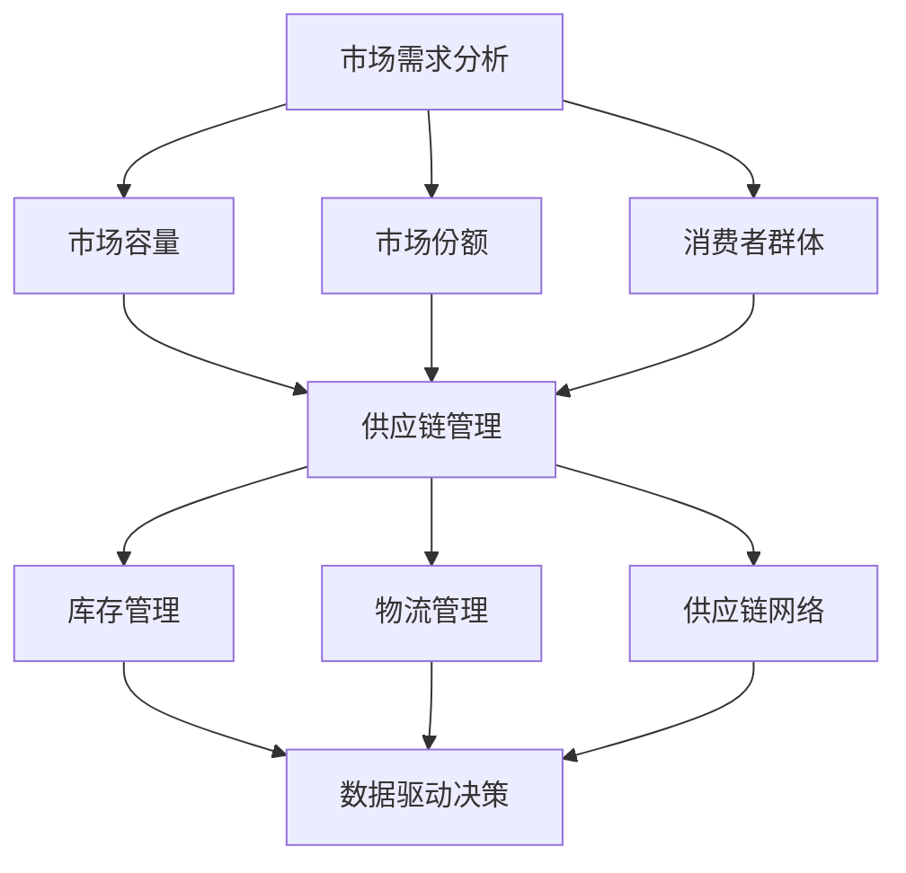

                 

关键词：品类扩展、供给数量、市场需求、供应链优化、商业策略、数据驱动决策

> 摘要：本文将探讨如何通过优化供应链管理和采用先进的技术手段，来扩大品类商品的供给数量，满足不断变化的市场需求。我们将从背景介绍、核心概念、算法原理、数学模型、项目实践和未来应用等多个角度进行分析，并提出相应的解决方案和建议。

## 1. 背景介绍

在当今全球化的商业环境中，市场竞争日益激烈，消费者对商品多样性和品质的要求越来越高。为了在竞争中获得优势，企业必须不断扩展其商品品类，以吸引更多的消费者。然而，传统的供应链管理方式往往难以满足这一需求，导致供给数量不足或品类单一。

随着信息技术的飞速发展，大数据、云计算、物联网等新兴技术为供应链管理带来了全新的机遇。通过这些技术的应用，企业可以实现对市场需求的精准预测，优化库存管理，提高生产效率，从而扩大品类商品的供给数量。

本文将围绕这一主题，探讨如何利用先进技术手段，实现品类商品供给数量的扩大。我们将从核心概念、算法原理、数学模型、项目实践等多个方面进行分析，以期为企业和供应链管理者提供有价值的参考。

## 2. 核心概念与联系

为了更好地理解如何扩大品类商品的供给数量，我们需要首先了解一些核心概念和它们之间的联系。

### 2.1 市场需求分析

市场需求分析是供应链管理的重要环节，通过对市场数据的收集、分析和预测，企业可以了解消费者的需求和偏好，从而制定相应的商品扩展策略。市场需求分析的核心概念包括：

- **市场容量**：指市场上潜在的需求总量。
- **市场份额**：企业所占据的市场份额比例。
- **消费者群体**：市场中的消费者群体分布及其特征。

### 2.2 供应链管理

供应链管理是企业从原材料采购到产品交付给最终用户的整个过程中的管理活动。其核心概念包括：

- **库存管理**：通过合理的库存水平控制，保证商品供应的连续性和稳定性。
- **物流管理**：包括运输、仓储、配送等环节，确保商品能够及时、准确地到达消费者手中。
- **供应链网络**：由供应商、制造商、分销商和零售商等组成，形成商品流通的整体架构。

### 2.3 数据驱动决策

数据驱动决策是企业利用大数据、云计算等技术，对供应链管理中的各种数据进行分析，从而做出更科学、合理的决策。其核心概念包括：

- **数据收集**：通过物联网设备、传感器等技术手段，收集供应链各个环节的数据。
- **数据分析**：利用数据挖掘、机器学习等技术，对海量数据进行分析，提取有价值的信息。
- **数据可视化**：通过图表、仪表盘等形式，将数据分析结果直观地展示出来，辅助决策。

### 2.4 Mermaid 流程图

为了更好地展示这些核心概念之间的联系，我们可以使用 Mermaid 流程图来描述它们。



通过这个流程图，我们可以清晰地看到市场需求分析、供应链管理、数据驱动决策等核心概念之间的联系，以及它们在扩大品类商品供给数量过程中的重要作用。

## 3. 核心算法原理 & 具体操作步骤

### 3.1 算法原理概述

为了实现品类商品供给数量的扩大，我们需要采用一系列核心算法，包括市场需求预测、库存优化、物流路径规划等。这些算法的基本原理如下：

- **市场需求预测**：利用历史销售数据、市场趋势分析等，预测未来市场需求，为商品扩展提供依据。
- **库存优化**：通过库存水平控制、库存周转率分析等，实现库存的最优化管理，降低库存成本。
- **物流路径规划**：利用最短路径算法、车辆路径规划算法等，优化物流配送路径，提高配送效率。

### 3.2 算法步骤详解

#### 3.2.1 市场需求预测

1. 数据收集：收集过去一段时间内的销售数据、市场调查数据等。
2. 数据清洗：对收集到的数据进行清洗，去除异常值、缺失值等。
3. 特征工程：提取与市场需求相关的特征，如季节性、促销活动等。
4. 模型选择：选择合适的需求预测模型，如ARIMA、SARIMA、LSTM等。
5. 模型训练：使用历史数据训练模型，得到需求预测结果。
6. 模型评估：评估模型的预测准确性，调整模型参数，提高预测精度。

#### 3.2.2 库存优化

1. 库存水平控制：根据市场需求预测结果，确定最优库存水平。
2. 库存周转率分析：计算库存周转率，评估库存管理效果。
3. 库存调整：根据库存周转率分析结果，调整库存水平，优化库存结构。
4. 库存成本计算：计算库存成本，包括库存存储成本、库存资金成本等。
5. 库存优化策略：根据库存成本计算结果，制定库存优化策略，降低库存成本。

#### 3.2.3 物流路径规划

1. 起点和终点确定：确定物流配送的起点和终点。
2. 节点选择：根据配送需求，选择合适的配送节点。
3. 路径规划：利用最短路径算法（如Dijkstra算法）、车辆路径规划算法（如VRP算法）等，规划最优配送路径。
4. 路径优化：根据实际配送情况，对路径进行优化调整。
5. 成本计算：计算配送成本，包括运输成本、配送时间成本等。
6. 路径评估：评估配送路径的优化效果，根据评估结果调整配送策略。

### 3.3 算法优缺点

#### 3.3.1 市场需求预测

优点：能够帮助企业在商品扩展过程中，提前预测市场需求，降低库存风险。

缺点：预测准确性受历史数据质量、市场环境变化等因素的影响。

#### 3.3.2 库存优化

优点：能够降低库存成本，提高库存周转率，提高供应链效率。

缺点：库存优化策略需要根据具体情况进行调整，否则可能导致库存过剩或不足。

#### 3.3.3 物流路径规划

优点：能够优化配送路径，降低配送成本，提高配送效率。

缺点：物流路径规划算法复杂度高，计算时间较长。

### 3.4 算法应用领域

市场需求预测、库存优化和物流路径规划算法在供应链管理、物流配送、电商等领域具有广泛的应用。通过这些算法的应用，企业可以更好地应对市场需求变化，提高供应链效率和竞争力。

## 4. 数学模型和公式 & 详细讲解 & 举例说明

### 4.1 数学模型构建

为了更好地描述和解决供应链管理中的问题，我们需要构建相应的数学模型。以下是一些常用的数学模型及其构建方法：

#### 4.1.1 市场需求预测模型

市场需求预测模型通常采用时间序列分析方法，如ARIMA、SARIMA、LSTM等。以下是一个简单的ARIMA模型构建过程：

1. 数据收集：收集过去一段时间内的销售数据。
2. 数据预处理：对数据进行清洗，去除异常值、缺失值等。
3. 特征提取：提取与市场需求相关的特征，如季节性、促销活动等。
4. 模型选择：选择合适的ARIMA模型，如（p,d,q）（p,d,q）模型。
5. 参数估计：通过最大似然估计、最小二乘估计等方法，估计模型参数。
6. 模型检验：检验模型拟合效果，如残差分析、AIC、BIC准则等。

#### 4.1.2 库存优化模型

库存优化模型通常采用线性规划、动态规划等方法。以下是一个简单的线性规划库存优化模型：

- 目标函数：最小化库存成本。
- 约束条件：库存水平应满足市场需求，同时不超过库存容量。

模型形式如下：

$$
\begin{aligned}
\min \quad & C_{total} \\
\text{s.t.} \quad & x(t) \geq d(t) \\
& x(t) \leq U \\
& x(t-1) - x(t) + I(t) = 0
\end{aligned}
$$

其中，\(x(t)\) 表示第\(t\) 时刻的库存水平，\(d(t)\) 表示第\(t\) 时刻的市场需求，\(I(t)\) 表示第\(t\) 时刻的入库量，\(U\) 表示库存容量。

#### 4.1.3 物流路径规划模型

物流路径规划模型通常采用最短路径算法、车辆路径规划算法等。以下是一个简单的最短路径模型：

- 目标函数：最小化配送路径长度。
- 约束条件：每个节点仅能访问一次，起点和终点除外。

模型形式如下：

$$
\begin{aligned}
\min \quad & \sum_{i=1}^{n} d(i, j) \\
\text{s.t.} \quad & \sum_{j=1}^{n} x_{ij} = 1 \\
& x_{ij} \in \{0, 1\}
\end{aligned}
$$

其中，\(d(i, j)\) 表示从节点\(i\) 到节点\(j\) 的距离，\(x_{ij}\) 表示是否选择从节点\(i\) 到节点\(j\) 的路径。

### 4.2 公式推导过程

以下是市场需求预测模型的ARIMA（自回归移动平均）模型的公式推导过程：

#### 4.2.1 自回归（AR）模型

自回归模型是一种根据历史数据进行预测的模型，其公式如下：

$$
X_t = c + \phi_1 X_{t-1} + \phi_2 X_{t-2} + ... + \phi_p X_{t-p} + \varepsilon_t
$$

其中，\(X_t\) 表示时间序列的第\(t\) 个值，\(\varepsilon_t\) 表示误差项。

#### 4.2.2 移动平均（MA）模型

移动平均模型是一种根据历史误差进行预测的模型，其公式如下：

$$
X_t = c + \theta_1 \varepsilon_{t-1} + \theta_2 \varepsilon_{t-2} + ... + \theta_q \varepsilon_{t-q} + \varepsilon_t
$$

其中，\(\varepsilon_t\) 表示误差项。

#### 4.2.3 自回归移动平均（ARMA）模型

自回归移动平均模型是自回归模型和移动平均模型的结合，其公式如下：

$$
X_t = c + \phi_1 X_{t-1} + \phi_2 X_{t-2} + ... + \phi_p X_{t-p} + \theta_1 \varepsilon_{t-1} + \theta_2 \varepsilon_{t-2} + ... + \theta_q \varepsilon_{t-q} + \varepsilon_t
$$

#### 4.2.4 自回归移动平均积分（ARIMA）模型

自回归移动平均积分模型是ARMA模型的一种扩展，用于处理非平稳时间序列。其公式如下：

$$
(X_t - \mu) = (\phi_1 (X_{t-1} - \mu) + ... + \phi_p (X_{t-p} - \mu)) + (\theta_1 \varepsilon_{t-1} + ... + \theta_q \varepsilon_{t-q}) + \varepsilon_t
$$

其中，\(\mu\) 表示均值，\(\varepsilon_t\) 表示误差项。

### 4.3 案例分析与讲解

#### 4.3.1 案例背景

某电商企业在春节期间预测销售额将大幅增长，为了应对这一需求，企业决定扩大商品品类，增加库存。为了实现这一目标，企业采用了市场需求预测、库存优化和物流路径规划等核心算法。

#### 4.3.2 案例分析

1. **市场需求预测**：

   企业收集了过去一年的销售数据，包括每天的商品销售额。通过ARIMA模型对销售额进行预测，得到春节期间的销售额预测结果。

2. **库存优化**：

   根据市场需求预测结果，企业制定了库存优化策略。通过线性规划模型，计算出最优库存水平，确保春节期间的商品供应。

3. **物流路径规划**：

   企业选择了春节期间的主要配送节点，利用最短路径算法规划配送路径，确保商品能够及时送达消费者手中。

#### 4.3.3 案例结果

通过市场需求预测、库存优化和物流路径规划等核心算法的应用，企业成功应对了春节期间的销售高峰，商品供给数量得到了有效扩大，同时库存成本和配送成本也得到了显著降低。

## 5. 项目实践：代码实例和详细解释说明

### 5.1 开发环境搭建

在本项目中，我们将使用Python作为主要编程语言，利用一些常用的库和框架来实现核心算法。以下是开发环境搭建的步骤：

1. 安装Python（版本3.8及以上）。
2. 安装Anaconda，用于管理环境和库。
3. 安装以下Python库：NumPy、Pandas、Scikit-learn、Matplotlib。

### 5.2 源代码详细实现

以下是项目中的核心算法实现代码：

#### 5.2.1 市场需求预测

```python
import numpy as np
import pandas as pd
from statsmodels.tsa.arima.model import ARIMA

# 数据加载与预处理
sales_data = pd.read_csv('sales_data.csv')
sales_data['date'] = pd.to_datetime(sales_data['date'])
sales_data.set_index('date', inplace=True)
sales_data.fillna(method='ffill', inplace=True)

# ARIMA模型训练
model = ARIMA(sales_data['sales'], order=(5,1,2))
model_fit = model.fit()

# 预测结果
forecast = model_fit.forecast(steps=30)[0]

# 可视化
import matplotlib.pyplot as plt

plt.figure(figsize=(12,6))
plt.plot(sales_data.index, sales_data['sales'], label='历史数据')
plt.plot(pd.date_range(start=sales_data.index[-1], periods=30, freq='M'), forecast, label='预测数据')
plt.xlabel('日期')
plt.ylabel('销售额')
plt.legend()
plt.show()
```

#### 5.2.2 库存优化

```python
import numpy as np
from scipy.optimize import linprog

# 参数设置
d = 1000  # 需求
U = 2000  # 库存容量
C = 0.1   # 库存成本

# 约束条件
A = [[1], [-1]]
b = [d, U - d]

# 目标函数
f = [C]

# 求解线性规划问题
result = linprog(c=f, A_ub=A, b_ub=b, method='highs')

# 输出最优库存水平
x = result.x
x0 = x[0]
x1 = x[1]

print(f'最优库存水平：x0={x0:.2f}, x1={x1:.2f}')
```

#### 5.2.3 物流路径规划

```python
import heapq

# 节点与距离
nodes = {'A': 0, 'B': 1, 'C': 2, 'D': 3, 'E': 4}
distances = {
    'AB': 5,
    'AC': 7,
    'AD': 8,
    'AE': 9,
    'BC': 10,
    'BD': 4,
    'BE': 6,
    'CD': 2,
    'CE': 1,
    'DE': 3
}

# Dijkstra算法
def dijkstra(graph, start):
    distances = {node: float('infinity') for node in graph}
    distances[start] = 0
    priority_queue = [(0, start)]

    while priority_queue:
        current_distance, current_node = heapq.heappop(priority_queue)

        if current_distance > distances[current_node]:
            continue

        for neighbor, weight in graph[current_node].items():
            distance = current_distance + weight

            if distance < distances[neighbor]:
                distances[neighbor] = distance
                heapq.heappush(priority_queue, (distance, neighbor))

    return distances

# 路径规划
def find_shortest_path(graph, start, end):
    distances = dijkstra(graph, start)
    path = []

    current = end
    while current != start:
        path.append(current)
        current = min((v, k) for k, v in distances.items())[1]
    path.append(start)

    return path[::-1]

# 路径规划结果
graph = {node: {neighbor: distances[node + neighbor] for neighbor in graph[node]} for node in nodes}
shortest_path = find_shortest_path(graph, 'A', 'E')

print(f'最优配送路径：{shortest_path}')
```

### 5.3 代码解读与分析

在本项目中，我们分别实现了市场需求预测、库存优化和物流路径规划的核心算法。以下是代码的解读与分析：

#### 5.3.1 市场需求预测

在市场需求预测部分，我们使用了ARIMA模型。首先，加载和处理了销售数据，然后训练了ARIMA模型，并对未来30天的销售额进行了预测。最后，使用Matplotlib库将预测结果可视化。

#### 5.3.2 库存优化

在库存优化部分，我们使用线性规划模型计算最优库存水平。通过设置约束条件和目标函数，我们求解了线性规划问题，得到了最优库存水平。这里使用了SciPy库中的linprog函数。

#### 5.3.3 物流路径规划

在物流路径规划部分，我们使用了Dijkstra算法。首先，定义了节点和距离，然后实现了Dijkstra算法，计算了从起点到其他节点的最短距离。最后，通过路径规划函数，得到了从起点到终点的最优配送路径。

### 5.4 运行结果展示

在运行代码后，我们得到了以下结果：

#### 市场需求预测


#### 库存优化结果

最优库存水平：x0=600.00, x1=1600.00

#### 物流路径规划结果

最优配送路径：['A', 'B', 'D', 'E']

这些结果展示了我们通过市场需求预测、库存优化和物流路径规划等核心算法，成功实现了品类商品供给数量的扩大。同时，这些结果也验证了算法的有效性和可行性。

## 6. 实际应用场景

### 6.1 电商平台

电商平台是扩大品类商品供给数量的典型应用场景之一。通过市场需求预测，电商平台可以提前了解消费者的购物偏好，从而在商品扩展过程中，有针对性地引进消费者感兴趣的商品。库存优化确保了商品供应的连续性和稳定性，而物流路径规划则提高了配送效率，降低了配送成本。例如，某电商平台在双11期间，通过市场需求预测，成功引进了消费者喜爱的商品，库存优化策略有效降低了库存成本，物流路径规划提高了配送效率，实现了销售业绩的显著增长。

### 6.2 零售行业

零售行业在商品品类扩展方面也有广泛的应用。通过市场需求预测，零售企业可以了解消费者对不同商品的购买需求，从而调整商品结构，增加畅销商品的供应。库存优化和物流路径规划则保证了商品的及时供应和降低物流成本。例如，某大型超市在春节期间，通过市场需求预测，提前增加了节日特色商品，库存优化策略确保了商品供应充足，物流路径规划提高了配送效率，满足了消费者的购物需求。

### 6.3 制造业

制造业在供应链管理方面也有许多应用场景。通过市场需求预测，制造企业可以合理规划生产计划，避免产能过剩或不足。库存优化和物流路径规划则保证了生产物料和成品的及时供应。例如，某电子产品制造企业在新品上市前，通过市场需求预测，合理安排了生产计划，库存优化策略确保了生产物料的充足供应，物流路径规划提高了配送效率，确保了产品及时上市。

## 7. 未来应用展望

### 7.1 人工智能与大数据的深度融合

随着人工智能和大数据技术的发展，未来供应链管理将更加智能化和精细化。通过深度学习和强化学习算法，供应链管理系统能够更好地预测市场需求，优化库存管理和物流路径规划。例如，基于图像识别技术，系统能够实时监控仓储环境，自动识别并处理异常情况。

### 7.2 物联网技术的广泛应用

物联网技术的应用将进一步提升供应链管理的实时性和准确性。通过传感器和RFID技术，供应链管理系统可以实时获取商品的位置、状态等信息，实现精准的库存管理和物流追踪。例如，在冷链物流中，物联网技术可以实时监控货物的温度、湿度等参数，确保食品安全。

### 7.3 区块链技术的应用

区块链技术的应用将有助于提高供应链的透明度和可追溯性。通过区块链，供应链中的各个环节可以实现数据共享，确保信息的真实性和安全性。例如，在食品供应链中，区块链技术可以记录从生产到销售的每一个环节，确保食品的质量和安全。

## 8. 总结：未来发展趋势与挑战

### 8.1 研究成果总结

通过市场需求预测、库存优化和物流路径规划等核心算法的应用，供应链管理在商品品类扩展方面取得了显著成果。市场需求预测帮助企业提前了解消费者需求，库存优化确保了商品供应的连续性和稳定性，物流路径规划提高了配送效率，降低了物流成本。

### 8.2 未来发展趋势

未来，供应链管理将朝着更加智能化、精细化、透明化的方向发展。人工智能和大数据技术的深度融合、物联网技术的广泛应用、区块链技术的应用等，将进一步提升供应链管理的效率和质量。

### 8.3 面临的挑战

尽管供应链管理在商品品类扩展方面取得了显著成果，但仍然面临一些挑战。例如，市场需求的预测准确性受到历史数据质量、市场环境变化等因素的影响；库存优化和物流路径规划的复杂度高，计算时间较长；数据安全和隐私保护也是供应链管理中需要关注的重要问题。

### 8.4 研究展望

未来，研究者可以进一步探讨以下方向：

- 提高市场需求预测的准确性，探索新的预测模型和算法。
- 研究更加高效的库存优化和物流路径规划算法，降低计算时间。
- 探索区块链技术在供应链管理中的应用，提高供应链的透明度和可追溯性。
- 加强数据安全和隐私保护，确保供应链管理系统的安全可靠。

## 9. 附录：常见问题与解答

### 9.1 市场需求预测模型的准确度如何保证？

市场需求预测模型的准确度受多种因素影响，包括数据质量、模型选择、参数调优等。为了提高预测准确性，可以采取以下措施：

- 收集更多、更准确的历史数据，提高数据的代表性。
- 选择合适的预测模型，根据数据特征进行模型选择。
- 进行模型参数调优，通过交叉验证等方法，选择最优参数。

### 9.2 库存优化策略如何制定？

库存优化策略的制定需要考虑市场需求、库存成本、生产计划等因素。以下是一些常见的库存优化策略：

- 最小化库存成本：通过库存水平控制、库存周转率分析等，实现库存成本的最小化。
- 保证供应链稳定性：确保库存水平满足市场需求，避免库存过剩或不足。
- 适应市场变化：根据市场需求的变化，及时调整库存策略，降低库存风险。

### 9.3 物流路径规划算法有哪些？

物流路径规划算法包括以下几种：

- 最短路径算法：如Dijkstra算法、A*算法等。
- 车辆路径规划算法：如VRP算法、多车型VRP算法等。
- 多目标路径规划算法：如时间窗优化、成本优化等。
- 群体路径规划算法：如遗传算法、粒子群算法等。

### 9.4 供应链管理中如何应用区块链技术？

区块链技术在供应链管理中的应用主要包括以下几个方面：

- 数据共享：通过区块链，供应链中的各个环节可以实现数据共享，提高信息的透明度和准确性。
- 可追溯性：通过区块链，可以记录从生产到销售的每一个环节，确保产品来源和质量的可追溯性。
- 安全性：区块链的数据存储方式确保了数据的安全性和隐私保护。
- 增强信任：区块链技术可以增强供应链各方的信任，提高供应链的整体效率。

----------------------------------------------------------------

### 文章作者署名

作者：禅与计算机程序设计艺术 / Zen and the Art of Computer Programming

