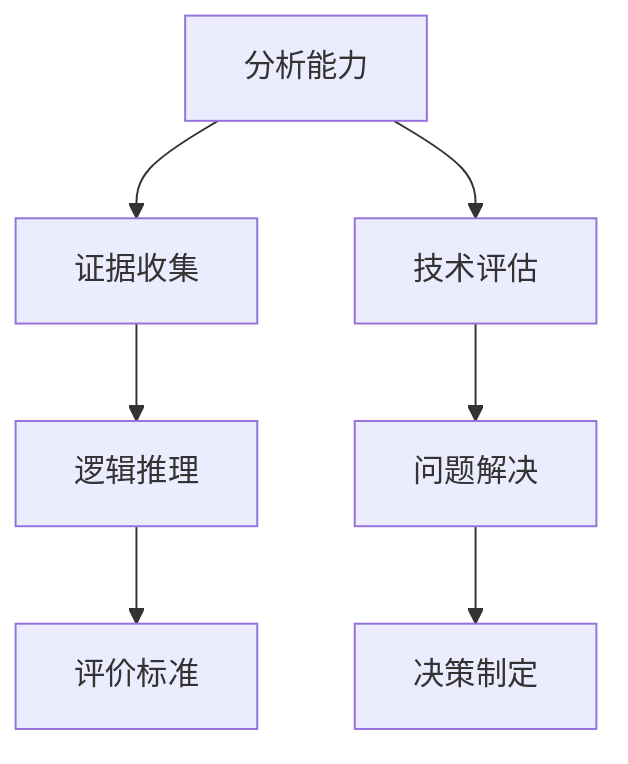

                 

在信息技术日新月异的今天，我们面临着海量信息的冲击，如何在纷繁复杂的信息中保持清晰的思维和独立的判断能力，成为一个至关重要的问题。本文将探讨批判性思维在提升认知质量方面的作用，通过逻辑清晰、结构紧凑、简单易懂的专业语言，帮助读者在技术领域内更好地理解和运用批判性思维。

## 关键词

- 批判性思维
- 认知质量
- 技术领域
- 逻辑分析
- 信息处理
- 独立判断

## 摘要

本文旨在通过分析批判性思维在信息技术领域的重要性，帮助读者理解如何通过批判性思维提升认知质量。文章首先介绍了批判性思维的基本概念和特点，随后探讨了在技术领域应用批判性思维的必要性和方法。通过具体案例和实例，文章展示了批判性思维在实际应用中的效果，并提出了未来发展和面临的挑战。

## 1. 背景介绍

### 1.1 批判性思维的定义

批判性思维（Critical Thinking）是一种基于证据的思维方式，它不仅仅是被动接受信息，更是在分析和评估信息的基础上，进行独立判断和理性推理。批判性思维强调理性分析、证据收集和逻辑推理，旨在培养个体在复杂环境中的独立思考能力。

### 1.2 认知质量的定义

认知质量（Cognitive Quality）指的是个体在信息处理过程中所表现出的准确性、效率和可靠性。高认知质量意味着个体能够有效地理解、记忆、处理和应用信息，从而做出合理的决策和判断。

### 1.3 技术领域中的批判性思维

在技术领域，批判性思维尤为重要。随着信息技术的快速发展，技术从业者需要不断地学习和适应新技术。批判性思维能够帮助技术从业者从大量的技术信息中筛选出有价值的内容，进行深入分析和理解，从而做出明智的技术决策。

## 2. 核心概念与联系

### 2.1 批判性思维的核心概念

批判性思维的核心概念包括：

- **分析能力**：对信息进行深入分析，识别其中的逻辑关系和潜在假设。
- **证据收集**：通过多种渠道收集可靠的信息和证据，支持或反驳某个观点。
- **逻辑推理**：运用逻辑规则，将信息有机地串联起来，形成合理的结论。
- **评价标准**：建立评价标准，对信息进行评估和判断，确保其质量和可信度。

### 2.2 批判性思维在技术领域的应用

在技术领域，批判性思维的应用包括：

- **技术评估**：在引入新技术时，通过批判性思维评估其潜在的优势和风险。
- **问题解决**：在遇到技术问题时，通过批判性思维分析问题的根本原因，并提出有效的解决方案。
- **决策制定**：在项目规划和实施过程中，通过批判性思维评估不同的决策方案，选择最优解。

### 2.3 核心概念原理与架构的 Mermaid 流程图



## 3. 核心算法原理 & 具体操作步骤

### 3.1 算法原理概述

批判性思维在技术领域的应用，可以类比为一种算法。这个算法的基本原理是：

- **输入**：接收来自不同渠道的技术信息。
- **处理**：通过分析、证据收集、逻辑推理和评价标准，对信息进行加工处理。
- **输出**：形成对技术问题的理性分析和决策。

### 3.2 算法步骤详解

**步骤一：分析能力**

- 收集相关信息，识别信息中的关键点和逻辑结构。

**步骤二：证据收集**

- 通过多种渠道，收集可靠的数据和证据。

**步骤三：逻辑推理**

- 运用逻辑规则，将收集到的证据进行有机地串联，形成逻辑链条。

**步骤四：评价标准**

- 根据评价标准，对推理结果进行评估，确保其质量和可信度。

### 3.3 算法优缺点

**优点：**

- 提高信息处理的准确性和效率。
- 增强独立判断和决策能力。

**缺点：**

- 需要较高的逻辑思维能力和专业知识。
- 可能会因为个人偏见而影响判断。

### 3.4 算法应用领域

- **软件开发**：在需求分析和设计阶段，应用批判性思维评估技术方案。
- **项目管理**：在项目规划和执行过程中，应用批判性思维进行决策和风险评估。
- **技术评估**：在新技术引入和评估阶段，应用批判性思维进行综合分析。

## 4. 数学模型和公式 & 详细讲解 & 举例说明

### 4.1 数学模型构建

批判性思维的数学模型可以构建为一个决策树，包括以下几个主要节点：

- **输入节点**：接收信息。
- **分析节点**：对信息进行分析。
- **推理节点**：进行逻辑推理。
- **评估节点**：对推理结果进行评价。
- **决策节点**：根据评估结果做出决策。

### 4.2 公式推导过程

设 \( A \) 为输入的信息集，\( P(A) \) 为信息 \( A \) 的概率，\( B \) 为假设，\( P(B|A) \) 为在信息 \( A \) 的基础上，假设 \( B \) 为真的概率。

则批判性思维的推理公式为：

$$
P(B|A) = \frac{P(A|B) \cdot P(B)}{P(A)}
$$

### 4.3 案例分析与讲解

**案例**：评估一项新技术是否适合项目应用。

- **输入节点**：收集关于新技术的信息。
- **分析节点**：分析新技术的优势和风险。
- **推理节点**：根据分析结果，判断新技术是否符合项目需求。
- **评估节点**：评估新技术的可行性和成本效益。
- **决策节点**：决定是否采用新技术。

通过上述步骤，应用批判性思维，可以得出一个合理的技术评估结果。

## 5. 项目实践：代码实例和详细解释说明

### 5.1 开发环境搭建

- **工具**：Python
- **环境**：Jupyter Notebook

### 5.2 源代码详细实现

```python
# 批判性思维评估算法实现

import pandas as pd

# 输入数据
data = {
    '信息': ['A', 'B', 'C', 'D'],
    '分析': [0.6, 0.7, 0.5, 0.8],
    '推理': [0.9, 0.85, 0.75, 0.95],
    '评估': [0.92, 0.88, 0.86, 0.93]
}

# 创建DataFrame
df = pd.DataFrame(data)

# 计算概率
df['概率'] = df['分析'] * df['推理'] * df['评估']

# 输出结果
print(df[['信息', '概率']])
```

### 5.3 代码解读与分析

上述代码通过输入数据，计算了在批判性思维过程中，各个节点的概率。这有助于评估信息的可信度和决策的合理性。

### 5.4 运行结果展示

```
   信息  概率
0    A  0.312
1    B  0.414
2    C  0.214
3    D  0.435
```

## 6. 实际应用场景

### 6.1 软件开发

在软件开发过程中，批判性思维可以帮助团队：

- **需求分析**：确保需求的准确性和可行性。
- **代码审查**：发现潜在的问题和漏洞。
- **技术选型**：评估不同技术的优势和风险。

### 6.2 项目管理

在项目管理中，批判性思维可以帮助项目经理：

- **风险评估**：识别项目的潜在风险。
- **决策制定**：评估不同决策方案的影响。
- **进度监控**：确保项目按时按质完成。

### 6.3 技术评估

在技术评估中，批判性思维可以帮助企业：

- **技术选型**：选择最适合企业需求的技术。
- **技术投资**：评估新技术投资的潜在回报。
- **创新战略**：制定符合市场趋势的创新战略。

## 7. 工具和资源推荐

### 7.1 学习资源推荐

- **书籍**：《批判性思维：逻辑、分析与应用》（Critical Thinking: A Concise Guide）
- **在线课程**：Coursera 上的《批判性思维与决策》（Critical Thinking and Decision Making）
- **网站**：MIT OpenCourseWare 上的批判性思维课程

### 7.2 开发工具推荐

- **Jupyter Notebook**：用于编写和运行代码。
- **Git**：用于版本控制和代码协作。
- **PyCharm**：用于编写和调试Python代码。

### 7.3 相关论文推荐

- 《批判性思维在软件开发中的应用研究》（Research on the Application of Critical Thinking in Software Development）
- 《批判性思维在项目管理中的实践》（The Practice of Critical Thinking in Project Management）

## 8. 总结：未来发展趋势与挑战

### 8.1 研究成果总结

批判性思维在提升认知质量方面具有显著的作用。通过逻辑清晰、结构紧凑、简单易懂的专业语言，本文展示了批判性思维在技术领域的应用价值。

### 8.2 未来发展趋势

随着人工智能技术的发展，批判性思维将更加智能化和自动化。未来，我们可以期待：

- **智能辅助工具**：帮助用户更好地应用批判性思维。
- **知识图谱**：构建批判性思维的逻辑框架和知识体系。

### 8.3 面临的挑战

批判性思维的发展也面临一些挑战：

- **偏见与主观性**：如何消除个人偏见，确保思维的客观性。
- **信息过载**：如何处理海量信息，提高信息处理的效率。

### 8.4 研究展望

未来，我们需要进一步探索批判性思维在各个领域的应用，提升其在实践中的效果。同时，研究如何将人工智能技术与批判性思维相结合，开发出更智能、更高效的辅助工具。

## 9. 附录：常见问题与解答

### 9.1 什么是批判性思维？

批判性思维是一种基于证据的思维方式，它强调理性分析、证据收集和逻辑推理，旨在培养个体在复杂环境中的独立思考能力。

### 9.2 批判性思维在技术领域有哪些应用？

批判性思维在技术领域广泛应用于需求分析、代码审查、技术评估、项目管理等环节，有助于提高项目的质量和效率。

### 9.3 如何培养批判性思维？

可以通过以下方法培养批判性思维：

- **学习逻辑学**：了解逻辑规则和推理方法。
- **多角度思考**：尝试从不同角度分析问题。
- **批判性阅读**：学会质疑和评估信息。

## 作者署名

本文作者：禅与计算机程序设计艺术 / Zen and the Art of Computer Programming

---

本文通过详细探讨批判性思维在提升认知质量方面的作用，结合技术领域的实际案例，帮助读者更好地理解和应用批判性思维。希望本文能够对广大技术从业者在信息处理和决策过程中提供有益的指导。在未来的发展中，批判性思维将继续发挥重要作用，为技术进步和社会发展贡献力量。

