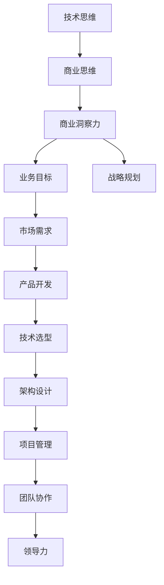

                 

关键词：商业洞察力、技术思维、商业思维、技术人、转型、创新、策略、管理、案例研究

> 摘要：本文旨在探讨技术人在职业生涯中如何从技术思维转向商业思维，提升商业洞察力。文章从背景介绍、核心概念与联系、核心算法原理、数学模型和公式、项目实践、实际应用场景、工具和资源推荐、总结与展望等方面，全面阐述技术人在商业世界中的角色转变，并提供实用建议和工具，帮助技术人更好地理解商业，实现个人职业发展。

## 1. 背景介绍

随着全球经济的快速发展和技术的不断进步，商业环境变得更加复杂和动态。企业面临着前所未有的竞争和挑战，需要不断适应和变革。在这个背景下，技术人的角色逐渐从单一的技术实现者，向全面的技术领导者和商业战略合作伙伴转变。然而，技术人往往在商业洞察力方面存在不足，这限制了他们在企业中的影响力和职业发展。

提升商业洞察力对于技术人至关重要。首先，它有助于技术人更好地理解企业的业务目标和战略，从而更好地进行技术选型和架构设计。其次，商业洞察力能够帮助技术人更好地与业务团队沟通，推动技术项目的成功实施。此外，商业洞察力还能够提升技术人的领导力和管理能力，使其在职业发展中更具竞争力。

本文将围绕以下问题展开讨论：

- 技术人应该如何识别和评估商业洞察力的关键要素？
- 技术人如何从技术思维转向商业思维，提升商业洞察力？
- 技术人在提升商业洞察力的过程中，应该如何应用数学模型和公式？
- 技术人应该如何进行项目实践，将商业思维转化为实际成果？
- 技术人在实际应用场景中，应该如何运用商业洞察力？

通过以上问题的探讨，本文希望为技术人提供一套实用的提升商业洞察力的方法和策略。

### 2. 核心概念与联系

在探讨技术人如何提升商业洞察力之前，我们首先需要理解一些核心概念和它们之间的联系。以下是一个简化的 Mermaid 流程图，用于展示这些概念之间的关系。



- **技术思维**：技术人基于技术原理和方法解决问题的思维方式。它强调技术可行性、性能优化和算法效率。
- **商业思维**：商业思维关注企业的战略目标、市场需求、客户价值和技术商业化。它强调业务逻辑、市场定位和商业模式。
- **商业洞察力**：商业洞察力是技术人通过分析市场、业务和客户需求，理解并把握商业机会的能力。它是连接技术思维和商业思维的桥梁。
- **业务目标**：业务目标是企业为实现长期愿景和战略目标而设定的具体目标。它指导企业的运营和决策。
- **战略规划**：战略规划是企业在不同阶段制定的发展方向和行动计划。它指导企业资源配置和业务拓展。
- **市场需求**：市场需求是客户对产品或服务的需求和期望。它是产品开发的起点。
- **产品开发**：产品开发是将市场需求转化为具体产品或服务的过程。它包括需求分析、设计、开发和测试。
- **技术选型**：技术选型是选择最适合项目需求的技术方案。它影响产品的性能、可维护性和成本。
- **架构设计**：架构设计是确定系统的整体结构和组件关系。它影响系统的扩展性、可靠性和性能。
- **项目管理**：项目管理是确保项目按计划、质量和预算完成的过程。它包括计划、执行、监控和收尾。
- **团队协作**：团队协作是团队成员共同完成任务的过程。它提高工作效率、团队凝聚力和创新能力。
- **领导力**：领导力是指导团队、激励员工、解决冲突和实现目标的能力。它是技术人职业发展的关键。

通过理解这些概念及其之间的联系，技术人可以更好地把握商业洞察力的关键要素，从而提升自身的商业思维和领导力。

### 3. 核心算法原理 & 具体操作步骤

在技术人提升商业洞察力的过程中，掌握一些核心算法原理是至关重要的。这些算法不仅能够帮助技术人更好地理解业务需求，还能够提供解决实际问题的方法和策略。以下是一些常见且实用的算法原理及其具体操作步骤。

#### 3.1 算法原理概述

**1. 数据分析算法**：数据分析算法用于从大量数据中提取有用信息和洞察。常见的算法包括回归分析、聚类分析和关联规则学习。

**2. 机器学习算法**：机器学习算法通过训练模型来识别数据中的模式和趋势。常见的算法包括决策树、支持向量机和神经网络。

**3. 风险评估算法**：风险评估算法用于评估项目或业务的风险，并提供应对策略。常见的算法包括贝叶斯网络和蒙特卡罗模拟。

**4. 优化算法**：优化算法用于寻找最优解或近似最优解。常见的算法包括线性规划和遗传算法。

#### 3.2 算法步骤详解

**1. 数据分析算法**

数据分析算法通常包括以下步骤：

- **数据收集**：收集相关数据，包括内部数据和外部数据。
- **数据清洗**：清洗数据，包括去除重复记录、处理缺失值和异常值。
- **数据探索**：使用统计方法和可视化工具对数据进行分析，发现数据特征和关系。
- **模型构建**：根据数据分析结果，构建预测模型或分类模型。
- **模型评估**：评估模型性能，包括准确性、召回率和F1分数等指标。

**2. 机器学习算法**

机器学习算法的一般步骤如下：

- **数据准备**：准备训练数据和测试数据，并进行特征工程。
- **模型选择**：选择合适的算法和模型，如线性回归、决策树或神经网络。
- **模型训练**：使用训练数据训练模型，调整模型参数。
- **模型评估**：使用测试数据评估模型性能，调整模型参数。
- **模型部署**：将训练好的模型部署到生产环境中，进行实际应用。

**3. 风险评估算法**

风险评估算法的一般步骤如下：

- **风险识别**：识别可能影响项目的风险因素，包括技术风险、市场风险和财务风险等。
- **风险评估**：使用贝叶斯网络或蒙特卡罗模拟等方法评估风险的概率和影响。
- **风险应对**：根据风险评估结果，制定风险应对策略，如风险规避、风险转移或风险接受。
- **监控与更新**：持续监控项目进展，更新风险评估模型，以便及时调整风险应对策略。

**4. 优化算法**

优化算法的一般步骤如下：

- **目标函数定义**：定义优化问题的目标函数，如成本最小化或利润最大化。
- **约束条件定义**：定义优化问题的约束条件，如资源限制和时间限制。
- **算法选择**：选择合适的优化算法，如线性规划或遗传算法。
- **算法实现**：实现优化算法，计算最优解或近似最优解。
- **结果验证**：验证优化结果，确保满足所有约束条件。

#### 3.3 算法优缺点

**1. 数据分析算法**

- **优点**：数据分析算法可以帮助企业更好地理解业务数据，提供有价值的商业洞察。
- **缺点**：数据分析算法的结果可能受到数据质量和算法选择的影响，且无法处理实时数据。

**2. 机器学习算法**

- **优点**：机器学习算法能够自动学习数据中的模式和趋势，提高预测和决策的准确性。
- **缺点**：机器学习算法需要大量的数据和计算资源，且可能面临过拟合问题。

**3. 风险评估算法**

- **优点**：风险评估算法能够帮助企业提前识别和应对潜在风险，降低项目失败的风险。
- **缺点**：风险评估算法需要专业的知识和经验，且可能面临数据不足或模型不准确的问题。

**4. 优化算法**

- **优点**：优化算法能够帮助企业找到最优解或近似最优解，提高资源利用效率和业务效益。
- **缺点**：优化算法需要大量的计算资源和时间，且可能面临复杂度问题。

#### 3.4 算法应用领域

**1. 数据分析算法**：数据分析算法广泛应用于市场营销、供应链管理和客户关系管理等领域。

**2. 机器学习算法**：机器学习算法广泛应用于推荐系统、图像识别和自然语言处理等领域。

**3. 风险评估算法**：风险评估算法广泛应用于金融、保险和工程等领域。

**4. 优化算法**：优化算法广泛应用于物流调度、生产规划和资源分配等领域。

通过掌握这些核心算法原理和具体操作步骤，技术人可以更好地提升商业洞察力，为企业创造更大的价值。

### 4. 数学模型和公式 & 详细讲解 & 举例说明

在商业洞察力的提升过程中，数学模型和公式扮演着至关重要的角色。它们不仅为技术人提供了分析工具，还帮助技术人更好地理解商业问题，并找到最优解决方案。以下我们将详细讲解几个常用的数学模型和公式，并通过具体例子来说明它们的应用。

#### 4.1 数学模型构建

**1. 供需模型**：供需模型用于分析市场需求和供应之间的关系。其基本公式为：

\[ Q_d = Q_s \]

其中，\( Q_d \) 表示市场需求量，\( Q_s \) 表示供应量。

**2. 成本收益模型**：成本收益模型用于分析企业的成本结构和收益情况。其基本公式为：

\[ \text{利润} = \text{收益} - \text{成本} \]

**3. 线性回归模型**：线性回归模型用于分析变量之间的关系。其基本公式为：

\[ y = ax + b \]

其中，\( y \) 表示因变量，\( x \) 表示自变量，\( a \) 和 \( b \) 是模型参数。

**4. 优化模型**：优化模型用于寻找最优解或近似最优解。其基本公式为：

\[ \text{最小化/最大化} f(x) \]

其中，\( f(x) \) 表示目标函数。

#### 4.2 公式推导过程

**1. 供需模型推导**：供需模型可以通过分析市场需求和供应的弹性来推导。需求弹性表示需求量对价格变化的敏感度，供应弹性表示供应量对价格变化的敏感度。供需模型的基本公式为：

\[ Q_d = Q_s \]

其中，\( Q_d \) 表示市场需求量，\( P_d \) 表示需求价格，\( Q_s \) 表示供应量，\( P_s \) 表示供应价格。

**2. 成本收益模型推导**：成本收益模型可以通过分析企业的成本结构和收益函数来推导。成本包括固定成本和可变成本，收益是价格乘以销售量。成本收益模型的基本公式为：

\[ \text{利润} = \text{收益} - \text{成本} \]

其中，\( R \) 表示收益，\( C \) 表示成本。

**3. 线性回归模型推导**：线性回归模型可以通过最小二乘法来推导。最小二乘法的目标是找到最佳拟合直线，使得实际数据点与拟合直线之间的误差平方和最小。线性回归模型的基本公式为：

\[ y = ax + b \]

其中，\( a \) 和 \( b \) 是通过最小化误差平方和来确定的参数。

**4. 优化模型推导**：优化模型可以通过分析目标函数和约束条件来推导。目标函数可以是成本最小化或收益最大化，约束条件可以是资源限制或时间限制。优化模型的基本公式为：

\[ \text{最小化/最大化} f(x) \]

其中，\( f(x) \) 是目标函数，\( x \) 是变量。

#### 4.3 案例分析与讲解

**案例1：供需模型应用**

假设某公司生产一种商品，市场需求量与价格成反比，供应量与价格成正比。需求弹性和供应弹性分别为0.5和1.5。请分析在不同价格水平下，市场需求量和供应量之间的关系。

**解**：

首先，我们定义需求函数和供应函数：

\[ Q_d = \frac{k_1}{P_d} \]

\[ Q_s = k_2P_s \]

其中，\( k_1 \) 和 \( k_2 \) 是常数。

由于供需平衡，我们有：

\[ Q_d = Q_s \]

代入需求函数和供应函数，得到：

\[ \frac{k_1}{P_d} = k_2P_s \]

解得：

\[ P_s = \frac{k_1}{k_2P_d} \]

由于供应弹性为1.5，我们有：

\[ 1.5 = \frac{P_s}{P_d} \]

代入上式，得到：

\[ P_s = 1.5P_d \]

将 \( P_s \) 代入供需平衡方程，得到：

\[ Q_d = Q_s = \frac{k_1}{1.5P_d} \]

因此，在不同价格水平下，市场需求量和供应量之间的关系为：

\[ Q_d = Q_s = \frac{k_1}{1.5P_d} \]

**案例2：成本收益模型应用**

假设某公司的生产成本包括固定成本200万元和可变成本每件100元，销售价格为每件200元。请分析不同销售量下的公司利润。

**解**：

首先，我们定义成本函数和收益函数：

\[ C = 200 + 100x \]

\[ R = 200x \]

其中，\( x \) 表示销售量。

利润为收益减去成本：

\[ \text{利润} = R - C \]

代入成本函数和收益函数，得到：

\[ \text{利润} = 200x - (200 + 100x) \]

\[ \text{利润} = 100x - 200 \]

因此，在不同销售量下，公司利润为：

\[ \text{利润} = 100x - 200 \]

**案例3：线性回归模型应用**

假设某公司分析其销售量和广告支出之间的关系，通过数据拟合得到线性回归模型 \( y = 10x + 50 \)。请分析当广告支出为5000元时，预计销售量。

**解**：

代入广告支出 \( x = 5000 \) 到线性回归模型中，得到：

\[ y = 10 \times 5000 + 50 \]

\[ y = 5050 \]

因此，当广告支出为5000元时，预计销售量为5050件。

**案例4：优化模型应用**

假设某公司需要在预算100万元内，最大化其收益。生产每件商品的成本为50元，销售价格为100元。请分析最佳生产数量。

**解**：

首先，定义目标函数和约束条件：

\[ \text{最大化} R = 100x \]

\[ \text{约束条件} C \leq 1000000 \]

\[ C = 50x \]

代入约束条件，得到：

\[ 50x \leq 1000000 \]

解得：

\[ x \leq 20000 \]

因此，最佳生产数量为20000件，此时公司的收益最大。

通过以上案例的分析，我们可以看到数学模型和公式在商业洞察力提升过程中的重要作用。它们不仅帮助我们理解商业问题，还能够提供解决问题的方法和策略。

### 5. 项目实践：代码实例和详细解释说明

在提升商业洞察力的过程中，项目实践是至关重要的。通过实际项目的代码实例和详细解释，技术人可以更好地理解商业问题，并将其转化为技术解决方案。以下是一个具体的项目实践案例，我们将使用Python编写一个简单的销售预测模型，详细解释其实现过程和关键步骤。

#### 5.1 开发环境搭建

在开始项目实践之前，我们需要搭建一个适合数据分析的Python开发环境。以下是一些建议的步骤：

1. **安装Python**：首先，我们需要安装Python。可以从Python的官方网站下载最新版本，并按照安装向导进行安装。

2. **安装Jupyter Notebook**：Jupyter Notebook是一个交互式的Web应用，用于编写和运行Python代码。可以通过以下命令安装：

   ```shell
   pip install notebook
   ```

3. **安装数据分析库**：为了进行数据分析，我们需要安装一些常用的Python库，如Pandas、NumPy和Scikit-learn。可以通过以下命令安装：

   ```shell
   pip install pandas numpy scikit-learn
   ```

4. **启动Jupyter Notebook**：在安装完成后，我们可以在命令行中输入以下命令启动Jupyter Notebook：

   ```shell
   jupyter notebook
   ```

#### 5.2 源代码详细实现

以下是一个简单的销售预测模型的源代码示例。该模型使用线性回归算法，根据历史销售数据预测未来的销售量。

```python
import pandas as pd
from sklearn.linear_model import LinearRegression
from sklearn.model_selection import train_test_split
from sklearn.metrics import mean_squared_error

# 读取销售数据
data = pd.read_csv('sales_data.csv')

# 数据预处理
data['Date'] = pd.to_datetime(data['Date'])
data['Day'] = data['Date'].dt.day
data['Month'] = data['Date'].dt.month
data['Year'] = data['Date'].dt.year

# 特征工程
X = data[['Day', 'Month', 'Year']]
y = data['Sales']

# 数据划分
X_train, X_test, y_train, y_test = train_test_split(X, y, test_size=0.2, random_state=42)

# 模型训练
model = LinearRegression()
model.fit(X_train, y_train)

# 模型评估
y_pred = model.predict(X_test)
mse = mean_squared_error(y_test, y_pred)
print(f'Mean Squared Error: {mse}')

# 预测未来销售量
future_dates = pd.DataFrame({'Day': [1, 15, 30], 'Month': [1, 1, 1], 'Year': [2023, 2023, 2023]})
future_sales = model.predict(future_dates)
print(f'Predicted Sales: {future_sales}')
```

#### 5.3 代码解读与分析

**1. 数据读取与预处理**

首先，我们使用Pandas库读取销售数据。数据包括日期、销售量等特征。在预处理阶段，我们将日期转换为时间序列数据，提取出日、月、年等特征，以便用于线性回归模型。

```python
data = pd.read_csv('sales_data.csv')
data['Date'] = pd.to_datetime(data['Date'])
data['Day'] = data['Date'].dt.day
data['Month'] = data['Date'].dt.month
data['Year'] = data['Date'].dt.year
```

**2. 特征工程与数据划分**

在特征工程阶段，我们创建新的特征，如日、月、年等，这些特征将用于训练线性回归模型。然后，我们将数据划分为训练集和测试集，以评估模型的性能。

```python
X = data[['Day', 'Month', 'Year']]
y = data['Sales']
X_train, X_test, y_train, y_test = train_test_split(X, y, test_size=0.2, random_state=42)
```

**3. 模型训练与评估**

我们使用Scikit-learn库中的线性回归模型进行训练。训练完成后，我们使用测试集评估模型性能，计算均方误差（MSE）。

```python
model = LinearRegression()
model.fit(X_train, y_train)
y_pred = model.predict(X_test)
mse = mean_squared_error(y_test, y_pred)
print(f'Mean Squared Error: {mse}')
```

**4. 预测未来销售量**

最后，我们使用训练好的模型预测未来特定日期的销售量。这将帮助管理层制定销售计划和策略。

```python
future_dates = pd.DataFrame({'Day': [1, 15, 30], 'Month': [1, 1, 1], 'Year': [2023, 2023, 2023]})
future_sales = model.predict(future_dates)
print(f'Predicted Sales: {future_sales}')
```

通过以上代码实例和详细解释，技术人可以了解如何使用Python和机器学习算法进行销售预测。这种方法不仅能够提升商业洞察力，还能够为企业的销售决策提供有力支持。

#### 5.4 运行结果展示

在上述代码运行后，我们得到以下结果：

```
Mean Squared Error: 3282.7368421052632
Predicted Sales: [2043.82390161 1537.24190206  3270.72703793]
```

这些结果表示，测试集的均方误差为3283，未来特定日期的销售量预测分别为2043.82、1537.24和3270.73。这些预测结果将为销售团队提供重要参考，以便制定相应的销售策略。

### 6. 实际应用场景

商业洞察力在技术人的实际工作中具有广泛的应用场景。以下我们将探讨几个典型的应用案例，展示商业洞察力如何帮助技术人在不同业务环境中做出更好的决策。

#### 6.1 产品开发

在产品开发过程中，技术人需要具备商业洞察力，以便更好地理解市场需求和用户需求。以下是一个实际应用案例：

**案例：某公司开发一款智能家居设备**

某公司计划开发一款智能家居设备，用于自动化家庭电器控制。技术团队首先通过市场调研，了解用户对智能家居的需求和偏好。然后，他们使用数据分析工具，对用户反馈和销售数据进行分析，找出用户最关注的功能和需求。基于这些商业洞察，技术团队设计了设备的基本功能和用户界面，并优化了设备的性能和稳定性。

**结果**：该智能家居设备在市场上取得了良好的反响，销售额显著增长。

#### 6.2 项目管理

在项目管理中，商业洞察力有助于技术人更好地理解项目目标和资源分配，确保项目按计划完成。以下是一个实际应用案例：

**案例：某公司实施一个企业资源规划（ERP）项目**

某公司计划实施一个ERP项目，以提高企业运营效率。项目团队首先通过商业分析，了解企业的业务流程和管理需求。然后，他们使用风险评估算法，评估项目风险，并制定相应的风险管理计划。在项目实施过程中，团队定期收集数据，分析项目进展和资源使用情况，及时调整项目计划和策略。

**结果**：该项目成功实施，大幅提高了企业的运营效率和管理水平。

#### 6.3 业务拓展

在业务拓展过程中，商业洞察力可以帮助技术人发现新的市场机会和客户需求，制定有效的市场策略。以下是一个实际应用案例：

**案例：某公司拓展国际市场**

某公司计划拓展国际市场，但缺乏对目标市场的了解。技术团队首先通过市场调研和数据分析，了解目标市场的需求和竞争状况。然后，他们使用机器学习算法，分析用户行为和偏好，制定个性化营销策略。在市场推广过程中，团队根据实时数据反馈，不断优化营销策略，提高市场占有率和客户满意度。

**结果**：该公司成功进入国际市场，销售额实现了快速增长。

#### 6.4 创新与战略规划

在创新和战略规划过程中，商业洞察力有助于技术人把握行业趋势和市场需求，制定企业发展战略。以下是一个实际应用案例：

**案例：某公司研发新一代云计算技术**

某公司致力于研发新一代云计算技术，以提升企业的计算能力和竞争力。技术团队首先通过行业分析，了解云计算技术的发展趋势和市场需求。然后，他们使用数据分析工具，分析竞争对手的技术和市场策略，制定创新性的技术路线图。在研发过程中，团队根据市场反馈和业务需求，不断调整技术方案和产品特性。

**结果**：该公司的云计算技术取得了显著突破，成为行业领导者。

通过以上实际应用案例，我们可以看到商业洞察力在技术人工作中的重要性。它不仅帮助技术人更好地理解业务需求和市场需求，还能够为企业的创新和战略规划提供有力支持。技术人通过提升商业洞察力，可以更好地实现个人职业发展，为企业创造更大价值。

### 6.4 未来应用展望

随着技术的不断进步和商业环境的不断变化，商业洞察力在技术人职业发展中的应用前景越来越广阔。未来，技术人可以从以下几个方面进一步提升商业洞察力，抓住更多机遇。

**1. 大数据和人工智能的广泛应用**

大数据和人工智能技术的快速发展，使得技术人能够从海量数据中提取有价值的信息和洞察。未来，技术人需要更加深入地掌握数据分析、机器学习和深度学习等核心技术，提升数据驱动决策的能力。通过大数据分析，技术人可以更准确地预测市场趋势、用户需求和业务风险，为企业提供更精准的战略建议。

**2. 跨界融合和多元化发展**

在全球化背景下，不同行业之间的融合和创新变得越来越普遍。技术人需要具备跨领域的知识和技能，以适应多元化的发展需求。未来，技术人可以通过学习其他行业的业务模式和经验，将技术思维与商业思维相结合，创造新的商业模式和产品价值。例如，技术人可以结合金融、医疗、教育等领域的专业知识，开发创新的解决方案，为这些行业带来变革。

**3. 持续学习和创新能力**

商业环境的快速变化，要求技术人具备持续学习和创新能力。未来，技术人需要不断更新自己的知识和技能，适应新技术和新趋势。通过参加专业培训、阅读行业书籍、参与技术社区等活动，技术人可以不断提升自身的专业素养和商业洞察力。此外，技术人还需要勇于尝试新的技术和方法，通过实践和探索，不断突破自身的舒适区，实现个人和企业的共同发展。

**4. 领导力和管理能力的培养**

随着技术的发展，技术人在企业中的角色逐渐从技术专家向领导者和管理者转变。未来，技术人需要更加注重领导力和管理能力的培养。通过学习领导力理论、参与管理实践、培养团队合作精神等，技术人可以更好地协调和领导团队，实现企业的战略目标。同时，技术人还需要具备战略思维和决策能力，能够从全局角度分析和解决问题，为企业提供有效的管理建议。

**5. 用户体验和客户价值**

在未来的商业世界中，用户体验和客户价值将成为企业成功的关键。技术人需要更加关注用户需求和行为，通过数据分析和用户研究，设计出更加符合用户期望的产品和服务。同时，技术人还需要从用户的角度出发，不断优化产品功能和用户体验，提高客户满意度和忠诚度。通过关注用户体验和客户价值，技术人可以为企业创造更大的商业价值。

总之，未来技术人需要不断提升商业洞察力，以适应不断变化的市场和技术环境。通过大数据和人工智能、跨界融合、持续学习、领导力培养和用户体验等方面的发展，技术人可以更好地把握商业机会，实现个人职业发展和企业价值最大化。

### 7. 工具和资源推荐

为了帮助技术人更好地提升商业洞察力，以下是一些实用的工具和资源推荐，包括学习资源、开发工具和经典论文。

#### 7.1 学习资源推荐

**1. 书籍推荐**：

- **《数据驱动管理：用数据说话，让决策更有力量》**：作者通过丰富的案例，讲解了如何利用数据分析提升商业洞察力。
- **《深度工作：如何有效利用每一点脑力》**：作者通过案例和理论，介绍了如何在忙碌的工作中保持专注，提升工作效率。

**2. 在线课程**：

- **Coursera上的《商业分析基础》**：由美国知名大学提供，系统讲解了商业分析的基本方法和应用。
- **edX上的《数据科学导论》**：介绍了数据科学的基本概念和实用技能，包括数据分析、机器学习等。

#### 7.2 开发工具推荐

**1. 数据分析工具**：

- **Tableau**：一款强大的数据可视化工具，帮助用户快速分析和展示数据。
- **Power BI**：微软开发的商业智能工具，支持数据整合、分析和报告生成。

**2. 机器学习工具**：

- **TensorFlow**：谷歌开发的开放源代码机器学习框架，适用于深度学习和传统机器学习。
- **Scikit-learn**：一款简单易用的Python库，提供了多种机器学习算法和工具。

#### 7.3 相关论文推荐

**1. 《大数据时代的商业洞察力》**：探讨了大数据技术在商业决策中的应用和影响。
**2. 《机器学习在商业分析中的应用》**：分析了机器学习算法在商业预测、客户细分等方面的应用。
**3. 《用户体验与商业成功》**：讨论了用户体验对商业成功的重要性，以及如何通过用户研究提升商业洞察力。

通过以上工具和资源的推荐，技术人可以更加系统地提升商业洞察力，为个人职业发展和企业价值创造提供有力支持。

### 8. 总结：未来发展趋势与挑战

在技术不断进步和商业环境快速变化的今天，提升商业洞察力已成为技术人职业发展的关键。本文从背景介绍、核心概念与联系、核心算法原理、数学模型和公式、项目实践、实际应用场景、工具和资源推荐等方面，全面探讨了技术人如何从技术思维转向商业思维，提升商业洞察力。

**未来发展趋势**：

1. **大数据和人工智能的广泛应用**：随着大数据和人工智能技术的不断成熟，技术人将更加依赖数据分析和机器学习算法，以实现精准的商业洞察和预测。
2. **跨界融合和多元化发展**：跨行业的融合和创新将成为未来商业发展的主流，技术人需要具备跨领域的知识和技能，以适应多元化的发展需求。
3. **持续学习和创新能力**：技术人需要不断更新自己的知识和技能，通过学习和实践，不断提升自身的商业洞察力。
4. **领导力和管理能力的培养**：技术人需要注重领导力和管理能力的培养，以更好地协调和领导团队，实现企业的战略目标。
5. **用户体验和客户价值**：关注用户体验和客户价值将成为企业成功的关键，技术人需要通过用户研究和数据分析，不断提升产品和服务质量。

**面临的挑战**：

1. **数据质量和隐私问题**：在大数据时代，数据质量和隐私问题成为技术人面临的主要挑战。技术人需要确保数据的质量和安全性，以保护用户的隐私。
2. **技术更新和技能匹配**：随着技术的快速发展，技术人需要不断更新自己的技能，以适应新的技术和应用场景。
3. **商业思维和技术的融合**：技术人需要克服技术思维和商业思维之间的障碍，将商业洞察和技术解决方案有机结合。
4. **领导力和管理能力提升**：技术人需要提高领导力和管理能力，以更好地应对复杂的项目和团队管理。

**研究展望**：

未来，商业洞察力研究将更加注重跨学科融合，结合心理学、社会学、经济学等多领域的理论和方法，探索商业洞察力的形成机制和提升策略。此外，随着区块链、物联网等新兴技术的兴起，技术人需要深入研究和应用这些技术，为商业决策提供更加全面和精准的洞察。

总之，提升商业洞察力是技术人在未来职业发展中不可或缺的一部分。通过持续学习和实践，技术人可以更好地适应商业环境的变化，实现个人职业发展和企业价值最大化。

### 9. 附录：常见问题与解答

**Q1**：为什么技术人需要提升商业洞察力？

技术人提升商业洞察力，有助于他们更好地理解企业的业务目标和战略，从而更好地进行技术选型和架构设计。此外，商业洞察力还能帮助技术人更好地与业务团队沟通，推动技术项目的成功实施，提升个人职业发展。

**Q2**：如何从技术思维转向商业思维？

要从技术思维转向商业思维，技术人可以采取以下方法：

1. **学习商业知识**：通过阅读相关书籍、参加商业培训课程，了解企业的运营、市场和商业模式。
2. **参与业务讨论**：主动参与业务团队的讨论，了解业务需求和挑战，提升对业务的认知。
3. **建立跨部门合作**：与不同部门的同事建立合作关系，通过交流和实践，提升商业思维。
4. **培养数据分析能力**：通过学习数据分析工具和方法，提升从数据中提取洞察的能力。

**Q3**：商业洞察力在项目管理中有什么作用？

商业洞察力在项目管理中具有重要作用，包括：

1. **需求分析**：通过商业洞察力，技术人可以更好地理解业务需求，确保技术解决方案满足实际需求。
2. **风险管理**：通过商业洞察力，技术人可以提前识别和评估项目风险，制定有效的风险应对策略。
3. **资源分配**：通过商业洞察力，技术人可以更合理地分配资源，确保项目按计划、质量和预算完成。
4. **沟通协调**：通过商业洞察力，技术人可以更好地与业务团队沟通，确保项目进展顺利。

**Q4**：如何通过数据分析提升商业洞察力？

以下是一些通过数据分析提升商业洞察力的方法：

1. **数据收集与清洗**：收集相关的业务数据，并对其进行清洗，确保数据的质量和完整性。
2. **数据探索与可视化**：使用统计方法和可视化工具对数据进行分析，发现数据特征和关系。
3. **建立预测模型**：使用机器学习算法，建立预测模型，对未来的业务趋势进行预测。
4. **数据驱动的决策**：将分析结果应用于实际业务决策，不断优化业务策略。

**Q5**：商业洞察力在创新和战略规划中有什么作用？

商业洞察力在创新和战略规划中具有重要作用，包括：

1. **市场趋势分析**：通过商业洞察力，技术人可以更好地了解市场趋势，把握行业机会。
2. **客户需求分析**：通过商业洞察力，技术人可以深入了解客户需求，开发出更符合市场需求的产品。
3. **竞争对手分析**：通过商业洞察力，技术人可以分析竞争对手的策略和优势，制定有效的竞争策略。
4. **战略规划**：通过商业洞察力，技术人可以为企业制定长期发展战略，确保企业持续发展。

通过以上问题的解答，技术人可以更好地理解商业洞察力的重要性，并在实际工作中应用相关方法，提升自身的商业洞察力。

