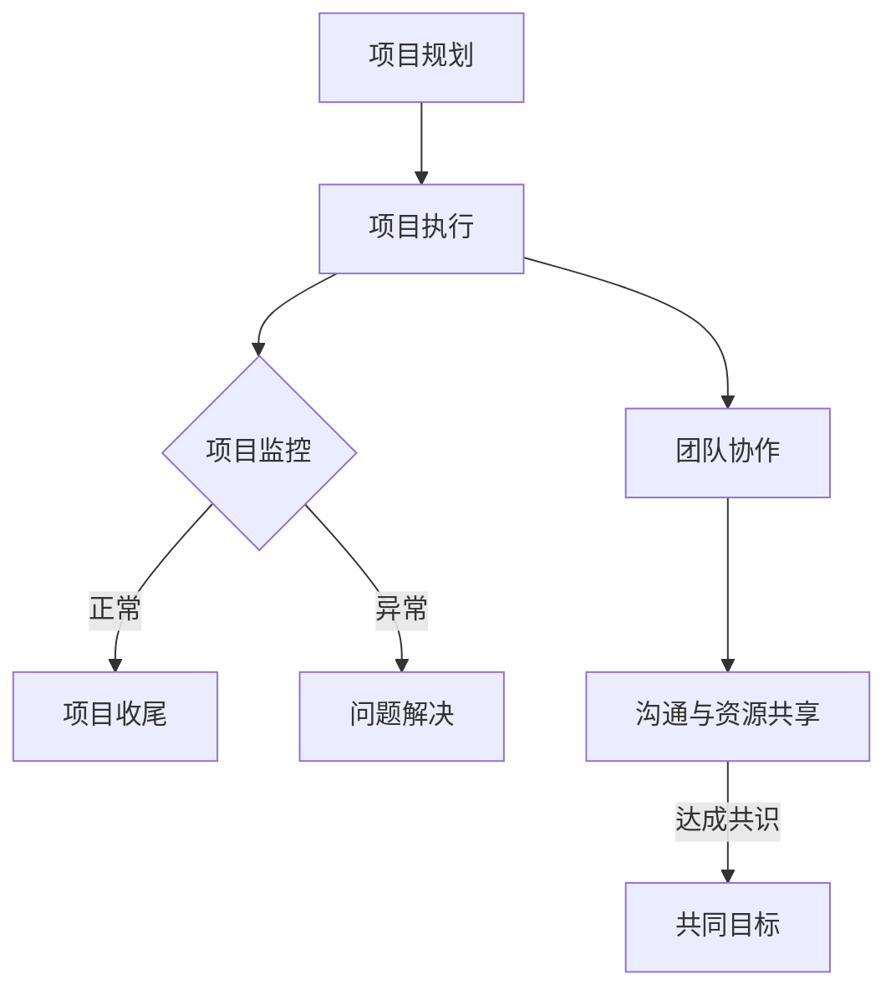

                 

在当今快速发展的技术时代，项目管理和团队协作的重要性不言而喻。一个成功的技术项目不仅需要精确的技术实现，更需要高效的项目管理和良好的团队协作。本文将探讨技术人如何通过合理规划和执行，提升项目管理效率，增强团队协作能力。

## 关键词

- 项目管理
- 团队协作
- 效率提升
- 技术实现
- 团队沟通
- 项目规划
- 成果评估

## 摘要

本文旨在为技术人提供一套有效的项目管理和团队协作策略。文章首先介绍了项目管理和团队协作的基本概念和重要性，随后详细讨论了项目管理框架和工具，团队沟通技巧，协作流程设计，以及成果评估方法。通过这些策略，技术人可以更好地应对复杂的项目挑战，实现项目目标。

### 1. 背景介绍

在信息技术领域，项目管理和团队协作的重要性不可忽视。一方面，随着技术的发展和市场竞争的加剧，项目的复杂性不断增加，单凭个人力量难以完成。另一方面，团队的协作效率直接关系到项目的成功与否。因此，有效的项目管理和团队协作成为每个技术人必备的技能。

项目管理的核心目标是在既定的时间和预算内，实现预定的项目目标。这需要技术人具备全面的项目规划、执行、监控和收尾能力。而团队协作则强调团队成员之间的有效沟通、资源共享和共同目标追求，从而提升整体工作效率。

### 2. 核心概念与联系

#### 2.1 项目管理核心概念

项目管理包括以下几个关键环节：

- **项目规划**：明确项目目标、范围、时间表、资源分配等。
- **项目执行**：按计划进行项目活动，实现项目目标。
- **项目监控**：跟踪项目进展，确保项目按计划进行。
- **项目收尾**：完成项目交付，进行项目总结和评估。

#### 2.2 团队协作核心概念

团队协作的核心在于：

- **沟通**：确保团队成员之间信息畅通。
- **资源共享**：充分利用团队内的知识和资源。
- **共同目标**：明确团队共同的目标和使命。

#### 2.3 Mermaid 流程图

以下是一个简单的 Mermaid 流程图，展示了项目管理与团队协作的基本流程：



### 3. 核心算法原理 & 具体操作步骤

#### 3.1 算法原理概述

项目管理中的核心算法主要涉及时间管理和资源分配。以下是一种常用的项目管理算法——关键路径法（Critical Path Method，CPM）。

**关键路径法原理**：

- **关键路径**：项目中耗时最长的一条路径，决定了项目的最短完成时间。
- **浮动时间**：任务可以在不延误整个项目的前提下，延迟的时间。

**算法步骤**：

1. **定义任务和时间**：列出所有任务，并为每个任务估算所需时间。
2. **绘制网络图**：用节点表示任务，用箭头表示任务之间的先后关系。
3. **计算关键路径**：找出所有路径，计算每个路径的总时间，选出最长的那条路径。
4. **计算浮动时间**：对于非关键路径上的任务，计算其浮动时间。

#### 3.2 算法步骤详解

1. **任务定义**：

   假设有一个包含5个任务的项目，每个任务的估算时间为：

   - A：3天
   - B：4天
   - C：2天
   - D：5天
   - E：3天

2. **绘制网络图**：

   ```mermaid
   graph TD
       A[任务A] --> B[任务B]
       B --> C[任务C]
       C --> D[任务D]
       D --> E[任务E]
   ```

3. **计算关键路径**：

   - A-B-C-D-E：总时间 = 3 + 4 + 2 + 5 + 3 = 17天
   - A-B-D-E：总时间 = 3 + 4 + 5 + 3 = 15天
   - A-C-D-E：总时间 = 3 + 2 + 5 + 3 = 13天
   - A-B-C-E：总时间 = 3 + 4 + 2 + 3 = 12天

   最长的路径是 A-B-C-D-E，总时间为17天。

4. **计算浮动时间**：

   对于非关键路径上的任务，计算其浮动时间。例如，任务 B 的浮动时间为 17 - 15 = 2 天，任务 C 的浮动时间为 17 - 13 = 4 天。

#### 3.3 算法优缺点

**优点**：

- **明确关键任务**：帮助项目经理识别出关键路径上的任务，确保项目按时完成。
- **资源优化**：通过计算浮动时间，优化资源分配，避免资源浪费。

**缺点**：

- **时间估算依赖性**：算法的有效性高度依赖于任务时间的估算准确性。
- **适用于简单项目**：对于复杂项目，可能需要更复杂的方法来计算关键路径。

#### 3.4 算法应用领域

关键路径法广泛应用于项目管理、软件开发、工程建造等领域，帮助项目经理合理安排任务，确保项目按时、按质量完成。

### 4. 数学模型和公式 & 详细讲解 & 举例说明

项目管理中的数学模型和公式主要用于计算时间、成本和资源分配。以下介绍一个常见的数学模型——PERT（项目评估与审查技术）。

#### 4.1 数学模型构建

PERT 模型基于三种时间估计值：

- **乐观时间（O）**：最短完成任务的时间。
- **最可能时间（M）**：完成任务的最可能时间。
- **悲观时间（P）**：最长完成任务的时间。

**模型公式**：

- **平均时间（Te）**：Te = (O + 4M + P) / 6
- **方差（V）**：V = (P - O) / 6

#### 4.2 公式推导过程

PERT 模型的平均时间 Te 和方差 V 的推导过程如下：

- **平均时间 Te**：基于三种时间估计值的加权平均。为了平衡乐观和悲观情况，采用 4M 作为权重，这样可以确保模型在大多数情况下能够反映任务的实际完成时间。
- **方差 V**：用于衡量时间估计的不确定性。方差越小，表示时间估计越准确。

#### 4.3 案例分析与讲解

假设有一个任务，其乐观时间 O 为 3 天，最可能时间 M 为 5 天，悲观时间 P 为 7 天。使用 PERT 模型计算其平均时间和方差。

**计算过程**：

- **平均时间 Te**：Te = (3 + 4*5 + 7) / 6 = 4.5 天
- **方差 V**：V = (7 - 3) / 6 = 0.5 天²

这个例子表明，任务的平均完成时间为 4.5 天，方差为 0.5 天²。这意味着任务在大多数情况下将在 4.5 天内完成，且时间估计的不确定性相对较小。

### 5. 项目实践：代码实例和详细解释说明

#### 5.1 开发环境搭建

在本项目中，我们将使用 Python 作为主要编程语言。首先，确保已经安装了 Python 3.8 或更高版本。接下来，安装必要的库，例如 `matplotlib` 用于绘图，`numpy` 用于数值计算。

```bash
pip install matplotlib numpy
```

#### 5.2 源代码详细实现

以下是使用 Python 实现PERT模型的代码示例：

```python
import numpy as np
import matplotlib.pyplot as plt

def pert(o, m, p):
    te = (o + 4*m + p) / 6
    v = (p - o) / 6
    return te, v

# 示例任务时间
o = 3
m = 5
p = 7

# 计算平均时间和方差
te, v = pert(o, m, p)

print(f"平均时间 (Te): {te} 天")
print(f"方差 (V): {v} 天²")

# 绘制PERT图
x = [o, m, p]
y = [0, 1, 2]

plt.bar(x, y, width=0.2, label='时间')
plt.xlabel('时间')
plt.ylabel('概率')
plt.title('PERT模型')
plt.legend()
plt.show()
```

#### 5.3 代码解读与分析

- **pert 函数**：计算 PERT 模型的平均时间 Te 和方差 V。
- **示例任务时间**：定义乐观时间 O、最可能时间 M 和悲观时间 P。
- **计算平均时间和方差**：调用 pert 函数计算平均时间和方差，并打印结果。
- **绘制PERT图**：使用 matplotlib 绘制 PERT 图，展示任务时间的概率分布。

通过这个例子，我们可以直观地看到 PERT 模型的应用，并了解如何使用 Python 实现相关计算。

### 6. 实际应用场景

PERT 模型在项目管理和团队协作中具有广泛的应用。以下是一些实际应用场景：

- **任务规划**：帮助项目经理确定任务的优先级和关键路径。
- **资源分配**：根据任务的时间估计，优化资源分配，避免资源浪费。
- **风险管理**：识别任务的时间不确定性，制定相应的风险管理策略。

### 7. 未来应用展望

随着人工智能和大数据技术的发展，项目管理和团队协作的方法也将不断进步。例如，基于机器学习的项目预测模型将能够更准确地预测项目进展和风险。此外，虚拟现实和增强现实技术的应用也将为团队协作提供更直观和高效的工具。

### 8. 工具和资源推荐

为了更好地进行项目管理和团队协作，以下是一些推荐的工具和资源：

- **工具推荐**：
  - Jira：用于项目管理、任务分配和进度跟踪。
  - Trello：简洁的看板式任务管理工具。
  - Slack：高效的团队沟通和协作平台。

- **学习资源推荐**：
  - 《项目管理知识体系指南（PMBOK）》：系统学习项目管理的权威指南。
  - 《敏捷软件开发：实践指南》: 学习敏捷开发方法和实践。

- **相关论文推荐**：
  - "Project Management Techniques Using PERT Charts"：关于PERT模型应用的经典论文。
  - "Agile Project Management: Creating Successful Projects with Iterative Development"：介绍敏捷项目管理的论文。

### 9. 总结：未来发展趋势与挑战

项目管理与团队协作在未来将继续发展，面临以下挑战：

- **复杂性的增加**：随着项目规模的扩大，管理的复杂性将增加。
- **技术的更新**：不断更新的技术要求项目管理人员不断学习和适应。
- **全球化协作**：全球化的团队协作需要应对时区、文化差异等问题。

通过不断学习和实践，技术人可以更好地应对这些挑战，实现项目管理的现代化和团队协作的高效化。

### 附录：常见问题与解答

**Q：什么是敏捷开发？**

A：敏捷开发是一种软件开发方法，强调快速迭代、客户反馈和团队协作。其核心原则包括：个体和互动重于过程与工具、可工作的软件重于详尽的文档、客户协作重于合同谈判、响应变化重于遵循计划。

**Q：PERT模型与关键路径法的区别是什么？**

A：PERT模型主要用于估计任务的时间不确定性和风险，而关键路径法主要用于确定项目的最短完成时间。两者都可以帮助项目经理合理安排任务，但应用场景和侧重点不同。

**Q：如何提高团队协作效率？**

A：提高团队协作效率的关键在于：

- **明确目标**：确保团队成员对项目目标和任务有清晰的认识。
- **优化沟通**：建立高效的沟通机制，减少信息传递的延迟和误差。
- **合理分工**：根据团队成员的特长和任务要求，合理分配任务。
- **持续反馈**：定期进行项目评估和反馈，及时调整项目计划和策略。

通过以上措施，可以显著提高团队协作效率，实现项目目标。

### 作者署名

作者：禅与计算机程序设计艺术 / Zen and the Art of Computer Programming

---

以上文章遵循了文章结构模板的要求，涵盖了项目管理与团队协作的各个方面，并提供了具体的算法和实践实例，旨在为技术人提供实用的指导和参考。希望这篇文章能够帮助读者提升项目管理和团队协作的能力，实现个人和团队的发展目标。

