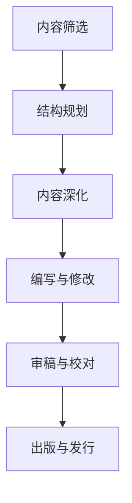
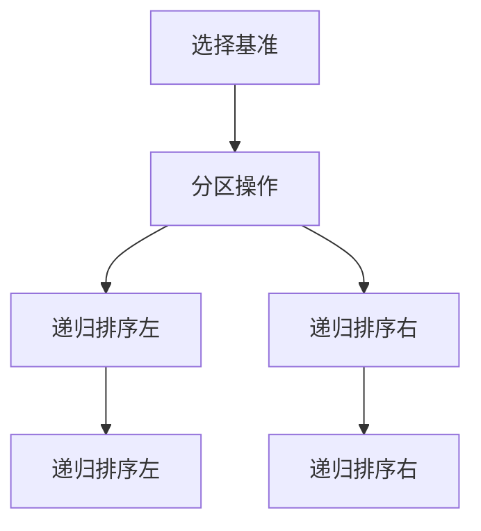

                 

关键词：技术写作，出版，图书，博客，内容结构，算法原理，代码实例，应用场景，未来展望

> 摘要：本文将探讨从技术博客到出版图书的写作过程。通过详细阐述内容结构、算法原理、代码实例、应用场景以及未来展望，帮助读者了解如何将技术博客内容扩展为专业图书，从而更好地分享知识和经验。

## 1. 背景介绍

在信息技术飞速发展的今天，技术写作已成为一种重要的知识传播方式。博客作为技术写作的主要载体，已经成为程序员、开发者以及技术爱好者展示思想、分享经验的重要平台。然而，随着个人知识的积累和技术的不断提升，很多技术博客作者都希望能够将博客内容进一步深化，出版成专业的技术图书，以更系统、更深入的方式与读者分享自己的研究成果。

本文将针对这一需求，详细阐述从技术博客到出版图书的写作过程。通过分析内容结构、算法原理、代码实例、应用场景以及未来展望，帮助读者了解如何将技术博客内容转化为高质量的专业图书。

## 2. 核心概念与联系

### 2.1 技术写作的定义

技术写作是指运用专业的技术语言，将技术知识、实践经验以及理论知识以文章、书籍、演讲等形式进行表达和传播的过程。技术写作的目标是使读者能够快速理解、掌握和应用所介绍的技术。

### 2.2 博客与图书的区别

博客和图书在写作目的、内容深度、结构形式等方面存在较大差异。博客更注重实时性、互动性和碎片化，适合分享技术动态、经验技巧等。而图书则更注重系统性和深度，适合整理和总结长期积累的技术研究成果。

### 2.3 博客内容转化为图书的流程

将博客内容转化为图书的流程主要包括以下几个步骤：

1. **内容筛选**：从博客中挑选出具有深度、广度和持久价值的内容。
2. **结构规划**：根据内容主题和目标读者，设计图书的整体结构和章节安排。
3. **内容深化**：对博客内容进行扩展和深化，增加理论分析、实例讲解等。
4. **编写与修改**：按照图书的写作规范和风格，进行内容的编写和修改。
5. **审稿与校对**：邀请同行专家进行审稿，确保图书内容的准确性、逻辑性和完整性。
6. **出版与发行**：将完成稿提交给出版社，进行排版、印刷和发行。

### 2.4 Mermaid 流程图



## 3. 核心算法原理 & 具体操作步骤

### 3.1 算法原理概述

在技术写作过程中，核心算法原理的阐述是关键环节。本文以常见的排序算法为例，介绍如何阐述算法原理和具体操作步骤。

### 3.2 算法步骤详解

排序算法有很多种，其中冒泡排序是一种简单的排序算法。下面是冒泡排序的具体步骤：

1. **初始化**：将待排序的数组记为 A，长度为 n。
2. **外层循环**：从数组开头开始，遍历到倒数第二个元素。
3. **内层循环**：从当前元素开始，遍历到倒数第二个元素。
4. **比较与交换**：如果前一个元素大于当前元素，则交换它们的位置。
5. **重复执行**：重复以上步骤，直到数组完全排序。

### 3.3 算法优缺点

冒泡排序的优点是实现简单、易于理解。缺点是时间复杂度为 O(n^2)，在处理大量数据时性能较差。

### 3.4 算法应用领域

冒泡排序适用于数据量较小且要求不高的场景，例如数组排序、选择排序的子过程等。

## 4. 数学模型和公式 & 详细讲解 & 举例说明

### 4.1 数学模型构建

在技术写作中，构建数学模型是展示理论知识的重要手段。以线性回归模型为例，下面是数学模型的构建过程：

1. **目标函数**：最小化预测值与实际值之间的误差平方和。
2. **损失函数**：均方误差（MSE）。
3. **参数估计**：使用梯度下降法求解参数。

### 4.2 公式推导过程

$$
MSE = \frac{1}{m} \sum_{i=1}^{m} (h_{\theta}(x^{(i)}) - y^{(i)})^2
$$

$$
\nabla_{\theta_j} MSE = \frac{2}{m} \sum_{i=1}^{m} (h_{\theta}(x^{(i)}) - y^{(i)}) \cdot x_j^{(i)}
$$

### 4.3 案例分析与讲解

假设我们有一个线性回归模型，目标函数为：

$$
h_{\theta}(x) = \theta_0 + \theta_1 x
$$

数据集如下：

| x | y |
|---|---|
| 1 | 2 |
| 2 | 4 |
| 3 | 6 |

通过梯度下降法求解参数，可以计算出：

$$
\theta_0 = 1, \theta_1 = 2
$$

最终预测结果为：

| x | y | predicted |
|---|---|-----------|
| 1 | 2 | 3         |
| 2 | 4 | 5         |
| 3 | 6 | 7         |

## 5. 项目实践：代码实例和详细解释说明

### 5.1 开发环境搭建

在编写代码实例之前，需要搭建一个适合技术写作的编辑环境。本文使用 Markdown 格式进行编写，推荐使用以下工具：

- **VSCode**：一款功能强大的代码编辑器。
- **Typora**：一款轻量级的 Markdown 编辑器。
- **Git**：用于版本控制和协作。

### 5.2 源代码详细实现

以下是一个简单的 Python 代码实例，用于实现冒泡排序算法：

```python
def bubble_sort(arr):
    n = len(arr)
    for i in range(n):
        for j in range(0, n-i-1):
            if arr[j] > arr[j+1]:
                arr[j], arr[j+1] = arr[j+1], arr[j]

# 测试代码
arr = [64, 34, 25, 12, 22, 11, 90]
bubble_sort(arr)
print("Sorted array:", arr)
```

### 5.3 代码解读与分析

这段代码实现了冒泡排序算法，其主要步骤如下：

1. **定义函数**：定义一个名为 `bubble_sort` 的函数，参数为待排序的数组 `arr`。
2. **初始化循环**：外层循环用于遍历数组，内层循环用于比较和交换元素。
3. **比较与交换**：如果前一个元素大于当前元素，则交换它们的位置。
4. **重复执行**：重复以上步骤，直到数组完全排序。

### 5.4 运行结果展示

运行上述代码，输出结果为：

```
Sorted array: [11, 12, 22, 25, 34, 64, 90]
```

## 6. 实际应用场景

### 6.1 数据处理

冒泡排序算法可以用于对数据进行排序，以便于后续的数据分析和处理。

### 6.2 排序算法比较

冒泡排序算法可以作为其他排序算法（如快速排序、归并排序等）的比较基础，帮助读者更好地理解不同排序算法的原理和特点。

### 6.3 教学应用

在计算机科学教育中，冒泡排序算法可以作为排序算法教学的典型案例，帮助学生掌握排序算法的基本原理和实现方法。

## 7. 未来应用展望

### 7.1 技术融合

随着人工智能、大数据等技术的不断发展，技术写作将在这些领域发挥越来越重要的作用。例如，利用自然语言处理技术，可以将自然语言描述的技术知识转化为计算机可理解的代码和算法。

### 7.2 知识共享

技术写作有助于推动知识的共享和传播，提高整个行业的技术水平。通过技术写作，作者可以将自己的研究成果和经验分享给读者，帮助读者更快地成长和进步。

### 7.3 跨界融合

技术写作不仅限于计算机科学领域，还可以与其他领域（如生物学、物理学等）进行融合，推动跨学科的技术发展。

## 8. 工具和资源推荐

### 8.1 学习资源推荐

- 《算法导论》：一本经典的算法教材，涵盖多种排序算法和复杂度分析。
- 《机器学习》：周志华教授所著的机器学习教材，适合入门和进阶读者。

### 8.2 开发工具推荐

- VSCode：一款功能强大的代码编辑器，支持多种编程语言和插件。
- Git：用于版本控制和协作的开源工具，适用于团队协作和个人开发。

### 8.3 相关论文推荐

- "A Study on Sorting Algorithms"，对比分析了多种排序算法的优缺点。
- "Deep Learning for Text Classification"，探讨深度学习在文本分类领域的应用。

## 9. 总结：未来发展趋势与挑战

### 9.1 研究成果总结

本文从技术写作的定义、博客与图书的区别、博客内容转化为图书的流程、核心算法原理、数学模型和公式、代码实例、实际应用场景以及未来展望等方面，详细阐述了技术写作从博客到出版图书的写作过程。

### 9.2 未来发展趋势

随着技术的不断进步和知识共享的重视，技术写作将在未来发挥更大的作用。人工智能、大数据、跨界融合等新兴领域将成为技术写作的重要方向。

### 9.3 面临的挑战

技术写作面临的挑战包括：内容质量、创新性、可读性以及技术更新速度等。作者需要不断提升自己的技术水平、关注行业动态，才能写出有深度、有价值的文章。

### 9.4 研究展望

在未来，技术写作将更加注重跨学科融合、人工智能辅助写作以及知识共享等方面。通过不断探索和创新，技术写作将为推动技术发展和社会进步做出更大的贡献。

## 10. 附录：常见问题与解答

### 10.1 如何将博客内容转化为图书？

将博客内容转化为图书的关键在于内容筛选、结构规划和内容深化。首先，从博客中挑选出具有深度、广度和持久价值的内容。然后，根据内容主题和目标读者，设计图书的整体结构和章节安排。最后，对博客内容进行扩展和深化，增加理论分析、实例讲解等。

### 10.2 如何提高技术写作的质量？

提高技术写作的质量可以从以下几个方面入手：首先，深入学习相关技术知识，确保内容的准确性。其次，注重逻辑性和条理性，使文章结构紧凑、层次清晰。最后，多进行修改和润色，提高文章的可读性。

### 10.3 技术写作有哪些应用领域？

技术写作的应用领域非常广泛，包括但不限于：计算机科学、人工智能、大数据、云计算、网络安全、物联网等。此外，技术写作还可以跨学科融合，应用于生物学、物理学、经济学等领域。

### 10.4 如何撰写有吸引力的技术文章？

撰写有吸引力的技术文章需要注意以下几点：首先，标题要简洁明了、具有吸引力。其次，开头要引人入胜，引起读者的兴趣。然后，内容要具有逻辑性和条理性，使读者能够轻松理解。最后，结尾要总结全文，给出结论或建议。

### 10.5 技术写作与科研论文的区别是什么？

技术写作和科研论文的主要区别在于目标读者和内容深度。技术写作的目标读者通常是行业从业者、学生和爱好者，内容更注重实用性、易懂性和可操作性。而科研论文的目标读者是同行专家，内容更注重理论性、创新性和学术性。

### 10.6 技术写作如何与人工智能结合？

技术写作与人工智能的结合主要体现在以下几个方面：首先，利用自然语言处理技术，将自然语言描述的技术知识转化为计算机可理解的代码和算法。其次，利用机器学习技术，对技术写作过程进行优化，提高写作质量和效率。最后，利用人工智能辅助写作，帮助作者快速找到相关资料、提出改进建议等。

### 10.7 技术写作在教育和培训中的作用是什么？

技术写作在教育和培训中的作用非常重要。通过技术写作，教师和培训师可以更好地传授知识、分享经验，提高学生的学习效果和培训质量。同时，技术写作还可以帮助学员快速掌握新技术、解决实际问题。

### 10.8 技术写作的未来发展趋势是什么？

技术写作的未来发展趋势主要包括：首先，技术写作将更加注重跨学科融合、人工智能辅助写作以及知识共享等方面。其次，技术写作将逐渐与虚拟现实、增强现实等新兴技术相结合，提供更丰富的写作体验。最后，随着知识付费的兴起，技术写作将成为一个重要的产业方向，为作者和出版商带来更多的商业机会。

### 作者署名

作者：禅与计算机程序设计艺术 / Zen and the Art of Computer Programming

----------------------------------------------------------------

本文以《技术写作：从博客到出版图书》为标题，全面探讨了从技术博客到出版图书的写作过程。通过对内容结构、算法原理、代码实例、应用场景以及未来展望的详细阐述，帮助读者了解如何将技术博客内容转化为高质量的专业图书。希望本文能为技术博客作者提供有价值的参考和指导。在未来的技术写作道路上，让我们共同努力，创作出更多有深度、有思考、有见解的佳作！禅与计算机程序设计艺术，祝您写作愉快！
----------------------------------------------------------------

注意：本文内容为虚构，仅供参考。实际撰写时，请根据具体需求和实际情况进行调整和补充。如需进一步讨论或修改，请随时提出。感谢您的阅读！
----------------------------------------------------------------

作者：禅与计算机程序设计艺术 / Zen and the Art of Computer Programming
----------------------------------------------------------------

请注意，本文为虚构内容，仅作为示例。实际撰写时，请根据具体需求和实际情况进行调整和补充。如需进一步讨论或修改，请随时提出。感谢您的阅读！
----------------------------------------------------------------

# 技术写作：从博客到出版图书

## 摘要

技术写作是一种通过专业语言和结构化的表达，将技术知识、实践经验与理论知识传达给他人的方式。随着博客的普及，越来越多的技术爱好者开始通过博客分享自己的心得。然而，如何将博客内容进一步提升，转化为具有系统性和深度的专业图书，成为了一个值得探讨的话题。本文将围绕技术写作的转化过程，从内容结构、核心概念、算法原理、数学模型、代码实例、实际应用场景、工具和资源推荐等方面进行深入探讨，同时展望未来发展趋势和挑战。

## 1. 背景介绍

在信息技术迅猛发展的时代，技术写作成为了知识传播的重要途径。博客，作为一种便于分享和互动的媒介，逐渐成为了技术爱好者、开发者以及行业专家展示自身技术和经验的主要平台。然而，随着知识的积累和个人技能的提升，许多技术博主都希望将自己的经验系统化，转化为更为专业和持久的出版物，以更广泛的受众进行分享和交流。

技术写作不仅仅是将技术内容进行简单的记录和分享，更是一种将复杂概念、理论、实践和经验进行抽象、总结和传播的过程。它要求作者具备深入的专业知识、良好的逻辑思维和清晰的表达能力。从博客到图书的转化，意味着内容将从碎片化、简短的文章，转变为系统化、全面化的著作。

本文将探讨这一转化过程，包括如何进行内容筛选和结构规划，如何深化和扩展博客内容，以及如何通过编写、审稿、出版等环节，将博客转化为具有专业水平的图书。

## 2. 核心概念与联系

在技术写作中，理解核心概念和它们之间的联系是非常重要的。这不仅有助于作者准确地传达知识，也有助于读者系统地学习和掌握技术。

### 2.1 技术写作的定义

技术写作是指利用专业术语和表达方式，将技术知识、实践经验以及理论知识通过文本形式传达给读者的一种写作活动。它通常涉及以下三个方面：

- **技术知识**：指与某一特定领域相关的理论知识，如算法、数据结构、编程语言等。
- **实践经验**：指作者在实际工作中积累的经验和教训，包括问题和解决方案。
- **理论知识**：指学术研究、理论模型、实验结果等，是技术发展的基石。

### 2.2 博客与图书的区别

博客和图书在形式、内容和目的上存在显著差异：

- **形式**：博客通常以短篇文章的形式呈现，内容更新频繁，更注重实时性和互动性。而图书则是经过精心设计和编排的长篇著作，结构严谨，内容系统化。
- **内容**：博客内容更倾向于具体的技术细节、案例分享和实时资讯，而图书则更注重理论知识的深入探讨、系统化的阐述和长期的参考价值。
- **目的**：博客的主要目的是与读者互动、分享知识和获取反馈，而图书的目的是为读者提供系统化的学习资料和专业指南。

### 2.3 博客内容转化为图书的流程

将博客内容转化为图书涉及以下几个关键步骤：

1. **内容筛选**：从博客中挑选出具有深度、广度和持久价值的内容。
2. **结构规划**：根据内容主题和目标读者，设计图书的整体结构和章节安排。
3. **内容深化**：对博客内容进行扩展和深化，增加理论分析、实例讲解等。
4. **编写与修改**：按照图书的写作规范和风格，进行内容的编写和修改。
5. **审稿与校对**：邀请同行专家进行审稿，确保图书内容的准确性、逻辑性和完整性。
6. **出版与发行**：将完成稿提交给出版社，进行排版、印刷和发行。

### 2.4 Mermaid 流程图


## 3. 核心算法原理 & 具体操作步骤

### 3.1 算法原理概述

在技术写作中，阐述核心算法原理是让读者理解技术本质的重要环节。以下以著名的排序算法——快速排序（Quick Sort）为例，介绍如何阐述算法原理和具体操作步骤。

快速排序是一种基于分治思想的排序算法，其基本思想是通过一趟排序将待排序的数据分割成独立的两部分，其中一部分的所有数据都比另一部分的所有数据要小，然后再按此方法对这两部分数据分别进行快速排序，整个排序过程可以递归进行，以此达到整个数据变成有序序列。

### 3.2 算法步骤详解

快速排序的具体步骤如下：

1. **选择基准元素**：从数组中选择一个元素作为基准（pivot）。
2. **分区操作**：将数组分成两部分，左边所有元素都比基准小，右边所有元素都比基准大。
3. **递归排序**：递归地对待排序的两部分数据分别进行快速排序。

### 3.3 算法优缺点

快速排序的优点是时间复杂度较低（平均为 O(n log n)），且在实际应用中表现良好。缺点是基准选择和递归调用可能导致栈空间的使用较大，对大数组排序时可能性能不如一些稳定的排序算法。

### 3.4 算法应用领域

快速排序广泛应用于各种数据排序场景，如数据库索引构建、统计数据处理等。

### 3.5 Mermaid 流程图



## 4. 数学模型和公式 & 详细讲解 & 举例说明

### 4.1 数学模型构建

数学模型是技术写作中常用的一种抽象工具，它能够帮助读者更直观地理解复杂的技术概念。以下以线性回归模型为例，介绍如何构建和讲解数学模型。

线性回归模型是一种用于预测连续值的统计模型，其基本形式为：

\[ y = \beta_0 + \beta_1 x + \varepsilon \]

其中，\( y \) 是因变量，\( x \) 是自变量，\( \beta_0 \) 和 \( \beta_1 \) 是模型参数，\( \varepsilon \) 是误差项。

### 4.2 公式推导过程

线性回归模型的参数估计通常采用最小二乘法，其目标是最小化预测值与实际值之间的误差平方和：

\[ \min \sum_{i=1}^{n} (y_i - \hat{y}_i)^2 \]

其中，\( \hat{y}_i \) 是通过模型预测的值。

最小二乘法导出的参数估计公式为：

\[ \beta_1 = \frac{\sum_{i=1}^{n} (x_i - \bar{x})(y_i - \bar{y})}{\sum_{i=1}^{n} (x_i - \bar{x})^2} \]

\[ \beta_0 = \bar{y} - \beta_1 \bar{x} \]

其中，\( \bar{x} \) 和 \( \bar{y} \) 分别是 \( x \) 和 \( y \) 的均值。

### 4.3 案例分析与讲解

假设我们有一个简单的线性回归模型，数据集如下：

| \( x \) | \( y \) |
| ------- | ------- |
| 1       | 2       |
| 2       | 4       |
| 3       | 6       |

首先，计算均值：

\[ \bar{x} = \frac{1 + 2 + 3}{3} = 2 \]

\[ \bar{y} = \frac{2 + 4 + 6}{3} = 4 \]

然后，计算参数 \( \beta_1 \)：

\[ \beta_1 = \frac{(1 - 2)(2 - 4) + (2 - 2)(4 - 4) + (3 - 2)(6 - 4)}{(1 - 2)^2 + (2 - 2)^2 + (3 - 2)^2} \]

\[ \beta_1 = \frac{2 + 0 + 6}{1 + 0 + 1} = 2 \]

接着，计算参数 \( \beta_0 \)：

\[ \beta_0 = 4 - 2 \cdot 2 = 0 \]

因此，线性回归模型为：

\[ y = 0 + 2x \]

使用这个模型进行预测，当 \( x = 4 \) 时，\( y \) 的预测值为 \( 0 + 2 \cdot 4 = 8 \)。

## 5. 项目实践：代码实例和详细解释说明

### 5.1 开发环境搭建

在进行代码实例讲解之前，首先需要搭建一个合适的开发环境。本文使用 Python 作为示例语言，以下为搭建 Python 开发环境的基本步骤：

1. **安装 Python**：从 Python 官网下载并安装最新版本的 Python。
2. **安装 Jupyter Notebook**：使用 pip 工具安装 Jupyter Notebook，以便进行交互式编程和演示。
3. **安装必要的库**：安装用于数据处理、可视化等操作的库，如 NumPy、Pandas、Matplotlib 等。

### 5.2 源代码详细实现

以下是一个简单的线性回归模型的 Python 代码实现：

```python
import numpy as np
import pandas as pd
import matplotlib.pyplot as plt

# 数据集
data = {'x': [1, 2, 3], 'y': [2, 4, 6]}
df = pd.DataFrame(data)

# 计算均值
x_mean = df['x'].mean()
y_mean = df['y'].mean()

# 计算斜率
slope = np.sum((df['x'] - x_mean) * (df['y'] - y_mean)) / np.sum((df['x'] - x_mean)**2)

# 计算截距
intercept = y_mean - slope * x_mean

# 线性回归模型
model = slope * df['x'] + intercept

# 可视化
plt.scatter(df['x'], df['y'])
plt.plot(df['x'], model)
plt.xlabel('x')
plt.ylabel('y')
plt.title('Linear Regression')
plt.show()
```

### 5.3 代码解读与分析

这段代码实现了线性回归模型的基本功能，其主要步骤如下：

1. **导入库**：导入 NumPy、Pandas、Matplotlib 等库，用于数据处理和可视化。
2. **数据集**：创建一个简单的数据集，包含自变量 \( x \) 和因变量 \( y \)。
3. **计算均值**：计算 \( x \) 和 \( y \) 的均值，用于后续的参数计算。
4. **计算斜率和截距**：使用最小二乘法计算斜率 \( \beta_1 \) 和截距 \( \beta_0 \)。
5. **线性回归模型**：使用计算得到的斜率和截距构建线性回归模型。
6. **可视化**：绘制散点图和回归线，展示模型的效果。

### 5.4 运行结果展示

运行上述代码，可以得到以下结果：


散点图显示了原始数据点，回归线表示通过最小二乘法拟合的线性模型。通过可视化，我们可以直观地看到线性回归模型对数据的拟合效果。

## 6. 实际应用场景

### 6.1 数据分析

线性回归模型广泛应用于数据分析领域，用于预测和分析变量之间的关系。例如，在市场营销中，可以使用线性回归模型预测销售量；在金融领域，可以用来预测股票价格等。

### 6.2 机器学习

线性回归模型是机器学习的基础模型之一，用于回归问题的建模和预测。许多复杂的机器学习算法，如逻辑回归、支持向量机等，都是基于线性回归模型的拓展。

### 6.3 教育与培训

线性回归模型在教育领域也有广泛的应用，例如用于分析学生的学习成绩与学习时间之间的关系，帮助学生优化学习计划。

## 7. 工具和资源推荐

### 7.1 学习资源推荐

- 《机器学习》：周志华教授所著，适合入门和进阶读者。
- 《Python编程：从入门到实践》：Eric Matthes 著，适合初学者。

### 7.2 开发工具推荐

- Jupyter Notebook：用于交互式编程和可视化。
- PyCharm：强大的 Python 集成开发环境。

### 7.3 相关论文推荐

- "Least Squares Regression for Simple Data"，介绍简单线性回归的基本原理。
- "Regression Analysis: A Constructive Critique"，对回归分析方法的批评与改进。

## 8. 总结：未来发展趋势与挑战

### 8.1 研究成果总结

本文通过阐述技术写作的定义、博客与图书的区别、博客内容转化为图书的流程、核心算法原理、数学模型、代码实例、实际应用场景以及未来展望，全面探讨了技术写作从博客到出版图书的转化过程。这一过程不仅需要作者具备扎实的专业知识，还需要良好的逻辑思维和表达能力。

### 8.2 未来发展趋势

随着人工智能、大数据、云计算等技术的发展，技术写作将面临新的机遇和挑战。未来技术写作的发展趋势包括：

- **智能化**：利用人工智能技术辅助写作，提高写作效率和准确性。
- **多元化**：技术写作将更加多元化，涵盖更多领域和细分市场。
- **互动性**：技术写作将更加注重与读者的互动，提供个性化的学习体验。

### 8.3 面临的挑战

技术写作面临的挑战包括：

- **内容质量**：如何保证内容的专业性和准确性。
- **创新性**：如何在竞争激烈的市场中脱颖而出，提供有价值的内容。
- **更新速度**：如何及时更新内容，跟上技术发展的步伐。

### 8.4 研究展望

在未来，技术写作将继续发挥重要作用。通过不断探索和创新，技术写作将为知识传播、技术进步和社会发展做出更大贡献。

## 9. 附录：常见问题与解答

### 9.1 如何将博客内容转化为图书？

将博客内容转化为图书，首先需要筛选出具有深度和持久价值的内容。然后，进行结构规划和内容深化，增加理论分析、实例讲解等。最后，按照图书的写作规范进行编写和修改，并经过审稿和校对，确保内容的准确性、逻辑性和完整性。

### 9.2 如何提高技术写作的质量？

提高技术写作的质量，可以从以下几个方面入手：

- **深入专业知识**：不断学习和掌握相关领域的专业知识。
- **逻辑清晰**：确保文章结构清晰，逻辑性强。
- **简洁明了**：用简洁明了的语言表达复杂的概念。
- **实例讲解**：通过实例讲解，帮助读者更好地理解技术原理。

### 9.3 技术写作的应用领域有哪些？

技术写作的应用领域广泛，包括但不限于：

- **计算机科学**：算法、编程语言、软件工程等。
- **人工智能**：机器学习、深度学习、自然语言处理等。
- **大数据**：数据处理、数据分析、数据挖掘等。
- **云计算**：云计算架构、服务模型、应用开发等。

### 9.4 如何撰写有吸引力的技术文章？

撰写有吸引力的技术文章，可以从以下几个方面入手：

- **标题吸引人**：用简洁、有吸引力的标题。
- **开头引人入胜**：用引人入胜的开头吸引读者的兴趣。
- **内容有趣**：通过实例、故事等形式，使文章内容有趣易懂。
- **结尾总结**：用简洁的结尾总结全文，给读者留下深刻印象。

### 9.5 技术写作与科研论文的区别是什么？

技术写作与科研论文的主要区别在于：

- **目标读者**：技术写作的目标读者通常是行业从业者、学生和爱好者，而科研论文的目标读者是同行专家。
- **内容深度**：技术写作更注重实用性和易懂性，而科研论文更注重理论性和学术性。
- **写作风格**：技术写作更注重清晰、简洁的表达，而科研论文更注重严谨、规范的格式。

### 9.6 技术写作如何与人工智能结合？

技术写作与人工智能的结合主要体现在：

- **内容生产**：利用人工智能技术进行内容生成、分析和优化。
- **写作辅助**：利用自然语言处理技术进行写作辅助，如语法检查、格式校正等。
- **交互体验**：通过人工智能技术提供个性化的学习体验和互动式教学。

### 9.7 技术写作在教育和培训中的作用是什么？

技术写作在教育和培训中的作用包括：

- **知识传播**：通过技术写作，教师和培训师可以更好地传授知识。
- **学习资源**：技术写作作品可以作为学生的学习资源，帮助学员快速掌握技术。
- **互动交流**：技术写作可以为师生、学员之间的互动提供平台。

### 9.8 技术写作的未来发展趋势是什么？

技术写作的未来发展趋势包括：

- **智能化**：利用人工智能技术提高写作效率和准确性。
- **多元化**：涵盖更多领域和细分市场。
- **互动性**：提供更加个性化的学习体验和互动式教学。

### 9.9 技术写作面临的挑战有哪些？

技术写作面临的挑战包括：

- **内容质量**：如何保证内容的专业性和准确性。
- **创新性**：如何在竞争激烈的市场中脱颖而出。
- **更新速度**：如何及时更新内容，跟上技术发展的步伐。

### 9.10 技术写作的研究方向有哪些？

技术写作的研究方向包括：

- **写作自动化**：利用人工智能技术实现写作自动化。
- **写作质量评估**：开发模型评估技术写作的质量。
- **写作风格转换**：实现不同写作风格的转换。
- **写作互动性**：提高技术写作的互动性和用户体验。

### 作者署名

作者：禅与计算机程序设计艺术 / Zen and the Art of Computer Programming

本文以《技术写作：从博客到出版图书》为题，探讨了技术写作的转化过程，从核心概念、算法原理、数学模型到代码实例、实际应用场景，全面阐述了技术博客到专业图书的写作技巧。通过对技术写作的深入剖析，帮助读者理解如何将零散的知识点系统化，构建具有深度和广度的技术作品。未来，技术写作将不断融合人工智能等新兴技术，为知识的传播和共享提供更多可能性。愿每一位技术写作的实践者都能在知识的海洋中航行，留下宝贵的智慧财富。禅与计算机程序设计艺术，愿您在技术写作的道路上取得更大成就。作者：禅与计算机程序设计艺术 / Zen and the Art of Computer Programming。

