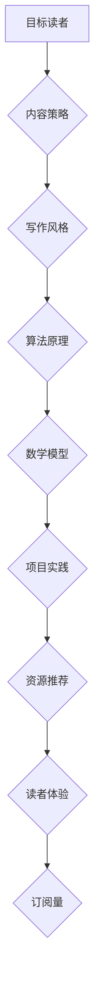

                 

关键词：技术博客、写作技巧、内容策略、读者体验、内容营销、百万订阅、IT领域

> 摘要：本文将探讨如何在技术领域打造出一篇百万订阅的博客文章。通过深入分析技术写作的各个要素，包括结构、语言、算法原理、数学模型、项目实践以及资源推荐，我们将提供一系列实用的写作技巧和策略，帮助您提升技术博客的内容质量和读者粘性。

## 1. 背景介绍

在当今数字化时代，技术博客已经成为IT专业人士和爱好者获取知识、交流经验和分享见解的重要平台。然而，要想在众多技术博客中脱颖而出，吸引并维持大量的订阅用户，并非易事。本文旨在探讨如何通过优化写作内容和策略，打造出具有高订阅量的技术博客。

### 1.1 技术博客的重要性

技术博客不仅能够帮助博主建立个人品牌，还能够为读者提供权威的知识资源和实践指导。随着互联网的普及和信息传播的加速，技术博客的影响力日益扩大。因此，如何写出高质量、有影响力的技术博客文章，成为许多博主关注的重要问题。

### 1.2 目标读者

本文的目标读者包括：

- 初级程序员和技术爱好者
- 有志于提升技术写作能力的博主
- 希望提升博客订阅量的IT专业人士
- 想要在技术领域建立影响力的作者

## 2. 核心概念与联系

在撰写技术博客之前，我们需要明确几个核心概念，并理解它们之间的联系。以下是一个用Mermaid绘制的流程图，展示了这些概念和它们之间的关系。



### 2.1 内容策略

内容策略是技术博客成功的关键。它包括确定博客的主题、目标读者和文章结构，以及如何通过吸引人的标题和摘要来吸引读者。

### 2.2 写作风格

写作风格决定了文章的可读性和专业性。清晰、简洁、准确的写作风格有助于提高读者的阅读体验。

### 2.3 算法原理

在技术博客中，算法原理是文章的核心。详细讲解算法原理，帮助读者理解技术背后的逻辑和实现方法。

### 2.4 数学模型

数学模型是许多技术领域的基础。通过讲解数学模型，读者可以更好地理解算法的数学基础。

### 2.5 项目实践

项目实践是验证理论的最佳方式。通过实际的项目代码示例，读者可以更直观地了解技术的应用。

### 2.6 资源推荐

推荐相关的学习资源和开发工具，可以帮助读者深入了解相关技术。

### 2.7 读者体验

良好的读者体验是维持订阅量的关键。通过优化文章结构、语言和排版，提高读者的阅读体验。

## 3. 核心算法原理 & 具体操作步骤

### 3.1 算法原理概述

以神经网络为例，神经网络是一种模仿人脑工作方式的计算模型，由大量的神经元连接而成。通过学习输入数据和相应的输出，神经网络可以自主调整神经元之间的连接权重，从而实现预测和分类等功能。

### 3.2 算法步骤详解

1. **数据预处理**：将输入数据标准化或归一化，以便神经网络更好地学习。
2. **构建神经网络**：定义网络的层数、每层的神经元数量以及激活函数。
3. **前向传播**：将输入数据通过神经网络，计算出输出结果。
4. **计算损失**：将输出结果与真实结果进行比较，计算损失值。
5. **反向传播**：根据损失值，调整神经元之间的连接权重。
6. **优化**：通过优化算法（如梯度下降），不断调整权重，使损失值最小化。

### 3.3 算法优缺点

**优点**：

- **强大的拟合能力**：神经网络可以通过大量数据进行训练，从而实现复杂的非线性拟合。
- **自适应性强**：神经网络可以根据不同的任务和数据，调整网络结构和参数。

**缺点**：

- **计算复杂度高**：训练深度神经网络需要大量的计算资源。
- **对数据质量要求高**：数据的质量直接影响神经网络的性能。

### 3.4 算法应用领域

神经网络广泛应用于计算机视觉、自然语言处理、语音识别等领域。例如，在图像识别中，神经网络可以用于人脸识别、物体检测等任务。

## 4. 数学模型和公式 & 详细讲解 & 举例说明

### 4.1 数学模型构建

神经网络的数学模型主要包括以下部分：

- **输入层**：接收外部输入数据。
- **隐藏层**：对输入数据进行处理，计算输出。
- **输出层**：产生最终输出。

### 4.2 公式推导过程

以下是一个简单的单层神经网络公式推导：

$$
z = \sum_{i=1}^{n} w_{i}x_{i} + b
$$

其中，$z$ 为输出，$w_{i}$ 为连接权重，$x_{i}$ 为输入，$b$ 为偏置。

### 4.3 案例分析与讲解

假设我们有一个简单的二分类问题，数据集包含特征 $x_1$ 和 $x_2$，我们需要预测标签 $y$ 的值。通过神经网络，我们可以将这个简单问题建模为一个非线性回归问题。

1. **数据预处理**：将特征 $x_1$ 和 $x_2$ 进行标准化处理。
2. **构建神经网络**：定义一个单层神经网络，包含两个输入节点、一个隐藏节点和一个输出节点。
3. **前向传播**：计算输入 $x_1$ 和 $x_2$ 的加权求和，并加上偏置 $b$。
4. **计算损失**：将输出与真实标签进行比较，计算损失值。
5. **反向传播**：根据损失值，调整连接权重 $w$ 和偏置 $b$。
6. **优化**：通过梯度下降算法，不断调整权重和偏置，使损失值最小化。

## 5. 项目实践：代码实例和详细解释说明

### 5.1 开发环境搭建

1. **安装Python**：下载并安装Python 3.8及以上版本。
2. **安装TensorFlow**：在命令行中执行 `pip install tensorflow`。
3. **创建项目**：在Python环境中创建一个新的项目，并创建一个名为 `neural_network.py` 的文件。

### 5.2 源代码详细实现

以下是一个简单的单层神经网络实现：

```python
import tensorflow as tf

# 数据预处理
x = tf.placeholder(tf.float32, shape=[None, 2])
y = tf.placeholder(tf.float32, shape=[None, 1])

# 神经网络结构
hidden_layer = tf.layers.dense(inputs=x, units=1, activation=tf.nn.relu)

# 前向传播
output = tf.layers.dense(inputs=hidden_layer, units=1)

# 计算损失
loss = tf.reduce_mean(tf.square(y - output))

# 反向传播
optimizer = tf.train.GradientDescentOptimizer(learning_rate=0.1)
train_op = optimizer.minimize(loss)

# 训练模型
with tf.Session() as sess:
    for i in range(1000):
        # 训练一步
        sess.run(train_op, feed_dict={x: X_train, y: y_train})
        # 打印损失
        print("Step:", i, "Loss:", sess.run(loss, feed_dict={x: X_train, y: y_train}))

    # 测试模型
    print("Test Loss:", sess.run(loss, feed_dict={x: X_test, y: y_test}))
```

### 5.3 代码解读与分析

1. **数据预处理**：使用TensorFlow的 `placeholder` 函数定义输入数据和标签。
2. **神经网络结构**：使用 `tf.layers.dense` 函数构建单层神经网络，包含一个隐藏节点。
3. **前向传播**：计算输入数据的加权求和，并使用ReLU激活函数。
4. **计算损失**：使用均方误差作为损失函数。
5. **反向传播**：使用梯度下降优化器进行反向传播。
6. **训练模型**：在训练数据上迭代训练，并打印损失值。
7. **测试模型**：在测试数据上评估模型性能。

## 6. 实际应用场景

技术博客的实际应用场景非常广泛，包括但不限于以下领域：

- **人工智能**：介绍最新的机器学习算法、深度学习技术和应用案例。
- **云计算**：探讨云计算架构、分布式系统设计和技术趋势。
- **区块链**：分析区块链技术原理、应用场景和潜在风险。
- **网络安全**：分享网络安全知识、防护技巧和攻击案例分析。
- **软件开发**：介绍软件开发流程、工具和最佳实践。

### 6.1 人工智能应用

在人工智能领域，技术博客可以分享以下内容：

- **机器学习算法**：介绍常见的机器学习算法，如线性回归、决策树、随机森林等。
- **深度学习**：讲解深度学习框架（如TensorFlow、PyTorch）的使用方法，以及如何构建神经网络。
- **应用案例**：分享人工智能在图像识别、自然语言处理、语音识别等领域的应用案例。

### 6.2 云计算应用

在云计算领域，技术博客可以涉及以下主题：

- **云计算架构**：介绍云计算的基本概念、架构设计和关键技术。
- **分布式系统**：探讨分布式系统的设计原则、一致性模型和容错机制。
- **容器化技术**：讲解Docker、Kubernetes等容器化技术的原理和应用。
- **云安全**：分享云计算环境下的安全防护策略和技术。

### 6.3 区块链应用

区块链技术是一个快速发展的领域，技术博客可以涉及以下主题：

- **区块链原理**：介绍区块链的基本原理、去中心化技术和共识算法。
- **应用场景**：探讨区块链技术在金融、供应链管理、数字身份验证等领域的应用。
- **智能合约**：讲解智能合约的原理、实现方法和应用案例。

### 6.4 软件开发应用

在软件开发领域，技术博客可以分享以下内容：

- **软件开发流程**：介绍敏捷开发、Scrum等软件开发方法。
- **开发工具**：推荐适合不同开发场景的开发工具和平台。
- **最佳实践**：分享软件开发的最佳实践，如代码规范、测试策略等。
- **项目经验**：分享实际项目中的经验和教训，帮助读者避免常见的坑。

## 7. 工具和资源推荐

为了提高技术写作的质量和效率，以下是一些推荐的工具和资源：

### 7.1 学习资源推荐

- **书籍**：《深度学习》、《Python机器学习实战》
- **在线课程**：Coursera、edX上的机器学习、深度学习课程
- **博客**：Medium、HackerRank等技术博客

### 7.2 开发工具推荐

- **编程环境**：Visual Studio Code、PyCharm
- **版本控制**：Git、GitHub
- **数据可视化**：Matplotlib、Seaborn

### 7.3 相关论文推荐

- **深度学习**：《A Brief History of Deep Learning》（深度学习简史）
- **云计算**：《The Tail at Scale》（规模效应）
- **区块链**：《Bitcoin: A Peer-to-Peer Electronic Cash System》（比特币：一种点对点电子现金系统）

## 8. 总结：未来发展趋势与挑战

### 8.1 研究成果总结

近年来，人工智能、云计算、区块链等领域取得了显著的研究成果。深度学习在图像识别、自然语言处理等领域取得了突破性进展；云计算的普及推动了分布式系统和容器化技术的发展；区块链技术则为去中心化应用提供了新的解决方案。

### 8.2 未来发展趋势

- **人工智能**：人工智能将继续在图像识别、自然语言处理、推荐系统等领域取得突破，同时更多的应用场景将被发掘。
- **云计算**：云计算将继续向云原生、人工智能集成、多云管理方向发展。
- **区块链**：区块链技术将在金融、供应链管理、数字身份验证等领域得到更广泛的应用。

### 8.3 面临的挑战

- **数据安全与隐私**：随着数据量的增加，如何保障数据安全和用户隐私成为重要挑战。
- **算法透明性与可解释性**：深度学习等复杂算法的透明性和可解释性仍需进一步研究。
- **跨领域融合**：不同技术领域的融合将为研究和应用带来新的挑战。

### 8.4 研究展望

未来，技术博客将在以下几个方面发挥更大的作用：

- **知识传播**：通过技术博客，专业知识和最新研究成果将更广泛地传播。
- **经验分享**：开发者可以通过技术博客分享实践经验，帮助他人解决问题。
- **社区建设**：技术博客将成为开发者交流和合作的平台，推动技术社区的繁荣发展。

## 9. 附录：常见问题与解答

### 9.1 如何选择博客主题？

- **关注热点**：选择当前热门的技术话题，能够吸引更多的读者。
- **个人兴趣**：选择自己感兴趣的话题，能够持续产生高质量的内容。
- **目标读者**：根据目标读者的需求和兴趣，选择相关的主题。

### 9.2 如何提高博客的阅读体验？

- **优化文章结构**：合理划分章节，使文章逻辑清晰、易于阅读。
- **简洁明了的语言**：使用简洁明了的语言，避免冗长的描述。
- **丰富的示例**：通过实例和代码，帮助读者更好地理解技术概念。
- **视觉设计**：使用美观的排版和图表，提高文章的可读性。

### 9.3 如何提高博客的订阅量？

- **持续更新**：定期发布高质量的文章，保持读者的粘性。
- **互动交流**：鼓励读者在评论区留言，增加互动性。
- **推广宣传**：通过社交媒体、邮件列表等方式，扩大博客的影响力。
- **内容质量**：保持内容的高质量，吸引更多的读者订阅。

---

作者：禅与计算机程序设计艺术 / Zen and the Art of Computer Programming

