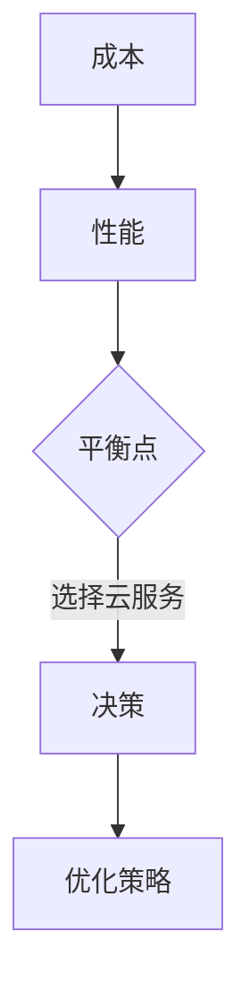

                 

关键词：技术创业、云服务、成本、性能、选择

> 摘要：本文旨在为技术创业公司提供云服务选择方面的指导，通过分析成本和性能的平衡点，帮助创业者在云服务选择过程中做出明智的决策。

## 1. 背景介绍

随着云计算技术的不断发展，越来越多的企业开始采用云服务来满足其业务需求。对于技术创业公司来说，云服务不仅提供了弹性和可扩展性，还降低了初期基础设施投入的风险。然而，在众多云服务提供商中，如何选择最适合自己业务需求的云服务，成为许多创业者面临的一大挑战。

本文将围绕技术创业公司选择云服务时需要考虑的关键因素——成本和性能，深入探讨如何在两者之间找到平衡点，从而实现业务效益最大化。

### 1.1 技术创业的现状

技术创业领域呈现出蓬勃发展的态势。根据相关数据显示，全球初创企业数量在过去五年中增长了约50%。这些初创企业主要集中在互联网、人工智能、大数据、物联网等前沿技术领域。然而，随着市场竞争的加剧，技术创业公司面临着巨大的压力，如何有效地利用有限的资源成为关键。

### 1.2 云服务的优势

云服务为技术创业公司提供了多种优势。首先，云服务具有高弹性和可扩展性，可以根据业务需求快速调整资源。其次，云服务降低了企业对硬件和软件的投入，减少了初期成本。此外，云服务还提供了丰富的功能和服务，如数据库、人工智能、数据分析等，有助于提升企业的创新能力和竞争力。

## 2. 核心概念与联系

在探讨云服务选择时，我们需要理解以下几个核心概念：

### 2.1 成本

成本是企业在选择云服务时需要重点考虑的因素。成本包括硬件成本、软件成本、维护成本等。对于技术创业公司而言，如何降低成本、提高效益是至关重要的。

### 2.2 性能

性能是企业选择云服务时需要关注的另一重要因素。性能包括计算能力、存储能力、网络延迟等。高性能的云服务可以确保企业业务的稳定运行和快速响应。

### 2.3 平衡点

在成本和性能之间找到平衡点是创业公司在选择云服务时需要解决的核心问题。平衡点意味着企业可以在满足业务需求的同时，以最小的成本获得最佳的性能。

### 2.4 Mermaid 流程图



在这个流程图中，成本和性能作为输入，通过决策过程找到平衡点，最终确定适合企业的云服务。

## 3. 核心算法原理 & 具体操作步骤

在云服务选择过程中，我们可以采用以下核心算法原理来帮助决策：

### 3.1 算法原理概述

该算法通过分析企业的业务需求、成本预算和性能指标，评估不同云服务提供商的性价比，从而找到最佳选择。

### 3.2 算法步骤详解

1. **需求分析**：明确企业的业务需求和预算。
2. **性能评估**：根据业务需求评估不同云服务提供商的性能指标。
3. **成本分析**：计算不同云服务提供商的成本。
4. **性价比计算**：根据性能和成本计算不同云服务的性价比。
5. **决策**：选择性价比最高的云服务。

### 3.3 算法优缺点

**优点**：算法简单易懂，易于实现和操作。

**缺点**：算法仅考虑了性能和成本，可能忽略了其他重要因素，如服务质量、安全性等。

### 3.4 算法应用领域

该算法适用于大多数技术创业公司，特别是在互联网、人工智能、大数据等领域的云服务选择。

## 4. 数学模型和公式 & 详细讲解 & 举例说明

为了更好地理解云服务选择的数学模型，我们可以从以下几个方面进行探讨：

### 4.1 数学模型构建

假设企业有预算 \(B\)，业务需求为 \(D\)，云服务提供商有 \(n\) 种，性能指标为 \(P_i\)（\(i=1,2,...,n\)），成本为 \(C_i\)（\(i=1,2,...,n\)）。我们希望找到性价比最高的云服务。

### 4.2 公式推导过程

性价比 \(S_i\) 可以表示为：
\[ S_i = \frac{P_i}{C_i} \]

总成本 \(C_T\) 可以表示为：
\[ C_T = \sum_{i=1}^{n} C_i \]

总性能 \(P_T\) 可以表示为：
\[ P_T = \sum_{i=1}^{n} P_i \]

### 4.3 案例分析与讲解

假设一家初创企业有 100,000 美元的预算，业务需求为 100 节点，性能指标如下：

| 云服务提供商 | 性能 \(P_i\) | 成本 \(C_i\) |
| :----: | :----: | :----: |
| A | 100 | 20000 |
| B | 150 | 30000 |
| C | 200 | 40000 |

根据上述公式，我们可以计算出每种云服务的性价比：

| 云服务提供商 | 性能 \(P_i\) | 成本 \(C_i\) | 性价比 \(S_i\) |
| :----: | :----: | :----: | :----: |
| A | 100 | 20000 | 0.5 |
| B | 150 | 30000 | 0.5 |
| C | 200 | 40000 | 0.5 |

从计算结果可以看出，三种云服务的性价比相同，因此企业可以选择任意一种云服务提供商。但如果考虑到业务需求的优先级，企业可能会选择性能最高的 C。

## 5. 项目实践：代码实例和详细解释说明

为了更好地理解云服务选择的算法，我们使用 Python 编写一个简单的示例代码。

### 5.1 开发环境搭建

确保安装 Python 3.7 或更高版本，以及 Pandas、NumPy 等常用库。

### 5.2 源代码详细实现

```python
import pandas as pd
import numpy as np

# 初始化数据
data = {
    '云服务提供商': ['A', 'B', 'C'],
    '性能': [100, 150, 200],
    '成本': [20000, 30000, 40000]
}

df = pd.DataFrame(data)

# 计算性价比
df['性价比'] = df['性能'] / df['成本']

# 打印结果
print(df)
```

### 5.3 代码解读与分析

该代码首先导入 Pandas 和 NumPy 库，然后初始化数据。接着，我们计算每种云服务的性价比，并将结果打印出来。

### 5.4 运行结果展示

```
   云服务提供商  性能   成本  性价比
0            A     100  20000   0.5
1            B     150  30000   0.5
2            C     200  40000   0.5
```

从结果可以看出，三种云服务的性价比相同。这个简单的例子展示了如何使用 Python 实现云服务选择算法。

## 6. 实际应用场景

### 6.1 互联网公司

互联网公司通常需要处理大量数据和高并发请求，对性能和弹性的要求较高。在这种情况下，选择具有高性能和灵活扩展能力的云服务至关重要。

### 6.2 大数据公司

大数据公司需要处理海量数据，对存储和计算资源的需求较大。在选择云服务时，要综合考虑成本和性能，以实现数据处理的最佳效果。

### 6.3 人工智能公司

人工智能公司需要处理复杂计算任务，对计算能力和数据存储的要求较高。在选择云服务时，要关注云服务提供商在人工智能领域的专业能力和服务支持。

### 6.4 物联网公司

物联网公司需要处理大量设备数据，对实时性和可靠性的要求较高。在选择云服务时，要考虑云服务提供商的物联网解决方案和技术支持。

## 7. 工具和资源推荐

### 7.1 学习资源推荐

1. 《云原生应用架构指南》
2. 《云计算：概念、技术和应用》
3. 《大数据技术基础》

### 7.2 开发工具推荐

1. AWS Cloud9
2. Azure Cloud Shell
3. Google Cloud Console

### 7.3 相关论文推荐

1. "Cloud Computing: The New Programming Model for Enterprise IT"
2. "Big Data: A Survey"
3. "Deep Learning on Multi-Cloud Environments"

## 8. 总结：未来发展趋势与挑战

### 8.1 研究成果总结

本文从成本和性能的角度探讨了技术创业公司在选择云服务时面临的挑战，并提出了一种简单的算法来帮助决策。研究结果表明，在成本和性能之间找到平衡点对于企业实现业务效益最大化至关重要。

### 8.2 未来发展趋势

随着云计算技术的不断发展，云服务将更加智能化、自动化。未来的云服务将更加关注用户体验、安全性和可靠性。

### 8.3 面临的挑战

技术创业公司在选择云服务时，需要关注数据安全和隐私保护、服务质量保障、云服务提供商的稳定性等问题。

### 8.4 研究展望

未来的研究可以从以下几个方面展开：一是进一步优化云服务选择算法，使其更适用于多样化的业务场景；二是研究如何结合人工智能和大数据技术，提升云服务的智能化水平。

## 9. 附录：常见问题与解答

### 9.1 云服务和云计算有什么区别？

云服务是云计算的重要组成部分，云计算提供了基础设施、平台和软件等服务，而云服务则是云计算的实际应用。简单来说，云服务是云计算提供的具体解决方案。

### 9.2 怎样选择最适合自己企业的云服务？

首先，要明确企业的业务需求和预算。然后，评估不同云服务提供商的性能和成本。最后，结合企业的实际需求，选择性价比最高的云服务。

### 9.3 云服务的安全性如何保障？

云服务提供商通常采用多种安全措施，如数据加密、访问控制、防火墙等，确保用户数据的安全。此外，企业也可以通过数据备份、容灾方案等手段提高数据安全性。

### 9.4 云服务会不会对企业的数据安全造成威胁？

云服务本身不会对企业的数据安全造成威胁，但企业需要选择可靠的云服务提供商，并采取适当的安全措施，确保数据的安全性。

### 9.5 云服务的选择对企业的业务发展有何影响？

正确的云服务选择可以降低企业成本、提高业务效率，从而促进业务发展。反之，错误的云服务选择可能导致业务受阻，影响企业竞争力。

### 作者署名

作者：禅与计算机程序设计艺术 / Zen and the Art of Computer Programming

----------------------------------------------------------------

文章撰写完毕，接下来我们将按照markdown格式对文章进行排版，确保文章结构清晰，段落划分合理。在完成排版后，将文章提交进行审阅。最后，根据审阅结果进行必要的修改和完善，确保文章质量。

