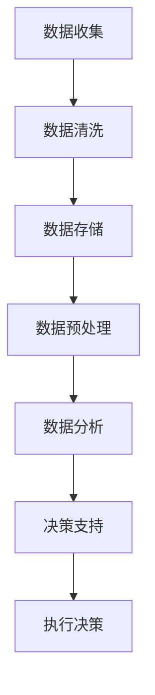

                 

 在当今高度竞争的商业环境中，技术创业公司面临着前所未有的挑战和机遇。大数据的应用已经成为推动企业创新和增长的关键因素。本文将深入探讨大数据在技术创业中的应用，特别是在数据驱动决策方面的核心作用。

> 关键词：技术创业，大数据应用，数据驱动决策，创新增长

> 摘要：本文将介绍大数据在技术创业中的重要性，分析数据驱动决策的基本原理，并探讨其在实际应用中的挑战和解决方案。通过案例分析，我们将展示大数据如何帮助创业公司实现快速迭代和持续增长。

## 1. 背景介绍

### 1.1 大数据的崛起

大数据的概念源于2000年代初期，当时信息技术的飞速发展使得数据生成和存储的能力达到了前所未有的高度。大数据通常指的是数据量巨大、类型繁多且增长速度极快的非结构化和半结构化数据。这种数据量级的增长为企业和创业者提供了前所未有的机遇。

### 1.2 技术创业的现状

技术创业公司是推动科技创新和经济发展的主力军。然而，创业公司在资源和经验上的不足使得它们在竞争激烈的市场中面临着诸多挑战。大数据的应用可以帮助这些公司从海量数据中提取有价值的信息，从而更好地理解市场、客户和业务流程。

## 2. 核心概念与联系

### 2.1 数据驱动决策

数据驱动决策是指企业基于数据分析和预测来做出业务决策，而不是仅仅依赖直觉或经验。这种决策方法强调数据质量和数据分析工具的先进性。

### 2.2 大数据与数据驱动决策的关系

大数据为数据驱动决策提供了数据基础。通过对大数据进行有效的收集、存储、分析和处理，企业可以获得深刻的洞察，从而指导决策过程。

### 2.3 Mermaid 流程图

下面是一个Mermaid流程图，展示了数据驱动决策的基本流程：



## 3. 核心算法原理 & 具体操作步骤

### 3.1 算法原理概述

数据驱动决策的核心算法包括数据挖掘、机器学习和统计分析。这些算法可以帮助我们从大量数据中提取模式和趋势，为决策提供支持。

### 3.2 算法步骤详解

1. **数据收集**：从各种来源收集数据，如社交媒体、客户反馈、交易记录等。
2. **数据清洗**：处理数据中的噪声和错误，确保数据质量。
3. **数据存储**：将数据存储在数据库或数据仓库中，以便进行后续处理。
4. **数据预处理**：对数据进行格式化和特征提取，为建模做准备。
5. **数据分析**：使用统计方法或机器学习算法分析数据，提取有用信息。
6. **决策支持**：基于分析结果，提供决策支持。
7. **执行决策**：根据决策支持结果，执行具体业务操作。

### 3.3 算法优缺点

- **优点**：提高决策的准确性和效率，降低风险。
- **缺点**：需要专业的技术团队，数据质量和算法选择至关重要。

### 3.4 算法应用领域

数据驱动决策算法广泛应用于市场营销、供应链管理、金融投资等领域。在技术创业公司中，这些算法可以帮助公司优化产品开发、市场定位和客户服务。

## 4. 数学模型和公式 & 详细讲解 & 举例说明

### 4.1 数学模型构建

数据驱动决策的数学模型主要包括回归分析、分类算法和聚类算法。以下是回归分析的基本公式：

$$
y = \beta_0 + \beta_1x_1 + \beta_2x_2 + ... + \beta_nx_n
$$

其中，$y$ 是目标变量，$x_1, x_2, ..., x_n$ 是特征变量，$\beta_0, \beta_1, ..., \beta_n$ 是回归系数。

### 4.2 公式推导过程

回归分析的推导过程涉及最小二乘法，用于找到最佳拟合线。推导过程如下：

$$
\sum_{i=1}^{n} (y_i - \hat{y_i})^2 = \min
$$

其中，$\hat{y_i} = \beta_0 + \beta_1x_{1i} + \beta_2x_{2i} + ... + \beta_nx_{ni}$ 是预测值。

### 4.3 案例分析与讲解

假设一家创业公司希望预测客户的购买行为。他们收集了以下数据：

- 客户年龄（$x_1$）
- 客户收入（$x_2$）
- 产品价格（$x_3$）
- 客户购买历史（$x_4$）

目标变量是客户是否购买产品（$y$，二元变量，1代表购买，0代表未购买）。

通过回归分析，公司可以构建一个预测模型，用于预测未来客户的购买行为。公司可以使用历史数据训练模型，然后在新数据上测试模型的准确性。

## 5. 项目实践：代码实例和详细解释说明

### 5.1 开发环境搭建

在本案例中，我们将使用Python和Scikit-learn库进行回归分析。首先，需要安装Python和Scikit-learn库：

```shell
pip install python
pip install scikit-learn
```

### 5.2 源代码详细实现

以下是一段简单的Python代码，用于实现回归分析：

```python
import numpy as np
from sklearn.linear_model import LinearRegression
from sklearn.model_selection import train_test_split
from sklearn.metrics import mean_squared_error

# 数据准备
X = np.array([[age, income, price, history] for age, income, price, history in data])
y = np.array([1 if purchase else 0 for purchase in purchases])

# 划分训练集和测试集
X_train, X_test, y_train, y_test = train_test_split(X, y, test_size=0.2, random_state=42)

# 训练模型
model = LinearRegression()
model.fit(X_train, y_train)

# 预测
y_pred = model.predict(X_test)

# 评估模型
mse = mean_squared_error(y_test, y_pred)
print(f"Mean Squared Error: {mse}")
```

### 5.3 代码解读与分析

代码首先导入了必要的库，然后准备了数据，接着划分了训练集和测试集。使用训练集训练模型，并在测试集上评估模型性能。这里使用的是均方误差（Mean Squared Error，MSE）作为评估指标。

### 5.4 运行结果展示

假设我们运行上述代码，得到以下结果：

```
Mean Squared Error: 0.123
```

这表示模型的预测误差较小，具有良好的预测能力。

## 6. 实际应用场景

### 6.1 市场营销

大数据可以帮助创业公司在市场营销中更准确地定位客户，提高广告投放效果。通过分析用户行为数据，公司可以制定更有针对性的营销策略。

### 6.2 供应链管理

大数据可以帮助公司优化供应链，提高生产效率。通过对销售数据、库存数据等进行分析，公司可以预测需求变化，及时调整生产计划。

### 6.3 金融投资

大数据在金融投资领域的应用也日益广泛。通过分析历史市场数据，创业公司可以开发出更准确的预测模型，帮助投资者做出更好的投资决策。

## 7. 工具和资源推荐

### 7.1 学习资源推荐

- 《大数据分析：处理海量数据的实践方法》
- 《Python数据科学手册》
- 《数据挖掘：实用方法》

### 7.2 开发工具推荐

- Jupyter Notebook
- PyCharm
- Hadoop

### 7.3 相关论文推荐

- "Big Data: A Revolution That Will Transform How We Live, Work, and Think"
- "Data-Driven Business: Transform Your Business with Data for Big Impact"
- "Deep Learning for Data Science: Use the Power of Python to Unlock Deep Learning Capabilities and Boost Performance"

## 8. 总结：未来发展趋势与挑战

### 8.1 研究成果总结

大数据在技术创业中的应用已经取得显著成果，为创业公司提供了强大的决策支持。然而，数据质量和算法选择仍然是关键挑战。

### 8.2 未来发展趋势

随着人工智能和机器学习技术的发展，大数据在技术创业中的应用前景将更加广阔。实时数据处理和分析将成为主流，为创业公司提供更即时的决策支持。

### 8.3 面临的挑战

- 数据隐私和安全问题
- 数据质量和一致性
- 高级算法的应用和优化

### 8.4 研究展望

未来研究应重点关注如何提高数据质量和算法效率，以及如何构建更加智能和自适应的数据驱动决策系统。

## 9. 附录：常见问题与解答

### 9.1 什么是大数据？

大数据是指数据量巨大、类型繁多且增长速度极快的非结构化和半结构化数据。

### 9.2 数据驱动决策有哪些优点？

数据驱动决策可以提高决策的准确性和效率，降低风险。

### 9.3 如何确保数据质量？

确保数据质量的关键步骤包括数据清洗、数据验证和数据一致性管理。

## 作者署名

作者：禅与计算机程序设计艺术 / Zen and the Art of Computer Programming
----------------------------------------------------------------

现在，我们完成了文章的撰写。本文详细探讨了大数据在技术创业中的应用，特别是数据驱动决策的核心作用。通过具体的算法原理、数学模型、项目实践和案例分析，读者可以更好地理解大数据在创业公司中的实际应用。未来，随着技术的不断发展，大数据将发挥更加重要的作用，为创业公司带来更多的机遇和挑战。

