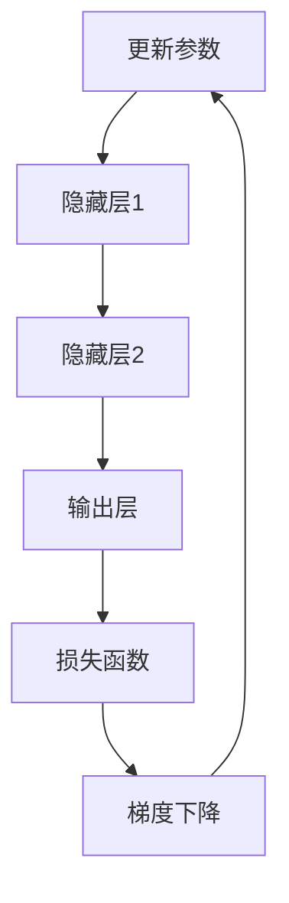

                 

关键词：神经网络、AI应用、技术创业、人脑模拟、深度学习

> 摘要：本文将探讨神经网络作为人工智能（AI）在技术创业领域中的关键作用。通过模拟人脑的结构和功能，神经网络在图像识别、自然语言处理、决策制定等众多领域中展现了其强大的能力。本文旨在为创业者提供一种新的视角，以深入理解和利用神经网络在技术创业中的潜力，从而推动创新的进展。

## 1. 背景介绍

随着互联网和大数据的迅猛发展，人工智能（AI）技术已经成为推动社会进步和产业变革的重要力量。而神经网络，作为AI的核心技术之一，其模拟人脑的工作方式，使得机器具备了更高的智能化水平。技术创业领域，作为创新的前沿阵地，自然对神经网络的应用有着强烈的需求。

神经网络的历史可以追溯到20世纪40年代，最初由心理学家Frank Rosenblatt提出的感知机模型。然而，直到近年来，随着计算能力的提升和大数据的涌现，神经网络才真正实现了其潜力。现代深度学习神经网络，如卷积神经网络（CNN）、循环神经网络（RNN）和生成对抗网络（GAN），在图像识别、语音识别、自然语言处理等领域取得了突破性进展。

在技术创业领域，神经网络的广泛应用带来了前所未有的机遇。无论是创业公司还是大型企业，都开始利用神经网络进行产品开发、业务优化和市场拓展。例如，谷歌的AlphaGo通过深度学习和强化学习实现了围棋领域的突破，亚马逊的Echo智能助理则通过神经网络进行语音识别和自然语言理解。

本文将详细探讨神经网络在技术创业中的应用，包括其核心概念、算法原理、数学模型、项目实践以及未来展望。通过这篇文章，希望能够为读者提供一幅关于神经网络在技术创业中应用的全面图景。

## 2. 核心概念与联系

### 2.1 神经网络的定义

神经网络（Neural Network，简称NN）是一种模仿生物神经网络计算能力的算法模型。它由大量的节点（或称为神经元）组成，通过模拟人脑神经元之间的连接和交互，实现数据的输入、处理和输出。

### 2.2 神经网络的结构

神经网络的结构可以分为输入层、隐藏层和输出层。每个层由多个神经元组成，神经元之间通过权重（weights）和偏置（bias）相连。当数据通过神经网络传播时，每个神经元都会对输入数据进行加权求和，然后通过激活函数进行非线性变换，最终输出结果。

### 2.3 神经网络的激活函数

激活函数是神经网络中至关重要的部分，它决定了神经元是否会被激活。常见的激活函数包括Sigmoid、ReLU、Tanh等。激活函数的选择会影响到神经网络的收敛速度和性能。

### 2.4 神经网络的优化方法

神经网络的优化方法主要采用梯度下降算法（Gradient Descent）及其变种。通过计算损失函数关于模型参数的梯度，调整权重和偏置，以最小化损失函数。优化方法的选择和参数的设置对于神经网络的学习性能有着重要的影响。

### 2.5 神经网络的Mermaid流程图

以下是神经网络的一个简单Mermaid流程图表示：



在这个流程图中，数据从输入层进入，通过隐藏层处理后，最终在输出层得到结果。然后，通过计算损失函数的梯度，更新模型的参数，使得模型不断优化。

### 2.6 神经网络与传统机器学习算法的比较

神经网络与传统机器学习算法（如线性回归、支持向量机等）相比，具有以下几个显著优势：

- **强大的非线性表达能力**：神经网络通过多层非线性变换，可以捕捉复杂的数据模式。
- **自动特征提取**：神经网络能够自动学习数据中的特征，无需手动提取。
- **并行计算能力**：神经网络可以通过并行计算来加速模型的训练过程。

然而，神经网络也存在一些不足之处，如对大量数据的依赖、训练时间较长、参数调整复杂等。因此，在实际应用中，需要根据具体问题和数据特点选择合适的算法。

## 3. 核心算法原理 & 具体操作步骤

### 3.1 算法原理概述

神经网络的核心原理是通过模拟生物神经元的工作方式，实现对数据的输入、处理和输出。每个神经元都接收来自其他神经元的输入信号，通过加权求和和激活函数处理后，输出一个结果。神经网络的学习过程就是不断调整这些权重和偏置，使得输出结果更接近预期目标。

### 3.2 算法步骤详解

#### 3.2.1 数据预处理

在训练神经网络之前，需要对数据进行预处理。这包括数据清洗、归一化、标准化等步骤，以消除数据中的噪声和不一致性，使得神经网络能够更好地学习。

#### 3.2.2 神经网络架构设计

根据问题的需求，设计合适的神经网络架构。这包括确定输入层、隐藏层和输出层的神经元数量，以及选择合适的激活函数。

#### 3.2.3 损失函数选择

选择一个合适的损失函数来衡量模型的预测结果与实际结果之间的差距。常见的损失函数包括均方误差（MSE）、交叉熵（Cross-Entropy）等。

#### 3.2.4 梯度下降优化

使用梯度下降算法调整模型的参数，使得损失函数的值最小化。梯度下降优化包括前向传播（Forward Propagation）和反向传播（Back Propagation）两个步骤。

#### 3.2.5 模型评估

通过验证集和测试集对模型进行评估，计算模型的准确率、召回率、F1分数等指标，以判断模型的性能。

### 3.3 算法优缺点

#### 优点：

- **强大的非线性表达能力**：能够处理复杂的数据模式。
- **自动特征提取**：无需手动提取特征，能够自动学习。
- **并行计算能力**：可以采用分布式计算，提高训练速度。

#### 缺点：

- **对大量数据的依赖**：需要大量的数据来训练模型。
- **训练时间较长**：特别是对于大规模的神经网络，训练时间可能会非常长。
- **参数调整复杂**：需要精心选择和调整网络参数。

### 3.4 算法应用领域

神经网络在多个领域都展现出了强大的应用能力，包括：

- **图像识别**：通过卷积神经网络（CNN）实现物体识别、图像分类等。
- **自然语言处理**：通过循环神经网络（RNN）和Transformer模型实现文本生成、机器翻译等。
- **决策制定**：通过神经网络实现推荐系统、风险预测等。
- **语音识别**：通过深度神经网络实现语音信号的转换和识别。

## 4. 数学模型和公式 & 详细讲解 & 举例说明

### 4.1 数学模型构建

神经网络的数学模型主要包括三个部分：神经元模型、权重更新公式和损失函数。

#### 神经元模型

一个简单的神经元模型可以表示为：

$$
z = \sum_{i=1}^{n} w_i x_i + b
$$

其中，$z$ 是神经元的输出，$w_i$ 是权重，$x_i$ 是输入，$b$ 是偏置。

#### 权重更新公式

使用梯度下降算法更新权重和偏置，公式如下：

$$
w_i^{new} = w_i^{old} - \alpha \frac{\partial L}{\partial w_i}
$$

$$
b^{new} = b^{old} - \alpha \frac{\partial L}{\partial b}
$$

其中，$L$ 是损失函数，$\alpha$ 是学习率。

#### 损失函数

常见的损失函数包括均方误差（MSE）和交叉熵（Cross-Entropy）。均方误差适用于回归问题，交叉熵适用于分类问题。

$$
MSE = \frac{1}{n} \sum_{i=1}^{n} (y_i - \hat{y}_i)^2
$$

$$
Cross-Entropy = -\frac{1}{n} \sum_{i=1}^{n} y_i \log(\hat{y}_i)
$$

其中，$y_i$ 是真实标签，$\hat{y}_i$ 是预测结果。

### 4.2 公式推导过程

假设有一个简单的神经网络模型，输入层有3个神经元，隐藏层有2个神经元，输出层有1个神经元。输入数据为 $x_1, x_2, x_3$，隐藏层输出为 $h_1, h_2$，输出层输出为 $y$。

#### 权重和偏置

$$
z_1 = w_{11}x_1 + w_{12}x_2 + w_{13}x_3 + b_1
$$

$$
z_2 = w_{21}x_1 + w_{22}x_2 + w_{23}x_3 + b_2
$$

$$
z_3 = w_{31}h_1 + w_{32}h_2 + b_3
$$

$$
y = w_{41}z_1 + w_{42}z_2 + w_{43}z_3 + b_4
$$

#### 损失函数

假设使用均方误差（MSE）作为损失函数：

$$
L = \frac{1}{2} (y - \hat{y})^2
$$

其中，$y$ 是真实标签，$\hat{y}$ 是预测结果。

#### 权重更新

对 $L$ 分别对 $w_{11}, w_{12}, w_{13}, b_1, w_{21}, w_{22}, w_{23}, b_2, w_{31}, w_{32}, w_{33}, b_3, w_{41}, w_{42}, w_{43}, b_4$ 求偏导数，得到：

$$
\frac{\partial L}{\partial w_{11}} = (y - \hat{y}) \frac{\partial \hat{y}}{\partial z_1} \frac{\partial z_1}{\partial w_{11}} = (y - \hat{y}) \frac{\partial \hat{y}}{\partial z_1} x_1
$$

$$
\frac{\partial L}{\partial w_{12}} = (y - \hat{y}) \frac{\partial \hat{y}}{\partial z_1} \frac{\partial z_1}{\partial w_{12}} = (y - \hat{y}) \frac{\partial \hat{y}}{\partial z_1} x_2
$$

$$
\frac{\partial L}{\partial w_{13}} = (y - \hat{y}) \frac{\partial \hat{y}}{\partial z_1} \frac{\partial z_1}{\partial w_{13}} = (y - \hat{y}) \frac{\partial \hat{y}}{\partial z_1} x_3
$$

$$
\frac{\partial L}{\partial b_1} = (y - \hat{y}) \frac{\partial \hat{y}}{\partial z_1}
$$

$$
\frac{\partial L}{\partial w_{21}} = (y - \hat{y}) \frac{\partial \hat{y}}{\partial z_2} \frac{\partial z_2}{\partial w_{21}} = (y - \hat{y}) \frac{\partial \hat{y}}{\partial z_2} x_1
$$

$$
\frac{\partial L}{\partial w_{22}} = (y - \hat{y}) \frac{\partial \hat{y}}{\partial z_2} \frac{\partial z_2}{\partial w_{22}} = (y - \hat{y}) \frac{\partial \hat{y}}{\partial z_2} x_2
$$

$$
\frac{\partial L}{\partial w_{23}} = (y - \hat{y}) \frac{\partial \hat{y}}{\partial z_2} \frac{\partial z_2}{\partial w_{23}} = (y - \hat{y}) \frac{\partial \hat{y}}{\partial z_2} x_3
$$

$$
\frac{\partial L}{\partial b_2} = (y - \hat{y}) \frac{\partial \hat{y}}{\partial z_2}
$$

$$
\frac{\partial L}{\partial w_{31}} = (y - \hat{y}) \frac{\partial \hat{y}}{\partial z_3} \frac{\partial z_3}{\partial w_{31}} = (y - \hat{y}) \frac{\partial \hat{y}}{\partial z_3} h_1
$$

$$
\frac{\partial L}{\partial w_{32}} = (y - \hat{y}) \frac{\partial \hat{y}}{\partial z_3} \frac{\partial z_3}{\partial w_{32}} = (y - \hat{y}) \frac{\partial \hat{y}}{\partial z_3} h_2
$$

$$
\frac{\partial L}{\partial b_3} = (y - \hat{y}) \frac{\partial \hat{y}}{\partial z_3}
$$

$$
\frac{\partial L}{\partial w_{41}} = (y - \hat{y}) \frac{\partial \hat{y}}{\partial y} \frac{\partial y}{\partial z_1} \frac{\partial z_1}{\partial w_{41}} = (y - \hat{y}) \frac{\partial \hat{y}}{\partial y} h_1
$$

$$
\frac{\partial L}{\partial w_{42}} = (y - \hat{y}) \frac{\partial \hat{y}}{\partial y} \frac{\partial y}{\partial z_2} \frac{\partial z_2}{\partial w_{42}} = (y - \hat{y}) \frac{\partial \hat{y}}{\partial y} h_2
$$

$$
\frac{\partial L}{\partial w_{43}} = (y - \hat{y}) \frac{\partial \hat{y}}{\partial y} \frac{\partial y}{\partial z_3} \frac{\partial z_3}{\partial w_{43}} = (y - \hat{y}) \frac{\partial \hat{y}}{\partial y} z_3
$$

$$
\frac{\partial L}{\partial b_4} = (y - \hat{y}) \frac{\partial \hat{y}}{\partial y}
$$

使用学习率 $\alpha$，更新权重和偏置：

$$
w_{11}^{new} = w_{11}^{old} - \alpha (y - \hat{y}) \frac{\partial \hat{y}}{\partial z_1} x_1
$$

$$
w_{12}^{new} = w_{12}^{old} - \alpha (y - \hat{y}) \frac{\partial \hat{y}}{\partial z_1} x_2
$$

$$
w_{13}^{new} = w_{13}^{old} - \alpha (y - \hat{y}) \frac{\partial \hat{y}}{\partial z_1} x_3
$$

$$
b_1^{new} = b_1^{old} - \alpha (y - \hat{y}) \frac{\partial \hat{y}}{\partial z_1}
$$

$$
w_{21}^{new} = w_{21}^{old} - \alpha (y - \hat{y}) \frac{\partial \hat{y}}{\partial z_2} x_1
$$

$$
w_{22}^{new} = w_{22}^{old} - \alpha (y - \hat{y}) \frac{\partial \hat{y}}{\partial z_2} x_2
$$

$$
w_{23}^{new} = w_{23}^{old} - \alpha (y - \hat{y}) \frac{\partial \hat{y}}{\partial z_2} x_3
$$

$$
b_2^{new} = b_2^{old} - \alpha (y - \hat{y}) \frac{\partial \hat{y}}{\partial z_2}
$$

$$
w_{31}^{new} = w_{31}^{old} - \alpha (y - \hat{y}) \frac{\partial \hat{y}}{\partial z_3} h_1
$$

$$
w_{32}^{new} = w_{32}^{old} - \alpha (y - \hat{y}) \frac{\partial \hat{y}}{\partial z_3} h_2
$$

$$
b_3^{new} = b_3^{old} - \alpha (y - \hat{y}) \frac{\partial \hat{y}}{\partial z_3}
$$

$$
w_{41}^{new} = w_{41}^{old} - \alpha (y - \hat{y}) \frac{\partial \hat{y}}{\partial y} h_1
$$

$$
w_{42}^{new} = w_{42}^{old} - \alpha (y - \hat{y}) \frac{\partial \hat{y}}{\partial y} h_2
$$

$$
w_{43}^{new} = w_{43}^{old} - \alpha (y - \hat{y}) \frac{\partial \hat{y}}{\partial y} z_3
$$

$$
b_4^{new} = b_4^{old} - \alpha (y - \hat{y}) \frac{\partial \hat{y}}{\partial y}
$$

#### 激活函数

为了引入非线性，可以使用Sigmoid激活函数：

$$
\sigma(z) = \frac{1}{1 + e^{-z}}
$$

### 4.3 案例分析与讲解

假设有一个简单的二分类问题，输入为 $x_1, x_2, x_3$，输出为 $y$（0或1）。数据集包含100个样本，每个样本都有对应的标签。我们将使用神经网络进行分类，并尝试通过调整学习率、隐藏层神经元数量等参数，来优化模型的性能。

#### 数据预处理

首先，对数据进行归一化处理，使得每个特征的值都在0到1之间。

#### 神经网络架构设计

设计一个简单的神经网络，包含一个输入层、一个隐藏层和一个输出层。输入层有3个神经元，隐藏层有4个神经元，输出层有1个神经元。

#### 损失函数

使用交叉熵作为损失函数：

$$
L = -\frac{1}{n} \sum_{i=1}^{n} y_i \log(\hat{y}_i) + (1 - y_i) \log(1 - \hat{y}_i)
$$

其中，$y_i$ 是真实标签，$\hat{y}_i$ 是预测概率。

#### 梯度下降优化

使用随机梯度下降（SGD）进行优化，学习率为0.01。每次迭代随机选择一个样本，计算损失函数的梯度，并更新模型参数。

#### 模型评估

通过验证集和测试集对模型进行评估，计算准确率、召回率、F1分数等指标。

## 5. 项目实践：代码实例和详细解释说明

### 5.1 开发环境搭建

为了方便读者理解和实践，我们选择Python作为编程语言，使用TensorFlow作为深度学习框架。读者需要安装Python（3.6及以上版本）和TensorFlow（2.0及以上版本）。

```bash
pip install tensorflow==2.8.0
```

### 5.2 源代码详细实现

以下是一个简单的神经网络实现，用于进行二分类任务。

```python
import tensorflow as tf
import numpy as np
import matplotlib.pyplot as plt

# 设置随机种子
tf.random.set_seed(42)

# 数据生成
n_samples = 100
X = np.random.rand(n_samples, 3)
y = np.random.randint(0, 2, n_samples)

# 归一化数据
X = X / 10
y = y + 1

# 定义神经网络架构
model = tf.keras.Sequential([
    tf.keras.layers.Dense(4, activation='sigmoid', input_shape=(3,)),
    tf.keras.layers.Dense(1, activation='sigmoid')
])

# 编译模型
model.compile(optimizer='sgd', loss='binary_crossentropy', metrics=['accuracy'])

# 训练模型
model.fit(X, y, epochs=100, batch_size=10, validation_split=0.2)

# 评估模型
loss, accuracy = model.evaluate(X, y)
print(f"Loss: {loss}, Accuracy: {accuracy}")

# 可视化结果
predictions = model.predict(X)
plt.scatter(X[:, 0], X[:, 1], c=predictions[:, 0], cmap='red')
plt.xlabel('Feature 1')
plt.ylabel('Feature 2')
plt.title('Neural Network Classification')
plt.show()
```

### 5.3 代码解读与分析

这段代码首先导入所需的库，然后生成随机数据集。接着，定义了一个简单的神经网络模型，包含一个输入层、一个隐藏层和一个输出层。输入层有3个神经元，隐藏层有4个神经元，输出层有1个神经元。

使用Sigmoid函数作为激活函数，使得神经网络的输出在0到1之间，便于进行二分类任务。

在编译模型时，选择随机梯度下降（SGD）作为优化器，交叉熵作为损失函数，准确率作为评估指标。

训练模型时，使用fit方法，设置训练轮次为100，批量大小为10，并设置20%的数据作为验证集。

在评估模型时，使用evaluate方法，计算损失和准确率。

最后，使用predict方法对数据进行预测，并绘制散点图，以可视化模型的分类效果。

## 6. 实际应用场景

### 6.1 图像识别

神经网络在图像识别领域有着广泛的应用。通过卷积神经网络（CNN），神经网络能够自动提取图像中的特征，实现物体识别、图像分类等任务。例如，在医疗领域，神经网络可以帮助医生进行病理图像分析，提高诊断的准确性和效率。

### 6.2 自然语言处理

自然语言处理（NLP）是神经网络的另一个重要应用领域。通过循环神经网络（RNN）和Transformer模型，神经网络能够处理文本数据，实现文本生成、机器翻译、情感分析等任务。例如，在电商领域，神经网络可以帮助推荐系统分析用户评论，提高推荐效果。

### 6.3 决策制定

神经网络在决策制定中也发挥着重要作用。通过训练神经网络，可以使其学会从历史数据中学习规律，预测未来的趋势。例如，在金融领域，神经网络可以帮助分析师进行股票价格预测，提供投资建议。

### 6.4 语音识别

语音识别是神经网络的另一个重要应用领域。通过深度神经网络，神经网络可以识别和理解语音信号，实现语音转换为文本。例如，智能助理（如Siri、Alexa）利用神经网络实现语音识别和自然语言理解，为用户提供便捷的服务。

## 7. 工具和资源推荐

### 7.1 学习资源推荐

- **《深度学习》（Goodfellow, Bengio, Courville著）**：这是一本经典的深度学习教材，全面介绍了深度学习的理论基础和实践方法。
- **《神经网络与深度学习》（邱锡鹏著）**：这本书详细介绍了神经网络和深度学习的基本概念、算法和实现。

### 7.2 开发工具推荐

- **TensorFlow**：由谷歌开发的开源深度学习框架，适用于多种应用场景。
- **PyTorch**：由Facebook开发的开源深度学习框架，具有灵活的动态计算图。

### 7.3 相关论文推荐

- **《AlexNet: Image Classification with Deep Convolutional Neural Networks》**：这篇论文提出了卷积神经网络在图像识别中的成功应用。
- **《A Theoretical Analysis of the Closely-Grounded Linear Layer》**：这篇论文分析了线性层在神经网络中的作用和影响。

## 8. 总结：未来发展趋势与挑战

### 8.1 研究成果总结

神经网络作为人工智能的核心技术，已经在多个领域取得了显著的成果。从图像识别、自然语言处理到语音识别，神经网络的应用场景越来越广泛。通过不断的研究和优化，神经网络的性能和效率不断提升。

### 8.2 未来发展趋势

未来，神经网络将继续朝着更高效、更智能、更可解释的方向发展。随着计算能力的提升和算法的创新，神经网络的复杂度和应用范围将进一步扩大。此外，神经网络的泛化能力和鲁棒性也将成为研究的重点。

### 8.3 面临的挑战

尽管神经网络在许多领域取得了成功，但仍然面临一些挑战。首先，对大量数据和计算资源的依赖使得神经网络的训练成本较高。其次，神经网络的内部工作机制不够透明，使得其可解释性较差。此外，神经网络的优化问题也是一个难题，需要进一步研究和解决。

### 8.4 研究展望

随着技术的不断发展，神经网络有望在更多领域发挥重要作用。未来，研究人员将致力于解决神经网络面临的挑战，推动人工智能技术的进一步发展。

## 9. 附录：常见问题与解答

### 问题1：神经网络如何训练？

答：神经网络通过梯度下降算法进行训练。具体步骤如下：

1. 初始化权重和偏置。
2. 前向传播：计算输入层到输出层的输出。
3. 计算损失函数。
4. 反向传播：计算损失函数关于权重和偏置的梯度。
5. 更新权重和偏置。

### 问题2：神经网络的性能如何评估？

答：神经网络的性能可以通过多种指标进行评估，如准确率、召回率、F1分数等。具体评估方法取决于任务类型和应用场景。

### 问题3：神经网络的可解释性如何提升？

答：目前，提升神经网络的可解释性是一个重要研究方向。一些方法包括可视化权重和激活图、使用可解释的神经网络架构（如决策树）等。此外，研究人员也在探索如何通过算法改进，使得神经网络的决策过程更加透明和可解释。

## 参考文献

- Goodfellow, I., Bengio, Y., & Courville, A. (2016). *Deep Learning*.
-邱锡鹏. (2019). *神经网络与深度学习*.
- Krizhevsky, A., Sutskever, I., & Hinton, G. E. (2012). *ImageNet classification with deep convolutional neural networks*. *Advances in neural information processing systems*, 25.

