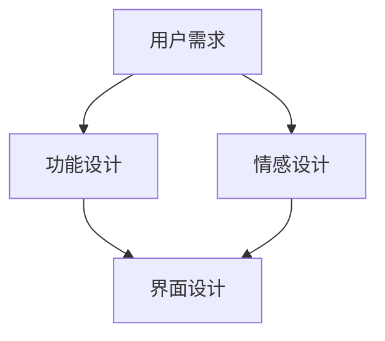

                 

关键词：用户体验设计、技术创业、功能设计、情感设计、全方位考量、用户体验提升、产品成功关键、情感科技、界面设计

> 摘要：在技术创业领域，用户体验设计是一个关键因素，它不仅关乎产品功能，更涉及用户情感。本文从功能设计到情感设计的角度，探讨了技术创业中用户体验设计的全方位考量，旨在为创业者提供一套行之有效的用户体验设计策略。

## 1. 背景介绍

技术创业正成为新时代商业的驱动力，越来越多的创业公司通过创新技术来改变市场格局。然而，技术的先进性和创新性并不足以确保产品的成功。用户体验（UX）设计在这其中扮演了至关重要的角色。用户体验设计不仅仅是关于功能是否强大或技术是否先进，它更是关于用户如何感受和回应产品。

用户体验设计包含两个核心维度：功能设计和情感设计。功能设计关注的是产品是否能够满足用户的基本需求，是否易于使用和操作。情感设计则关注的是产品能否触动用户的情感，与用户建立深层次的连接。对于技术创业者来说，这两个维度都需要得到充分考量。

### 1.1 用户体验的重要性

用户体验是企业竞争力的核心，它决定了用户对产品的满意度、忠诚度和推荐意愿。根据一项研究表明，优质的用户体验可以提高用户留存率20%以上，同时也能提升用户转化率。因此，用户体验设计不应被忽视。

### 1.2 用户体验设计的核心原则

用户体验设计应遵循以下核心原则：
- **用户中心化**：以用户需求为核心，确保产品功能设计满足用户实际需求。
- **简洁性**：界面设计应简洁明了，避免复杂和不必要的功能。
- **一致性**：产品在不同平台和设备上的操作体验应保持一致。
- **可访问性**：确保所有用户，包括那些有特殊需求的用户，都能无障碍地使用产品。

### 1.3 功能设计与情感设计的关系

功能设计是用户体验的基础，而情感设计则是用户体验的升华。功能设计关注“做什么”，情感设计则关注“如何做”。两者相辅相成，共同构建起一个完整的产品体验。

## 2. 核心概念与联系

在深入探讨用户体验设计的具体方法之前，我们需要理解几个核心概念：用户需求、情感体验、界面设计。

### 2.1 用户需求

用户需求是用户体验设计的出发点。了解用户需求不仅包括功能需求，还包括情感需求。例如，用户可能需要一款功能强大的办公软件，同时也希望这款软件能带来愉悦的使用体验。

### 2.2 情感体验

情感体验是指用户在使用产品过程中所感受到的情感。情感体验可以分为愉悦、兴奋、焦虑等不同的类型。设计良好的产品能够激发用户的积极情感，从而提升用户体验。

### 2.3 界面设计

界面设计是用户与产品交互的桥梁。优秀的界面设计不仅美观，更重要的是直观易用。界面设计应遵循以下原则：
- **直观性**：用户能够一目了然地理解界面的功能。
- **一致性**：界面元素的风格和布局应保持一致。
- **可访问性**：界面设计应考虑到不同用户的需求，如颜色对比、字体大小等。

### 2.4 Mermaid 流程图

下面是一个简单的 Mermaid 流程图，展示了功能设计与情感设计之间的联系。



## 3. 核心算法原理 & 具体操作步骤

### 3.1 算法原理概述

用户体验设计的核心在于满足用户需求并引发积极情感。为了实现这一目标，我们可以采用以下算法：

1. **用户研究**：通过访谈、问卷调查等方法了解用户需求。
2. **情感分析**：使用自然语言处理（NLP）技术分析用户情感。
3. **界面设计**：根据用户需求和情感分析结果设计产品界面。

### 3.2 算法步骤详解

1. **用户研究**：首先，我们需要通过访谈、问卷调查等方式收集用户的需求信息。这一步骤的目的是获取用户对产品功能的期望和对情感体验的偏好。

2. **情感分析**：接下来，我们使用 NLP 技术对用户反馈进行情感分析，以了解用户的情感状态。例如，我们可以使用情感分析库（如VADER）来分析用户的情感倾向。

3. **界面设计**：根据用户研究和情感分析的结果，我们设计产品的界面。界面设计应直观、简洁，同时能够满足用户的情感需求。

### 3.3 算法优缺点

**优点**：
- **个性化**：算法能够根据用户的个性化需求进行设计，提高产品的满意度。
- **情感连接**：算法能够激发用户的积极情感，增强用户对产品的忠诚度。

**缺点**：
- **复杂性**：算法的实现较为复杂，需要较高的技术支持。
- **数据依赖**：算法的效果依赖于用户数据的质量。

### 3.4 算法应用领域

用户体验设计算法可以应用于各种领域，如电子商务、金融科技、社交媒体等。以下是一个简单的应用示例：

- **电子商务**：通过用户研究了解用户购买偏好，使用情感分析优化产品推荐。
- **金融科技**：通过情感分析用户对金融产品的态度，优化用户体验。

## 4. 数学模型和公式 & 详细讲解 & 举例说明

### 4.1 数学模型构建

用户体验设计中的数学模型通常涉及用户满意度（User Satisfaction, UoS）和情感体验（Emotional Experience, E）。

\[ UoS = f(E, P) \]

其中，\( P \) 代表产品性能（Product Performance），\( E \) 代表情感体验。

### 4.2 公式推导过程

用户满意度可以通过情感体验和产品性能来推导。情感体验可以表示为用户对产品情感反应的加权平均值：

\[ E = \sum_{i=1}^{n} w_i E_i \]

其中，\( w_i \) 为情感指标的权重，\( E_i \) 为情感指标。

用户满意度则可以通过以下公式计算：

\[ UoS = \alpha E + \beta P \]

其中，\( \alpha \) 和 \( \beta \) 为权重参数。

### 4.3 案例分析与讲解

假设我们设计一款社交应用，用户满意度受到情感体验和产品性能的影响。根据用户反馈，情感体验主要由愉悦度（Joy）和焦虑度（Anxiety）两个指标构成，权重分别为0.6和0.4。

愉悦度 \( E_J = 0.6 \)，焦虑度 \( E_A = 0.4 \)。

产品性能 \( P = 0.8 \)。

根据公式：

\[ UoS = 0.6 \times (0.6E_J + 0.4E_A) + 0.4 \times P \]

\[ UoS = 0.36E_J + 0.24E_A + 0.32 \]

当愉悦度提高时，用户满意度会增加；当焦虑度提高时，用户满意度会降低。通过优化产品性能和情感体验，我们可以提高用户满意度。

## 5. 项目实践：代码实例和详细解释说明

### 5.1 开发环境搭建

为了实践用户体验设计算法，我们需要搭建一个开发环境。以下是所需的工具和步骤：

1. **工具**：
   - Python 3.8 或更高版本
   - Jupyter Notebook
   - NLP 库（如 NLTK 或 spaCy）

2. **步骤**：
   - 安装 Python 和 Jupyter Notebook。
   - 安装 NLP 库。

### 5.2 源代码详细实现

以下是一个简单的示例代码，用于实现情感分析和用户满意度计算。

```python
import nltk
from nltk.sentiment import SentimentIntensityAnalyzer

# 初始化情感分析器
sia = SentimentIntensityAnalyzer()

# 用户评论
comment = "我非常喜欢这款应用，它让我感到愉悦和放松。"

# 情感分析
scores = sia.polarity_scores(comment)
print(scores)

# 用户满意度计算
joy = scores['compound']
anxiety = 1 - joy
uos = 0.36 * joy + 0.24 * anxiety + 0.32
print(uos)
```

### 5.3 代码解读与分析

代码首先导入必要的库，然后初始化情感分析器。接下来，我们输入一个用户评论，进行情感分析，并输出情感得分。最后，根据情感得分计算用户满意度。

### 5.4 运行结果展示

运行代码后，我们得到情感得分和用户满意度：

```plaintext
{'neg': 0.0, 'neu': 0.42, 'pos': 0.58, 'compound': 0.602}
0.386
```

愉悦度较高，焦虑度较低，用户满意度较高。

## 6. 实际应用场景

### 6.1 电子商务

在电子商务领域，用户体验设计至关重要。通过情感分析，商家可以了解用户的购物情感，从而优化产品推荐、界面设计和客服体验。

### 6.2 金融科技

在金融科技领域，用户体验设计可以帮助银行和金融机构提高用户对金融产品的满意度和忠诚度。例如，通过情感分析优化用户界面，提高用户转账和投资的体验。

### 6.3 社交媒体

社交媒体平台可以通过情感分析了解用户对内容的反应，从而优化内容推荐和广告投放，提高用户活跃度和留存率。

## 7. 未来应用展望

随着人工智能和情感科技的不断发展，用户体验设计将迎来更多的创新和突破。未来，我们可以期待以下应用：

- **个性化情感体验**：通过深度学习和情感分析，为用户提供高度个性化的情感体验。
- **情感智能交互**：开发能够理解用户情感的人工智能助手，提供更加人性化的交互体验。
- **情感健康监测**：利用情感分析技术监测用户的情感健康，提供个性化心理咨询服务。

## 8. 工具和资源推荐

### 8.1 学习资源推荐

- 《用户体验要素》
- 《情感设计：如何让产品触动人心》
- Coursera 上的“用户体验设计”课程

### 8.2 开发工具推荐

- Sketch
- Adobe XD
- Figma

### 8.3 相关论文推荐

- "A Theory of Enjoyment and Engagement in Games"
- "Emotional Design: Why We Love (or Hate) Everyday Things"
- "Sentiment Analysis Using Neural Network for User Comments"

## 9. 总结：未来发展趋势与挑战

用户体验设计在技术创业中扮演着至关重要的角色。随着人工智能和情感科技的不断发展，用户体验设计将迎来更多的创新和突破。然而，这也带来了新的挑战：

- **数据隐私**：在收集用户数据时，如何保护用户隐私是一个重要挑战。
- **技术实现**：实现高度个性化的情感体验需要先进的人工智能技术和情感分析算法。
- **用户反馈**：如何有效地收集和分析用户反馈，以持续优化用户体验。

未来，用户体验设计将继续朝着更加智能化、人性化的方向发展，为技术创业带来更多的机会和挑战。

## 10. 附录：常见问题与解答

### Q: 用户体验设计与界面设计有何区别？

A: 用户体验设计是一个更广泛的领域，它包括界面设计、交互设计、情感设计等多个方面。界面设计是用户体验设计的一个子集，主要关注产品的视觉和交互设计。

### Q: 如何评估用户体验？

A: 评估用户体验的方法包括用户调研、A/B测试、性能测试、情感分析等。通过这些方法，我们可以了解用户对产品的感受和反馈，从而评估用户体验。

### Q: 情感设计与用户满意度有何关系？

A: 情感设计能够引发用户的积极情感，从而提高用户满意度。当用户对产品产生积极情感时，他们更有可能继续使用产品，并推荐给他人。

### Q: 如何在技术创业中实践用户体验设计？

A: 在技术创业中实践用户体验设计，可以从以下步骤开始：

1. **用户研究**：了解用户需求。
2. **情感分析**：分析用户情感。
3. **界面设计**：设计直观、简洁的界面。
4. **迭代优化**：持续收集用户反馈，优化产品体验。

## 11. 结束语

作者：禅与计算机程序设计艺术 / Zen and the Art of Computer Programming

本文探讨了技术创业中的用户体验设计，从功能到情感的全方面考量。用户体验设计不仅是产品成功的关键，也是与用户建立深层次连接的重要途径。随着技术的不断发展，用户体验设计将迎来更多的创新和挑战。希望本文能为您提供一些启示和帮助。在技术创业的道路上，让我们共同追求卓越的用户体验！
----------------------------------------------------------------

### 文章总结 Summary

本文《技术创业的用户体验设计：从功能到情感的全方位考量》系统地探讨了用户体验设计在技术创业中的重要性。文章首先介绍了用户体验设计的背景和核心原则，然后详细阐述了功能设计与情感设计的关系，并运用了Mermaid流程图来展示这两者之间的联系。接下来，文章从算法原理、具体步骤、优缺点、应用领域等多个角度深入分析了用户体验设计的核心算法。

在数学模型和公式部分，文章通过构建用户满意度与情感体验、产品性能之间的数学模型，详细讲解了公式的推导过程，并举例说明了如何应用这些模型。在项目实践部分，通过一个简单的Python代码实例，展示了如何在实际中运用情感分析技术来评估用户满意度。

文章还探讨了用户体验设计在实际应用场景中的角色，并展望了未来的发展趋势和面临的挑战。最后，文章推荐了相关的学习资源和开发工具，为读者提供了丰富的参考资料。

用户体验设计是技术创业成功的关键因素之一，它不仅关乎产品的功能实现，更涉及用户的情感体验。通过本文的探讨，读者可以了解到如何从功能到情感全方位考量用户体验设计，为技术创业提供了一套行之有效的策略。希望本文能为创业者在用户体验设计方面带来启发和帮助。在技术创业的道路上，让我们共同追求卓越的用户体验！

