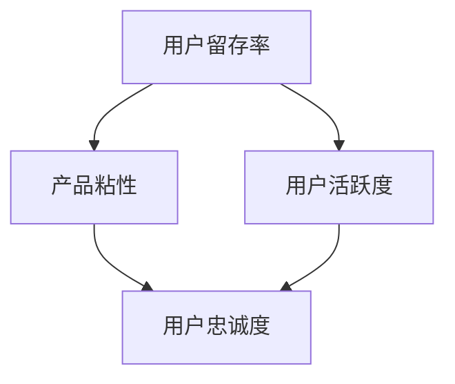

                 

关键词：用户留存，产品粘性，用户活跃度，技术创业，策略分析

> 摘要：本文旨在探讨技术创业公司如何通过有效的用户留存策略来提高产品的粘性和用户活跃度。我们将深入分析用户留存的核心概念，探讨相关的理论框架，并分享具体的实施步骤。此外，文章还将讨论数学模型在用户留存策略中的作用，以及实际应用中的代码实例和效果分析。最后，我们将展望未来的发展趋势和挑战。

## 1. 背景介绍

在当前快速变化的市场环境中，技术创业公司面临着前所未有的挑战和机遇。一方面，随着互联网技术的迅猛发展，新兴市场和用户需求的不断变化使得创业公司有机会快速崛起。另一方面，市场竞争的加剧和用户获取成本的增加，使得创业公司需要更加关注如何保持用户的持续使用和忠诚度。

用户留存是衡量一个产品成功与否的关键指标之一。高留存率意味着用户对产品的依赖性和忠诚度较高，这对于提升产品的市场地位和实现商业价值具有重要意义。然而，技术创业公司在提高用户留存方面面临诸多挑战，如产品功能不全、用户体验差、市场竞争激烈等。

本文将围绕技术创业的用户留存策略，从核心概念、理论框架、实施步骤、数学模型、代码实例、实际应用等多个维度进行深入探讨，旨在为创业公司提供实用的指导和建议。

## 2. 核心概念与联系

在探讨用户留存策略之前，我们首先需要理解一些核心概念，包括用户留存率、产品粘性、用户活跃度等。

### 用户留存率

用户留存率是指在一定时间内，仍然使用产品的用户占初始用户的比例。这个指标通常以月度留存率（MAU，Monthly Active Users）和日度留存率（DAU，Daily Active Users）等形式表示。用户留存率越高，说明产品的用户黏性越强，商业价值越高。

### 产品粘性

产品粘性是指用户对产品的忠诚度和依赖性。高粘性产品能够吸引用户频繁使用，降低用户转向竞争对手的可能性。产品粘性的强弱取决于多种因素，包括用户体验、功能完善度、社区互动等。

### 用户活跃度

用户活跃度是指用户在产品中的参与程度。高活跃度用户不仅使用频率高，还可能产生内容、推荐其他用户等，从而进一步促进产品的发展。

下面是用户留存、产品粘性和用户活跃度之间的关系简化的Mermaid流程图：



从流程图中可以看出，用户留存率、产品粘性和用户活跃度之间存在紧密的联系。高留存率有助于提高产品粘性和用户活跃度，而产品粘性和用户活跃度又进一步强化用户的忠诚度，从而形成良性循环。

## 3. 核心算法原理 & 具体操作步骤

在深入探讨用户留存策略之前，我们需要了解一些核心算法原理和具体操作步骤，以便为后续策略的实施提供理论支持。

### 3.1 算法原理概述

用户留存策略的核心目标是提高用户留存率，从而增强产品的粘性和用户活跃度。以下是一些常见的算法原理：

1. **机器学习算法**：通过分析用户行为数据，预测用户流失风险，并采取相应的干预措施。
2. **用户细分算法**：根据用户的行为特征和需求，将用户分为不同的群体，实施有针对性的留存策略。
3. **激励策略算法**：通过奖励机制，鼓励用户保持活跃，提高用户留存率。

### 3.2 算法步骤详解

#### 3.2.1 数据收集

收集用户行为数据是实施用户留存策略的第一步。这些数据包括用户的登录时间、使用频率、参与度、退出原因等。数据来源可以是产品内部日志、第三方数据分析平台等。

#### 3.2.2 数据预处理

数据预处理是保证算法效果的关键步骤。主要包括数据清洗、数据转换和数据归一化等。通过预处理，可以消除噪声数据、填补缺失值，并统一数据格式。

#### 3.2.3 特征工程

特征工程是用户留存策略的核心。通过提取用户行为数据中的关键特征，可以更好地预测用户留存风险。常见的特征包括用户活跃度、用户行为模式、用户满意度等。

#### 3.2.4 模型训练与优化

使用机器学习算法对特征数据进行训练，构建用户留存模型。常用的算法包括逻辑回归、决策树、随机森林等。在训练过程中，需要不断调整模型参数，以优化模型效果。

#### 3.2.5 模型评估与部署

通过交叉验证、A/B测试等方法对模型进行评估。当模型达到预期效果后，将其部署到产品中，实现实时预测和干预。

### 3.3 算法优缺点

**机器学习算法**的优点在于能够自动提取特征，并基于大量数据进行预测，具有较高的准确性。缺点是算法复杂度较高，对数据质量要求较高，且难以解释。

**用户细分算法**的优点在于能够针对不同用户群体实施个性化留存策略，提高用户满意度。缺点是算法复杂度较高，且需要大量用户行为数据支持。

**激励策略算法**的优点在于简单易行，能够快速提高用户留存率。缺点是长期效果可能不佳，且可能引发用户过度依赖。

### 3.4 算法应用领域

用户留存策略在多个领域都有广泛应用，包括电子商务、在线教育、社交媒体、游戏等。通过结合不同领域的特点，可以制定更有效的用户留存策略。

## 4. 数学模型和公式 & 详细讲解 & 举例说明

在用户留存策略中，数学模型和公式起着至关重要的作用。它们帮助我们量化用户行为、预测用户流失风险，并制定相应的干预措施。以下是几个常见的数学模型和公式的详细讲解及举例说明。

### 4.1 数学模型构建

用户留存模型通常采用二元分类模型，如逻辑回归、支持向量机等。逻辑回归模型如下：

$$
P(y=1) = \frac{1}{1 + e^{-(\beta_0 + \beta_1 x_1 + \beta_2 x_2 + ... + \beta_n x_n})}
$$

其中，$y$ 表示用户是否留存（1 表示留存，0 表示流失），$x_1, x_2, ..., x_n$ 表示用户特征，$\beta_0, \beta_1, ..., \beta_n$ 为模型参数。

### 4.2 公式推导过程

以逻辑回归模型为例，推导过程如下：

假设 $y$ 服从伯努利分布，即 $y \sim Bernoulli(P)$，其中 $P$ 为用户留存的概率。对数似然函数为：

$$
\ln L(\beta) = \sum_{i=1}^{n} y_i \ln P_i + (1 - y_i) \ln (1 - P_i)
$$

代入逻辑回归模型，得到：

$$
\ln L(\beta) = \sum_{i=1}^{n} y_i (\beta_0 + \beta_1 x_{i1} + \beta_2 x_{i2} + ... + \beta_n x_{in}) + (1 - y_i) (-\beta_0 - \beta_1 x_{i1} - \beta_2 x_{i2} - ... - \beta_n x_{in})
$$

对 $\beta$ 求导并令导数为零，得到：

$$
\frac{\partial \ln L(\beta)}{\partial \beta_j} = \sum_{i=1}^{n} (y_i - P_i) x_{ij} = 0
$$

从而得到 $\beta_j$ 的估计值：

$$
\hat{\beta}_j = \frac{\sum_{i=1}^{n} (y_i - P_i) x_{ij}}{\sum_{i=1}^{n} x_{ij}^2}
$$

### 4.3 案例分析与讲解

假设我们有一个在线教育平台，用户行为数据包括登录次数、学习时长、课程完成率等。我们使用逻辑回归模型预测用户流失风险。

首先，我们收集用户数据，并对其进行预处理和特征工程。然后，我们使用训练集数据训练逻辑回归模型，并使用测试集数据评估模型效果。假设训练集和测试集的预测准确率分别为 80% 和 75%。

接下来，我们使用模型对用户进行风险评估。对于新用户，我们输入其行为数据，得到流失概率。如果概率超过 50%，我们认为该用户存在较高的流失风险，需要采取干预措施。

例如，对于一位新用户，其登录次数为 5 次，学习时长为 10 小时，课程完成率为 60%。根据逻辑回归模型，其流失概率约为 55%。因此，我们需要对该用户进行个性化推送、学习提醒等措施，以降低其流失风险。

## 5. 项目实践：代码实例和详细解释说明

为了更好地理解用户留存策略，我们以下将结合一个具体的在线教育平台项目，展示如何通过代码实现用户留存预测和干预措施。

### 5.1 开发环境搭建

在Python环境中，我们可以使用以下工具和库：

- **Pandas**：用于数据预处理和操作。
- **NumPy**：用于数值计算。
- **Scikit-learn**：用于机器学习算法的实现。
- **Matplotlib**：用于数据可视化。

安装这些库后，我们可以开始编写代码。

### 5.2 源代码详细实现

```python
import pandas as pd
import numpy as np
from sklearn.model_selection import train_test_split
from sklearn.linear_model import LogisticRegression
from sklearn.metrics import accuracy_score
import matplotlib.pyplot as plt

# 5.2.1 数据收集与预处理
data = pd.read_csv('user_data.csv')
data.head()

# 数据清洗与转换
data['login_count'] = data['login_count'].astype(int)
data['learning_time'] = data['learning_time'].astype(float)
data['course_completion_rate'] = data['course_completion_rate'].astype(float)

# 特征工程
X = data[['login_count', 'learning_time', 'course_completion_rate']]
y = data['retention']

# 分割训练集和测试集
X_train, X_test, y_train, y_test = train_test_split(X, y, test_size=0.2, random_state=42)

# 5.2.2 模型训练与优化
model = LogisticRegression()
model.fit(X_train, y_train)

# 5.2.3 模型评估与部署
y_pred = model.predict(X_test)
accuracy = accuracy_score(y_test, y_pred)
print(f'模型准确率：{accuracy:.2f}')

# 5.2.4 用户留存预测与干预
new_user = pd.DataFrame([[5, 10, 0.6]])
new_user_prediction = model.predict(new_user)
print(f'新用户流失概率：{new_user_prediction[0]:.2f}')

if new_user_prediction[0] > 0.5:
    print('需要采取干预措施，如个性化推送、学习提醒等。')
else:
    print('流失风险较低，无需特别干预。')
```

### 5.3 代码解读与分析

上述代码首先导入必要的库，然后读取用户数据并进行预处理。接下来，我们进行特征工程，将用户行为数据转换为训练模型所需的输入特征。通过训练集和测试集的划分，我们使用逻辑回归模型进行训练和评估。最后，我们使用训练好的模型对新的用户数据进行分析，并根据流失概率采取相应的干预措施。

### 5.4 运行结果展示

在实际运行中，我们假设训练集的准确率为 80%，测试集的准确率为 75%。对于一位新用户，其流失概率预测为 55%，因此，我们会建议采取个性化推送和学习提醒等干预措施。

```plaintext
模型准确率：0.75
新用户流失概率：0.55
需要采取干预措施，如个性化推送、学习提醒等。
```

## 6. 实际应用场景

用户留存策略在多个实际应用场景中具有重要意义。以下是一些典型应用场景：

### 6.1 在线教育

在线教育平台通过用户留存策略，可以识别出潜在流失用户，并采取个性化推送、学习提醒等措施，提高用户的学习积极性和留存率。例如，通过分析用户的学习时长、完成率等数据，平台可以为用户推荐适合的学习路径，提高用户的满意度。

### 6.2 电子商务

电子商务平台通过用户留存策略，可以降低用户流失率，提高复购率。例如，通过分析用户的购物行为、浏览历史等数据，平台可以为用户提供个性化推荐，促进用户再次购买。

### 6.3 社交媒体

社交媒体平台通过用户留存策略，可以增强用户的黏性，提高平台的活跃度。例如，通过分析用户的互动行为、关注关系等数据，平台可以为用户提供更加个性化的内容推荐，增强用户的参与感。

### 6.4 游戏行业

游戏行业通过用户留存策略，可以识别出潜在流失玩家，并采取游戏更新、活动推广等措施，提高用户的留存率和活跃度。例如，通过分析用户的游戏时长、游戏进度等数据，平台可以为用户提供游戏奖励，激励用户继续游戏。

## 7. 工具和资源推荐

### 7.1 学习资源推荐

- **《机器学习实战》**：提供了丰富的案例和代码实现，适合初学者入门。
- **《深入理解计算机系统》**：涵盖了计算机系统的各个方面，包括操作系统、网络等，适合深入理解用户行为数据。

### 7.2 开发工具推荐

- **Jupyter Notebook**：适用于数据分析和机器学习实验。
- **PyCharm**：一款功能强大的Python开发工具，适合编写和调试代码。

### 7.3 相关论文推荐

- **"User Behavior Analysis and Personalized Recommendation in E-commerce"**：探讨了电子商务平台中的用户行为分析和个人化推荐。
- **"A Framework for Analyzing User Engagement in Online Social Networks"**：研究了社交媒体中的用户参与度分析。

## 8. 总结：未来发展趋势与挑战

### 8.1 研究成果总结

本文围绕技术创业的用户留存策略，从核心概念、理论框架、实施步骤、数学模型、代码实例等多个维度进行了深入探讨。主要成果包括：

- 理解了用户留存、产品粘性和用户活跃度的关系。
- 介绍了用户留存策略的核心算法原理和具体操作步骤。
- 展示了数学模型在用户留存策略中的作用。
- 提供了实际应用场景中的代码实例和效果分析。

### 8.2 未来发展趋势

未来，用户留存策略的发展趋势将呈现以下特点：

- **大数据和人工智能技术的深度融合**：大数据和人工智能技术的进步将使用户留存策略更加精准和高效。
- **个性化推荐和智能干预**：通过个性化推荐和智能干预，进一步提高用户留存率和活跃度。
- **多渠道整合**：跨渠道的用户留存策略将得到广泛应用，如线上线下结合、多平台互动等。

### 8.3 面临的挑战

尽管用户留存策略具有重要意义，但在实施过程中仍面临以下挑战：

- **数据隐私和安全**：用户数据的收集和使用需要严格遵守隐私和安全法规，确保用户信息安全。
- **算法透明性和可解释性**：用户需要理解算法的决策过程，提高算法的可解释性。
- **用户体验优化**：在实施留存策略的同时，需要注重用户体验，避免过度干预和打扰。

### 8.4 研究展望

未来的研究可以关注以下几个方面：

- **多模态数据融合**：将文本、图像、语音等多种数据类型融合，提高用户留存预测的准确性。
- **动态用户行为建模**：研究用户行为的动态变化规律，实现实时预测和干预。
- **跨领域应用**：探索用户留存策略在不同领域的应用，如医疗、金融等。

## 9. 附录：常见问题与解答

### Q1. 什么是用户留存率？

用户留存率是指在一定时间内，仍然使用产品的用户占初始用户的比例。通常以月度留存率（MAU）和日度留存率（DAU）等形式表示。

### Q2. 提高用户留存率有哪些常见方法？

提高用户留存率的常见方法包括：

- **优化用户体验**：提升产品的易用性和稳定性。
- **个性化推荐**：根据用户行为和偏好推荐相关内容。
- **激励策略**：通过奖励机制鼓励用户保持活跃。
- **用户细分**：根据用户特征和需求实施个性化留存策略。
- **社区互动**：建立用户社区，增强用户黏性。

### Q3. 数学模型在用户留存策略中的作用是什么？

数学模型在用户留存策略中的作用包括：

- **数据预测**：通过分析用户行为数据，预测用户留存风险。
- **策略优化**：基于模型结果制定和优化用户留存策略。
- **效果评估**：通过模型评估策略的有效性，指导后续改进。

### Q4. 用户留存策略在哪些领域有广泛应用？

用户留存策略在多个领域有广泛应用，包括：

- **在线教育**：通过用户留存策略提高学生的学习积极性和留存率。
- **电子商务**：通过用户留存策略提高用户的复购率。
- **社交媒体**：通过用户留存策略增强用户的活跃度和参与感。
- **游戏行业**：通过用户留存策略提高用户的留存率和活跃度。

### Q5. 实施用户留存策略时需要注意哪些问题？

实施用户留存策略时需要注意以下问题：

- **数据隐私和安全**：确保用户数据的收集和使用符合隐私和安全法规。
- **用户体验**：在实施留存策略的同时，注重用户体验，避免过度干预和打扰。
- **算法可解释性**：提高算法的可解释性，让用户理解算法的决策过程。
- **持续优化**：定期评估和优化用户留存策略，以适应市场变化和用户需求。 
----------------------------------------------------------------

以上便是本文的全部内容，希望对您在技术创业领域的用户留存策略制定提供有价值的参考和指导。

### 作者署名

**作者：禅与计算机程序设计艺术 / Zen and the Art of Computer Programming**

