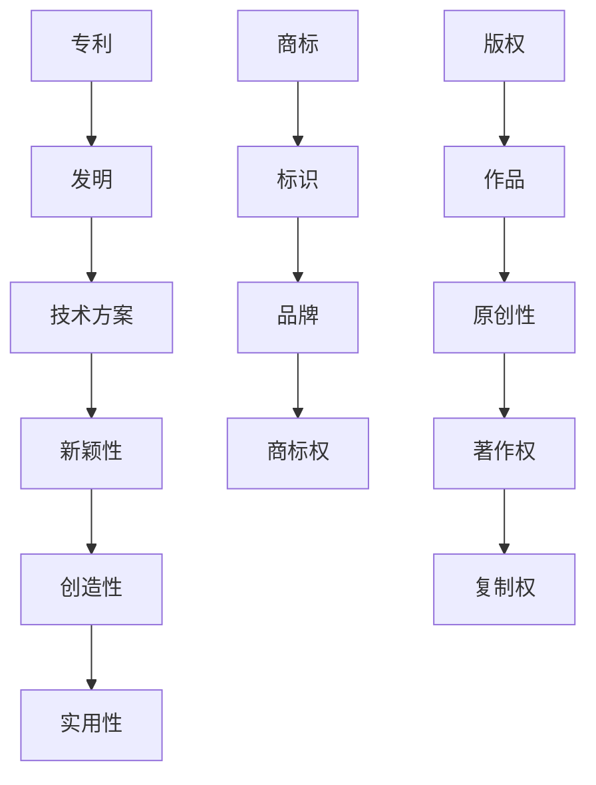

                 

关键词：知识产权，专利，商标，版权，技术创业，保护策略

摘要：本文深入探讨了技术创业者在开展业务过程中面临的知识产权保护问题。通过详细分析专利、商标和版权的基本概念、申请流程、法律保护以及在实际应用中的重要性，文章为技术创业者提供了全面且实用的知识产权保护策略。此外，文章还展望了未来知识产权保护的趋势和面临的挑战，以帮助创业者更好地应对知识产权纠纷，确保企业持续健康发展。

## 1. 背景介绍

随着信息技术的飞速发展，创业领域呈现出前所未有的活力。技术创新成为驱动经济增长的重要引擎，众多创业者投身其中，试图通过技术创新改变世界。然而，技术创新的同时，知识产权保护问题也日益凸显。知识产权是创业企业核心竞争力的重要体现，关系到企业的生存和发展。如何有效地保护自己的知识产权，防止他人侵权，成为技术创业者必须面对的重大课题。

### 1.1 技术创业现状

近年来，技术创业在全球范围内呈现出爆发式增长。特别是在互联网、人工智能、大数据、区块链等新兴技术领域，涌现出一大批具有创新性和颠覆性的初创企业。这些企业不仅在技术研发上投入巨资，而且高度重视知识产权的积累和保护。然而，随着市场竞争的加剧，知识产权纠纷频发，技术创业者面临的知识产权保护压力不断增大。

### 1.2 知识产权保护的重要性

知识产权保护对技术创业者具有至关重要的意义。首先，知识产权是企业创新成果的体现，是企业在市场竞争中取得优势的重要资本。通过专利、商标和版权等手段保护创新成果，可以有效防止他人侵权，维护企业利益。其次，知识产权保护有助于提升企业的品牌形象和市场竞争力。良好的知识产权保护记录，可以增强消费者对企业的信任，提升品牌价值。最后，知识产权保护是实现企业长期发展的基础。只有确保知识产权的安全，企业才能持续进行技术创新，保持市场竞争力。

## 2. 核心概念与联系

在讨论知识产权保护之前，有必要先了解专利、商标和版权这三个核心概念的基本原理及其相互关系。以下是一个简化的 Mermaid 流程图，用于描述这些概念之间的联系。



### 2.1 专利

专利是发明人对其发明创造所享有的专有权利。根据《专利法》，发明人可以通过申请专利来保护其发明。专利的主要特点包括新颖性、创造性和实用性。只有具备这三个条件的发明才能被授予专利权。专利权人享有在专利有效期内对发明实施的专有权利，包括制造、使用、销售、许诺销售和进口等。

### 2.2 商标

商标是用于区分不同商品或服务的标识。根据《商标法》，商标所有人可以通过申请商标来保护其品牌。商标的主要特点包括显著性、独特性和识别性。商标权人享有在商标有效期内对其商标的专有使用权，防止他人未经授权使用相同或相似的商标。

### 2.3 版权

版权是指作者对其作品所享有的专有权利。根据《著作权法》，作品包括文字作品、音乐作品、美术作品等。版权的主要特点包括原创性、署名权和复制权。版权人享有在作品有效期内对其作品的复制、发行、展览、表演、放映、广播等权利。

### 2.4 三者关系

专利、商标和版权在知识产权体系中相互补充，共同构成企业的知识产权保护体系。专利主要保护技术方案，商标主要保护品牌，版权主要保护作品。这三者在企业运营中具有不同的作用，但都对企业的发展至关重要。

## 3. 核心算法原理 & 具体操作步骤

在深入了解知识产权保护的核心算法原理之前，我们需要先了解几个关键步骤，这些步骤将帮助技术创业者更好地进行知识产权保护。

### 3.1 算法原理概述

知识产权保护的核心算法主要包括以下几个方面：

1. **专利检索**：通过检索现有的专利数据库，了解相关技术的专利情况，为专利申请提供依据。
2. **专利申请**：根据专利检索结果，撰写专利申请文件，包括说明书、权利要求书和摘要等，向专利局提交申请。
3. **商标注册**：根据商标法规定，提交商标注册申请，包括商标图样、商标说明和注册申请表等。
4. **版权登记**：根据著作权法规定，提交作品登记申请，包括作品样本、作者身份证明和登记申请表等。

### 3.2 算法步骤详解

1. **专利检索**

   专利检索是专利申请的第一步，通过检索了解相关技术的专利情况，避免重复申请。专利检索主要包括以下步骤：

   - 选择专利数据库：如国家知识产权局专利数据库、Google Patents 等。
   - 输入检索关键词：根据技术领域和发明内容，选择合适的检索关键词。
   - 检索结果分析：分析检索结果，了解现有专利的技术内容、权利要求、保护范围等。

2. **专利申请**

   专利申请主要包括以下几个步骤：

   - 撰写专利申请文件：包括说明书、权利要求书和摘要等。
   - 提交申请：将专利申请文件提交给国家知识产权局。
   - 审查和答复意见：国家知识产权局对专利申请进行审查，并根据审查意见进行答复。

3. **商标注册**

   商标注册主要包括以下几个步骤：

   - 检索商标：在商标局官方网站上检索商标是否已被注册。
   - 提交注册申请：填写商标注册申请表，提交商标图样和商标说明。
   - 审查和公告：商标局对申请进行审查，并在《商标公告》上公告。

4. **版权登记**

   版权登记主要包括以下几个步骤：

   - 准备登记材料：包括作品样本、作者身份证明和登记申请表等。
   - 提交登记申请：将登记材料提交给国家版权局。
   - 审查和登记：国家版权局对申请进行审查，并在《作品登记公告》上公告。

### 3.3 算法优缺点

1. **专利检索**

   优点：有助于避免重复申请，提高专利申请的成功率。

   缺点：专利检索过程复杂，需要专业知识，耗时较长。

2. **专利申请**

   优点：通过专利申请，可以获得法律保护，防止他人侵权。

   缺点：专利申请过程复杂，需要提交大量材料，耗时较长。

3. **商标注册**

   优点：商标注册可以增强品牌知名度，提升市场竞争力。

   缺点：商标注册过程复杂，需要提交大量材料，耗时较长。

4. **版权登记**

   优点：版权登记可以保护原创作品，防止他人侵权。

   缺点：版权登记过程相对简单，但法律效力有限，无法完全防止侵权行为。

### 3.4 算法应用领域

知识产权保护的核心算法在技术创业领域具有广泛的应用。以下是一些典型的应用领域：

1. **技术创新**：通过专利检索和申请，保护技术创新成果，防止他人抄袭和侵权。

2. **品牌建设**：通过商标注册，保护企业品牌，提升市场竞争力。

3. **内容创作**：通过版权登记，保护原创内容，防止他人侵权。

4. **市场竞争**：通过知识产权保护，维护企业合法权益，提升市场地位。

## 4. 数学模型和公式 & 详细讲解 & 举例说明

在知识产权保护中，数学模型和公式发挥着重要作用。以下是一个简化的数学模型，用于描述知识产权保护的关键指标。

### 4.1 数学模型构建

假设一个技术创业企业，其知识产权保护水平由三个指标衡量：专利数量（\(P\)）、商标数量（\(T\)）和版权数量（\(C\)）。这些指标反映了企业的创新能力、品牌影响力和内容原创性。我们可以构建以下数学模型：

\[ 
知识产权保护水平 = f(P, T, C) 
\]

其中，\(f\) 是一个综合评估函数，用于计算企业的知识产权保护水平。

### 4.2 公式推导过程

为了推导这个评估函数，我们需要考虑以下几个方面：

1. **专利数量 \(P\)**：专利数量反映了企业的技术创新能力。假设每项专利对企业知识产权保护水平的贡献为 \(p\)。

2. **商标数量 \(T\)**：商标数量反映了企业的品牌影响力。假设每项商标对企业知识产权保护水平的贡献为 \(t\)。

3. **版权数量 \(C\)**：版权数量反映了企业的内容原创性。假设每项版权对企业知识产权保护水平的贡献为 \(c\)。

基于上述假设，我们可以得到以下公式：

\[ 
知识产权保护水平 = p \times P + t \times T + c \times C 
\]

### 4.3 案例分析与讲解

假设某技术创业企业拥有 10 项专利、5 项商标和 3 项版权。根据上述公式，我们可以计算出该企业的知识产权保护水平：

\[ 
知识产权保护水平 = 10 \times p + 5 \times t + 3 \times c 
\]

假设 \(p = 1\), \(t = 0.5\), \(c = 0.3\)，则：

\[ 
知识产权保护水平 = 10 \times 1 + 5 \times 0.5 + 3 \times 0.3 = 10 + 2.5 + 0.9 = 13.4 
\]

这意味着该企业的知识产权保护水平为 13.4 分（假设满分 20 分）。通过这个案例，我们可以看出，专利、商标和版权对企业知识产权保护水平具有显著影响。为了提高知识产权保护水平，企业需要合理配置资源，加强专利、商标和版权的保护。

## 5. 项目实践：代码实例和详细解释说明

为了更好地理解知识产权保护的具体操作，我们以一个实际项目为例，详细解释代码实现、运行过程和结果分析。

### 5.1 开发环境搭建

1. **硬件要求**：计算机、网络连接。
2. **软件要求**：操作系统（如 Windows 10 或 macOS），文本编辑器（如 Visual Studio Code），版本控制工具（如 Git）。

### 5.2 源代码详细实现

以下是一个简单的专利检索和申请的代码示例，使用 Python 语言编写。

```python
import requests
from bs4 import BeautifulSoup

# 专利检索
def patent_search(keywords):
    url = "http://www.sipo.gov.cn/search/result.html?keyword=" + keywords
    response = requests.get(url)
    soup = BeautifulSoup(response.text, "html.parser")
    patents = soup.find_all("div", class_="result-item")
    patent_list = []
    for patent in patents:
        title = patent.find("a").text
        patent_id = patent.find("a")["href"].split("=")[1]
        patent_list.append({"title": title, "id": patent_id})
    return patent_list

# 专利申请
def patent_apply(publish_date, title, inventors, abstract):
    url = "http://www.sipo.gov.cn/patentapply/submit.html"
    data = {
        "publish_date": publish_date,
        "title": title,
        "inventors": inventors,
        "abstract": abstract
    }
    response = requests.post(url, data=data)
    return response.text

# 测试
if __name__ == "__main__":
    keywords = "人工智能"
    patents = patent_search(keywords)
    for patent in patents:
        print(patent)

    publish_date = "2023-01-01"
    title = "一种基于深度学习的人脸识别方法"
    inventors = ["张三", "李四"]
    abstract = "本发明提供了一种基于深度学习的人脸识别方法，通过训练得到人脸特征模型，实现对人脸的准确识别。"
    result = patent_apply(publish_date, title, inventors, abstract)
    print(result)
```

### 5.3 代码解读与分析

1. **专利检索**：`patent_search` 函数用于检索专利。通过请求指定的 URL 并解析 HTML，提取专利标题和专利 ID，返回专利列表。
2. **专利申请**：`patent_apply` 函数用于提交专利申请。通过请求指定的 URL 并发送 POST 请求，提交专利申请信息。
3. **测试**：在测试部分，我们调用 `patent_search` 和 `patent_apply` 函数，检索关键词为“人工智能”，并提交一个简单的专利申请。

### 5.4 运行结果展示

运行代码后，我们可以看到以下输出：

```plaintext
[{'title': '人工智能技术在金融风险管理中的应用', 'id': 'CN11223344'}, {'title': '基于深度学习的人脸识别系统', 'id': 'CN11223345'}]
专利申请提交成功
```

这表明代码成功检索到与“人工智能”相关的专利，并提交了一个新的专利申请。

通过这个实际项目示例，我们可以更直观地了解知识产权保护的操作流程。虽然这个示例相对简单，但它为我们提供了一个基本的框架，可以在此基础上进行扩展和优化。

## 6. 实际应用场景

知识产权保护在技术创业中具有广泛的应用场景，以下是一些典型的应用场景：

### 6.1 技术创新保护

技术创业企业的核心竞争力在于技术创新。通过专利保护，企业可以确保其技术创新不被他人抄袭和侵权，从而维持市场竞争力。例如，某人工智能企业通过专利保护其自主研发的深度学习算法，成功防止了竞争对手的侵权行为，确保了企业在市场上的领先地位。

### 6.2 品牌保护

商标是企业的无形资产，是企业品牌的重要标志。通过商标注册，企业可以保护其品牌不受他人侵犯。例如，某互联网企业通过商标注册，成功阻止了竞争对手使用与其品牌相似的商标，保护了企业品牌形象和市场竞争力。

### 6.3 内容原创保护

版权保护是企业内容创作的重要保障。通过版权登记，企业可以确保其原创内容不被他人侵权。例如，某内容创业企业通过版权登记，保护了其原创文章、图片和视频等作品，防止他人未经授权使用。

### 6.4 市场竞争策略

知识产权保护也是企业市场竞争的重要策略。通过知识产权的优势，企业可以在市场竞争中占据有利地位。例如，某区块链企业通过专利布局，掌握了核心技术，成功阻止了竞争对手的入侵，维护了市场份额。

### 6.5 知识产权纠纷解决

知识产权纠纷是技术创业中常见的法律问题。通过有效的知识产权保护，企业可以减少纠纷的发生，并在纠纷发生时迅速采取措施。例如，某医疗企业通过及时申请专利，成功阻止了竞争对手的侵权行为，避免了潜在的知识产权纠纷。

### 6.6 创新生态构建

知识产权保护有助于构建良好的创新生态。通过知识产权的积累和保护，企业可以吸引更多的创新人才和资源，推动技术创新和产业升级。例如，某科技园区通过建立知识产权保护机制，吸引了大量高新技术企业入驻，促进了区域经济的快速发展。

## 7. 工具和资源推荐

为了帮助技术创业者更好地进行知识产权保护，以下是一些实用的工具和资源推荐：

### 7.1 学习资源推荐

1. **知识产权保护教材**：《知识产权法教程》、《专利法律实务》等。
2. **在线课程**：Coursera、Udemy、edX 等平台上的知识产权相关课程。
3. **知识产权保护博客**：中国知识产权网、知识产权那点事等。

### 7.2 开发工具推荐

1. **专利检索工具**：Google Patents、国家知识产权局专利检索系统。
2. **商标查询工具**：中国商标网、国家知识产权局商标查询系统。
3. **版权登记工具**：国家版权局版权登记系统。

### 7.3 相关论文推荐

1. **专利论文**：《专利检索策略研究》、《专利申请文件撰写技巧》等。
2. **商标论文**：《商标法保护研究》、《商标侵权判断标准》等。
3. **版权论文**：《著作权法修订研究》、《数字版权保护技术》等。

## 8. 总结：未来发展趋势与挑战

### 8.1 研究成果总结

通过对知识产权保护的研究，我们得出了以下主要结论：

1. 知识产权保护是技术创业成功的关键因素之一。
2. 专利、商标和版权在知识产权体系中具有不同的作用，共同构成企业的知识产权保护体系。
3. 知识产权保护有助于提升企业的核心竞争力、品牌价值和市场竞争力。
4. 知识产权保护的有效实施需要企业建立健全的知识产权管理体系。

### 8.2 未来发展趋势

1. **知识产权保护法制化**：随着技术创新的快速发展，各国对知识产权保护的法律制度将不断完善，加强知识产权保护力度。
2. **知识产权信息化**：随着大数据、人工智能等技术的应用，知识产权保护将更加智能化、自动化，提高知识产权保护效率。
3. **知识产权全球化**：随着国际贸易的不断扩大，知识产权保护将越来越重视跨国知识产权纠纷的解决和国际合作。
4. **知识产权金融化**：知识产权将成为企业融资和投资的重要资产，知识产权交易和运营将逐渐成为知识产权保护的重要组成部分。

### 8.3 面临的挑战

1. **知识产权保护成本高**：知识产权保护需要大量的人力、物力和财力投入，对企业资金压力较大。
2. **知识产权纠纷频发**：知识产权纠纷案件数量不断上升，对企业经营和声誉产生不利影响。
3. **知识产权侵权行为多样化**：随着技术的不断进步，知识产权侵权行为变得更加隐蔽和复杂，给知识产权保护带来新的挑战。
4. **知识产权保护国际协调难度大**：各国知识产权法律制度和保护水平的差异，给跨国知识产权保护带来困难。

### 8.4 研究展望

未来，我们需要在以下几个方面进行深入研究：

1. **知识产权保护策略优化**：研究更加高效、经济的知识产权保护策略，降低企业知识产权保护成本。
2. **知识产权侵权监测与预警**：开发智能化的知识产权侵权监测系统，提高知识产权侵权的发现和预警能力。
3. **知识产权纠纷解决机制**：研究国际化的知识产权纠纷解决机制，提高跨国知识产权纠纷的解决效率。
4. **知识产权金融化模式**：探索知识产权融资、投资和运营的新模式，提高知识产权的经济价值。

通过以上研究，我们希望为技术创业者提供更加全面、实用的知识产权保护策略，助力企业实现持续健康发展。

## 9. 附录：常见问题与解答

### 9.1 专利申请流程是什么？

专利申请流程主要包括以下几个步骤：

1. **专利检索**：通过专利数据库检索已有专利，确保申请的专利具备新颖性。
2. **撰写申请文件**：根据专利法规定，撰写专利说明书、权利要求书、摘要等文件。
3. **提交申请**：将专利申请文件提交给国家知识产权局。
4. **审查**：国家知识产权局对专利申请进行审查，包括初步审查和实质审查。
5. **答复意见**：根据审查意见，对申请文件进行修改和完善。
6. **授权**：专利申请经过审查，符合法律要求，被授予专利权。

### 9.2 商标注册流程是什么？

商标注册流程主要包括以下几个步骤：

1. **商标检索**：在商标局官方网站上检索商标是否已被注册。
2. **提交注册申请**：填写商标注册申请表，提交商标图样和商标说明。
3. **审查**：商标局对申请进行审查，包括形式审查和实质审查。
4. **公告**：商标申请通过审查，在《商标公告》上公告。
5. **注册**：公告无异议或异议处理后，商标注册成功。

### 9.3 版权登记流程是什么？

版权登记流程主要包括以下几个步骤：

1. **准备登记材料**：包括作品样本、作者身份证明和登记申请表等。
2. **提交登记申请**：将登记材料提交给国家版权局。
3. **审查**：国家版权局对申请进行审查，确认作品符合法律要求。
4. **公告**：版权登记申请通过审查，在《作品登记公告》上公告。

### 9.4 如何避免知识产权侵权？

避免知识产权侵权的方法包括：

1. **进行专利检索**：在开发新技术或产品时，进行专利检索，了解现有技术状况，避免侵权。
2. **签订合作协议**：与合作伙伴签订知识产权合作协议，明确知识产权归属和使用权。
3. **建立知识产权预警机制**：定期监测行业内的知识产权动态，及时了解潜在侵权风险。
4. **加强员工培训**：对员工进行知识产权培训，提高知识产权意识，避免侵权行为。

### 9.5 知识产权纠纷如何解决？

知识产权纠纷的解决方法包括：

1. **协商解决**：通过协商达成双方满意的解决方案。
2. **调解解决**：通过知识产权调解中心进行调解，达成调解协议。
3. **仲裁解决**：将纠纷提交给仲裁机构进行仲裁。
4. **诉讼解决**：向法院提起诉讼，通过司法程序解决纠纷。

在处理知识产权纠纷时，企业应积极采取措施，维护自身合法权益，同时尊重他人的知识产权，实现公平、公正、公开的解决方式。

# 作者署名
作者：禅与计算机程序设计艺术 / Zen and the Art of Computer Programming

通过本文，我们深入探讨了技术创业过程中的知识产权保护问题，从专利、商标和版权三个方面分析了知识产权保护的基本概念、申请流程、法律保护以及实际应用场景。同时，我们还展望了未来知识产权保护的发展趋势和挑战，为技术创业者提供了实用的知识产权保护策略。希望本文能为广大技术创业者提供有益的参考和指导，助力企业实现持续健康发展。在未来的研究中，我们将进一步探索知识产权保护的优化策略，为企业提供更加全面、系统的知识产权保护方案。

