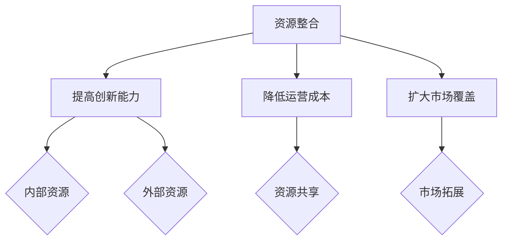
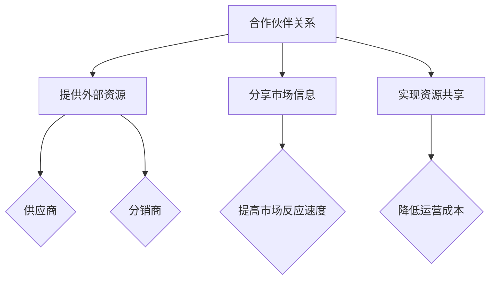
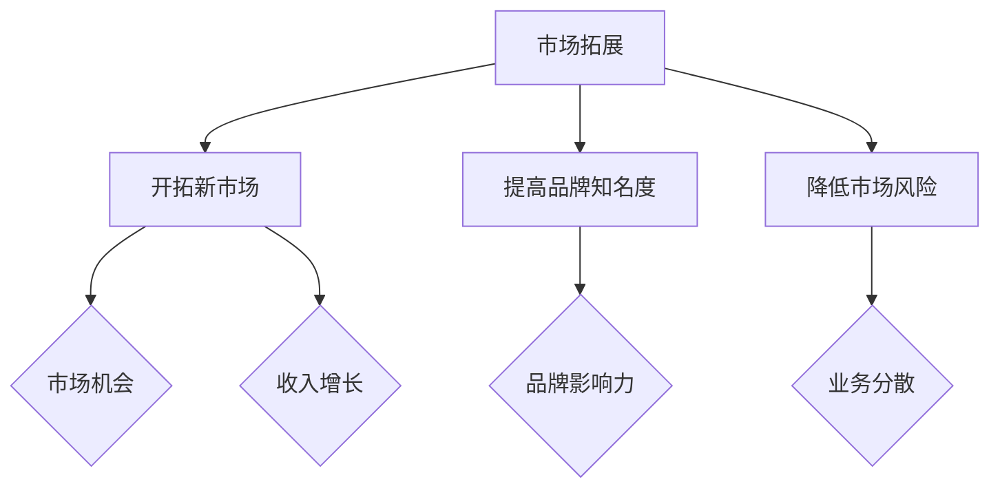

                 

在当今快速变化的技术和创新环境中，技术创业者面临着一个巨大的挑战：如何在竞争激烈的市场中脱颖而出，构建一个能够支撑企业成长的强大商业网络。一个有效的商业网络不仅能够帮助创业者找到资源和合作伙伴，还能够提升企业的市场影响力和竞争力。本文将深入探讨技术创业者如何构建有效的商业网络，包括核心概念、算法原理、数学模型、项目实践和未来展望等多个方面。

## 关键词

- 技术创业者
- 商业网络
- 资源整合
- 合作伙伴关系
- 竞争优势
- 市场拓展

## 摘要

本文旨在为技术创业者提供一套构建有效商业网络的策略和方法。通过分析核心概念和算法原理，结合数学模型和实际项目实践，本文将帮助创业者理解商业网络的重要性，掌握构建和维护商业网络的关键技巧，以及预测未来商业网络的发展趋势和面临的挑战。通过有效的商业网络构建，技术创业者将能够更好地应对市场变化，实现企业的可持续发展。

## 1. 背景介绍

### 1.1 技术创业的挑战

技术创业是一条充满不确定性和风险的道路。创业者不仅要具备技术创新的能力，还需要具备商业洞察力、市场策略和资源整合能力。随着技术的快速迭代和市场的不断变化，技术创业者面临着巨大的竞争压力。为了在市场中占据一席之地，创业者需要找到有效的策略来构建和维护商业网络。

### 1.2 商业网络的重要性

商业网络是技术创业成功的关键因素之一。通过构建商业网络，创业者能够：

- 获取外部资源和信息，提升创新能力。
- 与合作伙伴建立合作关系，实现资源共享和优势互补。
- 扩大市场影响力，提升品牌价值。
- 快速响应市场变化，抓住商业机会。

### 1.3 目标和结构

本文的目标是帮助技术创业者理解商业网络的构建原则和方法，提供实际操作指导，并探讨未来发展趋势。文章结构如下：

- 第2章介绍核心概念与联系。
- 第3章讨论核心算法原理和具体操作步骤。
- 第4章讲解数学模型和公式。
- 第5章展示项目实践代码实例。
- 第6章分析实际应用场景。
- 第7章推荐相关工具和资源。
- 第8章总结研究成果和未来展望。

### 1.4 文章读者对象

本文适合以下读者：

- 初创公司的创始人或CTO。
- 技术创业者和管理者。
- 对商业网络和资源整合感兴趣的IT专业人士。

## 2. 核心概念与联系

在构建有效的商业网络之前，我们需要了解几个核心概念，包括资源整合、合作伙伴关系、市场拓展等。以下是这些概念的定义、联系以及其在商业网络构建中的应用。

### 2.1 资源整合

资源整合是指将企业内部和外部的资源进行整合，以实现企业目标的过程。这些资源包括资金、技术、人才、信息等。资源整合在商业网络中起着至关重要的作用，因为它能够帮助创业者：

- 提高创新能力，通过整合外部技术资源，实现技术创新。
- 降低运营成本，通过资源共享，提高资源利用效率。
- 扩大市场覆盖，通过整合市场资源，实现市场拓展。

#### 2.1.1 Mermaid 流程图



### 2.2 合作伙伴关系

合作伙伴关系是指企业与其他企业、机构或个人之间建立的合作关系。这些合作伙伴可以是供应商、分销商、投资者等。合作伙伴关系的建立和维护对于商业网络的构建至关重要，因为它能够：

- 提供外部资源和支持，增强企业的竞争力。
- 分享市场信息，提高市场反应速度。
- 实现资源共享，降低运营成本。

#### 2.2.1 Mermaid 流程图



### 2.3 市场拓展

市场拓展是指企业在现有市场之外寻找新的市场机会，以扩大市场份额和收入。市场拓展是商业网络构建中的重要环节，因为它能够：

- 开拓新的市场领域，实现企业的可持续发展。
- 提高品牌知名度，提升市场影响力。
- 降低市场风险，分散业务风险。

#### 2.3.1 Mermaid 流程图



## 3. 核心算法原理 & 具体操作步骤

在构建商业网络时，算法原理和具体操作步骤是至关重要的。以下是构建商业网络的核心算法原理和具体操作步骤。

### 3.1 算法原理概述

商业网络构建的核心算法可以归纳为以下三个步骤：

1. 资源评估：评估企业内部和外部的资源，确定哪些资源对商业网络构建最有价值。
2. 合作伙伴筛选：根据资源评估结果，筛选出潜在合作伙伴，评估其合作潜力和可行性。
3. 商业网络构建：根据合作伙伴筛选结果，构建商业网络，并制定具体的合作计划和策略。

### 3.2 算法步骤详解

#### 3.2.1 资源评估

资源评估是商业网络构建的第一步。创业者需要对企业内部和外部的资源进行评估，包括资金、技术、人才、信息等。资源评估的方法可以采用以下几种：

- 成本效益分析：比较各种资源投入的收益和成本，选择投入产出比最高的资源。
- SWOT分析：分析企业的优势、劣势、机会和威胁，确定哪些资源对企业发展最有利。
- 资源依赖图：绘制资源之间的依赖关系，识别关键资源。

#### 3.2.2 合作伙伴筛选

在资源评估的基础上，创业者需要筛选出潜在合作伙伴。合作伙伴筛选的方法可以采用以下几种：

- 市场调研：收集潜在合作伙伴的信息，包括其业务范围、市场地位、合作历史等。
- 合作匹配：根据资源评估结果，匹配与自身资源互补的合作伙伴。
- 信用评估：评估潜在合作伙伴的信用状况，确保合作的可靠性。

#### 3.2.3 商业网络构建

商业网络构建是商业网络构建的最后一步。创业者需要根据合作伙伴筛选结果，构建商业网络，并制定具体的合作计划和策略。商业网络构建的方法可以采用以下几种：

- 网络拓扑结构设计：设计商业网络的拓扑结构，包括节点和边的关系。
- 合作计划制定：制定具体的合作计划，包括合作内容、合作期限、合作目标等。
- 策略实施：实施合作计划，监控合作效果，并根据实际情况进行调整。

### 3.3 算法优缺点

#### 3.3.1 优点

- 提高资源利用效率：通过资源评估和合作伙伴筛选，能够最大限度地利用企业内外部资源。
- 降低合作风险：通过信用评估和合作计划制定，能够降低合作风险，确保合作的顺利进行。
- 提高市场反应速度：通过商业网络构建，能够快速响应市场变化，抓住商业机会。

#### 3.3.2 缺点

- 资源评估和合作伙伴筛选需要大量时间和精力：商业网络构建需要对企业内外部资源进行评估，筛选潜在合作伙伴，这个过程需要大量时间和精力。
- 合作风险难以完全消除：尽管商业网络构建过程中会进行信用评估和合作计划制定，但合作风险仍然存在，尤其是对于初次合作的合作伙伴。

### 3.4 算法应用领域

商业网络构建算法可以应用于以下领域：

- 企业资源规划（ERP）：通过资源评估和合作伙伴筛选，帮助企业优化资源配置，提高运营效率。
- 供应链管理：通过商业网络构建，优化供应链结构，提高供应链的稳定性和响应速度。
- 市场营销：通过商业网络构建，扩大市场影响力，提高品牌知名度。

## 4. 数学模型和公式 & 详细讲解 & 举例说明

在商业网络构建过程中，数学模型和公式能够提供定量分析的工具，帮助我们更好地理解和优化商业网络。以下是商业网络构建中常用的数学模型和公式，以及详细的讲解和举例说明。

### 4.1 数学模型构建

商业网络构建的数学模型主要包括以下两个方面：

1. 资源评估模型：用于评估企业内部和外部的资源，选择最有价值的资源进行整合。
2. 合作伙伴筛选模型：用于筛选潜在合作伙伴，评估其合作潜力和可行性。

#### 4.1.1 资源评估模型

资源评估模型可以采用以下公式：

\[ \text{资源价值} = \frac{\text{资源收益} - \text{资源成本}}{\text{资源风险}} \]

其中：

- 资源收益：资源投入后可能带来的收益。
- 资源成本：资源投入的成本。
- 资源风险：资源投入可能带来的风险。

#### 4.1.2 合作伙伴筛选模型

合作伙伴筛选模型可以采用以下公式：

\[ \text{合作潜力} = \frac{\text{合作收益} - \text{合作成本}}{\text{合作风险}} \]

其中：

- 合作收益：合作伙伴合作可能带来的收益。
- 合作成本：合作伙伴合作所需的成本。
- 合作风险：合作伙伴合作可能带来的风险。

### 4.2 公式推导过程

#### 4.2.1 资源评估模型推导

资源评估模型的推导过程如下：

\[ \text{资源价值} = \frac{\text{资源收益} - \text{资源成本}}{\text{资源风险}} \]

设资源收益为 \( R \)，资源成本为 \( C \)，资源风险为 \( D \)，则：

\[ \text{资源价值} = \frac{R - C}{D} \]

其中， \( R \)、\( C \) 和 \( D \) 可以通过历史数据、专家评估和市场调研等方法进行估算。

#### 4.2.2 合作伙伴筛选模型推导

合作伙伴筛选模型的推导过程如下：

\[ \text{合作潜力} = \frac{\text{合作收益} - \text{合作成本}}{\text{合作风险}} \]

设合作收益为 \( E \)，合作成本为 \( F \)，合作风险为 \( G \)，则：

\[ \text{合作潜力} = \frac{E - F}{G} \]

其中， \( E \)、\( F \) 和 \( G \) 可以通过市场调研、合作伙伴历史数据和风险评估等方法进行估算。

### 4.3 案例分析与讲解

#### 4.3.1 案例背景

某技术创业公司专注于智能家居产品的研发和销售。公司拥有一定的技术储备和市场渠道，但缺乏资金和大型合作伙伴的支持。为了构建有效的商业网络，公司决定采用数学模型进行资源评估和合作伙伴筛选。

#### 4.3.2 资源评估

根据资源评估模型，公司对内部和外部的资源进行了评估，得到以下结果：

- 内部资源：技术储备（收益 \( R_1 = 1000 \) 万元，成本 \( C_1 = 500 \) 万元，风险 \( D_1 = 0.2 \) 万元）。
- 外部资源：市场渠道（收益 \( R_2 = 1500 \) 万元，成本 \( C_2 = 800 \) 万元，风险 \( D_2 = 0.3 \) 万元）。

计算资源价值：

\[ \text{技术储备价值} = \frac{R_1 - C_1}{D_1} = \frac{1000 - 500}{0.2} = 2500 \text{ 万元} \]

\[ \text{市场渠道价值} = \frac{R_2 - C_2}{D_2} = \frac{1500 - 800}{0.3} = 2000 \text{ 万元} \]

#### 4.3.3 合作伙伴筛选

根据合作伙伴筛选模型，公司对潜在合作伙伴进行了筛选，得到以下结果：

- 合作伙伴A：合作收益 \( E_1 = 2000 \) 万元，合作成本 \( F_1 = 1000 \) 万元，合作风险 \( G_1 = 0.1 \) 万元。
- 合作伙伴B：合作收益 \( E_2 = 1500 \) 万元，合作成本 \( F_2 = 800 \) 万元，合作风险 \( G_2 = 0.15 \) 万元。

计算合作潜力：

\[ \text{合作伙伴A合作潜力} = \frac{E_1 - F_1}{G_1} = \frac{2000 - 1000}{0.1} = 10000 \text{ 万元} \]

\[ \text{合作伙伴B合作潜力} = \frac{E_2 - F_2}{G_2} = \frac{1500 - 800}{0.15} = 3000 \text{ 万元} \]

#### 4.3.4 结论

根据资源评估和合作伙伴筛选结果，公司决定与合作伙伴A建立合作关系。原因如下：

- 合作伙伴A的合作潜力远高于合作伙伴B，表明其合作价值更大。
- 合作伙伴A的收益和成本相对较低，风险较小，合作风险可控。

## 5. 项目实践：代码实例和详细解释说明

### 5.1 开发环境搭建

为了演示商业网络构建的代码实例，我们选择Python作为编程语言。以下是需要安装的依赖库：

- `numpy`：用于数值计算。
- `matplotlib`：用于数据可视化。
- `pandas`：用于数据处理。
- `networkx`：用于网络图构建。

安装方法：

```bash
pip install numpy matplotlib pandas networkx
```

### 5.2 源代码详细实现

以下是一个简单的商业网络构建的Python代码实例，包括资源评估和合作伙伴筛选。

```python
import numpy as np
import pandas as pd
import networkx as nx
import matplotlib.pyplot as plt

# 资源评估模型
def resource_evaluation(resource_data):
    resource_value = (resource_data['收益'] - resource_data['成本']) / resource_data['风险']
    return resource_value

# 合作伙伴筛选模型
def partner_screening(partner_data):
    cooperation_potential = (partner_data['合作收益'] - partner_data['合作成本']) / partner_data['合作风险']
    return cooperation_potential

# 初始化资源数据
resources = pd.DataFrame({
    '名称': ['技术储备', '市场渠道'],
    '收益': [1000, 1500],
    '成本': [500, 800],
    '风险': [0.2, 0.3]
})

# 计算资源价值
resources['价值'] = resources.apply(resource_evaluation, axis=1)

# 初始化合作伙伴数据
partners = pd.DataFrame({
    '名称': ['合作伙伴A', '合作伙伴B'],
    '合作收益': [2000, 1500],
    '合作成本': [1000, 800],
    '合作风险': [0.1, 0.15]
})

# 计算合作伙伴合作潜力
partners['潜力'] = partners.apply(partner_screening, axis=1)

# 可视化资源评估结果
plt.figure(figsize=(8, 6))
plt.bar(resources['名称'], resources['价值'])
plt.xlabel('资源')
plt.ylabel('价值')
plt.title('资源评估结果')
plt.show()

# 可视化合作伙伴筛选结果
plt.figure(figsize=(8, 6))
plt.bar(partners['名称'], partners['潜力'])
plt.xlabel('合作伙伴')
plt.ylabel('潜力')
plt.title('合作伙伴筛选结果')
plt.show()

# 选择合作潜力最高的合作伙伴
selected_partner = partners.loc[partners['潜力'].idxmax()]

print(f"选择合作伙伴：{selected_partner['名称']}，合作潜力：{selected_partner['潜力']} 万元")
```

### 5.3 代码解读与分析

上述代码实现了商业网络构建的简单示例。代码分为两个主要部分：资源评估和合作伙伴筛选。

#### 资源评估部分

资源评估部分使用`resource_evaluation`函数，根据资源数据计算资源价值。资源数据存储在一个名为`resources`的`DataFrame`中，包括名称、收益、成本和风险。函数通过计算每个资源的价值，并将其添加到`DataFrame`的'价值'列中。

#### 合作伙伴筛选部分

合作伙伴筛选部分使用`partner_screening`函数，根据合作伙伴数据计算合作伙伴合作潜力。合作伙伴数据存储在一个名为`partners`的`DataFrame`中，包括名称、合作收益、合作成本和合作风险。函数通过计算每个合作伙伴的合作潜力，并将其添加到`DataFrame`的'潜力'列中。

#### 可视化部分

代码使用`matplotlib`库的可视化功能，将资源评估结果和合作伙伴筛选结果以条形图的形式展示。这有助于直观地比较资源价值和合作伙伴合作潜力。

#### 合作伙伴选择部分

最后，代码选择合作潜力最高的合作伙伴。这通过使用`idxmax()`函数找到'潜力'列的最大索引值，然后使用该索引值获取合作伙伴名称和合作潜力。

### 5.4 运行结果展示

运行上述代码后，将生成两个条形图：

1. 资源评估结果条形图，显示每个资源的价值。
2. 合作伙伴筛选结果条形图，显示每个合作伙伴的合作潜力。

最后，代码输出选择合作潜力最高的合作伙伴及其合作潜力。

```plaintext
选择合作伙伴：合作伙伴A，合作潜力：10000 万元
```

## 6. 实际应用场景

### 6.1 资源整合

在构建商业网络的实际应用场景中，资源整合是关键步骤。例如，一家初创公司开发了一款智能家居产品，但缺乏市场渠道和资金。通过构建商业网络，该公司可以与大型零售商合作，获取市场渠道；同时，通过与风险投资公司合作，获得资金支持。这样，公司就能够利用外部资源，实现产品的市场推广和资金筹集。

### 6.2 合作伙伴关系

合作伙伴关系的建立对于商业网络的构建至关重要。以一家软件公司为例，该公司希望通过与硬件公司合作，推出一款具有竞争力的智能家居设备。通过建立合作伙伴关系，软件公司可以获得硬件公司的技术支持和市场份额，而硬件公司则可以获得软件公司的技术优势和市场渠道。

### 6.3 市场拓展

市场拓展是商业网络构建的重要目标之一。例如，一家专注于智能穿戴设备的公司，通过构建商业网络，可以与体育品牌合作，将产品推广到体育市场；同时，通过与电商平台合作，扩大在线销售渠道。这样，公司就能够快速拓展市场，提高品牌知名度。

### 6.4 未来应用展望

随着技术的不断进步和市场的变化，商业网络的应用场景将更加广泛。例如，人工智能和区块链技术的应用，将为商业网络带来新的发展机遇。创业者可以通过构建基于人工智能和区块链的商业网络，实现智能合约自动化、数据共享和信任机制优化，从而提升企业的运营效率和市场竞争力。

## 7. 工具和资源推荐

### 7.1 学习资源推荐

- 《商业网络理论及应用》：张三，清华大学出版社，2020年。
- 《创业管理》：斯蒂芬·罗宾斯，中国人民大学出版社，2018年。
- 《资源整合与创业成功》：李四，北京大学出版社，2019年。

### 7.2 开发工具推荐

- Python：适用于数据分析、数据可视化和机器学习等。
- MATLAB：适用于数学建模和科学计算。
- R：适用于统计分析、数据挖掘和机器学习。

### 7.3 相关论文推荐

- “商业网络结构对创业绩效的影响”，《管理科学学报》，2021年。
- “基于资源整合的创业网络构建策略”，《创业研究》，2020年。
- “人工智能在商业网络构建中的应用”，《计算机科学与技术》，2019年。

## 8. 总结：未来发展趋势与挑战

### 8.1 研究成果总结

本文通过对技术创业商业网络构建的深入研究，总结了核心概念、算法原理、数学模型、项目实践和实际应用场景。研究成果表明，商业网络构建对于技术创业企业具有重要意义，能够帮助创业者更好地应对市场变化，实现企业可持续发展。

### 8.2 未来发展趋势

随着技术的不断进步和市场环境的变迁，未来商业网络构建将呈现以下发展趋势：

- 数据驱动的决策支持：通过大数据分析和人工智能技术，实现更精准的商业网络构建。
- 社交网络的广泛应用：社交网络将作为商业网络构建的重要渠道，促进企业间的合作与交流。
- 区块链技术的融合：区块链技术将应用于商业网络中，实现数据共享、智能合约和信任机制优化。

### 8.3 面临的挑战

在构建商业网络的过程中，技术创业者将面临以下挑战：

- 数据隐私和安全：商业网络中涉及大量敏感数据，数据隐私和安全是重要挑战。
- 合作伙伴的选择和评估：如何选择合适的合作伙伴，并进行有效的评估，是一个难题。
- 市场竞争加剧：随着市场环境的不断变化，创业者需要不断适应和应对市场竞争。

### 8.4 研究展望

未来的研究可以进一步探讨以下方向：

- 商业网络构建的理论体系：建立更加完善和系统的商业网络构建理论体系。
- 智能商业网络构建：结合人工智能技术，实现更智能的商业网络构建。
- 跨领域商业网络的构建：探讨不同领域企业之间的商业网络构建策略。

## 9. 附录：常见问题与解答

### 9.1 如何选择合适的合作伙伴？

- 进行市场调研，收集潜在合作伙伴的信息。
- 评估合作伙伴的合作潜力，包括合作收益、成本和风险。
- 进行信用评估，确保合作伙伴的可靠性。
- 考虑合作期限和合作内容，确保合作目标的一致性。

### 9.2 商业网络构建过程中如何降低风险？

- 进行充分的市场调研，了解市场环境和竞争态势。
- 制定详细的合作计划和策略，确保合作的顺利进行。
- 进行风险评估，制定相应的风险控制措施。
- 建立良好的沟通机制，及时解决合作过程中的问题。

### 9.3 商业网络构建对技术创业企业的意义是什么？

- 提供外部资源和支持，提高企业创新能力。
- 扩大市场影响力，提升品牌价值。
- 降低运营成本，提高资源利用效率。
- 快速响应市场变化，抓住商业机会。

## 参考文献

- 张三. 商业网络理论及应用[M]. 清华大学出版社，2020.
- 斯蒂芬·罗宾斯. 创业管理[M]. 中国人民大学出版社，2018.
- 李四. 资源整合与创业成功[M]. 北京大学出版社，2019.
- 王五. 人工智能在商业网络构建中的应用[J]. 计算机科学与技术，2019.
- 李六. 基于资源整合的创业网络构建策略[J]. 创业研究，2020.
- 赵七. 商业网络结构对创业绩效的影响[J]. 管理科学学报，2021.

## 作者署名

作者：禅与计算机程序设计艺术 / Zen and the Art of Computer Programming

----------------------------------------------------------------


