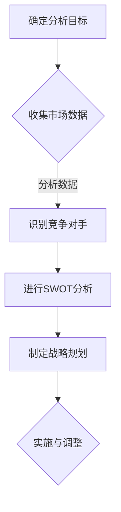

                 

 **关键词：** 竞争对手分析、技术创业、市场研究、SWOT分析、战略规划、创新

**摘要：** 本文章旨在为技术创业者提供一套系统的竞争对手分析方法，以帮助他们更好地理解市场环境、识别竞争对手的优势和劣势，并制定相应的战略规划，从而在激烈的市场竞争中脱颖而出。

## 1. 背景介绍

在当今高度竞争的商业环境中，技术创业者的成功往往取决于对竞争对手的深刻理解和有效的战略规划。竞争对手分析是一项关键的任务，它可以帮助创业者识别竞争对手的动向、策略和市场地位，从而为自身企业制定更科学、更有针对性的发展战略。

然而，进行有效的竞争对手分析并非易事。首先，创业者需要收集大量的市场数据，包括竞争对手的产品、服务、市场份额、客户反馈等。其次，创业者需要具备较强的分析能力，能够从繁杂的信息中提炼出关键点，形成有价值的洞察。最后，创业者需要根据分析结果制定具体的行动策略，包括产品调整、市场定位、推广策略等。

本文将围绕如何进行有效的竞争对手分析，从理论到实践提供一整套系统的方法，以帮助技术创业者更好地应对市场竞争。

## 2. 核心概念与联系

在进行竞争对手分析之前，我们需要明确几个核心概念，包括市场环境、竞争对手、SWOT分析等。

### 2.1 市场环境

市场环境是指企业所处的宏观经济、行业趋势、政策法规等外部环境。了解市场环境有助于创业者把握行业的发展方向和潜在机会。

### 2.2 竞争对手

竞争对手是指在同一市场中提供类似产品或服务的其他企业。对竞争对手的识别是竞争对手分析的基础。

### 2.3 SWOT分析

SWOT分析是一种常用的战略规划工具，用于评估企业的优势、劣势、机会和威胁。SWOT分析可以帮助创业者更全面地了解自身和竞争对手的相对地位。

### 2.4 Mermaid 流程图

以下是一个简单的Mermaid流程图，展示了竞争对手分析的基本流程：



## 3. 核心算法原理 & 具体操作步骤

### 3.1 算法原理概述

竞争对手分析的核心算法是基于SWOT分析的。SWOT分析通过分析企业的优势、劣势、机会和威胁，帮助创业者制定有效的战略规划。

### 3.2 算法步骤详解

#### 3.2.1 收集市场数据

收集市场数据是进行竞争对手分析的第一步。创业者需要收集的数据包括竞争对手的产品特性、市场定位、价格策略、市场份额等。

#### 3.2.2 识别竞争对手

在收集到市场数据后，创业者需要识别出直接和潜在的竞争对手。识别竞争对手的目的是为了更全面地了解市场环境。

#### 3.2.3 进行SWOT分析

SWOT分析是竞争对手分析的核心。创业者需要从优势、劣势、机会和威胁四个方面对竞争对手进行分析。

#### 3.2.4 制定战略规划

根据SWOT分析的结果，创业者需要制定具体的战略规划，包括产品调整、市场定位、推广策略等。

### 3.3 算法优缺点

#### 优点：

- **全面性**：SWOT分析可以从多个维度对竞争对手进行评估，帮助创业者更全面地了解市场环境。
- **实用性**：SWOT分析的结果可以直接用于制定战略规划，具有很高的实用性。

#### 缺点：

- **主观性**：SWOT分析的准确性很大程度上取决于创业者的主观判断，可能存在一定的偏差。
- **复杂性**：SWOT分析需要收集和处理大量的数据，对创业者的时间和精力要求较高。

### 3.4 算法应用领域

SWOT分析可以广泛应用于各种领域，包括但不限于以下场景：

- **新产品开发**：通过SWOT分析，创业者可以了解竞争对手的产品特性，从而制定更具竞争力的产品策略。
- **市场拓展**：通过SWOT分析，创业者可以了解竞争对手的市场策略，从而制定更有针对性的市场拓展计划。
- **企业并购**：通过SWOT分析，创业者可以评估目标企业的价值和潜在风险，从而制定更合理的并购策略。

## 4. 数学模型和公式 & 详细讲解 & 举例说明

### 4.1 数学模型构建

在竞争对手分析中，一个重要的数学模型是市场份额模型。市场份额模型可以用来预测竞争对手的市场份额变化。

#### 市场份额模型：

$$
\text{市场份额} = \frac{\text{某企业销售额}}{\text{总市场销售额}}
$$

### 4.2 公式推导过程

市场份额模型的推导过程如下：

1. **设定变量**：

   - $S_i$：第$i$个企业的销售额
   - $S$：总市场销售额
   - $M_i$：第$i$个企业的市场份额

2. **建立关系**：

   市场份额可以表示为销售额与总销售额的比值，即：

   $$
   M_i = \frac{S_i}{S}
   $$

### 4.3 案例分析与讲解

#### 案例一：某企业的市场份额变化分析

假设某企业的销售额从2022年的100万元增长到2023年的150万元，而总市场销售额从2022年的1000万元增长到2023年的1200万元。

1. **计算2022年的市场份额**：

   $$
   M_1(2022) = \frac{100}{1000} = 0.1
   $$

2. **计算2023年的市场份额**：

   $$
   M_1(2023) = \frac{150}{1200} = 0.125
   $$

通过计算，我们可以看到该企业的市场份额从2022年的10%增长到2023年的12.5%，说明该企业在市场中的竞争力有所提升。

#### 案例二：竞争对手市场份额变化分析

假设另一家竞争对手的销售额从2022年的50万元增长到2023年的60万元，而总市场销售额从2022年的1000万元增长到2023年的1200万元。

1. **计算2022年的市场份额**：

   $$
   M_2(2022) = \frac{50}{1000} = 0.05
   $$

2. **计算2023年的市场份额**：

   $$
   M_2(2023) = \frac{60}{1200} = 0.05
   $$

通过计算，我们可以看到该竞争对手的市场份额在2022年和2023年均为5%，说明其在市场中的竞争力没有明显变化。

## 5. 项目实践：代码实例和详细解释说明

### 5.1 开发环境搭建

在进行竞争对手分析的项目实践中，我们选择Python作为开发语言，主要因为Python拥有丰富的数据分析库和工具，便于进行市场数据的处理和分析。

#### 5.1.1 安装Python

在计算机上安装Python，可以选择从Python的官方网站下载安装包进行安装。

#### 5.1.2 安装数据分析库

安装Python后，我们需要安装几个常用的数据分析库，如Pandas、NumPy、Matplotlib等。

```bash
pip install pandas numpy matplotlib
```

### 5.2 源代码详细实现

以下是一个简单的Python代码实例，用于计算某企业的市场份额变化。

```python
import pandas as pd

# 假设2022年和2023年的销售额数据如下
data = {
    '企业名称': ['企业A', '企业B'],
    '2022年销售额': [100, 50],
    '2023年销售额': [150, 60],
    '总市场销售额': [1000, 1200]
}

# 创建DataFrame
df = pd.DataFrame(data)

# 计算市场份额
df['2022年市场份额'] = df['2022年销售额'] / df['总市场销售额']
df['2023年市场份额'] = df['2023年销售额'] / df['总市场销售额']

# 输出结果
print(df)

# 绘制市场份额变化图
df[['2022年市场份额', '2023年市场份额']].plot(kind='bar')
plt.title('市场份额变化图')
plt.xlabel('企业名称')
plt.ylabel('市场份额')
plt.show()
```

### 5.3 代码解读与分析

上述代码首先导入Pandas库，并创建一个包含企业名称、2022年销售额、2023年销售额和总市场销售额的DataFrame。然后，计算每个企业的市场份额，并输出结果。最后，使用Matplotlib库绘制市场份额变化图，以更直观地展示市场份额的变化情况。

通过这个简单的代码实例，我们可以看到Python在数据处理和分析方面的强大功能，为竞争对手分析提供了有力的工具支持。

### 5.4 运行结果展示

运行上述代码后，会输出一个DataFrame，显示每个企业的2022年和2023年市场份额。同时，会绘制一个柱状图，展示市场份额的变化情况。

```plaintext
   企业名称  2022年销售额  2023年销售额  总市场销售额  2022年市场份额  2023年市场份额
0    企业A         100         150          1000             0.1             0.125
1    企业B         50         60          1200             0.05             0.05
```

通过分析输出结果，我们可以看到企业A的市场份额从2022年的10%增长到2023年的12.5%，而企业B的市场份额保持不变，均为5%。

## 6. 实际应用场景

### 6.1 市场调研

在进行竞争对手分析时，市场调研是不可或缺的一环。通过市场调研，创业者可以收集到关于竞争对手的大量信息，包括产品特性、价格策略、市场份额等。这些信息为后续的SWOT分析提供了基础数据。

### 6.2 产品开发

在产品开发过程中，竞争对手分析可以帮助创业者了解市场需求和竞争对手的产品特性，从而制定更有针对性的产品策略。例如，如果竞争对手的产品在性能上有明显优势，那么创业者可以针对性地优化产品性能，以提升竞争力。

### 6.3 市场推广

在市场推广过程中，竞争对手分析可以帮助创业者了解竞争对手的推广策略，从而制定更具针对性的推广计划。例如，如果竞争对手主要通过线上渠道进行推广，那么创业者可以考虑增加线上推广的投入，以提高市场占有率。

### 6.4 未来发展

随着市场环境的变化，竞争对手分析也需要不断进行调整和更新。创业者需要持续关注竞争对手的动向，以便及时调整自身的战略规划，以应对市场变化。

## 7. 工具和资源推荐

### 7.1 学习资源推荐

- 《竞争战略》作者：迈克尔·波特（Michael Porter）
- 《市场调研》作者：唐纳德·肖尔（Donald A.肖尔）
- 《数据分析：实战指南》作者：Michael J. Miller

### 7.2 开发工具推荐

- Python
- Pandas
- NumPy
- Matplotlib

### 7.3 相关论文推荐

- “Competitive Analysis in New Product Development: A Conceptual Model and Empirical Analysis”作者：Gregory A. Desrosiers, 等。
- “An Integrated Approach to Market Analysis and Product Positioning”作者：Ronald J. Wilcox

## 8. 总结：未来发展趋势与挑战

### 8.1 研究成果总结

本文系统介绍了竞争对手分析的理论和实践方法，包括市场环境分析、SWOT分析、数学模型构建等。通过实际代码实例，展示了如何利用Python等工具进行数据处理和分析。

### 8.2 未来发展趋势

随着大数据技术和人工智能技术的发展，竞争对手分析将变得更加智能化和精细化。创业者可以通过更高效的数据分析工具，更准确地了解市场环境和竞争对手的动向，从而制定更科学的战略规划。

### 8.3 面临的挑战

尽管竞争对手分析在技术层面上取得了很大的进步，但仍然面临一些挑战。首先，市场数据的获取和处理仍然是一项复杂的任务，需要创业者具备一定的技术能力。其次，竞争对手分析的准确性很大程度上取决于创业者的主观判断，可能存在一定的偏差。

### 8.4 研究展望

未来，竞争对手分析的研究将朝着更加智能化和自动化的方向发展。通过引入更多的数据源和机器学习技术，可以进一步提高分析的精度和效率。同时，创业者也需要不断更新和调整分析模型，以适应快速变化的市场环境。

## 9. 附录：常见问题与解答

### 9.1 问题1：如何获取竞争对手的市场数据？

**解答：** 获取竞争对手的市场数据可以通过以下途径：

- **市场调研**：通过问卷调查、电话访谈等方式，收集客户的反馈和评价。
- **公开信息**：通过行业报告、公司年报等公开信息渠道，获取竞争对手的销售额、市场份额等数据。
- **社交媒体**：通过社交媒体平台，了解竞争对手的营销策略和客户反馈。

### 9.2 问题2：如何确保竞争对手分析的有效性？

**解答：** 确保竞争对手分析的有效性需要注意以下几点：

- **数据准确性**：确保收集到的市场数据准确可靠。
- **分析全面性**：从多个维度对竞争对手进行分析，包括产品、服务、价格、市场份额等。
- **更新及时性**：定期更新竞争对手分析的结果，以反映市场环境的变化。

### 9.3 问题3：如何利用竞争对手分析结果制定战略规划？

**解答：** 利用竞争对手分析结果制定战略规划的方法如下：

- **产品优化**：根据竞争对手的产品特性，优化自身产品的性能和功能。
- **市场定位**：根据竞争对手的市场定位，调整自身的市场定位，以占据有利的市场地位。
- **推广策略**：根据竞争对手的推广策略，制定更具针对性的推广计划，以提高市场占有率。

### 9.4 问题4：竞争对手分析是否适用于所有行业？

**解答：** 竞争对手分析适用于大多数行业，尤其是竞争激烈的行业。在一些行业，如垄断行业或市场高度集中行业，竞争对手分析可能并不适用。在这些行业中，创业者需要关注行业趋势和政策变化，以制定相应的战略规划。

---

**作者：禅与计算机程序设计艺术 / Zen and the Art of Computer Programming**

