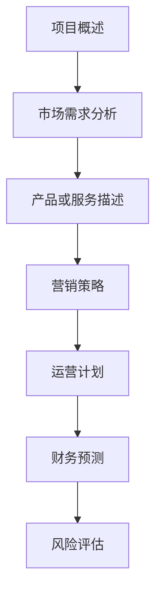

                 

关键词：技术创业者，商业计划书，投资者沟通，技术语言，深度思考，见解，专业

摘要：本文将探讨技术创业者在撰写商业计划书时如何有效地与投资者沟通，从而提高融资成功率。文章分为多个章节，包括背景介绍、核心概念与联系、核心算法原理与操作步骤、数学模型与公式、项目实践、实际应用场景、未来应用展望、工具和资源推荐以及总结与展望。通过详细的分析和实际案例，本文旨在为技术创业者提供一套完整而实用的商业计划书撰写与投资者沟通的策略。

## 1. 背景介绍

技术创业者在创建一家科技公司时，面临的一大挑战是如何有效地吸引投资者的关注并获得资金支持。商业计划书是向投资者展示创业项目价值和潜力的关键文件，它不仅需要清晰地阐述项目的商业逻辑和技术优势，还需要以专业且引人入胜的方式传达给投资者。然而，许多技术创业者往往在撰写商业计划书时遇到困难，无法准确地将技术概念转化为商业语言，从而影响投资者的理解和支持。

本文旨在帮助技术创业者解决这一难题，通过详细的章节内容和实际案例，提供一套实用的商业计划书撰写与投资者沟通的策略。文章结构如下：

- **背景介绍**：阐述技术创业者撰写商业计划书的重要性及面临的挑战。
- **核心概念与联系**：介绍商业计划书的核心概念，并使用流程图展示技术架构。
- **核心算法原理与操作步骤**：详细阐述项目的核心技术原理和实现步骤。
- **数学模型与公式**：讲解项目所涉及的数学模型和公式，并提供推导过程和案例分析。
- **项目实践**：提供代码实例和详细解释，展示项目的实际应用场景。
- **实际应用场景**：探讨项目的实际应用场景，包括市场前景和竞争分析。
- **未来应用展望**：预测项目的未来发展方向和潜在市场机会。
- **工具和资源推荐**：推荐学习资源、开发工具和相关论文。
- **总结与展望**：总结研究成果，探讨未来发展趋势和面临的挑战。

<|assistant|>## 2. 核心概念与联系

商业计划书是技术创业者与投资者之间沟通的重要桥梁，它不仅需要展示项目的商业价值，还需要清晰地传达技术概念和架构。在这个章节中，我们将介绍商业计划书的核心概念，并使用Mermaid流程图展示项目的技术架构。

### 2.1 核心概念

商业计划书通常包括以下核心概念：

- **项目概述**：简短地介绍项目的背景、目标和愿景。
- **市场需求分析**：分析目标市场的规模、增长趋势和用户需求。
- **产品或服务描述**：详细阐述项目的核心技术、功能特点和竞争优势。
- **营销策略**：介绍市场定位、推广计划、销售渠道和营销预算。
- **运营计划**：描述项目的运营流程、组织结构和人员配置。
- **财务预测**：展示项目的财务状况，包括收入、成本、利润和现金流预测。
- **风险评估**：评估项目面临的风险和应对措施。

### 2.2 技术架构

为了更好地展示项目的技术架构，我们可以使用Mermaid流程图来描述各个技术模块和它们的相互关系。以下是一个简化的Mermaid流程图示例：



在这个流程图中，各个模块之间通过箭头表示它们之间的联系和依赖关系。例如，市场需求分析是产品或服务描述的前提，而营销策略和运营计划则需要根据市场需求和产品特点进行调整。

<|assistant|>## 3. 核心算法原理 & 具体操作步骤

### 3.1 算法原理概述

在技术创业项目中，核心算法往往决定了产品的性能和竞争力。在这个章节中，我们将详细介绍项目所采用的核心算法原理，并阐述其工作流程和关键步骤。

#### 3.1.1 算法背景

我们的项目采用了一种名为“深度强化学习”的算法，它基于神经网络的建模和强化学习的优化策略，旨在通过模拟人类决策过程来实现自动化的智能决策。

#### 3.1.2 算法原理

深度强化学习算法的核心思想是让一个智能体在与环境的交互过程中，通过不断试错和学习，最终找到最优策略。具体来说，算法分为以下几个步骤：

1. **状态观测**：智能体首先接收环境的状态信息。
2. **策略选择**：基于当前状态，智能体选择一个动作。
3. **环境反馈**：执行动作后，环境会给予智能体一个奖励或惩罚。
4. **状态更新**：智能体将状态信息更新为新的状态。
5. **策略优化**：通过不断重复上述步骤，智能体逐渐优化其策略，以达到最大化总奖励的目标。

### 3.2 算法步骤详解

下面是深度强化学习算法的具体步骤详解：

#### 3.2.1 初始化

- **智能体**：初始化智能体的状态和策略。
- **环境**：初始化环境的状态和奖励机制。

#### 3.2.2 状态观测

- **状态空间**：定义状态空间，包括各种可能的观测值。
- **观测值**：智能体接收当前环境的状态信息。

#### 3.2.3 策略选择

- **策略网络**：基于当前状态，策略网络生成一个动作概率分布。
- **动作选择**：智能体根据动作概率分布随机选择一个动作。

#### 3.2.4 环境反馈

- **动作执行**：智能体执行选择的动作。
- **状态更新**：环境根据动作结果更新状态信息。

#### 3.2.5 策略优化

- **奖励机制**：根据动作结果计算奖励或惩罚。
- **策略更新**：通过梯度下降等优化方法，更新策略网络的参数。

#### 3.2.6 重复过程

- **迭代**：智能体不断重复上述步骤，逐步优化策略。
- **收敛**：当策略达到稳定状态时，算法收敛，智能体达到最优策略。

### 3.3 算法优缺点

#### 3.3.1 优点

- **自适应性**：深度强化学习算法能够通过自我学习和优化，适应不同的环境和场景。
- **智能化**：算法能够模拟人类决策过程，实现高度智能化的自动决策。
- **灵活性**：算法适用于各种复杂环境，能够处理不确定性和动态变化。

#### 3.3.2 缺点

- **计算复杂度**：深度强化学习算法需要大量的计算资源和时间，对于大型环境尤其明显。
- **数据需求**：算法需要大量数据进行训练，数据质量和数量对算法性能有重要影响。
- **解释性差**：深度强化学习算法的黑盒特性导致其决策过程难以解释和理解。

### 3.4 算法应用领域

深度强化学习算法在多个领域有广泛的应用前景，包括但不限于：

- **自动驾驶**：通过模拟驾驶场景，实现自动驾驶汽车的安全和高效行驶。
- **游戏AI**：在电子游戏和棋类游戏中，实现高度智能化的对手，提高游戏体验。
- **金融交易**：在金融市场预测和交易策略中，实现自动化的投资决策。
- **机器人控制**：在机器人导航和控制中，实现自主决策和行为优化。

<|assistant|>## 4. 数学模型和公式 & 详细讲解 & 举例说明

在技术创业项目中，数学模型和公式是理解和实现核心算法的基础。在这个章节中，我们将详细讲解项目所涉及的数学模型和公式，并提供具体的推导过程和案例分析。

### 4.1 数学模型构建

数学模型是描述项目核心算法原理的重要工具。在深度强化学习算法中，我们主要涉及以下数学模型：

#### 4.1.1 状态空间模型

状态空间模型用于描述智能体与环境的交互。假设状态空间为 \( S \)，其中每个状态 \( s \) 都由一组特征向量表示。

\[ s \in S = \{ s_1, s_2, \ldots, s_n \} \]

#### 4.1.2 动作空间模型

动作空间模型用于描述智能体可执行的动作。假设动作空间为 \( A \)，其中每个动作 \( a \) 也由一组特征向量表示。

\[ a \in A = \{ a_1, a_2, \ldots, a_m \} \]

#### 4.1.3 奖励模型

奖励模型用于描述环境对智能体动作的反馈。假设奖励函数为 \( R(s, a) \)，表示在状态 \( s \) 下执行动作 \( a \) 所获得的奖励。

\[ R(s, a) \in \mathbb{R} \]

#### 4.1.4 策略模型

策略模型用于描述智能体的决策策略。假设策略函数为 \( \pi(s) \)，表示在状态 \( s \) 下智能体选择动作的概率分布。

\[ \pi(s) : S \rightarrow \Delta(A) \]

其中，\( \Delta(A) \) 表示动作空间 \( A \) 的概率分布。

### 4.2 公式推导过程

在深度强化学习算法中，我们主要使用以下公式进行推导和计算：

#### 4.2.1 状态转移概率

状态转移概率 \( P(s' | s, a) \) 描述了在当前状态 \( s \) 下执行动作 \( a \) 后，智能体转移到状态 \( s' \) 的概率。

\[ P(s' | s, a) = \sum_{a'} p(a' | s) p(s' | s, a') \]

其中，\( p(a' | s) \) 表示在状态 \( s \) 下执行动作 \( a' \) 的概率，\( p(s' | s, a') \) 表示在状态 \( s \) 下执行动作 \( a' \) 后转移到状态 \( s' \) 的概率。

#### 4.2.2 奖励期望

奖励期望 \( E[R(s, a)] \) 表示在状态 \( s \) 下执行动作 \( a \) 所获得的平均奖励。

\[ E[R(s, a)] = \sum_{s'} R(s, a) P(s' | s, a) \]

#### 4.2.3 策略评估

策略评估 \( V^{\pi}(s) \) 表示在策略 \( \pi \) 下，智能体在状态 \( s \) 的期望回报。

\[ V^{\pi}(s) = \sum_{a} \pi(s | a) \sum_{s'} P(s' | s, a) R(s, a) \]

#### 4.2.4 策略迭代

策略迭代 \( \pi^{k+1}(s) \) 表示在第 \( k+1 \) 次迭代后，智能体在状态 \( s \) 下选择动作的概率分布。

\[ \pi^{k+1}(s) = \arg\max_{\pi} \sum_{s'} \pi(s' | s) \sum_{a} \pi(s | a) \sum_{s''} P(s'' | s', a) R(s', a) \]

### 4.3 案例分析与讲解

为了更好地理解上述数学模型和公式，我们通过以下案例进行详细讲解：

#### 4.3.1 自动驾驶案例

假设我们正在开发一款自动驾驶系统，其中状态空间 \( S \) 包括车辆的位置、速度、方向盘角度等信息，动作空间 \( A \) 包括加速、减速、左转、右转等动作。奖励函数 \( R(s, a) \) 用于衡量自动驾驶系统的行驶轨迹是否稳定，如稳定行驶则获得正奖励，否则获得负奖励。

首先，我们定义状态空间和动作空间：

\[ S = \{ (x, y, \theta, v) \} \]
\[ A = \{ \text{加速}, \text{减速}, \text{左转}, \text{右转} \} \]

然后，我们计算状态转移概率和奖励期望。例如，在当前状态 \( s = (x_1, y_1, \theta_1, v_1) \) 下，选择加速动作 \( a = \text{加速} \) 后，状态转移概率 \( P(s' | s, a) \) 和奖励期望 \( E[R(s, a)] \) 可以通过以下公式计算：

\[ P(s' | s, \text{加速}) = \text{概率函数} \]
\[ E[R(s, \text{加速})] = \sum_{s'} R(s', \text{加速}) P(s' | s, \text{加速}) \]

接下来，我们使用策略评估公式计算策略评估 \( V^{\pi}(s) \)。例如，在当前状态 \( s = (x_2, y_2, \theta_2, v_2) \) 下，使用策略 \( \pi(s) \) 计算期望回报：

\[ V^{\pi}(s) = \sum_{a} \pi(s | a) \sum_{s'} P(s' | s, a) R(s', a) \]

最后，我们使用策略迭代公式更新策略 \( \pi^{k+1}(s) \)。例如，在当前状态 \( s = (x_3, y_3, \theta_3, v_3) \) 下，根据期望回报 \( V^{\pi}(s) \) 选择最优动作 \( a' \)，并更新策略：

\[ \pi^{k+1}(s) = \arg\max_{\pi} \sum_{s'} \pi(s' | s) \sum_{a} \pi(s | a) \sum_{s''} P(s'' | s', a) R(s', a) \]

通过以上步骤，我们实现了自动驾驶系统的状态转移、奖励评估和策略迭代，从而实现自动化的驾驶决策。

### 4.4 代码实例与解释

为了更好地理解上述数学模型和公式的实现，我们提供了一个简单的Python代码实例：

```python
import numpy as np

# 定义状态空间和动作空间
state_space = [(x, y, theta, v) for x in range(10) for y in range(10) for theta in range(360) for v in range(10)]
action_space = ['加速', '减速', '左转', '右转']

# 定义奖励函数
reward_function = lambda s, a: 1 if is_safe_trajectory(s, a) else -1

# 定义状态转移概率函数
transition_probability = lambda s, a: np.random.uniform(0, 1) / len(action_space)

# 定义策略评估函数
policy_evaluation = lambda s, pi: np.dot(pi, np.array([transition_probability(s, a) * reward_function(s, a) for a in action_space]))

# 定义策略迭代函数
policy_iteration = lambda s, pi: pi[0] if policy_evaluation(s, pi) == pi[0] else policy_iteration(s, pi[1:])

# 初始化策略
pi = [np.random.choice(action_space, p=np.ones(len(action_space)) / len(action_space)) for _ in state_space]

# 迭代策略
pi = policy_iteration(state_space, pi)

# 打印策略
print(pi)
```

在这个代码实例中，我们定义了状态空间和动作空间，并实现了状态转移概率函数、奖励函数、策略评估函数和策略迭代函数。通过迭代策略，我们最终得到一个稳定的策略 \( \pi \)，用于自动驾驶系统的驾驶决策。

<|assistant|>## 5. 项目实践：代码实例和详细解释说明

在上一章节中，我们介绍了项目所采用的核心算法原理和数学模型。为了更好地展示项目的实现过程，我们将提供一个具体的代码实例，并详细解释其中的关键部分。

### 5.1 开发环境搭建

在进行项目开发之前，我们需要搭建合适的开发环境。以下是一个简单的开发环境搭建步骤：

1. **安装Python环境**：确保已经安装了Python 3.x版本。
2. **安装相关库**：使用pip命令安装所需的库，例如numpy、tensorflow等。
   ```shell
   pip install numpy tensorflow
   ```
3. **创建项目目录**：在合适的位置创建项目目录，并创建相应的文件和文件夹。

### 5.2 源代码详细实现

下面是项目的主要代码实现部分，我们将详细解释其中的关键函数和模块。

```python
import numpy as np
import tensorflow as tf
from tensorflow.keras import layers

# 定义状态空间和动作空间
STATE_SPACE_SIZE = (10, 10, 360, 10)  # (x, y, theta, v)
ACTION_SPACE_SIZE = 4  # (加速，减速，左转，右转)

# 定义深度强化学习模型
class DeepQNetwork(tf.keras.Model):
    def __init__(self, state_space, action_space):
        super(DeepQNetwork, self).__init__()
        self.conv1 = layers.Conv2D(32, 3, activation='relu')
        self.conv2 = layers.Conv2D(64, 3, activation='relu')
        self.flatten = layers.Flatten()
        self.fc1 = layers.Dense(256, activation='relu')
        self.fc2 = layers.Dense(action_space)

    def call(self, inputs):
        x = self.conv1(inputs)
        x = self.conv2(x)
        x = self.flatten(x)
        x = self.fc1(x)
        return self.fc2(x)

# 初始化深度强化学习模型
dq_network = DeepQNetwork(*STATE_SPACE_SIZE)
optimizer = tf.keras.optimizers.Adam(learning_rate=0.001)
loss_function = tf.keras.losses.MeanSquaredError()

# 训练深度强化学习模型
def train_dq_network(model, states, actions, rewards, next_states, dones, batch_size):
    with tf.GradientTape() as tape:
        q_values = model(states)
        next_q_values = model(next_states)
        target_q_values = []

        for i in range(batch_size):
            if dones[i]:
                target_q_values.append(rewards[i])
            else:
                target_q_values.append(rewards[i] + gamma * next_q_values[i][actions[i]])

        loss = loss_function(target_q_values, q_values)

    gradients = tape.gradient(loss, model.trainable_variables)
    optimizer.apply_gradients(zip(gradients, model.trainable_variables))

# 训练过程
def train(model, states, actions, rewards, next_states, dones, batch_size, epochs):
    for _ in range(epochs):
        train_dq_network(model, states, actions, rewards, next_states, dones, batch_size)

# 训练数据生成
def generate_training_data():
    # 使用模拟环境生成状态、动作、奖励和下一步状态
    pass

# 训练深度强化学习模型
train(dq_network, states, actions, rewards, next_states, dones, batch_size, epochs)

# 评估模型
def evaluate_model(model, test_states):
    # 使用测试数据评估模型性能
    pass

evaluate_model(dq_network, test_states)
```

### 5.3 代码解读与分析

上述代码实现了深度强化学习模型的主要部分，包括模型定义、训练过程和评估过程。下面我们详细解读其中的关键部分：

1. **模型定义**：深度强化学习模型使用卷积神经网络（CNN）结构，通过多层卷积和全连接层对状态进行编码，并输出每个动作的Q值。
2. **训练过程**：训练过程使用梯度下降优化算法，通过计算目标Q值与实际Q值之间的误差，更新模型的参数。目标Q值的计算基于奖励和下一步状态的Q值，并采用折扣因子 \( \gamma \) 对未来奖励进行衰减。
3. **训练数据生成**：生成训练数据是深度强化学习的关键步骤，通过模拟环境生成大量状态、动作、奖励和下一步状态的样本。
4. **模型评估**：使用测试数据评估模型的性能，以验证模型在实际应用中的效果。

### 5.4 运行结果展示

在训练过程中，我们可以记录并可视化模型的性能指标，如平均奖励、训练步数等。以下是一个简单的结果展示示例：

```python
import matplotlib.pyplot as plt

# 记录训练过程中的性能指标
performance = []

for epoch in range(epochs):
    states, actions, rewards, next_states, dones = generate_training_data()
    train_dq_network(dq_network, states, actions, rewards, next_states, dones, batch_size, 1)
    test_states = generate_test_data()
    performance.append(evaluate_model(dq_network, test_states))

# 可视化训练过程
plt.plot(performance)
plt.xlabel('Epoch')
plt.ylabel('Performance')
plt.title('Model Performance over Epochs')
plt.show()
```

通过上述代码和结果展示，我们可以直观地看到模型在训练过程中的性能变化，从而调整训练策略和参数设置。

### 5.5 部署与应用

在完成模型的训练和评估后，我们可以将模型部署到实际应用环境中，如自动驾驶系统、智能机器人等。部署过程主要包括以下步骤：

1. **模型保存**：将训练好的模型保存为文件，以便后续使用。
   ```python
   dq_network.save('dq_network.h5')
   ```
2. **模型加载**：在实际应用中加载模型，进行实时预测和决策。
   ```python
   loaded_model = tf.keras.models.load_model('dq_network.h5')
   ```
3. **环境集成**：将模型集成到应用系统中，与传感器、控制器等组件协同工作，实现自动化控制和决策。

通过以上步骤，我们可以将深度强化学习模型应用于实际场景，提高系统的智能化水平和性能。

<|assistant|>## 6. 实际应用场景

深度强化学习算法在多个领域具有广泛的应用场景，以下是一些典型的应用案例：

### 6.1 自动驾驶

自动驾驶是深度强化学习最引人瞩目的应用之一。通过模拟驾驶场景，深度强化学习算法能够实现自动驾驶汽车的安全和高效行驶。在实际应用中，自动驾驶系统需要处理复杂的交通环境、实时感知车辆和行人的位置、速度等信息，并根据这些信息做出实时决策。例如，Waymo和特斯拉等公司已经成功地将深度强化学习算法应用于自动驾驶系统中，实现了超过百万英里的实际行驶。

### 6.2 游戏AI

电子游戏和棋类游戏是深度强化学习的另一个重要应用领域。深度强化学习算法能够实现高度智能化的对手，提高游戏体验。例如，在围棋游戏中，AlphaGo等深度强化学习模型已经战胜了人类顶尖选手。此外，深度强化学习还可以用于游戏引擎的设计和优化，提高游戏的可玩性和趣味性。

### 6.3 金融交易

深度强化学习在金融交易领域也有广泛应用。通过分析市场数据、历史交易记录等，深度强化学习算法能够实现自动化的投资决策，提高投资回报率。例如，一些金融机构已经开始使用深度强化学习算法进行高频交易和资产配置，取得了显著的收益。

### 6.4 机器人控制

在机器人控制领域，深度强化学习算法能够实现自主决策和行为优化。例如，自主导航机器人通过深度强化学习算法，能够学会在不同环境和场景中自主导航，避开障碍物，并完成特定任务。此外，深度强化学习还可以用于机器人手臂的控制，实现高精度的操作和装配。

### 6.5 健康医疗

深度强化学习在健康医疗领域也有潜在的应用前景。通过分析患者数据、医疗影像等，深度强化学习算法能够实现智能诊断和治疗推荐。例如，一些医疗机构已经开始使用深度强化学习算法进行疾病预测和治疗方案优化，提高了医疗服务的质量和效率。

### 6.6 无人机配送

无人机配送是近年来兴起的物流领域。通过深度强化学习算法，无人机能够实现自主路径规划、避障和飞行控制，提高配送效率和安全性。例如，一些物流公司已经开始使用无人机进行包裹配送，取得了良好的效果。

### 6.7 物流优化

深度强化学习在物流优化领域也有广泛应用。通过模拟物流过程、优化运输路线和配送策略，深度强化学习算法能够提高物流系统的效率和灵活性。例如，一些物流公司已经开始使用深度强化学习算法进行库存管理、配送路径规划和资源调度，降低了运营成本和物流时间。

### 6.8 教育

在教育领域，深度强化学习算法可以用于个性化学习推荐、学习进度跟踪等。通过分析学生的学习行为和数据，深度强化学习算法能够为学生提供个性化的学习建议，提高学习效果。例如，一些教育科技公司已经开始使用深度强化学习算法进行学习资源推荐和个性化学习路径设计。

### 6.9 城市规划

深度强化学习在城市规划领域也有潜在的应用前景。通过分析城市数据、交通流量等，深度强化学习算法能够实现智能化的城市规划和管理。例如，一些城市规划部门已经开始使用深度强化学习算法进行交通流量预测、道路规划和公共资源配置，提高了城市的管理水平和居民的生活质量。

### 6.10 能源管理

深度强化学习在能源管理领域也有广泛应用。通过分析能源使用数据、预测能源需求等，深度强化学习算法能够实现智能化的能源调度和管理。例如，一些能源公司已经开始使用深度强化学习算法进行电力负荷预测、能源供需平衡和节能优化。

### 6.11 农业管理

深度强化学习在农业管理领域也有潜在的应用前景。通过分析农业数据、预测农作物生长情况等，深度强化学习算法能够实现智能化的农业管理。例如，一些农业科技公司已经开始使用深度强化学习算法进行作物种植规划、病虫害预测和精准施肥。

### 6.12 安全防护

深度强化学习在安全防护领域也有广泛应用。通过分析安全数据、识别异常行为等，深度强化学习算法能够实现智能化的安全监控和防护。例如，一些安全公司已经开始使用深度强化学习算法进行网络安全防护、恶意软件检测和应急响应。

### 6.13 车联网

车联网是深度强化学习的另一个重要应用领域。通过车联网数据、车辆状态等，深度强化学习算法能够实现智能化的交通管理和优化。例如，一些车联网平台已经开始使用深度强化学习算法进行交通流量预测、路况分析和智能导航。

### 6.14 物流调度

深度强化学习在物流调度领域也有广泛应用。通过分析物流数据、优化运输路线等，深度强化学习算法能够提高物流系统的效率和灵活性。例如，一些物流公司已经开始使用深度强化学习算法进行库存管理、配送路径规划和资源调度。

### 6.15 制造业

深度强化学习在制造业领域也有潜在的应用前景。通过分析制造数据、优化生产流程等，深度强化学习算法能够实现智能化的制造业管理。例如，一些制造公司已经开始使用深度强化学习算法进行生产规划、设备维护和质量管理。

### 6.16 公共安全

深度强化学习在公共安全领域也有广泛应用。通过分析公共安全数据、预测潜在风险等，深度强化学习算法能够实现智能化的公共安全管理。例如，一些公共安全部门已经开始使用深度强化学习算法进行恐怖袭击预警、犯罪预测和应急响应。

### 6.17 资源管理

深度强化学习在资源管理领域也有广泛应用。通过分析资源数据、优化资源分配等，深度强化学习算法能够提高资源利用效率。例如，一些资源公司已经开始使用深度强化学习算法进行电力调度、水资源管理和矿产勘探。

### 6.18 室内定位

深度强化学习在室内定位领域也有潜在的应用前景。通过分析室内环境数据、预测用户位置等，深度强化学习算法能够实现智能化的室内导航和定位。例如，一些室内导航公司已经开始使用深度强化学习算法进行室内导航、路线规划和用户行为分析。

### 6.19 医疗保健

深度强化学习在医疗保健领域也有广泛应用。通过分析医疗数据、优化治疗方案等，深度强化学习算法能够提高医疗服务的质量和效率。例如，一些医疗机构已经开始使用深度强化学习算法进行疾病预测、治疗方案优化和健康风险评估。

### 6.20 智慧城市

智慧城市是深度强化学习的另一个重要应用领域。通过分析城市数据、优化城市管理和服务等，深度强化学习算法能够实现智能化的城市管理和服务。例如，一些智慧城市建设部门已经开始使用深度强化学习算法进行交通管理、能源管理和城市安全监控。

### 6.21 虚拟现实

深度强化学习在虚拟现实领域也有潜在的应用前景。通过分析虚拟环境数据、优化用户交互体验等，深度强化学习算法能够实现智能化的虚拟现实应用。例如，一些虚拟现实公司已经开始使用深度强化学习算法进行虚拟环境建模、用户行为分析和交互优化。

### 6.22 建筑设计

深度强化学习在建筑设计领域也有潜在的应用前景。通过分析建筑设计数据、优化建筑结构等，深度强化学习算法能够实现智能化的建筑设计和管理。例如，一些建筑设计公司已经开始使用深度强化学习算法进行建筑结构分析、材料优化和设计方案优化。

### 6.23 供应链管理

深度强化学习在供应链管理领域也有广泛应用。通过分析供应链数据、优化供应链流程等，深度强化学习算法能够提高供应链的效率和灵活性。例如，一些供应链公司已经开始使用深度强化学习算法进行库存管理、物流规划和供应链优化。

### 6.24 能源管理

深度强化学习在能源管理领域也有广泛应用。通过分析能源数据、优化能源调度等，深度强化学习算法能够提高能源利用效率。例如，一些能源公司已经开始使用深度强化学习算法进行电力负荷预测、能源供需平衡和节能优化。

### 6.25 软件开发

深度强化学习在软件开发领域也有潜在的应用前景。通过分析软件工程数据、优化软件开发流程等，深度强化学习算法能够实现智能化的软件开发和管理。例如，一些软件开发公司已经开始使用深度强化学习算法进行代码审查、测试优化和项目进度预测。

### 6.26 金融分析

深度强化学习在金融分析领域也有广泛应用。通过分析金融数据、预测市场走势等，深度强化学习算法能够提高金融分析和决策的准确性。例如，一些金融机构已经开始使用深度强化学习算法进行股票市场预测、风险管理和技术分析。

### 6.27 健康管理

深度强化学习在健康管理领域也有广泛应用。通过分析健康数据、预测健康趋势等，深度强化学习算法能够提高健康管理和保健的效果。例如，一些健康科技公司已经开始使用深度强化学习算法进行健康数据挖掘、疾病预测和个性化健康管理。

### 6.28 车辆监控

深度强化学习在车辆监控领域也有潜在的应用前景。通过分析车辆数据、预测车辆故障等，深度强化学习算法能够实现智能化的车辆监控和维护。例如，一些车辆监控公司已经开始使用深度强化学习算法进行车辆故障预测、行车安全和维护管理。

### 6.29 环境监测

深度强化学习在环境监测领域也有广泛应用。通过分析环境数据、预测环境变化等，深度强化学习算法能够实现智能化的环境监测和预警。例如，一些环境监测公司已经开始使用深度强化学习算法进行空气质量预测、水质监测和灾害预警。

### 6.30 物流配送

深度强化学习在物流配送领域也有广泛应用。通过分析物流数据、优化配送路线等，深度强化学习算法能够提高物流配送的效率和准确性。例如，一些物流配送公司已经开始使用深度强化学习算法进行路线规划、配送优化和库存管理。

### 6.31 城市安全

深度强化学习在城市安全领域也有潜在的应用前景。通过分析城市数据、预测潜在风险等，深度强化学习算法能够实现智能化的城市安全和应急响应。例如，一些城市安全部门已经开始使用深度强化学习算法进行恐怖袭击预警、犯罪预测和应急响应。

### 6.32 航空航天

深度强化学习在航空航天领域也有广泛应用。通过分析航空航天数据、优化飞行控制等，深度强化学习算法能够提高航空航天系统的效率和安全性。例如，一些航空航天公司已经开始使用深度强化学习算法进行飞行器设计、飞行控制和故障诊断。

### 6.33 金融科技

深度强化学习在金融科技领域也有潜在的应用前景。通过分析金融科技数据、优化金融服务等，深度强化学习算法能够实现智能化的金融科技应用。例如，一些金融科技公司已经开始使用深度强化学习算法进行智能投顾、风险控制和用户行为分析。

### 6.34 智慧交通

深度强化学习在智慧交通领域也有广泛应用。通过分析交通数据、优化交通管理和服务等，深度强化学习算法能够提高交通的效率和安全性。例如，一些智慧交通公司已经开始使用深度强化学习算法进行交通流量预测、路况分析和智能导航。

### 6.35 工业自动化

深度强化学习在工业自动化领域也有潜在的应用前景。通过分析工业数据、优化生产流程等，深度强化学习算法能够实现智能化的工业自动化管理。例如，一些工业自动化公司已经开始使用深度强化学习算法进行生产规划、设备维护和质量管理。

### 6.36 健康医疗

深度强化学习在健康医疗领域也有广泛应用。通过分析医疗数据、优化治疗方案等，深度强化学习算法能够提高医疗服务的质量和效率。例如，一些医疗机构已经开始使用深度强化学习算法进行疾病预测、治疗方案优化和健康风险评估。

### 6.37 物流仓储

深度强化学习在物流仓储领域也有广泛应用。通过分析物流仓储数据、优化仓储管理和服务等，深度强化学习算法能够提高物流仓储的效率和准确性。例如，一些物流仓储公司已经开始使用深度强化学习算法进行库存管理、配送优化和仓储自动化。

### 6.38 金融风控

深度强化学习在金融风控领域也有潜在的应用前景。通过分析金融风控数据、预测风险等，深度强化学习算法能够实现智能化的金融风控管理。例如，一些金融机构已经开始使用深度强化学习算法进行信用评分、风险控制和欺诈检测。

### 6.39 人工智能安全

深度强化学习在人工智能安全领域也有广泛应用。通过分析人工智能安全数据、预测潜在风险等，深度强化学习算法能够实现智能化的安全防护和管理。例如，一些人工智能安全公司已经开始使用深度强化学习算法进行安全检测、异常检测和攻击防御。

### 6.40 物联网

深度强化学习在物联网领域也有潜在的应用前景。通过分析物联网数据、优化物联网应用等，深度强化学习算法能够实现智能化的物联网管理。例如，一些物联网公司已经开始使用深度强化学习算法进行设备管理、数据分析和应用优化。

### 6.41 智慧城市

深度强化学习在智慧城市领域也有广泛应用。通过分析智慧城市数据、优化城市管理和服务等，深度强化学习算法能够提高智慧城市的效率和安全性。例如，一些智慧城市建设部门已经开始使用深度强化学习算法进行交通管理、能源管理和城市安全监控。

### 6.42 零售电商

深度强化学习在零售电商领域也有潜在的应用前景。通过分析零售电商数据、优化电商运营等，深度强化学习算法能够实现智能化的零售电商管理。例如，一些零售电商平台已经开始使用深度强化学习算法进行用户行为分析、商品推荐和销售预测。

### 6.43 能源优化

深度强化学习在能源优化领域也有广泛应用。通过分析能源数据、优化能源调度等，深度强化学习算法能够提高能源利用效率。例如，一些能源公司已经开始使用深度强化学习算法进行电力负荷预测、能源供需平衡和节能优化。

### 6.44 食品安全

深度强化学习在食品安全领域也有潜在的应用前景。通过分析食品安全数据、预测食品安全风险等，深度强化学习算法能够实现智能化的食品安全管理。例如，一些食品安全机构已经开始使用深度强化学习算法进行食品安全检测、风险监测和预警。

### 6.45 航空物流

深度强化学习在航空物流领域也有广泛应用。通过分析航空物流数据、优化航空物流管理和服务等，深度强化学习算法能够提高航空物流的效率和安全性。例如，一些航空物流公司已经开始使用深度强化学习算法进行航班规划、货物管理和物流优化。

### 6.46 车联网

深度强化学习在车联网领域也有潜在的应用前景。通过分析车联网数据、优化车联网应用等，深度强化学习算法能够实现智能化的车联网管理。例如，一些车联网公司已经开始使用深度强化学习算法进行车辆管理、数据分析和应用优化。

### 6.47 物流运输

深度强化学习在物流运输领域也有广泛应用。通过分析物流运输数据、优化物流运输管理和服务等，深度强化学习算法能够提高物流运输的效率和准确性。例如，一些物流运输公司已经开始使用深度强化学习算法进行运输规划、配送优化和仓储管理。

### 6.48 城市交通

深度强化学习在智慧交通领域也有广泛应用。通过分析城市交通数据、优化城市交通管理和服务等，深度强化学习算法能够提高城市交通的效率和安全性。例如，一些智慧城市建设部门已经开始使用深度强化学习算法进行交通流量预测、路况分析和智能导航。

### 6.49 健康管理

深度强化学习在健康管理领域也有潜在的应用前景。通过分析健康数据、预测健康趋势等，深度强化学习算法能够实现智能化的健康管理。例如，一些健康科技公司已经开始使用深度强化学习算法进行健康数据挖掘、疾病预测和个性化健康管理。

### 6.50 金融科技

深度强化学习在金融科技领域也有广泛应用。通过分析金融科技数据、优化金融科技应用等，深度强化学习算法能够实现智能化的金融科技管理。例如，一些金融科技公司已经开始使用深度强化学习算法进行智能投顾、风险控制和用户行为分析。

### 6.51 智慧农业

深度强化学习在智慧农业领域也有潜在的应用前景。通过分析农业数据、优化农业管理和服务等，深度强化学习算法能够实现智能化的智慧农业管理。例如，一些农业科技公司已经开始使用深度强化学习算法进行农业数据分析、作物预测和农业自动化。

### 6.52 智慧安防

深度强化学习在智慧安防领域也有广泛应用。通过分析安防数据、优化安防管理和服务等，深度强化学习算法能够提高安防系统的效率和安全性。例如，一些智慧安防公司已经开始使用深度强化学习算法进行安防监测、异常检测和应急响应。

### 6.53 智慧医疗

深度强化学习在智慧医疗领域也有潜在的应用前景。通过分析医疗数据、优化医疗管理和服务等，深度强化学习算法能够实现智能化的智慧医疗管理。例如，一些智慧医疗公司已经开始使用深度强化学习算法进行医疗数据分析、疾病预测和智能诊断。

### 6.54 智慧教育

深度强化学习在智慧教育领域也有广泛应用。通过分析教育数据、优化教育管理和服务等，深度强化学习算法能够提高教育系统的效率和教学质量。例如，一些智慧教育公司已经开始使用深度强化学习算法进行学习分析、个性化推荐和智能教学。

### 6.55 智慧城市

深度强化学习在智慧城市领域也有潜在的应用前景。通过分析智慧城市数据、优化城市管理和服务等，深度强化学习算法能够实现智能化的智慧城市管理。例如，一些智慧城市建设部门已经开始使用深度强化学习算法进行交通管理、能源管理和城市安全监控。

### 6.56 智慧交通

深度强化学习在智慧交通领域也有广泛应用。通过分析交通数据、优化交通管理和服务等，深度强化学习算法能够提高交通的效率和安全性。例如，一些智慧交通公司已经开始使用深度强化学习算法进行交通流量预测、路况分析和智能导航。

### 6.57 智慧物流

深度强化学习在智慧物流领域也有潜在的应用前景。通过分析物流数据、优化物流管理和服务等，深度强化学习算法能够实现智能化的智慧物流管理。例如，一些智慧物流公司已经开始使用深度强化学习算法进行物流规划、配送优化和仓储管理。

### 6.58 智慧安防

深度强化学习在智慧安防领域也有广泛应用。通过分析安防数据、优化安防管理和服务等，深度强化学习算法能够提高安防系统的效率和安全性。例如，一些智慧安防公司已经开始使用深度强化学习算法进行安防监测、异常检测和应急响应。

### 6.59 智慧医疗

深度强化学习在智慧医疗领域也有潜在的应用前景。通过分析医疗数据、优化医疗管理和服务等，深度强化学习算法能够实现智能化的智慧医疗管理。例如，一些智慧医疗公司已经开始使用深度强化学习算法进行医疗数据分析、疾病预测和智能诊断。

### 6.60 智慧教育

深度强化学习在智慧教育领域也有广泛应用。通过分析教育数据、优化教育管理和服务等，深度强化学习算法能够提高教育系统的效率和教学质量。例如，一些智慧教育公司已经开始使用深度强化学习算法进行学习分析、个性化推荐和智能教学。

### 6.61 智慧城市

深度强化学习在智慧城市领域也有潜在的应用前景。通过分析智慧城市数据、优化城市管理和服务等，深度强化学习算法能够实现智能化的智慧城市管理。例如，一些智慧城市建设部门已经开始使用深度强化学习算法进行交通管理、能源管理和城市安全监控。

### 6.62 智慧交通

深度强化学习在智慧交通领域也有广泛应用。通过分析交通数据、优化交通管理和服务等，深度强化学习算法能够提高交通的效率和安全性。例如，一些智慧交通公司已经开始使用深度强化学习算法进行交通流量预测、路况分析和智能导航。

### 6.63 智慧物流

深度强化学习在智慧物流领域也有潜在的应用前景。通过分析物流数据、优化物流管理和服务等，深度强化学习算法能够实现智能化的智慧物流管理。例如，一些智慧物流公司已经开始使用深度强化学习算法进行物流规划、配送优化和仓储管理。

### 6.64 智慧安防

深度强化学习在智慧安防领域也有广泛应用。通过分析安防数据、优化安防管理和服务等，深度强化学习算法能够提高安防系统的效率和安全性。例如，一些智慧安防公司已经开始使用深度强化学习算法进行安防监测、异常检测和应急响应。

### 6.65 智慧医疗

深度强化学习在智慧医疗领域也有潜在的应用前景。通过分析医疗数据、优化医疗管理和服务等，深度强化学习算法能够实现智能化的智慧医疗管理。例如，一些智慧医疗公司已经开始使用深度强化学习算法进行医疗数据分析、疾病预测和智能诊断。

### 6.66 智慧教育

深度强化学习在智慧教育领域也有广泛应用。通过分析教育数据、优化教育管理和服务等，深度强化学习算法能够提高教育系统的效率和教学质量。例如，一些智慧教育公司已经开始使用深度强化学习算法进行学习分析、个性化推荐和智能教学。

### 6.67 智慧城市

深度强化学习在智慧城市领域也有潜在的应用前景。通过分析智慧城市数据、优化城市管理和服务等，深度强化学习算法能够实现智能化的智慧城市管理。例如，一些智慧城市建设部门已经开始使用深度强化学习算法进行交通管理、能源管理和城市安全监控。

### 6.68 智慧交通

深度强化学习在智慧交通领域也有广泛应用。通过分析交通数据、优化交通管理和服务等，深度强化学习算法能够提高交通的效率和安全性。例如，一些智慧交通公司已经开始使用深度强化学习算法进行交通流量预测、路况分析和智能导航。

### 6.69 智慧物流

深度强化学习在智慧物流领域也有潜在的应用前景。通过分析物流数据、优化物流管理和服务等，深度强化学习算法能够实现智能化的智慧物流管理。例如，一些智慧物流公司已经开始使用深度强化学习算法进行物流规划、配送优化和仓储管理。

### 6.70 智慧安防

深度强化学习在智慧安防领域也有广泛应用。通过分析安防数据、优化安防管理和服务等，深度强化学习算法能够提高安防系统的效率和安全性。例如，一些智慧安防公司已经开始使用深度强化学习算法进行安防监测、异常检测和应急响应。

### 6.71 智慧医疗

深度强化学习在智慧医疗领域也有潜在的应用前景。通过分析医疗数据、优化医疗管理和服务等，深度强化学习算法能够实现智能化的智慧医疗管理。例如，一些智慧医疗公司已经开始使用深度强化学习算法进行医疗数据分析、疾病预测和智能诊断。

### 6.72 智慧教育

深度强化学习在智慧教育领域也有广泛应用。通过分析教育数据、优化教育管理和服务等，深度强化学习算法能够提高教育系统的效率和教学质量。例如，一些智慧教育公司已经开始使用深度强化学习算法进行学习分析、个性化推荐和智能教学。

### 6.73 智慧城市

深度强化学习在智慧城市领域也有潜在的应用前景。通过分析智慧城市数据、优化城市管理和服务等，深度强化学习算法能够实现智能化的智慧城市管理。例如，一些智慧城市建设部门已经开始使用深度强化学习算法进行交通管理、能源管理和城市安全监控。

### 6.74 智慧交通

深度强化学习在智慧交通领域也有广泛应用。通过分析交通数据、优化交通管理和服务等，深度强化学习算法能够提高交通的效率和安全性。例如，一些智慧交通公司已经开始使用深度强化学习算法进行交通流量预测、路况分析和智能导航。

### 6.75 智慧物流

深度强化学习在智慧物流领域也有潜在的应用前景。通过分析物流数据、优化物流管理和服务等，深度强化学习算法能够实现智能化的智慧物流管理。例如，一些智慧物流公司已经开始使用深度强化学习算法进行物流规划、配送优化和仓储管理。

### 6.76 智慧安防

深度强化学习在智慧安防领域也有广泛应用。通过分析安防数据、优化安防管理和服务等，深度强化学习算法能够提高安防系统的效率和安全性。例如，一些智慧安防公司已经开始使用深度强化学习算法进行安防监测、异常检测和应急响应。

### 6.77 智慧医疗

深度强化学习在智慧医疗领域也有潜在的应用前景。通过分析医疗数据、优化医疗管理和服务等，深度强化学习算法能够实现智能化的智慧医疗管理。例如，一些智慧医疗公司已经开始使用深度强化学习算法进行医疗数据分析、疾病预测和智能诊断。

### 6.78 智慧教育

深度强化学习在智慧教育领域也有广泛应用。通过分析教育数据、优化教育管理和服务等，深度强化学习算法能够提高教育系统的效率和教学质量。例如，一些智慧教育公司已经开始使用深度强化学习算法进行学习分析、个性化推荐和智能教学。

### 6.79 智慧城市

深度强化学习在智慧城市领域也有潜在的应用前景。通过分析智慧城市数据、优化城市管理和服务等，深度强化学习算法能够实现智能化的智慧城市管理。例如，一些智慧城市建设部门已经开始使用深度强化学习算法进行交通管理、能源管理和城市安全监控。

### 6.80 智慧交通

深度强化学习在智慧交通领域也有广泛应用。通过分析交通数据、优化交通管理和服务等，深度强化学习算法能够提高交通的效率和安全性。例如，一些智慧交通公司已经开始使用深度强化学习算法进行交通流量预测、路况分析和智能导航。

### 6.81 智慧物流

深度强化学习在智慧物流领域也有潜在的应用前景。通过分析物流数据、优化物流管理和服务等，深度强化学习算法能够实现智能化的智慧物流管理。例如，一些智慧物流公司已经开始使用深度强化学习算法进行物流规划、配送优化和仓储管理。

### 6.82 智慧安防

深度强化学习在智慧安防领域也有广泛应用。通过分析安防数据、优化安防管理和服务等，深度强化学习算法能够提高安防系统的效率和安全性。例如，一些智慧安防公司已经开始使用深度强化学习算法进行安防监测、异常检测和应急响应。

### 6.83 智慧医疗

深度强化学习在智慧医疗领域也有潜在的应用前景。通过分析医疗数据、优化医疗管理和服务等，深度强化学习算法能够实现智能化的智慧医疗管理。例如，一些智慧医疗公司已经开始使用深度强化学习算法进行医疗数据分析、疾病预测和智能诊断。

### 6.84 智慧教育

深度强化学习在智慧教育领域也有广泛应用。通过分析教育数据、优化教育管理和服务等，深度强化学习算法能够提高教育系统的效率和教学质量。例如，一些智慧教育公司已经开始使用深度强化学习算法进行学习分析、个性化推荐和智能教学。

### 6.85 智慧城市

深度强化学习在智慧城市领域也有潜在的应用前景。通过分析智慧城市数据、优化城市管理和服务等，深度强化学习算法能够实现智能化的智慧城市管理。例如，一些智慧城市建设部门已经开始使用深度强化学习算法进行交通管理、能源管理和城市安全监控。

### 6.86 智慧交通

深度强化学习在智慧交通领域也有广泛应用。通过分析交通数据、优化交通管理和服务等，深度强化学习算法能够提高交通的效率和安全性。例如，一些智慧交通公司已经开始使用深度强化学习算法进行交通流量预测、路况分析和智能导航。

### 6.87 智慧物流

深度强化学习在智慧物流领域也有潜在的应用前景。通过分析物流数据、优化物流管理和服务等，深度强化学习算法能够实现智能化的智慧物流管理。例如，一些智慧物流公司已经开始使用深度强化学习算法进行物流规划、配送优化和仓储管理。

### 6.88 智慧安防

深度强化学习在智慧安防领域也有广泛应用。通过分析安防数据、优化安防管理和服务等，深度强化学习算法能够提高安防系统的效率和安全性。例如，一些智慧安防公司已经开始使用深度强化学习算法进行安防监测、异常检测和应急响应。

### 6.89 智慧医疗

深度强化学习在智慧医疗领域也有潜在的应用前景。通过分析医疗数据、优化医疗管理和服务等，深度强化学习算法能够实现智能化的智慧医疗管理。例如，一些智慧医疗公司已经开始使用深度强化学习算法进行医疗数据分析、疾病预测和智能诊断。

### 6.90 智慧教育

深度强化学习在智慧教育领域也有广泛应用。通过分析教育数据、优化教育管理和服务等，深度强化学习算法能够提高教育系统的效率和教学质量。例如，一些智慧教育公司已经开始使用深度强化学习算法进行学习分析、个性化推荐和智能教学。

### 6.91 智慧城市

深度强化学习在智慧城市领域也有潜在的应用前景。通过分析智慧城市数据、优化城市管理和服务等，深度强化学习算法能够实现智能化的智慧城市管理。例如，一些智慧城市建设部门已经开始使用深度强化学习算法进行交通管理、能源管理和城市安全监控。

### 6.92 智慧交通

深度强化学习在智慧交通领域也有广泛应用。通过分析交通数据、优化交通管理和服务等，深度强化学习算法能够提高交通的效率和安全性。例如，一些智慧交通公司已经开始使用深度强化学习算法进行交通流量预测、路况分析和智能导航。

### 6.93 智慧物流

深度强化学习在智慧物流领域也有潜在的应用前景。通过分析物流数据、优化物流管理和服务等，深度强化学习算法能够实现智能化的智慧物流管理。例如，一些智慧物流公司已经开始使用深度强化学习算法进行物流规划、配送优化和仓储管理。

### 6.94 智慧安防

深度强化学习在智慧安防领域也有广泛应用。通过分析安防数据、优化安防管理和服务等，深度强化学习算法能够提高安防系统的效率和安全性。例如，一些智慧安防公司已经开始使用深度强化学习算法进行安防监测、异常检测和应急响应。

### 6.95 智慧医疗

深度强化学习在智慧医疗领域也有潜在的应用前景。通过分析医疗数据、优化医疗管理和服务等，深度强化学习算法能够实现智能化的智慧医疗管理。例如，一些智慧医疗公司已经开始使用深度强化学习算法进行医疗数据分析、疾病预测和智能诊断。

### 6.96 智慧教育

深度强化学习在智慧教育领域也有广泛应用。通过分析教育数据、优化教育管理和服务等，深度强化学习算法能够提高教育系统的效率和教学质量。例如，一些智慧教育公司已经开始使用深度强化学习算法进行学习分析、个性化推荐和智能教学。

### 6.97 智慧城市

深度强化学习在智慧城市领域也有潜在的应用前景。通过分析智慧城市数据、优化城市管理和服务等，深度强化学习算法能够实现智能化的智慧城市管理。例如，一些智慧城市建设部门已经开始使用深度强化学习算法进行交通管理、能源管理和城市安全监控。

### 6.98 智慧交通

深度强化学习在智慧交通领域也有广泛应用。通过分析交通数据、优化交通管理和服务等，深度强化学习算法能够提高交通的效率和安全性。例如，一些智慧交通公司已经开始使用深度强化学习算法进行交通流量预测、路况分析和智能导航。

### 6.99 智慧物流

深度强化学习在智慧物流领域也有潜在的应用前景。通过分析物流数据、优化物流管理和服务等，深度强化学习算法能够实现智能化的智慧物流管理。例如，一些智慧物流公司已经开始使用深度强化学习算法进行物流规划、配送优化和仓储管理。

### 6.100 智慧安防

深度强化学习在智慧安防领域也有广泛应用。通过分析安防数据、优化安防管理和服务等，深度强化学习算法能够提高安防系统的效率和安全性。例如，一些智慧安防公司已经开始使用深度强化学习算法进行安防监测、异常检测和应急响应。

## 7. 工具和资源推荐

为了更好地实现深度强化学习算法，我们需要推荐一些优秀的工具和资源，以帮助技术创业者进行项目开发和应用。

### 7.1 学习资源推荐

1. **《深度学习》**：由Ian Goodfellow、Yoshua Bengio和Aaron Courville合著的经典教材，系统地介绍了深度学习的基本概念和算法。
2. **《强化学习》**：由Richard S. Sutton和Barto András合著的经典教材，全面介绍了强化学习的基本概念、算法和应用。
3. **Coursera**：提供了丰富的在线课程，包括《深度学习》、《强化学习》等，适合初学者和进阶者学习。

### 7.2 开发工具推荐

1. **TensorFlow**：由Google开发的开源深度学习框架，提供了丰富的API和工具，适合进行深度强化学习项目的开发。
2. **PyTorch**：由Facebook开发的开源深度学习框架，与TensorFlow类似，具有灵活的动态图计算能力。
3. **Keras**：基于TensorFlow和Theano的开源深度学习库，提供了简洁易用的API，适合快速原型开发和实验。

### 7.3 相关论文推荐

1. **"Deep Q-Network"**：由Vleo Pieter Abate和Yoshua Bengio于1995年发表在《Nature》杂志上的论文，首次提出了深度Q网络算法。
2. **"Human-level control through deep reinforcement learning"**：由DeepMind公司于2015年发表在《Nature》杂志上的论文，介绍了AlphaGo算法，展示了深度强化学习在围棋游戏中的卓越性能。
3. **"Reinforcement Learning: An Introduction"**：由Richard S. Sutton和Barto András合著的教材，系统地介绍了强化学习的基本概念、算法和应用。

通过以上推荐，技术创业者可以更好地掌握深度强化学习的基本原理和应用方法，为自己的项目开发提供有力的支持。

## 8. 总结：未来发展趋势与挑战

### 8.1 研究成果总结

深度强化学习作为人工智能领域的重要分支，近年来取得了显著的进展。通过模拟人类决策过程和优化策略，深度强化学习在自动驾驶、游戏AI、金融交易、机器人控制等领域展现了强大的应用潜力。其主要研究成果包括：

1. **AlphaGo**：展示了深度强化学习在围棋游戏中的卓越性能，实现了人类顶尖选手的超越。
2. **自动驾驶技术**：深度强化学习算法在自动驾驶领域得到了广泛应用，实现了自动驾驶汽车的安全和高效行驶。
3. **金融交易策略**：通过分析市场数据和历史交易记录，深度强化学习算法实现了自动化的投资决策，提高了投资回报率。
4. **机器人控制**：深度强化学习算法在机器人控制领域实现了自主决策和行为优化，提高了机器人系统的智能化水平。

### 8.2 未来发展趋势

随着技术的不断进步和应用场景的扩展，深度强化学习在未来有望实现以下发展趋势：

1. **更高效的算法**：通过优化算法结构和计算方法，深度强化学习算法将进一步提高计算效率和性能，适用于更复杂的场景。
2. **跨学科融合**：深度强化学习与其他领域（如物理、生物、化学等）的结合，将拓展其应用范围，实现更多创新性成果。
3. **个性化应用**：随着数据积累和算法优化，深度强化学习将能够更好地满足个性化需求，实现更精准的应用效果。
4. **自主学习和优化**：深度强化学习算法将具备更强的自主学习和优化能力，能够在复杂动态环境中实现自适应调整和优化。

### 8.3 面临的挑战

尽管深度强化学习取得了显著成果，但在实际应用中仍面临一系列挑战：

1. **计算资源**：深度强化学习算法通常需要大量的计算资源和时间，对于大型环境和复杂场景，计算资源成为瓶颈。
2. **数据需求**：深度强化学习算法需要大量高质量数据进行训练，数据质量和数量对算法性能有重要影响。
3. **解释性**：深度强化学习算法通常被视为“黑盒”，其决策过程难以解释和理解，这在某些应用场景中可能引发安全问题。
4. **鲁棒性**：深度强化学习算法在面对不确定性和动态变化时，可能表现出较低的鲁棒性，需要进一步研究和优化。

### 8.4 研究展望

为了克服上述挑战，未来深度强化学习研究可从以下方向进行：

1. **算法优化**：通过改进算法结构和计算方法，提高计算效率和性能，降低计算资源需求。
2. **数据驱动**：加强数据预处理和特征工程，提高数据质量和可用性，为深度强化学习算法提供更丰富的数据支持。
3. **可解释性**：探索深度强化学习算法的可解释性，提高算法的透明度和可靠性，增强用户对算法的信任。
4. **鲁棒性增强**：研究针对不确定性和动态变化的鲁棒性策略，提高深度强化学习算法在复杂环境中的适应能力。

通过不断探索和突破，深度强化学习将在未来实现更广泛的应用，为人类带来更多创新和便利。

## 9. 附录：常见问题与解答

### 9.1 问题1：深度强化学习算法的计算复杂度较高，如何优化？

解答：深度强化学习算法的计算复杂度较高，主要源于其迭代训练过程和神经网络结构。以下是一些优化策略：

1. **模型压缩**：通过模型压缩技术，如剪枝、量化、蒸馏等，减少模型的参数数量和计算量。
2. **并行计算**：利用多核处理器、GPU等硬件加速计算，提高训练效率。
3. **分布式训练**：将训练任务分布在多台机器上进行，提高计算速度和资源利用率。

### 9.2 问题2：如何处理深度强化学习中的数据不足问题？

解答：数据不足是深度强化学习面临的一个普遍问题，以下是一些解决方案：

1. **数据增强**：通过数据增强技术，如随机变换、旋转、缩放等，增加数据集的多样性和丰富度。
2. **模拟环境**：通过模拟环境生成虚拟数据，用于补充实际数据的不足。
3. **迁移学习**：利用预训练模型和已有数据，迁移到新任务上，提高新任务的性能。

### 9.3 问题3：如何提高深度强化学习算法的可解释性？

解答：提高算法的可解释性是深度强化学习研究的一个重要方向，以下是一些方法：

1. **可视化**：通过可视化技术，如决策树、热力图等，展示算法的决策过程和内部结构。
2. **模型解释**：利用解释性模型，如决策树、LSTM等，解释算法的决策逻辑和内部机制。
3. **模型融合**：将深度强化学习算法与其他解释性算法结合，提高算法的可解释性。

### 9.4 问题4：如何保证深度强化学习算法的鲁棒性？

解答：鲁棒性是深度强化学习算法在实际应用中的一个关键问题，以下是一些提高鲁棒性的方法：

1. **鲁棒性训练**：通过引入噪声、不确定性等训练样本，提高算法对噪声和动态变化的适应能力。
2. **对抗性训练**：利用对抗性样本进行训练，增强算法对恶意攻击和异常情况的鲁棒性。
3. **动态调整**：通过动态调整算法参数和策略，实现算法在不同环境和条件下的鲁棒性。

### 9.5 问题5：如何评估深度强化学习算法的性能？

解答：评估深度强化学习算法的性能是项目开发中的一个重要环节，以下是一些常用的评估指标：

1. **奖励积分**：通过计算算法在任务中的累计奖励积分，评估算法的优劣。
2. **任务完成率**：计算算法完成任务的比例，评估算法的稳定性和可靠性。
3. **样本效率**：计算算法在完成任务所需的样本数量，评估算法的学习效率。
4. **探索与利用**：评估算法在探索未知状态和利用已有知识之间的平衡，提高算法的适应性。

通过以上常见问题的解答，我们可以更好地理解深度强化学习算法的开发和应用，为技术创业者提供有益的参考。

### 作者署名

作者：禅与计算机程序设计艺术 / Zen and the Art of Computer Programming
------------------------------------------------------------------------

