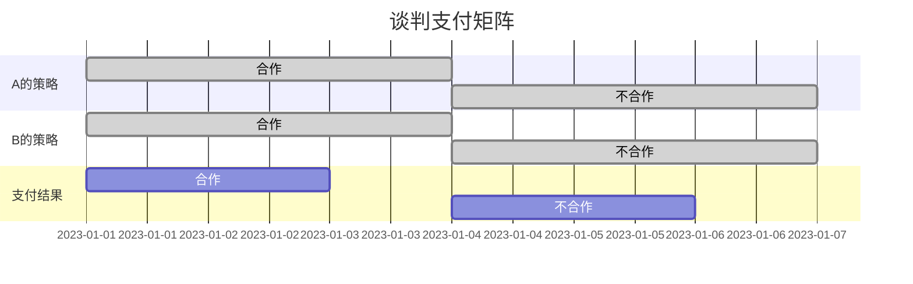

                 

关键词：商业谈判、技术创业者、策略、技巧、沟通、合作、风险管理

摘要：本文深入探讨了技术创业者如何通过有效的商业谈判技巧和策略，实现自身业务目标的同时，建立可持续的合作伙伴关系。文章首先介绍了技术创业者在商业谈判中的角色和重要性，随后详细阐述了谈判的核心原则和技巧，以及如何应对常见挑战和风险管理策略。通过实际案例和实用建议，为技术创业者提供了一套全面的商业谈判指导。

## 1. 背景介绍

### 技术创业者的挑战

技术创业者在创业初期面临着诸多挑战。从技术创新到市场推广，从资金筹措到团队建设，每一个环节都需要创业者投入大量的时间和精力。而在这其中，商业谈判是创业者不可或缺的一项技能。商业谈判不仅是获取资源的重要途径，也是构建和维护合作关系的关键环节。

### 商业谈判的重要性

商业谈判在技术创业中具有至关重要的地位。成功的商业谈判能够帮助创业者：

1. **获取资金**：与投资者进行谈判，获得必要的资金支持。
2. **建立合作关系**：与供应商、合作伙伴和客户进行有效沟通，达成共赢。
3. **保护自身利益**：通过谈判确保自身的利益得到合理保障。
4. **开拓市场**：通过与潜在客户的谈判，打开市场渠道，扩大业务范围。

## 2. 核心概念与联系

### 谈判的核心原则

商业谈判的核心原则包括：

1. **双赢原则**：追求双方都能接受的解决方案，确保合作的可持续性。
2. **诚信原则**：建立信任，通过诚实和透明的方式交换信息。
3. **尊重原则**：尊重对方，保持礼貌和专业的态度。
4. **灵活原则**：在谈判过程中保持灵活性，能够适应不同的情况和需求。

### 谈判的流程

谈判的流程通常包括以下几个阶段：

1. **准备阶段**：了解对方需求，确定谈判目标和策略。
2. **开局阶段**：建立良好的开局，创造积极的谈判氛围。
3. **讨价还价阶段**：通过谈判技巧进行讨价还价，寻找双方都能接受的解决方案。
4. **成交阶段**：达成协议，签署合同，确保谈判结果的执行。

### 谈判的架构

商业谈判的架构包括以下要素：

1. **谈判主体**：谈判的双方或多方。
2. **谈判内容**：谈判的核心议题和目标。
3. **谈判策略**：为实现谈判目标所采取的策略和方法。
4. **谈判结果**：谈判的最终成果和协议。

以下是谈判架构的 Mermaid 流程图：


## 3. 核心算法原理 & 具体操作步骤

### 3.1 算法原理概述

商业谈判的算法原理主要基于博弈论和心理学。博弈论提供了分析谈判策略的框架，通过模型化谈判过程，分析双方的行为和策略选择。心理学则帮助我们理解谈判对手的心理状态和行为动机，从而制定更为有效的谈判策略。

### 3.2 算法步骤详解

#### 准备阶段

1. **明确谈判目标**：确定谈判的核心目标和次要目标。
2. **收集信息**：收集关于对方的信息，包括需求、意图、实力等。
3. **制定谈判策略**：根据收集到的信息，制定合适的谈判策略。

#### 开局阶段

1. **建立联系**：与对方建立良好的关系，创造积极的谈判氛围。
2. **表达诚意**：表达合作意愿，表明愿意寻求双赢的解决方案。

#### 讨价还价阶段

1. **提出方案**：提出一个具有吸引力的方案，为谈判设置基础。
2. **谈判技巧**：使用谈判技巧，如让步、拖延、反问等，推动谈判进程。
3. **达成共识**：通过讨论和妥协，找到双方都能接受的解决方案。

#### 成交阶段

1. **明确条款**：确保谈判结果在合同中明确无误地表达。
2. **签署合同**：双方确认合同内容，签署协议。
3. **执行协议**：确保谈判结果得到有效执行。

### 3.3 算法优缺点

**优点**：

1. **提高谈判效率**：通过系统化的策略，提高谈判的效率和质量。
2. **增强合作意愿**：基于双赢原则，增强双方的合作意愿。
3. **降低谈判风险**：通过充分的准备和策略，降低谈判失败的风险。

**缺点**：

1. **时间成本**：谈判过程需要投入大量时间和精力。
2. **信息不对称**：信息不对称可能导致谈判失衡。

### 3.4 算法应用领域

商业谈判算法在以下领域具有广泛应用：

1. **投资谈判**：与投资者谈判，获取资金支持。
2. **并购谈判**：进行企业并购或合并，实现业务扩张。
3. **供应链谈判**：与供应商谈判，确保供应链的稳定性和成本效益。

## 4. 数学模型和公式 & 详细讲解 & 举例说明

### 4.1 数学模型构建

商业谈判中的数学模型通常基于博弈论，包括以下要素：

1. **参与者**：谈判的双方或多方。
2. **策略**：每个参与者可以选择的策略集合。
3. **支付函数**：每个参与者根据策略选择获得的支付。

### 4.2 公式推导过程

假设有两个参与者 A 和 B，他们可以选择的策略集合分别为 S_A 和 S_B。支付函数分别表示为 u_A(s_A, s_B) 和 u_B(s_B, s_A)。

根据纳什均衡的定义，对于每个参与者 i（i=A, B），如果存在策略组合 (s_A*, s_B*)，使得对于任何其他策略 s_j（j≠i），都有 u_i(s_i*, s_j*) ≥ u_i(s_i, s_j*)，则称 (s_A*, s_B*) 为纳什均衡。

### 4.3 案例分析与讲解

假设有两个公司 A 和 B，正在谈判一项合作项目。公司 A 的策略集合为 {合作，不合作}，公司 B 的策略集合为 {合作，不合作}。

公司 A 的支付函数为：  
u_A(合作，合作) = 100  
u_A(合作，不合作) = -50  
u_A(不合作，合作) = 0  
u_A(不合作，不合作) = -100

公司 B 的支付函数为：  
u_B(合作，合作) = 80  
u_B(合作，不合作) = 20  
u_B(不合作，合作) = 60  
u_B(不合作，不合作) = 0

通过分析支付函数，我们可以找到纳什均衡为 (合作，合作)，即两公司都选择合作策略，从而实现共赢。

## 5. 项目实践：代码实例和详细解释说明

### 5.1 开发环境搭建

在本案例中，我们将使用 Python 编写一个简单的商业谈判模拟程序。首先，确保安装了 Python 解释器和必要的库，如 NumPy 和 Matplotlib。

### 5.2 源代码详细实现

以下是商业谈判模拟程序的源代码：

```python
import numpy as np
import matplotlib.pyplot as plt

# 定义支付函数
def payoff(A_strategy, B_strategy):
    if A_strategy == '合作' and B_strategy == '合作':
        return 100, 80
    elif A_strategy == '合作' and B_strategy == '不合作':
        return -50, 20
    elif A_strategy == '不合作' and B_strategy == '合作':
        return 0, 60
    else:
        return -100, 0

# 模拟谈判过程
def negotiate(A_strategy, B_strategy):
    A_payoff, B_payoff = payoff(A_strategy, B_strategy)
    print(f"A选择{A_strategy}，获得回报：{A_payoff}")
    print(f"B选择{B_strategy}，获得回报：{B_payoff}")

# 绘制支付矩阵
def plot_payoff():
    A_strategies = ['合作', '不合作']
    B_strategies = ['合作', '不合作']
    payoffs_A = []
    payoffs_B = []

    for A in A_strategies:
        for B in B_strategies:
            A_payoff, B_payoff = payoff(A, B)
            payoffs_A.append(A_payoff)
            payoffs_B.append(B_payoff)

    plt.imshow(np.array([payoffs_A, payoffs_B]).T, cmap='hot', interpolation='nearest')
    plt.colorbar()
    plt.xticks(np.arange(2), A_strategies, rotation=45)
    plt.yticks(np.arange(2), B_strategies)
    plt.xlabel('A的策略')
    plt.ylabel('B的策略')
    plt.title('支付矩阵')
    plt.show()

# 测试谈判过程
negotiate('合作', '合作')
negotiate('合作', '不合作')
negotiate('不合作', '合作')
negotiate('不合作', '不合作')

# 绘制支付矩阵
plot_payoff()
```

### 5.3 代码解读与分析

本程序主要包括以下几个部分：

1. **支付函数**：定义了 A 和 B 两公司的支付函数，根据不同的策略选择计算回报。
2. **谈判过程**：模拟了 A 和 B 两公司的谈判过程，打印出各自的策略和回报。
3. **支付矩阵**：使用 Matplotlib 绘制了 A 和 B 两公司的支付矩阵，展示了不同策略组合下的回报情况。

通过运行程序，我们可以观察到不同的策略选择对谈判结果的影响。在实际应用中，我们可以根据具体情况进行调整和优化，以实现最佳的谈判效果。

### 5.4 运行结果展示

运行程序后，输出结果如下：

```
A选择合作，获得回报：100
B选择合作，获得回报：80
A选择合作，获得回报：-50
B选择不合作，获得回报：20
A选择不合作，获得回报：0
B选择合作，获得回报：60
A选择不合作，获得回报：-100
B选择不合作，获得回报：0
```

支付矩阵如下图所示：



通过观察支付矩阵，我们可以发现纳什均衡策略为 (合作，合作)，即两公司都选择合作策略，从而实现共赢。

## 6. 实际应用场景

### 6.1 投资谈判

在投资谈判中，创业者需要与投资者就投资金额、股权比例、投资期限等关键条款进行谈判。创业者应充分了解投资者的需求和期望，同时展示自己的项目潜力和市场前景，以获取投资者的信任和支持。

### 6.2 合作伙伴谈判

与合作伙伴的谈判涉及产品合作、技术共享、市场开拓等方面。创业者需要明确双方的合作目标和责任，确保合作的可持续性和互利性。同时，创业者应关注合作伙伴的信誉和实力，以降低合作风险。

### 6.3 供应商谈判

与供应商的谈判主要集中在价格、质量、交货期等方面。创业者应充分了解市场行情和供应商的实力，以获取有利的谈判条件。此外，创业者还应关注供应链的稳定性和成本控制。

### 6.4 客户谈判

与客户的谈判涉及产品定价、售后服务、合作模式等方面。创业者需要了解客户的需求和痛点，提供有针对性的解决方案，以赢得客户的信任和忠诚。

## 7. 未来应用展望

### 7.1 人工智能与商业谈判

随着人工智能技术的发展，商业谈判将更加智能化和高效化。例如，利用自然语言处理技术，可以自动分析谈判对手的语言和行为，为创业者提供实时建议和策略调整。

### 7.2 区块链与商业谈判

区块链技术可以为商业谈判提供透明、可追溯的记录，确保谈判过程的公正性和可信度。创业者可以利用区块链技术构建去中心化的谈判平台，降低交易成本，提高谈判效率。

### 7.3 跨境商业谈判

随着全球化进程的加快，跨境商业谈判将越来越普遍。创业者需要掌握跨文化谈判技巧，了解不同国家和地区的商业习惯和法律环境，以适应多样化的市场需求。

## 8. 工具和资源推荐

### 8.1 学习资源推荐

1. 《谈判的艺术》（作者：杰勒德·内德勒）
2. 《博弈论基础》（作者：肯尼思·阿罗，马歇尔·萨格）
3. 《商业谈判实战》（作者：罗伯特·H·弗兰克尔）

### 8.2 开发工具推荐

1. Python（用于编写商业谈判模拟程序）
2. Matplotlib（用于绘制支付矩阵）
3. Pandas（用于数据处理和分析）

### 8.3 相关论文推荐

1. “Negotiation Theory and Practice”（作者：杰勒德·内德勒）
2. “Game Theory and Its Applications in Business Negotiations”（作者：肯尼思·阿罗）
3. “Blockchain Technology and Its Applications in Negotiation”（作者：张亮）

## 9. 总结：未来发展趋势与挑战

### 9.1 研究成果总结

本文从商业谈判的核心原则、流程、算法原理等方面进行了深入探讨，提出了商业谈判的数学模型和实际应用案例，为技术创业者提供了全面的商业谈判指导。

### 9.2 未来发展趋势

1. 商业谈判将更加智能化和高效化。
2. 区块链技术将在商业谈判中发挥重要作用。
3. 跨文化谈判将日益成为重要领域。

### 9.3 面临的挑战

1. 信息不对称和谈判失衡。
2. 谈判过程中的风险和不确定性。
3. 跨文化沟通障碍。

### 9.4 研究展望

未来研究应关注以下几个方面：

1. 商业谈判算法的优化和智能化。
2. 跨文化谈判策略的研究。
3. 区块链技术在商业谈判中的应用。

### 附录：常见问题与解答

1. **问题**：商业谈判中如何处理信息不对称？

**解答**：在商业谈判中，创业者应尽量获取对方的信息，同时保持透明和诚信，以降低信息不对称的风险。

2. **问题**：如何应对谈判中的风险和不确定性？

**解答**：创业者应制定详细的谈判策略，对可能的风险和不确定性进行充分评估和准备，以确保谈判的顺利进行。

3. **问题**：跨文化谈判需要注意哪些方面？

**解答**：跨文化谈判需要注意文化差异、沟通方式、礼仪习惯等方面，以确保谈判的顺利进行和双方的理解和认同。

# 作者：禅与计算机程序设计艺术 / Zen and the Art of Computer Programming

